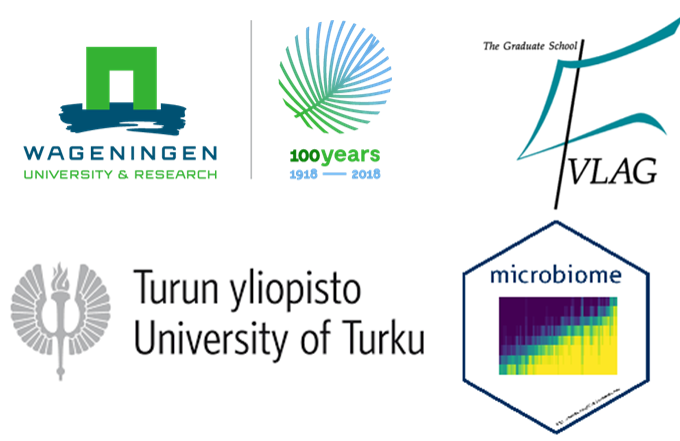
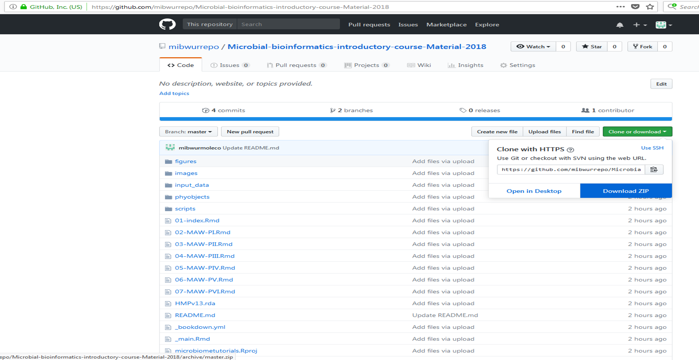
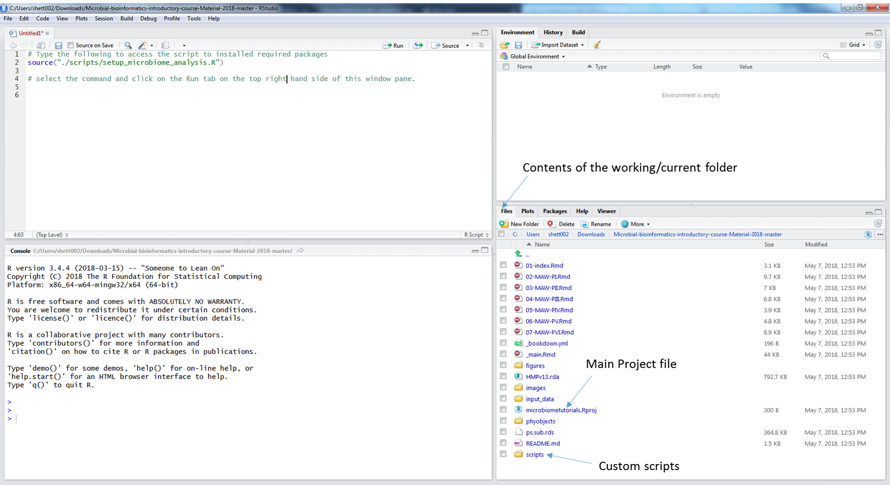

# Introduction  

  

Three day spring school on basics of high throughput 16S rRNA gene sequencing data analysis. This spring school is organised in collaboration with [VLAG graduate school](https://www.vlaggraduateschool.nl/en.htm), [Laboratory of Microbiology](https://www.wur.nl/en/Expertise-Services/Chair-groups/Agrotechnology-and-Food-Sciences/Laboratory-of-Microbiology.htm), [Laboratory of Systems and Synthetic Biology](https://www.wur.nl/en/Expertise-Services/Chair-groups/Agrotechnology-and-Food-Sciences/Laboratory-of-Systems-and-Synthetic-Biology.htm), Wageningen University & Research, the Netherlands and [Department of Mathematics and Statistics University of Turku](https://www.utu.fi/en/units/sci/units/math/Pages/home.aspx), Finland. This year it will be held at [Wageningen University & Research](https://www.wur.nl/en.htm). We will cover topics related to basics of sequencing and microbial community analysis. We will use [NG-Tax]( https://f1000research.com/articles/5-1791/v1) and [R](https://www.r-project.org/) based tools like [Phyloseq](http://journals.plos.org/plosone/article?id=10.1371/journal.pone.0061217), [microbiome](http://microbiome.github.io/microbiome/) and [ggplot2](http://ggplot2.org/) for downstream data analysis and visualization.   

## Preparing for the course

We recommend using your own laptop. If this is not possible, kindly contact the organizers.

Install the following software before the course:

* R 3.5.1 [Download link](https://cran.r-project.org/bin/windows/base/old/3.5.1/).    
* Rstudio [Download link](https://www.rstudio.com/products/rstudio/download/).  

# The version 3 of this tutorial from Apr-11-2020 has been tested using
* R version 3.6.3 [Download link](https://cran.r-project.org/bin/windows/base/old/3.5.1/).    
* Rstudio [Download link](https://www.rstudio.com/products/rstudio/download/).

*Make sure you have admin rights on the machine you install these softwares to avoid access issues.  

Download the master branch of the the github repository for the [course](https://github.com/mibwurrepo/Microbial-bioinformatics-introductory-course-Material-2018).  

  

Unzip the `Microbial-bioinformatics-introductory-course-Material-2018-master.zip` folder. Unzip the `humanmicrobiome.zip` subfolder within the `input_data` folder so that the *humanmicrobiome.biom* file is in `input_data` folder.  
open the `microbiometutorials.Rproj`  

The script to set-up the RStudio environment with required package installations can be found in the folder named `scripts/setup_microbiome_analysis.R`. In the image below, there is description of how to run this code.    

  

## Useful functions/resources     

* [Base R](https://www.rstudio.com/wp-content/uploads/2016/10/r-cheat-sheet-3.pdf)  
* [R Markdown](https://www.rstudio.com/wp-content/uploads/2016/03/rmarkdown-cheatsheet-2.0.pdf)  
* [RStudio IDE](https://www.rstudio.com/wp-content/uploads/2016/01/rstudio-IDE-cheatsheet.pdf)  
* [ggplot2](https://www.rstudio.com/wp-content/uploads/2016/11/ggplot2-cheatsheet-2.1.pdf)  
* [phyloseq](http://journals.plos.org/plosone/article?id=10.1371/journal.pone.0061217)  
* [microbiome](http://microbiome.github.io/microbiome/)  
* [R graphics cookbook](http://www.cookbook-r.com/Graphs/)  
* [List of R tools for microbiome analysis](https://microsud.github.io/Tools-Microbiome-Analysis/)  

## Focus    
The primary aim is introduce microbial community data analysis. There will be talks and discussion on theory and methodology for analysis of microbial community data. We will cover topics ranging from design of studies, sequencing technologies, importance of controls and standardized DNA processing. Supervised hands-on training covering analyses from raw reads using NG-Tax, downstream analysis in R for exploration and analysis of microbiome sequencing data will be priority. There will be a strong focus on using R, R Studio for moving towards reproducible and open science.   

## Target audience  
Anyone who plans to or is currently doing high throughput microbial community analysis.  

# Citation  
If you found this book useful, please cite:  
Shetty Sudarshan A, Lahti Leo, Hermes Gerben DA, & Hauke Smidt. (2020, April 11). Microbial bioinformatics introductory course material 2018 (Version v3.0). Zenodo. http://doi.org/10.5281/zenodo.1436630

*Previous version**  
Shetty Sudarshan A, Lahti Leo, Hermes Gerben DA, & Hauke Smidt. (2018, September 27). Microbial bioinformatics introductory course material 2018. Zenodo. http://doi.org/10.5281/zenodo.1436630

## License  

The 2-Clause BSD License
SPDX short identifier: BSD-2-Clause

Further resources on the 2-clause BSD license
Note: This license has also been called the "Simplified BSD License" and the "FreeBSD License". See also the 3-clause BSD License.

Copyright **2018-2020 Sudarshan A. Shetty and Leo Lahti**  

Redistribution and use in source and binary forms, with or without modification, are permitted provided that the following conditions are met:  

1. Redistributions of source code must retain the above copyright notice, this list of conditions and the following disclaimer.  

2. Redistributions in binary form must reproduce the above copyright notice, this list of conditions and the following disclaimer in the documentation and/or other materials provided with the distribution.  

THIS SOFTWARE IS PROVIDED BY THE COPYRIGHT HOLDERS AND CONTRIBUTORS "AS IS" AND ANY EXPRESS OR IMPLIED WARRANTIES, INCLUDING, BUT NOT LIMITED TO, THE IMPLIED WARRANTIES OF MERCHANTABILITY AND FITNESS FOR A PARTICULAR PURPOSE ARE DISCLAIMED. IN NO EVENT SHALL THE COPYRIGHT HOLDER OR CONTRIBUTORS BE LIABLE FOR ANY DIRECT, INDIRECT, INCIDENTAL, SPECIAL, EXEMPLARY, OR CONSEQUENTIAL DAMAGES (INCLUDING, BUT NOT LIMITED TO, PROCUREMENT OF SUBSTITUTE GOODS OR SERVICES; LOSS OF USE, DATA, OR PROFITS; OR BUSINESS INTERRUPTION) HOWEVER CAUSED AND ON ANY THEORY OF LIABILITY, WHETHER IN CONTRACT, STRICT LIABILITY, OR TORT (INCLUDING NEGLIGENCE OR OTHERWISE) ARISING IN ANY WAY OUT OF THE USE OF THIS SOFTWARE, EVEN IF ADVISED OF THE POSSIBILITY OF SUCH DAMAGE.  
