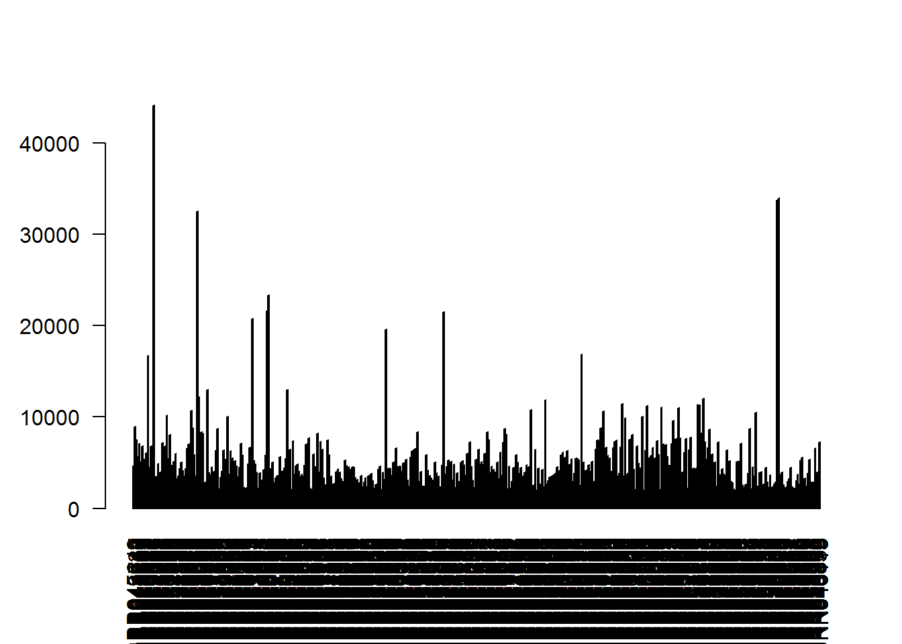
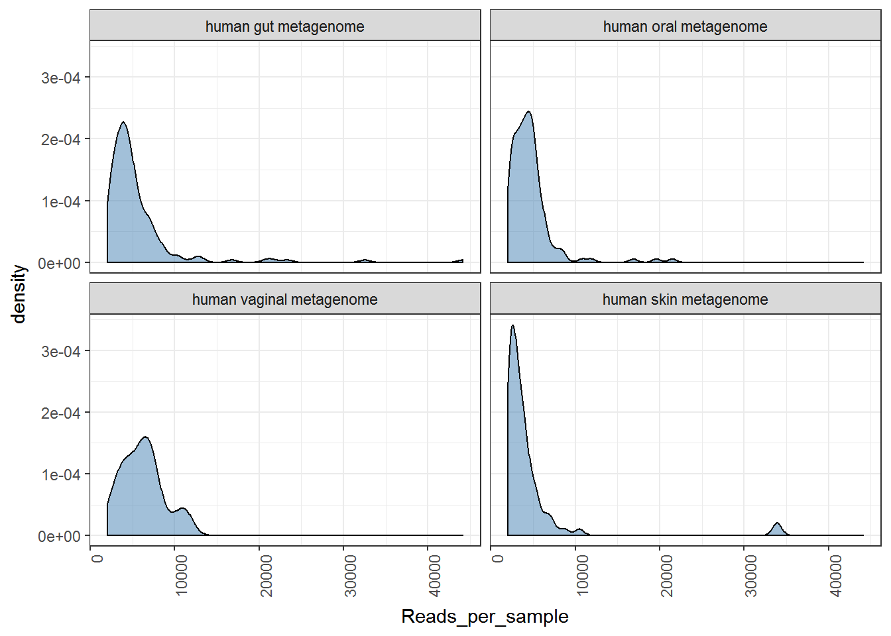
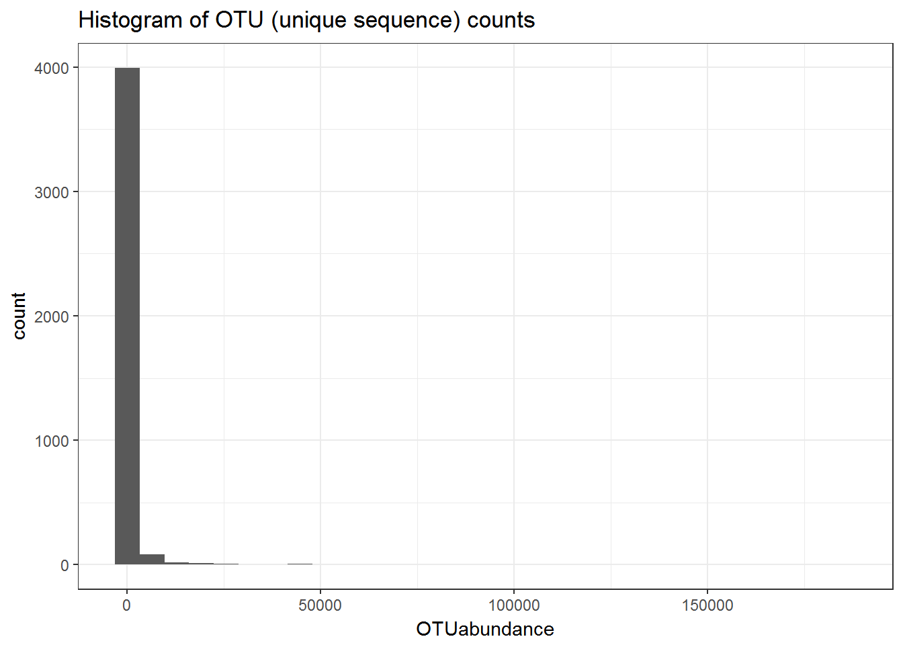
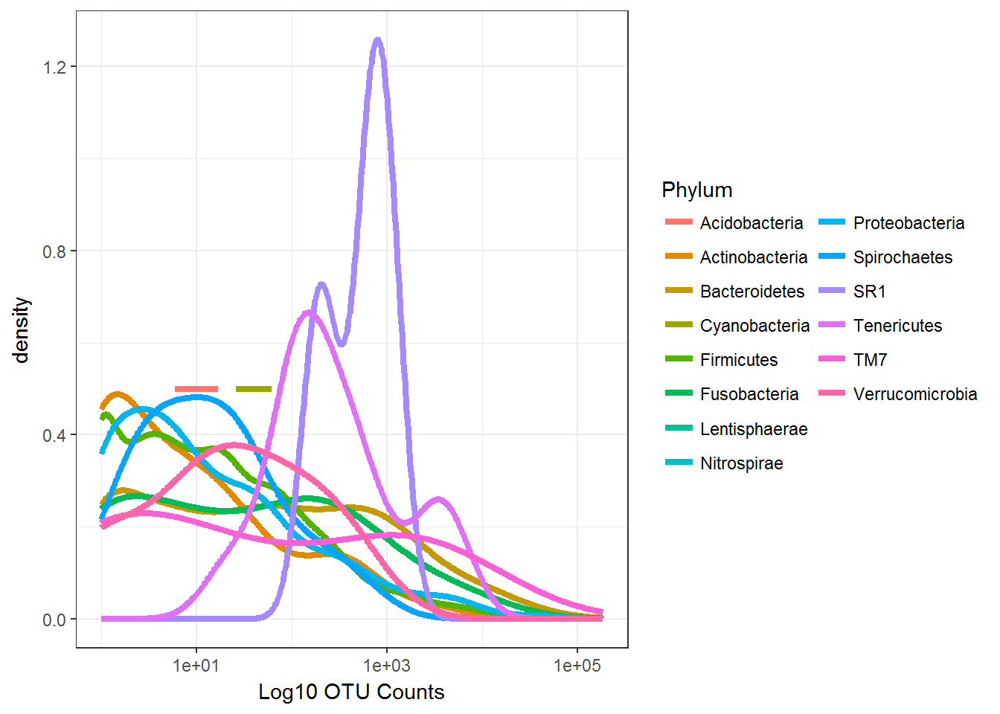
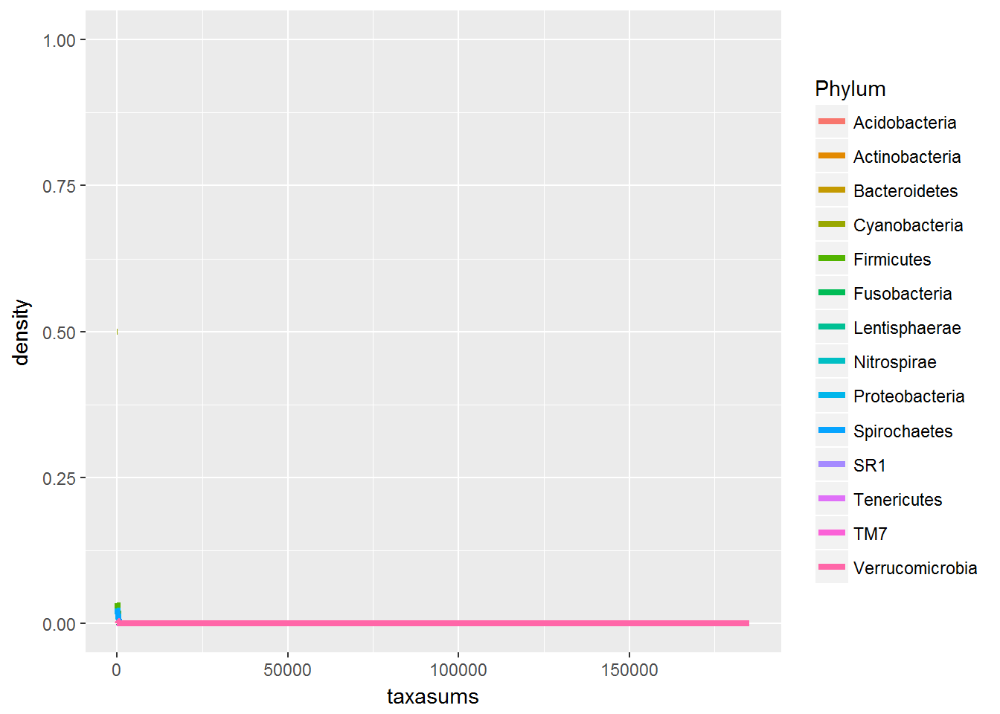
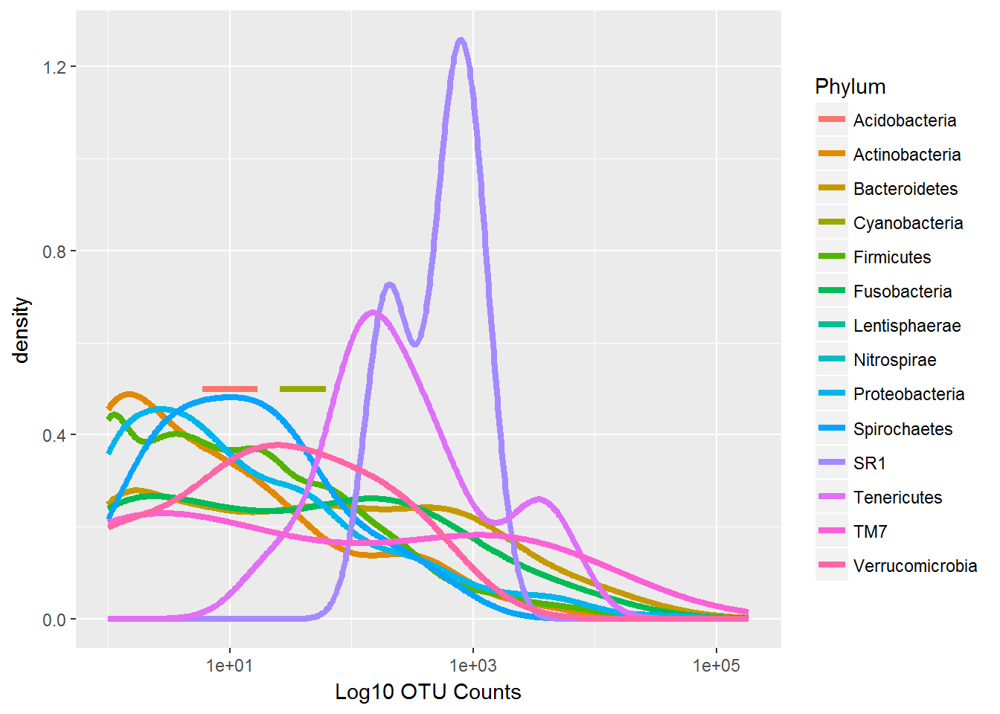
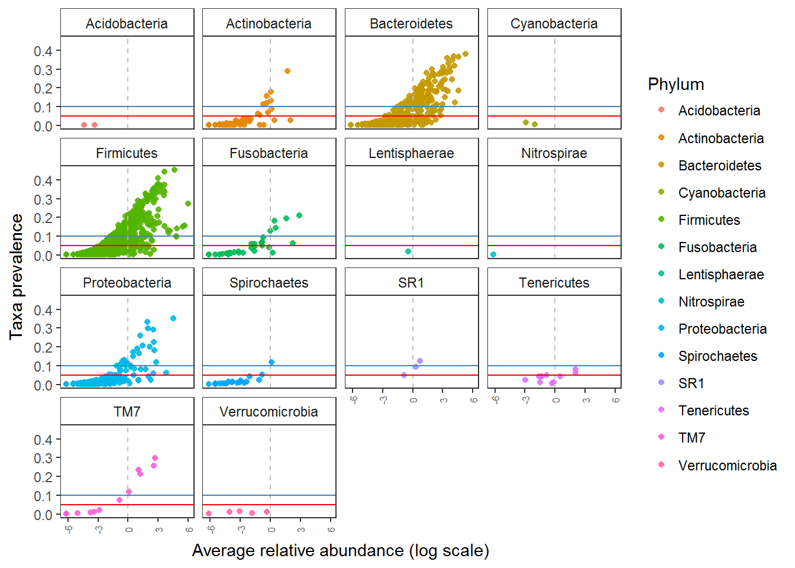
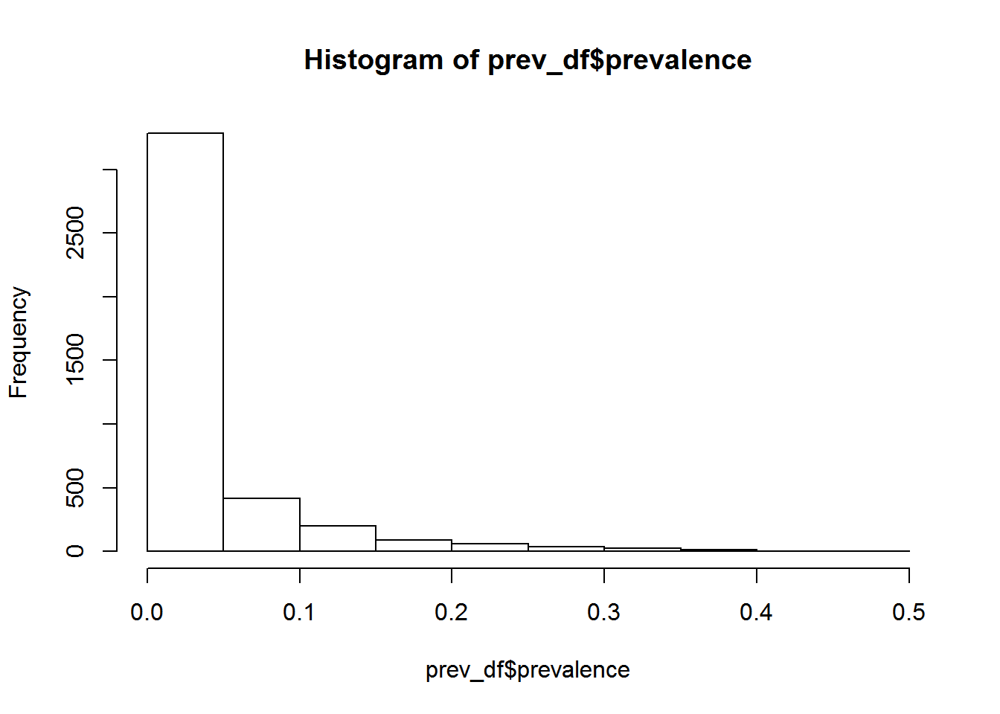

# Set-up and Pre-processing  

This tutorial will introduce you to basics of microbial community analysis. More importantly on how to look at you data and filter appropriately. We will use the [Human microbiome project phase I data](https://www.ncbi.nlm.nih.gov/pubmed/22699609). The 16S rRNA gene variable region sequenced here is V1-V3. The raw reads were processed using QIIME 1.9.1, SortMeRNA, and OTU picking was done using the Closed-reference OTU-picking at 97% identity.   

The main tools used here are [Phyloseq](https://joey711.github.io/phyloseq/) and [microbiome](http://microbiome.github.io/microbiome/)
Kindly cite all the packages and tools that you have used in your analysis. Also make sure that you provide the scripts you used for analysis as supplementary material with your research article.    
Check [Quick-R](http://www.statmethods.net/).  

## Structure    

Let us create few folders to organize our analysis. While this can be personal preference, make sure you write the structure to guide others who do not know your data well. This is important like the *old days* hand-writing should be readable to understand.      


```r
# Create Folders as following

#Tables  

dir.create("tables")

# Figures 

dir.create("figures")  

# Phyloseq objects  

dir.create("phyobjects")  

# Custom codes/notes  

dir.create("codes_notes")
```

**Load packages**  


```r
library(microbiome) # data analysis and visualisation
library(phyloseq) # also the basis of data object. Data analysis and visualisation
library(microbiomeutilities) # some utility tools 
library(RColorBrewer) # nice color options
library(ggpubr) # publication quality figures, based on ggplot2
library(DT) # interactive tables in html and markdown
library(data.table) # alternative to data.frame
library(dplyr) # data handling  
```

## Making a phyloseq object  

This is the basis for your analyses. In this phyloseq object, information on OTUs, taxonomy, the phylogenetic tree and metadata is stored. A single object with all this information provides a very convinient way of handling data.
Please remember that the metadata (i.e. mapping) file has to be in *.csv format (columns have sample attributes).
Below you can see how the mapping file has been used.   

For more infromation: [phyloseq](http://joey711.github.io/phyloseq/import-data) 

**Things to be done in QIIME terminal (if required):**
**Important Note 2**: If you have error in loading the biom files stating **JSON or HDF5** then you need to convert it in to a JSON format.  

For this, use the following command within the QIIME terminal and not in R!  


```r
# biom convert -i NGTaxMerged.biom -o ngtax_json.biom --table-type "OTU table" --to-json    
```

For more information on the biom format please  [click here](http://biom-format.org/documentation/biom_conversion.html). 

**Important Note 3**: The most recent version of NG-Tax does not have this issue. 


**NOTE**     
Update to latest version of Microbiome package to use the `read_phyloseq` function. This function can be used for reading other outputs (like .shared and consensus taxonomy files from mothur) into phyloseq object.     


## Read input to phyloseq object


```r
# may take anywhere between 30 seconds to 2 or more minutes to create a phyloseq object depending on the size of biom file and your PCs processing strength.

pseq1 <- read_phyloseq(otu.file = "./input_data/NGTaxMerged_conv.biom", taxonomy.file = NULL, metadata.file = "./input_data/mappingMerged_edit.csv", type = "biom")
```

```
## Time to complete depends on OTU file size
```

## Read the tree file.

Note: requires a package called `ape` and the extension has to be ".tre" and not ".tree" (you can just change the name of the file extension)


```r
# Load tree file
library(ape)
```

```
## 
## Attaching package: 'ape'
```

```
## The following object is masked from 'package:ggpubr':
## 
##     rotate
```

```r
treefile_p1 <- read.tree("./input_data/combinedTree.tre")
```

## Merge into phyloseq object.


```r
ps0 <-merge_phyloseq(pseq1,treefile_p1)
# ps1 is the first phyloseq object.

rank_names(ps0) #we check the taxonomic rank information 
datatable(tax_table(ps0)) # the table is interactive you can scrol and search thorugh it for details.
```

## Read test data

If you dont have your own biom file, we have a test dataset.  
The data for tutorial is stored as *.rds file in the R project folder.  

We will use the [Human microbiome project phase I data](https://www.ncbi.nlm.nih.gov/pubmed/22699609).


```r
ps0 <- readRDS("ps.sub.rds")

# use print option to see the data saved as phyloseq object.

print(ps0)
```

```
## phyloseq-class experiment-level object
## otu_table()   OTU Table:         [ 4125 taxa and 474 samples ]
## sample_data() Sample Data:       [ 474 samples by 31 sample variables ]
## tax_table()   Taxonomy Table:    [ 4125 taxa by 7 taxonomic ranks ]
## phy_tree()    Phylogenetic Tree: [ 4125 tips and 4124 internal nodes ]
```

How many OTUs do you find?    
How many samples?  

Alternatively, you can also check you data as shown below:  


```r
# check for number of samples 
nsamples(ps0)
```

```
## [1] 474
```

```r
# check for number of samples 
ntaxa(ps0)
```

```
## [1] 4125
```

```r
# check for sample variables 
sample_variables(ps0)
```

```
##  [1] "X.SampleID"                  "BarcodeSequence"            
##  [3] "LinkerPrimerSequence"        "run_prefix"                 
##  [5] "body_habitat"                "body_product"               
##  [7] "body_site"                   "bodysite"                   
##  [9] "dna_extracted"               "elevation"                  
## [11] "env"                         "env_biome"                  
## [13] "env_feature"                 "env_material"               
## [15] "env_package"                 "geo_loc_name"               
## [17] "host_common_name"            "host_scientific_name"       
## [19] "host_subject_id"             "host_taxid"                 
## [21] "latitude"                    "longitude"                  
## [23] "physical_specimen_location"  "physical_specimen_remaining"
## [25] "psn"                         "public"                     
## [27] "sample_type"                 "scientific_name"            
## [29] "sequencecenter"              "title"                      
## [31] "Description"
```


```r
# check for unique values in variables  

unique(sample_data(ps0)$scientific_name)
```

```
## [1] human gut metagenome     human oral metagenome   
## [3] human vaginal metagenome human skin metagenome   
## 4 Levels: human gut metagenome ... human skin metagenome
```

Which metagenomes do you see?

**Important Note 4**  

Always keep track of the filtering steps you performed and make a note of it!

## Pre-processing data check   

### Sequencing depth  

Crude visualization of the sequencing depth for individual samples.


```r
# simple bar plot  

barplot(sample_sums(ps0), las=2) # here las=2 will rotate the label of X-axis
```



```r
# try typing ?barplot
```

You can see there is uneven sequencing depth.  


```r
summary(sample_sums(ps0))
```

```
##    Min. 1st Qu.  Median    Mean 3rd Qu.    Max. 
##    2011    3142    4328    5184    5855   44106
```

From the above plot and summary, it is evident that there is a large difference in the sequencing depth. 
Let us check for our important variable


```r
p_seqdepth <- plot_read_distribution(ps0, "scientific_name", "density")
```

```
## [1] "Done plotting"
```

```r
print(p_seqdepth)
```



```r
ggsave("./figures/read_distribution.pdf", height = 4, width = 6)
```

What do you see from this plot?  

### Distribution of OTUs    


```r
# We make a data table with information on the OTUs
ps0_df_taxa =data.table(tax_table(ps0),OTUabundance = taxa_sums(ps0),OTU = taxa_names(ps0))
ps1_tax_plot <- ggplot(ps0_df_taxa, aes(OTUabundance)) + geom_histogram() + ggtitle("Histogram of OTU (unique sequence) counts") + theme_bw()
print(ps1_tax_plot)
```

```
## `stat_bin()` using `bins = 30`. Pick better value with `binwidth`.
```



Check how different phyla are represented in the total data.


```r
taxasums = rowSums(otu_table(ps0))
  
taxatable <- as.data.frame.matrix(tax_table(ps0))


tax_plot1 <- ggplot(taxatable, aes(x = taxasums, color = taxatable[, "Phylum"])) 
tax_plot1 <- tax_plot1 + geom_line(size = 1.5, stat = "density") 
tax_plot1 <- tax_plot1 + theme_bw() 
tax_plot1 <- tax_plot1 + guides(color=guide_legend(title="Phylum", nrow = 8)) 
tax_plot1 + scale_x_log10() + xlab("Log10 OTU Counts") 
```



```r
ggsave("./figures/Distribution of OTUs.pdf", height = 4, width = 6)
```


Another way to identify dominant and rare outs in the dataset is as follows:  


```r
p <- plot_taxa_prevalence(ps0, "Phylum")
p
```



```r
ggsave("./figures/OTU prevalence.pdf", height = 4, width = 6)


# Set reference to check OTUs present in less than 10%  

p <- p + geom_hline(yintercept = 0.1, color = "steelblue")
p
```



```r
# Set reference to check OTUs present in less than 5%  

p <- p + geom_hline(yintercept = 0.05, color = "red")
p
```



We can extract the prevalence and abundance data used for previous plot.  


```r
prev_df <- p$data

head(prev_df)
```

```
##          abundance  prevalence Phylum
## 4213913 -0.8729403 0.048523207    SR1
## 4330849  0.7324490 0.124472574    SR1
## 4400869  0.3080430 0.092827004    SR1
## 4440970 -0.8579024 0.075949367    TM7
## 4299136 -6.1612073 0.002109705    TM7
## 3103396 -3.7633120 0.008438819    TM7
```

Use this data for some checks.  


```r
# check for distribution of prevalence values  

hist(prev_df$prevalence)
```



```r
# What can you see from the histogram?

# Check total OTUs
nrow(prev_df)
```

```
## [1] 4125
```

```r
# Check how many are present in  less than 5% samples  
nrow(prev_df[prev_df$prevalence > 0.05, ])
```

```
## [1] 843
```

```r
# now check if you put this as a threshold for filtering how many OTUs will you loose?

nrow(prev_df[prev_df$prevalence > 0.05, ])/nrow(prev_df) *100
```

```
## [1] 20.43636
```

20.4% of the OTUs will be lost. Check with the prevalence plot and see which OTUs will be lost.  

One of the common artifacts in sequencing data and taxonomy assignments is the classification of mitochondria and chloroplast.  


```r
datatable(tax_table(ps0))
```

<!--html_preserve--><div id="htmlwidget-ecdd6205c7ac72fd3f76" style="width:100%;height:auto;" class="datatables html-widget"></div>
<script type="application/json" data-for="htmlwidget-ecdd6205c7ac72fd3f76">{"x":{"filter":"none","data":[["4213913","4330849","4400869","4440970","4299136","3103396","4323100","4365684","584516","4339528","4458736","1887417","4393962","799024","4343202","525269","627481","269386","180684","86812","4442127","4425150","4394095","32546","386273","246717","4326219","1616059","4375688","4401957","256106","339660","678813","231154","790312","266510","818495","1141382","843226","129907","219439","342724","1139932","766791","58864","509447","790758","192227","302302","140235","525199","2371693","246739","255518","846710","4456104","1106617","704110","107526","114922","4376293","571873","4307464","238109","210485","827612","656307","153304","137385","813906","815303","156371","160102","2092174","4394099","4330972","63117","978067","4311254","4380570","1067006","92601","4296513","76751","4310192","4310829","945908","4447416","4366522","1722468","1007399","4396235","344593","4298899","1086582","355750","335112","4326635","1060621","470724","516198","942534","851932","562992","4344933","4401186","1026498","1084952","4337383","1106060","900973","829733","838992","94022","277373","832598","4449236","4341497","359809","189076","112891","1105376","437137","215097","179261","41229","636296","4371362","801210","178885","529652","848669","183798","111135","1974536","4473506","2201995","4142052","317819","141700","152125","325752","339616","809643","1111342","4195429","3275744","181996","766159","831328","147685","7366","70632","7369","144380","2353709","661838","912149","166064","339053","134201","539915","813047","332293","200536","541424","4307977","677064","253494","109382","3169284","4367588","220314","1147718","516182","4344943","4315538","4419825","4368827","4405881","819770","156646","4438992","545997","4435455","783719","225259","805044","1116384","4354039","286874","4375268","100791","280799","284848","932848","808851","141564","332557","1144619","782289","669356","640071","573409","326605","521384","108909","106711","4028110","326069","1135220","750018","543864","541859","280459","744371","279948","282250","544313","352503","290510","791973","3825935","971907","4417053","341460","153997","4431938","4383918","4374638","4404220","4356832","968675","4477696","1671681","865469","4295743","4347099","4473129","4320756","4391641","316852","4406393","1069169","517548","4354267","4408085","4336077","4443574","4471251","4407093","1017413","4335776","862115","4353757","953463","963216","4207350","4363066","92231","4334748","4428177","299267","231787","814442","197286","580295","614182","553208","554163","136946","300729","825989","560629","299851","301184","301149","1104638","345362","289709","544824","205417","687792","669175","4331183","1101413","564290","541119","811219","2529285","811492","752584","163421","674696","356864","4416562","91557","4345397","226404","251387","810831","238820","289261","754778","581782","3829957","165489","1108679","3728119","816512","330951","464480","613414","521318","322927","840291","206938","2326547","4333705","302312","439982","4449456","889025","928776","342876","321584","1523627","248521","219826","533457","4376233","1126691","246528","886728","1096712","1090306","574102","356523","246864","1041758","608710","4396234","4307888","4296858","315994","4315254","213493","2397567","3464844","2529960","3229180","4484060","1918929","2344267","2682867","3225199","4435655","48487","1136316","4430956","1143359","104181","4422872","806955","350604","4316932","1077185","253550","125230","245523","350071","4310221","306885","4373301","290455","23709","1124080","3940440","194667","184209","2243510","336012","183817","175535","190815","185722","315429","356052","2550809","327050","4381422","4235585","4329090","183012","3943182","177222","3154070","1919007","189384","4381553","1749079","184174","180421","4357712","4174963","2137001","4029632","4468234","2874602","4417325","171559","301578","205904","191483","513445","183496","211706","187841","193591","4358723","844375","194909","157327","189920","182052","197214","186358","332588","177343","198711","185888","4467447","176071","190638","188887","2921213","199716","186352","188735","198788","182854","4232045","580629","577170","336710","177150","182255","184753","192839","3472078","550814","352825","296045","331193","176410","180141","174978","353782","185604","183662","321811","190309","319621","185476","589071","348027","182886","189938","3327894","183870","2876801","196664","197072","197490","572476","187178","297057","186866","176660","178253","359538","4322986","1950496","1105984","176564","228601","338754","4379411","181239","192055","174646","560336","186841","192684","188113","178064","178810","194341","175485","195258","4331736","535375","187443","2653002","187623","308598","178763","195781","524318","195157","197537","2237211","2198356","182157","1703712","193233","182874","4360055","71331","3745352","4484034","176230","357582","192255","4301298","4437362","180834","182117","174036","184610","184567","195508","187324","311482","192111","185730","183579","355291","1135084","364179","176034","183603","4372578","2380160","292260","2362317","208949","360000","187179","369449","213813","365496","187751","187388","4368216","188706","323325","320291","212164","213566","209685","526690","190233","898309","999477","4310398","1086036","1052181","4399781","545772","548730","557665","4302571","4448694","4439766","236154","763967","71799","851923","495394","1077373","712179","22951","4329957","296082","4346863","4317959","4395888","146094","851961","72964","610111","1011398","240049","1033687","529349","586066","4304901","625159","4480777","561036","4308970","4300503","4426163","4302472","4315804","4303237","1541939","922964","515747","4449250","224731","243956","3755854","849704","1066814","851634","4307006","92629","4382476","73324","741701","4430843","4466203","2635230","4332410","1028549","747980","4320561","851668","246785","72112","705241","4321398","663885","134265","74407","328936","4404224","2037235","294196","840914","558839","545061","3035308","180825","307571","289257","518820","514512","849535","292921","516464","296442","2550241","509109","345899","300650","195574","339221","344318","174831","568118","215670","189083","196296","186974","329650","342638","178387","178860","291725","515798","531614","198502","328035","197994","349786","196729","521450","190526","314613","346938","301253","321875","1042479","651897","4460404","4428060","4385687","4308270","4465561","4307652","4451252","935742","4469722","525942","4306852","4479603","4307391","4321397","103768","4323490","4454385","41911","4401235","70671","239506","530206","4458304","642465","591785","326403","198869","302538","516457","513664","319810","369077","338476","179806","4465204","4438147","4432430","2714267","4430581","2469654","361507","4459265","861780","1065387","403318","398192","93000","799211","4295238","4354870","4324196","338381","335132","302235","312973","301956","1136390","4385760","523483","519766","178296","509621","584484","347875","366147","165118","181432","1106254","1105591","308507","174805","804995","331784","323139","530865","1115121","188851","177679","216290","302663","211743","196240","186351","290764","199698","178803","183106","336676","177427","263662","191994","313757","310215","213671","772282","199534","107044","4127460","1530340","357046","184725","176108","4457064","4325533","171772","2617854","216550","4331760","1107652","216599","214031","4336943","196131","194646","847427","3579707","850586","535549","4420669","287576","208479","525344","355246","4339144","190639","4446973","4441084","194286","4308591","276149","4372003","342873","196219","180082","314406","306160","4418496","4477019","847228","851323","514363","518538","522582","520864","1109552","191251","179157","177313","291090","578016","161238","840027","564140","198190","174842","4459021","4443201","3160267","850905","552779","197517","294909","563532","175844","189960","180133","3090117","4470870","4393540","194395","190975","183395","199354","4356080","512702","180045","183480","178478","351292","185420","221758","4340587","530164","767270","4412630","862136","4294607","4298483","4315834","4321559","970138","4301737","4409545","3218290","4465803","71638","2613485","692756","1097961","676761","495086","1036271","884827","495017","4336892","4467982","573034","308956","4303759","1940","874462","495451","364538","99517","576960","1106150","4433523","4323508","4313141","4312247","4366487","557100","249740","71957","92636","4338511","4294954","983098","4417749","4451646","2394","4426946","4425690","4436135","4299087","4422565","4388707","4447993","4333110","878951","4296512","1145553","873747","814504","887744","4307843","4350466","4394667","4433676","977686","1049053","219189","1144747","106019","123752","4300270","811452","993578","89839","4154872","547181","366311","150994","99322","280968","808728","4340454","3907","3906","124932","648610","4307228","3943","4295418","4376637","3931","4427066","4347875","2372755","95168","565720","3823","3859","4447514","2836861","4459671","2055565","548233","791348","809658","113542","4453773","364203","817135","361170","113417","1106498","624858","4458184","4299456","292521","362214","370225","137183","132041","4411875","12464","152004","1131091","341094","180611","12394","845354","283765","200634","866280","516648","903426","1092725","4306178","4360320","4431443","4314814","4297838","567669","298835","695452","2692410","844122","739867","4327769","804621","104135","526682","1089121","12574","787709","4334479","951711","909624","1108638","1032841","4318624","4306166","4336070","4416015","4306356","4403574","92123","92721","92874","4473227","4449198","877991","4463237","4467993","888466","875735","484320","4439443","4350387","515169","521221","164500","764322","393051","4422519","1000986","4306357","4309380","529001","495515","855538","370772","165421","931727","992354","652276","1127215","311035","200629","290686","273232","185186","178331","182176","2136916","4335450","609533","4307343","4430826","4400260","252843","549823","648553","11296","4441038","4397771","251967","4308098","4458755","92131","257278","4483174","714461","4443207","31235","351979","444857","572237","4313722","518865","545299","4452538","4299137","4322998","4369050","4448731","4405932","4307309","828676","572889","342025","4400372","3991527","1041236","4364515","656443","4389633","1140833","364872","553653","4463542","155535","150828","540946","247036","569397","270598","27227","138304","441155","697578","2611121","720949","1016369","225786","815819","889661","727447","970318","288492","262857","368134","614083","496787","388506","817550","928538","1068955","1102057","917641","939252","1084906","971038","1075891","938243","4345285","386899","1020410","1084865","944063","1039477","870751","1056769","867304","1055132","1995363","3385021","330679","995155","979261","981783","4130483","356733","2356875","853867","1814180","943389","1037951","1041410","870118","908233","868615","1086805","1005406","1056626","1023241","908663","439908","817115","366926","197398","250116","561839","578911","4389886","960131","894774","444649","377874","934488","770499","4361784","4423603","644946","3333303","71833","673019","4336960","373689","341322","248902","178759","4388068","569244","4349867","42538","4308127","4305923","306647","4393181","4422512","15806","519677","1069592","1081134","898207","4337578","945064","1102921","1005533","4426626","2930734","996167","929580","899059","1027587","993647","864640","1059729","1625449","963239","240694","894560","864021","4200918","1995182","187233","133341","331248","308249","137580","134726","821597","4321285","15129","236308","129798","133075","130864","276632","456393","131921","586141","332718","31171","289918","347367","329402","3946926","4374663","536754","411486","355305","137043","254011","99634","315189","220122","324926","128227","128300","47365","131702","463361","133065","132873","584571","131660","589114","4326573","254021","4482227","299516","298813","842413","4373641","339358","4358602","338757","290235","322250","851733","484444","74576","178213","26608","292057","4480189","751601","770290","766768","29012","162955","295478","226338","289933","3355047","950828","1100972","637409","288680","557570","93099","544419","303204","571744","289974","516966","908873","358343","4384044","2358923","1021043","54794","197273","1079866","516611","910353","98605","4467992","4371765","4305815","526131","2959075","1888677","217734","799884","4416763","3678349","528357","526804","4321136","2024840","4430300","4439603","2163247","4406162","3166216","4402254","4373680","993705","538185","92535","967427","883387","4306048","1030575","949396","910500","982306","863124","4314454","4383049","4346614","1049574","969707","1005952","1078207","4318710","1000547","523025","517754","4298702","871442","1007430","4320312","4407586","4424886","4455250","4428042","4315069","4399761","4320317","4456236","4309301","4432042","4366889","4347865","1010458","968629","4306177","4479989","868337","1759711","894045","923098","521996","1018482","525966","561636","2819725","1935279","59566","3384047","4322712","4315958","168583","15431","1085410","879972","894969","859700","557978","532232","1059655","1079708","1076557","868817","939112","272150","989579","1076969","968954","1082539","1048420","529233","911496","509773","152823","1051669","4307484","4310500","4448456","4372206","4438988","4325272","4325275","4337090","965500","3449122","522025","911808","881857","872004","915428","4413917","91266","1764742","1008648","1096652","945519","995149","15076","611931","858896","905088","1074210","1015143","925707","523036","967433","1065569","882765","1036749","903184","36255","4444200","4384936","1011983","4342860","4443237","4337755","4446902","995822","4367364","4453535","384716","367215","4472240","3297756","836693","3768971","3115847","273657","364289","531495","42091","4310024","1099710","710432","231310","320553","2235415","843569","179499","1056816","121873","858999","4406818","196391","302164","755148","841344","902711","4320423","895653","132546","4395884","851704","3452790","14289","134786","14285","968342","30062","4349518","937813","902837","430691","14287","14286","793524","530676","303963","207340","189936","4335578","790466","214036","43339","187517","92043","591439","197505","208539","216010","4093791","820843","787663","76547","342827","189407","422295","4398594","3537764","4429031","4305384","2510539","2901960","184940","186610","217109","319455","188881","348609","182861","324015","110842","4477971","158836","589989","180121","540862","187386","194372","175828","350503","538322","183885","178078","4375889","196736","199460","186812","192086","179585","291270","307526","197578","351927","183715","192945","322895","176204","183681","178904","302160","184426","341221","186913","307978","315589","188747","322433","192339","360808","175497","302333","327818","192698","819181","819353","197179","296941","230479","308814","303648","327176","196210","288318","523244","185787","183439","198151","191075","186640","843442","291017","290637","4326866","251970","207174","324157","343719","332803","316539","183592","178845","178888","197288","360761","183720","191553","369827","4446669","198248","198031","180108","128297","515774","195214","178957","299695","303137","299732","341138","187123","197111","197095","190220","195102","1062061","362078","296113","188192","185622","197540","205241","1790209","178497","4315787","170640","335408","183071","182030","455805","564320","175630","212532","213870","181174","191829","313178","179186","177379","192496","185597","186559","195882","760544","191068","187272","1126577","189309","178713","183829","178121","211191","198133","181234","191490","182595","178799","179961","192749","544859","157453","3390534","175962","258099","175910","4468892","183454","4398588","192893","1106362","196632","187668","180674","174497","363389","354540","183534","1870447","4377809","97301","181644","190028","348287","556247","524725","4451251","469663","133178","177478","184309","182271","177342","327218","322999","183139","185542","180801","191278","344804","332185","198757","4370941","176765","158264","174301","321295","325910","178485","192046","322508","323537","187582","178217","185164","192857","195843","334336","181421","186345","178353","178541","183845","185428","347640","332929","328098","183469","354461","189651","193668","187007","186876","182163","196713","215697","186521","554303","174487","180610","193657","183207","196513","181221","180220","186104","213487","345176","179290","189445","178015","319687","175520","180067","196518","349963","197203","190303","330193","182574","174288","175373","336115","186463","304757","197929","183385","181826","180687","179260","193915","190301","187607","349348","197442","370086","192347","4315782","540055","4315783","341777","184440","359581","198754","181611","189142","188985","178571","193098","197430","342947","346657","348406","338156","190251","185915","175335","187000","334340","195222","187882","197194","176401","180771","194951","195757","194831","179826","184850","190332","575844","195252","185610","1132942","363997","110060","192720","191180","183703","205934","189674","187780","196307","333846","331863","181768","312665","193755","177677","193336","182668","325842","343709","355334","362854","33112","4466275","470117","369079","197250","172233","195415","311961","307680","176057","524848","205765","189816","183093","194526","367946","4439489","183532","189138","3530697","199761","176994","187126","191928","193709","189524","186448","189630","288810","182911","192262","182756","369014","193348","177100","197343","198404","191872","309391","182354","192302","174605","183815","176862","186030","303835","355197","193446","186775","186510","197091","195639","182729","182735","185034","178631","178920","195704","201772","192592","176865","180037","193987","309795","311587","181240","352243","197314","333949","176673","355630","348751","174279","195305","192308","191703","190208","591671","186918","319165","198439","197725","174519","197552","194832","194925","198119","188262","189085","182522","175741","179400","184494","350091","198332","178465","187199","176173","195839","188749","179508","199336","190864","175650","187429","185606","110144","4440672","3769032","325295","177310","193148","195358","184991","179679","177032","178770","177042","195004","180052","175703","192676","180009","191945","196098","180795","304106","180754","186468","175180","191025","580090","319709","842193","187099","357471","182196","193312","174571","183457","198583","177910","34139","338301","352933","565357","345095","186549","198183","185652","183224","194339","178142","300865","192462","180307","316728","180640","191716","198489","182062","184036","177031","194532","364736","189925","199212","189601","331902","178513","548021","177742","195946","181367","340876","343811","179744","194944","71165","181083","178537","301620","182165","198917","185140","198689","176113","194924","197364","186049","184830","182317","197069","191043","179760","179390","318396","212634","190921","366716","190529","311278","192210","181140","183328","179414","326136","1835985","331326","188574","188127","195052","311078","189610","184211","179297","300152","190856","196271","297648","205615","190990","195029","186831","342802","180881","293896","183988","191276","186968","304206","2313540","182456","198034","313672","4375646","355975","320322","325599","302617","178001","184876","194727","318865","194707","190299","311606","369486","198909","188997","4424598","197107","4457427","210542","213394","197341","843553","195236","370098","346302","322835","182799","199421","309433","176269","194110","207487","197581","91008","1029949","68841","349257","178082","197649","195752","193191","185396","520643","34413","199321","192249","185939","195100","191974","370357","179526","175281","178420","176197","194769","192015","179542","196382","190512","190335","191766","197830","195681","362371","195213","358265","368203","196371","189755","176890","194014","191998","177305","179392","192225","191555","194995","190241","316892","175550","174818","195651","177893","105287","352347","195294","355510","319262","190155","187689","4370362","302503","182674","184760","199293","177081","182224","199182","338438","166689","179201","2066056","584951","1978955","191792","175298","175148","179486","174943","188764","181161","190649","212619","187998","194320","194215","185203","185046","197750","187038","197562","313968","361266","192438","196482","182129","307984","180721","306633","341724","186143","332241","199047","196844","193679","4332000","3757252","295029","361864","329703","184248","188057","179425","184030","173851","193763","183220","189334","184320","177060","345354","181336","199710","181689","333896","189450","197603","179677","194123","192958","181853","179911","192263","197022","187569","195929","194008","177111","194758","259772","189677","194065","188573","183057","178559","191081","338987","187782","182118","182054","233648","199491","188625","181025","182545","176300","175846","199081","183883","194734","190679","185821","362501","176518","181744","538837","321331","646321","260787","321907","189878","179137","177518","199077","178146","184013","199300","192218","178961","177172","174045","189797","178686","186731","193551","182538","185667","192066","195716","195628","190984","190641","190599","365118","189626","186969","189459","197675","193163","316598","179055","197112","177760","183799","182343","181269","312835","179267","178557","177933","198252","195728","199276","518460","178970","556240","358834","323786","578511","178984","352747","193975","345801","323473","517170","187518","178621","197249","194557","508897","328993","182903","181047","196087","178882","319153","842596","515632","184905","158563","302128","208901","185631","188974","177359","188047","175397","185861","179273","177586","195532","185765","184770","197897","181543","197003","184025","191687","182274","194001","188194","183781","181918","188918","186819","177058","174629","176544","186888","192133","4459279","302960","366797","3244992","210768","182372","181193","178612","528596","536910","187248","184518","216111","508875","181170","2820255","4325261","185588","583974","2487345","195808","2250345","296872","298858","331150","4465905","290293","842291","509709","184394","840961","4381303","362539","176924","196577","588429","844902","2544963","190188","185937","4411295","843454","292745","195120","357312","169721","181834","849306","2170536","358104","212481","2393022","4349660","305247","177670","2951780","173900","180216","361108","188675","185405","1766666","531888","178708","196004","189205","845273","331571","110625","293128","303027","157470","92512","898611","92316","48583","4393019","4320513","122517","4294838","814501","714766","579658","526081","4310395","3866487","250038","686900","4340137","4327323","4396516","4341205","3769033","52106","1921816","2901970","351063","302338","187219","179460","185824","187186","328825","4349261","289636","316497","195805","350875","189045","181572","198511","193477","360329","198468","196854","179435","192127","175751","195143","176470","303990","306035","354798","333465","298776","292257","329073","330714","296837","316267","302614","296166","347451","290241","304975","289293","181160","199694","174688","177161","331158","342449","4473664","3878210","527485","354908","3715618","536535","289449","177024","368338","581658","181833","848615","179861","849147","186851","295861","110059","358944","196333","178608","183169","178849","186057","337167","333166","178843","188145","180681","181035","177403","194888","174614","189110","176750","198980","194868","202162","194101","210647","195947","187056","194223","177800","353737","186090","182588","197587","182008","287608","177623","177727","199640","192515","369602","357724","174654","163243","189867","191874","174607","176094","189116","194399","182708","174740","210095","207994","189820","179834","190362","194324","193609","177979","180738","167502","4456702","175619","204352","1139897","174924","199543","192383","197135","180509","189150","180826","194947","180857","189035","178151","196112","3235048","177593","197943","188276","190931","188484","198210","199141","192244","192563","190523","191695","186139","194082","178742","188725","182744","182647","176060","850841","182797","199149","188225","193895","365688","182044","581201","184287","586517","299441","19611","342788","304161","353330","195950","187709","181333","182244","179149","194425","190518","179116","842786","207252","158027","114348","232975","209327","177113","845900","190676","539820","204093","364341","334215","193471","175336","359120","4362724","181084","110192","581933","182600","186460","204126","213885","212686","581079","849110","175922","178852","519763","367176","2318202","291571","199422","191222","196553","180659","322258","188658","175138","195583","192058","185042","347690","544996","321825","206513","180975","300491","527032","355450","353155","185724","193006","574122","175241","548032","839964","182269","187267","177867","300374","177109","176104","319541","181914","194686","193240","197874","195270","173815","191582","176947","199699","183650","190358","181155","839610","196787","185090","198947","2018038","197164","198085","188329","198956","174356","176735","209760","178056","189984","189282","176123","196125","180572","192048","340219","189937","367417","197708","528652","528715","518372","178701","182609","182986","369996","177602","359314","176178","175560","520413","525698","851865","212698","554436","368127","358008","185390","189064","523768","184511","190675","525215","180637","361722","183157","186392","182149","364563","181056","186328","196246","174439","208739","184386","177732","181575","189091","188126","185244","173986","195855","310301","184678","174846","183049","175789","199145","184000","179686","295485","183780","192231","319275","315391","179644","194933","176115","197757","181139","365717","193667","265871","350121","206574","194626","186956","182010","186723","180090","174730","194875","198911","181483","189828","181984","184647","183654","195436","181759","184339","175184","179583","318348","179487","179601","173920","191241","354517","267718","211907","194584","187706","197761","174493","183048","197499","177011","173942","354334","189760","178342","191399","179692","176507","185262","176753","176171","194672","198198","181960","173874","183043","185136","191442","186478","355685","196957","182577","195619","317677","183653","185558","584107","368025","191421","173927","197233","350297","183201","177446","292758","344823","186259","197427","185712","178712","177902","351027","305522","725212","181860","187973","176062","183626","175323","191783","191842","198118","184651","197060","174960","557627","351020","287558","352427","523589","395008","440904","182643","337379","1959881","190637","179215","191797","188282","313142","309696","290647","326569","183089","4385756","178364","178980","178640","345322","336325","527630","199268","191694","182891","178738","177423","181466","4478840","300855","300378","180876","185222","4364747","4412548","191502","361928","511510","287879","531928","214450","526490","523099","4336940","2368865","322267","515299","511229","620319","210262","1110312","609589","640999","177704","4429981","4405146","183517","47100","534874","835456","4329788","4480176","722854","1051082","358007","576400","355187","196572","196314","194236","551419","194089","177153","176038","352215","196731","187355","189887","187816","192437","340995","196134","177319","183792","308322","2996838","182167","553080","178965","345301","195374","190595","309815","180352","565289","807548","181074","585220","571406","1131759","329820","189812","524884","4410938","187336","193623","174066","297635","183161","514773","851715","493391","42372","539581","1904686","579851","548587","4396877","229069","849723","323200","54730","195871","851824","851938","524633","4144206","519746","515640","191718","191355","370099","369635","360636","592616","576232","3855938","369763","840905","295705","303221","295194","293262","4480861","366386","250269","184922","174638","185555","201364","162430","167270","1105876","128382","225846","246930","867982","535901","2866420","4318284","3392013","215266","59563","3086353","4364011","4437515","403701","583746","357930","272587","174016","534922","329240","237288","4449226","4354493","802899","254476","239923","4306415","2377731","127065","4339002","39572","4454619","70887","4307790","4368771","4317610","28118","59529","295019","4306587","4310780","258034","4455183","4428811","4313471","4477547","29056","685832","4296987","4459414","4459669","4439690","502919","1030589","4432347","3581175","13811","4320518","4421864","4458373","4425172","4310995","325808","322361","851726","4429907","518686","4456252","41128","1903527","264967","266210","4410265","3827235","169933","85594","4440670","1125265","4445508","873174","4391625","3801267","1866741","3889756","3996148","4328910","2662130","518743","962249","4446943","4459750","3864823","1143045","4475758","4354173","4388775","4371880","4455388","4340138","4353251","86428","4422456","4408758","4453501","4458306","4266231","3506872","4409962","3569942","4410401","4374753","757622","4334770","4297420","368099","915452","1023075","916151","152517","561537","511378","4033995","185659","2829179","132784","293883","176775","291315","3507351","2710761","116529","1740499","2272349","3138798","365628","556835","850218","22697","190993","197832","180185","197698","183734","342575","177207","195828","562376","179148","194270","182331","175750","181929","177618","199301","181529","198362","187604","195883","197397","336375","178386","192009","179847","189690","194921","190240","527751","190058","367092","186891","174672","184037","187665","192708","195759","175376","191330","184296","174008","563572","198478","3537197","184570","585480","237468","846386","310608","190185","191608","182656","185603","305329","353791","192071","196711","177758","187505","294022","178332","185834","167741","189396","181167","196660","180341","176980","517797","363232","303037","179151","193876","297182","179865","181990","190458","181485","197458","191658","191551","586271","187736","183873","190902","179659","176666","178928","196047","190761","192226","198928","189817","324236","179408","175474","839684","321693","199555","182245","241224","175264","162162","180707","176752","175445","180083","190183","180553","178016","189530","182046","298942","185165","194129","177466","178055","189754","206887","188308","174471","186997","195997","523782","182940","187837","192182","174473","199490","192228","190226","985239","316037","210965","179279","198490","189403","198423","183495","342397","197435","182506","196370","360015","190908","174162","307903","195444","187651","180215","188333","174360","199753","187041","193853","191755","330564","185570","191476","294219","110221","175960","183855","182305","188818","188321","269327","196286","524258","173945","186652","188249","197248","179665","181871","302553","305313","196508","192396","182653","178616","189667","193364","300267","197426","24546","166637","623471","180227","185668","189559","364175","176956","185281","593369","144395","177637","178206","179319","185988","182416","293869","367535","321253","3185810","317646","181600","335675","189331","582497","319097","187251","185001","176808","194756","193129","183544","190516","188007","162491","528801","198552","183054","195115","179905","182613","189007","182233","192641","190107","195865","176881","357002","362344","1848900","191923","186906","367142","193601","176080","188591","193833","348227","189260","183954","198270","180911","295361","3430932","187262","191052","184141","184021","300136","195407","190577","183414","183865","188930","191922","336528","189271","195646","194824","181985","181236","196388","211935","184465","176014","191256","518438","197207","177055","187265","174998","186471","176346","195719","193887","197077","191110","182560","195086","175612","180654","198597","176690","177237","536831","322114","4414044","197760","353124","195207","194053","198542","177515","365634","199643","179472","187256","186624","186804","198494","508968","210092","528362","185192","509017","510777","195105","362846","195512","321902","196312","194177","186263","190075","198930","199344","174038","180450","180312","176806","177001","196253","211212","851782","211354","322505","3868447","522135","525401","355102","178452","199156","179551","198273","205148","182980","584463","192159","184864","192415","180878","345172","184178","312743","174588","2101287","195271","189624","188648","180638","173917","180556","183684","179609","181003","199245","306499","194896","183267","192404","187511","2132002","192514","195363","193654","341284","338069","296558","290900","355905","325586","592572","176726","180119","194733","176954","174170","177930","329274","298896","195336","360385","185884","288367","194207","212341","195457","338355","326865","177836","304309","291815","183487","351163","295456","193125","194384","192326","365735","576975","577710","175932","190633","192542","190092","189849","181670","179549","193268","179807","177884","331850","197504","177234","189895","185059","198915","346738","298716","198983","189571","194591","514086","528606","292633","289183","177037","179866","178382","187932","199745","193208","195522","188820","196211","181836","193946","199279","194660","187945","181165","207390","296007","196932","176070","193592","182413","196724","182542","191633","185805","193972","287978","193372","290696","178994","178767","189877","196946","186992","181036","175391","197979","174545","191034","196180","190706","185840","183339","187271","185745","177062","336133","182261","190987","178678","174270","180736","187468","187796","304108","364109","183145","174501","190610","337080","524444","307761","189588","199243","183967","182766","177941","299620","188293","300978","192935","531675","188753","180446","180905","362958","549635","191250","182308","317205","176157","338626","325244","365455","178954","191734","174138","183708","184984","174078","197992","174801","190991","173817","197524","191779","178607","182702","300629","291733","179812","189067","179989","195166","178664","194353","177905","327149","186061","197792","196083","187053","192217","183857","192746","183340","194648","179534","192696","180633","179623","310071","189053","188659","182864","181675","197208","296441","187210","190162","181265","68845","192834","198503","186256","175551","193731","183903","195275","184349","176561","174716","186427","182989","198559","187952","189971","187035","195807","189698","187002","4429301","185020","198751","198059","182514","197354","191395","189125","193467","187533","198532","182107","174763","176211","199065","180190","307113","181617","177349","187460","195093","196942","195495","182933","176327","196878","198646","181756","176193","194615","196082","186896","174589","198950","179734","191978","194063","183824","179557","186134","181417","174009","197282","197481","193367","190956","364274","187008","191601","363348","359044","196200","177530","518389","342380","292735","178462","176008","183210","318970","324163","661266","293307","302049","188433","197352","186022","195066","198127","183147","190691","369182","530700","177061","186131","357111","188165","175036","189916","180993","189299","192767","175704","175685","185505","302683","195034","199455","183556","178018","198282","192221","195465","187034","188213","362767","363400","186255","188990","548503","370809","190961","290405","313336","193370","183006","181573","196832","183691","198324","193407","180903","192153","175729","197120","182287","174041","290281","302352","176833","192536","183401","173811","188008","306261","183064","182377","180983","190964","198830","193452","195175","181111","175261","194870","193037","190708","177581","192461","179107","178627","187572","182491","191214","192711","178352","193868","347639","186687","194761","182428","192868","183576","178439","194512","188234","180171","194472","188700","192983","192282","193343","178665","188098","185158","174792","174489","186955","199054","195788","175518","184910","195599","189855","302746","180529","186105","330458","190502","180999","194430","182947","179727","176703","188099","189914","189987","198117","186430","3272764","183969","173996","197004","179384","197334","198071","185516","198176","193089","177820","175642","190154","323862","296302","339417","185594","290917","323106","196248","305224","196381","182122","183925","189539","196802","188840","190607","185354","2388088","2170526","185864","187894","186385","179625","179637","178474","197661","191913","305841","189648","183075","194599","199318","190965","189679","193174","303274","194415","184592","198521","177175","176331","175635","184083","351975","186381","186416","196986","194889","2387797","189411","197535","175279","178822","523934","192093","195282","195941","198192","177986","179796","198243","186735","183886","177230","182116","178012","174299","194112","3910241","321005","199549","180366","190191","177859","594227","199692","198625","189647","196270","196748","178991","192099","176399","190361","192619","367909","184833","186324","196862","179350","173935","290852","183039","358016","331476","529740","199091","368261","2123717","198945","302494","191112","174415","573110","1868703"],["Bacteria","Bacteria","Bacteria","Bacteria","Bacteria","Bacteria","Bacteria","Bacteria","Bacteria","Bacteria","Bacteria","Bacteria","Bacteria","Bacteria","Bacteria","Bacteria","Bacteria","Bacteria","Bacteria","Bacteria","Bacteria","Bacteria","Bacteria","Bacteria","Bacteria","Bacteria","Bacteria","Bacteria","Bacteria","Bacteria","Bacteria","Bacteria","Bacteria","Bacteria","Bacteria","Bacteria","Bacteria","Bacteria","Bacteria","Bacteria","Bacteria","Bacteria","Bacteria","Bacteria","Bacteria","Bacteria","Bacteria","Bacteria","Bacteria","Bacteria","Bacteria","Bacteria","Bacteria","Bacteria","Bacteria","Bacteria","Bacteria","Bacteria","Bacteria","Bacteria","Bacteria","Bacteria","Bacteria","Bacteria","Bacteria","Bacteria","Bacteria","Bacteria","Bacteria","Bacteria","Bacteria","Bacteria","Bacteria","Bacteria","Bacteria","Bacteria","Bacteria","Bacteria","Bacteria","Bacteria","Bacteria","Bacteria","Bacteria","Bacteria","Bacteria","Bacteria","Bacteria","Bacteria","Bacteria","Bacteria","Bacteria","Bacteria","Bacteria","Bacteria","Bacteria","Bacteria","Bacteria","Bacteria","Bacteria","Bacteria","Bacteria","Bacteria","Bacteria","Bacteria","Bacteria","Bacteria","Bacteria","Bacteria","Bacteria","Bacteria","Bacteria","Bacteria","Bacteria","Bacteria","Bacteria","Bacteria","Bacteria","Bacteria","Bacteria","Bacteria","Bacteria","Bacteria","Bacteria","Bacteria","Bacteria","Bacteria","Bacteria","Bacteria","Bacteria","Bacteria","Bacteria","Bacteria","Bacteria","Bacteria","Bacteria","Bacteria","Bacteria","Bacteria","Bacteria","Bacteria","Bacteria","Bacteria","Bacteria","Bacteria","Bacteria","Bacteria","Bacteria","Bacteria","Bacteria","Bacteria","Bacteria","Bacteria","Bacteria","Bacteria","Bacteria","Bacteria","Bacteria","Bacteria","Bacteria","Bacteria","Bacteria","Bacteria","Bacteria","Bacteria","Bacteria","Bacteria","Bacteria","Bacteria","Bacteria","Bacteria","Bacteria","Bacteria","Bacteria","Bacteria","Bacteria","Bacteria","Bacteria","Bacteria","Bacteria","Bacteria","Bacteria","Bacteria","Bacteria","Bacteria","Bacteria","Bacteria","Bacteria","Bacteria","Bacteria","Bacteria","Bacteria","Bacteria","Bacteria","Bacteria","Bacteria","Bacteria","Bacteria","Bacteria","Bacteria","Bacteria","Bacteria","Bacteria","Bacteria","Bacteria","Bacteria","Bacteria","Bacteria","Bacteria","Bacteria","Bacteria","Bacteria","Bacteria","Bacteria","Bacteria","Bacteria","Bacteria","Bacteria","Bacteria","Bacteria","Bacteria","Bacteria","Bacteria","Bacteria","Bacteria","Bacteria","Bacteria","Bacteria","Bacteria","Bacteria","Bacteria","Bacteria","Bacteria","Bacteria","Bacteria","Bacteria","Bacteria","Bacteria","Bacteria","Bacteria","Bacteria","Bacteria","Bacteria","Bacteria","Bacteria","Bacteria","Bacteria","Bacteria","Bacteria","Bacteria","Bacteria","Bacteria","Bacteria","Bacteria","Bacteria","Bacteria","Bacteria","Bacteria","Bacteria","Bacteria","Bacteria","Bacteria","Bacteria","Bacteria","Bacteria","Bacteria","Bacteria","Bacteria","Bacteria","Bacteria","Bacteria","Bacteria","Bacteria","Bacteria","Bacteria","Bacteria","Bacteria","Bacteria","Bacteria","Bacteria","Bacteria","Bacteria","Bacteria","Bacteria","Bacteria","Bacteria","Bacteria","Bacteria","Bacteria","Bacteria","Bacteria","Bacteria","Bacteria","Bacteria","Bacteria","Bacteria","Bacteria","Bacteria","Bacteria","Bacteria","Bacteria","Bacteria","Bacteria","Bacteria","Bacteria","Bacteria","Bacteria","Bacteria","Bacteria","Bacteria","Bacteria","Bacteria","Bacteria","Bacteria","Bacteria","Bacteria","Bacteria","Bacteria","Bacteria","Bacteria","Bacteria","Bacteria","Bacteria","Bacteria","Bacteria","Bacteria","Bacteria","Bacteria","Bacteria","Bacteria","Bacteria","Bacteria","Bacteria","Bacteria","Bacteria","Bacteria","Bacteria","Bacteria","Bacteria","Bacteria","Bacteria","Bacteria","Bacteria","Bacteria","Bacteria","Bacteria","Bacteria","Bacteria","Bacteria","Bacteria","Bacteria","Bacteria","Bacteria","Bacteria","Bacteria","Bacteria","Bacteria","Bacteria","Bacteria","Bacteria","Bacteria","Bacteria","Bacteria","Bacteria","Bacteria","Bacteria","Bacteria","Bacteria","Bacteria","Bacteria","Bacteria","Bacteria","Bacteria","Bacteria","Bacteria","Bacteria","Bacteria","Bacteria","Bacteria","Bacteria","Bacteria","Bacteria","Bacteria","Bacteria","Bacteria","Bacteria","Bacteria","Bacteria","Bacteria","Bacteria","Bacteria","Bacteria","Bacteria","Bacteria","Bacteria","Bacteria","Bacteria","Bacteria","Bacteria","Bacteria","Bacteria","Bacteria","Bacteria","Bacteria","Bacteria","Bacteria","Bacteria","Bacteria","Bacteria","Bacteria","Bacteria","Bacteria","Bacteria","Bacteria","Bacteria","Bacteria","Bacteria","Bacteria","Bacteria","Bacteria","Bacteria","Bacteria","Bacteria","Bacteria","Bacteria","Bacteria","Bacteria","Bacteria","Bacteria","Bacteria","Bacteria","Bacteria","Bacteria","Bacteria","Bacteria","Bacteria","Bacteria","Bacteria","Bacteria","Bacteria","Bacteria","Bacteria","Bacteria","Bacteria","Bacteria","Bacteria","Bacteria","Bacteria","Bacteria","Bacteria","Bacteria","Bacteria","Bacteria","Bacteria","Bacteria","Bacteria","Bacteria","Bacteria","Bacteria","Bacteria","Bacteria","Bacteria","Bacteria","Bacteria","Bacteria","Bacteria","Bacteria","Bacteria","Bacteria","Bacteria","Bacteria","Bacteria","Bacteria","Bacteria","Bacteria","Bacteria","Bacteria","Bacteria","Bacteria","Bacteria","Bacteria","Bacteria","Bacteria","Bacteria","Bacteria","Bacteria","Bacteria","Bacteria","Bacteria","Bacteria","Bacteria","Bacteria","Bacteria","Bacteria","Bacteria","Bacteria","Bacteria","Bacteria","Bacteria","Bacteria","Bacteria","Bacteria","Bacteria","Bacteria","Bacteria","Bacteria","Bacteria","Bacteria","Bacteria","Bacteria","Bacteria","Bacteria","Bacteria","Bacteria","Bacteria","Bacteria","Bacteria","Bacteria","Bacteria","Bacteria","Bacteria","Bacteria","Bacteria","Bacteria","Bacteria","Bacteria","Bacteria","Bacteria","Bacteria","Bacteria","Bacteria","Bacteria","Bacteria","Bacteria","Bacteria","Bacteria","Bacteria","Bacteria","Bacteria","Bacteria","Bacteria","Bacteria","Bacteria","Bacteria","Bacteria","Bacteria","Bacteria","Bacteria","Bacteria","Bacteria","Bacteria","Bacteria","Bacteria","Bacteria","Bacteria","Bacteria","Bacteria","Bacteria","Bacteria","Bacteria","Bacteria","Bacteria","Bacteria","Bacteria","Bacteria","Bacteria","Bacteria","Bacteria","Bacteria","Bacteria","Bacteria","Bacteria","Bacteria","Bacteria","Bacteria","Bacteria","Bacteria","Bacteria","Bacteria","Bacteria","Bacteria","Bacteria","Bacteria","Bacteria","Bacteria","Bacteria","Bacteria","Bacteria","Bacteria","Bacteria","Bacteria","Bacteria","Bacteria","Bacteria","Bacteria","Bacteria","Bacteria","Bacteria","Bacteria","Bacteria","Bacteria","Bacteria","Bacteria","Bacteria","Bacteria","Bacteria","Bacteria","Bacteria","Bacteria","Bacteria","Bacteria","Bacteria","Bacteria","Bacteria","Bacteria","Bacteria","Bacteria","Bacteria","Bacteria","Bacteria","Bacteria","Bacteria","Bacteria","Bacteria","Bacteria","Bacteria","Bacteria","Bacteria","Bacteria","Bacteria","Bacteria","Bacteria","Bacteria","Bacteria","Bacteria","Bacteria","Bacteria","Bacteria","Bacteria","Bacteria","Bacteria","Bacteria","Bacteria","Bacteria","Bacteria","Bacteria","Bacteria","Bacteria","Bacteria","Bacteria","Bacteria","Bacteria","Bacteria","Bacteria","Bacteria","Bacteria","Bacteria","Bacteria","Bacteria","Bacteria","Bacteria","Bacteria","Bacteria","Bacteria","Bacteria","Bacteria","Bacteria","Bacteria","Bacteria","Bacteria","Bacteria","Bacteria","Bacteria","Bacteria","Bacteria","Bacteria","Bacteria","Bacteria","Bacteria","Bacteria","Bacteria","Bacteria","Bacteria","Bacteria","Bacteria","Bacteria","Bacteria","Bacteria","Bacteria","Bacteria","Bacteria","Bacteria","Bacteria","Bacteria","Bacteria","Bacteria","Bacteria","Bacteria","Bacteria","Bacteria","Bacteria","Bacteria","Bacteria","Bacteria","Bacteria","Bacteria","Bacteria","Bacteria","Bacteria","Bacteria","Bacteria","Bacteria","Bacteria","Bacteria","Bacteria","Bacteria","Bacteria","Bacteria","Bacteria","Bacteria","Bacteria","Bacteria","Bacteria","Bacteria","Bacteria","Bacteria","Bacteria","Bacteria","Bacteria","Bacteria","Bacteria","Bacteria","Bacteria","Bacteria","Bacteria","Bacteria","Bacteria","Bacteria","Bacteria","Bacteria","Bacteria","Bacteria","Bacteria","Bacteria","Bacteria","Bacteria","Bacteria","Bacteria","Bacteria","Bacteria","Bacteria","Bacteria","Bacteria","Bacteria","Bacteria","Bacteria","Bacteria","Bacteria","Bacteria","Bacteria","Bacteria","Bacteria","Bacteria","Bacteria","Bacteria","Bacteria","Bacteria","Bacteria","Bacteria","Bacteria","Bacteria","Bacteria","Bacteria","Bacteria","Bacteria","Bacteria","Bacteria","Bacteria","Bacteria","Bacteria","Bacteria","Bacteria","Bacteria","Bacteria","Bacteria","Bacteria","Bacteria","Bacteria","Bacteria","Bacteria","Bacteria","Bacteria","Bacteria","Bacteria","Bacteria","Bacteria","Bacteria","Bacteria","Bacteria","Bacteria","Bacteria","Bacteria","Bacteria","Bacteria","Bacteria","Bacteria","Bacteria","Bacteria","Bacteria","Bacteria","Bacteria","Bacteria","Bacteria","Bacteria","Bacteria","Bacteria","Bacteria","Bacteria","Bacteria","Bacteria","Bacteria","Bacteria","Bacteria","Bacteria","Bacteria","Bacteria","Bacteria","Bacteria","Bacteria","Bacteria","Bacteria","Bacteria","Bacteria","Bacteria","Bacteria","Bacteria","Bacteria","Bacteria","Bacteria","Bacteria","Bacteria","Bacteria","Bacteria","Bacteria","Bacteria","Bacteria","Bacteria","Bacteria","Bacteria","Bacteria","Bacteria","Bacteria","Bacteria","Bacteria","Bacteria","Bacteria","Bacteria","Bacteria","Bacteria","Bacteria","Bacteria","Bacteria","Bacteria","Bacteria","Bacteria","Bacteria","Bacteria","Bacteria","Bacteria","Bacteria","Bacteria","Bacteria","Bacteria","Bacteria","Bacteria","Bacteria","Bacteria","Bacteria","Bacteria","Bacteria","Bacteria","Bacteria","Bacteria","Bacteria","Bacteria","Bacteria","Bacteria","Bacteria","Bacteria","Bacteria","Bacteria","Bacteria","Bacteria","Bacteria","Bacteria","Bacteria","Bacteria","Bacteria","Bacteria","Bacteria","Bacteria","Bacteria","Bacteria","Bacteria","Bacteria","Bacteria","Bacteria","Bacteria","Bacteria","Bacteria","Bacteria","Bacteria","Bacteria","Bacteria","Bacteria","Bacteria","Bacteria","Bacteria","Bacteria","Bacteria","Bacteria","Bacteria","Bacteria","Bacteria","Bacteria","Bacteria","Bacteria","Bacteria","Bacteria","Bacteria","Bacteria","Bacteria","Bacteria","Bacteria","Bacteria","Bacteria","Bacteria","Bacteria","Bacteria","Bacteria","Bacteria","Bacteria","Bacteria","Bacteria","Bacteria","Bacteria","Bacteria","Bacteria","Bacteria","Bacteria","Bacteria","Bacteria","Bacteria","Bacteria","Bacteria","Bacteria","Bacteria","Bacteria","Bacteria","Bacteria","Bacteria","Bacteria","Bacteria","Bacteria","Bacteria","Bacteria","Bacteria","Bacteria","Bacteria","Bacteria","Bacteria","Bacteria","Bacteria","Bacteria","Bacteria","Bacteria","Bacteria","Bacteria","Bacteria","Bacteria","Bacteria","Bacteria","Bacteria","Bacteria","Bacteria","Bacteria","Bacteria","Bacteria","Bacteria","Bacteria","Bacteria","Bacteria","Bacteria","Bacteria","Bacteria","Bacteria","Bacteria","Bacteria","Bacteria","Bacteria","Bacteria","Bacteria","Bacteria","Bacteria","Bacteria","Bacteria","Bacteria","Bacteria","Bacteria","Bacteria","Bacteria","Bacteria","Bacteria","Bacteria","Bacteria","Bacteria","Bacteria","Bacteria","Bacteria","Bacteria","Bacteria","Bacteria","Bacteria","Bacteria","Bacteria","Bacteria","Bacteria","Bacteria","Bacteria","Bacteria","Bacteria","Bacteria","Bacteria","Bacteria","Bacteria","Bacteria","Bacteria","Bacteria","Bacteria","Bacteria","Bacteria","Bacteria","Bacteria","Bacteria","Bacteria","Bacteria","Bacteria","Bacteria","Bacteria","Bacteria","Bacteria","Bacteria","Bacteria","Bacteria","Bacteria","Bacteria","Bacteria","Bacteria","Bacteria","Bacteria","Bacteria","Bacteria","Bacteria","Bacteria","Bacteria","Bacteria","Bacteria","Bacteria","Bacteria","Bacteria","Bacteria","Bacteria","Bacteria","Bacteria","Bacteria","Bacteria","Bacteria","Bacteria","Bacteria","Bacteria","Bacteria","Bacteria","Bacteria","Bacteria","Bacteria","Bacteria","Bacteria","Bacteria","Bacteria","Bacteria","Bacteria","Bacteria","Bacteria","Bacteria","Bacteria","Bacteria","Bacteria","Bacteria","Bacteria","Bacteria","Bacteria","Bacteria","Bacteria","Bacteria","Bacteria","Bacteria","Bacteria","Bacteria","Bacteria","Bacteria","Bacteria","Bacteria","Bacteria","Bacteria","Bacteria","Bacteria","Bacteria","Bacteria","Bacteria","Bacteria","Bacteria","Bacteria","Bacteria","Bacteria","Bacteria","Bacteria","Bacteria","Bacteria","Bacteria","Bacteria","Bacteria","Bacteria","Bacteria","Bacteria","Bacteria","Bacteria","Bacteria","Bacteria","Bacteria","Bacteria","Bacteria","Bacteria","Bacteria","Bacteria","Bacteria","Bacteria","Bacteria","Bacteria","Bacteria","Bacteria","Bacteria","Bacteria","Bacteria","Bacteria","Bacteria","Bacteria","Bacteria","Bacteria","Bacteria","Bacteria","Bacteria","Bacteria","Bacteria","Bacteria","Bacteria","Bacteria","Bacteria","Bacteria","Bacteria","Bacteria","Bacteria","Bacteria","Bacteria","Bacteria","Bacteria","Bacteria","Bacteria","Bacteria","Bacteria","Bacteria","Bacteria","Bacteria","Bacteria","Bacteria","Bacteria","Bacteria","Bacteria","Bacteria","Bacteria","Bacteria","Bacteria","Bacteria","Bacteria","Bacteria","Bacteria","Bacteria","Bacteria","Bacteria","Bacteria","Bacteria","Bacteria","Bacteria","Bacteria","Bacteria","Bacteria","Bacteria","Bacteria","Bacteria","Bacteria","Bacteria","Bacteria","Bacteria","Bacteria","Bacteria","Bacteria","Bacteria","Bacteria","Bacteria","Bacteria","Bacteria","Bacteria","Bacteria","Bacteria","Bacteria","Bacteria","Bacteria","Bacteria","Bacteria","Bacteria","Bacteria","Bacteria","Bacteria","Bacteria","Bacteria","Bacteria","Bacteria","Bacteria","Bacteria","Bacteria","Bacteria","Bacteria","Bacteria","Bacteria","Bacteria","Bacteria","Bacteria","Bacteria","Bacteria","Bacteria","Bacteria","Bacteria","Bacteria","Bacteria","Bacteria","Bacteria","Bacteria","Bacteria","Bacteria","Bacteria","Bacteria","Bacteria","Bacteria","Bacteria","Bacteria","Bacteria","Bacteria","Bacteria","Bacteria","Bacteria","Bacteria","Bacteria","Bacteria","Bacteria","Bacteria","Bacteria","Bacteria","Bacteria","Bacteria","Bacteria","Bacteria","Bacteria","Bacteria","Bacteria","Bacteria","Bacteria","Bacteria","Bacteria","Bacteria","Bacteria","Bacteria","Bacteria","Bacteria","Bacteria","Bacteria","Bacteria","Bacteria","Bacteria","Bacteria","Bacteria","Bacteria","Bacteria","Bacteria","Bacteria","Bacteria","Bacteria","Bacteria","Bacteria","Bacteria","Bacteria","Bacteria","Bacteria","Bacteria","Bacteria","Bacteria","Bacteria","Bacteria","Bacteria","Bacteria","Bacteria","Bacteria","Bacteria","Bacteria","Bacteria","Bacteria","Bacteria","Bacteria","Bacteria","Bacteria","Bacteria","Bacteria","Bacteria","Bacteria","Bacteria","Bacteria","Bacteria","Bacteria","Bacteria","Bacteria","Bacteria","Bacteria","Bacteria","Bacteria","Bacteria","Bacteria","Bacteria","Bacteria","Bacteria","Bacteria","Bacteria","Bacteria","Bacteria","Bacteria","Bacteria","Bacteria","Bacteria","Bacteria","Bacteria","Bacteria","Bacteria","Bacteria","Bacteria","Bacteria","Bacteria","Bacteria","Bacteria","Bacteria","Bacteria","Bacteria","Bacteria","Bacteria","Bacteria","Bacteria","Bacteria","Bacteria","Bacteria","Bacteria","Bacteria","Bacteria","Bacteria","Bacteria","Bacteria","Bacteria","Bacteria","Bacteria","Bacteria","Bacteria","Bacteria","Bacteria","Bacteria","Bacteria","Bacteria","Bacteria","Bacteria","Bacteria","Bacteria","Bacteria","Bacteria","Bacteria","Bacteria","Bacteria","Bacteria","Bacteria","Bacteria","Bacteria","Bacteria","Bacteria","Bacteria","Bacteria","Bacteria","Bacteria","Bacteria","Bacteria","Bacteria","Bacteria","Bacteria","Bacteria","Bacteria","Bacteria","Bacteria","Bacteria","Bacteria","Bacteria","Bacteria","Bacteria","Bacteria","Bacteria","Bacteria","Bacteria","Bacteria","Bacteria","Bacteria","Bacteria","Bacteria","Bacteria","Bacteria","Bacteria","Bacteria","Bacteria","Bacteria","Bacteria","Bacteria","Bacteria","Bacteria","Bacteria","Bacteria","Bacteria","Bacteria","Bacteria","Bacteria","Bacteria","Bacteria","Bacteria","Bacteria","Bacteria","Bacteria","Bacteria","Bacteria","Bacteria","Bacteria","Bacteria","Bacteria","Bacteria","Bacteria","Bacteria","Bacteria","Bacteria","Bacteria","Bacteria","Bacteria","Bacteria","Bacteria","Bacteria","Bacteria","Bacteria","Bacteria","Bacteria","Bacteria","Bacteria","Bacteria","Bacteria","Bacteria","Bacteria","Bacteria","Bacteria","Bacteria","Bacteria","Bacteria","Bacteria","Bacteria","Bacteria","Bacteria","Bacteria","Bacteria","Bacteria","Bacteria","Bacteria","Bacteria","Bacteria","Bacteria","Bacteria","Bacteria","Bacteria","Bacteria","Bacteria","Bacteria","Bacteria","Bacteria","Bacteria","Bacteria","Bacteria","Bacteria","Bacteria","Bacteria","Bacteria","Bacteria","Bacteria","Bacteria","Bacteria","Bacteria","Bacteria","Bacteria","Bacteria","Bacteria","Bacteria","Bacteria","Bacteria","Bacteria","Bacteria","Bacteria","Bacteria","Bacteria","Bacteria","Bacteria","Bacteria","Bacteria","Bacteria","Bacteria","Bacteria","Bacteria","Bacteria","Bacteria","Bacteria","Bacteria","Bacteria","Bacteria","Bacteria","Bacteria","Bacteria","Bacteria","Bacteria","Bacteria","Bacteria","Bacteria","Bacteria","Bacteria","Bacteria","Bacteria","Bacteria","Bacteria","Bacteria","Bacteria","Bacteria","Bacteria","Bacteria","Bacteria","Bacteria","Bacteria","Bacteria","Bacteria","Bacteria","Bacteria","Bacteria","Bacteria","Bacteria","Bacteria","Bacteria","Bacteria","Bacteria","Bacteria","Bacteria","Bacteria","Bacteria","Bacteria","Bacteria","Bacteria","Bacteria","Bacteria","Bacteria","Bacteria","Bacteria","Bacteria","Bacteria","Bacteria","Bacteria","Bacteria","Bacteria","Bacteria","Bacteria","Bacteria","Bacteria","Bacteria","Bacteria","Bacteria","Bacteria","Bacteria","Bacteria","Bacteria","Bacteria","Bacteria","Bacteria","Bacteria","Bacteria","Bacteria","Bacteria","Bacteria","Bacteria","Bacteria","Bacteria","Bacteria","Bacteria","Bacteria","Bacteria","Bacteria","Bacteria","Bacteria","Bacteria","Bacteria","Bacteria","Bacteria","Bacteria","Bacteria","Bacteria","Bacteria","Bacteria","Bacteria","Bacteria","Bacteria","Bacteria","Bacteria","Bacteria","Bacteria","Bacteria","Bacteria","Bacteria","Bacteria","Bacteria","Bacteria","Bacteria","Bacteria","Bacteria","Bacteria","Bacteria","Bacteria","Bacteria","Bacteria","Bacteria","Bacteria","Bacteria","Bacteria","Bacteria","Bacteria","Bacteria","Bacteria","Bacteria","Bacteria","Bacteria","Bacteria","Bacteria","Bacteria","Bacteria","Bacteria","Bacteria","Bacteria","Bacteria","Bacteria","Bacteria","Bacteria","Bacteria","Bacteria","Bacteria","Bacteria","Bacteria","Bacteria","Bacteria","Bacteria","Bacteria","Bacteria","Bacteria","Bacteria","Bacteria","Bacteria","Bacteria","Bacteria","Bacteria","Bacteria","Bacteria","Bacteria","Bacteria","Bacteria","Bacteria","Bacteria","Bacteria","Bacteria","Bacteria","Bacteria","Bacteria","Bacteria","Bacteria","Bacteria","Bacteria","Bacteria","Bacteria","Bacteria","Bacteria","Bacteria","Bacteria","Bacteria","Bacteria","Bacteria","Bacteria","Bacteria","Bacteria","Bacteria","Bacteria","Bacteria","Bacteria","Bacteria","Bacteria","Bacteria","Bacteria","Bacteria","Bacteria","Bacteria","Bacteria","Bacteria","Bacteria","Bacteria","Bacteria","Bacteria","Bacteria","Bacteria","Bacteria","Bacteria","Bacteria","Bacteria","Bacteria","Bacteria","Bacteria","Bacteria","Bacteria","Bacteria","Bacteria","Bacteria","Bacteria","Bacteria","Bacteria","Bacteria","Bacteria","Bacteria","Bacteria","Bacteria","Bacteria","Bacteria","Bacteria","Bacteria","Bacteria","Bacteria","Bacteria","Bacteria","Bacteria","Bacteria","Bacteria","Bacteria","Bacteria","Bacteria","Bacteria","Bacteria","Bacteria","Bacteria","Bacteria","Bacteria","Bacteria","Bacteria","Bacteria","Bacteria","Bacteria","Bacteria","Bacteria","Bacteria","Bacteria","Bacteria","Bacteria","Bacteria","Bacteria","Bacteria","Bacteria","Bacteria","Bacteria","Bacteria","Bacteria","Bacteria","Bacteria","Bacteria","Bacteria","Bacteria","Bacteria","Bacteria","Bacteria","Bacteria","Bacteria","Bacteria","Bacteria","Bacteria","Bacteria","Bacteria","Bacteria","Bacteria","Bacteria","Bacteria","Bacteria","Bacteria","Bacteria","Bacteria","Bacteria","Bacteria","Bacteria","Bacteria","Bacteria","Bacteria","Bacteria","Bacteria","Bacteria","Bacteria","Bacteria","Bacteria","Bacteria","Bacteria","Bacteria","Bacteria","Bacteria","Bacteria","Bacteria","Bacteria","Bacteria","Bacteria","Bacteria","Bacteria","Bacteria","Bacteria","Bacteria","Bacteria","Bacteria","Bacteria","Bacteria","Bacteria","Bacteria","Bacteria","Bacteria","Bacteria","Bacteria","Bacteria","Bacteria","Bacteria","Bacteria","Bacteria","Bacteria","Bacteria","Bacteria","Bacteria","Bacteria","Bacteria","Bacteria","Bacteria","Bacteria","Bacteria","Bacteria","Bacteria","Bacteria","Bacteria","Bacteria","Bacteria","Bacteria","Bacteria","Bacteria","Bacteria","Bacteria","Bacteria","Bacteria","Bacteria","Bacteria","Bacteria","Bacteria","Bacteria","Bacteria","Bacteria","Bacteria","Bacteria","Bacteria","Bacteria","Bacteria","Bacteria","Bacteria","Bacteria","Bacteria","Bacteria","Bacteria","Bacteria","Bacteria","Bacteria","Bacteria","Bacteria","Bacteria","Bacteria","Bacteria","Bacteria","Bacteria","Bacteria","Bacteria","Bacteria","Bacteria","Bacteria","Bacteria","Bacteria","Bacteria","Bacteria","Bacteria","Bacteria","Bacteria","Bacteria","Bacteria","Bacteria","Bacteria","Bacteria","Bacteria","Bacteria","Bacteria","Bacteria","Bacteria","Bacteria","Bacteria","Bacteria","Bacteria","Bacteria","Bacteria","Bacteria","Bacteria","Bacteria","Bacteria","Bacteria","Bacteria","Bacteria","Bacteria","Bacteria","Bacteria","Bacteria","Bacteria","Bacteria","Bacteria","Bacteria","Bacteria","Bacteria","Bacteria","Bacteria","Bacteria","Bacteria","Bacteria","Bacteria","Bacteria","Bacteria","Bacteria","Bacteria","Bacteria","Bacteria","Bacteria","Bacteria","Bacteria","Bacteria","Bacteria","Bacteria","Bacteria","Bacteria","Bacteria","Bacteria","Bacteria","Bacteria","Bacteria","Bacteria","Bacteria","Bacteria","Bacteria","Bacteria","Bacteria","Bacteria","Bacteria","Bacteria","Bacteria","Bacteria","Bacteria","Bacteria","Bacteria","Bacteria","Bacteria","Bacteria","Bacteria","Bacteria","Bacteria","Bacteria","Bacteria","Bacteria","Bacteria","Bacteria","Bacteria","Bacteria","Bacteria","Bacteria","Bacteria","Bacteria","Bacteria","Bacteria","Bacteria","Bacteria","Bacteria","Bacteria","Bacteria","Bacteria","Bacteria","Bacteria","Bacteria","Bacteria","Bacteria","Bacteria","Bacteria","Bacteria","Bacteria","Bacteria","Bacteria","Bacteria","Bacteria","Bacteria","Bacteria","Bacteria","Bacteria","Bacteria","Bacteria","Bacteria","Bacteria","Bacteria","Bacteria","Bacteria","Bacteria","Bacteria","Bacteria","Bacteria","Bacteria","Bacteria","Bacteria","Bacteria","Bacteria","Bacteria","Bacteria","Bacteria","Bacteria","Bacteria","Bacteria","Bacteria","Bacteria","Bacteria","Bacteria","Bacteria","Bacteria","Bacteria","Bacteria","Bacteria","Bacteria","Bacteria","Bacteria","Bacteria","Bacteria","Bacteria","Bacteria","Bacteria","Bacteria","Bacteria","Bacteria","Bacteria","Bacteria","Bacteria","Bacteria","Bacteria","Bacteria","Bacteria","Bacteria","Bacteria","Bacteria","Bacteria","Bacteria","Bacteria","Bacteria","Bacteria","Bacteria","Bacteria","Bacteria","Bacteria","Bacteria","Bacteria","Bacteria","Bacteria","Bacteria","Bacteria","Bacteria","Bacteria","Bacteria","Bacteria","Bacteria","Bacteria","Bacteria","Bacteria","Bacteria","Bacteria","Bacteria","Bacteria","Bacteria","Bacteria","Bacteria","Bacteria","Bacteria","Bacteria","Bacteria","Bacteria","Bacteria","Bacteria","Bacteria","Bacteria","Bacteria","Bacteria","Bacteria","Bacteria","Bacteria","Bacteria","Bacteria","Bacteria","Bacteria","Bacteria","Bacteria","Bacteria","Bacteria","Bacteria","Bacteria","Bacteria","Bacteria","Bacteria","Bacteria","Bacteria","Bacteria","Bacteria","Bacteria","Bacteria","Bacteria","Bacteria","Bacteria","Bacteria","Bacteria","Bacteria","Bacteria","Bacteria","Bacteria","Bacteria","Bacteria","Bacteria","Bacteria","Bacteria","Bacteria","Bacteria","Bacteria","Bacteria","Bacteria","Bacteria","Bacteria","Bacteria","Bacteria","Bacteria","Bacteria","Bacteria","Bacteria","Bacteria","Bacteria","Bacteria","Bacteria","Bacteria","Bacteria","Bacteria","Bacteria","Bacteria","Bacteria","Bacteria","Bacteria","Bacteria","Bacteria","Bacteria","Bacteria","Bacteria","Bacteria","Bacteria","Bacteria","Bacteria","Bacteria","Bacteria","Bacteria","Bacteria","Bacteria","Bacteria","Bacteria","Bacteria","Bacteria","Bacteria","Bacteria","Bacteria","Bacteria","Bacteria","Bacteria","Bacteria","Bacteria","Bacteria","Bacteria","Bacteria","Bacteria","Bacteria","Bacteria","Bacteria","Bacteria","Bacteria","Bacteria","Bacteria","Bacteria","Bacteria","Bacteria","Bacteria","Bacteria","Bacteria","Bacteria","Bacteria","Bacteria","Bacteria","Bacteria","Bacteria","Bacteria","Bacteria","Bacteria","Bacteria","Bacteria","Bacteria","Bacteria","Bacteria","Bacteria","Bacteria","Bacteria","Bacteria","Bacteria","Bacteria","Bacteria","Bacteria","Bacteria","Bacteria","Bacteria","Bacteria","Bacteria","Bacteria","Bacteria","Bacteria","Bacteria","Bacteria","Bacteria","Bacteria","Bacteria","Bacteria","Bacteria","Bacteria","Bacteria","Bacteria","Bacteria","Bacteria","Bacteria","Bacteria","Bacteria","Bacteria","Bacteria","Bacteria","Bacteria","Bacteria","Bacteria","Bacteria","Bacteria","Bacteria","Bacteria","Bacteria","Bacteria","Bacteria","Bacteria","Bacteria","Bacteria","Bacteria","Bacteria","Bacteria","Bacteria","Bacteria","Bacteria","Bacteria","Bacteria","Bacteria","Bacteria","Bacteria","Bacteria","Bacteria","Bacteria","Bacteria","Bacteria","Bacteria","Bacteria","Bacteria","Bacteria","Bacteria","Bacteria","Bacteria","Bacteria","Bacteria","Bacteria","Bacteria","Bacteria","Bacteria","Bacteria","Bacteria","Bacteria","Bacteria","Bacteria","Bacteria","Bacteria","Bacteria","Bacteria","Bacteria","Bacteria","Bacteria","Bacteria","Bacteria","Bacteria","Bacteria","Bacteria","Bacteria","Bacteria","Bacteria","Bacteria","Bacteria","Bacteria","Bacteria","Bacteria","Bacteria","Bacteria","Bacteria","Bacteria","Bacteria","Bacteria","Bacteria","Bacteria","Bacteria","Bacteria","Bacteria","Bacteria","Bacteria","Bacteria","Bacteria","Bacteria","Bacteria","Bacteria","Bacteria","Bacteria","Bacteria","Bacteria","Bacteria","Bacteria","Bacteria","Bacteria","Bacteria","Bacteria","Bacteria","Bacteria","Bacteria","Bacteria","Bacteria","Bacteria","Bacteria","Bacteria","Bacteria","Bacteria","Bacteria","Bacteria","Bacteria","Bacteria","Bacteria","Bacteria","Bacteria","Bacteria","Bacteria","Bacteria","Bacteria","Bacteria","Bacteria","Bacteria","Bacteria","Bacteria","Bacteria","Bacteria","Bacteria","Bacteria","Bacteria","Bacteria","Bacteria","Bacteria","Bacteria","Bacteria","Bacteria","Bacteria","Bacteria","Bacteria","Bacteria","Bacteria","Bacteria","Bacteria","Bacteria","Bacteria","Bacteria","Bacteria","Bacteria","Bacteria","Bacteria","Bacteria","Bacteria","Bacteria","Bacteria","Bacteria","Bacteria","Bacteria","Bacteria","Bacteria","Bacteria","Bacteria","Bacteria","Bacteria","Bacteria","Bacteria","Bacteria","Bacteria","Bacteria","Bacteria","Bacteria","Bacteria","Bacteria","Bacteria","Bacteria","Bacteria","Bacteria","Bacteria","Bacteria","Bacteria","Bacteria","Bacteria","Bacteria","Bacteria","Bacteria","Bacteria","Bacteria","Bacteria","Bacteria","Bacteria","Bacteria","Bacteria","Bacteria","Bacteria","Bacteria","Bacteria","Bacteria","Bacteria","Bacteria","Bacteria","Bacteria","Bacteria","Bacteria","Bacteria","Bacteria","Bacteria","Bacteria","Bacteria","Bacteria","Bacteria","Bacteria","Bacteria","Bacteria","Bacteria","Bacteria","Bacteria","Bacteria","Bacteria","Bacteria","Bacteria","Bacteria","Bacteria","Bacteria","Bacteria","Bacteria","Bacteria","Bacteria","Bacteria","Bacteria","Bacteria","Bacteria","Bacteria","Bacteria","Bacteria","Bacteria","Bacteria","Bacteria","Bacteria","Bacteria","Bacteria","Bacteria","Bacteria","Bacteria","Bacteria","Bacteria","Bacteria","Bacteria","Bacteria","Bacteria","Bacteria","Bacteria","Bacteria","Bacteria","Bacteria","Bacteria","Bacteria","Bacteria","Bacteria","Bacteria","Bacteria","Bacteria","Bacteria","Bacteria","Bacteria","Bacteria","Bacteria","Bacteria","Bacteria","Bacteria","Bacteria","Bacteria","Bacteria","Bacteria","Bacteria","Bacteria","Bacteria","Bacteria","Bacteria","Bacteria","Bacteria","Bacteria","Bacteria","Bacteria","Bacteria","Bacteria","Bacteria","Bacteria","Bacteria","Bacteria","Bacteria","Bacteria","Bacteria","Bacteria","Bacteria","Bacteria","Bacteria","Bacteria","Bacteria","Bacteria","Bacteria","Bacteria","Bacteria","Bacteria","Bacteria","Bacteria","Bacteria","Bacteria","Bacteria","Bacteria","Bacteria","Bacteria","Bacteria","Bacteria","Bacteria","Bacteria","Bacteria","Bacteria","Bacteria","Bacteria","Bacteria","Bacteria","Bacteria","Bacteria","Bacteria","Bacteria","Bacteria","Bacteria","Bacteria","Bacteria","Bacteria","Bacteria","Bacteria","Bacteria","Bacteria","Bacteria","Bacteria","Bacteria","Bacteria","Bacteria","Bacteria","Bacteria","Bacteria","Bacteria","Bacteria","Bacteria","Bacteria","Bacteria","Bacteria","Bacteria","Bacteria","Bacteria","Bacteria","Bacteria","Bacteria","Bacteria","Bacteria","Bacteria","Bacteria","Bacteria","Bacteria","Bacteria","Bacteria","Bacteria","Bacteria","Bacteria","Bacteria","Bacteria","Bacteria","Bacteria","Bacteria","Bacteria","Bacteria","Bacteria","Bacteria","Bacteria","Bacteria","Bacteria","Bacteria","Bacteria","Bacteria","Bacteria","Bacteria","Bacteria","Bacteria","Bacteria","Bacteria","Bacteria","Bacteria","Bacteria","Bacteria","Bacteria","Bacteria","Bacteria","Bacteria","Bacteria","Bacteria","Bacteria","Bacteria","Bacteria","Bacteria","Bacteria","Bacteria","Bacteria","Bacteria","Bacteria","Bacteria","Bacteria","Bacteria","Bacteria","Bacteria","Bacteria","Bacteria","Bacteria","Bacteria","Bacteria","Bacteria","Bacteria","Bacteria","Bacteria","Bacteria","Bacteria","Bacteria","Bacteria","Bacteria","Bacteria","Bacteria","Bacteria","Bacteria","Bacteria","Bacteria","Bacteria","Bacteria","Bacteria","Bacteria","Bacteria","Bacteria","Bacteria","Bacteria","Bacteria","Bacteria","Bacteria","Bacteria","Bacteria","Bacteria","Bacteria","Bacteria","Bacteria","Bacteria","Bacteria","Bacteria","Bacteria","Bacteria","Bacteria","Bacteria","Bacteria","Bacteria","Bacteria","Bacteria","Bacteria","Bacteria","Bacteria","Bacteria","Bacteria","Bacteria","Bacteria","Bacteria","Bacteria","Bacteria","Bacteria","Bacteria","Bacteria","Bacteria","Bacteria","Bacteria","Bacteria","Bacteria","Bacteria","Bacteria","Bacteria","Bacteria","Bacteria","Bacteria","Bacteria","Bacteria","Bacteria","Bacteria","Bacteria","Bacteria","Bacteria","Bacteria","Bacteria","Bacteria","Bacteria","Bacteria","Bacteria","Bacteria","Bacteria","Bacteria","Bacteria","Bacteria","Bacteria","Bacteria","Bacteria","Bacteria","Bacteria","Bacteria","Bacteria","Bacteria","Bacteria","Bacteria","Bacteria","Bacteria","Bacteria","Bacteria","Bacteria","Bacteria","Bacteria","Bacteria","Bacteria","Bacteria","Bacteria","Bacteria","Bacteria","Bacteria","Bacteria","Bacteria","Bacteria","Bacteria","Bacteria","Bacteria","Bacteria","Bacteria","Bacteria","Bacteria","Bacteria","Bacteria","Bacteria","Bacteria","Bacteria","Bacteria","Bacteria","Bacteria","Bacteria","Bacteria","Bacteria","Bacteria","Bacteria","Bacteria","Bacteria","Bacteria","Bacteria","Bacteria","Bacteria","Bacteria","Bacteria","Bacteria","Bacteria","Bacteria","Bacteria","Bacteria","Bacteria","Bacteria","Bacteria","Bacteria","Bacteria","Bacteria","Bacteria","Bacteria","Bacteria","Bacteria","Bacteria","Bacteria","Bacteria","Bacteria","Bacteria","Bacteria","Bacteria","Bacteria","Bacteria","Bacteria","Bacteria","Bacteria","Bacteria","Bacteria","Bacteria","Bacteria","Bacteria","Bacteria","Bacteria","Bacteria","Bacteria","Bacteria","Bacteria","Bacteria","Bacteria","Bacteria","Bacteria","Bacteria","Bacteria","Bacteria","Bacteria","Bacteria","Bacteria","Bacteria","Bacteria","Bacteria","Bacteria","Bacteria","Bacteria","Bacteria","Bacteria","Bacteria","Bacteria","Bacteria","Bacteria","Bacteria","Bacteria","Bacteria","Bacteria","Bacteria","Bacteria","Bacteria","Bacteria","Bacteria","Bacteria","Bacteria","Bacteria","Bacteria","Bacteria","Bacteria","Bacteria","Bacteria","Bacteria","Bacteria","Bacteria","Bacteria","Bacteria","Bacteria","Bacteria","Bacteria","Bacteria","Bacteria","Bacteria","Bacteria","Bacteria","Bacteria","Bacteria","Bacteria","Bacteria","Bacteria","Bacteria","Bacteria","Bacteria","Bacteria","Bacteria","Bacteria","Bacteria","Bacteria","Bacteria","Bacteria","Bacteria","Bacteria","Bacteria","Bacteria","Bacteria","Bacteria","Bacteria","Bacteria","Bacteria","Bacteria","Bacteria","Bacteria","Bacteria","Bacteria","Bacteria","Bacteria","Bacteria","Bacteria","Bacteria","Bacteria","Bacteria","Bacteria","Bacteria","Bacteria","Bacteria","Bacteria","Bacteria","Bacteria","Bacteria","Bacteria","Bacteria","Bacteria","Bacteria","Bacteria","Bacteria","Bacteria","Bacteria","Bacteria","Bacteria","Bacteria","Bacteria","Bacteria","Bacteria","Bacteria","Bacteria","Bacteria","Bacteria","Bacteria","Bacteria","Bacteria","Bacteria","Bacteria","Bacteria","Bacteria","Bacteria","Bacteria","Bacteria","Bacteria","Bacteria","Bacteria","Bacteria","Bacteria","Bacteria","Bacteria","Bacteria","Bacteria","Bacteria","Bacteria","Bacteria","Bacteria","Bacteria","Bacteria","Bacteria","Bacteria","Bacteria","Bacteria","Bacteria","Bacteria","Bacteria","Bacteria","Bacteria","Bacteria","Bacteria","Bacteria","Bacteria","Bacteria","Bacteria","Bacteria","Bacteria","Bacteria","Bacteria","Bacteria","Bacteria","Bacteria","Bacteria","Bacteria","Bacteria","Bacteria","Bacteria","Bacteria","Bacteria","Bacteria","Bacteria","Bacteria","Bacteria","Bacteria","Bacteria","Bacteria","Bacteria","Bacteria","Bacteria","Bacteria","Bacteria","Bacteria","Bacteria","Bacteria","Bacteria","Bacteria","Bacteria","Bacteria","Bacteria","Bacteria","Bacteria","Bacteria","Bacteria","Bacteria","Bacteria","Bacteria","Bacteria","Bacteria","Bacteria","Bacteria","Bacteria","Bacteria","Bacteria","Bacteria","Bacteria","Bacteria","Bacteria","Bacteria","Bacteria","Bacteria","Bacteria","Bacteria","Bacteria","Bacteria","Bacteria","Bacteria","Bacteria","Bacteria","Bacteria","Bacteria","Bacteria","Bacteria","Bacteria","Bacteria","Bacteria","Bacteria","Bacteria","Bacteria","Bacteria","Bacteria","Bacteria","Bacteria","Bacteria","Bacteria","Bacteria","Bacteria","Bacteria","Bacteria","Bacteria","Bacteria","Bacteria","Bacteria","Bacteria","Bacteria","Bacteria","Bacteria","Bacteria","Bacteria","Bacteria","Bacteria","Bacteria","Bacteria","Bacteria","Bacteria","Bacteria","Bacteria","Bacteria","Bacteria","Bacteria","Bacteria","Bacteria","Bacteria","Bacteria","Bacteria","Bacteria","Bacteria","Bacteria","Bacteria","Bacteria","Bacteria","Bacteria","Bacteria","Bacteria","Bacteria","Bacteria","Bacteria","Bacteria","Bacteria","Bacteria","Bacteria","Bacteria","Bacteria","Bacteria","Bacteria","Bacteria","Bacteria","Bacteria","Bacteria","Bacteria","Bacteria","Bacteria","Bacteria","Bacteria","Bacteria","Bacteria","Bacteria","Bacteria","Bacteria","Bacteria","Bacteria","Bacteria","Bacteria","Bacteria","Bacteria","Bacteria","Bacteria","Bacteria","Bacteria","Bacteria","Bacteria","Bacteria","Bacteria","Bacteria","Bacteria","Bacteria","Bacteria","Bacteria","Bacteria","Bacteria","Bacteria","Bacteria","Bacteria","Bacteria","Bacteria","Bacteria","Bacteria","Bacteria","Bacteria","Bacteria","Bacteria","Bacteria","Bacteria","Bacteria","Bacteria","Bacteria","Bacteria","Bacteria","Bacteria","Bacteria","Bacteria","Bacteria","Bacteria","Bacteria","Bacteria","Bacteria","Bacteria","Bacteria","Bacteria","Bacteria","Bacteria","Bacteria","Bacteria","Bacteria","Bacteria","Bacteria","Bacteria","Bacteria","Bacteria","Bacteria","Bacteria","Bacteria","Bacteria","Bacteria","Bacteria","Bacteria","Bacteria","Bacteria","Bacteria","Bacteria","Bacteria","Bacteria","Bacteria","Bacteria","Bacteria","Bacteria","Bacteria","Bacteria","Bacteria","Bacteria","Bacteria","Bacteria","Bacteria","Bacteria","Bacteria","Bacteria","Bacteria","Bacteria","Bacteria","Bacteria","Bacteria","Bacteria","Bacteria","Bacteria","Bacteria","Bacteria","Bacteria","Bacteria","Bacteria","Bacteria","Bacteria","Bacteria","Bacteria","Bacteria","Bacteria","Bacteria","Bacteria","Bacteria","Bacteria","Bacteria","Bacteria","Bacteria","Bacteria","Bacteria","Bacteria","Bacteria","Bacteria","Bacteria","Bacteria","Bacteria","Bacteria","Bacteria","Bacteria","Bacteria","Bacteria","Bacteria","Bacteria","Bacteria","Bacteria","Bacteria","Bacteria","Bacteria","Bacteria","Bacteria","Bacteria","Bacteria","Bacteria","Bacteria","Bacteria","Bacteria","Bacteria","Bacteria","Bacteria","Bacteria","Bacteria","Bacteria","Bacteria","Bacteria","Bacteria","Bacteria","Bacteria","Bacteria","Bacteria","Bacteria","Bacteria","Bacteria","Bacteria","Bacteria","Bacteria","Bacteria","Bacteria","Bacteria","Bacteria","Bacteria","Bacteria","Bacteria","Bacteria","Bacteria","Bacteria","Bacteria","Bacteria","Bacteria","Bacteria","Bacteria","Bacteria","Bacteria","Bacteria","Bacteria","Bacteria","Bacteria","Bacteria","Bacteria","Bacteria","Bacteria","Bacteria","Bacteria","Bacteria","Bacteria","Bacteria","Bacteria","Bacteria","Bacteria","Bacteria","Bacteria","Bacteria","Bacteria","Bacteria","Bacteria","Bacteria","Bacteria","Bacteria","Bacteria","Bacteria","Bacteria","Bacteria","Bacteria","Bacteria","Bacteria","Bacteria","Bacteria","Bacteria","Bacteria","Bacteria","Bacteria","Bacteria","Bacteria","Bacteria","Bacteria","Bacteria","Bacteria","Bacteria","Bacteria","Bacteria","Bacteria","Bacteria","Bacteria","Bacteria","Bacteria","Bacteria","Bacteria","Bacteria","Bacteria","Bacteria","Bacteria","Bacteria","Bacteria","Bacteria","Bacteria","Bacteria","Bacteria","Bacteria","Bacteria","Bacteria","Bacteria","Bacteria","Bacteria","Bacteria","Bacteria","Bacteria","Bacteria","Bacteria","Bacteria","Bacteria","Bacteria","Bacteria","Bacteria","Bacteria","Bacteria","Bacteria","Bacteria","Bacteria","Bacteria","Bacteria","Bacteria","Bacteria","Bacteria","Bacteria","Bacteria","Bacteria","Bacteria","Bacteria","Bacteria","Bacteria","Bacteria","Bacteria","Bacteria","Bacteria","Bacteria","Bacteria","Bacteria","Bacteria","Bacteria","Bacteria","Bacteria","Bacteria","Bacteria","Bacteria","Bacteria","Bacteria","Bacteria","Bacteria","Bacteria","Bacteria","Bacteria","Bacteria","Bacteria","Bacteria","Bacteria","Bacteria","Bacteria","Bacteria","Bacteria","Bacteria","Bacteria","Bacteria","Bacteria","Bacteria","Bacteria","Bacteria","Bacteria","Bacteria","Bacteria","Bacteria","Bacteria","Bacteria","Bacteria","Bacteria","Bacteria","Bacteria","Bacteria","Bacteria","Bacteria","Bacteria","Bacteria","Bacteria","Bacteria","Bacteria","Bacteria","Bacteria","Bacteria","Bacteria","Bacteria","Bacteria","Bacteria","Bacteria","Bacteria","Bacteria","Bacteria","Bacteria","Bacteria","Bacteria","Bacteria","Bacteria","Bacteria","Bacteria","Bacteria","Bacteria","Bacteria","Bacteria","Bacteria","Bacteria","Bacteria","Bacteria","Bacteria","Bacteria","Bacteria","Bacteria","Bacteria","Bacteria","Bacteria","Bacteria","Bacteria","Bacteria","Bacteria","Bacteria","Bacteria","Bacteria","Bacteria","Bacteria","Bacteria","Bacteria","Bacteria","Bacteria","Bacteria","Bacteria","Bacteria","Bacteria","Bacteria","Bacteria","Bacteria","Bacteria","Bacteria","Bacteria","Bacteria","Bacteria","Bacteria","Bacteria","Bacteria","Bacteria","Bacteria","Bacteria","Bacteria","Bacteria","Bacteria","Bacteria","Bacteria","Bacteria","Bacteria","Bacteria","Bacteria","Bacteria","Bacteria","Bacteria","Bacteria","Bacteria","Bacteria","Bacteria","Bacteria","Bacteria","Bacteria","Bacteria","Bacteria","Bacteria","Bacteria","Bacteria","Bacteria","Bacteria","Bacteria","Bacteria","Bacteria","Bacteria","Bacteria","Bacteria","Bacteria","Bacteria","Bacteria","Bacteria","Bacteria","Bacteria","Bacteria","Bacteria","Bacteria","Bacteria","Bacteria","Bacteria","Bacteria","Bacteria","Bacteria","Bacteria","Bacteria","Bacteria","Bacteria","Bacteria","Bacteria","Bacteria","Bacteria","Bacteria","Bacteria","Bacteria","Bacteria","Bacteria","Bacteria","Bacteria","Bacteria","Bacteria","Bacteria","Bacteria","Bacteria","Bacteria","Bacteria","Bacteria","Bacteria","Bacteria","Bacteria","Bacteria","Bacteria","Bacteria","Bacteria","Bacteria","Bacteria","Bacteria","Bacteria","Bacteria","Bacteria","Bacteria","Bacteria","Bacteria","Bacteria","Bacteria","Bacteria","Bacteria","Bacteria","Bacteria","Bacteria","Bacteria","Bacteria","Bacteria","Bacteria","Bacteria","Bacteria","Bacteria","Bacteria","Bacteria","Bacteria","Bacteria","Bacteria","Bacteria","Bacteria","Bacteria","Bacteria","Bacteria","Bacteria","Bacteria","Bacteria","Bacteria","Bacteria","Bacteria","Bacteria","Bacteria","Bacteria","Bacteria","Bacteria","Bacteria","Bacteria","Bacteria","Bacteria","Bacteria","Bacteria","Bacteria","Bacteria","Bacteria","Bacteria","Bacteria","Bacteria","Bacteria","Bacteria","Bacteria","Bacteria","Bacteria","Bacteria","Bacteria","Bacteria","Bacteria","Bacteria","Bacteria","Bacteria","Bacteria","Bacteria","Bacteria","Bacteria","Bacteria","Bacteria","Bacteria","Bacteria","Bacteria","Bacteria","Bacteria","Bacteria","Bacteria","Bacteria","Bacteria","Bacteria","Bacteria","Bacteria","Bacteria","Bacteria","Bacteria","Bacteria","Bacteria","Bacteria","Bacteria","Bacteria","Bacteria","Bacteria","Bacteria","Bacteria","Bacteria","Bacteria","Bacteria","Bacteria","Bacteria","Bacteria","Bacteria","Bacteria","Bacteria","Bacteria","Bacteria","Bacteria","Bacteria","Bacteria","Bacteria","Bacteria","Bacteria","Bacteria","Bacteria","Bacteria","Bacteria","Bacteria","Bacteria","Bacteria","Bacteria","Bacteria","Bacteria","Bacteria","Bacteria","Bacteria","Bacteria","Bacteria","Bacteria","Bacteria","Bacteria","Bacteria","Bacteria","Bacteria","Bacteria","Bacteria","Bacteria","Bacteria","Bacteria","Bacteria","Bacteria","Bacteria","Bacteria","Bacteria","Bacteria","Bacteria","Bacteria","Bacteria","Bacteria","Bacteria","Bacteria","Bacteria","Bacteria","Bacteria","Bacteria","Bacteria","Bacteria","Bacteria","Bacteria","Bacteria","Bacteria","Bacteria","Bacteria","Bacteria","Bacteria","Bacteria","Bacteria","Bacteria","Bacteria","Bacteria","Bacteria","Bacteria","Bacteria","Bacteria","Bacteria","Bacteria","Bacteria","Bacteria","Bacteria","Bacteria","Bacteria","Bacteria","Bacteria","Bacteria","Bacteria","Bacteria","Bacteria","Bacteria","Bacteria","Bacteria","Bacteria","Bacteria","Bacteria","Bacteria","Bacteria","Bacteria","Bacteria","Bacteria","Bacteria","Bacteria","Bacteria","Bacteria","Bacteria","Bacteria","Bacteria","Bacteria","Bacteria","Bacteria","Bacteria","Bacteria","Bacteria","Bacteria","Bacteria","Bacteria","Bacteria","Bacteria","Bacteria","Bacteria","Bacteria","Bacteria","Bacteria","Bacteria","Bacteria","Bacteria","Bacteria","Bacteria","Bacteria","Bacteria","Bacteria","Bacteria","Bacteria","Bacteria","Bacteria","Bacteria","Bacteria","Bacteria","Bacteria","Bacteria","Bacteria","Bacteria","Bacteria","Bacteria","Bacteria","Bacteria","Bacteria","Bacteria","Bacteria","Bacteria","Bacteria","Bacteria","Bacteria","Bacteria","Bacteria","Bacteria","Bacteria","Bacteria","Bacteria","Bacteria","Bacteria","Bacteria","Bacteria","Bacteria","Bacteria","Bacteria","Bacteria","Bacteria","Bacteria","Bacteria","Bacteria","Bacteria","Bacteria","Bacteria","Bacteria","Bacteria","Bacteria","Bacteria","Bacteria","Bacteria","Bacteria","Bacteria","Bacteria","Bacteria","Bacteria","Bacteria","Bacteria","Bacteria","Bacteria","Bacteria","Bacteria","Bacteria","Bacteria","Bacteria","Bacteria","Bacteria","Bacteria","Bacteria","Bacteria","Bacteria","Bacteria","Bacteria","Bacteria","Bacteria","Bacteria","Bacteria","Bacteria","Bacteria","Bacteria","Bacteria","Bacteria","Bacteria","Bacteria","Bacteria","Bacteria","Bacteria","Bacteria","Bacteria","Bacteria","Bacteria","Bacteria","Bacteria","Bacteria","Bacteria","Bacteria","Bacteria","Bacteria","Bacteria","Bacteria","Bacteria","Bacteria","Bacteria","Bacteria","Bacteria","Bacteria","Bacteria","Bacteria","Bacteria","Bacteria","Bacteria","Bacteria","Bacteria","Bacteria","Bacteria","Bacteria","Bacteria","Bacteria","Bacteria","Bacteria","Bacteria","Bacteria","Bacteria","Bacteria","Bacteria","Bacteria","Bacteria","Bacteria","Bacteria","Bacteria","Bacteria","Bacteria","Bacteria","Bacteria","Bacteria","Bacteria","Bacteria","Bacteria","Bacteria","Bacteria","Bacteria","Bacteria","Bacteria","Bacteria","Bacteria","Bacteria","Bacteria","Bacteria","Bacteria","Bacteria","Bacteria","Bacteria","Bacteria","Bacteria","Bacteria","Bacteria","Bacteria","Bacteria","Bacteria","Bacteria","Bacteria","Bacteria","Bacteria","Bacteria","Bacteria","Bacteria","Bacteria","Bacteria","Bacteria","Bacteria","Bacteria","Bacteria","Bacteria","Bacteria","Bacteria","Bacteria","Bacteria","Bacteria","Bacteria","Bacteria","Bacteria","Bacteria","Bacteria","Bacteria","Bacteria","Bacteria","Bacteria","Bacteria","Bacteria","Bacteria","Bacteria","Bacteria","Bacteria","Bacteria","Bacteria","Bacteria","Bacteria","Bacteria","Bacteria","Bacteria","Bacteria","Bacteria","Bacteria","Bacteria","Bacteria","Bacteria","Bacteria","Bacteria","Bacteria","Bacteria","Bacteria","Bacteria","Bacteria","Bacteria","Bacteria","Bacteria","Bacteria","Bacteria","Bacteria","Bacteria","Bacteria","Bacteria","Bacteria","Bacteria","Bacteria","Bacteria","Bacteria","Bacteria","Bacteria","Bacteria","Bacteria","Bacteria","Bacteria","Bacteria","Bacteria","Bacteria","Bacteria","Bacteria","Bacteria","Bacteria","Bacteria","Bacteria","Bacteria","Bacteria","Bacteria","Bacteria","Bacteria","Bacteria","Bacteria","Bacteria","Bacteria","Bacteria","Bacteria","Bacteria","Bacteria","Bacteria"],["SR1","SR1","SR1","TM7","TM7","TM7","TM7","TM7","TM7","TM7","TM7","TM7","TM7","TM7","TM7","TM7","TM7","Cyanobacteria","Cyanobacteria","Proteobacteria","Proteobacteria","Proteobacteria","Proteobacteria","Proteobacteria","Proteobacteria","Proteobacteria","Proteobacteria","Proteobacteria","Proteobacteria","Proteobacteria","Proteobacteria","Proteobacteria","Proteobacteria","Proteobacteria","Proteobacteria","Proteobacteria","Proteobacteria","Proteobacteria","Proteobacteria","Proteobacteria","Proteobacteria","Proteobacteria","Proteobacteria","Proteobacteria","Proteobacteria","Proteobacteria","Proteobacteria","Proteobacteria","Proteobacteria","Proteobacteria","Proteobacteria","Proteobacteria","Proteobacteria","Proteobacteria","Proteobacteria","Proteobacteria","Proteobacteria","Proteobacteria","Proteobacteria","Proteobacteria","Proteobacteria","Proteobacteria","Proteobacteria","Proteobacteria","Proteobacteria","Proteobacteria","Proteobacteria","Proteobacteria","Proteobacteria","Proteobacteria","Proteobacteria","Proteobacteria","Proteobacteria","Proteobacteria","Proteobacteria","Proteobacteria","Proteobacteria","Proteobacteria","Proteobacteria","Proteobacteria","Proteobacteria","Proteobacteria","Proteobacteria","Proteobacteria","Proteobacteria","Proteobacteria","Proteobacteria","Proteobacteria","Proteobacteria","Proteobacteria","Proteobacteria","Proteobacteria","Proteobacteria","Proteobacteria","Proteobacteria","Proteobacteria","Proteobacteria","Proteobacteria","Proteobacteria","Proteobacteria","Proteobacteria","Proteobacteria","Proteobacteria","Proteobacteria","Proteobacteria","Proteobacteria","Proteobacteria","Proteobacteria","Proteobacteria","Proteobacteria","Proteobacteria","Proteobacteria","Proteobacteria","Proteobacteria","Proteobacteria","Proteobacteria","Proteobacteria","Proteobacteria","Proteobacteria","Proteobacteria","Proteobacteria","Proteobacteria","Proteobacteria","Proteobacteria","Proteobacteria","Proteobacteria","Proteobacteria","Proteobacteria","Proteobacteria","Proteobacteria","Proteobacteria","Proteobacteria","Proteobacteria","Proteobacteria","Proteobacteria","Proteobacteria","Proteobacteria","Proteobacteria","Proteobacteria","Proteobacteria","Proteobacteria","Proteobacteria","Proteobacteria","Proteobacteria","Proteobacteria","Proteobacteria","Proteobacteria","Proteobacteria","Proteobacteria","Proteobacteria","Proteobacteria","Proteobacteria","Proteobacteria","Proteobacteria","Proteobacteria","Proteobacteria","Proteobacteria","Proteobacteria","Proteobacteria","Proteobacteria","Proteobacteria","Proteobacteria","Proteobacteria","Proteobacteria","Proteobacteria","Proteobacteria","Proteobacteria","Proteobacteria","Proteobacteria","Proteobacteria","Proteobacteria","Proteobacteria","Proteobacteria","Proteobacteria","Proteobacteria","Proteobacteria","Proteobacteria","Proteobacteria","Proteobacteria","Proteobacteria","Proteobacteria","Proteobacteria","Proteobacteria","Proteobacteria","Proteobacteria","Proteobacteria","Proteobacteria","Proteobacteria","Proteobacteria","Proteobacteria","Proteobacteria","Proteobacteria","Proteobacteria","Proteobacteria","Proteobacteria","Proteobacteria","Proteobacteria","Proteobacteria","Proteobacteria","Proteobacteria","Proteobacteria","Proteobacteria","Proteobacteria","Proteobacteria","Proteobacteria","Proteobacteria","Proteobacteria","Proteobacteria","Proteobacteria","Proteobacteria","Proteobacteria","Proteobacteria","Proteobacteria","Proteobacteria","Proteobacteria","Proteobacteria","Proteobacteria","Proteobacteria","Proteobacteria","Proteobacteria","Proteobacteria","Proteobacteria","Proteobacteria","Proteobacteria","Proteobacteria","Proteobacteria","Proteobacteria","Proteobacteria","Proteobacteria","Proteobacteria","Proteobacteria","Proteobacteria","Proteobacteria","Proteobacteria","Proteobacteria","Proteobacteria","Proteobacteria","Proteobacteria","Proteobacteria","Proteobacteria","Proteobacteria","Proteobacteria","Proteobacteria","Proteobacteria","Proteobacteria","Proteobacteria","Proteobacteria","Proteobacteria","Proteobacteria","Proteobacteria","Proteobacteria","Proteobacteria","Proteobacteria","Proteobacteria","Proteobacteria","Proteobacteria","Proteobacteria","Proteobacteria","Proteobacteria","Proteobacteria","Proteobacteria","Proteobacteria","Proteobacteria","Proteobacteria","Proteobacteria","Proteobacteria","Proteobacteria","Proteobacteria","Proteobacteria","Proteobacteria","Proteobacteria","Proteobacteria","Proteobacteria","Proteobacteria","Proteobacteria","Proteobacteria","Proteobacteria","Proteobacteria","Proteobacteria","Proteobacteria","Proteobacteria","Proteobacteria","Proteobacteria","Proteobacteria","Proteobacteria","Proteobacteria","Proteobacteria","Proteobacteria","Proteobacteria","Proteobacteria","Proteobacteria","Proteobacteria","Proteobacteria","Proteobacteria","Proteobacteria","Proteobacteria","Proteobacteria","Proteobacteria","Proteobacteria","Proteobacteria","Proteobacteria","Proteobacteria","Proteobacteria","Proteobacteria","Proteobacteria","Proteobacteria","Proteobacteria","Proteobacteria","Proteobacteria","Proteobacteria","Proteobacteria","Proteobacteria","Proteobacteria","Proteobacteria","Proteobacteria","Proteobacteria","Proteobacteria","Proteobacteria","Proteobacteria","Proteobacteria","Proteobacteria","Proteobacteria","Proteobacteria","Proteobacteria","Proteobacteria","Proteobacteria","Proteobacteria","Proteobacteria","Proteobacteria","Proteobacteria","Proteobacteria","Proteobacteria","Proteobacteria","Proteobacteria","Proteobacteria","Proteobacteria","Proteobacteria","Proteobacteria","Proteobacteria","Proteobacteria","Proteobacteria","Proteobacteria","Proteobacteria","Proteobacteria","Proteobacteria","Proteobacteria","Proteobacteria","Proteobacteria","Proteobacteria","Proteobacteria","Proteobacteria","Proteobacteria","Proteobacteria","Proteobacteria","Proteobacteria","Proteobacteria","Proteobacteria","Proteobacteria","Proteobacteria","Bacteroidetes","Bacteroidetes","Bacteroidetes","Bacteroidetes","Bacteroidetes","Bacteroidetes","Bacteroidetes","Bacteroidetes","Bacteroidetes","Bacteroidetes","Bacteroidetes","Bacteroidetes","Bacteroidetes","Bacteroidetes","Bacteroidetes","Bacteroidetes","Bacteroidetes","Bacteroidetes","Bacteroidetes","Bacteroidetes","Bacteroidetes","Bacteroidetes","Bacteroidetes","Bacteroidetes","Bacteroidetes","Bacteroidetes","Bacteroidetes","Bacteroidetes","Bacteroidetes","Bacteroidetes","Bacteroidetes","Bacteroidetes","Bacteroidetes","Bacteroidetes","Bacteroidetes","Bacteroidetes","Bacteroidetes","Bacteroidetes","Bacteroidetes","Bacteroidetes","Bacteroidetes","Bacteroidetes","Bacteroidetes","Bacteroidetes","Bacteroidetes","Bacteroidetes","Bacteroidetes","Bacteroidetes","Bacteroidetes","Bacteroidetes","Bacteroidetes","Bacteroidetes","Bacteroidetes","Bacteroidetes","Bacteroidetes","Bacteroidetes","Bacteroidetes","Bacteroidetes","Bacteroidetes","Bacteroidetes","Bacteroidetes","Bacteroidetes","Bacteroidetes","Bacteroidetes","Bacteroidetes","Bacteroidetes","Bacteroidetes","Bacteroidetes","Bacteroidetes","Bacteroidetes","Bacteroidetes","Bacteroidetes","Bacteroidetes","Bacteroidetes","Bacteroidetes","Bacteroidetes","Bacteroidetes","Bacteroidetes","Bacteroidetes","Bacteroidetes","Bacteroidetes","Bacteroidetes","Bacteroidetes","Bacteroidetes","Bacteroidetes","Bacteroidetes","Bacteroidetes","Bacteroidetes","Bacteroidetes","Bacteroidetes","Bacteroidetes","Bacteroidetes","Bacteroidetes","Bacteroidetes","Bacteroidetes","Bacteroidetes","Bacteroidetes","Bacteroidetes","Bacteroidetes","Bacteroidetes","Bacteroidetes","Bacteroidetes","Bacteroidetes","Bacteroidetes","Bacteroidetes","Bacteroidetes","Bacteroidetes","Bacteroidetes","Bacteroidetes","Bacteroidetes","Bacteroidetes","Bacteroidetes","Bacteroidetes","Bacteroidetes","Bacteroidetes","Bacteroidetes","Bacteroidetes","Bacteroidetes","Bacteroidetes","Bacteroidetes","Bacteroidetes","Bacteroidetes","Bacteroidetes","Bacteroidetes","Bacteroidetes","Bacteroidetes","Bacteroidetes","Bacteroidetes","Bacteroidetes","Bacteroidetes","Bacteroidetes","Bacteroidetes","Bacteroidetes","Bacteroidetes","Bacteroidetes","Bacteroidetes","Bacteroidetes","Bacteroidetes","Bacteroidetes","Bacteroidetes","Bacteroidetes","Bacteroidetes","Bacteroidetes","Bacteroidetes","Bacteroidetes","Bacteroidetes","Bacteroidetes","Bacteroidetes","Bacteroidetes","Bacteroidetes","Bacteroidetes","Bacteroidetes","Bacteroidetes","Bacteroidetes","Bacteroidetes","Bacteroidetes","Bacteroidetes","Bacteroidetes","Bacteroidetes","Bacteroidetes","Bacteroidetes","Bacteroidetes","Bacteroidetes","Bacteroidetes","Bacteroidetes","Bacteroidetes","Bacteroidetes","Bacteroidetes","Bacteroidetes","Bacteroidetes","Bacteroidetes","Bacteroidetes","Bacteroidetes","Bacteroidetes","Bacteroidetes","Bacteroidetes","Bacteroidetes","Bacteroidetes","Bacteroidetes","Bacteroidetes","Bacteroidetes","Bacteroidetes","Bacteroidetes","Bacteroidetes","Bacteroidetes","Bacteroidetes","Bacteroidetes","Bacteroidetes","Bacteroidetes","Bacteroidetes","Bacteroidetes","Bacteroidetes","Bacteroidetes","Bacteroidetes","Bacteroidetes","Bacteroidetes","Bacteroidetes","Bacteroidetes","Bacteroidetes","Bacteroidetes","Bacteroidetes","Bacteroidetes","Bacteroidetes","Bacteroidetes","Bacteroidetes","Bacteroidetes","Bacteroidetes","Bacteroidetes","Bacteroidetes","Bacteroidetes","Bacteroidetes","Bacteroidetes","Bacteroidetes","Bacteroidetes","Bacteroidetes","Bacteroidetes","Bacteroidetes","Bacteroidetes","Bacteroidetes","Bacteroidetes","Bacteroidetes","Bacteroidetes","Bacteroidetes","Bacteroidetes","Bacteroidetes","Bacteroidetes","Bacteroidetes","Bacteroidetes","Bacteroidetes","Bacteroidetes","Bacteroidetes","Bacteroidetes","Bacteroidetes","Bacteroidetes","Bacteroidetes","Bacteroidetes","Bacteroidetes","Bacteroidetes","Bacteroidetes","Bacteroidetes","Bacteroidetes","Bacteroidetes","Bacteroidetes","Bacteroidetes","Bacteroidetes","Bacteroidetes","Bacteroidetes","Bacteroidetes","Bacteroidetes","Bacteroidetes","Bacteroidetes","Bacteroidetes","Bacteroidetes","Bacteroidetes","Bacteroidetes","Bacteroidetes","Bacteroidetes","Bacteroidetes","Bacteroidetes","Bacteroidetes","Bacteroidetes","Bacteroidetes","Bacteroidetes","Bacteroidetes","Bacteroidetes","Bacteroidetes","Bacteroidetes","Bacteroidetes","Bacteroidetes","Bacteroidetes","Bacteroidetes","Bacteroidetes","Bacteroidetes","Bacteroidetes","Bacteroidetes","Bacteroidetes","Bacteroidetes","Bacteroidetes","Bacteroidetes","Bacteroidetes","Bacteroidetes","Bacteroidetes","Bacteroidetes","Bacteroidetes","Bacteroidetes","Bacteroidetes","Bacteroidetes","Bacteroidetes","Bacteroidetes","Bacteroidetes","Bacteroidetes","Bacteroidetes","Bacteroidetes","Bacteroidetes","Bacteroidetes","Bacteroidetes","Bacteroidetes","Bacteroidetes","Bacteroidetes","Bacteroidetes","Bacteroidetes","Bacteroidetes","Bacteroidetes","Bacteroidetes","Bacteroidetes","Bacteroidetes","Bacteroidetes","Bacteroidetes","Bacteroidetes","Bacteroidetes","Bacteroidetes","Bacteroidetes","Bacteroidetes","Bacteroidetes","Bacteroidetes","Bacteroidetes","Bacteroidetes","Bacteroidetes","Bacteroidetes","Bacteroidetes","Bacteroidetes","Bacteroidetes","Bacteroidetes","Bacteroidetes","Bacteroidetes","Bacteroidetes","Bacteroidetes","Bacteroidetes","Bacteroidetes","Bacteroidetes","Bacteroidetes","Bacteroidetes","Bacteroidetes","Bacteroidetes","Bacteroidetes","Bacteroidetes","Bacteroidetes","Bacteroidetes","Bacteroidetes","Bacteroidetes","Bacteroidetes","Bacteroidetes","Bacteroidetes","Bacteroidetes","Bacteroidetes","Bacteroidetes","Bacteroidetes","Bacteroidetes","Bacteroidetes","Bacteroidetes","Bacteroidetes","Bacteroidetes","Bacteroidetes","Bacteroidetes","Bacteroidetes","Bacteroidetes","Bacteroidetes","Bacteroidetes","Bacteroidetes","Bacteroidetes","Bacteroidetes","Bacteroidetes","Bacteroidetes","Bacteroidetes","Bacteroidetes","Bacteroidetes","Bacteroidetes","Bacteroidetes","Bacteroidetes","Bacteroidetes","Bacteroidetes","Bacteroidetes","Bacteroidetes","Bacteroidetes","Bacteroidetes","Bacteroidetes","Bacteroidetes","Bacteroidetes","Bacteroidetes","Bacteroidetes","Bacteroidetes","Bacteroidetes","Bacteroidetes","Bacteroidetes","Bacteroidetes","Bacteroidetes","Bacteroidetes","Bacteroidetes","Bacteroidetes","Bacteroidetes","Bacteroidetes","Bacteroidetes","Bacteroidetes","Bacteroidetes","Bacteroidetes","Bacteroidetes","Bacteroidetes","Bacteroidetes","Bacteroidetes","Bacteroidetes","Bacteroidetes","Bacteroidetes","Bacteroidetes","Bacteroidetes","Bacteroidetes","Bacteroidetes","Bacteroidetes","Bacteroidetes","Bacteroidetes","Bacteroidetes","Bacteroidetes","Bacteroidetes","Bacteroidetes","Bacteroidetes","Bacteroidetes","Bacteroidetes","Bacteroidetes","Bacteroidetes","Bacteroidetes","Bacteroidetes","Bacteroidetes","Bacteroidetes","Bacteroidetes","Bacteroidetes","Bacteroidetes","Bacteroidetes","Bacteroidetes","Bacteroidetes","Bacteroidetes","Bacteroidetes","Bacteroidetes","Bacteroidetes","Bacteroidetes","Bacteroidetes","Bacteroidetes","Bacteroidetes","Bacteroidetes","Bacteroidetes","Bacteroidetes","Bacteroidetes","Bacteroidetes","Bacteroidetes","Bacteroidetes","Bacteroidetes","Bacteroidetes","Bacteroidetes","Bacteroidetes","Bacteroidetes","Bacteroidetes","Bacteroidetes","Bacteroidetes","Bacteroidetes","Bacteroidetes","Bacteroidetes","Bacteroidetes","Bacteroidetes","Bacteroidetes","Bacteroidetes","Bacteroidetes","Bacteroidetes","Bacteroidetes","Bacteroidetes","Bacteroidetes","Bacteroidetes","Bacteroidetes","Bacteroidetes","Bacteroidetes","Bacteroidetes","Bacteroidetes","Bacteroidetes","Bacteroidetes","Bacteroidetes","Bacteroidetes","Bacteroidetes","Bacteroidetes","Bacteroidetes","Bacteroidetes","Bacteroidetes","Bacteroidetes","Bacteroidetes","Bacteroidetes","Bacteroidetes","Bacteroidetes","Bacteroidetes","Bacteroidetes","Bacteroidetes","Bacteroidetes","Bacteroidetes","Bacteroidetes","Bacteroidetes","Bacteroidetes","Bacteroidetes","Bacteroidetes","Bacteroidetes","Bacteroidetes","Bacteroidetes","Bacteroidetes","Bacteroidetes","Bacteroidetes","Bacteroidetes","Bacteroidetes","Bacteroidetes","Bacteroidetes","Bacteroidetes","Bacteroidetes","Bacteroidetes","Bacteroidetes","Bacteroidetes","Bacteroidetes","Bacteroidetes","Bacteroidetes","Bacteroidetes","Bacteroidetes","Bacteroidetes","Bacteroidetes","Bacteroidetes","Bacteroidetes","Bacteroidetes","Bacteroidetes","Bacteroidetes","Bacteroidetes","Bacteroidetes","Bacteroidetes","Bacteroidetes","Bacteroidetes","Bacteroidetes","Bacteroidetes","Bacteroidetes","Bacteroidetes","Bacteroidetes","Bacteroidetes","Bacteroidetes","Bacteroidetes","Bacteroidetes","Bacteroidetes","Bacteroidetes","Bacteroidetes","Bacteroidetes","Bacteroidetes","Bacteroidetes","Bacteroidetes","Bacteroidetes","Bacteroidetes","Bacteroidetes","Bacteroidetes","Bacteroidetes","Bacteroidetes","Bacteroidetes","Bacteroidetes","Bacteroidetes","Bacteroidetes","Bacteroidetes","Bacteroidetes","Bacteroidetes","Bacteroidetes","Bacteroidetes","Bacteroidetes","Bacteroidetes","Bacteroidetes","Bacteroidetes","Bacteroidetes","Bacteroidetes","Bacteroidetes","Bacteroidetes","Bacteroidetes","Bacteroidetes","Bacteroidetes","Bacteroidetes","Bacteroidetes","Bacteroidetes","Bacteroidetes","Bacteroidetes","Bacteroidetes","Bacteroidetes","Bacteroidetes","Bacteroidetes","Bacteroidetes","Bacteroidetes","Bacteroidetes","Bacteroidetes","Bacteroidetes","Bacteroidetes","Bacteroidetes","Bacteroidetes","Bacteroidetes","Bacteroidetes","Bacteroidetes","Bacteroidetes","Bacteroidetes","Bacteroidetes","Bacteroidetes","Bacteroidetes","Bacteroidetes","Bacteroidetes","Spirochaetes","Spirochaetes","Spirochaetes","Spirochaetes","Spirochaetes","Spirochaetes","Spirochaetes","Spirochaetes","Spirochaetes","Spirochaetes","Spirochaetes","Spirochaetes","Spirochaetes","Spirochaetes","Spirochaetes","Spirochaetes","Spirochaetes","Spirochaetes","Spirochaetes","Spirochaetes","Spirochaetes","Firmicutes","Proteobacteria","Proteobacteria","Proteobacteria","Proteobacteria","Proteobacteria","Proteobacteria","Proteobacteria","Proteobacteria","Nitrospirae","Acidobacteria","Acidobacteria","Actinobacteria","Actinobacteria","Actinobacteria","Actinobacteria","Actinobacteria","Actinobacteria","Actinobacteria","Actinobacteria","Actinobacteria","Actinobacteria","Actinobacteria","Actinobacteria","Actinobacteria","Actinobacteria","Actinobacteria","Actinobacteria","Actinobacteria","Actinobacteria","Actinobacteria","Actinobacteria","Actinobacteria","Actinobacteria","Actinobacteria","Actinobacteria","Actinobacteria","Actinobacteria","Actinobacteria","Actinobacteria","Actinobacteria","Actinobacteria","Actinobacteria","Actinobacteria","Actinobacteria","Actinobacteria","Actinobacteria","Actinobacteria","Actinobacteria","Actinobacteria","Actinobacteria","Actinobacteria","Actinobacteria","Actinobacteria","Actinobacteria","Actinobacteria","Actinobacteria","Actinobacteria","Actinobacteria","Actinobacteria","Actinobacteria","Actinobacteria","Actinobacteria","Actinobacteria","Actinobacteria","Actinobacteria","Actinobacteria","Actinobacteria","Actinobacteria","Actinobacteria","Actinobacteria","Actinobacteria","Actinobacteria","Actinobacteria","Actinobacteria","Actinobacteria","Actinobacteria","Actinobacteria","Actinobacteria","Actinobacteria","Actinobacteria","Actinobacteria","Actinobacteria","Actinobacteria","Actinobacteria","Actinobacteria","Actinobacteria","Actinobacteria","Actinobacteria","Actinobacteria","Actinobacteria","Actinobacteria","Actinobacteria","Actinobacteria","Verrucomicrobia","Verrucomicrobia","Verrucomicrobia","Verrucomicrobia","Verrucomicrobia","Lentisphaerae","Fusobacteria","Fusobacteria","Fusobacteria","Fusobacteria","Fusobacteria","Fusobacteria","Fusobacteria","Fusobacteria","Fusobacteria","Fusobacteria","Fusobacteria","Fusobacteria","Fusobacteria","Fusobacteria","Fusobacteria","Fusobacteria","Fusobacteria","Fusobacteria","Fusobacteria","Fusobacteria","Fusobacteria","Fusobacteria","Fusobacteria","Fusobacteria","Fusobacteria","Fusobacteria","Fusobacteria","Fusobacteria","Fusobacteria","Fusobacteria","Fusobacteria","Fusobacteria","Fusobacteria","Fusobacteria","Fusobacteria","Fusobacteria","Firmicutes","Firmicutes","Firmicutes","Firmicutes","Firmicutes","Firmicutes","Firmicutes","Firmicutes","Firmicutes","Firmicutes","Firmicutes","Firmicutes","Firmicutes","Firmicutes","Firmicutes","Firmicutes","Firmicutes","Firmicutes","Firmicutes","Firmicutes","Firmicutes","Firmicutes","Firmicutes","Firmicutes","Firmicutes","Firmicutes","Firmicutes","Firmicutes","Firmicutes","Firmicutes","Firmicutes","Firmicutes","Firmicutes","Firmicutes","Firmicutes","Firmicutes","Firmicutes","Firmicutes","Firmicutes","Firmicutes","Firmicutes","Firmicutes","Firmicutes","Firmicutes","Firmicutes","Firmicutes","Firmicutes","Firmicutes","Firmicutes","Firmicutes","Firmicutes","Firmicutes","Firmicutes","Firmicutes","Firmicutes","Firmicutes","Firmicutes","Firmicutes","Firmicutes","Firmicutes","Firmicutes","Firmicutes","Firmicutes","Firmicutes","Firmicutes","Firmicutes","Firmicutes","Firmicutes","Firmicutes","Firmicutes","Firmicutes","Firmicutes","Firmicutes","Firmicutes","Firmicutes","Firmicutes","Firmicutes","Firmicutes","Firmicutes","Firmicutes","Firmicutes","Firmicutes","Firmicutes","Firmicutes","Firmicutes","Firmicutes","Firmicutes","Firmicutes","Firmicutes","Firmicutes","Firmicutes","Firmicutes","Firmicutes","Firmicutes","Firmicutes","Firmicutes","Firmicutes","Firmicutes","Firmicutes","Firmicutes","Tenericutes","Tenericutes","Tenericutes","Tenericutes","Tenericutes","Tenericutes","Tenericutes","Tenericutes","Tenericutes","Tenericutes","Tenericutes","Firmicutes","Firmicutes","Firmicutes","Firmicutes","Firmicutes","Firmicutes","Firmicutes","Firmicutes","Firmicutes","Firmicutes","Firmicutes","Firmicutes","Firmicutes","Firmicutes","Firmicutes","Firmicutes","Firmicutes","Firmicutes","Firmicutes","Firmicutes","Firmicutes","Firmicutes","Firmicutes","Firmicutes","Firmicutes","Firmicutes","Firmicutes","Firmicutes","Firmicutes","Firmicutes","Firmicutes","Firmicutes","Firmicutes","Firmicutes","Firmicutes","Firmicutes","Firmicutes","Firmicutes","Firmicutes","Firmicutes","Firmicutes","Firmicutes","Firmicutes","Firmicutes","Firmicutes","Firmicutes","Firmicutes","Firmicutes","Firmicutes","Firmicutes","Firmicutes","Firmicutes","Firmicutes","Firmicutes","Firmicutes","Firmicutes","Firmicutes","Firmicutes","Firmicutes","Firmicutes","Firmicutes","Firmicutes","Firmicutes","Firmicutes","Firmicutes","Firmicutes","Firmicutes","Firmicutes","Firmicutes","Firmicutes","Firmicutes","Firmicutes","Firmicutes","Firmicutes","Firmicutes","Firmicutes","Firmicutes","Firmicutes","Firmicutes","Firmicutes","Firmicutes","Firmicutes","Firmicutes","Firmicutes","Firmicutes","Firmicutes","Firmicutes","Firmicutes","Firmicutes","Firmicutes","Firmicutes","Firmicutes","Firmicutes","Firmicutes","Firmicutes","Firmicutes","Firmicutes","Firmicutes","Firmicutes","Firmicutes","Firmicutes","Firmicutes","Firmicutes","Firmicutes","Firmicutes","Firmicutes","Firmicutes","Firmicutes","Firmicutes","Firmicutes","Firmicutes","Firmicutes","Firmicutes","Firmicutes","Firmicutes","Firmicutes","Firmicutes","Firmicutes","Firmicutes","Firmicutes","Firmicutes","Firmicutes","Firmicutes","Firmicutes","Firmicutes","Firmicutes","Firmicutes","Firmicutes","Firmicutes","Firmicutes","Firmicutes","Firmicutes","Firmicutes","Firmicutes","Firmicutes","Firmicutes","Firmicutes","Firmicutes","Firmicutes","Firmicutes","Firmicutes","Firmicutes","Firmicutes","Firmicutes","Firmicutes","Firmicutes","Firmicutes","Firmicutes","Firmicutes","Firmicutes","Firmicutes","Firmicutes","Firmicutes","Firmicutes","Firmicutes","Firmicutes","Firmicutes","Firmicutes","Firmicutes","Firmicutes","Firmicutes","Firmicutes","Firmicutes","Firmicutes","Firmicutes","Firmicutes","Firmicutes","Firmicutes","Firmicutes","Firmicutes","Firmicutes","Firmicutes","Firmicutes","Firmicutes","Firmicutes","Firmicutes","Firmicutes","Firmicutes","Firmicutes","Firmicutes","Firmicutes","Firmicutes","Firmicutes","Firmicutes","Firmicutes","Firmicutes","Firmicutes","Firmicutes","Firmicutes","Firmicutes","Firmicutes","Firmicutes","Firmicutes","Firmicutes","Firmicutes","Firmicutes","Firmicutes","Firmicutes","Firmicutes","Firmicutes","Firmicutes","Firmicutes","Firmicutes","Firmicutes","Firmicutes","Firmicutes","Firmicutes","Firmicutes","Firmicutes","Firmicutes","Firmicutes","Firmicutes","Firmicutes","Firmicutes","Firmicutes","Firmicutes","Firmicutes","Firmicutes","Firmicutes","Firmicutes","Firmicutes","Firmicutes","Firmicutes","Firmicutes","Firmicutes","Firmicutes","Firmicutes","Firmicutes","Firmicutes","Firmicutes","Firmicutes","Firmicutes","Firmicutes","Firmicutes","Firmicutes","Firmicutes","Firmicutes","Firmicutes","Firmicutes","Firmicutes","Firmicutes","Firmicutes","Firmicutes","Firmicutes","Firmicutes","Firmicutes","Firmicutes","Firmicutes","Firmicutes","Firmicutes","Firmicutes","Firmicutes","Firmicutes","Firmicutes","Firmicutes","Firmicutes","Firmicutes","Firmicutes","Firmicutes","Firmicutes","Firmicutes","Firmicutes","Firmicutes","Firmicutes","Firmicutes","Firmicutes","Firmicutes","Firmicutes","Firmicutes","Firmicutes","Firmicutes","Firmicutes","Firmicutes","Firmicutes","Firmicutes","Firmicutes","Firmicutes","Firmicutes","Firmicutes","Firmicutes","Firmicutes","Firmicutes","Firmicutes","Firmicutes","Firmicutes","Firmicutes","Firmicutes","Firmicutes","Firmicutes","Firmicutes","Firmicutes","Firmicutes","Firmicutes","Firmicutes","Firmicutes","Firmicutes","Firmicutes","Firmicutes","Firmicutes","Firmicutes","Firmicutes","Firmicutes","Firmicutes","Firmicutes","Firmicutes","Firmicutes","Firmicutes","Firmicutes","Firmicutes","Firmicutes","Firmicutes","Firmicutes","Firmicutes","Firmicutes","Firmicutes","Firmicutes","Firmicutes","Firmicutes","Firmicutes","Firmicutes","Firmicutes","Firmicutes","Firmicutes","Firmicutes","Firmicutes","Firmicutes","Firmicutes","Firmicutes","Firmicutes","Firmicutes","Firmicutes","Firmicutes","Firmicutes","Firmicutes","Firmicutes","Firmicutes","Firmicutes","Firmicutes","Firmicutes","Firmicutes","Firmicutes","Firmicutes","Firmicutes","Firmicutes","Firmicutes","Firmicutes","Firmicutes","Firmicutes","Firmicutes","Firmicutes","Firmicutes","Firmicutes","Firmicutes","Firmicutes","Firmicutes","Firmicutes","Firmicutes","Firmicutes","Firmicutes","Firmicutes","Firmicutes","Firmicutes","Firmicutes","Firmicutes","Firmicutes","Firmicutes","Firmicutes","Firmicutes","Firmicutes","Firmicutes","Firmicutes","Firmicutes","Firmicutes","Firmicutes","Firmicutes","Firmicutes","Firmicutes","Firmicutes","Firmicutes","Firmicutes","Firmicutes","Firmicutes","Firmicutes","Firmicutes","Firmicutes","Firmicutes","Firmicutes","Firmicutes","Firmicutes","Firmicutes","Firmicutes","Firmicutes","Firmicutes","Firmicutes","Firmicutes","Firmicutes","Firmicutes","Firmicutes","Firmicutes","Firmicutes","Firmicutes","Firmicutes","Firmicutes","Firmicutes","Firmicutes","Firmicutes","Firmicutes","Firmicutes","Firmicutes","Firmicutes","Firmicutes","Firmicutes","Firmicutes","Firmicutes","Firmicutes","Firmicutes","Firmicutes","Firmicutes","Firmicutes","Firmicutes","Firmicutes","Firmicutes","Firmicutes","Firmicutes","Firmicutes","Firmicutes","Firmicutes","Firmicutes","Firmicutes","Firmicutes","Firmicutes","Firmicutes","Firmicutes","Firmicutes","Firmicutes","Firmicutes","Firmicutes","Firmicutes","Firmicutes","Firmicutes","Firmicutes","Firmicutes","Firmicutes","Firmicutes","Firmicutes","Firmicutes","Firmicutes","Firmicutes","Firmicutes","Firmicutes","Firmicutes","Firmicutes","Firmicutes","Firmicutes","Firmicutes","Firmicutes","Firmicutes","Firmicutes","Firmicutes","Firmicutes","Firmicutes","Firmicutes","Firmicutes","Firmicutes","Firmicutes","Firmicutes","Firmicutes","Firmicutes","Firmicutes","Firmicutes","Firmicutes","Firmicutes","Firmicutes","Firmicutes","Firmicutes","Firmicutes","Firmicutes","Firmicutes","Firmicutes","Firmicutes","Firmicutes","Firmicutes","Firmicutes","Firmicutes","Firmicutes","Firmicutes","Firmicutes","Firmicutes","Firmicutes","Firmicutes","Firmicutes","Firmicutes","Firmicutes","Firmicutes","Firmicutes","Firmicutes","Firmicutes","Firmicutes","Firmicutes","Firmicutes","Firmicutes","Firmicutes","Firmicutes","Firmicutes","Firmicutes","Firmicutes","Firmicutes","Firmicutes","Actinobacteria","Actinobacteria","Actinobacteria","Actinobacteria","Actinobacteria","Firmicutes","Firmicutes","Firmicutes","Firmicutes","Firmicutes","Firmicutes","Firmicutes","Firmicutes","Firmicutes","Firmicutes","Firmicutes","Firmicutes","Firmicutes","Firmicutes","Firmicutes","Firmicutes","Firmicutes","Firmicutes","Firmicutes","Firmicutes","Firmicutes","Firmicutes","Firmicutes","Firmicutes","Firmicutes","Firmicutes","Firmicutes","Firmicutes","Firmicutes","Firmicutes","Firmicutes","Firmicutes","Firmicutes","Firmicutes","Firmicutes","Firmicutes","Firmicutes","Firmicutes","Firmicutes","Firmicutes","Firmicutes","Firmicutes","Firmicutes","Firmicutes","Firmicutes","Firmicutes","Firmicutes","Firmicutes","Firmicutes","Firmicutes","Firmicutes","Firmicutes","Firmicutes","Firmicutes","Firmicutes","Firmicutes","Firmicutes","Firmicutes","Firmicutes","Firmicutes","Firmicutes","Firmicutes","Firmicutes","Firmicutes","Firmicutes","Firmicutes","Firmicutes","Firmicutes","Firmicutes","Firmicutes","Firmicutes","Firmicutes","Firmicutes","Firmicutes","Firmicutes","Firmicutes","Firmicutes","Firmicutes","Firmicutes","Firmicutes","Firmicutes","Firmicutes","Firmicutes","Firmicutes","Firmicutes","Firmicutes","Firmicutes","Firmicutes","Firmicutes","Firmicutes","Firmicutes","Firmicutes","Firmicutes","Firmicutes","Firmicutes","Firmicutes","Firmicutes","Firmicutes","Firmicutes","Firmicutes","Firmicutes","Firmicutes","Firmicutes","Firmicutes","Firmicutes","Firmicutes","Firmicutes","Firmicutes","Firmicutes","Firmicutes","Firmicutes","Firmicutes","Firmicutes","Firmicutes","Firmicutes","Firmicutes","Firmicutes","Firmicutes","Firmicutes","Firmicutes","Firmicutes","Firmicutes","Firmicutes","Firmicutes","Firmicutes","Firmicutes","Firmicutes","Firmicutes","Firmicutes","Firmicutes","Firmicutes","Firmicutes","Firmicutes","Firmicutes","Firmicutes","Firmicutes","Firmicutes","Firmicutes","Firmicutes","Firmicutes","Firmicutes","Firmicutes","Firmicutes","Firmicutes","Firmicutes","Firmicutes","Firmicutes","Firmicutes","Firmicutes","Firmicutes","Firmicutes","Firmicutes","Firmicutes","Firmicutes","Firmicutes","Firmicutes","Firmicutes","Firmicutes","Firmicutes","Firmicutes","Firmicutes","Firmicutes","Firmicutes","Firmicutes","Firmicutes","Firmicutes","Firmicutes","Firmicutes","Firmicutes","Firmicutes","Firmicutes","Firmicutes","Firmicutes","Firmicutes","Firmicutes","Firmicutes","Firmicutes","Firmicutes","Firmicutes","Firmicutes","Firmicutes","Firmicutes","Firmicutes","Firmicutes","Firmicutes","Firmicutes","Firmicutes","Firmicutes","Firmicutes","Firmicutes","Firmicutes","Firmicutes","Firmicutes","Firmicutes","Firmicutes","Firmicutes","Firmicutes","Firmicutes","Firmicutes","Firmicutes","Firmicutes","Firmicutes","Firmicutes","Firmicutes","Firmicutes","Firmicutes","Firmicutes","Firmicutes","Firmicutes","Firmicutes","Firmicutes","Firmicutes","Firmicutes","Firmicutes","Firmicutes","Firmicutes","Firmicutes","Firmicutes","Firmicutes","Firmicutes","Firmicutes","Firmicutes","Firmicutes","Firmicutes","Firmicutes","Firmicutes","Firmicutes","Firmicutes","Firmicutes","Firmicutes","Firmicutes","Firmicutes","Firmicutes","Firmicutes","Firmicutes","Firmicutes","Firmicutes","Firmicutes","Firmicutes","Firmicutes","Firmicutes","Firmicutes","Firmicutes","Firmicutes","Firmicutes","Firmicutes","Firmicutes","Firmicutes","Firmicutes","Firmicutes","Firmicutes","Firmicutes","Firmicutes","Firmicutes","Firmicutes","Firmicutes","Firmicutes","Firmicutes","Firmicutes","Firmicutes","Firmicutes","Firmicutes","Firmicutes","Firmicutes","Firmicutes","Firmicutes","Firmicutes","Firmicutes","Firmicutes","Firmicutes","Firmicutes","Firmicutes","Firmicutes","Firmicutes","Firmicutes","Firmicutes","Firmicutes","Firmicutes","Firmicutes","Firmicutes","Firmicutes","Firmicutes","Firmicutes","Firmicutes","Firmicutes","Firmicutes","Firmicutes","Firmicutes","Firmicutes","Firmicutes","Firmicutes","Firmicutes","Firmicutes","Firmicutes","Firmicutes","Firmicutes","Firmicutes","Firmicutes","Firmicutes","Firmicutes","Firmicutes","Firmicutes","Firmicutes","Firmicutes","Firmicutes","Firmicutes","Firmicutes","Firmicutes","Firmicutes","Firmicutes","Firmicutes","Firmicutes","Firmicutes","Firmicutes","Firmicutes","Firmicutes","Firmicutes","Firmicutes","Firmicutes","Firmicutes","Firmicutes","Firmicutes","Firmicutes","Firmicutes","Firmicutes","Firmicutes","Firmicutes","Firmicutes","Firmicutes","Firmicutes","Firmicutes","Firmicutes","Firmicutes","Firmicutes","Firmicutes","Firmicutes","Firmicutes","Firmicutes","Firmicutes","Firmicutes","Firmicutes","Firmicutes","Firmicutes","Firmicutes","Firmicutes","Firmicutes","Firmicutes","Firmicutes","Firmicutes","Firmicutes","Firmicutes","Firmicutes","Firmicutes","Firmicutes","Firmicutes","Firmicutes","Firmicutes","Firmicutes","Firmicutes","Firmicutes","Firmicutes","Firmicutes","Firmicutes","Firmicutes","Firmicutes","Firmicutes","Firmicutes","Firmicutes","Firmicutes","Firmicutes","Firmicutes","Firmicutes","Firmicutes","Firmicutes","Firmicutes","Firmicutes","Firmicutes","Firmicutes","Firmicutes","Firmicutes","Firmicutes","Firmicutes","Firmicutes","Firmicutes","Firmicutes","Firmicutes","Firmicutes","Firmicutes","Firmicutes","Firmicutes","Firmicutes","Firmicutes","Firmicutes","Firmicutes","Firmicutes","Firmicutes","Firmicutes","Firmicutes","Firmicutes","Firmicutes","Firmicutes","Firmicutes","Firmicutes","Firmicutes","Firmicutes","Firmicutes","Firmicutes","Firmicutes","Firmicutes","Firmicutes","Firmicutes","Firmicutes","Firmicutes","Firmicutes","Firmicutes","Firmicutes","Firmicutes","Firmicutes","Firmicutes","Firmicutes","Firmicutes","Firmicutes","Firmicutes","Firmicutes","Firmicutes","Firmicutes","Firmicutes","Firmicutes","Firmicutes","Firmicutes","Firmicutes","Firmicutes","Firmicutes","Firmicutes","Firmicutes","Firmicutes","Firmicutes","Firmicutes","Firmicutes","Firmicutes","Firmicutes","Firmicutes","Firmicutes","Firmicutes","Firmicutes","Firmicutes","Firmicutes","Firmicutes","Firmicutes","Firmicutes","Firmicutes","Firmicutes","Firmicutes","Firmicutes","Firmicutes","Firmicutes","Firmicutes","Firmicutes","Firmicutes","Firmicutes","Firmicutes","Firmicutes","Firmicutes","Firmicutes","Firmicutes","Firmicutes","Firmicutes","Firmicutes","Firmicutes","Firmicutes","Firmicutes","Firmicutes","Firmicutes","Firmicutes","Firmicutes","Firmicutes","Firmicutes","Firmicutes","Firmicutes","Firmicutes","Firmicutes","Firmicutes","Firmicutes","Firmicutes","Firmicutes","Firmicutes","Firmicutes","Firmicutes","Firmicutes","Firmicutes","Firmicutes","Firmicutes","Firmicutes","Firmicutes","Firmicutes","Firmicutes","Firmicutes","Firmicutes","Firmicutes","Firmicutes","Firmicutes","Firmicutes","Firmicutes","Firmicutes","Firmicutes","Firmicutes","Firmicutes","Firmicutes","Firmicutes","Firmicutes","Firmicutes","Firmicutes","Firmicutes","Firmicutes","Firmicutes","Firmicutes","Firmicutes","Firmicutes","Firmicutes","Firmicutes","Firmicutes","Firmicutes","Firmicutes","Firmicutes","Firmicutes","Firmicutes","Firmicutes","Firmicutes","Firmicutes","Firmicutes","Firmicutes","Firmicutes","Firmicutes","Firmicutes","Firmicutes","Firmicutes","Firmicutes","Firmicutes","Firmicutes","Firmicutes","Firmicutes","Firmicutes","Firmicutes","Firmicutes","Firmicutes","Firmicutes","Firmicutes","Firmicutes","Firmicutes","Firmicutes","Firmicutes","Firmicutes","Firmicutes","Firmicutes","Firmicutes","Firmicutes","Firmicutes","Firmicutes","Firmicutes","Firmicutes","Firmicutes","Firmicutes","Firmicutes","Firmicutes","Firmicutes","Firmicutes","Firmicutes","Firmicutes","Firmicutes","Firmicutes","Firmicutes","Firmicutes","Firmicutes","Firmicutes","Firmicutes","Firmicutes","Firmicutes","Firmicutes","Firmicutes","Firmicutes","Firmicutes","Firmicutes","Firmicutes","Firmicutes","Firmicutes","Firmicutes","Firmicutes","Firmicutes","Firmicutes","Firmicutes","Firmicutes","Firmicutes","Firmicutes","Firmicutes","Firmicutes","Firmicutes","Firmicutes","Firmicutes","Firmicutes","Firmicutes","Firmicutes","Firmicutes","Firmicutes","Firmicutes","Firmicutes","Firmicutes","Firmicutes","Firmicutes","Firmicutes","Firmicutes","Firmicutes","Firmicutes","Firmicutes","Firmicutes","Firmicutes","Firmicutes","Firmicutes","Firmicutes","Firmicutes","Firmicutes","Firmicutes","Firmicutes","Firmicutes","Firmicutes","Firmicutes","Firmicutes","Firmicutes","Firmicutes","Firmicutes","Firmicutes","Firmicutes","Firmicutes","Firmicutes","Firmicutes","Firmicutes","Firmicutes","Firmicutes","Firmicutes","Firmicutes","Firmicutes","Firmicutes","Firmicutes","Firmicutes","Firmicutes","Firmicutes","Firmicutes","Firmicutes","Firmicutes","Firmicutes","Firmicutes","Firmicutes","Firmicutes","Firmicutes","Firmicutes","Firmicutes","Firmicutes","Firmicutes","Firmicutes","Firmicutes","Firmicutes","Firmicutes","Firmicutes","Firmicutes","Firmicutes","Firmicutes","Firmicutes","Firmicutes","Firmicutes","Firmicutes","Firmicutes","Firmicutes","Firmicutes","Firmicutes","Firmicutes","Firmicutes","Firmicutes","Firmicutes","Firmicutes","Firmicutes","Firmicutes","Firmicutes","Firmicutes","Firmicutes","Firmicutes","Firmicutes","Firmicutes","Firmicutes","Firmicutes","Firmicutes","Firmicutes","Firmicutes","Firmicutes","Firmicutes","Firmicutes","Firmicutes","Firmicutes","Firmicutes","Firmicutes","Firmicutes","Firmicutes","Firmicutes","Firmicutes","Firmicutes","Firmicutes","Firmicutes","Firmicutes","Firmicutes","Firmicutes","Firmicutes","Firmicutes","Firmicutes","Firmicutes","Firmicutes","Firmicutes","Firmicutes","Firmicutes","Firmicutes","Firmicutes","Firmicutes","Firmicutes","Firmicutes","Firmicutes","Firmicutes","Firmicutes","Firmicutes","Firmicutes","Firmicutes","Firmicutes","Firmicutes","Firmicutes","Firmicutes","Firmicutes","Firmicutes","Firmicutes","Firmicutes","Firmicutes","Firmicutes","Firmicutes","Firmicutes","Firmicutes","Firmicutes","Firmicutes","Firmicutes","Firmicutes","Firmicutes","Firmicutes","Firmicutes","Firmicutes","Firmicutes","Firmicutes","Firmicutes","Firmicutes","Firmicutes","Firmicutes","Firmicutes","Firmicutes","Firmicutes","Firmicutes","Firmicutes","Firmicutes","Firmicutes","Firmicutes","Firmicutes","Firmicutes","Firmicutes","Firmicutes","Firmicutes","Firmicutes","Firmicutes","Firmicutes","Firmicutes","Firmicutes","Firmicutes","Firmicutes","Firmicutes","Firmicutes","Firmicutes","Firmicutes","Firmicutes","Firmicutes","Firmicutes","Firmicutes","Firmicutes","Firmicutes","Firmicutes","Firmicutes","Firmicutes","Firmicutes","Firmicutes","Firmicutes","Firmicutes","Firmicutes","Firmicutes","Firmicutes","Firmicutes","Firmicutes","Firmicutes","Firmicutes","Firmicutes","Firmicutes","Firmicutes","Firmicutes","Firmicutes","Firmicutes","Firmicutes","Firmicutes","Firmicutes","Firmicutes","Firmicutes","Firmicutes","Firmicutes","Firmicutes","Firmicutes","Firmicutes","Firmicutes","Firmicutes","Firmicutes","Firmicutes","Firmicutes","Firmicutes","Firmicutes","Firmicutes","Firmicutes","Firmicutes","Firmicutes","Firmicutes","Firmicutes","Firmicutes","Firmicutes","Firmicutes","Firmicutes","Firmicutes","Firmicutes","Firmicutes","Firmicutes","Firmicutes","Firmicutes","Firmicutes","Firmicutes","Firmicutes","Firmicutes","Firmicutes","Firmicutes","Firmicutes","Firmicutes","Firmicutes","Firmicutes","Firmicutes","Firmicutes","Firmicutes","Firmicutes","Firmicutes","Firmicutes","Firmicutes","Firmicutes","Firmicutes","Firmicutes","Firmicutes","Firmicutes","Firmicutes","Firmicutes","Firmicutes","Firmicutes","Firmicutes","Firmicutes","Firmicutes","Firmicutes","Firmicutes","Firmicutes","Firmicutes","Firmicutes","Firmicutes","Firmicutes","Firmicutes","Firmicutes","Firmicutes","Firmicutes","Firmicutes","Firmicutes","Firmicutes","Firmicutes","Firmicutes","Firmicutes","Firmicutes","Firmicutes","Firmicutes","Firmicutes","Firmicutes","Firmicutes","Firmicutes","Firmicutes","Firmicutes","Firmicutes","Firmicutes","Firmicutes","Firmicutes","Firmicutes","Firmicutes","Firmicutes","Firmicutes","Firmicutes","Firmicutes","Firmicutes","Firmicutes","Firmicutes","Firmicutes","Firmicutes","Firmicutes","Firmicutes","Firmicutes","Firmicutes","Firmicutes","Firmicutes","Firmicutes","Firmicutes","Firmicutes","Firmicutes","Firmicutes","Firmicutes","Firmicutes","Firmicutes","Firmicutes","Firmicutes","Firmicutes","Firmicutes","Firmicutes","Firmicutes","Firmicutes","Firmicutes","Firmicutes","Firmicutes","Firmicutes","Firmicutes","Firmicutes","Firmicutes","Firmicutes","Firmicutes","Firmicutes","Firmicutes","Firmicutes","Firmicutes","Firmicutes","Firmicutes","Firmicutes","Firmicutes","Firmicutes","Firmicutes","Firmicutes","Firmicutes","Firmicutes","Firmicutes","Firmicutes","Firmicutes","Firmicutes","Firmicutes","Firmicutes","Firmicutes","Firmicutes","Firmicutes","Firmicutes","Firmicutes","Firmicutes","Firmicutes","Firmicutes","Firmicutes","Firmicutes","Firmicutes","Firmicutes","Firmicutes","Firmicutes","Firmicutes","Firmicutes","Firmicutes","Firmicutes","Firmicutes","Firmicutes","Firmicutes","Firmicutes","Firmicutes","Firmicutes","Firmicutes","Firmicutes","Firmicutes","Firmicutes","Firmicutes","Firmicutes","Firmicutes","Firmicutes","Firmicutes","Firmicutes","Firmicutes","Firmicutes","Firmicutes","Firmicutes","Firmicutes","Firmicutes","Firmicutes","Firmicutes","Firmicutes","Firmicutes","Firmicutes","Firmicutes","Firmicutes","Firmicutes","Firmicutes","Firmicutes","Firmicutes","Firmicutes","Firmicutes","Firmicutes","Firmicutes","Firmicutes","Firmicutes","Firmicutes","Firmicutes","Firmicutes","Firmicutes","Firmicutes","Firmicutes","Firmicutes","Firmicutes","Firmicutes","Firmicutes","Firmicutes","Firmicutes","Firmicutes","Firmicutes","Firmicutes","Firmicutes","Firmicutes","Firmicutes","Firmicutes","Firmicutes","Firmicutes","Firmicutes","Firmicutes","Firmicutes","Firmicutes","Firmicutes","Firmicutes","Firmicutes","Firmicutes","Firmicutes","Firmicutes","Firmicutes","Firmicutes","Firmicutes","Firmicutes","Firmicutes","Firmicutes","Firmicutes","Firmicutes","Firmicutes","Firmicutes","Firmicutes","Firmicutes","Firmicutes","Firmicutes","Firmicutes","Firmicutes","Firmicutes","Firmicutes","Firmicutes","Firmicutes","Firmicutes","Firmicutes","Firmicutes","Firmicutes","Firmicutes","Firmicutes","Firmicutes","Firmicutes","Firmicutes","Firmicutes","Firmicutes","Firmicutes","Firmicutes","Firmicutes","Firmicutes","Firmicutes","Firmicutes","Firmicutes","Firmicutes","Firmicutes","Firmicutes","Firmicutes","Firmicutes","Firmicutes","Firmicutes","Firmicutes","Firmicutes","Firmicutes","Firmicutes","Firmicutes","Firmicutes","Firmicutes","Firmicutes","Firmicutes","Firmicutes","Firmicutes","Firmicutes","Firmicutes","Firmicutes","Firmicutes","Firmicutes","Firmicutes","Firmicutes","Firmicutes","Firmicutes","Firmicutes","Firmicutes","Firmicutes","Firmicutes","Firmicutes","Firmicutes","Firmicutes","Firmicutes","Firmicutes","Firmicutes","Firmicutes","Firmicutes","Firmicutes","Firmicutes","Firmicutes","Firmicutes","Firmicutes","Firmicutes","Firmicutes","Firmicutes","Firmicutes","Firmicutes","Firmicutes","Firmicutes","Firmicutes","Firmicutes","Firmicutes","Firmicutes","Firmicutes","Firmicutes","Firmicutes","Firmicutes","Firmicutes","Firmicutes","Firmicutes","Firmicutes","Firmicutes","Firmicutes","Firmicutes","Firmicutes","Firmicutes","Firmicutes","Firmicutes","Firmicutes","Firmicutes","Firmicutes","Firmicutes","Firmicutes","Firmicutes","Firmicutes","Firmicutes","Firmicutes","Firmicutes","Firmicutes","Firmicutes","Firmicutes","Firmicutes","Firmicutes","Firmicutes","Firmicutes","Firmicutes","Firmicutes","Firmicutes","Firmicutes","Firmicutes","Firmicutes","Firmicutes","Firmicutes","Firmicutes","Firmicutes","Firmicutes","Firmicutes","Firmicutes","Firmicutes","Firmicutes","Firmicutes","Firmicutes","Firmicutes","Firmicutes","Firmicutes","Firmicutes","Firmicutes","Firmicutes","Firmicutes","Firmicutes","Firmicutes","Firmicutes","Firmicutes","Firmicutes","Firmicutes","Firmicutes","Firmicutes","Firmicutes","Firmicutes","Firmicutes","Firmicutes","Firmicutes","Firmicutes","Firmicutes","Firmicutes","Firmicutes","Firmicutes","Firmicutes","Firmicutes","Firmicutes","Firmicutes","Firmicutes","Firmicutes","Firmicutes","Firmicutes","Firmicutes","Firmicutes","Firmicutes","Firmicutes","Firmicutes","Firmicutes","Firmicutes","Firmicutes","Firmicutes","Firmicutes","Firmicutes","Firmicutes","Firmicutes","Firmicutes","Firmicutes","Firmicutes","Firmicutes","Firmicutes","Firmicutes","Firmicutes","Firmicutes","Firmicutes","Firmicutes","Firmicutes","Firmicutes","Firmicutes","Firmicutes","Firmicutes","Firmicutes","Firmicutes","Firmicutes","Firmicutes","Firmicutes","Firmicutes","Firmicutes","Firmicutes","Firmicutes","Firmicutes","Firmicutes","Firmicutes","Firmicutes","Firmicutes","Firmicutes","Firmicutes","Firmicutes","Firmicutes","Firmicutes","Firmicutes","Firmicutes","Firmicutes","Firmicutes","Firmicutes","Firmicutes","Firmicutes","Firmicutes","Firmicutes","Firmicutes","Firmicutes","Firmicutes","Firmicutes","Firmicutes","Firmicutes","Firmicutes","Firmicutes","Firmicutes","Firmicutes","Firmicutes","Firmicutes","Firmicutes","Firmicutes","Firmicutes","Firmicutes","Firmicutes","Firmicutes","Firmicutes","Firmicutes","Firmicutes","Firmicutes","Firmicutes","Firmicutes","Firmicutes","Firmicutes","Firmicutes","Firmicutes","Firmicutes","Firmicutes","Firmicutes","Firmicutes","Firmicutes","Firmicutes","Firmicutes","Firmicutes","Firmicutes","Firmicutes","Firmicutes","Firmicutes","Firmicutes","Firmicutes","Firmicutes","Firmicutes","Firmicutes","Firmicutes","Firmicutes","Firmicutes","Firmicutes","Firmicutes","Firmicutes","Firmicutes","Firmicutes","Firmicutes","Firmicutes","Firmicutes","Firmicutes","Firmicutes","Firmicutes","Firmicutes","Firmicutes","Firmicutes","Firmicutes","Firmicutes","Firmicutes","Firmicutes","Firmicutes","Firmicutes","Firmicutes","Firmicutes","Firmicutes","Firmicutes","Firmicutes","Firmicutes","Firmicutes","Firmicutes","Firmicutes","Firmicutes","Firmicutes","Firmicutes","Firmicutes","Firmicutes","Firmicutes","Firmicutes","Firmicutes","Firmicutes","Firmicutes","Firmicutes","Firmicutes","Firmicutes","Firmicutes","Firmicutes","Firmicutes","Firmicutes","Firmicutes","Firmicutes","Firmicutes","Firmicutes","Firmicutes","Firmicutes","Firmicutes","Firmicutes","Firmicutes","Firmicutes","Firmicutes","Firmicutes","Firmicutes","Firmicutes","Firmicutes","Firmicutes","Firmicutes","Firmicutes","Firmicutes","Firmicutes","Firmicutes","Firmicutes","Firmicutes","Firmicutes","Firmicutes","Firmicutes","Firmicutes","Firmicutes","Firmicutes","Firmicutes","Firmicutes","Firmicutes","Firmicutes","Firmicutes","Firmicutes","Firmicutes","Firmicutes","Firmicutes","Firmicutes","Firmicutes","Firmicutes","Firmicutes","Firmicutes","Firmicutes","Firmicutes","Firmicutes","Firmicutes","Firmicutes","Firmicutes","Firmicutes","Firmicutes","Firmicutes","Firmicutes","Firmicutes","Firmicutes","Firmicutes","Firmicutes","Firmicutes","Firmicutes","Firmicutes","Firmicutes","Firmicutes","Firmicutes","Firmicutes","Firmicutes","Firmicutes","Firmicutes","Firmicutes","Firmicutes","Firmicutes","Firmicutes","Firmicutes","Firmicutes","Firmicutes","Firmicutes","Firmicutes","Firmicutes","Firmicutes","Firmicutes","Firmicutes","Firmicutes","Firmicutes","Firmicutes","Firmicutes","Firmicutes","Firmicutes","Firmicutes","Firmicutes","Firmicutes","Firmicutes","Firmicutes","Firmicutes","Firmicutes","Firmicutes","Firmicutes","Firmicutes","Firmicutes","Firmicutes","Firmicutes","Firmicutes","Firmicutes","Firmicutes","Firmicutes","Firmicutes","Firmicutes","Firmicutes","Firmicutes","Firmicutes","Firmicutes","Firmicutes","Firmicutes","Firmicutes","Firmicutes","Firmicutes","Firmicutes","Firmicutes","Firmicutes","Firmicutes","Firmicutes","Firmicutes","Firmicutes","Firmicutes","Firmicutes","Firmicutes","Firmicutes","Firmicutes","Firmicutes","Firmicutes","Firmicutes","Firmicutes","Firmicutes","Firmicutes","Firmicutes","Firmicutes","Firmicutes","Firmicutes","Firmicutes","Firmicutes","Firmicutes","Firmicutes","Firmicutes","Firmicutes","Firmicutes","Firmicutes","Firmicutes","Firmicutes","Firmicutes","Firmicutes","Firmicutes","Firmicutes","Firmicutes","Firmicutes","Firmicutes","Firmicutes","Firmicutes","Firmicutes","Firmicutes","Firmicutes","Firmicutes","Firmicutes","Firmicutes","Firmicutes","Firmicutes","Firmicutes","Firmicutes","Firmicutes","Firmicutes","Firmicutes","Firmicutes","Firmicutes","Firmicutes","Firmicutes","Firmicutes","Firmicutes","Firmicutes","Firmicutes","Firmicutes","Firmicutes","Firmicutes","Firmicutes","Firmicutes","Firmicutes","Firmicutes","Firmicutes","Firmicutes","Firmicutes","Firmicutes","Firmicutes","Firmicutes","Firmicutes","Firmicutes","Firmicutes","Firmicutes","Firmicutes","Firmicutes","Firmicutes","Firmicutes","Firmicutes","Firmicutes","Firmicutes","Firmicutes","Firmicutes","Firmicutes","Firmicutes","Firmicutes","Firmicutes","Firmicutes","Firmicutes","Firmicutes","Firmicutes","Firmicutes","Firmicutes","Firmicutes","Firmicutes","Firmicutes","Firmicutes","Firmicutes","Firmicutes","Firmicutes","Firmicutes","Firmicutes","Firmicutes","Firmicutes","Firmicutes","Firmicutes","Firmicutes","Firmicutes","Firmicutes","Firmicutes","Firmicutes","Firmicutes","Firmicutes","Firmicutes","Firmicutes","Firmicutes","Firmicutes","Firmicutes","Firmicutes","Firmicutes","Firmicutes","Firmicutes","Firmicutes","Firmicutes","Firmicutes","Firmicutes","Firmicutes","Firmicutes","Firmicutes","Firmicutes","Firmicutes","Firmicutes","Firmicutes","Firmicutes","Firmicutes","Firmicutes","Firmicutes","Firmicutes","Firmicutes","Firmicutes","Firmicutes","Firmicutes","Firmicutes","Firmicutes","Firmicutes","Firmicutes","Firmicutes","Firmicutes","Firmicutes","Firmicutes","Firmicutes","Firmicutes","Firmicutes","Firmicutes","Firmicutes","Firmicutes","Firmicutes","Firmicutes","Firmicutes","Firmicutes","Firmicutes","Firmicutes","Firmicutes","Firmicutes","Firmicutes","Firmicutes","Firmicutes","Firmicutes","Firmicutes","Firmicutes","Firmicutes","Firmicutes","Firmicutes","Firmicutes","Firmicutes","Firmicutes","Firmicutes","Firmicutes","Firmicutes","Firmicutes","Firmicutes","Firmicutes","Firmicutes","Firmicutes","Firmicutes","Firmicutes","Firmicutes","Firmicutes","Firmicutes","Firmicutes","Firmicutes","Firmicutes","Firmicutes","Firmicutes","Firmicutes","Firmicutes","Firmicutes","Firmicutes","Firmicutes","Firmicutes","Firmicutes","Firmicutes","Firmicutes","Firmicutes","Firmicutes","Firmicutes","Firmicutes","Firmicutes","Firmicutes","Firmicutes","Firmicutes","Firmicutes","Firmicutes","Firmicutes","Firmicutes","Firmicutes","Firmicutes","Firmicutes","Firmicutes","Firmicutes","Firmicutes","Firmicutes","Firmicutes","Firmicutes","Firmicutes","Firmicutes","Firmicutes","Firmicutes","Firmicutes","Firmicutes","Firmicutes","Firmicutes","Firmicutes","Firmicutes","Firmicutes","Firmicutes","Firmicutes","Firmicutes","Firmicutes","Firmicutes","Firmicutes","Firmicutes","Firmicutes","Firmicutes","Firmicutes","Firmicutes","Firmicutes","Firmicutes","Firmicutes","Firmicutes","Firmicutes","Firmicutes","Firmicutes","Firmicutes","Firmicutes","Firmicutes","Firmicutes","Firmicutes","Firmicutes","Firmicutes","Firmicutes","Firmicutes","Firmicutes","Firmicutes","Firmicutes","Firmicutes","Firmicutes","Firmicutes","Firmicutes","Firmicutes","Firmicutes","Firmicutes","Firmicutes","Firmicutes","Firmicutes","Firmicutes","Firmicutes","Firmicutes","Firmicutes","Firmicutes","Firmicutes","Firmicutes","Firmicutes","Firmicutes","Firmicutes","Firmicutes","Firmicutes","Firmicutes","Firmicutes","Firmicutes","Firmicutes","Firmicutes","Firmicutes","Firmicutes","Firmicutes","Firmicutes","Firmicutes","Firmicutes","Firmicutes","Firmicutes","Firmicutes","Firmicutes","Firmicutes","Firmicutes","Firmicutes","Firmicutes","Firmicutes","Firmicutes","Firmicutes","Firmicutes","Firmicutes","Firmicutes","Firmicutes","Firmicutes","Firmicutes","Firmicutes","Firmicutes","Firmicutes","Firmicutes","Firmicutes","Firmicutes","Firmicutes","Firmicutes","Firmicutes","Firmicutes","Firmicutes","Firmicutes","Firmicutes","Firmicutes","Firmicutes","Firmicutes","Firmicutes","Firmicutes","Firmicutes","Firmicutes","Firmicutes","Firmicutes","Firmicutes","Firmicutes","Firmicutes","Firmicutes","Firmicutes","Firmicutes","Firmicutes","Firmicutes","Firmicutes","Firmicutes","Firmicutes","Firmicutes","Firmicutes","Firmicutes","Firmicutes","Firmicutes","Firmicutes","Firmicutes","Firmicutes","Firmicutes","Firmicutes","Firmicutes","Firmicutes","Firmicutes","Firmicutes","Firmicutes","Firmicutes","Firmicutes","Firmicutes","Firmicutes","Firmicutes","Firmicutes","Firmicutes","Firmicutes","Firmicutes","Firmicutes","Firmicutes","Firmicutes","Firmicutes","Firmicutes","Firmicutes","Firmicutes","Firmicutes","Firmicutes","Firmicutes","Firmicutes","Firmicutes","Firmicutes","Firmicutes","Firmicutes","Firmicutes","Firmicutes","Firmicutes","Firmicutes","Firmicutes","Firmicutes","Firmicutes","Firmicutes","Firmicutes","Firmicutes","Firmicutes","Firmicutes","Firmicutes","Firmicutes","Firmicutes","Firmicutes","Firmicutes","Firmicutes","Firmicutes","Firmicutes","Firmicutes","Firmicutes","Firmicutes","Firmicutes","Firmicutes","Firmicutes","Firmicutes","Firmicutes","Firmicutes","Firmicutes","Firmicutes","Firmicutes","Firmicutes","Firmicutes","Firmicutes","Firmicutes","Firmicutes","Firmicutes","Firmicutes","Firmicutes","Firmicutes","Firmicutes","Firmicutes","Firmicutes","Firmicutes","Firmicutes","Firmicutes","Firmicutes","Firmicutes","Firmicutes","Firmicutes","Firmicutes","Firmicutes","Firmicutes","Firmicutes","Firmicutes","Firmicutes","Firmicutes","Firmicutes","Firmicutes","Firmicutes","Firmicutes","Firmicutes","Firmicutes","Firmicutes","Firmicutes","Firmicutes","Firmicutes","Firmicutes","Firmicutes","Firmicutes","Firmicutes","Firmicutes","Firmicutes","Firmicutes","Firmicutes","Firmicutes","Firmicutes","Firmicutes","Firmicutes","Firmicutes","Firmicutes","Firmicutes","Firmicutes","Firmicutes","Firmicutes","Firmicutes","Firmicutes","Firmicutes","Firmicutes","Firmicutes","Firmicutes","Firmicutes","Firmicutes","Firmicutes","Firmicutes","Firmicutes","Firmicutes","Firmicutes","Firmicutes","Firmicutes","Firmicutes","Firmicutes","Firmicutes","Firmicutes","Firmicutes","Firmicutes","Firmicutes","Firmicutes","Firmicutes","Firmicutes","Firmicutes","Firmicutes","Firmicutes","Firmicutes","Firmicutes","Firmicutes","Firmicutes","Firmicutes","Firmicutes","Firmicutes","Firmicutes","Firmicutes","Firmicutes","Firmicutes","Firmicutes","Firmicutes","Firmicutes","Firmicutes","Firmicutes","Firmicutes","Firmicutes","Firmicutes","Firmicutes","Firmicutes","Firmicutes","Firmicutes","Firmicutes","Firmicutes","Firmicutes","Firmicutes","Firmicutes","Firmicutes","Firmicutes","Firmicutes","Firmicutes","Firmicutes","Firmicutes","Firmicutes","Firmicutes","Firmicutes","Firmicutes","Firmicutes","Firmicutes","Firmicutes","Firmicutes","Firmicutes","Firmicutes","Firmicutes","Firmicutes","Firmicutes","Firmicutes","Firmicutes","Firmicutes","Firmicutes","Firmicutes","Firmicutes","Firmicutes","Firmicutes","Firmicutes","Firmicutes","Firmicutes","Firmicutes","Firmicutes","Firmicutes","Firmicutes","Firmicutes","Firmicutes","Firmicutes","Firmicutes","Firmicutes","Firmicutes","Firmicutes","Firmicutes","Firmicutes","Firmicutes","Firmicutes","Firmicutes","Firmicutes","Firmicutes","Firmicutes","Firmicutes","Firmicutes","Firmicutes","Firmicutes","Firmicutes","Firmicutes","Firmicutes","Firmicutes","Firmicutes","Firmicutes","Firmicutes","Firmicutes","Firmicutes","Firmicutes","Firmicutes","Firmicutes","Firmicutes","Firmicutes","Firmicutes","Firmicutes","Firmicutes","Firmicutes","Firmicutes","Firmicutes","Firmicutes","Firmicutes","Firmicutes","Firmicutes","Firmicutes","Firmicutes","Firmicutes","Firmicutes","Firmicutes","Firmicutes","Firmicutes","Firmicutes","Firmicutes","Firmicutes","Firmicutes","Firmicutes","Firmicutes","Firmicutes","Firmicutes","Firmicutes","Firmicutes","Firmicutes","Firmicutes","Firmicutes","Firmicutes","Firmicutes","Firmicutes","Firmicutes","Firmicutes","Firmicutes","Firmicutes","Firmicutes","Firmicutes","Firmicutes","Firmicutes","Firmicutes","Firmicutes","Firmicutes","Firmicutes","Firmicutes","Firmicutes","Firmicutes","Firmicutes","Firmicutes","Firmicutes","Firmicutes","Firmicutes","Firmicutes","Firmicutes","Firmicutes","Firmicutes","Firmicutes","Firmicutes","Firmicutes","Firmicutes","Firmicutes","Firmicutes","Firmicutes","Firmicutes","Firmicutes","Firmicutes","Firmicutes","Firmicutes","Firmicutes","Firmicutes","Firmicutes","Firmicutes","Firmicutes","Firmicutes","Firmicutes","Firmicutes","Firmicutes","Firmicutes","Firmicutes","Firmicutes","Firmicutes","Firmicutes","Firmicutes","Firmicutes","Firmicutes","Firmicutes","Firmicutes","Firmicutes","Firmicutes","Firmicutes","Firmicutes","Firmicutes","Firmicutes","Firmicutes","Firmicutes","Firmicutes","Firmicutes","Firmicutes","Firmicutes","Firmicutes","Firmicutes","Firmicutes","Firmicutes","Firmicutes","Firmicutes","Firmicutes","Firmicutes","Firmicutes","Firmicutes","Firmicutes","Firmicutes","Firmicutes","Firmicutes","Firmicutes","Firmicutes","Firmicutes","Firmicutes","Firmicutes","Firmicutes","Firmicutes","Firmicutes","Firmicutes","Firmicutes","Firmicutes","Firmicutes","Firmicutes","Firmicutes","Firmicutes","Firmicutes","Firmicutes","Firmicutes","Firmicutes","Firmicutes","Firmicutes","Firmicutes","Firmicutes","Firmicutes","Firmicutes","Firmicutes","Firmicutes","Firmicutes","Firmicutes","Firmicutes","Firmicutes","Firmicutes","Firmicutes","Firmicutes","Firmicutes","Firmicutes","Firmicutes","Firmicutes","Firmicutes","Firmicutes","Firmicutes","Firmicutes","Firmicutes","Firmicutes","Firmicutes","Firmicutes","Firmicutes","Firmicutes","Firmicutes","Firmicutes","Firmicutes","Firmicutes","Firmicutes","Firmicutes","Firmicutes","Firmicutes","Firmicutes","Firmicutes","Firmicutes","Firmicutes","Firmicutes","Firmicutes","Firmicutes","Firmicutes","Firmicutes","Firmicutes","Firmicutes","Firmicutes","Firmicutes","Firmicutes","Firmicutes","Firmicutes","Firmicutes","Firmicutes","Firmicutes","Firmicutes","Firmicutes","Firmicutes","Firmicutes","Firmicutes","Firmicutes","Firmicutes","Firmicutes","Firmicutes","Firmicutes","Firmicutes","Firmicutes","Firmicutes","Firmicutes","Firmicutes","Firmicutes","Firmicutes","Firmicutes","Firmicutes","Firmicutes","Firmicutes","Firmicutes","Firmicutes","Firmicutes","Firmicutes","Firmicutes","Firmicutes","Firmicutes","Firmicutes","Firmicutes","Firmicutes","Firmicutes","Firmicutes","Firmicutes","Firmicutes","Firmicutes","Firmicutes","Firmicutes","Firmicutes","Firmicutes","Firmicutes","Firmicutes","Firmicutes","Firmicutes","Firmicutes","Firmicutes","Firmicutes","Firmicutes","Firmicutes","Firmicutes","Firmicutes","Firmicutes","Firmicutes","Firmicutes","Firmicutes","Firmicutes","Firmicutes","Firmicutes","Firmicutes","Firmicutes","Firmicutes","Firmicutes","Firmicutes","Firmicutes","Firmicutes","Firmicutes","Firmicutes","Firmicutes","Firmicutes","Firmicutes","Firmicutes","Firmicutes","Firmicutes","Firmicutes","Firmicutes","Firmicutes","Firmicutes","Firmicutes","Firmicutes","Firmicutes","Firmicutes","Firmicutes","Firmicutes","Firmicutes","Firmicutes","Firmicutes","Firmicutes","Firmicutes","Firmicutes","Firmicutes","Firmicutes","Firmicutes","Firmicutes","Firmicutes","Firmicutes","Firmicutes","Firmicutes","Firmicutes","Firmicutes","Firmicutes","Firmicutes","Firmicutes","Firmicutes","Firmicutes","Firmicutes","Firmicutes","Firmicutes","Firmicutes","Firmicutes","Firmicutes","Firmicutes","Firmicutes","Firmicutes","Firmicutes","Firmicutes","Firmicutes","Firmicutes","Firmicutes"],[null,null,null,"TM7-3","TM7-3","TM7-3","TM7-3","TM7-3","TM7-3","TM7-3","TM7-3","TM7-3","TM7-3","TM7-3","TM7-3","TM7-3","TM7-3","4C0d-2","4C0d-2","Epsilonproteobacteria","Epsilonproteobacteria","Epsilonproteobacteria","Epsilonproteobacteria","Epsilonproteobacteria","Epsilonproteobacteria","Epsilonproteobacteria","Epsilonproteobacteria","Epsilonproteobacteria","Epsilonproteobacteria","Epsilonproteobacteria","Epsilonproteobacteria","Gammaproteobacteria","Gammaproteobacteria","Gammaproteobacteria","Gammaproteobacteria","Gammaproteobacteria","Gammaproteobacteria","Gammaproteobacteria","Gammaproteobacteria","Gammaproteobacteria","Gammaproteobacteria","Gammaproteobacteria","Gammaproteobacteria","Gammaproteobacteria","Betaproteobacteria","Betaproteobacteria","Betaproteobacteria","Betaproteobacteria","Betaproteobacteria","Betaproteobacteria","Betaproteobacteria","Betaproteobacteria","Betaproteobacteria","Betaproteobacteria","Betaproteobacteria","Betaproteobacteria","Betaproteobacteria","Betaproteobacteria","Betaproteobacteria","Betaproteobacteria","Betaproteobacteria","Betaproteobacteria","Betaproteobacteria","Betaproteobacteria","Betaproteobacteria","Betaproteobacteria","Betaproteobacteria","Betaproteobacteria","Betaproteobacteria","Betaproteobacteria","Betaproteobacteria","Betaproteobacteria","Betaproteobacteria","Betaproteobacteria","Betaproteobacteria","Betaproteobacteria","Betaproteobacteria","Betaproteobacteria","Betaproteobacteria","Betaproteobacteria","Betaproteobacteria","Betaproteobacteria","Betaproteobacteria","Betaproteobacteria","Betaproteobacteria","Betaproteobacteria","Betaproteobacteria","Betaproteobacteria","Betaproteobacteria","Betaproteobacteria","Betaproteobacteria","Betaproteobacteria","Betaproteobacteria","Betaproteobacteria","Betaproteobacteria","Betaproteobacteria","Betaproteobacteria","Betaproteobacteria","Betaproteobacteria","Betaproteobacteria","Betaproteobacteria","Betaproteobacteria","Betaproteobacteria","Betaproteobacteria","Betaproteobacteria","Betaproteobacteria","Betaproteobacteria","Betaproteobacteria","Betaproteobacteria","Betaproteobacteria","Betaproteobacteria","Betaproteobacteria","Betaproteobacteria","Betaproteobacteria","Betaproteobacteria","Betaproteobacteria","Betaproteobacteria","Betaproteobacteria","Betaproteobacteria","Betaproteobacteria","Betaproteobacteria","Betaproteobacteria","Betaproteobacteria","Betaproteobacteria","Betaproteobacteria","Betaproteobacteria","Betaproteobacteria","Betaproteobacteria","Betaproteobacteria","Betaproteobacteria","Betaproteobacteria","Betaproteobacteria","Betaproteobacteria","Betaproteobacteria","Betaproteobacteria","Betaproteobacteria","Betaproteobacteria","Betaproteobacteria","Betaproteobacteria","Betaproteobacteria","Betaproteobacteria","Betaproteobacteria","Betaproteobacteria","Betaproteobacteria","Betaproteobacteria","Betaproteobacteria","Betaproteobacteria","Betaproteobacteria","Betaproteobacteria","Betaproteobacteria","Betaproteobacteria","Betaproteobacteria","Betaproteobacteria","Betaproteobacteria","Betaproteobacteria","Betaproteobacteria","Betaproteobacteria","Betaproteobacteria","Betaproteobacteria","Betaproteobacteria","Betaproteobacteria","Betaproteobacteria","Betaproteobacteria","Betaproteobacteria","Betaproteobacteria","Betaproteobacteria","Betaproteobacteria","Betaproteobacteria","Betaproteobacteria","Betaproteobacteria","Betaproteobacteria","Betaproteobacteria","Betaproteobacteria","Betaproteobacteria","Betaproteobacteria","Betaproteobacteria","Betaproteobacteria","Betaproteobacteria","Betaproteobacteria","Betaproteobacteria","Betaproteobacteria","Betaproteobacteria","Betaproteobacteria","Betaproteobacteria","Betaproteobacteria","Betaproteobacteria","Betaproteobacteria","Betaproteobacteria","Betaproteobacteria","Betaproteobacteria","Betaproteobacteria","Betaproteobacteria","Betaproteobacteria","Betaproteobacteria","Betaproteobacteria","Betaproteobacteria","Gammaproteobacteria","Gammaproteobacteria","Gammaproteobacteria","Gammaproteobacteria","Gammaproteobacteria","Gammaproteobacteria","Gammaproteobacteria","Gammaproteobacteria","Gammaproteobacteria","Gammaproteobacteria","Gammaproteobacteria","Gammaproteobacteria","Gammaproteobacteria","Gammaproteobacteria","Gammaproteobacteria","Gammaproteobacteria","Gammaproteobacteria","Gammaproteobacteria","Gammaproteobacteria","Gammaproteobacteria","Gammaproteobacteria","Gammaproteobacteria","Gammaproteobacteria","Gammaproteobacteria","Gammaproteobacteria","Gammaproteobacteria","Gammaproteobacteria","Gammaproteobacteria","Gammaproteobacteria","Gammaproteobacteria","Gammaproteobacteria","Gammaproteobacteria","Gammaproteobacteria","Gammaproteobacteria","Gammaproteobacteria","Gammaproteobacteria","Gammaproteobacteria","Gammaproteobacteria","Gammaproteobacteria","Gammaproteobacteria","Gammaproteobacteria","Gammaproteobacteria","Gammaproteobacteria","Gammaproteobacteria","Gammaproteobacteria","Gammaproteobacteria","Gammaproteobacteria","Gammaproteobacteria","Gammaproteobacteria","Gammaproteobacteria","Gammaproteobacteria","Gammaproteobacteria","Gammaproteobacteria","Gammaproteobacteria","Gammaproteobacteria","Gammaproteobacteria","Gammaproteobacteria","Gammaproteobacteria","Gammaproteobacteria","Gammaproteobacteria","Gammaproteobacteria","Gammaproteobacteria","Gammaproteobacteria","Gammaproteobacteria","Gammaproteobacteria","Gammaproteobacteria","Gammaproteobacteria","Gammaproteobacteria","Gammaproteobacteria","Gammaproteobacteria","Gammaproteobacteria","Gammaproteobacteria","Gammaproteobacteria","Gammaproteobacteria","Gammaproteobacteria","Gammaproteobacteria","Gammaproteobacteria","Gammaproteobacteria","Gammaproteobacteria","Gammaproteobacteria","Gammaproteobacteria","Gammaproteobacteria","Gammaproteobacteria","Gammaproteobacteria","Gammaproteobacteria","Gammaproteobacteria","Gammaproteobacteria","Gammaproteobacteria","Gammaproteobacteria","Gammaproteobacteria","Gammaproteobacteria","Gammaproteobacteria","Gammaproteobacteria","Gammaproteobacteria","Gammaproteobacteria","Gammaproteobacteria","Gammaproteobacteria","Gammaproteobacteria","Gammaproteobacteria","Gammaproteobacteria","Gammaproteobacteria","Gammaproteobacteria","Gammaproteobacteria","Gammaproteobacteria","Gammaproteobacteria","Gammaproteobacteria","Gammaproteobacteria","Gammaproteobacteria","Gammaproteobacteria","Gammaproteobacteria","Gammaproteobacteria","Gammaproteobacteria","Gammaproteobacteria","Gammaproteobacteria","Gammaproteobacteria","Gammaproteobacteria","Gammaproteobacteria","Gammaproteobacteria","Gammaproteobacteria","Gammaproteobacteria","Gammaproteobacteria","Gammaproteobacteria","Gammaproteobacteria","Gammaproteobacteria","Gammaproteobacteria","Gammaproteobacteria","Gammaproteobacteria","Gammaproteobacteria","Gammaproteobacteria","Gammaproteobacteria","Gammaproteobacteria","Gammaproteobacteria","Gammaproteobacteria","Gammaproteobacteria","Gammaproteobacteria","Gammaproteobacteria","Gammaproteobacteria","Gammaproteobacteria","Gammaproteobacteria","Gammaproteobacteria","Gammaproteobacteria","Gammaproteobacteria","Gammaproteobacteria","Gammaproteobacteria","Gammaproteobacteria","Gammaproteobacteria","Gammaproteobacteria","Gammaproteobacteria","Gammaproteobacteria","Gammaproteobacteria","Gammaproteobacteria","Alphaproteobacteria","Alphaproteobacteria","Alphaproteobacteria","Alphaproteobacteria","Alphaproteobacteria","Alphaproteobacteria","Alphaproteobacteria","Alphaproteobacteria","Alphaproteobacteria","Alphaproteobacteria","Deltaproteobacteria","Deltaproteobacteria","Cytophagia","Cytophagia","[Saprospirae]","[Saprospirae]","[Saprospirae]","Bacteroidia","Bacteroidia","Bacteroidia","Bacteroidia","Bacteroidia","Bacteroidia","Bacteroidia","Bacteroidia","Bacteroidia","Bacteroidia","Bacteroidia","Bacteroidia","Bacteroidia","Bacteroidia","Bacteroidia","Bacteroidia","Bacteroidia","Bacteroidia","Bacteroidia","Bacteroidia","Bacteroidia","Bacteroidia","Bacteroidia","Bacteroidia","Bacteroidia","Bacteroidia","Bacteroidia","Bacteroidia","Bacteroidia","Bacteroidia","Bacteroidia","Bacteroidia","Bacteroidia","Bacteroidia","Bacteroidia","Bacteroidia","Bacteroidia","Bacteroidia","Bacteroidia","Bacteroidia","Bacteroidia","Bacteroidia","Bacteroidia","Bacteroidia","Bacteroidia","Bacteroidia","Bacteroidia","Bacteroidia","Bacteroidia","Bacteroidia","Bacteroidia","Bacteroidia","Bacteroidia","Bacteroidia","Bacteroidia","Bacteroidia","Bacteroidia","Bacteroidia","Bacteroidia","Bacteroidia","Bacteroidia","Bacteroidia","Bacteroidia","Bacteroidia","Bacteroidia","Bacteroidia","Bacteroidia","Bacteroidia","Bacteroidia","Bacteroidia","Bacteroidia","Bacteroidia","Bacteroidia","Bacteroidia","Bacteroidia","Bacteroidia","Bacteroidia","Bacteroidia","Bacteroidia","Bacteroidia","Bacteroidia","Bacteroidia","Bacteroidia","Bacteroidia","Bacteroidia","Bacteroidia","Bacteroidia","Bacteroidia","Bacteroidia","Bacteroidia","Bacteroidia","Bacteroidia","Bacteroidia","Bacteroidia","Bacteroidia","Bacteroidia","Bacteroidia","Bacteroidia","Bacteroidia","Bacteroidia","Bacteroidia","Bacteroidia","Bacteroidia","Bacteroidia","Bacteroidia","Bacteroidia","Bacteroidia","Bacteroidia","Bacteroidia","Bacteroidia","Bacteroidia","Bacteroidia","Bacteroidia","Bacteroidia","Bacteroidia","Bacteroidia","Bacteroidia","Bacteroidia","Bacteroidia","Bacteroidia","Bacteroidia","Bacteroidia","Bacteroidia","Bacteroidia","Bacteroidia","Bacteroidia","Bacteroidia","Bacteroidia","Bacteroidia","Bacteroidia","Bacteroidia","Bacteroidia","Bacteroidia","Bacteroidia","Bacteroidia","Bacteroidia","Bacteroidia","Bacteroidia","Bacteroidia","Bacteroidia","Bacteroidia","Bacteroidia","Bacteroidia","Bacteroidia","Bacteroidia","Bacteroidia","Bacteroidia","Bacteroidia","Bacteroidia","Bacteroidia","Bacteroidia","Bacteroidia","Bacteroidia","Bacteroidia","Bacteroidia","Bacteroidia","Bacteroidia","Bacteroidia","Bacteroidia","Bacteroidia","Bacteroidia","Bacteroidia","Bacteroidia","Bacteroidia","Bacteroidia","Bacteroidia","Bacteroidia","Bacteroidia","Bacteroidia","Bacteroidia","Bacteroidia","Bacteroidia","Bacteroidia","Bacteroidia","Bacteroidia","Bacteroidia","Bacteroidia","Bacteroidia","Bacteroidia","Bacteroidia","Bacteroidia","Bacteroidia","Bacteroidia","Bacteroidia","Bacteroidia","Bacteroidia","Bacteroidia","Bacteroidia","Bacteroidia","Bacteroidia","Bacteroidia","Bacteroidia","Bacteroidia","Bacteroidia","Bacteroidia","Bacteroidia","Bacteroidia","Bacteroidia","Bacteroidia","Bacteroidia","Bacteroidia","Bacteroidia","Bacteroidia","Bacteroidia","Bacteroidia","Bacteroidia","Bacteroidia","Bacteroidia","Bacteroidia","Bacteroidia","Bacteroidia","Bacteroidia","Bacteroidia","Bacteroidia","Bacteroidia","Bacteroidia","Bacteroidia","Bacteroidia","Bacteroidia","Bacteroidia","Bacteroidia","Bacteroidia","Bacteroidia","Bacteroidia","Bacteroidia","Bacteroidia","Bacteroidia","Bacteroidia","Bacteroidia","Bacteroidia","Bacteroidia","Bacteroidia","Bacteroidia","Bacteroidia","Bacteroidia","Bacteroidia","Bacteroidia","Bacteroidia","Bacteroidia","Bacteroidia","Bacteroidia","Bacteroidia","Bacteroidia","Bacteroidia","Bacteroidia","Bacteroidia","Bacteroidia","Bacteroidia","Bacteroidia","Bacteroidia","Bacteroidia","Bacteroidia","Bacteroidia","Bacteroidia","Bacteroidia","Bacteroidia","Bacteroidia","Bacteroidia","Bacteroidia","Bacteroidia","Bacteroidia","Bacteroidia","Bacteroidia","Bacteroidia","Bacteroidia","Bacteroidia","Bacteroidia","Bacteroidia","Bacteroidia","Bacteroidia","Bacteroidia","Bacteroidia","Bacteroidia","Bacteroidia","Bacteroidia","Bacteroidia","Bacteroidia","Bacteroidia","Bacteroidia","Bacteroidia","Bacteroidia","Bacteroidia","Bacteroidia","Bacteroidia","Bacteroidia","Bacteroidia","Bacteroidia","Bacteroidia","Bacteroidia","Bacteroidia","Bacteroidia","Bacteroidia","Bacteroidia","Bacteroidia","Bacteroidia","Bacteroidia","Bacteroidia","Bacteroidia","Bacteroidia","Bacteroidia","Bacteroidia","Bacteroidia","Bacteroidia","Bacteroidia","Bacteroidia","Bacteroidia","Bacteroidia","Bacteroidia","Bacteroidia","Bacteroidia","Bacteroidia","Bacteroidia","Bacteroidia","Bacteroidia","Bacteroidia","Bacteroidia","Bacteroidia","Bacteroidia","Bacteroidia","Bacteroidia","Bacteroidia","Bacteroidia","Bacteroidia","Bacteroidia","Bacteroidia","Bacteroidia","Bacteroidia","Bacteroidia","Bacteroidia","Bacteroidia","Bacteroidia","Bacteroidia","Bacteroidia","Bacteroidia","Bacteroidia","Bacteroidia","Bacteroidia","Bacteroidia","Bacteroidia","Bacteroidia","Bacteroidia","Bacteroidia","Bacteroidia","Bacteroidia","Bacteroidia","Bacteroidia","Bacteroidia","Bacteroidia","Bacteroidia","Bacteroidia","Bacteroidia","Bacteroidia","Bacteroidia","Bacteroidia","Bacteroidia","Bacteroidia","Bacteroidia","Bacteroidia","Bacteroidia","Bacteroidia","Bacteroidia","Bacteroidia","Bacteroidia","Bacteroidia","Bacteroidia","Bacteroidia","Bacteroidia","Bacteroidia","Bacteroidia","Bacteroidia","Bacteroidia","Bacteroidia","Bacteroidia","Bacteroidia","Bacteroidia","Bacteroidia","Bacteroidia","Bacteroidia","Bacteroidia","Bacteroidia","Bacteroidia","Bacteroidia","Bacteroidia","Bacteroidia","Bacteroidia","Bacteroidia","Bacteroidia","Bacteroidia","Bacteroidia","Bacteroidia","Bacteroidia","Bacteroidia","Bacteroidia","Bacteroidia","Bacteroidia","Bacteroidia","Bacteroidia","Bacteroidia","Bacteroidia","Bacteroidia","Bacteroidia","Bacteroidia","Bacteroidia","Bacteroidia","Bacteroidia","Bacteroidia","Bacteroidia","Bacteroidia","Bacteroidia","Bacteroidia","Bacteroidia","Bacteroidia","Bacteroidia","Bacteroidia","Bacteroidia","Bacteroidia","Bacteroidia","Bacteroidia","Bacteroidia","Bacteroidia","Bacteroidia","Bacteroidia","Bacteroidia","Bacteroidia","Bacteroidia","Bacteroidia","Bacteroidia","Bacteroidia","Bacteroidia","Bacteroidia","Bacteroidia","Bacteroidia","Bacteroidia","Bacteroidia","Bacteroidia","Bacteroidia","Bacteroidia","Bacteroidia","Bacteroidia","Bacteroidia","Bacteroidia","Bacteroidia","Bacteroidia","Bacteroidia","Bacteroidia","Bacteroidia","Bacteroidia","Bacteroidia","Bacteroidia","Bacteroidia","Bacteroidia","Bacteroidia","Bacteroidia","Bacteroidia","Bacteroidia","Bacteroidia","Bacteroidia","Bacteroidia","Bacteroidia","Bacteroidia","Bacteroidia","Bacteroidia","Bacteroidia","Bacteroidia","Bacteroidia","Bacteroidia","Bacteroidia","Bacteroidia","Bacteroidia","Bacteroidia","Bacteroidia","Bacteroidia","Bacteroidia","Bacteroidia","Bacteroidia","Bacteroidia","Bacteroidia","Bacteroidia","Bacteroidia","Bacteroidia","Bacteroidia","Bacteroidia","Bacteroidia","Bacteroidia","Bacteroidia","Bacteroidia","Bacteroidia","Bacteroidia","Bacteroidia","Bacteroidia","Bacteroidia","Bacteroidia","Bacteroidia","Bacteroidia","Bacteroidia","Bacteroidia","Bacteroidia","Bacteroidia","Bacteroidia","Bacteroidia","Bacteroidia","Bacteroidia","Bacteroidia","Bacteroidia","Bacteroidia","Bacteroidia","Bacteroidia","Bacteroidia","Bacteroidia","Bacteroidia","Bacteroidia","Bacteroidia","Bacteroidia","Bacteroidia","Bacteroidia","Bacteroidia","Bacteroidia","Bacteroidia","Bacteroidia","Bacteroidia","Bacteroidia","Bacteroidia","Bacteroidia","Bacteroidia","Bacteroidia","Bacteroidia","Bacteroidia","Bacteroidia","Bacteroidia","Bacteroidia","Bacteroidia","Bacteroidia","Bacteroidia","Bacteroidia","Bacteroidia","Bacteroidia","Bacteroidia","Flavobacteriia","Flavobacteriia","Flavobacteriia","Flavobacteriia","Flavobacteriia","Flavobacteriia","Flavobacteriia","Flavobacteriia","Flavobacteriia","Flavobacteriia","Flavobacteriia","Flavobacteriia","Flavobacteriia","Flavobacteriia","Flavobacteriia","Flavobacteriia","Flavobacteriia","Flavobacteriia","Flavobacteriia","Flavobacteriia","Flavobacteriia","Flavobacteriia","Flavobacteriia","Flavobacteriia","Flavobacteriia","Flavobacteriia","Flavobacteriia","Flavobacteriia","Flavobacteriia","Flavobacteriia","Flavobacteriia","Flavobacteriia","Flavobacteriia","Flavobacteriia","Flavobacteriia","Flavobacteriia","Flavobacteriia","Flavobacteriia","Flavobacteriia","Flavobacteriia","Flavobacteriia","Flavobacteriia","Flavobacteriia","Flavobacteriia","Flavobacteriia","Flavobacteriia","Flavobacteriia","Flavobacteriia","Sphingobacteriia","Sphingobacteriia","Sphingobacteriia","Sphingobacteriia","Spirochaetes","Spirochaetes","Spirochaetes","Spirochaetes","Spirochaetes","Spirochaetes","Spirochaetes","Spirochaetes","Spirochaetes","Spirochaetes","Spirochaetes","Spirochaetes","Spirochaetes","Spirochaetes","Spirochaetes","Spirochaetes","Spirochaetes","Spirochaetes","Spirochaetes","Spirochaetes","Spirochaetes","Clostridia","Deltaproteobacteria","Deltaproteobacteria","Deltaproteobacteria","Deltaproteobacteria","Deltaproteobacteria","Deltaproteobacteria","Deltaproteobacteria","Deltaproteobacteria","Nitrospira","[Chloracidobacteria]","Acidobacteria-6","Actinobacteria","Actinobacteria","Actinobacteria","Actinobacteria","Actinobacteria","Actinobacteria","Actinobacteria","Actinobacteria","Actinobacteria","Actinobacteria","Actinobacteria","Actinobacteria","Actinobacteria","Actinobacteria","Actinobacteria","Actinobacteria","Actinobacteria","Actinobacteria","Actinobacteria","Actinobacteria","Actinobacteria","Actinobacteria","Actinobacteria","Actinobacteria","Actinobacteria","Actinobacteria","Actinobacteria","Actinobacteria","Actinobacteria","Actinobacteria","Actinobacteria","Actinobacteria","Actinobacteria","Actinobacteria","Actinobacteria","Actinobacteria","Actinobacteria","Actinobacteria","Actinobacteria","Actinobacteria","Actinobacteria","Actinobacteria","Actinobacteria","Actinobacteria","Actinobacteria","Actinobacteria","Actinobacteria","Actinobacteria","Actinobacteria","Actinobacteria","Actinobacteria","Actinobacteria","Actinobacteria","Actinobacteria","Actinobacteria","Actinobacteria","Actinobacteria","Actinobacteria","Actinobacteria","Actinobacteria","Actinobacteria","Actinobacteria","Actinobacteria","Actinobacteria","Actinobacteria","Actinobacteria","Actinobacteria","Actinobacteria","Actinobacteria","Actinobacteria","Actinobacteria","Actinobacteria","Actinobacteria","Actinobacteria","Actinobacteria","Actinobacteria","Actinobacteria","Actinobacteria","Actinobacteria","Actinobacteria","Thermoleophilia","Thermoleophilia","Opitutae","Verrucomicrobiae","Verrucomicrobiae","Verrucomicrobiae","Verrucomicrobiae","[Lentisphaeria]","Fusobacteriia","Fusobacteriia","Fusobacteriia","Fusobacteriia","Fusobacteriia","Fusobacteriia","Fusobacteriia","Fusobacteriia","Fusobacteriia","Fusobacteriia","Fusobacteriia","Fusobacteriia","Fusobacteriia","Fusobacteriia","Fusobacteriia","Fusobacteriia","Fusobacteriia","Fusobacteriia","Fusobacteriia","Fusobacteriia","Fusobacteriia","Fusobacteriia","Fusobacteriia","Fusobacteriia","Fusobacteriia","Fusobacteriia","Fusobacteriia","Fusobacteriia","Fusobacteriia","Fusobacteriia","Fusobacteriia","Fusobacteriia","Fusobacteriia","Fusobacteriia","Fusobacteriia","Fusobacteriia","Bacilli","Bacilli","Bacilli","Bacilli","Bacilli","Bacilli","Bacilli","Bacilli","Bacilli","Bacilli","Bacilli","Bacilli","Bacilli","Bacilli","Bacilli","Bacilli","Bacilli","Bacilli","Bacilli","Bacilli","Bacilli","Bacilli","Bacilli","Bacilli","Bacilli","Bacilli","Bacilli","Bacilli","Bacilli","Bacilli","Bacilli","Bacilli","Bacilli","Bacilli","Bacilli","Bacilli","Bacilli","Bacilli","Bacilli","Bacilli","Bacilli","Bacilli","Bacilli","Bacilli","Bacilli","Bacilli","Bacilli","Bacilli","Bacilli","Bacilli","Bacilli","Bacilli","Bacilli","Bacilli","Bacilli","Bacilli","Bacilli","Bacilli","Bacilli","Bacilli","Bacilli","Bacilli","Bacilli","Bacilli","Bacilli","Bacilli","Bacilli","Bacilli","Bacilli","Bacilli","Bacilli","Bacilli","Bacilli","Bacilli","Bacilli","Bacilli","Bacilli","Bacilli","Bacilli","Bacilli","Bacilli","Bacilli","Bacilli","Bacilli","Bacilli","Bacilli","Bacilli","Bacilli","Bacilli","Bacilli","Bacilli","Bacilli","Bacilli","Bacilli","Bacilli","Bacilli","Bacilli","Bacilli","Bacilli","Bacilli","RF3","Mollicutes","Mollicutes","Mollicutes","Mollicutes","Mollicutes","Mollicutes","Mollicutes","Mollicutes","Mollicutes","Mollicutes","Bacilli","Bacilli","Bacilli","Bacilli","Bacilli","Bacilli","Bacilli","Bacilli","Bacilli","Bacilli","Bacilli","Bacilli","Bacilli","Bacilli","Bacilli","Bacilli","Bacilli","Bacilli","Bacilli","Bacilli","Bacilli","Bacilli","Bacilli","Bacilli","Bacilli","Bacilli","Bacilli","Bacilli","Bacilli","Bacilli","Bacilli","Bacilli","Bacilli","Bacilli","Bacilli","Bacilli","Bacilli","Bacilli","Bacilli","Bacilli","Bacilli","Bacilli","Bacilli","Bacilli","Bacilli","Bacilli","Bacilli","Bacilli","Bacilli","Bacilli","Bacilli","Bacilli","Bacilli","Bacilli","Bacilli","Bacilli","Bacilli","Bacilli","Bacilli","Bacilli","Bacilli","Bacilli","Bacilli","Bacilli","Bacilli","Bacilli","Bacilli","Bacilli","Bacilli","Bacilli","Bacilli","Bacilli","Bacilli","Bacilli","Bacilli","Bacilli","Bacilli","Bacilli","Bacilli","Bacilli","Bacilli","Bacilli","Bacilli","Bacilli","Bacilli","Bacilli","Bacilli","Bacilli","Bacilli","Bacilli","Bacilli","Bacilli","Bacilli","Bacilli","Bacilli","Bacilli","Bacilli","Bacilli","Bacilli","Bacilli","Bacilli","Bacilli","Bacilli","Bacilli","Bacilli","Bacilli","Bacilli","Bacilli","Bacilli","Bacilli","Bacilli","Bacilli","Bacilli","Bacilli","Bacilli","Bacilli","Bacilli","Bacilli","Bacilli","Bacilli","Bacilli","Bacilli","Bacilli","Bacilli","Bacilli","Bacilli","Bacilli","Bacilli","Bacilli","Bacilli","Bacilli","Bacilli","Bacilli","Bacilli","Bacilli","Bacilli","Bacilli","Bacilli","Bacilli","Bacilli","Bacilli","Bacilli","Bacilli","Bacilli","Bacilli","Bacilli","Bacilli","Bacilli","Bacilli","Bacilli","Bacilli","Bacilli","Bacilli","Bacilli","Bacilli","Bacilli","Bacilli","Bacilli","Bacilli","Bacilli","Bacilli","Bacilli","Bacilli","Bacilli","Bacilli","Bacilli","Bacilli","Bacilli","Bacilli","Bacilli","Bacilli","Bacilli","Bacilli","Bacilli","Bacilli","Bacilli","Bacilli","Bacilli","Bacilli","Bacilli","Bacilli","Bacilli","Bacilli","Bacilli","Bacilli","Bacilli","Bacilli","Bacilli","Bacilli","Bacilli","Bacilli","Bacilli","Bacilli","Bacilli","Bacilli","Bacilli","Bacilli","Bacilli","Bacilli","Bacilli","Bacilli","Bacilli","Bacilli","Bacilli","Bacilli","Bacilli","Bacilli","Bacilli","Bacilli","Bacilli","Bacilli","Bacilli","Bacilli","Bacilli","Bacilli","Bacilli","Bacilli","Bacilli","Bacilli","Bacilli","Bacilli","Bacilli","Bacilli","Bacilli","Bacilli","Bacilli","Bacilli","Bacilli","Bacilli","Bacilli","Bacilli","Bacilli","Bacilli","Bacilli","Bacilli","Bacilli","Bacilli","Bacilli","Bacilli","Bacilli","Bacilli","Bacilli","Bacilli","Bacilli","Bacilli","Bacilli","Bacilli","Bacilli","Bacilli","Bacilli","Bacilli","Bacilli","Bacilli","Bacilli","Bacilli","Bacilli","Bacilli","Bacilli","Bacilli","Bacilli","Bacilli","Bacilli","Bacilli","Bacilli","Bacilli","Erysipelotrichi","Erysipelotrichi","Erysipelotrichi","Clostridia","Clostridia","Clostridia","Clostridia","Clostridia","Clostridia","Clostridia","Clostridia","Clostridia","Clostridia","Clostridia","Clostridia","Clostridia","Clostridia","Clostridia","Clostridia","Clostridia","Clostridia","Clostridia","Clostridia","Clostridia","Clostridia","Clostridia","Clostridia","Clostridia","Clostridia","Clostridia","Clostridia","Clostridia","Clostridia","Clostridia","Clostridia","Clostridia","Clostridia","Clostridia","Clostridia","Clostridia","Clostridia","Clostridia","Clostridia","Clostridia","Clostridia","Clostridia","Clostridia","Clostridia","Clostridia","Clostridia","Clostridia","Clostridia","Clostridia","Clostridia","Clostridia","Clostridia","Clostridia","Clostridia","Clostridia","Clostridia","Clostridia","Clostridia","Clostridia","Clostridia","Clostridia","Clostridia","Clostridia","Clostridia","Clostridia","Clostridia","Clostridia","Clostridia","Clostridia","Clostridia","Clostridia","Clostridia","Clostridia","Clostridia","Clostridia","Clostridia","Clostridia","Clostridia","Clostridia","Clostridia","Clostridia","Clostridia","Clostridia","Clostridia","Clostridia","Clostridia","Clostridia","Clostridia","Clostridia","Clostridia","Clostridia","Clostridia","Clostridia","Clostridia","Clostridia","Clostridia","Clostridia","Clostridia","Clostridia","Clostridia","Clostridia","Clostridia","Clostridia","Clostridia","Clostridia","Clostridia","Clostridia","Clostridia","Clostridia","Clostridia","Clostridia","Clostridia","Clostridia","Clostridia","Clostridia","Clostridia","Clostridia","Clostridia","Clostridia","Clostridia","Clostridia","Clostridia","Clostridia","Clostridia","Clostridia","Clostridia","Clostridia","Clostridia","Clostridia","Clostridia","Clostridia","Clostridia","Clostridia","Clostridia","Clostridia","Clostridia","Clostridia","Clostridia","Clostridia","Clostridia","Clostridia","Clostridia","Clostridia","Clostridia","Clostridia","Clostridia","Clostridia","Clostridia","Clostridia","Clostridia","Clostridia","Clostridia","Clostridia","Clostridia","Clostridia","Clostridia","Clostridia","Clostridia","Clostridia","Clostridia","Clostridia","Clostridia","Clostridia","Clostridia","Clostridia","Clostridia","Clostridia","Clostridia","Clostridia","Clostridia","Clostridia","Clostridia","Clostridia","Clostridia","Clostridia","Clostridia","Clostridia","Clostridia","Clostridia","Clostridia","Clostridia","Clostridia","Clostridia","Clostridia","Clostridia","Clostridia","Clostridia","Clostridia","Clostridia","Clostridia","Clostridia","Clostridia","Clostridia","Clostridia","Clostridia","Clostridia","Clostridia","Clostridia","Clostridia","Clostridia","Clostridia","Clostridia","Clostridia","Clostridia","Clostridia","Clostridia","Clostridia","Clostridia","Clostridia","Clostridia","Clostridia","Clostridia","Clostridia","Clostridia","Clostridia","Clostridia","Clostridia","Clostridia","Clostridia","Clostridia","Clostridia","Clostridia","Clostridia","Clostridia","Clostridia","Clostridia","Clostridia","Clostridia","Clostridia","Clostridia","Clostridia","Clostridia","Clostridia","Clostridia","Clostridia","Clostridia","Clostridia","Clostridia","Clostridia","Coriobacteriia","Coriobacteriia","Coriobacteriia","Coriobacteriia","Coriobacteriia","Clostridia","Clostridia","Clostridia","Clostridia","Clostridia","Clostridia","Clostridia","Clostridia","Clostridia","Clostridia","Clostridia","Clostridia","Clostridia","Clostridia","Clostridia","Clostridia","Clostridia","Clostridia","Clostridia","Clostridia","Clostridia","Clostridia","Clostridia","Clostridia","Clostridia","Clostridia","Clostridia","Clostridia","Clostridia","Clostridia","Clostridia","Clostridia","Clostridia","Clostridia","Clostridia","Clostridia","Clostridia","Clostridia","Clostridia","Clostridia","Clostridia","Clostridia","Clostridia","Clostridia","Clostridia","Clostridia","Clostridia","Clostridia","Clostridia","Clostridia","Clostridia","Clostridia","Clostridia","Clostridia","Clostridia","Clostridia","Clostridia","Clostridia","Clostridia","Clostridia","Clostridia","Clostridia","Clostridia","Clostridia","Clostridia","Clostridia","Clostridia","Clostridia","Clostridia","Clostridia","Clostridia","Clostridia","Clostridia","Clostridia","Clostridia","Clostridia","Clostridia","Clostridia","Clostridia","Clostridia","Clostridia","Clostridia","Clostridia","Clostridia","Clostridia","Clostridia","Clostridia","Clostridia","Clostridia","Clostridia","Clostridia","Clostridia","Clostridia","Clostridia","Clostridia","Clostridia","Clostridia","Clostridia","Clostridia","Clostridia","Clostridia","Clostridia","Clostridia","Clostridia","Clostridia","Clostridia","Clostridia","Clostridia","Clostridia","Clostridia","Clostridia","Clostridia","Clostridia","Clostridia","Clostridia","Clostridia","Clostridia","Clostridia","Clostridia","Clostridia","Clostridia","Clostridia","Clostridia","Clostridia","Clostridia","Clostridia","Clostridia","Clostridia","Clostridia","Clostridia","Clostridia","Clostridia","Clostridia","Clostridia","Clostridia","Clostridia","Clostridia","Clostridia","Clostridia","Clostridia","Clostridia","Clostridia","Clostridia","Clostridia","Clostridia","Clostridia","Clostridia","Clostridia","Clostridia","Clostridia","Clostridia","Clostridia","Clostridia","Clostridia","Clostridia","Clostridia","Clostridia","Clostridia","Clostridia","Clostridia","Clostridia","Clostridia","Clostridia","Clostridia","Clostridia","Clostridia","Clostridia","Clostridia","Clostridia","Clostridia","Clostridia","Clostridia","Clostridia","Clostridia","Clostridia","Clostridia","Clostridia","Clostridia","Clostridia","Clostridia","Clostridia","Clostridia","Clostridia","Clostridia","Clostridia","Clostridia","Clostridia","Clostridia","Clostridia","Clostridia","Clostridia","Clostridia","Clostridia","Clostridia","Clostridia","Clostridia","Clostridia","Clostridia","Clostridia","Clostridia","Clostridia","Clostridia","Clostridia","Clostridia","Clostridia","Clostridia","Clostridia","Clostridia","Clostridia","Clostridia","Clostridia","Clostridia","Clostridia","Clostridia","Clostridia","Clostridia","Clostridia","Clostridia","Clostridia","Clostridia","Clostridia","Clostridia","Clostridia","Clostridia","Clostridia","Clostridia","Clostridia","Clostridia","Clostridia","Clostridia","Clostridia","Clostridia","Clostridia","Clostridia","Clostridia","Clostridia","Clostridia","Clostridia","Clostridia","Clostridia","Clostridia","Clostridia","Clostridia","Clostridia","Clostridia","Clostridia","Clostridia","Clostridia","Clostridia","Clostridia","Clostridia","Clostridia","Clostridia","Clostridia","Clostridia","Clostridia","Clostridia","Clostridia","Clostridia","Clostridia","Clostridia","Clostridia","Clostridia","Clostridia","Clostridia","Clostridia","Clostridia","Clostridia","Clostridia","Clostridia","Clostridia","Clostridia","Clostridia","Clostridia","Clostridia","Clostridia","Clostridia","Clostridia","Clostridia","Clostridia","Clostridia","Clostridia","Clostridia","Clostridia","Clostridia","Clostridia","Clostridia","Clostridia","Clostridia","Clostridia","Clostridia","Clostridia","Clostridia","Clostridia","Clostridia","Clostridia","Clostridia","Clostridia","Clostridia","Clostridia","Clostridia","Clostridia","Clostridia","Clostridia","Clostridia","Clostridia","Clostridia","Clostridia","Clostridia","Clostridia","Clostridia","Clostridia","Clostridia","Clostridia","Clostridia","Clostridia","Clostridia","Clostridia","Clostridia","Clostridia","Clostridia","Clostridia","Clostridia","Clostridia","Clostridia","Clostridia","Clostridia","Clostridia","Clostridia","Clostridia","Clostridia","Clostridia","Clostridia","Clostridia","Clostridia","Clostridia","Clostridia","Clostridia","Clostridia","Clostridia","Clostridia","Clostridia","Clostridia","Clostridia","Clostridia","Clostridia","Clostridia","Clostridia","Clostridia","Clostridia","Clostridia","Clostridia","Clostridia","Clostridia","Clostridia","Clostridia","Clostridia","Clostridia","Clostridia","Clostridia","Clostridia","Clostridia","Clostridia","Clostridia","Clostridia","Clostridia","Clostridia","Clostridia","Clostridia","Clostridia","Clostridia","Clostridia","Clostridia","Clostridia","Clostridia","Clostridia","Clostridia","Clostridia","Clostridia","Clostridia","Clostridia","Clostridia","Clostridia","Clostridia","Clostridia","Clostridia","Clostridia","Clostridia","Clostridia","Clostridia","Clostridia","Clostridia","Clostridia","Clostridia","Clostridia","Clostridia","Clostridia","Clostridia","Clostridia","Clostridia","Clostridia","Clostridia","Clostridia","Clostridia","Clostridia","Clostridia","Clostridia","Clostridia","Clostridia","Clostridia","Clostridia","Clostridia","Clostridia","Clostridia","Clostridia","Clostridia","Clostridia","Clostridia","Clostridia","Clostridia","Clostridia","Clostridia","Clostridia","Clostridia","Clostridia","Clostridia","Clostridia","Clostridia","Clostridia","Clostridia","Clostridia","Clostridia","Clostridia","Clostridia","Clostridia","Clostridia","Clostridia","Clostridia","Clostridia","Clostridia","Clostridia","Clostridia","Clostridia","Clostridia","Clostridia","Clostridia","Clostridia","Clostridia","Clostridia","Clostridia","Clostridia","Clostridia","Clostridia","Clostridia","Clostridia","Clostridia","Clostridia","Clostridia","Clostridia","Clostridia","Clostridia","Clostridia","Clostridia","Clostridia","Clostridia","Clostridia","Clostridia","Clostridia","Clostridia","Clostridia","Clostridia","Clostridia","Clostridia","Clostridia","Clostridia","Clostridia","Clostridia","Clostridia","Clostridia","Clostridia","Clostridia","Clostridia","Clostridia","Clostridia","Clostridia","Clostridia","Clostridia","Clostridia","Clostridia","Clostridia","Clostridia","Clostridia","Clostridia","Clostridia","Clostridia","Clostridia","Clostridia","Clostridia","Clostridia","Clostridia","Clostridia","Clostridia","Clostridia","Clostridia","Clostridia","Clostridia","Clostridia","Clostridia","Clostridia","Clostridia","Clostridia","Clostridia","Clostridia","Clostridia","Clostridia","Clostridia","Clostridia","Clostridia","Clostridia","Clostridia","Clostridia","Clostridia","Clostridia","Clostridia","Clostridia","Clostridia","Clostridia","Clostridia","Clostridia","Clostridia","Clostridia","Clostridia","Clostridia","Clostridia","Clostridia","Clostridia","Clostridia","Clostridia","Clostridia","Clostridia","Clostridia","Clostridia","Clostridia","Clostridia","Clostridia","Clostridia","Clostridia","Clostridia","Clostridia","Clostridia","Clostridia","Clostridia","Clostridia","Clostridia","Clostridia","Clostridia","Clostridia","Clostridia","Clostridia","Clostridia","Clostridia","Clostridia","Clostridia","Clostridia","Clostridia","Clostridia","Clostridia","Clostridia","Clostridia","Clostridia","Clostridia","Clostridia","Clostridia","Clostridia","Clostridia","Clostridia","Clostridia","Clostridia","Clostridia","Clostridia","Clostridia","Clostridia","Clostridia","Clostridia","Clostridia","Clostridia","Clostridia","Clostridia","Clostridia","Clostridia","Clostridia","Clostridia","Clostridia","Clostridia","Clostridia","Clostridia","Clostridia","Clostridia","Clostridia","Clostridia","Clostridia","Clostridia","Clostridia","Clostridia","Clostridia","Clostridia","Clostridia","Clostridia","Clostridia","Clostridia","Clostridia","Clostridia","Clostridia","Clostridia","Clostridia","Clostridia","Clostridia","Clostridia","Clostridia","Clostridia","Clostridia","Clostridia","Clostridia","Clostridia","Clostridia","Clostridia","Clostridia","Clostridia","Clostridia","Clostridia","Clostridia","Clostridia","Clostridia","Clostridia","Clostridia","Clostridia","Clostridia","Clostridia","Clostridia","Clostridia","Clostridia","Clostridia","Clostridia","Clostridia","Clostridia","Clostridia","Clostridia","Clostridia","Clostridia","Clostridia","Clostridia","Clostridia","Clostridia","Clostridia","Clostridia","Clostridia","Clostridia","Clostridia","Clostridia","Clostridia","Clostridia","Clostridia","Clostridia","Clostridia","Clostridia","Clostridia","Clostridia","Clostridia","Clostridia","Clostridia","Clostridia","Clostridia","Clostridia","Clostridia","Clostridia","Clostridia","Clostridia","Clostridia","Clostridia","Clostridia","Clostridia","Clostridia","Clostridia","Clostridia","Clostridia","Clostridia","Clostridia","Clostridia","Clostridia","Clostridia","Clostridia","Clostridia","Clostridia","Clostridia","Clostridia","Clostridia","Clostridia","Clostridia","Clostridia","Clostridia","Clostridia","Clostridia","Clostridia","Clostridia","Clostridia","Clostridia","Clostridia","Clostridia","Clostridia","Clostridia","Clostridia","Clostridia","Clostridia","Clostridia","Clostridia","Clostridia","Clostridia","Clostridia","Clostridia","Clostridia","Clostridia","Clostridia","Clostridia","Clostridia","Clostridia","Clostridia","Clostridia","Clostridia","Clostridia","Clostridia","Clostridia","Clostridia","Clostridia","Clostridia","Clostridia","Clostridia","Clostridia","Clostridia","Clostridia","Clostridia","Clostridia","Clostridia","Clostridia","Clostridia","Clostridia","Clostridia","Clostridia","Clostridia","Clostridia","Clostridia","Clostridia","Clostridia","Clostridia","Clostridia","Clostridia","Clostridia","Clostridia","Clostridia","Clostridia","Clostridia","Clostridia","Clostridia","Clostridia","Clostridia","Clostridia","Clostridia","Clostridia","Clostridia","Clostridia","Clostridia","Clostridia","Clostridia","Clostridia","Clostridia","Clostridia","Clostridia","Clostridia","Clostridia","Clostridia","Clostridia","Clostridia","Clostridia","Clostridia","Clostridia","Clostridia","Clostridia","Clostridia","Clostridia","Clostridia","Clostridia","Clostridia","Clostridia","Clostridia","Clostridia","Clostridia","Clostridia","Clostridia","Clostridia","Clostridia","Clostridia","Clostridia","Clostridia","Clostridia","Clostridia","Clostridia","Clostridia","Clostridia","Clostridia","Clostridia","Clostridia","Clostridia","Clostridia","Clostridia","Clostridia","Clostridia","Clostridia","Clostridia","Clostridia","Clostridia","Clostridia","Clostridia","Clostridia","Clostridia","Clostridia","Clostridia","Clostridia","Clostridia","Clostridia","Clostridia","Clostridia","Clostridia","Clostridia","Clostridia","Clostridia","Clostridia","Clostridia","Clostridia","Clostridia","Clostridia","Clostridia","Clostridia","Clostridia","Clostridia","Clostridia","Clostridia","Clostridia","Clostridia","Clostridia","Clostridia","Clostridia","Clostridia","Clostridia","Clostridia","Clostridia","Clostridia","Clostridia","Clostridia","Clostridia","Clostridia","Clostridia","Clostridia","Clostridia","Clostridia","Clostridia","Clostridia","Clostridia","Clostridia","Clostridia","Clostridia","Clostridia","Clostridia","Clostridia","Clostridia","Clostridia","Clostridia","Clostridia","Clostridia","Clostridia","Clostridia","Clostridia","Clostridia","Clostridia","Clostridia","Clostridia","Clostridia","Clostridia","Clostridia","Clostridia","Clostridia","Clostridia","Clostridia","Clostridia","Clostridia","Clostridia","Clostridia","Clostridia","Clostridia","Clostridia","Clostridia","Clostridia","Clostridia","Clostridia","Clostridia","Clostridia","Clostridia","Clostridia","Clostridia","Clostridia","Clostridia","Clostridia","Clostridia","Clostridia","Clostridia","Clostridia","Clostridia","Clostridia","Clostridia","Clostridia","Clostridia","Clostridia","Clostridia","Clostridia","Clostridia","Clostridia","Clostridia","Clostridia","Clostridia","Clostridia","Clostridia","Clostridia","Clostridia","Clostridia","Clostridia","Clostridia","Clostridia","Clostridia","Clostridia","Clostridia","Clostridia","Clostridia","Clostridia","Clostridia","Clostridia","Clostridia","Clostridia","Clostridia","Clostridia","Clostridia","Clostridia","Clostridia","Clostridia","Clostridia","Clostridia","Clostridia","Clostridia","Clostridia","Clostridia","Clostridia","Clostridia","Clostridia","Clostridia","Clostridia","Clostridia","Clostridia","Clostridia","Clostridia","Clostridia","Clostridia","Clostridia","Clostridia","Clostridia","Clostridia","Clostridia","Clostridia","Clostridia","Clostridia","Clostridia","Clostridia","Clostridia","Clostridia","Clostridia","Clostridia","Clostridia","Clostridia","Clostridia","Clostridia","Clostridia","Clostridia","Clostridia","Clostridia","Clostridia","Clostridia","Clostridia","Clostridia","Clostridia","Clostridia","Clostridia","Clostridia","Clostridia","Clostridia","Clostridia","Clostridia","Clostridia","Clostridia","Clostridia","Clostridia","Clostridia","Clostridia","Clostridia","Clostridia","Clostridia","Clostridia","Clostridia","Clostridia","Clostridia","Clostridia","Clostridia","Clostridia","Clostridia","Clostridia","Clostridia","Clostridia","Clostridia","Clostridia","Clostridia","Clostridia","Clostridia","Clostridia","Clostridia","Clostridia","Clostridia","Clostridia","Clostridia","Clostridia","Clostridia","Clostridia","Clostridia","Clostridia","Clostridia","Clostridia","Clostridia","Clostridia","Clostridia","Clostridia","Clostridia","Clostridia","Clostridia","Clostridia","Clostridia","Clostridia","Clostridia","Clostridia","Clostridia","Clostridia","Clostridia","Clostridia","Clostridia","Clostridia","Clostridia","Clostridia","Clostridia","Clostridia","Clostridia","Clostridia","Clostridia","Clostridia","Clostridia","Clostridia","Clostridia","Clostridia","Clostridia","Clostridia","Clostridia","Clostridia","Clostridia","Clostridia","Clostridia","Clostridia","Clostridia","Clostridia","Clostridia","Clostridia","Clostridia","Clostridia","Clostridia","Clostridia","Clostridia","Clostridia","Clostridia","Clostridia","Clostridia","Clostridia","Clostridia","Clostridia","Clostridia","Clostridia","Clostridia","Clostridia","Clostridia","Clostridia","Clostridia","Clostridia","Clostridia","Clostridia","Clostridia","Clostridia","Clostridia","Clostridia","Clostridia","Clostridia","Clostridia","Clostridia","Clostridia","Clostridia","Clostridia","Clostridia","Clostridia","Clostridia","Clostridia","Clostridia","Clostridia","Clostridia","Clostridia","Clostridia","Clostridia","Clostridia","Clostridia","Clostridia","Clostridia","Clostridia","Clostridia","Clostridia","Clostridia","Clostridia","Clostridia","Clostridia","Clostridia","Clostridia","Clostridia","Clostridia","Clostridia","Clostridia","Clostridia","Clostridia","Clostridia","Clostridia","Clostridia","Clostridia","Clostridia","Clostridia","Clostridia","Clostridia","Clostridia","Clostridia","Clostridia","Clostridia","Clostridia","Clostridia","Clostridia","Clostridia","Clostridia","Clostridia","Clostridia","Clostridia","Clostridia","Clostridia","Clostridia","Clostridia","Clostridia","Clostridia","Clostridia","Clostridia","Clostridia","Clostridia","Clostridia","Clostridia","Clostridia","Clostridia","Clostridia","Clostridia","Clostridia","Clostridia","Clostridia","Clostridia","Clostridia","Clostridia","Clostridia","Clostridia","Clostridia","Clostridia","Clostridia","Clostridia","Clostridia","Clostridia","Clostridia","Clostridia","Clostridia","Clostridia","Clostridia","Clostridia","Clostridia","Clostridia","Clostridia","Clostridia","Clostridia","Clostridia","Clostridia","Clostridia","Clostridia","Clostridia","Clostridia","Clostridia","Clostridia","Clostridia","Clostridia","Clostridia","Clostridia","Clostridia","Clostridia","Clostridia","Clostridia","Clostridia","Clostridia","Clostridia","Clostridia","Clostridia","Clostridia","Clostridia","Clostridia","Clostridia","Clostridia","Clostridia","Clostridia","Clostridia","Clostridia","Clostridia","Clostridia","Clostridia","Clostridia","Clostridia","Clostridia","Clostridia","Clostridia","Clostridia","Clostridia","Clostridia","Clostridia","Clostridia","Clostridia","Clostridia","Clostridia","Clostridia","Clostridia","Clostridia","Clostridia","Clostridia","Clostridia","Clostridia","Clostridia","Clostridia","Clostridia","Clostridia","Clostridia","Clostridia","Clostridia","Clostridia","Clostridia","Clostridia","Clostridia","Clostridia","Clostridia","Clostridia","Clostridia","Clostridia","Clostridia","Clostridia","Clostridia","Clostridia","Clostridia","Clostridia","Clostridia","Clostridia","Clostridia","Clostridia","Clostridia","Clostridia","Clostridia","Clostridia","Clostridia","Clostridia","Clostridia","Clostridia","Clostridia","Clostridia","Clostridia","Clostridia","Clostridia","Clostridia","Clostridia","Clostridia","Clostridia","Clostridia","Clostridia","Clostridia","Clostridia","Clostridia","Erysipelotrichi","Erysipelotrichi","Erysipelotrichi","Erysipelotrichi","Erysipelotrichi","Erysipelotrichi","Erysipelotrichi","Erysipelotrichi","Erysipelotrichi","Erysipelotrichi","Erysipelotrichi","Erysipelotrichi","Erysipelotrichi","Erysipelotrichi","Erysipelotrichi","Erysipelotrichi","Erysipelotrichi","Erysipelotrichi","Erysipelotrichi","Erysipelotrichi","Erysipelotrichi","Erysipelotrichi","Erysipelotrichi","Erysipelotrichi","Erysipelotrichi","Erysipelotrichi","Erysipelotrichi","Erysipelotrichi","Erysipelotrichi","Erysipelotrichi","Erysipelotrichi","Erysipelotrichi","Erysipelotrichi","Erysipelotrichi","Erysipelotrichi","Erysipelotrichi","Erysipelotrichi","Erysipelotrichi","Erysipelotrichi","Erysipelotrichi","Erysipelotrichi","Erysipelotrichi","Erysipelotrichi","Erysipelotrichi","Erysipelotrichi","Erysipelotrichi","Erysipelotrichi","Erysipelotrichi","Erysipelotrichi","Erysipelotrichi","Clostridia","Clostridia","Clostridia","Clostridia","Clostridia","Clostridia","Clostridia","Clostridia","Clostridia","Clostridia","Clostridia","Clostridia","Clostridia","Clostridia","Clostridia","Clostridia","Clostridia","Clostridia","Clostridia","Clostridia","Clostridia","Clostridia","Clostridia","Clostridia","Clostridia","Clostridia","Clostridia","Clostridia","Clostridia","Clostridia","Clostridia","Clostridia","Clostridia","Clostridia","Clostridia","Clostridia","Clostridia","Clostridia","Clostridia","Clostridia","Clostridia","Clostridia","Clostridia","Clostridia","Clostridia","Clostridia","Clostridia","Clostridia","Clostridia","Clostridia","Clostridia","Clostridia","Clostridia","Clostridia","Clostridia","Clostridia","Clostridia","Clostridia","Clostridia","Clostridia","Clostridia","Clostridia","Clostridia","Clostridia","Clostridia","Clostridia","Clostridia","Clostridia","Clostridia","Clostridia","Clostridia","Clostridia","Clostridia","Clostridia","Clostridia","Clostridia","Clostridia","Clostridia","Clostridia","Clostridia","Clostridia","Clostridia","Clostridia","Clostridia","Clostridia","Clostridia","Clostridia","Clostridia","Clostridia","Clostridia","Clostridia","Clostridia","Clostridia","Clostridia","Clostridia","Clostridia","Clostridia","Clostridia","Clostridia","Clostridia","Clostridia","Clostridia","Clostridia","Clostridia","Clostridia","Clostridia","Clostridia","Clostridia","Clostridia","Clostridia","Clostridia","Clostridia","Clostridia","Clostridia","Clostridia","Clostridia","Clostridia","Clostridia","Clostridia","Clostridia","Clostridia","Clostridia","Clostridia","Clostridia","Clostridia","Clostridia","Clostridia","Clostridia","Clostridia","Clostridia","Clostridia","Clostridia","Clostridia","Clostridia","Clostridia","Clostridia","Clostridia","Clostridia","Clostridia","Clostridia","Clostridia","Clostridia","Clostridia","Clostridia","Clostridia","Clostridia","Clostridia","Clostridia","Clostridia","Clostridia","Clostridia","Clostridia","Clostridia","Clostridia","Clostridia","Clostridia","Clostridia","Clostridia","Clostridia","Clostridia","Clostridia","Clostridia","Clostridia","Clostridia","Clostridia","Clostridia","Clostridia","Clostridia","Clostridia","Clostridia","Clostridia","Clostridia","Clostridia","Clostridia","Clostridia","Clostridia","Clostridia","Clostridia","Clostridia","Clostridia","Clostridia","Clostridia","Clostridia","Clostridia","Clostridia","Clostridia","Clostridia","Clostridia","Clostridia","Clostridia","Clostridia","Clostridia","Clostridia","Clostridia","Clostridia","Clostridia","Clostridia","Clostridia","Clostridia","Clostridia","Clostridia","Clostridia","Clostridia","Clostridia","Clostridia","Clostridia","Clostridia","Clostridia","Clostridia","Clostridia","Clostridia","Clostridia","Clostridia","Clostridia","Clostridia","Clostridia","Clostridia","Clostridia","Clostridia","Clostridia","Clostridia","Clostridia","Clostridia","Clostridia","Clostridia","Clostridia","Clostridia","Clostridia","Clostridia","Clostridia","Clostridia","Clostridia","Clostridia","Clostridia","Clostridia","Clostridia","Clostridia","Clostridia","Clostridia","Clostridia","Clostridia","Clostridia","Clostridia","Clostridia","Clostridia","Clostridia","Clostridia","Clostridia","Clostridia","Clostridia","Clostridia","Clostridia","Clostridia","Clostridia","Clostridia","Clostridia","Clostridia","Clostridia","Clostridia","Clostridia","Clostridia","Clostridia","Clostridia","Clostridia","Clostridia","Clostridia","Clostridia","Clostridia","Clostridia","Clostridia","Clostridia","Clostridia","Clostridia","Clostridia","Clostridia","Clostridia","Clostridia","Clostridia","Clostridia","Clostridia","Clostridia","Clostridia","Clostridia","Clostridia","Clostridia","Clostridia","Clostridia","Clostridia","Clostridia","Clostridia","Clostridia","Clostridia","Clostridia","Clostridia","Clostridia","Clostridia","Clostridia","Clostridia","Clostridia","Clostridia","Clostridia","Clostridia","Clostridia","Clostridia","Clostridia","Clostridia","Clostridia","Clostridia","Clostridia","Clostridia","Clostridia","Clostridia","Clostridia","Clostridia","Clostridia","Clostridia","Clostridia","Clostridia","Clostridia","Clostridia","Clostridia","Clostridia","Clostridia","Clostridia","Clostridia","Clostridia","Clostridia","Clostridia","Clostridia","Clostridia","Clostridia","Clostridia","Clostridia","Clostridia","Clostridia","Clostridia","Clostridia","Clostridia","Clostridia","Clostridia","Clostridia","Clostridia","Clostridia","Clostridia","Clostridia","Clostridia","Clostridia","Clostridia","Clostridia","Clostridia","Clostridia","Clostridia","Clostridia","Clostridia","Clostridia","Clostridia","Clostridia","Clostridia","Clostridia","Clostridia","Clostridia","Clostridia","Clostridia","Clostridia","Clostridia","Clostridia","Clostridia","Clostridia","Clostridia","Clostridia","Clostridia","Clostridia","Clostridia","Clostridia","Clostridia","Clostridia","Clostridia","Clostridia","Clostridia","Clostridia","Clostridia","Clostridia","Clostridia","Clostridia","Clostridia","Clostridia","Clostridia","Clostridia","Clostridia","Clostridia","Clostridia","Clostridia","Clostridia","Clostridia","Clostridia","Clostridia","Clostridia","Clostridia","Clostridia","Clostridia","Clostridia","Clostridia","Clostridia","Clostridia","Clostridia","Clostridia","Clostridia","Clostridia","Clostridia","Clostridia","Clostridia","Clostridia","Clostridia","Clostridia","Clostridia","Clostridia","Clostridia","Clostridia","Clostridia","Clostridia","Clostridia","Clostridia","Clostridia","Clostridia","Clostridia","Clostridia","Clostridia","Clostridia","Clostridia","Clostridia","Clostridia","Clostridia","Clostridia","Clostridia","Clostridia","Clostridia","Clostridia","Clostridia","Clostridia","Clostridia","Clostridia","Clostridia","Clostridia","Clostridia","Clostridia","Clostridia","Clostridia","Clostridia","Clostridia","Clostridia","Clostridia","Clostridia","Clostridia","Clostridia","Clostridia","Clostridia","Clostridia","Clostridia","Clostridia","Clostridia","Clostridia","Clostridia","Clostridia","Clostridia","Clostridia","Clostridia","Clostridia","Clostridia","Clostridia","Clostridia","Clostridia","Clostridia","Clostridia","Clostridia","Clostridia","Clostridia","Clostridia","Clostridia","Clostridia","Clostridia","Clostridia","Clostridia","Clostridia","Clostridia","Clostridia","Clostridia","Clostridia","Clostridia","Clostridia","Clostridia","Clostridia","Clostridia","Clostridia","Clostridia","Clostridia","Clostridia","Clostridia","Clostridia","Clostridia","Clostridia","Clostridia","Clostridia","Clostridia","Clostridia","Clostridia","Clostridia","Clostridia","Clostridia","Clostridia","Clostridia","Clostridia","Clostridia","Clostridia","Clostridia","Clostridia","Clostridia","Clostridia","Clostridia","Clostridia","Clostridia","Clostridia","Clostridia","Clostridia","Clostridia","Clostridia","Clostridia","Clostridia","Clostridia","Clostridia","Clostridia","Clostridia","Clostridia","Clostridia","Clostridia","Clostridia","Clostridia","Clostridia","Clostridia","Clostridia","Clostridia","Clostridia","Clostridia","Clostridia","Clostridia","Clostridia","Clostridia","Clostridia","Clostridia","Clostridia","Clostridia","Clostridia","Clostridia","Clostridia","Clostridia","Clostridia","Clostridia","Clostridia","Clostridia","Clostridia","Clostridia","Clostridia","Clostridia","Clostridia","Clostridia","Clostridia","Clostridia","Clostridia","Clostridia","Clostridia","Clostridia","Clostridia","Clostridia","Clostridia","Clostridia","Clostridia","Clostridia","Clostridia","Clostridia","Clostridia","Clostridia","Clostridia","Clostridia","Clostridia","Clostridia","Clostridia","Clostridia","Clostridia","Clostridia","Clostridia","Clostridia","Clostridia","Clostridia","Clostridia","Clostridia","Clostridia","Clostridia","Clostridia","Clostridia","Clostridia","Clostridia","Clostridia","Clostridia","Clostridia","Clostridia","Clostridia","Clostridia","Clostridia","Clostridia","Clostridia","Clostridia","Clostridia","Clostridia","Clostridia","Clostridia","Clostridia","Clostridia","Clostridia","Clostridia","Clostridia","Clostridia","Clostridia","Clostridia","Clostridia","Clostridia","Clostridia","Clostridia","Clostridia","Clostridia","Clostridia","Clostridia","Clostridia","Clostridia","Clostridia","Clostridia","Clostridia","Clostridia","Clostridia","Clostridia","Clostridia","Clostridia","Clostridia","Clostridia","Clostridia","Clostridia","Clostridia","Clostridia","Clostridia","Clostridia","Clostridia","Clostridia","Clostridia","Clostridia","Clostridia","Clostridia","Clostridia","Clostridia","Clostridia","Clostridia","Clostridia","Clostridia","Clostridia","Clostridia","Clostridia","Clostridia","Clostridia","Clostridia","Clostridia","Clostridia","Clostridia","Clostridia","Clostridia","Clostridia","Clostridia","Clostridia","Clostridia","Clostridia","Clostridia","Clostridia","Clostridia","Clostridia","Clostridia","Clostridia","Clostridia","Clostridia","Clostridia","Clostridia","Clostridia","Clostridia","Clostridia","Clostridia","Clostridia","Clostridia","Clostridia","Clostridia","Clostridia","Clostridia","Clostridia","Clostridia","Clostridia","Clostridia","Clostridia","Clostridia","Clostridia","Clostridia","Clostridia","Clostridia","Clostridia","Clostridia","Clostridia","Clostridia","Clostridia","Clostridia","Clostridia","Clostridia","Clostridia","Clostridia","Clostridia","Clostridia","Clostridia","Clostridia","Clostridia","Clostridia","Clostridia","Clostridia","Clostridia","Clostridia","Clostridia","Clostridia","Clostridia","Clostridia","Clostridia","Clostridia","Clostridia","Clostridia","Clostridia","Clostridia","Clostridia","Clostridia","Clostridia","Clostridia","Clostridia","Clostridia","Clostridia","Clostridia","Clostridia","Clostridia","Clostridia","Clostridia","Clostridia","Clostridia","Clostridia","Clostridia","Clostridia","Clostridia","Clostridia","Clostridia","Clostridia","Clostridia","Clostridia","Clostridia","Clostridia","Clostridia","Clostridia","Clostridia","Clostridia","Clostridia","Clostridia","Clostridia","Clostridia","Clostridia","Clostridia","Clostridia","Clostridia","Clostridia","Clostridia","Clostridia","Clostridia","Clostridia","Clostridia","Clostridia","Clostridia","Clostridia","Clostridia","Clostridia","Clostridia","Clostridia","Clostridia","Clostridia","Clostridia","Clostridia","Clostridia","Clostridia","Clostridia","Clostridia","Clostridia","Clostridia","Clostridia","Clostridia","Clostridia","Clostridia","Clostridia","Clostridia","Clostridia","Clostridia","Clostridia","Clostridia","Clostridia","Clostridia","Clostridia","Clostridia","Clostridia","Clostridia","Clostridia","Clostridia","Clostridia","Clostridia","Clostridia","Clostridia","Clostridia","Clostridia","Clostridia","Clostridia","Clostridia","Clostridia","Clostridia","Clostridia","Clostridia","Clostridia","Clostridia","Clostridia","Clostridia","Clostridia","Clostridia","Clostridia","Clostridia","Clostridia","Clostridia","Clostridia","Clostridia","Clostridia","Clostridia","Clostridia","Clostridia","Clostridia","Clostridia","Clostridia","Clostridia","Clostridia","Clostridia","Clostridia","Clostridia","Clostridia","Clostridia","Clostridia","Clostridia","Clostridia","Clostridia","Clostridia","Clostridia","Clostridia","Clostridia","Clostridia","Clostridia","Clostridia","Clostridia","Clostridia","Clostridia","Clostridia","Clostridia","Clostridia","Clostridia","Clostridia","Clostridia","Clostridia","Clostridia","Clostridia","Clostridia","Clostridia","Clostridia","Clostridia","Clostridia","Clostridia","Clostridia","Clostridia","Clostridia","Clostridia","Clostridia","Clostridia","Clostridia","Clostridia","Clostridia","Clostridia","Clostridia","Clostridia","Clostridia","Clostridia","Clostridia","Clostridia","Clostridia","Clostridia","Clostridia","Clostridia","Clostridia","Clostridia","Clostridia","Clostridia","Clostridia","Clostridia","Clostridia","Clostridia","Clostridia","Clostridia","Clostridia","Clostridia","Clostridia","Clostridia","Clostridia","Clostridia","Clostridia","Clostridia","Clostridia","Clostridia","Clostridia","Clostridia","Clostridia","Clostridia","Clostridia","Clostridia","Clostridia","Clostridia","Clostridia","Clostridia","Clostridia","Clostridia","Clostridia","Clostridia","Clostridia","Clostridia","Clostridia","Clostridia","Clostridia","Clostridia","Clostridia","Clostridia","Clostridia","Clostridia","Clostridia","Clostridia","Clostridia","Clostridia","Clostridia","Clostridia","Clostridia","Clostridia","Clostridia","Clostridia","Clostridia","Clostridia","Clostridia","Clostridia","Clostridia","Clostridia","Clostridia","Clostridia","Clostridia","Clostridia","Clostridia","Clostridia","Clostridia","Clostridia","Clostridia","Clostridia","Clostridia","Clostridia","Clostridia","Clostridia","Clostridia","Clostridia","Clostridia","Clostridia","Clostridia","Clostridia","Clostridia","Clostridia","Clostridia","Clostridia","Clostridia","Clostridia","Clostridia","Clostridia","Clostridia","Clostridia","Clostridia","Clostridia","Clostridia","Clostridia","Clostridia","Clostridia","Clostridia","Clostridia","Clostridia","Clostridia","Clostridia","Clostridia","Clostridia","Clostridia","Clostridia","Clostridia","Clostridia","Clostridia","Clostridia","Clostridia","Clostridia","Clostridia","Clostridia","Clostridia","Clostridia","Clostridia","Clostridia","Clostridia","Clostridia","Clostridia","Clostridia","Clostridia","Clostridia","Clostridia","Clostridia","Clostridia","Clostridia","Clostridia","Clostridia","Clostridia","Clostridia","Clostridia","Clostridia"],[null,null,null,"CW040","CW040","CW040","CW040","CW040",null,null,null,null,null,null,null,null,"I025","YS2","YS2","Campylobacterales","Campylobacterales","Campylobacterales","Campylobacterales","Campylobacterales","Campylobacterales","Campylobacterales","Campylobacterales","Campylobacterales","Campylobacterales","Campylobacterales","Campylobacterales","Xanthomonadales","Xanthomonadales","Xanthomonadales","Xanthomonadales","Xanthomonadales","Xanthomonadales","Xanthomonadales","Xanthomonadales","Xanthomonadales","Xanthomonadales","Xanthomonadales","Xanthomonadales","Xanthomonadales","Burkholderiales","Burkholderiales","Burkholderiales","Burkholderiales","Burkholderiales","Burkholderiales","Burkholderiales","Burkholderiales","Burkholderiales","Burkholderiales","Burkholderiales","Burkholderiales","Burkholderiales","Burkholderiales","Burkholderiales","Burkholderiales","Burkholderiales","Burkholderiales","Burkholderiales","Burkholderiales","Burkholderiales","Burkholderiales","Rhodocyclales","ASSO-13","Rhodocyclales","SBla14","SBla14","Rhodocyclales","Rhodocyclales","Rhodocyclales","Rhodocyclales","Neisseriales","Neisseriales","Neisseriales","Neisseriales","Neisseriales","Neisseriales","Neisseriales","Neisseriales","Neisseriales","Neisseriales","Neisseriales","Neisseriales","Neisseriales","Neisseriales","Neisseriales","Neisseriales","Neisseriales","Neisseriales","Neisseriales","Neisseriales","Neisseriales","Neisseriales","Neisseriales","Neisseriales","Neisseriales","Neisseriales","Neisseriales","Neisseriales","Neisseriales","Neisseriales","Neisseriales","Neisseriales","Neisseriales","Neisseriales","Neisseriales","Neisseriales","Burkholderiales","Burkholderiales","Burkholderiales","Burkholderiales","Burkholderiales","Burkholderiales","Burkholderiales","Burkholderiales","Burkholderiales","Burkholderiales","Burkholderiales","Burkholderiales","Burkholderiales","Burkholderiales","Burkholderiales","Burkholderiales","Burkholderiales","Burkholderiales","Burkholderiales","Burkholderiales","Burkholderiales","Burkholderiales","Burkholderiales","Burkholderiales","Burkholderiales","Burkholderiales","Burkholderiales","Burkholderiales","Burkholderiales","Burkholderiales","Burkholderiales","Burkholderiales","Burkholderiales","Burkholderiales","Burkholderiales","Burkholderiales","Burkholderiales","Burkholderiales","Burkholderiales","Burkholderiales","Burkholderiales","Burkholderiales","Burkholderiales","Burkholderiales","Burkholderiales","Burkholderiales","Burkholderiales","Burkholderiales","Burkholderiales","Burkholderiales","Burkholderiales","Burkholderiales","Burkholderiales","Burkholderiales","Burkholderiales","Burkholderiales","Burkholderiales","Burkholderiales","Burkholderiales","Burkholderiales","Burkholderiales","Burkholderiales","Burkholderiales","Burkholderiales","Burkholderiales","Burkholderiales","Burkholderiales","Burkholderiales","Burkholderiales","Methylophilales","Methylophilales","Neisseriales","Burkholderiales","Burkholderiales","Burkholderiales","Burkholderiales","Burkholderiales","Burkholderiales","Burkholderiales","Burkholderiales","Burkholderiales","Burkholderiales","Burkholderiales","Rhodocyclales","Nitrosomonadales","Pseudomonadales","Pseudomonadales","Pseudomonadales","Pseudomonadales","Pseudomonadales","Pseudomonadales","Pseudomonadales","Pseudomonadales","Pseudomonadales","Pseudomonadales","Pseudomonadales","Pseudomonadales","Pseudomonadales","Pseudomonadales","Pseudomonadales","Pseudomonadales","Pseudomonadales","Pseudomonadales","Pseudomonadales","Pseudomonadales","Pseudomonadales","Pseudomonadales","Pseudomonadales","Pseudomonadales","Pseudomonadales","Alteromonadales","Pasteurellales","Pasteurellales","Pasteurellales","Pasteurellales","Pasteurellales","Pasteurellales","Pasteurellales","Pasteurellales","Pasteurellales","Pasteurellales","Pasteurellales","Pasteurellales","Pasteurellales","Pasteurellales","Pasteurellales","Pasteurellales","Pasteurellales","Pasteurellales","Pasteurellales","Pasteurellales","Pasteurellales","Pasteurellales","Pasteurellales","Pasteurellales","Pasteurellales","Pasteurellales","Pasteurellales","Pasteurellales","Pasteurellales","Pasteurellales","Pasteurellales","Pasteurellales","Pasteurellales","Pasteurellales","Pasteurellales","Pasteurellales","Pasteurellales","Pasteurellales","Pasteurellales","Pasteurellales","Enterobacteriales","Enterobacteriales","Enterobacteriales","Enterobacteriales","Enterobacteriales","Enterobacteriales","Enterobacteriales","Enterobacteriales","Enterobacteriales","Enterobacteriales","Enterobacteriales","Enterobacteriales","Enterobacteriales","Enterobacteriales","Enterobacteriales","Enterobacteriales","Enterobacteriales","Enterobacteriales","Enterobacteriales","Enterobacteriales","Enterobacteriales","Enterobacteriales","Enterobacteriales","Enterobacteriales","Enterobacteriales","Enterobacteriales","Enterobacteriales","Enterobacteriales","Enterobacteriales","Enterobacteriales","Enterobacteriales","Enterobacteriales","Enterobacteriales","Enterobacteriales","Enterobacteriales","Enterobacteriales","Enterobacteriales","Enterobacteriales","Enterobacteriales","Enterobacteriales","Enterobacteriales","Enterobacteriales","Enterobacteriales","Enterobacteriales","Enterobacteriales","Enterobacteriales","Enterobacteriales","Aeromonadales","Pseudomonadales","Pseudomonadales","Pseudomonadales","Pseudomonadales","Pseudomonadales","Pseudomonadales","Pseudomonadales","Pseudomonadales","Pseudomonadales","Pseudomonadales","Pseudomonadales","Pseudomonadales","Pseudomonadales","Pseudomonadales","Pseudomonadales","Pseudomonadales","Pseudomonadales","Pseudomonadales","Pseudomonadales","Pseudomonadales","Pseudomonadales","Pseudomonadales","Pseudomonadales","Pseudomonadales","Pseudomonadales","Pseudomonadales","Pseudomonadales","Pseudomonadales","Pseudomonadales","Pseudomonadales","Pseudomonadales","Cardiobacteriales","Cardiobacteriales","Cardiobacteriales","Legionellales","Legionellales","Legionellales","Rickettsiales","Rickettsiales","Rickettsiales","Rickettsiales","Rickettsiales","Rickettsiales","Rickettsiales","Rickettsiales","Rickettsiales","RF32","Myxococcales","Myxococcales","Cytophagales","Cytophagales","[Saprospirales]","[Saprospirales]","[Saprospirales]","Bacteroidales","Bacteroidales","Bacteroidales","Bacteroidales","Bacteroidales","Bacteroidales","Bacteroidales","Bacteroidales","Bacteroidales","Bacteroidales","Bacteroidales","Bacteroidales","Bacteroidales","Bacteroidales","Bacteroidales","Bacteroidales","Bacteroidales","Bacteroidales","Bacteroidales","Bacteroidales","Bacteroidales","Bacteroidales","Bacteroidales","Bacteroidales","Bacteroidales","Bacteroidales","Bacteroidales","Bacteroidales","Bacteroidales","Bacteroidales","Bacteroidales","Bacteroidales","Bacteroidales","Bacteroidales","Bacteroidales","Bacteroidales","Bacteroidales","Bacteroidales","Bacteroidales","Bacteroidales","Bacteroidales","Bacteroidales","Bacteroidales","Bacteroidales","Bacteroidales","Bacteroidales","Bacteroidales","Bacteroidales","Bacteroidales","Bacteroidales","Bacteroidales","Bacteroidales","Bacteroidales","Bacteroidales","Bacteroidales","Bacteroidales","Bacteroidales","Bacteroidales","Bacteroidales","Bacteroidales","Bacteroidales","Bacteroidales","Bacteroidales","Bacteroidales","Bacteroidales","Bacteroidales","Bacteroidales","Bacteroidales","Bacteroidales","Bacteroidales","Bacteroidales","Bacteroidales","Bacteroidales","Bacteroidales","Bacteroidales","Bacteroidales","Bacteroidales","Bacteroidales","Bacteroidales","Bacteroidales","Bacteroidales","Bacteroidales","Bacteroidales","Bacteroidales","Bacteroidales","Bacteroidales","Bacteroidales","Bacteroidales","Bacteroidales","Bacteroidales","Bacteroidales","Bacteroidales","Bacteroidales","Bacteroidales","Bacteroidales","Bacteroidales","Bacteroidales","Bacteroidales","Bacteroidales","Bacteroidales","Bacteroidales","Bacteroidales","Bacteroidales","Bacteroidales","Bacteroidales","Bacteroidales","Bacteroidales","Bacteroidales","Bacteroidales","Bacteroidales","Bacteroidales","Bacteroidales","Bacteroidales","Bacteroidales","Bacteroidales","Bacteroidales","Bacteroidales","Bacteroidales","Bacteroidales","Bacteroidales","Bacteroidales","Bacteroidales","Bacteroidales","Bacteroidales","Bacteroidales","Bacteroidales","Bacteroidales","Bacteroidales","Bacteroidales","Bacteroidales","Bacteroidales","Bacteroidales","Bacteroidales","Bacteroidales","Bacteroidales","Bacteroidales","Bacteroidales","Bacteroidales","Bacteroidales","Bacteroidales","Bacteroidales","Bacteroidales","Bacteroidales","Bacteroidales","Bacteroidales","Bacteroidales","Bacteroidales","Bacteroidales","Bacteroidales","Bacteroidales","Bacteroidales","Bacteroidales","Bacteroidales","Bacteroidales","Bacteroidales","Bacteroidales","Bacteroidales","Bacteroidales","Bacteroidales","Bacteroidales","Bacteroidales","Bacteroidales","Bacteroidales","Bacteroidales","Bacteroidales","Bacteroidales","Bacteroidales","Bacteroidales","Bacteroidales","Bacteroidales","Bacteroidales","Bacteroidales","Bacteroidales","Bacteroidales","Bacteroidales","Bacteroidales","Bacteroidales","Bacteroidales","Bacteroidales","Bacteroidales","Bacteroidales","Bacteroidales","Bacteroidales","Bacteroidales","Bacteroidales","Bacteroidales","Bacteroidales","Bacteroidales","Bacteroidales","Bacteroidales","Bacteroidales","Bacteroidales","Bacteroidales","Bacteroidales","Bacteroidales","Bacteroidales","Bacteroidales","Bacteroidales","Bacteroidales","Bacteroidales","Bacteroidales","Bacteroidales","Bacteroidales","Bacteroidales","Bacteroidales","Bacteroidales","Bacteroidales","Bacteroidales","Bacteroidales","Bacteroidales","Bacteroidales","Bacteroidales","Bacteroidales","Bacteroidales","Bacteroidales","Bacteroidales","Bacteroidales","Bacteroidales","Bacteroidales","Bacteroidales","Bacteroidales","Bacteroidales","Bacteroidales","Bacteroidales","Bacteroidales","Bacteroidales","Bacteroidales","Bacteroidales","Bacteroidales","Bacteroidales","Bacteroidales","Bacteroidales","Bacteroidales","Bacteroidales","Bacteroidales","Bacteroidales","Bacteroidales","Bacteroidales","Bacteroidales","Bacteroidales","Bacteroidales","Bacteroidales","Bacteroidales","Bacteroidales","Bacteroidales","Bacteroidales","Bacteroidales","Bacteroidales","Bacteroidales","Bacteroidales","Bacteroidales","Bacteroidales","Bacteroidales","Bacteroidales","Bacteroidales","Bacteroidales","Bacteroidales","Bacteroidales","Bacteroidales","Bacteroidales","Bacteroidales","Bacteroidales","Bacteroidales","Bacteroidales","Bacteroidales","Bacteroidales","Bacteroidales","Bacteroidales","Bacteroidales","Bacteroidales","Bacteroidales","Bacteroidales","Bacteroidales","Bacteroidales","Bacteroidales","Bacteroidales","Bacteroidales","Bacteroidales","Bacteroidales","Bacteroidales","Bacteroidales","Bacteroidales","Bacteroidales","Bacteroidales","Bacteroidales","Bacteroidales","Bacteroidales","Bacteroidales","Bacteroidales","Bacteroidales","Bacteroidales","Bacteroidales","Bacteroidales","Bacteroidales","Bacteroidales","Bacteroidales","Bacteroidales","Bacteroidales","Bacteroidales","Bacteroidales","Bacteroidales","Bacteroidales","Bacteroidales","Bacteroidales","Bacteroidales","Bacteroidales","Bacteroidales","Bacteroidales","Bacteroidales","Bacteroidales","Bacteroidales","Bacteroidales","Bacteroidales","Bacteroidales","Bacteroidales","Bacteroidales","Bacteroidales","Bacteroidales","Bacteroidales","Bacteroidales","Bacteroidales","Bacteroidales","Bacteroidales","Bacteroidales","Bacteroidales","Bacteroidales","Bacteroidales","Bacteroidales","Bacteroidales","Bacteroidales","Bacteroidales","Bacteroidales","Bacteroidales","Bacteroidales","Bacteroidales","Bacteroidales","Bacteroidales","Bacteroidales","Bacteroidales","Bacteroidales","Bacteroidales","Bacteroidales","Bacteroidales","Bacteroidales","Bacteroidales","Bacteroidales","Bacteroidales","Bacteroidales","Bacteroidales","Bacteroidales","Bacteroidales","Bacteroidales","Bacteroidales","Bacteroidales","Bacteroidales","Bacteroidales","Bacteroidales","Bacteroidales","Bacteroidales","Bacteroidales","Bacteroidales","Bacteroidales","Bacteroidales","Bacteroidales","Bacteroidales","Bacteroidales","Bacteroidales","Bacteroidales","Bacteroidales","Bacteroidales","Bacteroidales","Bacteroidales","Bacteroidales","Bacteroidales","Bacteroidales","Bacteroidales","Bacteroidales","Bacteroidales","Bacteroidales","Bacteroidales","Bacteroidales","Bacteroidales","Bacteroidales","Bacteroidales","Bacteroidales","Bacteroidales","Bacteroidales","Bacteroidales","Bacteroidales","Bacteroidales","Bacteroidales","Bacteroidales","Bacteroidales","Bacteroidales","Bacteroidales","Bacteroidales","Bacteroidales","Bacteroidales","Bacteroidales","Bacteroidales","Bacteroidales","Bacteroidales","Bacteroidales","Bacteroidales","Bacteroidales","Bacteroidales","Bacteroidales","Bacteroidales","Bacteroidales","Bacteroidales","Bacteroidales","Bacteroidales","Bacteroidales","Bacteroidales","Bacteroidales","Bacteroidales","Bacteroidales","Bacteroidales","Bacteroidales","Bacteroidales","Bacteroidales","Bacteroidales","Bacteroidales","Bacteroidales","Bacteroidales","Bacteroidales","Bacteroidales","Bacteroidales","Bacteroidales","Bacteroidales","Bacteroidales","Bacteroidales","Bacteroidales","Bacteroidales","Bacteroidales","Bacteroidales","Bacteroidales","Bacteroidales","Bacteroidales","Bacteroidales","Bacteroidales","Bacteroidales","Bacteroidales","Bacteroidales","Bacteroidales","Bacteroidales","Bacteroidales","Bacteroidales","Bacteroidales","Bacteroidales","Bacteroidales","Bacteroidales","Bacteroidales","Bacteroidales","Bacteroidales","Bacteroidales","Bacteroidales","Bacteroidales","Bacteroidales","Bacteroidales","Bacteroidales","Bacteroidales","Bacteroidales","Bacteroidales","Bacteroidales","Bacteroidales","Bacteroidales","Bacteroidales","Bacteroidales","Bacteroidales","Bacteroidales","Bacteroidales","Bacteroidales","Bacteroidales","Bacteroidales","Bacteroidales","Bacteroidales","Bacteroidales","Bacteroidales","Bacteroidales","Bacteroidales","Bacteroidales","Bacteroidales","Bacteroidales","Bacteroidales","Bacteroidales","Bacteroidales","Bacteroidales","Bacteroidales","Bacteroidales","Bacteroidales","Bacteroidales","Bacteroidales","Bacteroidales","Bacteroidales","Bacteroidales","Bacteroidales","Bacteroidales","Bacteroidales","Bacteroidales","Bacteroidales","Bacteroidales","Bacteroidales","Bacteroidales","Bacteroidales","Bacteroidales","Bacteroidales","Bacteroidales","Bacteroidales","Bacteroidales","Bacteroidales","Bacteroidales","Bacteroidales","Bacteroidales","Bacteroidales","Bacteroidales","Bacteroidales","Bacteroidales","Bacteroidales","Bacteroidales","Bacteroidales","Bacteroidales","Bacteroidales","Bacteroidales","Bacteroidales","Bacteroidales","Bacteroidales","Bacteroidales","Bacteroidales","Bacteroidales","Bacteroidales","Bacteroidales","Bacteroidales","Bacteroidales","Bacteroidales","Bacteroidales","Bacteroidales","Flavobacteriales","Flavobacteriales","Flavobacteriales","Flavobacteriales","Flavobacteriales","Flavobacteriales","Flavobacteriales","Flavobacteriales","Flavobacteriales","Flavobacteriales","Flavobacteriales","Flavobacteriales","Flavobacteriales","Flavobacteriales","Flavobacteriales","Flavobacteriales","Flavobacteriales","Flavobacteriales","Flavobacteriales","Flavobacteriales","Flavobacteriales","Flavobacteriales","Flavobacteriales","Flavobacteriales","Flavobacteriales","Flavobacteriales","Flavobacteriales","Flavobacteriales","Flavobacteriales","Flavobacteriales","Flavobacteriales","Flavobacteriales","Flavobacteriales","Flavobacteriales","Flavobacteriales","Flavobacteriales","Flavobacteriales","Flavobacteriales","Flavobacteriales","Flavobacteriales","Flavobacteriales","Flavobacteriales","Flavobacteriales","Flavobacteriales","Flavobacteriales","Flavobacteriales","Flavobacteriales","Flavobacteriales","Sphingobacteriales","Sphingobacteriales","Sphingobacteriales","Sphingobacteriales","Spirochaetales","Spirochaetales","Spirochaetales","Spirochaetales","Spirochaetales","Spirochaetales","Spirochaetales","Spirochaetales","Spirochaetales","Spirochaetales","Spirochaetales","Spirochaetales","Spirochaetales","Spirochaetales","Spirochaetales","Spirochaetales","Spirochaetales","Spirochaetales","Spirochaetales","Spirochaetales","Spirochaetales","Halanaerobiales","Desulfovibrionales","Desulfovibrionales","Desulfovibrionales","Desulfovibrionales","Desulfovibrionales","Desulfovibrionales","Desulfovibrionales","Desulfovibrionales","Nitrospirales","11-24","iii1-15","Actinomycetales","Bifidobacteriales","Bifidobacteriales","Bifidobacteriales","Bifidobacteriales","Bifidobacteriales","Bifidobacteriales","Actinomycetales","Actinomycetales","Actinomycetales","Actinomycetales","Actinomycetales","Actinomycetales","Actinomycetales","Actinomycetales","Actinomycetales","Actinomycetales","Actinomycetales","Actinomycetales","Actinomycetales","Actinomycetales","Actinomycetales","Actinomycetales","Actinomycetales","Actinomycetales","Actinomycetales","Actinomycetales","Actinomycetales","Actinomycetales","Actinomycetales","Actinomycetales","Actinomycetales","Actinomycetales","Actinomycetales","Actinomycetales","Actinomycetales","Actinomycetales","Actinomycetales","Actinomycetales","Actinomycetales","Actinomycetales","Actinomycetales","Actinomycetales","Actinomycetales","Actinomycetales","Actinomycetales","Actinomycetales","Actinomycetales","Actinomycetales","Actinomycetales","Actinomycetales","Actinomycetales","Actinomycetales","Actinomycetales","Actinomycetales","Actinomycetales","Actinomycetales","Actinomycetales","Actinomycetales","Actinomycetales","Actinomycetales","Actinomycetales","Actinomycetales","Actinomycetales","Actinomycetales","Actinomycetales","Actinomycetales","Actinomycetales","Actinomycetales","Actinomycetales","Actinomycetales","Actinomycetales","Actinomycetales","Actinomycetales","Actinomycetales","Actinomycetales","Actinomycetales","Actinomycetales","Actinomycetales","Actinomycetales","Gaiellales","Solirubrobacterales","[Cerasicoccales]","Verrucomicrobiales","Verrucomicrobiales","Verrucomicrobiales","Verrucomicrobiales","Victivallales","Fusobacteriales","Fusobacteriales","Fusobacteriales","Fusobacteriales","Fusobacteriales","Fusobacteriales","Fusobacteriales","Fusobacteriales","Fusobacteriales","Fusobacteriales","Fusobacteriales","Fusobacteriales","Fusobacteriales","Fusobacteriales","Fusobacteriales","Fusobacteriales","Fusobacteriales","Fusobacteriales","Fusobacteriales","Fusobacteriales","Fusobacteriales","Fusobacteriales","Fusobacteriales","Fusobacteriales","Fusobacteriales","Fusobacteriales","Fusobacteriales","Fusobacteriales","Fusobacteriales","Fusobacteriales","Fusobacteriales","Fusobacteriales","Fusobacteriales","Fusobacteriales","Fusobacteriales","Fusobacteriales","Bacillales","Bacillales","Bacillales","Bacillales","Bacillales","Bacillales","Bacillales","Bacillales","Bacillales","Bacillales","Bacillales","Bacillales","Bacillales","Bacillales","Bacillales","Bacillales","Bacillales","Bacillales","Bacillales","Bacillales","Bacillales","Bacillales","Bacillales","Bacillales","Bacillales","Bacillales","Bacillales","Bacillales","Bacillales","Bacillales","Bacillales","Bacillales","Bacillales","Bacillales","Bacillales","Bacillales","Bacillales","Bacillales","Bacillales","Bacillales","Bacillales","Bacillales","Bacillales","Bacillales","Bacillales","Bacillales","Bacillales","Bacillales","Bacillales","Bacillales","Bacillales","Bacillales","Bacillales","Bacillales","Bacillales","Bacillales","Bacillales","Bacillales","Bacillales","Bacillales","Bacillales","Bacillales","Bacillales","Bacillales","Bacillales","Bacillales","Bacillales","Bacillales","Bacillales","Bacillales","Bacillales","Bacillales","Bacillales","Bacillales","Bacillales","Bacillales","Bacillales","Bacillales","Bacillales","Bacillales","Bacillales","Bacillales","Bacillales","Bacillales","Bacillales","Bacillales","Bacillales","Bacillales","Bacillales","Bacillales","Bacillales","Bacillales","Bacillales","Bacillales","Bacillales","Bacillales","Bacillales","Bacillales","Turicibacterales","Turicibacterales","ML615J-28","RF39","RF39","RF39","RF39","RF39","RF39","Mycoplasmatales","Mycoplasmatales","Mycoplasmatales","Mycoplasmatales","Lactobacillales","Lactobacillales","Lactobacillales","Lactobacillales","Lactobacillales","Lactobacillales","Lactobacillales","Lactobacillales","Lactobacillales","Lactobacillales","Lactobacillales","Lactobacillales","Lactobacillales","Lactobacillales","Lactobacillales","Lactobacillales","Lactobacillales","Lactobacillales","Lactobacillales","Lactobacillales","Lactobacillales","Lactobacillales","Lactobacillales","Lactobacillales","Lactobacillales","Lactobacillales","Lactobacillales","Lactobacillales","Lactobacillales","Lactobacillales","Lactobacillales","Lactobacillales","Lactobacillales","Lactobacillales","Lactobacillales","Lactobacillales","Lactobacillales","Lactobacillales","Lactobacillales","Lactobacillales","Lactobacillales","Lactobacillales","Lactobacillales","Lactobacillales","Lactobacillales","Lactobacillales","Lactobacillales","Lactobacillales","Lactobacillales","Lactobacillales","Lactobacillales","Lactobacillales","Lactobacillales","Lactobacillales","Lactobacillales","Lactobacillales","Lactobacillales","Lactobacillales","Lactobacillales","Lactobacillales","Lactobacillales","Lactobacillales","Lactobacillales","Lactobacillales","Lactobacillales","Lactobacillales","Lactobacillales","Lactobacillales","Lactobacillales","Lactobacillales","Lactobacillales","Lactobacillales","Lactobacillales","Lactobacillales","Lactobacillales","Lactobacillales","Lactobacillales","Lactobacillales","Lactobacillales","Lactobacillales","Lactobacillales","Lactobacillales","Lactobacillales","Lactobacillales","Lactobacillales","Lactobacillales","Lactobacillales","Lactobacillales","Lactobacillales","Lactobacillales","Lactobacillales","Lactobacillales","Lactobacillales","Lactobacillales","Lactobacillales","Lactobacillales","Lactobacillales","Lactobacillales","Lactobacillales","Lactobacillales","Lactobacillales","Lactobacillales","Lactobacillales","Lactobacillales","Lactobacillales","Lactobacillales","Lactobacillales","Lactobacillales","Lactobacillales","Lactobacillales","Lactobacillales","Lactobacillales","Lactobacillales","Lactobacillales","Lactobacillales","Lactobacillales","Lactobacillales","Lactobacillales","Lactobacillales","Lactobacillales","Lactobacillales","Lactobacillales","Lactobacillales","Lactobacillales","Lactobacillales","Lactobacillales","Lactobacillales","Lactobacillales","Lactobacillales","Lactobacillales","Lactobacillales","Lactobacillales","Lactobacillales","Lactobacillales","Lactobacillales","Lactobacillales","Lactobacillales","Lactobacillales","Lactobacillales","Lactobacillales","Lactobacillales","Lactobacillales","Lactobacillales","Lactobacillales","Lactobacillales","Lactobacillales","Lactobacillales","Lactobacillales","Lactobacillales","Lactobacillales","Lactobacillales","Lactobacillales","Lactobacillales","Lactobacillales","Lactobacillales","Lactobacillales","Lactobacillales","Lactobacillales","Lactobacillales","Lactobacillales","Lactobacillales","Lactobacillales","Lactobacillales","Lactobacillales","Lactobacillales","Lactobacillales","Lactobacillales","Lactobacillales","Lactobacillales","Lactobacillales","Lactobacillales","Lactobacillales","Lactobacillales","Lactobacillales","Lactobacillales","Lactobacillales","Lactobacillales","Lactobacillales","Lactobacillales","Lactobacillales","Lactobacillales","Lactobacillales","Lactobacillales","Lactobacillales","Lactobacillales","Lactobacillales","Lactobacillales","Lactobacillales","Lactobacillales","Lactobacillales","Lactobacillales","Lactobacillales","Lactobacillales","Lactobacillales","Lactobacillales","Lactobacillales","Lactobacillales","Lactobacillales","Lactobacillales","Lactobacillales","Lactobacillales","Lactobacillales","Lactobacillales","Lactobacillales","Lactobacillales","Lactobacillales","Lactobacillales","Lactobacillales","Lactobacillales","Lactobacillales","Lactobacillales","Lactobacillales","Lactobacillales","Lactobacillales","Lactobacillales","Lactobacillales","Lactobacillales","Lactobacillales","Lactobacillales","Lactobacillales","Lactobacillales","Lactobacillales","Lactobacillales","Lactobacillales","Lactobacillales","Lactobacillales","Lactobacillales","Lactobacillales","Lactobacillales","Lactobacillales","Lactobacillales","Lactobacillales","Lactobacillales","Lactobacillales","Lactobacillales","Lactobacillales","Lactobacillales","Lactobacillales","Lactobacillales","Lactobacillales","Lactobacillales","Lactobacillales","Gemellales","Gemellales","Gemellales","Gemellales","Gemellales","Gemellales","Gemellales","Gemellales","Gemellales","Gemellales","Gemellales","Gemellales","Gemellales","Gemellales","Gemellales","Gemellales","Gemellales","Gemellales","Gemellales","Gemellales","Gemellales","Gemellales","Gemellales","Erysipelotrichales","Erysipelotrichales","Erysipelotrichales","SHA-98","Clostridiales","Clostridiales","Clostridiales","Clostridiales","Clostridiales","Clostridiales","Clostridiales","Clostridiales","Clostridiales","Clostridiales","Clostridiales","Clostridiales","Clostridiales","Clostridiales","Clostridiales","Clostridiales","Clostridiales","Clostridiales","Clostridiales","Clostridiales","Clostridiales","Clostridiales","Clostridiales","Clostridiales","Clostridiales","Clostridiales","Clostridiales","Clostridiales","Clostridiales","Clostridiales","Clostridiales","Clostridiales","Clostridiales","Clostridiales","Clostridiales","Clostridiales","Clostridiales","Clostridiales","Clostridiales","Clostridiales","Clostridiales","Clostridiales","Clostridiales","Clostridiales","Clostridiales","Clostridiales","Clostridiales","Clostridiales","Clostridiales","Clostridiales","Clostridiales","Clostridiales","Clostridiales","Clostridiales","Clostridiales","Clostridiales","Clostridiales","Clostridiales","Clostridiales","Clostridiales","Clostridiales","Clostridiales","Clostridiales","Clostridiales","Clostridiales","Clostridiales","Clostridiales","Clostridiales","Clostridiales","Clostridiales","Clostridiales","Clostridiales","Clostridiales","Clostridiales",null,"Clostridiales","Clostridiales","Clostridiales","Clostridiales","Clostridiales","Clostridiales","Clostridiales","Clostridiales","Clostridiales","Clostridiales","Clostridiales","Clostridiales","Clostridiales","Clostridiales","Clostridiales","Clostridiales","Clostridiales","Clostridiales","Clostridiales","Clostridiales","Clostridiales","Clostridiales","Clostridiales","Clostridiales","Clostridiales","Clostridiales","Clostridiales","Clostridiales","Clostridiales","Clostridiales","Clostridiales","Clostridiales","Clostridiales","Clostridiales","Clostridiales","Clostridiales","Clostridiales","Clostridiales","Clostridiales","Clostridiales","Clostridiales","Clostridiales","Clostridiales","Clostridiales","Clostridiales","Clostridiales","Clostridiales","Clostridiales","Clostridiales","Clostridiales","Clostridiales","Clostridiales","Clostridiales","Clostridiales","Clostridiales","Clostridiales","Clostridiales","Clostridiales","Clostridiales","Clostridiales","Clostridiales","Clostridiales","Clostridiales","Clostridiales","Clostridiales","Clostridiales","Clostridiales","Clostridiales","Clostridiales","Clostridiales","Clostridiales","Clostridiales","Clostridiales","Clostridiales","Clostridiales","Clostridiales","Clostridiales","Clostridiales","Clostridiales","Clostridiales","Clostridiales","Clostridiales","Clostridiales","Clostridiales","Clostridiales","Clostridiales","Clostridiales","Clostridiales","Clostridiales","Clostridiales","Clostridiales","Clostridiales","Clostridiales","Clostridiales","Clostridiales","Clostridiales","Clostridiales","Clostridiales","Clostridiales","Clostridiales","Clostridiales","Clostridiales","Clostridiales","Clostridiales","Clostridiales","Clostridiales","Clostridiales","Clostridiales","Clostridiales","Clostridiales","Clostridiales","Clostridiales","Clostridiales","Clostridiales","Clostridiales","Clostridiales","Clostridiales","Clostridiales","Clostridiales","Clostridiales","Clostridiales","Clostridiales","Clostridiales","Clostridiales","Clostridiales","Clostridiales","Clostridiales","Clostridiales","Clostridiales","Clostridiales","Clostridiales","Clostridiales","Clostridiales","Clostridiales","Clostridiales","Clostridiales","Clostridiales","Clostridiales","Clostridiales","Clostridiales","Clostridiales","Clostridiales","Clostridiales","Clostridiales","Clostridiales","Clostridiales","Clostridiales","Clostridiales","Clostridiales","Clostridiales","Clostridiales","Clostridiales","Clostridiales","Clostridiales","Clostridiales","Clostridiales","Clostridiales","Clostridiales","Clostridiales","Clostridiales","Clostridiales","Clostridiales","Clostridiales","Clostridiales","Coriobacteriales","Coriobacteriales","Coriobacteriales","Coriobacteriales","Coriobacteriales","Clostridiales","Clostridiales","Clostridiales","Clostridiales","Clostridiales","Clostridiales","Clostridiales","Clostridiales","Clostridiales","Clostridiales","Clostridiales","Clostridiales","Clostridiales","Clostridiales","Clostridiales","Clostridiales","Clostridiales","Clostridiales","Clostridiales","Clostridiales","Clostridiales","Clostridiales","Clostridiales","Clostridiales","Clostridiales","Clostridiales","Clostridiales","Clostridiales","Clostridiales","Clostridiales","Clostridiales","Clostridiales","Clostridiales","Clostridiales","Clostridiales","Clostridiales","Clostridiales","Clostridiales","Clostridiales","Clostridiales","Clostridiales","Clostridiales","Clostridiales","Clostridiales","Clostridiales","Clostridiales","Clostridiales","Clostridiales","Clostridiales","Clostridiales","Clostridiales","Clostridiales","Clostridiales","Clostridiales","Clostridiales","Clostridiales","Clostridiales","Clostridiales","Clostridiales","Clostridiales","Clostridiales","Clostridiales","Clostridiales","Clostridiales","Clostridiales","Clostridiales","Clostridiales","Clostridiales","Clostridiales","Clostridiales","Clostridiales","Clostridiales","Clostridiales","Clostridiales","Clostridiales","Clostridiales","Clostridiales","Clostridiales","Clostridiales","Clostridiales","Clostridiales","Clostridiales","Clostridiales","Clostridiales","Clostridiales","Clostridiales","Clostridiales","Clostridiales","Clostridiales","Clostridiales","Clostridiales","Clostridiales","Clostridiales","Clostridiales","Clostridiales","Clostridiales","Clostridiales","Clostridiales","Clostridiales","Clostridiales","Clostridiales","Clostridiales","Clostridiales","Clostridiales","Clostridiales","Clostridiales","Clostridiales","Clostridiales","Clostridiales","Clostridiales","Clostridiales","Clostridiales","Clostridiales","Clostridiales","Clostridiales","Clostridiales","Clostridiales","Clostridiales","Clostridiales","Clostridiales","Clostridiales","Clostridiales","Clostridiales","Clostridiales","Clostridiales","Clostridiales","Clostridiales","Clostridiales","Clostridiales","Clostridiales","Clostridiales","Clostridiales","Clostridiales","Clostridiales","Clostridiales","Clostridiales","Clostridiales","Clostridiales","Clostridiales","Clostridiales","Clostridiales","Clostridiales","Clostridiales","Clostridiales","Clostridiales","Clostridiales","Clostridiales","Clostridiales","Clostridiales","Clostridiales","Clostridiales","Clostridiales","Clostridiales","Clostridiales","Clostridiales","Clostridiales","Clostridiales","Clostridiales","Clostridiales","Clostridiales","Clostridiales","Clostridiales","Clostridiales","Clostridiales","Clostridiales","Clostridiales","Clostridiales","Clostridiales","Clostridiales","Clostridiales","Clostridiales","Clostridiales","Clostridiales","Clostridiales","Clostridiales","Clostridiales","Clostridiales","Clostridiales","Clostridiales","Clostridiales","Clostridiales","Clostridiales","Clostridiales","Clostridiales","Clostridiales","Clostridiales","Clostridiales","Clostridiales","Clostridiales","Clostridiales","Clostridiales","Clostridiales","Clostridiales","Clostridiales","Clostridiales","Clostridiales","Clostridiales","Clostridiales","Clostridiales","Clostridiales","Clostridiales","Clostridiales","Clostridiales","Clostridiales","Clostridiales","Clostridiales","Clostridiales","Clostridiales","Clostridiales","Clostridiales","Clostridiales","Clostridiales","Clostridiales","Clostridiales","Clostridiales","Clostridiales","Clostridiales","Clostridiales","Clostridiales","Clostridiales","Clostridiales","Clostridiales","Clostridiales","Clostridiales","Clostridiales","Clostridiales","Clostridiales","Clostridiales","Clostridiales","Clostridiales","Clostridiales","Clostridiales","Clostridiales","Clostridiales","Clostridiales","Clostridiales","Clostridiales","Clostridiales","Clostridiales","Clostridiales","Clostridiales","Clostridiales","Clostridiales","Clostridiales","Clostridiales","Clostridiales","Clostridiales","Clostridiales","Clostridiales","Clostridiales","Clostridiales","Clostridiales","Clostridiales","Clostridiales","Clostridiales","Clostridiales","Clostridiales","Clostridiales","Clostridiales","Clostridiales","Clostridiales","Clostridiales","Clostridiales","Clostridiales","Clostridiales","Clostridiales","Clostridiales","Clostridiales","Clostridiales","Clostridiales","Clostridiales","Clostridiales","Clostridiales","Clostridiales","Clostridiales","Clostridiales","Clostridiales","Clostridiales","Clostridiales","Clostridiales","Clostridiales","Clostridiales","Clostridiales","Clostridiales","Clostridiales","Clostridiales","Clostridiales","Clostridiales","Clostridiales","Clostridiales","Clostridiales","Clostridiales","Clostridiales","Clostridiales","Clostridiales","Clostridiales","Clostridiales","Clostridiales","Clostridiales","Clostridiales","Clostridiales","Clostridiales","Clostridiales","Clostridiales","Clostridiales","Clostridiales","Clostridiales","Clostridiales","Clostridiales","Clostridiales","Clostridiales","Clostridiales","Clostridiales","Clostridiales","Clostridiales","Clostridiales","Clostridiales","Clostridiales","Clostridiales","Clostridiales","Clostridiales","Clostridiales","Clostridiales","Clostridiales","Clostridiales","Clostridiales","Clostridiales","Clostridiales","Clostridiales","Clostridiales","Clostridiales","Clostridiales","Clostridiales","Clostridiales","Clostridiales","Clostridiales","Clostridiales","Clostridiales","Clostridiales","Clostridiales","Clostridiales","Clostridiales","Clostridiales","Clostridiales","Clostridiales","Clostridiales","Clostridiales","Clostridiales","Clostridiales","Clostridiales","Clostridiales","Clostridiales","Clostridiales","Clostridiales","Clostridiales","Clostridiales","Clostridiales","Clostridiales","Clostridiales","Clostridiales","Clostridiales","Clostridiales","Clostridiales","Clostridiales","Clostridiales","Clostridiales","Clostridiales","Clostridiales","Clostridiales","Clostridiales","Clostridiales","Clostridiales","Clostridiales","Clostridiales","Clostridiales","Clostridiales","Clostridiales","Clostridiales","Clostridiales","Clostridiales","Clostridiales","Clostridiales","Clostridiales","Clostridiales","Clostridiales","Clostridiales","Clostridiales","Clostridiales","Clostridiales","Clostridiales","Clostridiales","Clostridiales","Clostridiales","Clostridiales","Clostridiales","Clostridiales","Clostridiales","Clostridiales","Clostridiales","Clostridiales","Clostridiales","Clostridiales","Clostridiales","Clostridiales","Clostridiales","Clostridiales","Clostridiales","Clostridiales","Clostridiales","Clostridiales","Clostridiales","Clostridiales","Clostridiales","Clostridiales","Clostridiales","Clostridiales","Clostridiales","Clostridiales","Clostridiales","Clostridiales","Clostridiales","Clostridiales","Clostridiales","Clostridiales","Clostridiales","Clostridiales","Clostridiales","Clostridiales","Clostridiales","Clostridiales","Clostridiales","Clostridiales","Clostridiales","Clostridiales","Clostridiales","Clostridiales","Clostridiales","Clostridiales","Clostridiales","Clostridiales","Clostridiales","Clostridiales","Clostridiales","Clostridiales","Clostridiales","Clostridiales","Clostridiales","Clostridiales","Clostridiales","Clostridiales","Clostridiales","Clostridiales","Clostridiales","Clostridiales","Clostridiales","Clostridiales","Clostridiales","Clostridiales","Clostridiales","Clostridiales","Clostridiales","Clostridiales","Clostridiales","Clostridiales","Clostridiales","Clostridiales","Clostridiales","Clostridiales","Clostridiales","Clostridiales","Clostridiales","Clostridiales","Clostridiales","Clostridiales","Clostridiales","Clostridiales","Clostridiales","Clostridiales","Clostridiales","Clostridiales","Clostridiales","Clostridiales","Clostridiales","Clostridiales","Clostridiales","Clostridiales","Clostridiales","Clostridiales","Clostridiales","Clostridiales","Clostridiales","Clostridiales","Clostridiales","Clostridiales","Clostridiales","Clostridiales","Clostridiales","Clostridiales","Clostridiales","Clostridiales","Clostridiales","Clostridiales","Clostridiales","Clostridiales","Clostridiales","Clostridiales","Clostridiales","Clostridiales","Clostridiales","Clostridiales","Clostridiales","Clostridiales","Clostridiales","Clostridiales","Clostridiales","Clostridiales","Clostridiales","Clostridiales","Clostridiales","Clostridiales","Clostridiales","Clostridiales","Clostridiales","Clostridiales","Clostridiales","Clostridiales","Clostridiales","Clostridiales","Clostridiales","Clostridiales","Clostridiales","Clostridiales","Clostridiales","Clostridiales","Clostridiales","Clostridiales","Clostridiales","Clostridiales","Clostridiales","Clostridiales","Clostridiales","Clostridiales","Clostridiales","Clostridiales","Clostridiales","Clostridiales","Clostridiales","Clostridiales","Clostridiales","Clostridiales","Clostridiales","Clostridiales","Clostridiales","Clostridiales","Clostridiales","Clostridiales","Clostridiales","Clostridiales","Clostridiales","Clostridiales","Clostridiales","Clostridiales","Clostridiales","Clostridiales","Clostridiales","Clostridiales","Clostridiales","Clostridiales","Clostridiales","Clostridiales","Clostridiales","Clostridiales","Clostridiales","Clostridiales","Clostridiales","Clostridiales","Clostridiales","Clostridiales","Clostridiales","Clostridiales","Clostridiales","Clostridiales","Clostridiales","Clostridiales","Clostridiales","Clostridiales","Clostridiales","Clostridiales","Clostridiales","Clostridiales","Clostridiales","Clostridiales","Clostridiales","Clostridiales","Clostridiales","Clostridiales","Clostridiales","Clostridiales","Clostridiales","Clostridiales","Clostridiales","Clostridiales","Clostridiales","Clostridiales","Clostridiales","Clostridiales","Clostridiales","Clostridiales","Clostridiales","Clostridiales","Clostridiales","Clostridiales","Clostridiales","Clostridiales","Clostridiales","Clostridiales","Clostridiales","Clostridiales","Clostridiales","Clostridiales","Clostridiales","Clostridiales","Clostridiales","Clostridiales","Clostridiales","Clostridiales","Clostridiales","Clostridiales","Clostridiales","Clostridiales","Clostridiales","Clostridiales","Clostridiales","Clostridiales","Clostridiales","Clostridiales","Clostridiales","Clostridiales","Clostridiales","Clostridiales","Clostridiales","Clostridiales","Clostridiales","Clostridiales","Clostridiales","Clostridiales","Clostridiales","Clostridiales","Clostridiales","Clostridiales","Clostridiales","Clostridiales","Clostridiales","Clostridiales","Clostridiales","Clostridiales","Clostridiales","Clostridiales","Clostridiales","Clostridiales","Clostridiales","Clostridiales","Clostridiales","Clostridiales","Clostridiales","Clostridiales","Clostridiales","Clostridiales","Clostridiales","Clostridiales","Clostridiales","Clostridiales","Clostridiales","Clostridiales","Clostridiales","Clostridiales","Clostridiales","Clostridiales","Clostridiales","Clostridiales","Clostridiales","Clostridiales","Clostridiales","Clostridiales","Clostridiales","Clostridiales","Clostridiales","Clostridiales","Clostridiales","Clostridiales","Clostridiales","Clostridiales","Clostridiales","Clostridiales","Clostridiales","Clostridiales","Clostridiales","Clostridiales","Clostridiales","Clostridiales","Clostridiales","Clostridiales","Clostridiales","Clostridiales","Clostridiales","Clostridiales","Clostridiales","Clostridiales","Clostridiales","Clostridiales","Clostridiales","Clostridiales","Clostridiales","Clostridiales","Clostridiales","Clostridiales","Clostridiales","Clostridiales","Clostridiales","Clostridiales","Clostridiales","Clostridiales","Clostridiales","Clostridiales","Clostridiales","Clostridiales","Clostridiales","Clostridiales","Clostridiales","Clostridiales","Clostridiales","Clostridiales","Clostridiales","Clostridiales","Clostridiales","Clostridiales","Clostridiales","Clostridiales","Clostridiales","Clostridiales","Clostridiales","Clostridiales","Clostridiales","Clostridiales","Clostridiales","Clostridiales","Clostridiales","Clostridiales","Clostridiales","Clostridiales","Clostridiales","Clostridiales","Clostridiales","Clostridiales","Clostridiales","Clostridiales","Clostridiales","Clostridiales","Clostridiales","Clostridiales","Clostridiales","Clostridiales","Clostridiales","Clostridiales","Clostridiales","Clostridiales","Clostridiales","Clostridiales","Clostridiales","Clostridiales","Clostridiales","Clostridiales","Clostridiales","Clostridiales","Clostridiales","Clostridiales","Clostridiales","Clostridiales","Clostridiales","Clostridiales","Clostridiales","Clostridiales","Clostridiales","Clostridiales","Clostridiales","Clostridiales","Clostridiales","Clostridiales","Clostridiales","Clostridiales","Clostridiales","Clostridiales","Clostridiales","Clostridiales","Clostridiales","Clostridiales","Clostridiales","Clostridiales","Clostridiales","Clostridiales","Clostridiales","Clostridiales","Clostridiales","Clostridiales","Clostridiales","Clostridiales","Clostridiales","Clostridiales","Clostridiales","Clostridiales","Clostridiales","Clostridiales","Clostridiales","Clostridiales","Clostridiales","Clostridiales","Clostridiales","Clostridiales","Clostridiales","Clostridiales","Clostridiales","Clostridiales","Clostridiales","Clostridiales","Clostridiales","Clostridiales","Clostridiales","Clostridiales","Clostridiales","Clostridiales","Clostridiales","Clostridiales","Clostridiales","Clostridiales","Clostridiales","Clostridiales","Clostridiales","Clostridiales","Clostridiales","Clostridiales","Clostridiales","Clostridiales","Clostridiales","Clostridiales","Clostridiales","Clostridiales","Clostridiales","Clostridiales","Clostridiales","Clostridiales","Clostridiales","Clostridiales","Clostridiales","Clostridiales","Clostridiales","Clostridiales","Clostridiales","Clostridiales","Clostridiales","Clostridiales","Clostridiales","Clostridiales","Clostridiales","Clostridiales","Clostridiales","Clostridiales","Clostridiales","Clostridiales","Clostridiales","Clostridiales","Clostridiales","Clostridiales","Clostridiales","Clostridiales","Clostridiales","Clostridiales","Clostridiales","Clostridiales","Clostridiales","Clostridiales","Clostridiales","Clostridiales","Clostridiales","Clostridiales","Clostridiales","Clostridiales","Clostridiales","Clostridiales","Clostridiales","Clostridiales","Clostridiales","Clostridiales","Clostridiales","Clostridiales","Clostridiales","Clostridiales","Clostridiales","Clostridiales","Clostridiales","Clostridiales","Clostridiales","Clostridiales","Clostridiales","Clostridiales","Clostridiales","Clostridiales","Clostridiales","Clostridiales","Clostridiales","Clostridiales","Clostridiales","Clostridiales","Clostridiales","Clostridiales","Clostridiales","Clostridiales","Clostridiales","Clostridiales","Clostridiales","Clostridiales","Clostridiales","Clostridiales","Clostridiales","Clostridiales","Clostridiales","Clostridiales","Clostridiales","Clostridiales","Clostridiales","Clostridiales","Clostridiales","Clostridiales","Clostridiales","Clostridiales","Clostridiales","Clostridiales","Clostridiales","Clostridiales","Clostridiales","Clostridiales","Clostridiales","Clostridiales","Clostridiales","Clostridiales","Clostridiales","Clostridiales","Clostridiales","Clostridiales","Clostridiales","Clostridiales","Clostridiales","Clostridiales","Clostridiales","Clostridiales","Clostridiales","Clostridiales","Clostridiales","Clostridiales","Clostridiales","Clostridiales","Clostridiales","Clostridiales","Clostridiales","Clostridiales","Clostridiales","Clostridiales","Clostridiales","Clostridiales","Clostridiales","Clostridiales","Clostridiales","Clostridiales","Clostridiales","Clostridiales","Clostridiales","Clostridiales","Clostridiales","Clostridiales","Clostridiales","Clostridiales","Clostridiales","Clostridiales","Clostridiales","Clostridiales","Clostridiales","Clostridiales","Clostridiales","Clostridiales","Clostridiales","Clostridiales","Clostridiales","Clostridiales","Clostridiales","Clostridiales","Clostridiales","Clostridiales","Clostridiales","Clostridiales","Clostridiales","Clostridiales","Clostridiales","Clostridiales","Clostridiales","Clostridiales","Clostridiales","Clostridiales","Clostridiales","Clostridiales","Clostridiales","Clostridiales","Clostridiales","Clostridiales","Clostridiales","Clostridiales","Clostridiales","Clostridiales","Clostridiales","Clostridiales","Clostridiales","Clostridiales","Clostridiales","Clostridiales","Clostridiales","Clostridiales","Clostridiales","Clostridiales","Clostridiales","Clostridiales","Clostridiales","Clostridiales","Clostridiales","Clostridiales","Clostridiales","Clostridiales","Clostridiales","Clostridiales","Clostridiales","Clostridiales","Clostridiales","Clostridiales","Clostridiales","Clostridiales","Clostridiales","Clostridiales","Clostridiales","Clostridiales","Clostridiales","Clostridiales","Clostridiales","Clostridiales","Clostridiales","Clostridiales","Clostridiales","Clostridiales","Clostridiales","Clostridiales","Clostridiales","Clostridiales","Clostridiales","Clostridiales","Clostridiales","Clostridiales","Clostridiales","Clostridiales","Clostridiales","Clostridiales","Clostridiales","Clostridiales","Clostridiales","Clostridiales","Clostridiales","Clostridiales","Clostridiales","Clostridiales","Clostridiales","Clostridiales","Clostridiales","Clostridiales","Clostridiales","Clostridiales","Clostridiales","Clostridiales","Clostridiales","Clostridiales","Clostridiales","Clostridiales","Clostridiales","Clostridiales","Clostridiales","Clostridiales","Clostridiales","Clostridiales","Clostridiales","Clostridiales","Clostridiales","Clostridiales","Clostridiales","Clostridiales","Clostridiales","Clostridiales","Clostridiales","Clostridiales","Clostridiales","Clostridiales","Clostridiales","Clostridiales","Clostridiales","Clostridiales","Clostridiales","Clostridiales","Clostridiales","Clostridiales","Clostridiales","Clostridiales","Clostridiales","Clostridiales","Clostridiales","Clostridiales","Clostridiales","Clostridiales","Clostridiales","Clostridiales","Clostridiales","Clostridiales","Clostridiales","Clostridiales","Clostridiales","Clostridiales","Clostridiales","Clostridiales","Clostridiales","Clostridiales","Clostridiales","Clostridiales","Clostridiales","Clostridiales","Clostridiales","Clostridiales","Clostridiales","Clostridiales","Clostridiales","Clostridiales","Clostridiales","Clostridiales","Clostridiales","Clostridiales","Clostridiales","Clostridiales","Clostridiales","Clostridiales","Clostridiales","Clostridiales","Clostridiales","Clostridiales","Clostridiales","Clostridiales","Clostridiales","Clostridiales","Clostridiales","Clostridiales","Clostridiales","Clostridiales","Clostridiales","Clostridiales","Clostridiales","Clostridiales","Clostridiales","Clostridiales","Clostridiales","Clostridiales","Clostridiales","Clostridiales","Clostridiales","Clostridiales","Clostridiales","Clostridiales","Clostridiales","Clostridiales","Clostridiales","Clostridiales","Clostridiales","Clostridiales","Clostridiales","Clostridiales","Clostridiales","Clostridiales","Clostridiales","Clostridiales","Clostridiales","Clostridiales","Clostridiales","Clostridiales","Clostridiales","Clostridiales","Clostridiales","Clostridiales","Clostridiales","Clostridiales","Clostridiales","Clostridiales","Clostridiales","Clostridiales","Clostridiales","Clostridiales","Clostridiales","Clostridiales","Clostridiales","Clostridiales","Clostridiales","Clostridiales","Clostridiales","Clostridiales","Clostridiales","Clostridiales","Clostridiales","Clostridiales","Clostridiales","Clostridiales","Clostridiales","Clostridiales","Clostridiales","Clostridiales","Clostridiales","Clostridiales","Clostridiales","Clostridiales","Clostridiales","Clostridiales","Clostridiales","Clostridiales","Clostridiales","Clostridiales","Clostridiales","Clostridiales","Clostridiales","Clostridiales","Clostridiales","Clostridiales","Clostridiales","Clostridiales","Clostridiales","Clostridiales","Clostridiales","Clostridiales","Clostridiales","Clostridiales","Clostridiales","Clostridiales","Clostridiales","Clostridiales","Clostridiales","Clostridiales","Clostridiales","Clostridiales","Clostridiales","Clostridiales","Clostridiales","Clostridiales","Clostridiales","Clostridiales","Clostridiales","Clostridiales","Clostridiales","Clostridiales","Clostridiales","Clostridiales","Clostridiales","Clostridiales","Clostridiales","Clostridiales","Clostridiales","Clostridiales","Clostridiales","Clostridiales","Clostridiales","Clostridiales","Clostridiales","Clostridiales","Clostridiales","Clostridiales","Clostridiales","Clostridiales","Clostridiales","Clostridiales","Clostridiales","Clostridiales","Clostridiales","Clostridiales","Clostridiales","Clostridiales","Clostridiales","Clostridiales","Clostridiales","Clostridiales","Clostridiales","Clostridiales","Clostridiales","Clostridiales","Clostridiales","Clostridiales","Clostridiales","Clostridiales","Clostridiales","Clostridiales","Clostridiales","Clostridiales","Erysipelotrichales","Erysipelotrichales","Erysipelotrichales","Erysipelotrichales","Erysipelotrichales","Erysipelotrichales","Erysipelotrichales","Erysipelotrichales","Erysipelotrichales","Erysipelotrichales","Erysipelotrichales","Erysipelotrichales","Erysipelotrichales","Erysipelotrichales","Erysipelotrichales","Erysipelotrichales","Erysipelotrichales","Erysipelotrichales","Erysipelotrichales","Erysipelotrichales","Erysipelotrichales","Erysipelotrichales","Erysipelotrichales","Erysipelotrichales","Erysipelotrichales","Erysipelotrichales","Erysipelotrichales","Erysipelotrichales","Erysipelotrichales","Erysipelotrichales","Erysipelotrichales","Erysipelotrichales","Erysipelotrichales","Erysipelotrichales","Erysipelotrichales","Erysipelotrichales","Erysipelotrichales","Erysipelotrichales","Erysipelotrichales","Erysipelotrichales","Erysipelotrichales","Erysipelotrichales","Erysipelotrichales","Erysipelotrichales","Erysipelotrichales","Erysipelotrichales","Erysipelotrichales","Erysipelotrichales","Erysipelotrichales","Erysipelotrichales","Clostridiales","Clostridiales","Clostridiales","Clostridiales","Clostridiales","Clostridiales","Clostridiales","Clostridiales","Clostridiales","Clostridiales","Clostridiales","Clostridiales","Clostridiales","Clostridiales","Clostridiales","Clostridiales","Clostridiales","Clostridiales","Clostridiales","Clostridiales","Clostridiales","Clostridiales","Clostridiales","Clostridiales","Clostridiales","Clostridiales","Clostridiales","Clostridiales","Clostridiales","Clostridiales","Clostridiales","Clostridiales","Clostridiales","Clostridiales","Clostridiales","Clostridiales","Clostridiales","Clostridiales","Clostridiales","Clostridiales","Clostridiales","Clostridiales","Clostridiales","Clostridiales","Clostridiales","Clostridiales","Clostridiales","Clostridiales","Clostridiales","Clostridiales","Clostridiales","Clostridiales","Clostridiales","Clostridiales","Clostridiales","Clostridiales","Clostridiales","Clostridiales","Clostridiales","Clostridiales","Clostridiales","Clostridiales","Clostridiales","Clostridiales","Clostridiales","Clostridiales","Clostridiales","Clostridiales","Clostridiales","Clostridiales","Clostridiales","Clostridiales","Clostridiales","Clostridiales","Clostridiales","Clostridiales","Clostridiales","Clostridiales","Clostridiales","Clostridiales","Clostridiales","Clostridiales","Clostridiales","Clostridiales","Clostridiales","Clostridiales","Clostridiales","Clostridiales","Clostridiales","Clostridiales","Clostridiales","Clostridiales","Clostridiales","Clostridiales","Clostridiales","Clostridiales","Clostridiales","Clostridiales","Clostridiales","Clostridiales","Clostridiales","Clostridiales","Clostridiales","Clostridiales","Clostridiales","Clostridiales","Clostridiales","Clostridiales","Clostridiales","Clostridiales","Clostridiales","Clostridiales","Clostridiales","Clostridiales","Clostridiales","Clostridiales","Clostridiales","Clostridiales","Clostridiales","Clostridiales","Clostridiales","Clostridiales","Clostridiales","Clostridiales","Clostridiales","Clostridiales","Clostridiales","Clostridiales","Clostridiales","Clostridiales","Clostridiales","Clostridiales","Clostridiales","Clostridiales","Clostridiales","Clostridiales","Clostridiales","Clostridiales","Clostridiales","Clostridiales","Clostridiales","Clostridiales","Clostridiales","Clostridiales","Clostridiales","Clostridiales","Clostridiales","Clostridiales","Clostridiales","Clostridiales","Clostridiales","Clostridiales","Clostridiales","Clostridiales","Clostridiales","Clostridiales","Clostridiales","Clostridiales","Clostridiales","Clostridiales","Clostridiales","Clostridiales","Clostridiales","Clostridiales","Clostridiales","Clostridiales","Clostridiales","Clostridiales","Clostridiales","Clostridiales","Clostridiales","Clostridiales","Clostridiales","Clostridiales","Clostridiales","Clostridiales","Clostridiales","Clostridiales","Clostridiales","Clostridiales","Clostridiales","Clostridiales","Clostridiales","Clostridiales","Clostridiales","Clostridiales","Clostridiales","Clostridiales","Clostridiales","Clostridiales","Clostridiales","Clostridiales","Clostridiales","Clostridiales","Clostridiales","Clostridiales","Clostridiales","Clostridiales","Clostridiales","Clostridiales","Clostridiales","Clostridiales","Clostridiales","Clostridiales","Clostridiales","Clostridiales","Clostridiales","Clostridiales","Clostridiales","Clostridiales","Clostridiales","Clostridiales","Clostridiales","Clostridiales","Clostridiales","Clostridiales","Clostridiales","Clostridiales","Clostridiales","Clostridiales","Clostridiales","Clostridiales","Clostridiales","Clostridiales","Clostridiales","Clostridiales","Clostridiales","Clostridiales","Clostridiales","Clostridiales","Clostridiales","Clostridiales","Clostridiales","Clostridiales","Clostridiales","Clostridiales","Clostridiales","Clostridiales","Clostridiales","Clostridiales","Clostridiales","Clostridiales","Clostridiales","Clostridiales","Clostridiales","Clostridiales","Clostridiales","Clostridiales","Clostridiales","Clostridiales","Clostridiales","Clostridiales","Clostridiales","Clostridiales","Clostridiales","Clostridiales","Clostridiales","Clostridiales","Clostridiales","Clostridiales","Clostridiales","Clostridiales","Clostridiales","Clostridiales","Clostridiales","Clostridiales","Clostridiales","Clostridiales","Clostridiales","Clostridiales","Clostridiales","Clostridiales","Clostridiales","Clostridiales","Clostridiales","Clostridiales","Clostridiales","Clostridiales","Clostridiales","Clostridiales","Clostridiales","Clostridiales","Clostridiales","Clostridiales","Clostridiales","Clostridiales","Clostridiales","Clostridiales","Clostridiales","Clostridiales","Clostridiales","Clostridiales","Clostridiales","Clostridiales","Clostridiales","Clostridiales","Clostridiales","Clostridiales","Clostridiales","Clostridiales","Clostridiales","Clostridiales","Clostridiales","Clostridiales","Clostridiales","Clostridiales","Clostridiales","Clostridiales","Clostridiales","Clostridiales","Clostridiales","Clostridiales","Clostridiales","Clostridiales","Clostridiales","Clostridiales","Clostridiales","Clostridiales","Clostridiales","Clostridiales","Clostridiales","Clostridiales","Clostridiales","Clostridiales","Clostridiales","Clostridiales","Clostridiales","Clostridiales","Clostridiales","Clostridiales","Clostridiales","Clostridiales","Clostridiales","Clostridiales","Clostridiales","Clostridiales","Clostridiales","Clostridiales","Clostridiales","Clostridiales","Clostridiales","Clostridiales","Clostridiales","Clostridiales","Clostridiales","Clostridiales","Clostridiales","Clostridiales","Clostridiales","Clostridiales","Clostridiales","Clostridiales","Clostridiales","Clostridiales","Clostridiales","Clostridiales","Clostridiales","Clostridiales","Clostridiales","Clostridiales","Clostridiales","Clostridiales","Clostridiales","Clostridiales","Clostridiales","Clostridiales","Clostridiales","Clostridiales","Clostridiales","Clostridiales","Clostridiales","Clostridiales","Clostridiales","Clostridiales","Clostridiales","Clostridiales","Clostridiales","Clostridiales","Clostridiales","Clostridiales","Clostridiales","Clostridiales","Clostridiales","Clostridiales","Clostridiales","Clostridiales","Clostridiales","Clostridiales","Clostridiales","Clostridiales","Clostridiales","Clostridiales","Clostridiales","Clostridiales","Clostridiales","Clostridiales","Clostridiales","Clostridiales","Clostridiales","Clostridiales","Clostridiales","Clostridiales","Clostridiales","Clostridiales","Clostridiales","Clostridiales","Clostridiales","Clostridiales","Clostridiales","Clostridiales","Clostridiales","Clostridiales","Clostridiales","Clostridiales","Clostridiales","Clostridiales","Clostridiales","Clostridiales","Clostridiales","Clostridiales","Clostridiales","Clostridiales","Clostridiales","Clostridiales","Clostridiales","Clostridiales","Clostridiales","Clostridiales","Clostridiales","Clostridiales","Clostridiales","Clostridiales","Clostridiales","Clostridiales","Clostridiales","Clostridiales","Clostridiales","Clostridiales","Clostridiales","Clostridiales","Clostridiales","Clostridiales","Clostridiales","Clostridiales","Clostridiales","Clostridiales","Clostridiales","Clostridiales","Clostridiales","Clostridiales","Clostridiales","Clostridiales","Clostridiales","Clostridiales","Clostridiales","Clostridiales","Clostridiales","Clostridiales","Clostridiales","Clostridiales","Clostridiales","Clostridiales","Clostridiales","Clostridiales","Clostridiales","Clostridiales","Clostridiales","Clostridiales","Clostridiales","Clostridiales","Clostridiales","Clostridiales","Clostridiales","Clostridiales","Clostridiales","Clostridiales","Clostridiales","Clostridiales","Clostridiales","Clostridiales","Clostridiales","Clostridiales","Clostridiales","Clostridiales","Clostridiales","Clostridiales","Clostridiales","Clostridiales","Clostridiales","Clostridiales","Clostridiales","Clostridiales","Clostridiales","Clostridiales","Clostridiales","Clostridiales","Clostridiales","Clostridiales","Clostridiales","Clostridiales","Clostridiales","Clostridiales","Clostridiales","Clostridiales","Clostridiales","Clostridiales","Clostridiales","Clostridiales","Clostridiales","Clostridiales","Clostridiales","Clostridiales","Clostridiales","Clostridiales","Clostridiales","Clostridiales","Clostridiales","Clostridiales","Clostridiales","Clostridiales","Clostridiales","Clostridiales","Clostridiales","Clostridiales","Clostridiales","Clostridiales","Clostridiales","Clostridiales","Clostridiales","Clostridiales","Clostridiales","Clostridiales","Clostridiales","Clostridiales","Clostridiales","Clostridiales","Clostridiales","Clostridiales","Clostridiales","Clostridiales","Clostridiales","Clostridiales","Clostridiales","Clostridiales","Clostridiales","Clostridiales","Clostridiales","Clostridiales","Clostridiales","Clostridiales","Clostridiales","Clostridiales","Clostridiales","Clostridiales","Clostridiales","Clostridiales","Clostridiales","Clostridiales","Clostridiales","Clostridiales","Clostridiales","Clostridiales","Clostridiales","Clostridiales","Clostridiales","Clostridiales","Clostridiales","Clostridiales","Clostridiales","Clostridiales","Clostridiales","Clostridiales","Clostridiales","Clostridiales","Clostridiales","Clostridiales","Clostridiales","Clostridiales","Clostridiales","Clostridiales","Clostridiales","Clostridiales","Clostridiales","Clostridiales","Clostridiales","Clostridiales","Clostridiales","Clostridiales","Clostridiales","Clostridiales","Clostridiales","Clostridiales","Clostridiales","Clostridiales","Clostridiales","Clostridiales","Clostridiales","Clostridiales","Clostridiales","Clostridiales","Clostridiales","Clostridiales","Clostridiales","Clostridiales","Clostridiales","Clostridiales","Clostridiales","Clostridiales","Clostridiales","Clostridiales","Clostridiales","Clostridiales","Clostridiales","Clostridiales","Clostridiales","Clostridiales","Clostridiales","Clostridiales","Clostridiales","Clostridiales","Clostridiales","Clostridiales","Clostridiales","Clostridiales","Clostridiales","Clostridiales","Clostridiales","Clostridiales","Clostridiales","Clostridiales","Clostridiales","Clostridiales","Clostridiales","Clostridiales","Clostridiales","Clostridiales","Clostridiales","Clostridiales","Clostridiales","Clostridiales","Clostridiales","Clostridiales","Clostridiales","Clostridiales","Clostridiales","Clostridiales","Clostridiales","Clostridiales","Clostridiales","Clostridiales","Clostridiales","Clostridiales","Clostridiales","Clostridiales","Clostridiales","Clostridiales","Clostridiales","Clostridiales","Clostridiales","Clostridiales","Clostridiales","Clostridiales","Clostridiales","Clostridiales","Clostridiales","Clostridiales","Clostridiales","Clostridiales","Clostridiales","Clostridiales","Clostridiales","Clostridiales","Clostridiales","Clostridiales","Clostridiales","Clostridiales","Clostridiales","Clostridiales","Clostridiales","Clostridiales","Clostridiales","Clostridiales","Clostridiales","Clostridiales","Clostridiales","Clostridiales","Clostridiales","Clostridiales","Clostridiales","Clostridiales","Clostridiales","Clostridiales","Clostridiales","Clostridiales","Clostridiales","Clostridiales","Clostridiales","Clostridiales","Clostridiales","Clostridiales","Clostridiales","Clostridiales","Clostridiales","Clostridiales","Clostridiales","Clostridiales","Clostridiales","Clostridiales","Clostridiales","Clostridiales","Clostridiales","Clostridiales","Clostridiales","Clostridiales","Clostridiales","Clostridiales","Clostridiales","Clostridiales","Clostridiales","Clostridiales","Clostridiales","Clostridiales","Clostridiales","Clostridiales","Clostridiales","Clostridiales","Clostridiales","Clostridiales","Clostridiales","Clostridiales","Clostridiales","Clostridiales","Clostridiales","Clostridiales","Clostridiales","Clostridiales","Clostridiales","Clostridiales","Clostridiales","Clostridiales","Clostridiales","Clostridiales","Clostridiales","Clostridiales","Clostridiales","Clostridiales","Clostridiales","Clostridiales","Clostridiales","Clostridiales","Clostridiales","Clostridiales","Clostridiales","Clostridiales","Clostridiales","Clostridiales","Clostridiales","Clostridiales","Clostridiales","Clostridiales","Clostridiales","Clostridiales","Clostridiales","Clostridiales","Clostridiales","Clostridiales","Clostridiales","Clostridiales","Clostridiales","Clostridiales","Clostridiales","Clostridiales","Clostridiales","Clostridiales","Clostridiales","Clostridiales","Clostridiales","Clostridiales","Clostridiales","Clostridiales","Clostridiales","Clostridiales","Clostridiales","Clostridiales","Clostridiales","Clostridiales","Clostridiales","Clostridiales","Clostridiales","Clostridiales","Clostridiales","Clostridiales","Clostridiales","Clostridiales","Clostridiales","Clostridiales","Clostridiales","Clostridiales","Clostridiales","Clostridiales","Clostridiales","Clostridiales","Clostridiales","Clostridiales","Clostridiales","Clostridiales","Clostridiales","Clostridiales","Clostridiales","Clostridiales","Clostridiales","Clostridiales","Clostridiales","Clostridiales","Clostridiales","Clostridiales","Clostridiales","Clostridiales","Clostridiales","Clostridiales","Clostridiales","Clostridiales","Clostridiales","Clostridiales","Clostridiales","Clostridiales","Clostridiales","Clostridiales","Clostridiales","Clostridiales","Clostridiales","Clostridiales","Clostridiales","Clostridiales","Clostridiales","Clostridiales","Clostridiales","Clostridiales","Clostridiales","Clostridiales","Clostridiales","Clostridiales","Clostridiales","Clostridiales","Clostridiales","Clostridiales","Clostridiales","Clostridiales","Clostridiales","Clostridiales","Clostridiales","Clostridiales","Clostridiales","Clostridiales","Clostridiales","Clostridiales","Clostridiales","Clostridiales","Clostridiales","Clostridiales","Clostridiales","Clostridiales","Clostridiales","Clostridiales","Clostridiales","Clostridiales","Clostridiales","Clostridiales","Clostridiales","Clostridiales","Clostridiales","Clostridiales","Clostridiales","Clostridiales","Clostridiales","Clostridiales","Clostridiales","Clostridiales","Clostridiales","Clostridiales","Clostridiales","Clostridiales","Clostridiales","Clostridiales","Clostridiales","Clostridiales","Clostridiales","Clostridiales","Clostridiales","Clostridiales","Clostridiales","Clostridiales","Clostridiales","Clostridiales","Clostridiales","Clostridiales","Clostridiales","Clostridiales","Clostridiales","Clostridiales","Clostridiales","Clostridiales","Clostridiales","Clostridiales","Clostridiales","Clostridiales","Clostridiales","Clostridiales","Clostridiales","Clostridiales","Clostridiales","Clostridiales","Clostridiales","Clostridiales","Clostridiales","Clostridiales","Clostridiales","Clostridiales","Clostridiales","Clostridiales","Clostridiales","Clostridiales","Clostridiales","Clostridiales","Clostridiales","Clostridiales","Clostridiales","Clostridiales","Clostridiales","Clostridiales","Clostridiales","Clostridiales","Clostridiales","Clostridiales","Clostridiales","Clostridiales","Clostridiales","Clostridiales","Clostridiales","Clostridiales","Clostridiales","Clostridiales","Clostridiales","Clostridiales","Clostridiales","Clostridiales","Clostridiales","Clostridiales","Clostridiales","Clostridiales","Clostridiales","Clostridiales","Clostridiales","Clostridiales","Clostridiales","Clostridiales","Clostridiales","Clostridiales","Clostridiales","Clostridiales","Clostridiales","Clostridiales","Clostridiales","Clostridiales","Clostridiales","Clostridiales","Clostridiales","Clostridiales","Clostridiales","Clostridiales","Clostridiales","Clostridiales","Clostridiales","Clostridiales","Clostridiales","Clostridiales","Clostridiales","Clostridiales","Clostridiales","Clostridiales","Clostridiales","Clostridiales","Clostridiales","Clostridiales","Clostridiales","Clostridiales","Clostridiales","Clostridiales","Clostridiales","Clostridiales","Clostridiales","Clostridiales","Clostridiales","Clostridiales","Clostridiales","Clostridiales","Clostridiales","Clostridiales","Clostridiales","Clostridiales","Clostridiales","Clostridiales","Clostridiales","Clostridiales","Clostridiales","Clostridiales","Clostridiales","Clostridiales","Clostridiales","Clostridiales","Clostridiales","Clostridiales","Clostridiales","Clostridiales","Clostridiales","Clostridiales","Clostridiales","Clostridiales","Clostridiales","Clostridiales","Clostridiales","Clostridiales","Clostridiales","Clostridiales","Clostridiales","Clostridiales","Clostridiales","Clostridiales","Clostridiales","Clostridiales","Clostridiales","Clostridiales","Clostridiales","Clostridiales","Clostridiales"],[null,null,null,"F16","F16",null,null,null,null,null,null,null,null,null,null,null,"Rs-045",null,null,"Campylobacteraceae","Campylobacteraceae","Campylobacteraceae","Campylobacteraceae","Campylobacteraceae","Campylobacteraceae","Campylobacteraceae","Campylobacteraceae","Campylobacteraceae","Campylobacteraceae","Campylobacteraceae","Campylobacteraceae","Sinobacteraceae","Xanthomonadaceae","Xanthomonadaceae","Xanthomonadaceae","Xanthomonadaceae","Xanthomonadaceae","Xanthomonadaceae","Xanthomonadaceae","Xanthomonadaceae","Xanthomonadaceae","Xanthomonadaceae","Xanthomonadaceae","Xanthomonadaceae","Comamonadaceae","Comamonadaceae","Comamonadaceae","Comamonadaceae","Comamonadaceae","Comamonadaceae","Comamonadaceae","Comamonadaceae","Comamonadaceae","Comamonadaceae","Comamonadaceae","Comamonadaceae","Comamonadaceae","Comamonadaceae","Comamonadaceae","Comamonadaceae","Comamonadaceae","Comamonadaceae","Comamonadaceae","Comamonadaceae","Comamonadaceae","Comamonadaceae","Rhodocyclaceae",null,"Rhodocyclaceae",null,null,"Rhodocyclaceae","Rhodocyclaceae","Rhodocyclaceae","Rhodocyclaceae","Neisseriaceae","Neisseriaceae","Neisseriaceae","Neisseriaceae","Neisseriaceae","Neisseriaceae","Neisseriaceae","Neisseriaceae","Neisseriaceae","Neisseriaceae","Neisseriaceae","Neisseriaceae","Neisseriaceae","Neisseriaceae","Neisseriaceae","Neisseriaceae","Neisseriaceae","Neisseriaceae","Neisseriaceae","Neisseriaceae","Neisseriaceae","Neisseriaceae","Neisseriaceae","Neisseriaceae","Neisseriaceae","Neisseriaceae","Neisseriaceae","Neisseriaceae","Neisseriaceae","Neisseriaceae","Neisseriaceae","Neisseriaceae","Neisseriaceae","Neisseriaceae","Neisseriaceae","Neisseriaceae","Burkholderiaceae","Burkholderiaceae","Burkholderiaceae","Burkholderiaceae","Burkholderiaceae","Alcaligenaceae","Alcaligenaceae","Alcaligenaceae","Alcaligenaceae","Alcaligenaceae","Alcaligenaceae","Alcaligenaceae","Alcaligenaceae","Alcaligenaceae","Alcaligenaceae","Alcaligenaceae","Alcaligenaceae","Alcaligenaceae","Alcaligenaceae","Alcaligenaceae","Alcaligenaceae","Alcaligenaceae","Alcaligenaceae","Alcaligenaceae","Alcaligenaceae","Alcaligenaceae","Alcaligenaceae","Oxalobacteraceae","Oxalobacteraceae","Oxalobacteraceae","Oxalobacteraceae","Oxalobacteraceae","Oxalobacteraceae","Oxalobacteraceae","Oxalobacteraceae","Oxalobacteraceae","Oxalobacteraceae","Oxalobacteraceae","Oxalobacteraceae","Oxalobacteraceae","Oxalobacteraceae","Oxalobacteraceae","Oxalobacteraceae","Oxalobacteraceae","Oxalobacteraceae","Oxalobacteraceae","Oxalobacteraceae","Oxalobacteraceae","Oxalobacteraceae","Oxalobacteraceae","Oxalobacteraceae","Oxalobacteraceae","Oxalobacteraceae","Oxalobacteraceae","Oxalobacteraceae","Oxalobacteraceae","Oxalobacteraceae",null,null,null,"Alcaligenaceae","Alcaligenaceae","Alcaligenaceae","Alcaligenaceae","Burkholderiaceae","Burkholderiaceae","Burkholderiaceae","Burkholderiaceae","Comamonadaceae",null,"Methylophilaceae","Neisseriaceae","Comamonadaceae","Comamonadaceae","Comamonadaceae","Comamonadaceae","Comamonadaceae","Comamonadaceae","Comamonadaceae","Comamonadaceae","Comamonadaceae","Comamonadaceae","Comamonadaceae","Rhodocyclaceae","Nitrosomonadaceae","Pseudomonadaceae","Pseudomonadaceae","Pseudomonadaceae","Pseudomonadaceae","Pseudomonadaceae","Pseudomonadaceae","Pseudomonadaceae","Pseudomonadaceae","Pseudomonadaceae","Pseudomonadaceae","Pseudomonadaceae","Pseudomonadaceae","Pseudomonadaceae","Pseudomonadaceae","Pseudomonadaceae","Pseudomonadaceae","Pseudomonadaceae","Pseudomonadaceae","Pseudomonadaceae","Pseudomonadaceae","Pseudomonadaceae","Pseudomonadaceae","Pseudomonadaceae","Pseudomonadaceae","Pseudomonadaceae","Shewanellaceae","Pasteurellaceae","Pasteurellaceae","Pasteurellaceae","Pasteurellaceae","Pasteurellaceae","Pasteurellaceae","Pasteurellaceae","Pasteurellaceae","Pasteurellaceae","Pasteurellaceae","Pasteurellaceae","Pasteurellaceae","Pasteurellaceae","Pasteurellaceae","Pasteurellaceae","Pasteurellaceae","Pasteurellaceae","Pasteurellaceae","Pasteurellaceae","Pasteurellaceae","Pasteurellaceae","Pasteurellaceae","Pasteurellaceae","Pasteurellaceae","Pasteurellaceae","Pasteurellaceae","Pasteurellaceae","Pasteurellaceae","Pasteurellaceae","Pasteurellaceae","Pasteurellaceae","Pasteurellaceae","Pasteurellaceae","Pasteurellaceae","Pasteurellaceae","Pasteurellaceae","Pasteurellaceae","Pasteurellaceae","Pasteurellaceae","Pasteurellaceae","Enterobacteriaceae","Enterobacteriaceae","Enterobacteriaceae","Enterobacteriaceae","Enterobacteriaceae","Enterobacteriaceae","Enterobacteriaceae","Enterobacteriaceae","Enterobacteriaceae","Enterobacteriaceae","Enterobacteriaceae","Enterobacteriaceae","Enterobacteriaceae","Enterobacteriaceae","Enterobacteriaceae","Enterobacteriaceae","Enterobacteriaceae","Enterobacteriaceae","Enterobacteriaceae","Enterobacteriaceae","Enterobacteriaceae","Enterobacteriaceae","Enterobacteriaceae","Enterobacteriaceae","Enterobacteriaceae","Enterobacteriaceae","Enterobacteriaceae","Enterobacteriaceae","Enterobacteriaceae","Enterobacteriaceae","Enterobacteriaceae","Enterobacteriaceae","Enterobacteriaceae","Enterobacteriaceae","Enterobacteriaceae","Enterobacteriaceae","Enterobacteriaceae","Enterobacteriaceae","Enterobacteriaceae","Enterobacteriaceae","Enterobacteriaceae","Enterobacteriaceae","Enterobacteriaceae","Enterobacteriaceae","Enterobacteriaceae","Enterobacteriaceae","Enterobacteriaceae",null,"Moraxellaceae","Moraxellaceae","Moraxellaceae","Moraxellaceae","Moraxellaceae","Moraxellaceae","Moraxellaceae","Moraxellaceae","Moraxellaceae","Moraxellaceae","Moraxellaceae","Moraxellaceae","Moraxellaceae","Moraxellaceae","Moraxellaceae","Moraxellaceae","Moraxellaceae","Moraxellaceae","Moraxellaceae","Moraxellaceae","Moraxellaceae","Moraxellaceae","Moraxellaceae","Moraxellaceae","Moraxellaceae","Moraxellaceae","Moraxellaceae","Moraxellaceae","Moraxellaceae","Moraxellaceae","Moraxellaceae","Cardiobacteriaceae","Cardiobacteriaceae","Cardiobacteriaceae","Legionellaceae","Legionellaceae",null,"mitochondria","mitochondria","mitochondria","mitochondria","mitochondria","mitochondria","mitochondria","mitochondria","mitochondria",null,null,null,"Cytophagaceae","Cytophagaceae","Chitinophagaceae","Chitinophagaceae","Chitinophagaceae",null,null,null,null,null,null,null,null,null,null,null,null,null,"Bacteroidaceae","Bacteroidaceae","Bacteroidaceae","Bacteroidaceae","Bacteroidaceae","Bacteroidaceae","Bacteroidaceae","Bacteroidaceae","Bacteroidaceae","Bacteroidaceae","Bacteroidaceae","Bacteroidaceae","Bacteroidaceae","Bacteroidaceae","Bacteroidaceae","Bacteroidaceae","Bacteroidaceae","Bacteroidaceae","Bacteroidaceae","Bacteroidaceae","Bacteroidaceae","Bacteroidaceae","Bacteroidaceae","Bacteroidaceae","Bacteroidaceae","Bacteroidaceae","Bacteroidaceae","Bacteroidaceae","Bacteroidaceae","Bacteroidaceae","Bacteroidaceae","Bacteroidaceae","Bacteroidaceae","Bacteroidaceae","Bacteroidaceae","Bacteroidaceae","Bacteroidaceae","Bacteroidaceae","Bacteroidaceae","Bacteroidaceae","Bacteroidaceae","Bacteroidaceae","Bacteroidaceae","Bacteroidaceae","Bacteroidaceae","Bacteroidaceae","Bacteroidaceae","Bacteroidaceae","Bacteroidaceae","Bacteroidaceae","Bacteroidaceae","Bacteroidaceae","Bacteroidaceae","Bacteroidaceae","Bacteroidaceae","Bacteroidaceae","Bacteroidaceae","Bacteroidaceae","Bacteroidaceae","Bacteroidaceae","Bacteroidaceae","Bacteroidaceae","Bacteroidaceae","Bacteroidaceae","Bacteroidaceae","Bacteroidaceae","Bacteroidaceae","Bacteroidaceae","Bacteroidaceae","Bacteroidaceae","Bacteroidaceae","Bacteroidaceae","Bacteroidaceae","Bacteroidaceae","Bacteroidaceae","Bacteroidaceae","Bacteroidaceae","Bacteroidaceae","Bacteroidaceae","Bacteroidaceae","Bacteroidaceae","Bacteroidaceae","Bacteroidaceae","Bacteroidaceae","Bacteroidaceae","Bacteroidaceae","Bacteroidaceae","Bacteroidaceae","Bacteroidaceae","Bacteroidaceae","Bacteroidaceae","Bacteroidaceae","Bacteroidaceae","Bacteroidaceae","Bacteroidaceae","Bacteroidaceae","Bacteroidaceae","Bacteroidaceae","Bacteroidaceae","Bacteroidaceae","Bacteroidaceae","Bacteroidaceae","Bacteroidaceae","Bacteroidaceae","Bacteroidaceae","Bacteroidaceae","Bacteroidaceae","Bacteroidaceae","Bacteroidaceae","Bacteroidaceae","Bacteroidaceae","Bacteroidaceae","Bacteroidaceae","Bacteroidaceae","Bacteroidaceae","Bacteroidaceae","Bacteroidaceae","Bacteroidaceae","Bacteroidaceae","Bacteroidaceae","Bacteroidaceae","Bacteroidaceae","Bacteroidaceae","Bacteroidaceae","Bacteroidaceae","Bacteroidaceae","Bacteroidaceae","Bacteroidaceae","Bacteroidaceae","Bacteroidaceae","Bacteroidaceae","Bacteroidaceae","Bacteroidaceae","Bacteroidaceae","Bacteroidaceae","Bacteroidaceae","Bacteroidaceae","Bacteroidaceae","Bacteroidaceae","Bacteroidaceae","Bacteroidaceae","Bacteroidaceae","Bacteroidaceae","Bacteroidaceae","Bacteroidaceae","Bacteroidaceae","Bacteroidaceae","Bacteroidaceae","Bacteroidaceae","Bacteroidaceae","Bacteroidaceae","Bacteroidaceae","Bacteroidaceae","Bacteroidaceae","Bacteroidaceae","Bacteroidaceae","Bacteroidaceae","Bacteroidaceae","Bacteroidaceae","Bacteroidaceae","Bacteroidaceae","Bacteroidaceae","Bacteroidaceae","Bacteroidaceae","Bacteroidaceae","Bacteroidaceae","Bacteroidaceae","Bacteroidaceae","Bacteroidaceae","Bacteroidaceae","Bacteroidaceae","Bacteroidaceae","Bacteroidaceae","Bacteroidaceae","Bacteroidaceae","Bacteroidaceae","Bacteroidaceae","Bacteroidaceae","Bacteroidaceae","Bacteroidaceae","Bacteroidaceae","Bacteroidaceae","Bacteroidaceae","Bacteroidaceae","Bacteroidaceae","Prevotellaceae","Prevotellaceae","Prevotellaceae","Prevotellaceae","Prevotellaceae","Prevotellaceae","Prevotellaceae","Prevotellaceae","Prevotellaceae","Prevotellaceae","Prevotellaceae","Prevotellaceae","Prevotellaceae","Prevotellaceae","Prevotellaceae","Prevotellaceae","Prevotellaceae","Prevotellaceae","Prevotellaceae","Prevotellaceae","Prevotellaceae","Prevotellaceae","Prevotellaceae","Prevotellaceae","Prevotellaceae","Prevotellaceae","Prevotellaceae","Prevotellaceae","Prevotellaceae","Prevotellaceae","Prevotellaceae","Prevotellaceae","Prevotellaceae","Prevotellaceae","Prevotellaceae","Prevotellaceae","Prevotellaceae","Prevotellaceae","Prevotellaceae","Prevotellaceae","Prevotellaceae","Prevotellaceae","Prevotellaceae","Prevotellaceae","Prevotellaceae","Prevotellaceae","Prevotellaceae","Prevotellaceae","Prevotellaceae","Prevotellaceae","Prevotellaceae","Prevotellaceae","Prevotellaceae","Prevotellaceae","Prevotellaceae","Prevotellaceae","Prevotellaceae","Prevotellaceae","Prevotellaceae","Prevotellaceae","Prevotellaceae","Prevotellaceae","Prevotellaceae","Prevotellaceae","Prevotellaceae","Prevotellaceae","Prevotellaceae","Prevotellaceae","Prevotellaceae","Prevotellaceae","Prevotellaceae","Prevotellaceae","Prevotellaceae","Prevotellaceae","Prevotellaceae","Prevotellaceae","Prevotellaceae","Prevotellaceae","Prevotellaceae","Prevotellaceae","Prevotellaceae","Prevotellaceae","Prevotellaceae","Prevotellaceae","Prevotellaceae","Prevotellaceae","Prevotellaceae","Prevotellaceae","Prevotellaceae","Prevotellaceae","Prevotellaceae","Prevotellaceae","Prevotellaceae","Prevotellaceae","Prevotellaceae","Prevotellaceae","Prevotellaceae","Prevotellaceae","Prevotellaceae","Prevotellaceae","Prevotellaceae","Prevotellaceae","Prevotellaceae","Prevotellaceae","Prevotellaceae","Prevotellaceae","Prevotellaceae","Prevotellaceae","Prevotellaceae","Prevotellaceae","Prevotellaceae","Prevotellaceae","Prevotellaceae","Prevotellaceae","Prevotellaceae","Prevotellaceae","Prevotellaceae","Prevotellaceae","Prevotellaceae","Prevotellaceae","Prevotellaceae","Prevotellaceae","Prevotellaceae","Prevotellaceae","Prevotellaceae","Prevotellaceae","Prevotellaceae","Prevotellaceae","Prevotellaceae","Prevotellaceae","Prevotellaceae","Prevotellaceae","Prevotellaceae","Prevotellaceae","Prevotellaceae","Prevotellaceae","Prevotellaceae","Prevotellaceae","Prevotellaceae","Prevotellaceae","Prevotellaceae","Prevotellaceae","Prevotellaceae","Prevotellaceae","Prevotellaceae","Prevotellaceae","Prevotellaceae","Prevotellaceae","Prevotellaceae","Prevotellaceae","Prevotellaceae","Prevotellaceae","Prevotellaceae","Prevotellaceae","Prevotellaceae","Prevotellaceae","Prevotellaceae","[Paraprevotellaceae]","[Paraprevotellaceae]","[Paraprevotellaceae]","[Paraprevotellaceae]","[Paraprevotellaceae]","[Paraprevotellaceae]","[Paraprevotellaceae]","[Paraprevotellaceae]","[Paraprevotellaceae]","[Paraprevotellaceae]","[Paraprevotellaceae]","[Paraprevotellaceae]","[Paraprevotellaceae]","[Paraprevotellaceae]","[Paraprevotellaceae]","[Paraprevotellaceae]","[Paraprevotellaceae]","[Paraprevotellaceae]","[Paraprevotellaceae]","[Paraprevotellaceae]","[Paraprevotellaceae]","[Paraprevotellaceae]","[Paraprevotellaceae]","[Paraprevotellaceae]","[Paraprevotellaceae]","[Paraprevotellaceae]","[Paraprevotellaceae]","[Paraprevotellaceae]","[Paraprevotellaceae]","[Paraprevotellaceae]","[Paraprevotellaceae]","[Paraprevotellaceae]","[Paraprevotellaceae]","[Paraprevotellaceae]","[Paraprevotellaceae]","[Paraprevotellaceae]","[Paraprevotellaceae]","RF16","S24-7","S24-7","S24-7","S24-7","S24-7","S24-7","S24-7","S24-7","S24-7","S24-7","S24-7","S24-7","S24-7","S24-7","S24-7","S24-7","S24-7","S24-7","S24-7","S24-7","S24-7","S24-7",null,"Rikenellaceae","Rikenellaceae","Rikenellaceae","Rikenellaceae","Rikenellaceae","Rikenellaceae","Rikenellaceae","Rikenellaceae","Rikenellaceae","Rikenellaceae","Rikenellaceae","Rikenellaceae","Rikenellaceae","Rikenellaceae","Rikenellaceae","Rikenellaceae","Rikenellaceae","Rikenellaceae","Rikenellaceae","[Odoribacteraceae]","[Odoribacteraceae]","[Odoribacteraceae]","[Odoribacteraceae]","[Odoribacteraceae]","[Odoribacteraceae]","[Odoribacteraceae]","[Odoribacteraceae]","[Odoribacteraceae]","[Odoribacteraceae]","[Odoribacteraceae]","[Odoribacteraceae]","[Odoribacteraceae]","Porphyromonadaceae","Porphyromonadaceae","Porphyromonadaceae","Porphyromonadaceae","Porphyromonadaceae","Porphyromonadaceae","Porphyromonadaceae","Porphyromonadaceae","Porphyromonadaceae","Porphyromonadaceae","Porphyromonadaceae","Porphyromonadaceae","Porphyromonadaceae","Porphyromonadaceae","Porphyromonadaceae","Porphyromonadaceae","Porphyromonadaceae","Porphyromonadaceae","Porphyromonadaceae","Porphyromonadaceae","Porphyromonadaceae","Porphyromonadaceae","Porphyromonadaceae","Porphyromonadaceae","Porphyromonadaceae","Porphyromonadaceae","Porphyromonadaceae","Porphyromonadaceae","Porphyromonadaceae","Porphyromonadaceae","Porphyromonadaceae","Porphyromonadaceae","[Barnesiellaceae]","[Barnesiellaceae]","[Barnesiellaceae]","[Barnesiellaceae]","[Barnesiellaceae]","[Barnesiellaceae]","[Barnesiellaceae]","[Barnesiellaceae]","[Barnesiellaceae]","[Barnesiellaceae]","[Barnesiellaceae]","[Barnesiellaceae]","[Barnesiellaceae]","[Barnesiellaceae]","[Barnesiellaceae]","[Barnesiellaceae]","[Barnesiellaceae]","Bacteroidaceae","Bacteroidaceae","Bacteroidaceae","Bacteroidaceae","Bacteroidaceae","Bacteroidaceae","Bacteroidaceae","Porphyromonadaceae","Porphyromonadaceae","Porphyromonadaceae","Porphyromonadaceae","Porphyromonadaceae","Porphyromonadaceae","Porphyromonadaceae","Porphyromonadaceae","Porphyromonadaceae","Porphyromonadaceae","Porphyromonadaceae","Porphyromonadaceae","Porphyromonadaceae","Porphyromonadaceae","Porphyromonadaceae","Porphyromonadaceae","Porphyromonadaceae","Porphyromonadaceae","Porphyromonadaceae","Porphyromonadaceae","Porphyromonadaceae","Porphyromonadaceae","Porphyromonadaceae","Porphyromonadaceae","Porphyromonadaceae","Porphyromonadaceae","Porphyromonadaceae","Porphyromonadaceae","Porphyromonadaceae","Porphyromonadaceae","Porphyromonadaceae","Porphyromonadaceae","Porphyromonadaceae","Cryomorphaceae","Flavobacteriaceae","Flavobacteriaceae","Flavobacteriaceae","Flavobacteriaceae","Flavobacteriaceae","Flavobacteriaceae","Flavobacteriaceae","Flavobacteriaceae","Flavobacteriaceae","Flavobacteriaceae","Flavobacteriaceae","Flavobacteriaceae","Flavobacteriaceae","Flavobacteriaceae","Flavobacteriaceae","Flavobacteriaceae","Flavobacteriaceae","Flavobacteriaceae","Flavobacteriaceae","Flavobacteriaceae","Flavobacteriaceae","Flavobacteriaceae","Flavobacteriaceae","Flavobacteriaceae","Flavobacteriaceae","Flavobacteriaceae","Flavobacteriaceae","Flavobacteriaceae","Flavobacteriaceae","[Weeksellaceae]","[Weeksellaceae]","[Weeksellaceae]","[Weeksellaceae]","[Weeksellaceae]","[Weeksellaceae]","[Weeksellaceae]","[Weeksellaceae]","[Weeksellaceae]","[Weeksellaceae]","[Weeksellaceae]","[Weeksellaceae]","[Weeksellaceae]","[Weeksellaceae]","[Weeksellaceae]","[Weeksellaceae]","[Weeksellaceae]","Cryomorphaceae",null,"Sphingobacteriaceae","Sphingobacteriaceae","Sphingobacteriaceae","Spirochaetaceae","Spirochaetaceae","Spirochaetaceae","Spirochaetaceae","Spirochaetaceae","Spirochaetaceae","Spirochaetaceae","Spirochaetaceae","Spirochaetaceae","Spirochaetaceae","Spirochaetaceae","Spirochaetaceae","Spirochaetaceae","Spirochaetaceae","Spirochaetaceae","Spirochaetaceae","Spirochaetaceae","Spirochaetaceae","Spirochaetaceae","Spirochaetaceae","Spirochaetaceae","Halanaerobiaceae","Desulfovibrionaceae","Desulfovibrionaceae","Desulfovibrionaceae","Desulfovibrionaceae","Desulfovibrionaceae","Desulfovibrionaceae","Desulfovibrionaceae","Desulfovibrionaceae","Nitrospiraceae",null,null,"Streptomycetaceae","Bifidobacteriaceae","Bifidobacteriaceae","Bifidobacteriaceae","Bifidobacteriaceae","Bifidobacteriaceae","Bifidobacteriaceae","Micrococcaceae","Micrococcaceae","Micrococcaceae","Micrococcaceae","Micrococcaceae","Micrococcaceae","Micrococcaceae","Micrococcaceae","Micrococcaceae","Micrococcaceae","Micrococcaceae","Micrococcaceae","Micrococcaceae","Micrococcaceae","Micrococcaceae","Micrococcaceae","Micrococcaceae","Micrococcaceae","Micrococcaceae",null,"Microbacteriaceae","Microbacteriaceae","Microbacteriaceae","Microbacteriaceae","Microbacteriaceae","Actinomycetaceae","Actinomycetaceae","Actinomycetaceae","Actinomycetaceae","Actinomycetaceae","Actinomycetaceae","Actinomycetaceae","Actinomycetaceae","Actinomycetaceae","Actinomycetaceae","Actinomycetaceae","Actinomycetaceae","Actinomycetaceae","Actinomycetaceae","Actinomycetaceae","Actinomycetaceae","Actinomycetaceae","Actinomycetaceae","Actinomycetaceae","Actinomycetaceae","Actinomycetaceae","Actinomycetaceae","Actinomycetaceae","Actinomycetaceae","Actinomycetaceae","Actinomycetaceae","Actinomycetaceae","Actinomycetaceae","Actinomycetaceae","Actinomycetaceae","Bogoriellaceae","Intrasporangiaceae","Mycobacteriaceae","Nocardiaceae",null,"Corynebacteriaceae","Corynebacteriaceae","Corynebacteriaceae","Corynebacteriaceae","Corynebacteriaceae","Propionibacteriaceae","Propionibacteriaceae","Propionibacteriaceae","Propionibacteriaceae","Propionibacteriaceae","Propionibacteriaceae","Propionibacteriaceae","Pseudonocardiaceae","Gaiellaceae",null,"[Cerasicoccaceae]","Verrucomicrobiaceae","Verrucomicrobiaceae","Verrucomicrobiaceae","Verrucomicrobiaceae","Victivallaceae","Leptotrichiaceae","Leptotrichiaceae","Leptotrichiaceae","Leptotrichiaceae","Leptotrichiaceae","Leptotrichiaceae","Leptotrichiaceae","Leptotrichiaceae","Leptotrichiaceae","Leptotrichiaceae","Leptotrichiaceae","Leptotrichiaceae","Leptotrichiaceae","Leptotrichiaceae","Leptotrichiaceae","Leptotrichiaceae","Leptotrichiaceae","Leptotrichiaceae","Leptotrichiaceae","Leptotrichiaceae","Fusobacteriaceae","Fusobacteriaceae","Fusobacteriaceae","Fusobacteriaceae","Fusobacteriaceae","Fusobacteriaceae","Fusobacteriaceae","Fusobacteriaceae","Fusobacteriaceae","Fusobacteriaceae","Fusobacteriaceae","Fusobacteriaceae","Fusobacteriaceae","Fusobacteriaceae","Fusobacteriaceae","Fusobacteriaceae","Thermoactinomycetaceae","Alicyclobacillaceae","Bacillaceae","Bacillaceae","Bacillaceae","Bacillaceae","Bacillaceae","Bacillaceae","Bacillaceae","Bacillaceae","Bacillaceae","Bacillaceae","Bacillaceae","Bacillaceae","Bacillaceae","Bacillaceae","Bacillaceae","Bacillaceae","Bacillaceae","Bacillaceae","Bacillaceae",null,"Listeriaceae","Staphylococcaceae","Staphylococcaceae","Staphylococcaceae","Staphylococcaceae","Staphylococcaceae","Staphylococcaceae","Staphylococcaceae","Staphylococcaceae","Staphylococcaceae","Staphylococcaceae","Staphylococcaceae","Staphylococcaceae","Staphylococcaceae","Staphylococcaceae","Staphylococcaceae","Staphylococcaceae","Staphylococcaceae","Staphylococcaceae","Staphylococcaceae","Staphylococcaceae","Staphylococcaceae","Staphylococcaceae","Staphylococcaceae","Staphylococcaceae","Staphylococcaceae","Staphylococcaceae","Staphylococcaceae","Staphylococcaceae","Staphylococcaceae","Staphylococcaceae","Staphylococcaceae","Staphylococcaceae","Staphylococcaceae","Staphylococcaceae","Staphylococcaceae","Staphylococcaceae","Staphylococcaceae","Staphylococcaceae","Staphylococcaceae","Staphylococcaceae","Staphylococcaceae","Staphylococcaceae","Staphylococcaceae","Staphylococcaceae","Staphylococcaceae","Staphylococcaceae","Staphylococcaceae","Staphylococcaceae","Staphylococcaceae","Staphylococcaceae","Staphylococcaceae","Staphylococcaceae","Staphylococcaceae","Staphylococcaceae","Bacillaceae","Bacillaceae","Bacillaceae","[Exiguobacteraceae]","[Exiguobacteraceae]","[Exiguobacteraceae]",null,"Planococcaceae","Planococcaceae","Planococcaceae","Planococcaceae","Planococcaceae","Planococcaceae","Planococcaceae","Planococcaceae","Bacillaceae","Bacillaceae","Paenibacillaceae","Paenibacillaceae","Paenibacillaceae","Paenibacillaceae","Turicibacteraceae","Turicibacteraceae",null,null,null,null,null,null,null,"Mycoplasmataceae","Mycoplasmataceae","Mycoplasmataceae","Mycoplasmataceae",null,"Carnobacteriaceae","Carnobacteriaceae","Carnobacteriaceae","Carnobacteriaceae","Carnobacteriaceae","Carnobacteriaceae","Carnobacteriaceae","Carnobacteriaceae","Carnobacteriaceae","Carnobacteriaceae","Carnobacteriaceae","Carnobacteriaceae","Carnobacteriaceae","Carnobacteriaceae","Carnobacteriaceae","Carnobacteriaceae","Aerococcaceae","Aerococcaceae","Aerococcaceae","Aerococcaceae","Aerococcaceae","Lactobacillaceae","Lactobacillaceae","Lactobacillaceae","Lactobacillaceae","Lactobacillaceae","Lactobacillaceae","Lactobacillaceae","Lactobacillaceae","Lactobacillaceae","Lactobacillaceae","Lactobacillaceae","Lactobacillaceae","Lactobacillaceae","Lactobacillaceae","Lactobacillaceae","Lactobacillaceae","Lactobacillaceae","Lactobacillaceae","Lactobacillaceae","Lactobacillaceae","Lactobacillaceae","Lactobacillaceae","Lactobacillaceae","Lactobacillaceae","Lactobacillaceae","Lactobacillaceae","Lactobacillaceae","Lactobacillaceae","Lactobacillaceae","Lactobacillaceae","Lactobacillaceae","Lactobacillaceae","Lactobacillaceae","Lactobacillaceae","Lactobacillaceae","Lactobacillaceae","Lactobacillaceae","Lactobacillaceae","Lactobacillaceae","Lactobacillaceae","Lactobacillaceae","Lactobacillaceae","Lactobacillaceae","Lactobacillaceae","Lactobacillaceae","Leuconostocaceae","Leuconostocaceae","Leuconostocaceae","Leuconostocaceae","Leuconostocaceae","Leuconostocaceae","Leuconostocaceae","Leuconostocaceae","Lactobacillaceae","Lactobacillaceae","Lactobacillaceae","Lactobacillaceae","Lactobacillaceae","Lactobacillaceae","Lactobacillaceae","Lactobacillaceae","Lactobacillaceae","Lactobacillaceae","Lactobacillaceae","Lactobacillaceae","Lactobacillaceae","Enterococcaceae","Enterococcaceae","Enterococcaceae","Enterococcaceae","Enterococcaceae",null,null,"Streptococcaceae","Streptococcaceae","Streptococcaceae","Streptococcaceae","Streptococcaceae","Streptococcaceae","Streptococcaceae","Streptococcaceae","Streptococcaceae","Streptococcaceae","Streptococcaceae","Streptococcaceae","Streptococcaceae","Streptococcaceae","Streptococcaceae","Streptococcaceae","Streptococcaceae","Streptococcaceae","Streptococcaceae","Streptococcaceae","Streptococcaceae","Streptococcaceae","Streptococcaceae","Streptococcaceae","Streptococcaceae","Streptococcaceae","Streptococcaceae","Streptococcaceae","Streptococcaceae","Streptococcaceae","Streptococcaceae","Streptococcaceae","Streptococcaceae","Streptococcaceae","Streptococcaceae","Streptococcaceae","Streptococcaceae","Streptococcaceae","Streptococcaceae","Streptococcaceae","Streptococcaceae","Streptococcaceae","Streptococcaceae","Streptococcaceae","Streptococcaceae","Streptococcaceae","Streptococcaceae","Streptococcaceae","Streptococcaceae","Streptococcaceae","Streptococcaceae","Streptococcaceae","Streptococcaceae","Streptococcaceae","Streptococcaceae","Streptococcaceae","Streptococcaceae","Streptococcaceae","Streptococcaceae","Streptococcaceae","Streptococcaceae","Streptococcaceae","Streptococcaceae","Streptococcaceae","Streptococcaceae","Streptococcaceae","Streptococcaceae","Streptococcaceae","Streptococcaceae","Streptococcaceae","Streptococcaceae","Streptococcaceae","Streptococcaceae","Streptococcaceae","Streptococcaceae","Streptococcaceae","Streptococcaceae","Streptococcaceae","Streptococcaceae","Streptococcaceae","Streptococcaceae","Streptococcaceae","Streptococcaceae","Streptococcaceae","Streptococcaceae","Streptococcaceae","Streptococcaceae","Streptococcaceae","Streptococcaceae","Streptococcaceae","Streptococcaceae","Streptococcaceae","Streptococcaceae","Streptococcaceae","Streptococcaceae","Streptococcaceae","Streptococcaceae","Streptococcaceae","Streptococcaceae","Streptococcaceae","Streptococcaceae","Streptococcaceae","Streptococcaceae","Streptococcaceae","Streptococcaceae","Streptococcaceae","Streptococcaceae","Streptococcaceae","Streptococcaceae","Streptococcaceae","Streptococcaceae","Streptococcaceae","Streptococcaceae","Streptococcaceae","Streptococcaceae","Streptococcaceae","Streptococcaceae","Streptococcaceae","Streptococcaceae","Streptococcaceae","Streptococcaceae","Streptococcaceae","Streptococcaceae","Streptococcaceae","Streptococcaceae","Streptococcaceae","Streptococcaceae","Streptococcaceae","Streptococcaceae","Streptococcaceae","Streptococcaceae","Streptococcaceae","Streptococcaceae","Streptococcaceae","Streptococcaceae","Streptococcaceae","Streptococcaceae","Streptococcaceae","Carnobacteriaceae","Carnobacteriaceae","Aerococcaceae","Aerococcaceae","Aerococcaceae","Aerococcaceae","Aerococcaceae","Aerococcaceae","Aerococcaceae","Gemellaceae","Gemellaceae","Gemellaceae","Gemellaceae","Gemellaceae","Gemellaceae","Gemellaceae","Gemellaceae","Gemellaceae","Gemellaceae","Gemellaceae","Gemellaceae","Gemellaceae","Gemellaceae","Gemellaceae","Gemellaceae","Gemellaceae","Gemellaceae","Gemellaceae","Gemellaceae","Gemellaceae","Gemellaceae",null,"Erysipelotrichaceae","Erysipelotrichaceae","Erysipelotrichaceae",null,"Peptococcaceae","Peptococcaceae","Peptococcaceae","Peptococcaceae","Peptococcaceae","Peptococcaceae","Peptococcaceae","Peptococcaceae","Peptococcaceae","Peptococcaceae","Peptococcaceae","Peptococcaceae","Peptococcaceae","Dehalobacteriaceae","Dehalobacteriaceae","Dehalobacteriaceae","Dehalobacteriaceae","Dehalobacteriaceae","Clostridiaceae","Clostridiaceae","[Tissierellaceae]","[Tissierellaceae]","[Tissierellaceae]","[Tissierellaceae]","[Tissierellaceae]","[Tissierellaceae]","[Tissierellaceae]","[Tissierellaceae]","[Tissierellaceae]","[Tissierellaceae]","[Tissierellaceae]","[Tissierellaceae]","[Tissierellaceae]","[Tissierellaceae]","[Tissierellaceae]","[Tissierellaceae]","[Tissierellaceae]","[Tissierellaceae]","[Tissierellaceae]","[Tissierellaceae]","[Tissierellaceae]","[Tissierellaceae]","Peptostreptococcaceae","[Mogibacteriaceae]","[Mogibacteriaceae]","[Mogibacteriaceae]","[Mogibacteriaceae]","[Mogibacteriaceae]","[Mogibacteriaceae]","[Mogibacteriaceae]","[Mogibacteriaceae]","[Mogibacteriaceae]","[Mogibacteriaceae]","[Mogibacteriaceae]","[Mogibacteriaceae]","[Mogibacteriaceae]","[Mogibacteriaceae]","[Mogibacteriaceae]","[Mogibacteriaceae]","[Mogibacteriaceae]","[Mogibacteriaceae]","Peptostreptococcaceae","Peptostreptococcaceae","Peptostreptococcaceae","Peptostreptococcaceae","Peptostreptococcaceae","[Acidaminobacteraceae]","[Acidaminobacteraceae]","Christensenellaceae","Christensenellaceae","Christensenellaceae","Christensenellaceae","Christensenellaceae","Christensenellaceae",null,null,null,null,"Ruminococcaceae","Ruminococcaceae","Ruminococcaceae","Ruminococcaceae","Ruminococcaceae","Ruminococcaceae","Ruminococcaceae","Ruminococcaceae","Ruminococcaceae","Ruminococcaceae","Ruminococcaceae","Ruminococcaceae","Ruminococcaceae","Ruminococcaceae","Ruminococcaceae","Ruminococcaceae","Ruminococcaceae","Ruminococcaceae","Ruminococcaceae","Ruminococcaceae","Ruminococcaceae","Ruminococcaceae","Ruminococcaceae","Ruminococcaceae","Ruminococcaceae","Ruminococcaceae","Ruminococcaceae","Ruminococcaceae","Ruminococcaceae","Ruminococcaceae","Ruminococcaceae","Ruminococcaceae","Ruminococcaceae","Ruminococcaceae","Ruminococcaceae","Ruminococcaceae","Ruminococcaceae","Ruminococcaceae","Ruminococcaceae","Ruminococcaceae","Ruminococcaceae","Ruminococcaceae","Ruminococcaceae","Ruminococcaceae","Ruminococcaceae","Ruminococcaceae","Ruminococcaceae","Ruminococcaceae","Ruminococcaceae","Ruminococcaceae","Ruminococcaceae","Ruminococcaceae","Ruminococcaceae","Ruminococcaceae","Ruminococcaceae","Ruminococcaceae","Ruminococcaceae","Ruminococcaceae","Ruminococcaceae","Ruminococcaceae","Ruminococcaceae","Ruminococcaceae","Ruminococcaceae","Ruminococcaceae","Ruminococcaceae","Ruminococcaceae","Ruminococcaceae","Ruminococcaceae","Ruminococcaceae","Ruminococcaceae","Ruminococcaceae","Ruminococcaceae","Ruminococcaceae","Ruminococcaceae","Ruminococcaceae","Ruminococcaceae","Ruminococcaceae","Ruminococcaceae","Ruminococcaceae","Ruminococcaceae","Ruminococcaceae","Ruminococcaceae","Ruminococcaceae","Ruminococcaceae","Ruminococcaceae","Ruminococcaceae","Ruminococcaceae","Ruminococcaceae","Ruminococcaceae","Ruminococcaceae","Ruminococcaceae","Ruminococcaceae","Ruminococcaceae","Ruminococcaceae","Ruminococcaceae","Ruminococcaceae","Ruminococcaceae","Ruminococcaceae","Ruminococcaceae","Ruminococcaceae","Ruminococcaceae","Ruminococcaceae","Ruminococcaceae","Ruminococcaceae","Ruminococcaceae","Ruminococcaceae","Ruminococcaceae","Ruminococcaceae","Ruminococcaceae","Ruminococcaceae","Ruminococcaceae","Ruminococcaceae","Ruminococcaceae","Ruminococcaceae","Ruminococcaceae","Ruminococcaceae","Ruminococcaceae","Ruminococcaceae","Ruminococcaceae","Ruminococcaceae","Ruminococcaceae","Ruminococcaceae","Ruminococcaceae","Ruminococcaceae","Ruminococcaceae","Ruminococcaceae","Ruminococcaceae","Ruminococcaceae","Ruminococcaceae","Ruminococcaceae","Ruminococcaceae","Ruminococcaceae","Ruminococcaceae","Ruminococcaceae","Ruminococcaceae","Ruminococcaceae","Ruminococcaceae","Ruminococcaceae","Ruminococcaceae","Ruminococcaceae","Ruminococcaceae","Ruminococcaceae","Ruminococcaceae","Ruminococcaceae","Ruminococcaceae","Clostridiaceae","Clostridiaceae","Clostridiaceae","Clostridiaceae","Clostridiaceae","Clostridiaceae","Clostridiaceae","Clostridiaceae","Clostridiaceae","Clostridiaceae","Clostridiaceae","Clostridiaceae",null,null,null,null,"Coriobacteriaceae","Coriobacteriaceae","Coriobacteriaceae","Coriobacteriaceae","Coriobacteriaceae","Ruminococcaceae","Ruminococcaceae","Ruminococcaceae","Ruminococcaceae","Ruminococcaceae","Ruminococcaceae","Ruminococcaceae","Ruminococcaceae","Ruminococcaceae","Ruminococcaceae","Ruminococcaceae","Ruminococcaceae","Ruminococcaceae","Ruminococcaceae","Ruminococcaceae","Ruminococcaceae","Ruminococcaceae","Ruminococcaceae","Ruminococcaceae","Ruminococcaceae","Ruminococcaceae","Ruminococcaceae","Ruminococcaceae","Ruminococcaceae","Ruminococcaceae","Ruminococcaceae","Ruminococcaceae","Ruminococcaceae","Ruminococcaceae","Ruminococcaceae","Ruminococcaceae","Ruminococcaceae","Ruminococcaceae","Ruminococcaceae","Ruminococcaceae","Ruminococcaceae","Ruminococcaceae","Ruminococcaceae","Ruminococcaceae","Ruminococcaceae","Ruminococcaceae","Ruminococcaceae","Ruminococcaceae","Ruminococcaceae","Ruminococcaceae","Ruminococcaceae","Ruminococcaceae","Ruminococcaceae","Ruminococcaceae","Ruminococcaceae","Ruminococcaceae","Ruminococcaceae","Ruminococcaceae","Ruminococcaceae","Ruminococcaceae","Ruminococcaceae","Ruminococcaceae","Ruminococcaceae","Ruminococcaceae","Ruminococcaceae","Ruminococcaceae","Ruminococcaceae","Ruminococcaceae","Ruminococcaceae","Ruminococcaceae","Ruminococcaceae","Ruminococcaceae","Ruminococcaceae","Ruminococcaceae","Ruminococcaceae","Ruminococcaceae","Ruminococcaceae","Ruminococcaceae","Ruminococcaceae","Ruminococcaceae","Ruminococcaceae","Ruminococcaceae","Ruminococcaceae","Ruminococcaceae","Ruminococcaceae","Ruminococcaceae","Ruminococcaceae","Ruminococcaceae","Ruminococcaceae","Ruminococcaceae","Ruminococcaceae","Ruminococcaceae","Ruminococcaceae","Ruminococcaceae","Ruminococcaceae","Ruminococcaceae","Ruminococcaceae","Ruminococcaceae","Ruminococcaceae","Ruminococcaceae","Ruminococcaceae","Ruminococcaceae","Ruminococcaceae","Ruminococcaceae","Ruminococcaceae","Ruminococcaceae","Ruminococcaceae","Ruminococcaceae","Ruminococcaceae","Ruminococcaceae","Ruminococcaceae","Ruminococcaceae","Ruminococcaceae","Ruminococcaceae","Ruminococcaceae","Ruminococcaceae","Ruminococcaceae","Ruminococcaceae","Ruminococcaceae","Ruminococcaceae","Ruminococcaceae","Ruminococcaceae","Ruminococcaceae","Ruminococcaceae","Ruminococcaceae","Ruminococcaceae","Ruminococcaceae","Ruminococcaceae","Ruminococcaceae","Ruminococcaceae","Ruminococcaceae","Ruminococcaceae","Ruminococcaceae","Ruminococcaceae","Ruminococcaceae","Ruminococcaceae","Ruminococcaceae","Ruminococcaceae","Ruminococcaceae","Ruminococcaceae","Ruminococcaceae","Ruminococcaceae","Ruminococcaceae","Ruminococcaceae","Ruminococcaceae","Ruminococcaceae","Ruminococcaceae","Ruminococcaceae","Ruminococcaceae","Ruminococcaceae","Ruminococcaceae","Ruminococcaceae","Ruminococcaceae","Ruminococcaceae","Ruminococcaceae","Ruminococcaceae","Ruminococcaceae","Ruminococcaceae","Ruminococcaceae","Ruminococcaceae","Ruminococcaceae","Ruminococcaceae","Ruminococcaceae","Ruminococcaceae","Ruminococcaceae","Ruminococcaceae","Ruminococcaceae","Ruminococcaceae","Ruminococcaceae","Ruminococcaceae","Ruminococcaceae","Ruminococcaceae","Ruminococcaceae","Ruminococcaceae","Ruminococcaceae","Ruminococcaceae","Ruminococcaceae","Ruminococcaceae","Ruminococcaceae","Ruminococcaceae","Ruminococcaceae","Ruminococcaceae","Ruminococcaceae","Ruminococcaceae","Ruminococcaceae","Ruminococcaceae","Ruminococcaceae","Ruminococcaceae",null,null,null,null,null,null,null,null,null,null,null,null,null,null,null,null,null,null,null,null,null,null,null,null,null,null,null,null,null,null,null,null,null,null,null,null,null,null,null,null,null,null,null,null,null,null,null,null,null,null,null,null,null,null,null,null,null,null,null,null,null,null,null,null,null,null,null,null,null,null,null,null,null,null,null,null,null,null,null,null,null,null,null,null,null,null,null,null,null,null,null,null,null,null,null,null,null,null,null,null,null,null,null,null,null,null,null,null,null,null,null,null,null,null,null,null,null,null,null,null,null,null,null,null,null,null,null,null,null,null,null,null,null,null,null,null,null,null,null,null,null,null,null,null,null,null,null,null,null,null,null,null,null,null,null,null,null,null,null,null,null,null,null,null,null,null,null,null,null,null,null,null,null,null,null,null,null,null,null,null,null,null,null,null,null,null,null,null,null,null,null,"Lachnospiraceae","Lachnospiraceae","Lachnospiraceae","Lachnospiraceae","Lachnospiraceae","Lachnospiraceae","Lachnospiraceae","Lachnospiraceae","Lachnospiraceae","Lachnospiraceae","Lachnospiraceae","Lachnospiraceae","Lachnospiraceae","Lachnospiraceae","Lachnospiraceae","Lachnospiraceae","Lachnospiraceae","Lachnospiraceae","Lachnospiraceae","Lachnospiraceae","Lachnospiraceae","Lachnospiraceae","Lachnospiraceae","Lachnospiraceae","Lachnospiraceae","Lachnospiraceae","Lachnospiraceae","Lachnospiraceae","Lachnospiraceae","Lachnospiraceae","Lachnospiraceae","Lachnospiraceae","Lachnospiraceae","Lachnospiraceae","Lachnospiraceae","Lachnospiraceae","Lachnospiraceae","Lachnospiraceae","Lachnospiraceae","Lachnospiraceae","Lachnospiraceae","Lachnospiraceae","Lachnospiraceae","Lachnospiraceae","Lachnospiraceae","Lachnospiraceae","Lachnospiraceae","Lachnospiraceae","Lachnospiraceae","Lachnospiraceae",null,null,null,null,null,null,null,null,null,null,null,null,null,null,null,null,null,null,null,null,null,null,null,null,null,null,null,null,null,null,null,"Ruminococcaceae","Ruminococcaceae","Ruminococcaceae","Ruminococcaceae","Ruminococcaceae","Ruminococcaceae","Ruminococcaceae","Ruminococcaceae","Ruminococcaceae","Ruminococcaceae","Ruminococcaceae","Ruminococcaceae","Ruminococcaceae","Ruminococcaceae","Ruminococcaceae","Ruminococcaceae","Ruminococcaceae","Ruminococcaceae","Ruminococcaceae","Ruminococcaceae","Ruminococcaceae","Ruminococcaceae","Ruminococcaceae","Ruminococcaceae","Ruminococcaceae","Ruminococcaceae","Ruminococcaceae","Ruminococcaceae","Ruminococcaceae","Ruminococcaceae","Ruminococcaceae","Ruminococcaceae","Ruminococcaceae","Ruminococcaceae","Ruminococcaceae","Ruminococcaceae","Ruminococcaceae","Ruminococcaceae","Ruminococcaceae","Ruminococcaceae","Ruminococcaceae","Ruminococcaceae","Ruminococcaceae","Ruminococcaceae","Ruminococcaceae","Ruminococcaceae","Ruminococcaceae","Ruminococcaceae","Ruminococcaceae","Ruminococcaceae","Ruminococcaceae","Ruminococcaceae","Ruminococcaceae","Ruminococcaceae","Ruminococcaceae","Ruminococcaceae","Ruminococcaceae","Ruminococcaceae","Ruminococcaceae","Ruminococcaceae","Lachnospiraceae","Lachnospiraceae","Lachnospiraceae","Lachnospiraceae","Lachnospiraceae","Lachnospiraceae","Lachnospiraceae","Lachnospiraceae","Lachnospiraceae","Lachnospiraceae",null,null,null,null,null,null,null,null,null,null,"Lachnospiraceae","Lachnospiraceae","Lachnospiraceae","Lachnospiraceae","Lachnospiraceae","Lachnospiraceae","Lachnospiraceae","Lachnospiraceae","Lachnospiraceae","Lachnospiraceae","Lachnospiraceae","Lachnospiraceae","Lachnospiraceae","Lachnospiraceae","Lachnospiraceae","Lachnospiraceae","Lachnospiraceae","Lachnospiraceae","Lachnospiraceae","Lachnospiraceae","Lachnospiraceae","Lachnospiraceae","Lachnospiraceae","Lachnospiraceae","Lachnospiraceae","Lachnospiraceae","Lachnospiraceae","Lachnospiraceae","Lachnospiraceae","Lachnospiraceae","Lachnospiraceae","Lachnospiraceae","Lachnospiraceae","Lachnospiraceae","Lachnospiraceae","Lachnospiraceae","Lachnospiraceae","Lachnospiraceae","Lachnospiraceae","Lachnospiraceae","Lachnospiraceae","Lachnospiraceae","Lachnospiraceae","Lachnospiraceae","Lachnospiraceae","Lachnospiraceae","Lachnospiraceae","Lachnospiraceae","Lachnospiraceae","Lachnospiraceae","Lachnospiraceae","Lachnospiraceae","Lachnospiraceae","Lachnospiraceae","Lachnospiraceae","Lachnospiraceae","Lachnospiraceae","Lachnospiraceae","Lachnospiraceae","Lachnospiraceae","Lachnospiraceae","Lachnospiraceae","Lachnospiraceae","Lachnospiraceae","Lachnospiraceae","Lachnospiraceae","Lachnospiraceae","Lachnospiraceae","Lachnospiraceae","Lachnospiraceae","Lachnospiraceae","Lachnospiraceae","Lachnospiraceae","Lachnospiraceae","Lachnospiraceae","Lachnospiraceae","Lachnospiraceae","Lachnospiraceae","Lachnospiraceae","Lachnospiraceae","Lachnospiraceae","Lachnospiraceae","Lachnospiraceae","Lachnospiraceae","Lachnospiraceae","Lachnospiraceae","Lachnospiraceae","Lachnospiraceae","Lachnospiraceae","Lachnospiraceae","Lachnospiraceae","Lachnospiraceae","Lachnospiraceae","Lachnospiraceae","Lachnospiraceae","Lachnospiraceae","Lachnospiraceae","Lachnospiraceae","Lachnospiraceae","Lachnospiraceae","Lachnospiraceae","Lachnospiraceae","Lachnospiraceae","Lachnospiraceae","Lachnospiraceae","Lachnospiraceae","Lachnospiraceae","Lachnospiraceae","Lachnospiraceae","Lachnospiraceae","Lachnospiraceae","Lachnospiraceae","Lachnospiraceae","Lachnospiraceae","Lachnospiraceae","Lachnospiraceae","Lachnospiraceae","Lachnospiraceae","Lachnospiraceae","Lachnospiraceae","Lachnospiraceae","Lachnospiraceae","Lachnospiraceae","Lachnospiraceae","Lachnospiraceae","Lachnospiraceae","Lachnospiraceae","Lachnospiraceae","Lachnospiraceae","Lachnospiraceae","Lachnospiraceae","Lachnospiraceae","Lachnospiraceae","Lachnospiraceae","Lachnospiraceae","Lachnospiraceae","Lachnospiraceae","Lachnospiraceae","Lachnospiraceae","Lachnospiraceae","Lachnospiraceae","Lachnospiraceae","Lachnospiraceae","Lachnospiraceae","Lachnospiraceae","Lachnospiraceae","Lachnospiraceae","Lachnospiraceae","Lachnospiraceae","Lachnospiraceae","Lachnospiraceae","Lachnospiraceae","Lachnospiraceae","Lachnospiraceae","Lachnospiraceae","Lachnospiraceae","Lachnospiraceae","Lachnospiraceae","Lachnospiraceae","Lachnospiraceae","Lachnospiraceae","Lachnospiraceae","Lachnospiraceae","Lachnospiraceae","Lachnospiraceae","Lachnospiraceae","Lachnospiraceae","Lachnospiraceae","Lachnospiraceae","Lachnospiraceae","Lachnospiraceae","Lachnospiraceae","Lachnospiraceae","Lachnospiraceae","Lachnospiraceae","Lachnospiraceae","Lachnospiraceae","Lachnospiraceae","Lachnospiraceae","Lachnospiraceae","Lachnospiraceae","Lachnospiraceae","Lachnospiraceae","Lachnospiraceae","Lachnospiraceae","Lachnospiraceae","Lachnospiraceae","Lachnospiraceae","Lachnospiraceae","Lachnospiraceae","Lachnospiraceae","Lachnospiraceae","Lachnospiraceae","Lachnospiraceae","Lachnospiraceae","Lachnospiraceae","Lachnospiraceae","Lachnospiraceae","Lachnospiraceae","Lachnospiraceae","Lachnospiraceae","Lachnospiraceae","Lachnospiraceae","Lachnospiraceae","Lachnospiraceae","Lachnospiraceae","Lachnospiraceae","Lachnospiraceae","Lachnospiraceae","Lachnospiraceae","Lachnospiraceae","Lachnospiraceae","Lachnospiraceae","Lachnospiraceae","Lachnospiraceae","Lachnospiraceae","Lachnospiraceae","Lachnospiraceae","Lachnospiraceae","Lachnospiraceae","Lachnospiraceae","Lachnospiraceae","Lachnospiraceae","Lachnospiraceae","Lachnospiraceae","Lachnospiraceae","Lachnospiraceae","Lachnospiraceae","Lachnospiraceae","Lachnospiraceae","Lachnospiraceae","Lachnospiraceae","Lachnospiraceae","Lachnospiraceae","Lachnospiraceae","Lachnospiraceae","Lachnospiraceae","Lachnospiraceae","Lachnospiraceae","Lachnospiraceae","Lachnospiraceae","Lachnospiraceae","Lachnospiraceae","Lachnospiraceae","Lachnospiraceae","Lachnospiraceae","Lachnospiraceae","Lachnospiraceae","Lachnospiraceae","Lachnospiraceae","Lachnospiraceae","Lachnospiraceae","Lachnospiraceae","Lachnospiraceae","Lachnospiraceae","Lachnospiraceae","Lachnospiraceae","Lachnospiraceae","Lachnospiraceae","Lachnospiraceae","Lachnospiraceae","Lachnospiraceae","Lachnospiraceae","Clostridiaceae","Clostridiaceae","Clostridiaceae","Clostridiaceae","Clostridiaceae","Clostridiaceae","Clostridiaceae","Clostridiaceae","Clostridiaceae","Clostridiaceae","Clostridiaceae","Clostridiaceae","Clostridiaceae","Clostridiaceae","Clostridiaceae","Clostridiaceae","Clostridiaceae","Clostridiaceae","Clostridiaceae","Clostridiaceae","Clostridiaceae","Clostridiaceae",null,"Peptostreptococcaceae","Peptostreptococcaceae","Peptostreptococcaceae","Peptostreptococcaceae","Peptostreptococcaceae",null,null,null,null,null,null,null,null,null,null,null,null,null,null,null,null,null,null,null,null,null,null,null,null,"Ruminococcaceae","Ruminococcaceae","Ruminococcaceae","Ruminococcaceae","Ruminococcaceae","Ruminococcaceae","Ruminococcaceae","Ruminococcaceae","Ruminococcaceae","Ruminococcaceae","Ruminococcaceae","Ruminococcaceae","Ruminococcaceae","Ruminococcaceae","Ruminococcaceae","Ruminococcaceae","Ruminococcaceae","Ruminococcaceae","Ruminococcaceae","Ruminococcaceae","Ruminococcaceae","Ruminococcaceae","Ruminococcaceae","Ruminococcaceae","Ruminococcaceae","Ruminococcaceae","Ruminococcaceae","Ruminococcaceae","Ruminococcaceae","Ruminococcaceae","Ruminococcaceae","Ruminococcaceae","Ruminococcaceae","Ruminococcaceae","Ruminococcaceae","Ruminococcaceae","Ruminococcaceae","Ruminococcaceae","Ruminococcaceae","Ruminococcaceae","Ruminococcaceae","Ruminococcaceae","Ruminococcaceae","Ruminococcaceae","Ruminococcaceae","Ruminococcaceae","Ruminococcaceae","Ruminococcaceae","Ruminococcaceae","Ruminococcaceae","Ruminococcaceae","Ruminococcaceae","Ruminococcaceae","Ruminococcaceae","Ruminococcaceae","Ruminococcaceae","Ruminococcaceae","Ruminococcaceae","Ruminococcaceae","Ruminococcaceae","Ruminococcaceae","Ruminococcaceae","Ruminococcaceae","Ruminococcaceae","Ruminococcaceae","Ruminococcaceae","Ruminococcaceae","Ruminococcaceae","Ruminococcaceae","Ruminococcaceae","Ruminococcaceae","Ruminococcaceae","Ruminococcaceae","Ruminococcaceae","Ruminococcaceae","Ruminococcaceae","Ruminococcaceae","Ruminococcaceae","Ruminococcaceae","Ruminococcaceae","Ruminococcaceae","Ruminococcaceae","Ruminococcaceae","Ruminococcaceae","Ruminococcaceae","Ruminococcaceae","Ruminococcaceae","Ruminococcaceae","Ruminococcaceae","Ruminococcaceae","Ruminococcaceae","Ruminococcaceae","Ruminococcaceae","Ruminococcaceae","Ruminococcaceae","Ruminococcaceae","Ruminococcaceae","Ruminococcaceae","Ruminococcaceae","Ruminococcaceae","Ruminococcaceae","Ruminococcaceae","Ruminococcaceae","Ruminococcaceae","Ruminococcaceae","Ruminococcaceae","Ruminococcaceae","Ruminococcaceae","Ruminococcaceae","Ruminococcaceae","Ruminococcaceae","Ruminococcaceae","Ruminococcaceae","Ruminococcaceae","Ruminococcaceae","Ruminococcaceae","Ruminococcaceae","Ruminococcaceae","Ruminococcaceae","Ruminococcaceae","Ruminococcaceae","Ruminococcaceae","Ruminococcaceae","Ruminococcaceae","Ruminococcaceae","Ruminococcaceae","Ruminococcaceae","Ruminococcaceae","Ruminococcaceae","Ruminococcaceae","Ruminococcaceae","Ruminococcaceae","Ruminococcaceae","Ruminococcaceae","Ruminococcaceae","Ruminococcaceae","Ruminococcaceae","Ruminococcaceae","Ruminococcaceae","Ruminococcaceae","Ruminococcaceae","Ruminococcaceae","Ruminococcaceae","Ruminococcaceae","Ruminococcaceae","Ruminococcaceae","Ruminococcaceae","Ruminococcaceae","Ruminococcaceae","Ruminococcaceae","Ruminococcaceae","Ruminococcaceae","Ruminococcaceae","Ruminococcaceae","Ruminococcaceae","Ruminococcaceae","Ruminococcaceae","Ruminococcaceae","Ruminococcaceae","Ruminococcaceae","Ruminococcaceae","Ruminococcaceae","Ruminococcaceae","Ruminococcaceae","Ruminococcaceae","Ruminococcaceae","Ruminococcaceae","Ruminococcaceae","Ruminococcaceae","Ruminococcaceae","Ruminococcaceae","Ruminococcaceae","Ruminococcaceae","Ruminococcaceae","Ruminococcaceae","Ruminococcaceae","Ruminococcaceae","Ruminococcaceae","Ruminococcaceae","Ruminococcaceae","Ruminococcaceae","Ruminococcaceae","Ruminococcaceae","Ruminococcaceae","Ruminococcaceae","Ruminococcaceae","Ruminococcaceae","Ruminococcaceae","Ruminococcaceae","Ruminococcaceae","Ruminococcaceae","Ruminococcaceae","Ruminococcaceae","Ruminococcaceae","Ruminococcaceae","Ruminococcaceae","Ruminococcaceae","Ruminococcaceae","Ruminococcaceae","Ruminococcaceae","Ruminococcaceae","Ruminococcaceae","Ruminococcaceae","Ruminococcaceae","Ruminococcaceae","Ruminococcaceae","Ruminococcaceae","Ruminococcaceae","Ruminococcaceae","Ruminococcaceae","Ruminococcaceae","Ruminococcaceae","Ruminococcaceae","Ruminococcaceae","Ruminococcaceae","Ruminococcaceae","Ruminococcaceae","Ruminococcaceae","Ruminococcaceae","Ruminococcaceae","Ruminococcaceae","Ruminococcaceae","Ruminococcaceae","Ruminococcaceae","Ruminococcaceae","Ruminococcaceae","Ruminococcaceae","Ruminococcaceae","Ruminococcaceae","Ruminococcaceae","Ruminococcaceae","Ruminococcaceae","Ruminococcaceae","Ruminococcaceae","Ruminococcaceae","Ruminococcaceae","Ruminococcaceae","Ruminococcaceae","Ruminococcaceae","Ruminococcaceae","Ruminococcaceae","Ruminococcaceae","Ruminococcaceae","Ruminococcaceae","Ruminococcaceae","Ruminococcaceae","Ruminococcaceae","Ruminococcaceae","Ruminococcaceae","Ruminococcaceae","Ruminococcaceae","Ruminococcaceae","Ruminococcaceae","Ruminococcaceae","Ruminococcaceae","Ruminococcaceae","Ruminococcaceae","Ruminococcaceae","Ruminococcaceae","Ruminococcaceae","Ruminococcaceae","Ruminococcaceae","Ruminococcaceae","Ruminococcaceae","Ruminococcaceae","Ruminococcaceae","Ruminococcaceae","Ruminococcaceae","Ruminococcaceae","Ruminococcaceae","Ruminococcaceae","Ruminococcaceae","Ruminococcaceae","Ruminococcaceae","Ruminococcaceae","Ruminococcaceae","Ruminococcaceae","Ruminococcaceae","Ruminococcaceae","Ruminococcaceae","Ruminococcaceae","Ruminococcaceae","Ruminococcaceae","Ruminococcaceae","Ruminococcaceae","Ruminococcaceae","Ruminococcaceae","Ruminococcaceae","Ruminococcaceae","Ruminococcaceae","Ruminococcaceae","Ruminococcaceae","Ruminococcaceae","Ruminococcaceae","Ruminococcaceae","Ruminococcaceae","Ruminococcaceae","Ruminococcaceae","Ruminococcaceae","Ruminococcaceae","Ruminococcaceae","Ruminococcaceae","Ruminococcaceae","Ruminococcaceae","Ruminococcaceae","Ruminococcaceae","Ruminococcaceae","Ruminococcaceae","Ruminococcaceae","Ruminococcaceae","Ruminococcaceae","Ruminococcaceae","Ruminococcaceae","Ruminococcaceae","Ruminococcaceae","Ruminococcaceae","Ruminococcaceae","Ruminococcaceae","Ruminococcaceae","Ruminococcaceae","Ruminococcaceae","Ruminococcaceae","Ruminococcaceae","Ruminococcaceae","Ruminococcaceae","Ruminococcaceae","Ruminococcaceae","Ruminococcaceae",null,null,null,null,null,null,null,null,null,null,null,null,null,null,null,null,null,null,null,null,null,null,null,null,null,null,null,null,"Clostridiaceae","Clostridiaceae","Clostridiaceae","Clostridiaceae","Clostridiaceae","Clostridiaceae","Clostridiaceae","Clostridiaceae","Clostridiaceae","Clostridiaceae","Clostridiaceae","Clostridiaceae","Clostridiaceae","Clostridiaceae","Clostridiaceae","Clostridiaceae","Clostridiaceae","Clostridiaceae","Clostridiaceae","Clostridiaceae","Clostridiaceae","Clostridiaceae","Clostridiaceae","Clostridiaceae","Clostridiaceae","Clostridiaceae","Clostridiaceae","Clostridiaceae","Clostridiaceae","Clostridiaceae","Clostridiaceae","Clostridiaceae","Clostridiaceae","Clostridiaceae","Clostridiaceae","Clostridiaceae","Clostridiaceae","Clostridiaceae","Clostridiaceae","Clostridiaceae",null,null,null,null,null,null,null,null,null,null,null,null,null,null,null,null,null,null,null,null,null,null,null,null,null,null,null,null,null,null,null,null,null,null,null,null,null,null,null,null,null,null,null,null,null,null,null,null,null,null,null,null,null,null,null,null,null,null,null,null,"Erysipelotrichaceae","Erysipelotrichaceae","Erysipelotrichaceae","Erysipelotrichaceae","Erysipelotrichaceae","Erysipelotrichaceae","Erysipelotrichaceae","Erysipelotrichaceae","Erysipelotrichaceae","Erysipelotrichaceae","Erysipelotrichaceae","Erysipelotrichaceae","Erysipelotrichaceae","Erysipelotrichaceae","Erysipelotrichaceae","Erysipelotrichaceae","Erysipelotrichaceae","Erysipelotrichaceae","Erysipelotrichaceae","Erysipelotrichaceae","Erysipelotrichaceae","Erysipelotrichaceae","Erysipelotrichaceae","Erysipelotrichaceae","Erysipelotrichaceae","Erysipelotrichaceae","Erysipelotrichaceae","Erysipelotrichaceae","Erysipelotrichaceae","Erysipelotrichaceae","Erysipelotrichaceae","Erysipelotrichaceae","Erysipelotrichaceae","Erysipelotrichaceae","Erysipelotrichaceae","Erysipelotrichaceae","Erysipelotrichaceae","Erysipelotrichaceae","Erysipelotrichaceae","Erysipelotrichaceae","Erysipelotrichaceae","Erysipelotrichaceae","Erysipelotrichaceae","Erysipelotrichaceae","Erysipelotrichaceae","Erysipelotrichaceae","Erysipelotrichaceae","Erysipelotrichaceae","Erysipelotrichaceae","Erysipelotrichaceae","Veillonellaceae","Veillonellaceae","Veillonellaceae","Veillonellaceae","Veillonellaceae","Veillonellaceae","Veillonellaceae","Veillonellaceae","Veillonellaceae","Veillonellaceae","Veillonellaceae","Veillonellaceae","Veillonellaceae","Veillonellaceae","Veillonellaceae","Veillonellaceae","Veillonellaceae","Veillonellaceae","Veillonellaceae","Veillonellaceae","Veillonellaceae","Veillonellaceae","Veillonellaceae","Veillonellaceae","Veillonellaceae","Veillonellaceae","Veillonellaceae","Veillonellaceae","Veillonellaceae","Veillonellaceae","Veillonellaceae","Veillonellaceae","Veillonellaceae","Veillonellaceae","Veillonellaceae","Veillonellaceae","Veillonellaceae","Veillonellaceae","Veillonellaceae","Veillonellaceae","Veillonellaceae","Veillonellaceae","Veillonellaceae","Veillonellaceae","Veillonellaceae","Veillonellaceae","Veillonellaceae","Veillonellaceae","Veillonellaceae","Veillonellaceae","Veillonellaceae","Veillonellaceae","Veillonellaceae","Veillonellaceae","Veillonellaceae","Veillonellaceae","Veillonellaceae","Veillonellaceae","Veillonellaceae","Veillonellaceae","Veillonellaceae","Veillonellaceae","Veillonellaceae","Veillonellaceae","Veillonellaceae","Veillonellaceae","Veillonellaceae","Veillonellaceae","Veillonellaceae","Veillonellaceae","Veillonellaceae","Veillonellaceae","Veillonellaceae","Veillonellaceae","Veillonellaceae","Veillonellaceae","Veillonellaceae","Veillonellaceae","Veillonellaceae","Veillonellaceae","Veillonellaceae","Veillonellaceae","Veillonellaceae","Veillonellaceae","Veillonellaceae","Veillonellaceae","Veillonellaceae","Veillonellaceae","Veillonellaceae","Veillonellaceae","Veillonellaceae","Veillonellaceae","Veillonellaceae","Veillonellaceae","Veillonellaceae","Veillonellaceae","Veillonellaceae","Veillonellaceae","Veillonellaceae","Veillonellaceae","Veillonellaceae","Veillonellaceae","Veillonellaceae","Veillonellaceae","Veillonellaceae","Veillonellaceae","Veillonellaceae","Veillonellaceae","Veillonellaceae","Veillonellaceae","Veillonellaceae","Veillonellaceae","Veillonellaceae","Veillonellaceae","Veillonellaceae","Veillonellaceae","Veillonellaceae","Veillonellaceae","Veillonellaceae","Veillonellaceae","Veillonellaceae","Veillonellaceae","Veillonellaceae","Veillonellaceae","Veillonellaceae","Veillonellaceae","Veillonellaceae","Veillonellaceae","Veillonellaceae","Veillonellaceae","Veillonellaceae","Veillonellaceae","Veillonellaceae","Veillonellaceae","Veillonellaceae","Veillonellaceae","Veillonellaceae","Veillonellaceae","Veillonellaceae","Veillonellaceae","Veillonellaceae","Veillonellaceae","Veillonellaceae","Veillonellaceae","Veillonellaceae","Veillonellaceae","Veillonellaceae",null,null,null,null,null,null,null,null,null,null,null,"Lachnospiraceae","Lachnospiraceae","Lachnospiraceae","Lachnospiraceae","Lachnospiraceae","Lachnospiraceae","Lachnospiraceae","Lachnospiraceae","Lachnospiraceae","Lachnospiraceae","Lachnospiraceae","Lachnospiraceae","Lachnospiraceae","Lachnospiraceae","Lachnospiraceae","Lachnospiraceae","Lachnospiraceae","Lachnospiraceae","Lachnospiraceae","Lachnospiraceae","Lachnospiraceae","Lachnospiraceae","Lachnospiraceae","Lachnospiraceae","Lachnospiraceae","Lachnospiraceae","Lachnospiraceae","Lachnospiraceae","Lachnospiraceae","Lachnospiraceae","Lachnospiraceae","Lachnospiraceae","Lachnospiraceae","Lachnospiraceae","Lachnospiraceae","Lachnospiraceae","Lachnospiraceae","Lachnospiraceae","Lachnospiraceae","Lachnospiraceae","Lachnospiraceae","Lachnospiraceae","Lachnospiraceae","Lachnospiraceae","Lachnospiraceae","Lachnospiraceae","Lachnospiraceae","Lachnospiraceae","Lachnospiraceae","Lachnospiraceae","Lachnospiraceae","Lachnospiraceae","Lachnospiraceae","Lachnospiraceae","Lachnospiraceae","Lachnospiraceae","Lachnospiraceae","Lachnospiraceae","Lachnospiraceae","Lachnospiraceae","Lachnospiraceae","Lachnospiraceae","Lachnospiraceae","Lachnospiraceae","Lachnospiraceae","Lachnospiraceae","Lachnospiraceae","Lachnospiraceae","Lachnospiraceae","Lachnospiraceae","Lachnospiraceae","Lachnospiraceae","Lachnospiraceae","Lachnospiraceae","Lachnospiraceae","Lachnospiraceae","Lachnospiraceae","Lachnospiraceae","Lachnospiraceae","Lachnospiraceae","Lachnospiraceae","Lachnospiraceae","Lachnospiraceae","Lachnospiraceae","Lachnospiraceae","Lachnospiraceae","Lachnospiraceae","Lachnospiraceae","Lachnospiraceae","Lachnospiraceae","Lachnospiraceae","Lachnospiraceae","Lachnospiraceae","Lachnospiraceae","Lachnospiraceae","Lachnospiraceae","Lachnospiraceae","Lachnospiraceae","Lachnospiraceae","Lachnospiraceae","Lachnospiraceae","Lachnospiraceae","Lachnospiraceae","Lachnospiraceae","Lachnospiraceae","Lachnospiraceae","Lachnospiraceae","Lachnospiraceae","Lachnospiraceae","Lachnospiraceae","Lachnospiraceae","Lachnospiraceae","Lachnospiraceae","Lachnospiraceae","Lachnospiraceae","Lachnospiraceae","Lachnospiraceae","Lachnospiraceae","Lachnospiraceae","Lachnospiraceae","Lachnospiraceae","Lachnospiraceae","Lachnospiraceae","Lachnospiraceae","Lachnospiraceae","Lachnospiraceae","Lachnospiraceae","Lachnospiraceae","Lachnospiraceae","Lachnospiraceae","Lachnospiraceae","Lachnospiraceae","Lachnospiraceae","Lachnospiraceae","Lachnospiraceae","Lachnospiraceae","Lachnospiraceae","Lachnospiraceae","Lachnospiraceae","Lachnospiraceae","Lachnospiraceae","Lachnospiraceae","Lachnospiraceae","Lachnospiraceae","Lachnospiraceae","Lachnospiraceae","Lachnospiraceae","Lachnospiraceae","Lachnospiraceae","Lachnospiraceae","Lachnospiraceae","Lachnospiraceae","Lachnospiraceae","Lachnospiraceae","Lachnospiraceae","Lachnospiraceae","Lachnospiraceae","Lachnospiraceae","Lachnospiraceae","Lachnospiraceae","Lachnospiraceae","Lachnospiraceae","Lachnospiraceae","Lachnospiraceae","Lachnospiraceae","Lachnospiraceae","Lachnospiraceae","Lachnospiraceae","Lachnospiraceae","Lachnospiraceae","Lachnospiraceae","Lachnospiraceae","Lachnospiraceae","Lachnospiraceae","Lachnospiraceae","Lachnospiraceae","Lachnospiraceae","Lachnospiraceae","Lachnospiraceae","Lachnospiraceae","Lachnospiraceae","Lachnospiraceae","Lachnospiraceae","Lachnospiraceae","Lachnospiraceae","Lachnospiraceae","Lachnospiraceae","Lachnospiraceae","Lachnospiraceae","Lachnospiraceae","Lachnospiraceae","Lachnospiraceae","Lachnospiraceae","Lachnospiraceae","Lachnospiraceae","Lachnospiraceae","Lachnospiraceae","Lachnospiraceae","Lachnospiraceae","Lachnospiraceae","Lachnospiraceae","Lachnospiraceae","Lachnospiraceae","Lachnospiraceae","Lachnospiraceae","Lachnospiraceae","Lachnospiraceae","Lachnospiraceae","Lachnospiraceae","Lachnospiraceae","Lachnospiraceae","Lachnospiraceae","Lachnospiraceae","Lachnospiraceae","Lachnospiraceae","Lachnospiraceae","Lachnospiraceae","Lachnospiraceae","Lachnospiraceae","Lachnospiraceae","Lachnospiraceae","Lachnospiraceae","Lachnospiraceae","Lachnospiraceae","Lachnospiraceae","Lachnospiraceae","Lachnospiraceae","Lachnospiraceae","Lachnospiraceae","Lachnospiraceae","Lachnospiraceae","Lachnospiraceae","Lachnospiraceae","Lachnospiraceae","Lachnospiraceae","Lachnospiraceae","Lachnospiraceae","Lachnospiraceae","Lachnospiraceae","Lachnospiraceae","Lachnospiraceae","Lachnospiraceae","Lachnospiraceae","Lachnospiraceae","Lachnospiraceae","Lachnospiraceae","Lachnospiraceae","Lachnospiraceae","Lachnospiraceae","Lachnospiraceae","Lachnospiraceae","Lachnospiraceae","Lachnospiraceae","Lachnospiraceae","Lachnospiraceae","Lachnospiraceae","Lachnospiraceae","Lachnospiraceae","Lachnospiraceae","Lachnospiraceae","Lachnospiraceae","Lachnospiraceae","Lachnospiraceae","Lachnospiraceae","Lachnospiraceae","Lachnospiraceae","Lachnospiraceae","Lachnospiraceae","Lachnospiraceae","Lachnospiraceae","Lachnospiraceae","Lachnospiraceae","Lachnospiraceae","Lachnospiraceae","Lachnospiraceae","Lachnospiraceae","Lachnospiraceae","Lachnospiraceae","Lachnospiraceae","Lachnospiraceae","Lachnospiraceae","Lachnospiraceae","Lachnospiraceae","Lachnospiraceae","Lachnospiraceae","Lachnospiraceae","Lachnospiraceae","Lachnospiraceae","Lachnospiraceae","Lachnospiraceae","Lachnospiraceae","Lachnospiraceae","Lachnospiraceae","Lachnospiraceae","Lachnospiraceae","Lachnospiraceae","Lachnospiraceae","Lachnospiraceae","Lachnospiraceae","Lachnospiraceae","Lachnospiraceae","Lachnospiraceae","Lachnospiraceae","Lachnospiraceae","Lachnospiraceae","Lachnospiraceae","Lachnospiraceae","Lachnospiraceae","Lachnospiraceae","Lachnospiraceae","Lachnospiraceae","Lachnospiraceae","Lachnospiraceae","Lachnospiraceae","Lachnospiraceae","Lachnospiraceae","Lachnospiraceae","Lachnospiraceae","Lachnospiraceae","Lachnospiraceae","Lachnospiraceae","Lachnospiraceae","Lachnospiraceae","Lachnospiraceae","Lachnospiraceae","Lachnospiraceae","Lachnospiraceae","Lachnospiraceae","Lachnospiraceae","Lachnospiraceae","Lachnospiraceae","Lachnospiraceae","Lachnospiraceae","Lachnospiraceae","Lachnospiraceae","Lachnospiraceae","Lachnospiraceae","Lachnospiraceae","Lachnospiraceae","Lachnospiraceae","Lachnospiraceae","Lachnospiraceae","Lachnospiraceae","Lachnospiraceae","Lachnospiraceae","Lachnospiraceae","Lachnospiraceae","Lachnospiraceae","Lachnospiraceae","Lachnospiraceae","Lachnospiraceae","Lachnospiraceae","Lachnospiraceae","Lachnospiraceae","Lachnospiraceae","Lachnospiraceae","Lachnospiraceae","Lachnospiraceae","Lachnospiraceae","Lachnospiraceae","Lachnospiraceae","Lachnospiraceae","Lachnospiraceae","Lachnospiraceae","Lachnospiraceae","Lachnospiraceae","Lachnospiraceae","Lachnospiraceae","Lachnospiraceae","Lachnospiraceae","Lachnospiraceae","Lachnospiraceae","Lachnospiraceae","Lachnospiraceae","Lachnospiraceae","Lachnospiraceae","Lachnospiraceae","Lachnospiraceae","Lachnospiraceae","Lachnospiraceae","Lachnospiraceae","Lachnospiraceae","Lachnospiraceae","Lachnospiraceae","Lachnospiraceae","Lachnospiraceae","Lachnospiraceae","Lachnospiraceae","Lachnospiraceae","Lachnospiraceae","Lachnospiraceae","Lachnospiraceae","Lachnospiraceae","Lachnospiraceae","Lachnospiraceae","Lachnospiraceae","Lachnospiraceae","Lachnospiraceae","Lachnospiraceae","Lachnospiraceae","Lachnospiraceae","Lachnospiraceae","Lachnospiraceae","Lachnospiraceae","Lachnospiraceae","Lachnospiraceae","Lachnospiraceae","Lachnospiraceae","Lachnospiraceae","Lachnospiraceae","Lachnospiraceae","Lachnospiraceae","Lachnospiraceae","Lachnospiraceae","Lachnospiraceae","Lachnospiraceae","Lachnospiraceae","Lachnospiraceae","Lachnospiraceae","Lachnospiraceae","Lachnospiraceae","Lachnospiraceae","Lachnospiraceae","Lachnospiraceae","Lachnospiraceae","Lachnospiraceae","Lachnospiraceae","Lachnospiraceae","Lachnospiraceae","Lachnospiraceae","Lachnospiraceae","Lachnospiraceae","Lachnospiraceae","Lachnospiraceae","Lachnospiraceae","Lachnospiraceae","Lachnospiraceae","Lachnospiraceae","Lachnospiraceae","Lachnospiraceae","Lachnospiraceae","Lachnospiraceae","Lachnospiraceae","Lachnospiraceae","Lachnospiraceae","Lachnospiraceae","Lachnospiraceae","Lachnospiraceae","Lachnospiraceae","Lachnospiraceae","Lachnospiraceae","Lachnospiraceae","Lachnospiraceae","Lachnospiraceae","Lachnospiraceae","Lachnospiraceae","Lachnospiraceae","Lachnospiraceae","Lachnospiraceae","Lachnospiraceae","Lachnospiraceae","Lachnospiraceae","Lachnospiraceae","Lachnospiraceae","Lachnospiraceae","Lachnospiraceae","Lachnospiraceae","Lachnospiraceae","Lachnospiraceae","Lachnospiraceae","Lachnospiraceae","Lachnospiraceae","Lachnospiraceae","Lachnospiraceae","Lachnospiraceae","Lachnospiraceae","Lachnospiraceae","Lachnospiraceae","Lachnospiraceae","Lachnospiraceae","Lachnospiraceae","Lachnospiraceae","Lachnospiraceae","Lachnospiraceae","Lachnospiraceae","Lachnospiraceae","Lachnospiraceae","Lachnospiraceae","Lachnospiraceae","Lachnospiraceae","Lachnospiraceae","Lachnospiraceae","Lachnospiraceae","Lachnospiraceae","Lachnospiraceae","Lachnospiraceae","Lachnospiraceae","Lachnospiraceae","Lachnospiraceae","Lachnospiraceae","Lachnospiraceae","Lachnospiraceae","Lachnospiraceae","Lachnospiraceae","Lachnospiraceae","Lachnospiraceae","Lachnospiraceae","Lachnospiraceae","Lachnospiraceae","Lachnospiraceae","Lachnospiraceae","Lachnospiraceae","Lachnospiraceae","Lachnospiraceae","Lachnospiraceae","Lachnospiraceae","Lachnospiraceae","Lachnospiraceae","Lachnospiraceae","Lachnospiraceae","Lachnospiraceae","Lachnospiraceae","Lachnospiraceae","Lachnospiraceae","Lachnospiraceae","Lachnospiraceae","Lachnospiraceae","Lachnospiraceae","Lachnospiraceae","Lachnospiraceae","Lachnospiraceae","Lachnospiraceae","Lachnospiraceae","Lachnospiraceae","Lachnospiraceae","Lachnospiraceae","Lachnospiraceae","Lachnospiraceae","Lachnospiraceae","Lachnospiraceae","Lachnospiraceae","Lachnospiraceae","Lachnospiraceae","Lachnospiraceae","Lachnospiraceae","Lachnospiraceae","Lachnospiraceae","Lachnospiraceae","Lachnospiraceae","Lachnospiraceae","Lachnospiraceae","Lachnospiraceae","Lachnospiraceae","Lachnospiraceae","Lachnospiraceae","Lachnospiraceae","Lachnospiraceae","Lachnospiraceae","Lachnospiraceae","Lachnospiraceae","Lachnospiraceae","Lachnospiraceae","Lachnospiraceae","Lachnospiraceae","Lachnospiraceae","Lachnospiraceae","Lachnospiraceae","Lachnospiraceae","Lachnospiraceae","Lachnospiraceae","Lachnospiraceae","Lachnospiraceae","Lachnospiraceae","Lachnospiraceae","Lachnospiraceae","Lachnospiraceae","Lachnospiraceae","Lachnospiraceae","Lachnospiraceae","Lachnospiraceae","Lachnospiraceae","Lachnospiraceae","Lachnospiraceae","Lachnospiraceae","Lachnospiraceae","Lachnospiraceae","Lachnospiraceae","Lachnospiraceae","Lachnospiraceae","Lachnospiraceae","Lachnospiraceae","Lachnospiraceae","Lachnospiraceae","Lachnospiraceae","Lachnospiraceae","Lachnospiraceae","Lachnospiraceae","Lachnospiraceae","Lachnospiraceae","Lachnospiraceae","Lachnospiraceae","Lachnospiraceae","Lachnospiraceae","Lachnospiraceae","Lachnospiraceae","Lachnospiraceae","Lachnospiraceae","Lachnospiraceae","Lachnospiraceae","Lachnospiraceae","Lachnospiraceae","Lachnospiraceae","Lachnospiraceae","Lachnospiraceae","Lachnospiraceae","Lachnospiraceae","Lachnospiraceae","Lachnospiraceae","Lachnospiraceae","Lachnospiraceae","Lachnospiraceae","Lachnospiraceae","Lachnospiraceae","Lachnospiraceae","Lachnospiraceae","Lachnospiraceae","Lachnospiraceae","Lachnospiraceae","Lachnospiraceae","Lachnospiraceae","Lachnospiraceae","Lachnospiraceae","Lachnospiraceae","Lachnospiraceae","Lachnospiraceae","Lachnospiraceae","Lachnospiraceae","Lachnospiraceae","Lachnospiraceae","Lachnospiraceae","Lachnospiraceae","Lachnospiraceae","Lachnospiraceae","Lachnospiraceae","Lachnospiraceae","Lachnospiraceae","Lachnospiraceae","Lachnospiraceae","Lachnospiraceae","Lachnospiraceae","Lachnospiraceae","Lachnospiraceae","Lachnospiraceae","Lachnospiraceae","Lachnospiraceae","Lachnospiraceae","Lachnospiraceae","Lachnospiraceae","Lachnospiraceae","Lachnospiraceae","Lachnospiraceae","Lachnospiraceae","Lachnospiraceae","Lachnospiraceae","Lachnospiraceae","Lachnospiraceae","Lachnospiraceae","Lachnospiraceae","Lachnospiraceae","Lachnospiraceae","Lachnospiraceae","Lachnospiraceae","Lachnospiraceae","Lachnospiraceae","Lachnospiraceae","Lachnospiraceae","Lachnospiraceae","Lachnospiraceae","Lachnospiraceae","Lachnospiraceae","Lachnospiraceae","Lachnospiraceae","Lachnospiraceae","Lachnospiraceae","Lachnospiraceae","Lachnospiraceae","Lachnospiraceae","Lachnospiraceae","Lachnospiraceae","Lachnospiraceae","Lachnospiraceae","Lachnospiraceae","Lachnospiraceae","Lachnospiraceae","Lachnospiraceae","Lachnospiraceae","Lachnospiraceae","Lachnospiraceae","Lachnospiraceae","Lachnospiraceae","Lachnospiraceae","Lachnospiraceae","Lachnospiraceae","Lachnospiraceae","Lachnospiraceae","Lachnospiraceae","Lachnospiraceae","Lachnospiraceae","Lachnospiraceae","Lachnospiraceae","Lachnospiraceae","Lachnospiraceae","Lachnospiraceae","Lachnospiraceae","Lachnospiraceae","Lachnospiraceae","Lachnospiraceae","Lachnospiraceae","Lachnospiraceae","Lachnospiraceae","Lachnospiraceae","Lachnospiraceae","Lachnospiraceae","Lachnospiraceae","Lachnospiraceae","Lachnospiraceae","Lachnospiraceae","Lachnospiraceae","Lachnospiraceae","Lachnospiraceae","Lachnospiraceae","Lachnospiraceae","Lachnospiraceae","Lachnospiraceae","Lachnospiraceae","Lachnospiraceae","Lachnospiraceae","Lachnospiraceae","Lachnospiraceae","Lachnospiraceae","Lachnospiraceae","Lachnospiraceae","Lachnospiraceae","Lachnospiraceae","Lachnospiraceae","Lachnospiraceae","Lachnospiraceae","Lachnospiraceae","Lachnospiraceae","Lachnospiraceae","Lachnospiraceae","Lachnospiraceae","Lachnospiraceae","Lachnospiraceae","Lachnospiraceae","Lachnospiraceae","Lachnospiraceae","Lachnospiraceae","Lachnospiraceae","Lachnospiraceae","Lachnospiraceae","Lachnospiraceae","Lachnospiraceae","Lachnospiraceae","Lachnospiraceae","Lachnospiraceae","Lachnospiraceae","Lachnospiraceae","Lachnospiraceae","Lachnospiraceae","Lachnospiraceae","Lachnospiraceae","Lachnospiraceae","Lachnospiraceae","Lachnospiraceae","Lachnospiraceae","Lachnospiraceae","Lachnospiraceae","Lachnospiraceae","Lachnospiraceae","Lachnospiraceae","Lachnospiraceae","Lachnospiraceae","Lachnospiraceae","Lachnospiraceae","Lachnospiraceae","Lachnospiraceae","Lachnospiraceae","Lachnospiraceae","Lachnospiraceae","Lachnospiraceae","Lachnospiraceae","Lachnospiraceae","Lachnospiraceae","Lachnospiraceae","Lachnospiraceae","Lachnospiraceae","Lachnospiraceae","Lachnospiraceae","Lachnospiraceae","Lachnospiraceae","Lachnospiraceae","Lachnospiraceae","Lachnospiraceae","Lachnospiraceae","Lachnospiraceae","Lachnospiraceae","Lachnospiraceae","Lachnospiraceae","Lachnospiraceae","Lachnospiraceae","Lachnospiraceae","Lachnospiraceae","Lachnospiraceae","Lachnospiraceae","Lachnospiraceae","Lachnospiraceae","Lachnospiraceae","Lachnospiraceae","Lachnospiraceae","Lachnospiraceae","Lachnospiraceae","Lachnospiraceae","Lachnospiraceae","Lachnospiraceae","Lachnospiraceae","Lachnospiraceae","Lachnospiraceae","Lachnospiraceae","Lachnospiraceae","Lachnospiraceae","Lachnospiraceae","Lachnospiraceae","Lachnospiraceae","Lachnospiraceae","Lachnospiraceae","Lachnospiraceae","Lachnospiraceae","Lachnospiraceae","Lachnospiraceae","Lachnospiraceae","Lachnospiraceae","Lachnospiraceae","Lachnospiraceae","Lachnospiraceae","Lachnospiraceae","Lachnospiraceae","Lachnospiraceae","Lachnospiraceae","Lachnospiraceae","Lachnospiraceae","Lachnospiraceae","Lachnospiraceae","Lachnospiraceae","Lachnospiraceae","Lachnospiraceae","Lachnospiraceae","Lachnospiraceae","Lachnospiraceae","Lachnospiraceae","Lachnospiraceae","Lachnospiraceae","Lachnospiraceae","Lachnospiraceae","Lachnospiraceae","Lachnospiraceae","Lachnospiraceae","Lachnospiraceae","Lachnospiraceae","Lachnospiraceae","Lachnospiraceae","Lachnospiraceae","Lachnospiraceae","Lachnospiraceae","Lachnospiraceae","Lachnospiraceae","Lachnospiraceae"],[null,null,null,null,null,null,null,null,null,null,null,null,null,null,null,null,null,null,null,"Campylobacter","Campylobacter","Campylobacter","Campylobacter","Campylobacter","Campylobacter","Campylobacter","Campylobacter","Campylobacter","Campylobacter","Campylobacter",null,null,null,"Stenotrophomonas","Pseudoxanthomonas",null,"Luteimonas","Lysobacter","Lysobacter",null,null,null,null,null,"Variovorax","Comamonas","Comamonas","Comamonas","Comamonas","Comamonas","Delftia",null,null,null,null,null,null,null,null,null,null,null,null,"Polaromonas",null,null,"Petrobacter",null,"Azoarcus",null,null,"Dechloromonas","Dechloromonas","Dechloromonas","Propionivibrio","Kingella","Kingella","Kingella","Kingella","Kingella","Kingella","Kingella",null,"Neisseria","Neisseria","Neisseria","Neisseria","Neisseria","Neisseria","Neisseria","Neisseria","Neisseria","Neisseria","Neisseria","Neisseria","Neisseria","Neisseria","Neisseria","Neisseria","Neisseria","Neisseria",null,"Kingella",null,null,"Eikenella","Eikenella",null,null,"Neisseria",null,"Burkholderia","Burkholderia","Burkholderia","Burkholderia",null,"Sutterella","Sutterella","Sutterella","Sutterella","Sutterella","Sutterella","Sutterella","Sutterella","Sutterella","Sutterella","Sutterella","Sutterella","Sutterella","Sutterella","Sutterella","Sutterella","Sutterella","Sutterella","Sutterella","Sutterella","Sutterella","Sutterella","Polynucleobacter","Ralstonia","Ralstonia","Ralstonia","Ralstonia","Ralstonia",null,null,"Herbaspirillum","Herbaspirillum",null,null,null,"Oxalobacter","Oxalobacter","Oxalobacter","Janthinobacterium","Janthinobacterium","Janthinobacterium","Janthinobacterium","Janthinobacterium","Janthinobacterium","Janthinobacterium",null,null,null,null,null,null,null,null,null,null,null,"Achromobacter",null,null,"Lautropia","Lautropia","Lautropia","Lautropia","Limnobacter",null,"Methylobacillus",null,null,null,null,null,"Aquabacterium",null,null,"Roseateles",null,null,"Tepidimonas",null,null,null,null,null,"Pseudomonas","Pseudomonas","Pseudomonas","Pseudomonas",null,null,"Pseudomonas","Pseudomonas","Pseudomonas","Pseudomonas","Pseudomonas","Pseudomonas","Pseudomonas","Pseudomonas","Pseudomonas","Pseudomonas","Pseudomonas","Pseudomonas","Pseudomonas","Pseudomonas","Pseudomonas","Pseudomonas","Shewanella",null,"Actinobacillus",null,"Haemophilus","Haemophilus","Haemophilus","Haemophilus","Haemophilus","Haemophilus","Haemophilus","Haemophilus","Haemophilus","Haemophilus","Haemophilus","Haemophilus","Haemophilus","Haemophilus","Haemophilus","Haemophilus","Haemophilus","Haemophilus","Haemophilus","Haemophilus","Haemophilus","Haemophilus","Haemophilus","Haemophilus","Haemophilus","Haemophilus","Haemophilus","Aggregatibacter","Aggregatibacter","Aggregatibacter","Aggregatibacter","Aggregatibacter","Aggregatibacter","Aggregatibacter","Aggregatibacter","Aggregatibacter","Aggregatibacter",null,null,null,null,null,null,null,null,null,"Providencia","Providencia","Proteus",null,null,null,null,null,null,"Trabulsiella","Trabulsiella","Trabulsiella","Gluconacetobacter","Gluconacetobacter",null,"Serratia",null,null,"Enterobacter",null,null,"Citrobacter","Citrobacter",null,null,null,null,null,null,null,null,null,null,null,null,null,null,null,null,"Acinetobacter","Acinetobacter","Acinetobacter","Acinetobacter","Acinetobacter","Acinetobacter","Acinetobacter","Acinetobacter","Acinetobacter","Acinetobacter","Acinetobacter","Acinetobacter","Acinetobacter","Acinetobacter","Acinetobacter","Acinetobacter","Acinetobacter","Acinetobacter","Acinetobacter",null,null,null,"Moraxella","Moraxella","Moraxella",null,"Enhydrobacter","Enhydrobacter",null,null,null,"Cardiobacterium","Cardiobacterium","Cardiobacterium",null,null,null,"Ginkgo",null,"Citrullus","Raphanus","Carica","Zea","Aristolochia","Podophyllum","Lupinus",null,null,null,"Rhodocytophaga","Adhaeribacter",null,"Sediminibacterium","Sediminibacterium",null,null,null,null,null,null,null,null,null,null,null,null,null,"Bacteroides","Bacteroides","Bacteroides","Bacteroides","Bacteroides","Bacteroides","Bacteroides","Bacteroides","Bacteroides","Bacteroides","Bacteroides","Bacteroides","Bacteroides","Bacteroides","Bacteroides","Bacteroides","Bacteroides","Bacteroides","Bacteroides","Bacteroides","Bacteroides","Bacteroides","Bacteroides","Bacteroides","Bacteroides","Bacteroides","Bacteroides","Bacteroides","Bacteroides","Bacteroides","Bacteroides","Bacteroides","Bacteroides","Bacteroides","Bacteroides","Bacteroides","Bacteroides","Bacteroides","Bacteroides","Bacteroides","Bacteroides","Bacteroides","Bacteroides","Bacteroides","Bacteroides","Bacteroides","Bacteroides","Bacteroides","Bacteroides","Bacteroides","Bacteroides","Bacteroides","Bacteroides","Bacteroides","Bacteroides","Bacteroides","Bacteroides","Bacteroides","Bacteroides","Bacteroides","Bacteroides","Bacteroides","Bacteroides","Bacteroides","Bacteroides","Bacteroides","Bacteroides","Bacteroides","Bacteroides","Bacteroides","Bacteroides","Bacteroides","Bacteroides","Bacteroides","Bacteroides","Bacteroides","Bacteroides","Bacteroides","Bacteroides","Bacteroides","Bacteroides","Bacteroides","Bacteroides","Bacteroides","Bacteroides","Bacteroides","Bacteroides","Bacteroides","Bacteroides","Bacteroides","Bacteroides","Bacteroides","Bacteroides","Bacteroides","Bacteroides","Bacteroides","Bacteroides","Bacteroides","Bacteroides","Bacteroides","Bacteroides","Bacteroides","Bacteroides","Bacteroides","Bacteroides","Bacteroides","Bacteroides","Bacteroides","Bacteroides","Bacteroides","Bacteroides","Bacteroides","Bacteroides","Bacteroides","Bacteroides","Bacteroides","Bacteroides","Bacteroides","Bacteroides","Bacteroides","Bacteroides","Bacteroides","Bacteroides","Bacteroides","Bacteroides","Bacteroides","Bacteroides","Bacteroides","Bacteroides","Bacteroides","Bacteroides","Bacteroides","Bacteroides","Bacteroides","Bacteroides","Bacteroides","Bacteroides","Bacteroides","Bacteroides","Bacteroides","Bacteroides","Bacteroides","Bacteroides","Bacteroides","Bacteroides","Bacteroides","Bacteroides","Bacteroides","Bacteroides","Bacteroides","Bacteroides","Bacteroides","Bacteroides","Bacteroides","Bacteroides","Bacteroides","Bacteroides","Bacteroides","Bacteroides","Bacteroides","Bacteroides","Bacteroides","Bacteroides","Bacteroides","Bacteroides","Bacteroides","Bacteroides","Bacteroides","Bacteroides","Bacteroides","Bacteroides","Bacteroides","Bacteroides","Bacteroides","Bacteroides","Bacteroides","Bacteroides","Bacteroides","Bacteroides","Bacteroides","Bacteroides","Bacteroides","Bacteroides","Bacteroides","Bacteroides","Prevotella","Prevotella","Prevotella","Prevotella","Prevotella","Prevotella","Prevotella","Prevotella","Prevotella","Prevotella","Prevotella","Prevotella","Prevotella","Prevotella","Prevotella","Prevotella","Prevotella","Prevotella","Prevotella","Prevotella","Prevotella","Prevotella","Prevotella","Prevotella","Prevotella","Prevotella","Prevotella","Prevotella","Prevotella","Prevotella","Prevotella","Prevotella","Prevotella","Prevotella","Prevotella","Prevotella","Prevotella","Prevotella","Prevotella","Prevotella","Prevotella","Prevotella","Prevotella","Prevotella","Prevotella","Prevotella","Prevotella","Prevotella","Prevotella","Prevotella","Prevotella","Prevotella","Prevotella","Prevotella","Prevotella","Prevotella","Prevotella","Prevotella","Prevotella","Prevotella","Prevotella","Prevotella","Prevotella","Prevotella","Prevotella","Prevotella","Prevotella","Prevotella","Prevotella","Prevotella","Prevotella","Prevotella","Prevotella","Prevotella","Prevotella","Prevotella","Prevotella","Prevotella","Prevotella","Prevotella","Prevotella","Prevotella","Prevotella","Prevotella","Prevotella","Prevotella","Prevotella","Prevotella","Prevotella","Prevotella","Prevotella","Prevotella","Prevotella","Prevotella","Prevotella","Prevotella","Prevotella","Prevotella","Prevotella","Prevotella","Prevotella","Prevotella","Prevotella","Prevotella","Prevotella","Prevotella","Prevotella","Prevotella","Prevotella","Prevotella","Prevotella","Prevotella","Prevotella","Prevotella","Prevotella","Prevotella","Prevotella","Prevotella","Prevotella","Prevotella","Prevotella","Prevotella","Prevotella","Prevotella","Prevotella","Prevotella","Prevotella","Prevotella","Prevotella","Prevotella","Prevotella","Prevotella","Prevotella","Prevotella","Prevotella","Prevotella","Prevotella","Prevotella","Prevotella","Prevotella","Prevotella","Prevotella","Prevotella","Prevotella","Prevotella","Prevotella","Prevotella","Prevotella","Prevotella","Prevotella","Prevotella","Prevotella","Prevotella","Prevotella","Prevotella","Prevotella","Prevotella",null,null,"[Prevotella]","[Prevotella]","[Prevotella]","[Prevotella]","[Prevotella]","[Prevotella]","[Prevotella]","[Prevotella]","[Prevotella]","[Prevotella]","[Prevotella]","[Prevotella]","[Prevotella]","[Prevotella]","[Prevotella]","[Prevotella]","[Prevotella]","[Prevotella]","[Prevotella]","[Prevotella]","[Prevotella]","[Prevotella]","[Prevotella]","[Prevotella]","[Prevotella]","[Prevotella]","[Prevotella]","[Prevotella]","[Prevotella]","[Prevotella]","Paraprevotella","Paraprevotella","Paraprevotella","Paraprevotella","Paraprevotella",null,null,null,null,null,null,null,null,null,null,null,null,null,null,null,null,null,null,null,null,null,null,null,null,null,null,null,"Alistipes",null,null,null,null,null,null,null,null,null,null,"Alistipes",null,null,null,null,"Odoribacter","Odoribacter","Odoribacter","Odoribacter","Odoribacter","Butyricimonas","Butyricimonas","Butyricimonas","Butyricimonas","Butyricimonas","Butyricimonas","Butyricimonas","Butyricimonas","Paludibacter","Parabacteroides","Parabacteroides","Parabacteroides","Parabacteroides","Parabacteroides","Parabacteroides","Parabacteroides","Parabacteroides","Parabacteroides","Parabacteroides","Parabacteroides","Parabacteroides","Parabacteroides","Parabacteroides","Parabacteroides","Parabacteroides","Parabacteroides","Parabacteroides","Parabacteroides","Parabacteroides","Parabacteroides","Parabacteroides","Parabacteroides","Parabacteroides","Parabacteroides","Parabacteroides","Parabacteroides","Parabacteroides","Parabacteroides","Tannerella","Tannerella",null,null,null,null,null,null,null,null,null,null,null,null,null,null,null,null,null,null,"Bacteroides","Bacteroides","Bacteroides","Bacteroides","Bacteroides","Bacteroides","Porphyromonas","Porphyromonas","Porphyromonas","Porphyromonas","Porphyromonas","Porphyromonas","Porphyromonas","Porphyromonas","Porphyromonas","Porphyromonas","Porphyromonas","Porphyromonas","Porphyromonas","Porphyromonas","Porphyromonas","Porphyromonas","Porphyromonas","Porphyromonas","Porphyromonas","Porphyromonas","Porphyromonas","Porphyromonas","Porphyromonas","Porphyromonas","Porphyromonas","Porphyromonas","Porphyromonas","Porphyromonas","Porphyromonas","Porphyromonas","Porphyromonas","Dysgonomonas","Dysgonomonas",null,"Capnocytophaga","Capnocytophaga","Capnocytophaga","Capnocytophaga","Capnocytophaga","Capnocytophaga","Capnocytophaga","Capnocytophaga","Capnocytophaga","Capnocytophaga","Capnocytophaga","Capnocytophaga","Capnocytophaga","Capnocytophaga","Capnocytophaga","Capnocytophaga","Capnocytophaga","Capnocytophaga","Capnocytophaga","Capnocytophaga","Capnocytophaga","Capnocytophaga","Capnocytophaga","Capnocytophaga","Capnocytophaga","Capnocytophaga","Flavobacterium","Flavobacterium","Flavobacterium",null,null,null,null,null,null,null,"Chryseobacterium","Chryseobacterium","Chryseobacterium","Chryseobacterium","Chryseobacterium","Chryseobacterium",null,null,"Cloacibacterium","Wautersiella","Fluviicola",null,"Sphingobacterium","Sphingobacterium",null,"Treponema","Treponema","Treponema","Treponema","Treponema","Treponema","Treponema","Treponema","Treponema","Treponema","Treponema","Treponema","Treponema","Treponema","Treponema","Treponema","Treponema","Treponema","Treponema","Treponema","Treponema",null,"Desulfovibrio","Desulfovibrio","Desulfovibrio","Desulfovibrio","Desulfovibrio","Desulfovibrio","Bilophila",null,"Nitrospira",null,null,"Streptomyces","Bifidobacterium","Bifidobacterium","Bifidobacterium","Gardnerella","Bifidobacterium","Scardovia","Micrococcus","Micrococcus","Micrococcus",null,null,"Renibacterium","Nesterenkonia","Kocuria","Rothia","Rothia","Rothia","Rothia","Rothia","Rothia","Rothia","Rothia","Rothia","Rothia","Kocuria",null,null,"Microbacterium","Microbacterium",null,"Leucobacter","Mobiluncus","Mobiluncus","Actinomyces","Actinomyces","Actinomyces","Actinomyces","Actinomyces","Actinomyces","Actinomyces","Actinomyces","Actinomyces","Actinomyces","Actinomyces","Actinomyces","Actinomyces","Actinomyces","Actinomyces","Actinomyces","Actinomyces","Actinomyces","Actinomyces","Actinomyces","Actinomyces","Actinomyces","Actinomyces","Actinomyces","Actinomyces",null,null,null,"Georgenia","Janibacter","Mycobacterium","Rhodococcus",null,"Corynebacterium","Corynebacterium","Corynebacterium","Corynebacterium","Corynebacterium","Propionibacterium","Propionibacterium","Propionibacterium","Propionibacterium","Propionibacterium","Propionibacterium","Propionibacterium","Saccharopolyspora",null,null,null,"Akkermansia","Akkermansia","Akkermansia","Akkermansia","Victivallis",null,"Leptotrichia","Leptotrichia","Leptotrichia","Leptotrichia","Leptotrichia","Leptotrichia","Leptotrichia","Leptotrichia","Leptotrichia","Leptotrichia","Leptotrichia","Leptotrichia","Leptotrichia","Leptotrichia","Leptotrichia","Leptotrichia","Leptotrichia","Leptotrichia","Leptotrichia","Fusobacterium","Fusobacterium","Fusobacterium","Fusobacterium","Fusobacterium","Fusobacterium","Fusobacterium","Fusobacterium","Fusobacterium","Fusobacterium","Fusobacterium","Fusobacterium","Fusobacterium","Fusobacterium","Fusobacterium","Fusobacterium","Thermoactinomyces","Alicyclobacillus",null,"Bacillus","Bacillus","Bacillus","Bacillus","Bacillus","Bacillus","Bacillus","Bacillus","Bacillus","Bacillus","Bacillus","Bacillus","Bacillus","Bacillus","Bacillus","Bacillus","Bacillus","Bacillus",null,"Brochothrix","Salinicoccus","Jeotgalicoccus","Jeotgalicoccus","Jeotgalicoccus","Jeotgalicoccus","Jeotgalicoccus","Macrococcus","Staphylococcus","Staphylococcus","Staphylococcus","Staphylococcus","Staphylococcus","Staphylococcus","Staphylococcus","Staphylococcus","Staphylococcus","Staphylococcus","Staphylococcus","Staphylococcus","Staphylococcus","Staphylococcus","Staphylococcus","Staphylococcus","Staphylococcus","Staphylococcus","Staphylococcus","Staphylococcus","Staphylococcus","Staphylococcus","Staphylococcus","Staphylococcus","Staphylococcus","Staphylococcus","Staphylococcus","Staphylococcus","Staphylococcus","Staphylococcus","Staphylococcus","Staphylococcus","Staphylococcus","Staphylococcus","Staphylococcus","Staphylococcus","Staphylococcus","Staphylococcus","Staphylococcus","Staphylococcus","Staphylococcus","Staphylococcus","Staphylococcus","Staphylococcus","Staphylococcus","Staphylococcus","Staphylococcus","Bacillus",null,null,"Exiguobacterium","Exiguobacterium","Exiguobacterium",null,null,null,null,null,null,null,"Planococcus","Planococcus","Anoxybacillus","Anoxybacillus",null,"Paenibacillus","Paenibacillus","Paenibacillus","Turicibacter","Turicibacter",null,null,null,null,null,null,null,"Mycoplasma","Mycoplasma","Mycoplasma","Ureaplasma",null,"Granulicatella","Granulicatella","Granulicatella","Granulicatella","Granulicatella","Granulicatella","Granulicatella","Granulicatella","Granulicatella","Granulicatella","Granulicatella","Granulicatella","Granulicatella","Granulicatella","Granulicatella","Granulicatella","Facklamia","Facklamia","Facklamia","Facklamia","Abiotrophia","Lactobacillus","Lactobacillus","Lactobacillus","Lactobacillus","Lactobacillus","Lactobacillus","Lactobacillus","Lactobacillus","Lactobacillus","Lactobacillus","Lactobacillus","Lactobacillus","Lactobacillus","Lactobacillus","Lactobacillus","Lactobacillus","Lactobacillus","Lactobacillus","Lactobacillus","Lactobacillus","Lactobacillus","Lactobacillus","Lactobacillus","Lactobacillus","Lactobacillus","Lactobacillus","Lactobacillus","Lactobacillus","Lactobacillus","Lactobacillus","Lactobacillus","Lactobacillus","Lactobacillus","Lactobacillus","Lactobacillus","Lactobacillus","Lactobacillus","Lactobacillus","Lactobacillus","Lactobacillus","Lactobacillus","Lactobacillus","Lactobacillus","Lactobacillus","Lactobacillus","Weissella","Leuconostoc","Leuconostoc","Leuconostoc","Leuconostoc","Leuconostoc","Weissella",null,"Lactobacillus","Lactobacillus","Lactobacillus","Lactobacillus","Lactobacillus","Lactobacillus","Lactobacillus","Lactobacillus","Lactobacillus","Lactobacillus","Lactobacillus","Lactobacillus","Lactobacillus","Enterococcus","Tetragenococcus","Enterococcus","Vagococcus","Enterococcus",null,null,null,"Lactococcus","Lactococcus","Lactococcus","Lactococcus","Lactococcus","Lactococcus","Lactococcus","Lactococcus","Lactococcus","Streptococcus","Streptococcus","Streptococcus","Streptococcus","Streptococcus","Streptococcus","Streptococcus","Streptococcus","Streptococcus","Streptococcus","Streptococcus","Streptococcus","Streptococcus","Streptococcus","Streptococcus","Streptococcus","Streptococcus","Streptococcus","Streptococcus","Streptococcus","Streptococcus","Streptococcus","Streptococcus","Streptococcus","Streptococcus","Streptococcus","Streptococcus","Streptococcus","Streptococcus","Streptococcus","Streptococcus","Streptococcus","Streptococcus","Streptococcus","Streptococcus","Streptococcus","Streptococcus","Streptococcus","Streptococcus","Streptococcus","Streptococcus","Streptococcus","Streptococcus","Streptococcus","Streptococcus","Streptococcus","Streptococcus","Streptococcus","Streptococcus","Streptococcus","Streptococcus","Streptococcus","Streptococcus","Streptococcus","Streptococcus","Streptococcus","Streptococcus","Streptococcus","Streptococcus","Streptococcus","Streptococcus","Streptococcus","Streptococcus","Streptococcus","Streptococcus","Streptococcus","Streptococcus","Streptococcus","Streptococcus","Streptococcus","Streptococcus","Streptococcus","Streptococcus","Streptococcus","Streptococcus","Streptococcus","Streptococcus","Streptococcus","Streptococcus","Streptococcus","Streptococcus","Streptococcus","Streptococcus","Streptococcus","Streptococcus","Streptococcus","Streptococcus","Streptococcus","Streptococcus","Streptococcus","Streptococcus","Streptococcus","Streptococcus","Streptococcus","Streptococcus","Streptococcus","Streptococcus","Streptococcus","Streptococcus","Streptococcus","Streptococcus","Streptococcus","Streptococcus","Streptococcus","Streptococcus","Streptococcus","Streptococcus","Streptococcus","Streptococcus","Streptococcus","Streptococcus","Streptococcus","Streptococcus","Streptococcus","Streptococcus","Streptococcus","Streptococcus","Streptococcus","Streptococcus","Streptococcus","Streptococcus","Streptococcus","Streptococcus","Streptococcus","Streptococcus","Streptococcus",null,null,"Trichococcus","Trichococcus",null,"Alloiococcus","Alloiococcus","Alloiococcus","Alloiococcus","Aerococcus","Aerococcus",null,null,null,null,null,null,null,null,null,null,"Gemella","Gemella","Gemella","Gemella","Gemella","Gemella",null,null,null,null,null,null,null,"Holdemania",null,"Erysipelothrix",null,null,null,"rc4-4","rc4-4",null,"Peptococcus","Peptococcus","Peptococcus","Peptococcus","Peptococcus","Peptococcus",null,null,"Dehalobacterium","Dehalobacterium","Dehalobacterium","Dehalobacterium","Dehalobacterium","02d06","02d06","1-68","1-68","WAL_1855D",null,"Finegoldia","Parvimonas","Parvimonas","Parvimonas","Parvimonas","Anaerococcus","Anaerococcus","Anaerococcus","Anaerococcus","Anaerococcus","Anaerococcus","Anaerococcus","Anaerococcus","Anaerococcus","Anaerococcus","Anaerococcus","Helcococcus","Peptoniphilus",null,null,null,null,null,null,null,null,null,null,null,null,null,null,"Mogibacterium","Mogibacterium","Mogibacterium",null,null,"Filifactor","Filifactor",null,null,null,"Fusibacter",null,null,null,null,null,null,null,null,null,null,null,null,null,null,null,null,null,null,null,null,null,null,null,null,null,null,null,null,null,null,null,null,null,null,null,null,null,null,null,null,null,null,null,null,null,null,null,null,null,null,null,null,null,null,null,null,null,null,null,null,null,null,null,null,null,null,null,null,null,null,null,null,null,null,null,null,null,null,null,null,null,null,null,null,null,null,null,null,null,null,null,null,null,null,null,null,null,null,null,null,null,null,null,null,null,null,null,null,null,null,null,null,null,null,null,null,null,null,null,null,null,null,null,null,null,null,null,null,null,null,null,null,null,null,null,null,null,null,null,null,null,null,null,null,null,null,null,null,null,null,null,null,null,null,null,null,"Clostridium","Clostridium","Clostridium","Clostridium","Clostridium","Clostridium","Clostridium","Clostridium","Clostridium","Clostridium","Clostridium","Clostridium",null,null,null,null,"Atopobium","Atopobium","Atopobium",null,null,null,null,null,null,null,null,null,null,null,null,null,null,null,null,null,null,null,null,null,null,null,null,null,null,null,null,null,null,null,null,null,null,null,null,null,null,null,null,null,null,null,null,null,null,null,null,null,null,null,null,null,null,null,null,null,null,null,null,null,null,null,null,null,null,null,null,null,null,null,null,null,null,null,null,null,null,null,null,null,null,null,null,null,null,null,null,null,null,null,null,null,null,null,null,null,null,null,null,null,null,null,null,null,null,null,null,null,null,null,null,null,null,null,null,null,null,null,null,null,null,null,null,null,"Butyricicoccus",null,null,null,null,null,null,null,null,null,"Ruminococcus","Ruminococcus","Ruminococcus","Ruminococcus","Ruminococcus","Ruminococcus","Ruminococcus","Ruminococcus",null,null,null,null,null,null,"Clostridium",null,null,null,null,"Anaerotruncus",null,null,null,null,null,null,null,null,null,null,null,null,null,null,null,null,null,null,null,null,null,null,null,null,null,null,null,null,null,null,null,null,null,null,null,null,null,null,null,null,null,null,null,null,null,null,null,null,null,null,null,null,null,null,null,null,null,null,null,null,null,null,null,null,null,null,null,null,null,null,null,null,null,null,null,null,null,null,null,null,null,null,null,null,null,null,null,null,null,null,null,null,null,null,null,null,null,null,null,null,null,null,null,null,null,null,null,null,null,null,null,null,null,null,null,null,null,null,null,null,null,null,null,null,null,null,null,null,null,null,null,null,null,null,null,null,null,null,null,null,null,null,null,null,null,null,null,null,null,null,null,null,null,null,null,null,null,null,null,null,null,null,null,null,null,null,null,null,null,null,null,null,null,null,null,null,null,null,null,null,null,null,null,null,null,null,null,null,null,null,null,null,null,null,null,null,null,null,null,null,null,null,null,null,null,null,null,null,null,null,null,null,null,null,null,null,null,null,null,null,null,null,null,"Lachnospira","Lachnospira","Lachnospira","Lachnospira","Lachnospira","Lachnospira","Lachnospira","Lachnospira","Lachnospira","Lachnospira","Lachnospira","Lachnospira","Lachnospira","Lachnospira","Lachnospira","Lachnospira","Lachnospira","Lachnospira","Lachnospira","Lachnospira","Lachnospira","Lachnospira","Lachnospira","Lachnospira","Lachnospira","Lachnospira","Lachnospira","Lachnospira","Lachnospira","Lachnospira","Lachnospira","Lachnospira","Lachnospira","Lachnospira","Lachnospira","Lachnospira","Lachnospira","Lachnospira","Lachnospira","Lachnospira","Lachnospira","Lachnospira","Lachnospira","Lachnospira","Lachnospira",null,null,null,null,null,null,null,null,null,null,null,null,null,null,null,null,null,null,null,null,null,null,null,null,null,null,null,null,null,null,null,null,null,null,null,null,null,null,null,null,null,null,null,null,null,null,null,null,null,null,null,null,null,null,null,null,null,null,null,null,null,null,null,null,null,null,null,null,null,null,null,null,null,null,null,null,null,null,null,null,null,null,null,null,null,null,null,null,null,null,null,null,null,null,null,null,"Epulopiscium",null,null,null,null,null,null,null,null,null,null,null,null,null,null,null,null,null,"Coprococcus","Coprococcus","Coprococcus","Coprococcus","Coprococcus","Coprococcus","Coprococcus","Coprococcus","Coprococcus","Coprococcus","Coprococcus","Coprococcus","Coprococcus","Coprococcus","Coprococcus","Coprococcus","Coprococcus","Coprococcus","Coprococcus","Coprococcus","Coprococcus","Coprococcus","Coprococcus","Coprococcus","Coprococcus","Coprococcus","Coprococcus","Coprococcus","Coprococcus","Coprococcus","Coprococcus","Coprococcus","Coprococcus","Coprococcus","Coprococcus","Coprococcus","Coprococcus","Coprococcus","Coprococcus","Coprococcus","Coprococcus","Coprococcus","Coprococcus","Coprococcus","Coprococcus","Coprococcus","Coprococcus","Coprococcus","Coprococcus","Coprococcus","Coprococcus","Coprococcus","Coprococcus","Coprococcus","Coprococcus","Coprococcus","Coprococcus","Coprococcus","Coprococcus","Coprococcus","Coprococcus","Coprococcus","Coprococcus","Coprococcus","Coprococcus","Coprococcus","Coprococcus","Coprococcus","Coprococcus","Coprococcus","Coprococcus","Coprococcus","Coprococcus","Coprococcus","Coprococcus","Coprococcus","Coprococcus","Coprococcus","Coprococcus","Coprococcus","Coprococcus","Coprococcus","Coprococcus","Coprococcus","Coprococcus","Coprococcus","Coprococcus","Coprococcus","Coprococcus","Coprococcus","Coprococcus","Coprococcus","Coprococcus","Coprococcus","Coprococcus","Coprococcus","Coprococcus","Coprococcus","Coprococcus","Coprococcus","Coprococcus","Coprococcus","Coprococcus","Coprococcus","Coprococcus","Coprococcus","Coprococcus","Coprococcus","Coprococcus","Coprococcus","Coprococcus","Coprococcus","Coprococcus","Coprococcus","Coprococcus","Coprococcus","Coprococcus","Coprococcus","Coprococcus","Coprococcus","Coprococcus","Coprococcus","Coprococcus","Coprococcus","Coprococcus","Coprococcus","Coprococcus","Coprococcus","Coprococcus","Coprococcus","Coprococcus","Coprococcus","Coprococcus","Coprococcus","Coprococcus","Coprococcus","Coprococcus","Coprococcus","Coprococcus","Coprococcus","Coprococcus","Coprococcus",null,null,null,null,null,null,null,null,null,null,null,null,null,null,null,null,null,null,null,null,null,null,null,null,"Clostridium",null,null,null,null,null,null,null,null,null,"Clostridium",null,null,null,null,null,null,null,null,null,null,null,null,null,null,null,null,null,null,null,null,null,null,null,null,null,null,null,null,null,null,null,null,null,null,null,null,null,null,null,null,"Butyrivibrio","Butyrivibrio",null,"Catonella","Catonella","Catonella","Catonella","Moryella","Moryella","Moryella","Moryella","Oribacterium","Oribacterium","Oribacterium","Oribacterium","Oribacterium",null,null,null,null,null,null,null,null,null,null,null,null,null,null,null,null,null,null,null,null,null,null,null,null,null,null,null,null,null,null,"Clostridium","Clostridium","Clostridium","Clostridium","Clostridium","Clostridium","Clostridium","Clostridium","Clostridium","Clostridium","Clostridium","Clostridium","Clostridium","Clostridium","Clostridium","Clostridium","Clostridium","Clostridium","Clostridium","Clostridium","Clostridium","Clostridium",null,null,"Peptostreptococcus","Peptostreptococcus","Peptostreptococcus",null,null,null,null,null,null,null,null,null,null,null,null,null,null,null,null,null,null,null,null,null,null,null,null,null,"Ruminococcus","Ruminococcus","Ruminococcus","Ruminococcus","Ruminococcus","Ruminococcus","Ruminococcus","Ruminococcus","Ruminococcus","Ruminococcus","Ruminococcus","Ruminococcus","Ruminococcus","Ruminococcus","Ruminococcus","Ruminococcus","Ruminococcus","Ruminococcus","Ruminococcus","Ruminococcus","Ruminococcus","Ruminococcus","Ruminococcus","Ruminococcus","Ruminococcus","Ruminococcus","Ruminococcus","Ruminococcus","Ruminococcus","Ruminococcus","Ruminococcus","Ruminococcus","Ruminococcus","Ruminococcus","Ruminococcus","Ruminococcus","Ruminococcus","Ruminococcus","Ruminococcus","Ruminococcus","Ruminococcus","Ruminococcus","Ruminococcus","Ruminococcus","Ruminococcus","Ruminococcus","Ruminococcus","Ruminococcus","Ruminococcus","Ruminococcus","Ruminococcus","Ruminococcus","Ruminococcus","Ruminococcus","Ruminococcus","Ruminococcus","Ruminococcus","Ruminococcus","Ruminococcus","Ruminococcus","Ruminococcus","Ruminococcus","Ruminococcus","Ruminococcus","Ruminococcus","Ruminococcus","Ruminococcus","Ruminococcus","Ruminococcus","Ruminococcus","Ruminococcus","Ruminococcus",null,null,null,null,null,null,null,null,null,null,null,null,null,null,null,null,null,null,null,null,null,null,null,null,null,null,"Oscillospira","Oscillospira","Oscillospira","Oscillospira","Oscillospira","Oscillospira","Oscillospira","Oscillospira","Oscillospira","Oscillospira","Oscillospira","Oscillospira","Oscillospira","Oscillospira","Oscillospira","Oscillospira","Oscillospira","Oscillospira","Oscillospira","Oscillospira","Oscillospira","Oscillospira","Oscillospira","Oscillospira","Oscillospira","Oscillospira","Oscillospira","Oscillospira","Oscillospira","Oscillospira","Oscillospira","Oscillospira","Oscillospira","Oscillospira","Oscillospira","Oscillospira","Oscillospira","Oscillospira","Oscillospira","Oscillospira","Oscillospira","Oscillospira","Oscillospira","Oscillospira","Oscillospira","Oscillospira","Oscillospira","Oscillospira","Oscillospira","Oscillospira","Oscillospira","Oscillospira","Oscillospira","Oscillospira","Oscillospira","Oscillospira","Oscillospira","Oscillospira","Oscillospira","Oscillospira","Oscillospira","Oscillospira","Oscillospira","Oscillospira","Oscillospira","Oscillospira","Oscillospira","Oscillospira","Oscillospira","Oscillospira","Oscillospira","Oscillospira",null,null,null,null,null,null,null,null,null,null,null,null,null,null,null,null,null,null,"Faecalibacterium","Faecalibacterium","Faecalibacterium","Faecalibacterium","Faecalibacterium","Faecalibacterium","Faecalibacterium","Faecalibacterium","Faecalibacterium","Faecalibacterium","Faecalibacterium","Faecalibacterium","Faecalibacterium","Faecalibacterium","Faecalibacterium","Faecalibacterium","Faecalibacterium","Faecalibacterium","Faecalibacterium","Faecalibacterium","Faecalibacterium","Faecalibacterium","Faecalibacterium","Faecalibacterium","Faecalibacterium","Faecalibacterium","Faecalibacterium","Faecalibacterium","Faecalibacterium","Faecalibacterium","Faecalibacterium","Faecalibacterium","Faecalibacterium","Faecalibacterium","Faecalibacterium","Faecalibacterium","Faecalibacterium","Faecalibacterium","Faecalibacterium","Faecalibacterium","Faecalibacterium","Faecalibacterium","Faecalibacterium","Faecalibacterium","Faecalibacterium","Faecalibacterium","Faecalibacterium","Faecalibacterium","Faecalibacterium","Faecalibacterium","Faecalibacterium","Faecalibacterium","Faecalibacterium","Faecalibacterium","Faecalibacterium","Faecalibacterium","Faecalibacterium","Faecalibacterium","Faecalibacterium","Faecalibacterium","Faecalibacterium","Faecalibacterium","Faecalibacterium","Faecalibacterium","Faecalibacterium","Faecalibacterium","Faecalibacterium","Faecalibacterium","Faecalibacterium","Faecalibacterium","Faecalibacterium","Faecalibacterium","Faecalibacterium","Faecalibacterium","Faecalibacterium","Faecalibacterium","Faecalibacterium","Faecalibacterium","Faecalibacterium","Faecalibacterium",null,null,null,null,null,null,null,null,null,null,null,null,null,null,null,null,null,null,null,null,null,null,null,null,null,null,null,null,null,null,null,null,null,null,null,null,null,null,null,null,null,null,null,null,null,null,null,null,null,null,null,null,null,null,null,null,null,null,null,null,null,null,null,null,null,null,null,null,null,null,null,null,null,null,null,null,null,null,null,null,null,null,null,null,null,null,null,null,null,null,null,null,null,"Clostridium","Clostridium","Sarcina","Sarcina",null,null,null,null,null,null,null,null,null,null,null,null,null,null,null,null,"SMB53","SMB53",null,null,null,null,null,null,null,null,null,null,null,null,null,null,null,null,null,null,null,null,null,null,null,null,null,null,null,null,null,null,null,null,null,null,null,null,null,null,null,null,null,null,null,null,null,null,null,null,null,null,null,null,null,null,null,null,null,null,null,null,null,null,null,null,null,null,null,null,null,null,null,null,null,"cc_115","cc_115","cc_115","cc_115","[Eubacterium]","[Eubacterium]","[Eubacterium]","[Eubacterium]","[Eubacterium]","[Eubacterium]","[Eubacterium]","[Eubacterium]","[Eubacterium]","[Eubacterium]","[Eubacterium]","[Eubacterium]","[Eubacterium]","[Eubacterium]","[Eubacterium]","[Eubacterium]","[Eubacterium]","[Eubacterium]","[Eubacterium]","[Eubacterium]","[Eubacterium]",null,"p-75-a5","Bulleidia","Bulleidia","Bulleidia","Bulleidia",null,null,null,null,null,null,null,null,null,null,"Coprobacillus","Coprobacillus","Coprobacillus","Sharpea","Catenibacterium","Catenibacterium","Catenibacterium","Catenibacterium","Catenibacterium",null,null,"Dialister","Dialister","Dialister","Dialister","Dialister","Dialister","Dialister","Dialister","Dialister","Dialister","Dialister","Dialister","Dialister","Dialister","Dialister","Dialister","Dialister","Dialister","Dialister","Dialister","Dialister","Dialister","Dialister","Dialister","Dialister",null,null,"Schwartzia","Schwartzia","Schwartzia","Schwartzia","Schwartzia","Schwartzia","Selenomonas","Selenomonas","Selenomonas","Selenomonas","Selenomonas","Selenomonas","Selenomonas","Selenomonas","Selenomonas","Selenomonas","Selenomonas","Selenomonas","Selenomonas","Selenomonas","Selenomonas","Selenomonas","Selenomonas","Selenomonas","Selenomonas","Selenomonas","Selenomonas","Selenomonas","Selenomonas","Selenomonas","Selenomonas","Selenomonas","Selenomonas","Selenomonas",null,null,"Mitsuokella","Selenomonas","Selenomonas","Selenomonas","Selenomonas","Selenomonas","Megamonas","Megamonas","Megasphaera","Megasphaera","Megasphaera","Megasphaera","Megasphaera","Megasphaera","Megasphaera","Megasphaera","Megasphaera","Megasphaera","Megasphaera","Veillonella","Veillonella","Veillonella","Veillonella","Veillonella","Veillonella","Veillonella","Veillonella","Veillonella","Veillonella","Veillonella","Veillonella","Veillonella","Veillonella","Veillonella","Veillonella","Veillonella","Veillonella","Veillonella","Veillonella","Veillonella","Veillonella","Veillonella","Veillonella","Veillonella","Veillonella","Veillonella","Veillonella","Veillonella","Veillonella","Veillonella","Veillonella","Veillonella","Veillonella","Veillonella","Veillonella","Veillonella","Veillonella","Veillonella","Veillonella","Veillonella","Veillonella","Veillonella","Veillonella","Veillonella","Veillonella",null,"Acidaminococcus","Acidaminococcus","Phascolarctobacterium","Phascolarctobacterium","Phascolarctobacterium","Phascolarctobacterium","Phascolarctobacterium","Phascolarctobacterium","Phascolarctobacterium","Phascolarctobacterium","Phascolarctobacterium","Phascolarctobacterium","Phascolarctobacterium","Phascolarctobacterium","Phascolarctobacterium","Succiniclasticum",null,null,null,null,null,null,null,null,null,null,null,null,null,null,null,null,null,null,null,null,null,null,null,null,null,null,null,null,null,null,null,null,null,null,null,null,null,null,null,null,null,null,"Anaerostipes","Anaerostipes","Anaerostipes","Anaerostipes","Anaerostipes","Anaerostipes","Dorea","Dorea","Dorea","Dorea","Dorea","Dorea","Dorea","Dorea","Dorea","Dorea","Dorea","Dorea","Dorea","Dorea","Dorea","Dorea","Dorea","Dorea","Dorea","Dorea","Dorea","Dorea","Dorea","Dorea","Dorea","Dorea","Dorea","Dorea","[Ruminococcus]","[Ruminococcus]","[Ruminococcus]","[Ruminococcus]","[Ruminococcus]","[Ruminococcus]","[Ruminococcus]","[Ruminococcus]","[Ruminococcus]","[Ruminococcus]","[Ruminococcus]","[Ruminococcus]","[Ruminococcus]","[Ruminococcus]","[Ruminococcus]","[Ruminococcus]","[Ruminococcus]","[Ruminococcus]","[Ruminococcus]","[Ruminococcus]","[Ruminococcus]","[Ruminococcus]","[Ruminococcus]","[Ruminococcus]","[Ruminococcus]","[Ruminococcus]","[Ruminococcus]","[Ruminococcus]","[Ruminococcus]","[Ruminococcus]","[Ruminococcus]","[Ruminococcus]","[Ruminococcus]","[Ruminococcus]","[Ruminococcus]","[Ruminococcus]","[Ruminococcus]","[Ruminococcus]","[Ruminococcus]","[Ruminococcus]","[Ruminococcus]","[Ruminococcus]","[Ruminococcus]","[Ruminococcus]",null,null,null,null,null,null,null,null,null,null,null,"[Ruminococcus]","[Ruminococcus]","[Ruminococcus]","[Ruminococcus]","[Ruminococcus]","[Ruminococcus]","[Ruminococcus]","[Ruminococcus]","[Ruminococcus]","[Ruminococcus]","[Ruminococcus]","[Ruminococcus]","[Ruminococcus]","[Ruminococcus]","[Ruminococcus]","[Ruminococcus]","[Ruminococcus]","[Ruminococcus]","[Ruminococcus]","[Ruminococcus]","[Ruminococcus]","[Ruminococcus]","[Ruminococcus]","[Ruminococcus]","[Ruminococcus]","[Ruminococcus]","[Ruminococcus]","[Ruminococcus]","[Ruminococcus]","[Ruminococcus]","Dorea","Dorea","Dorea","Dorea","Dorea","Dorea","Dorea","Dorea","Dorea","Dorea","Dorea","Dorea","Dorea","Dorea","Dorea","Dorea","Dorea","Dorea","Dorea","Dorea","Dorea","Dorea","Dorea","Dorea","Dorea","Dorea","Dorea","Dorea","Dorea","Dorea","Dorea","Dorea","Dorea","Dorea","Dorea","Dorea","Dorea","Dorea","Dorea","Dorea","Dorea","Dorea","Dorea","Dorea","Dorea","Dorea",null,null,null,null,null,null,null,null,null,null,null,null,null,null,null,null,null,null,null,null,null,null,null,null,null,null,null,null,null,null,null,null,null,null,null,null,null,null,null,null,null,null,null,null,null,null,null,null,null,null,null,null,null,null,null,null,null,null,null,null,null,null,null,null,null,"Roseburia","Roseburia","Roseburia","Roseburia","Roseburia","Roseburia","Roseburia","Roseburia","Roseburia","Roseburia","Roseburia","Roseburia","Roseburia","Roseburia","Roseburia","Roseburia","Roseburia","Roseburia","Roseburia","Roseburia","Roseburia","Roseburia","Roseburia","Roseburia","Roseburia","Roseburia","Roseburia","Roseburia","Roseburia","Roseburia","Roseburia","Roseburia","Roseburia","Roseburia","Roseburia","Roseburia","Roseburia","Roseburia","Roseburia","Roseburia","Roseburia","Roseburia",null,null,null,null,null,null,null,null,null,null,null,null,null,null,"Shuttleworthia",null,null,null,null,null,null,null,"Lachnobacterium","Lachnobacterium","Lachnobacterium","Lachnobacterium","Lachnobacterium","Lachnobacterium",null,null,null,null,null,null,null,null,null,null,null,null,null,null,null,null,null,null,null,null,null,null,null,null,null,null,null,null,null,null,null,null,null,null,null,null,null,null,null,null,null,"Blautia","Blautia","Blautia","Blautia","Blautia","Blautia","Blautia","Blautia","Blautia","Blautia","Blautia","Blautia","Blautia","Blautia","Blautia","Blautia","Blautia","Blautia","Blautia","Blautia","Blautia","Blautia","Blautia","Blautia","Blautia","Blautia","Blautia","Blautia","Blautia","Blautia","Blautia","Blautia","Blautia","Blautia","Blautia","Blautia","Blautia","Blautia","Blautia","Blautia","Blautia","Blautia","Blautia","Blautia","Blautia","Blautia","Blautia","Blautia","Blautia","Blautia","Blautia","Blautia","Blautia","Blautia","Blautia","Blautia","Blautia","Blautia","Blautia","Blautia","Blautia","Blautia","Blautia","Blautia","Blautia","Blautia","Blautia","Blautia","Blautia","Blautia","Blautia","Blautia","Blautia","Blautia","Blautia","Blautia","Blautia","Blautia","Blautia","Blautia","Blautia","Blautia","Blautia","Blautia","Blautia","Blautia","Blautia","Blautia","Blautia","Blautia","Blautia","Blautia","Blautia","Blautia","Blautia","Blautia","Blautia","Blautia","Blautia","Blautia","Blautia","Blautia","Blautia","Blautia","Blautia","Blautia","Blautia","Blautia","Blautia","Blautia","Blautia","Blautia","Blautia","Blautia","Blautia","Blautia","Blautia","Blautia","Blautia","Blautia","Blautia","Blautia","Blautia","Blautia","Blautia","Blautia","Blautia","Blautia","Blautia","Blautia","Blautia","Blautia","Blautia","Blautia","Blautia","Blautia","Blautia","Blautia","Blautia","Blautia","Blautia","Blautia","Blautia","Blautia","Blautia","Blautia","Blautia","Blautia","Blautia","Blautia","Blautia","Blautia","Blautia","Blautia","Blautia","Blautia","Blautia","Blautia","Blautia","Blautia","Blautia","Blautia","Blautia","Blautia","Blautia","Blautia","Blautia","Blautia","Blautia","Blautia","Blautia","Blautia","Blautia","Blautia","Blautia","Blautia","Blautia","Blautia","Blautia","Blautia","Blautia","Blautia","Blautia","Blautia","Blautia","Blautia","Blautia","Blautia","Blautia","Blautia","Blautia","Blautia","Blautia","Blautia","Blautia","Blautia","Blautia","Blautia","Blautia","Blautia","Blautia","Blautia","Blautia","Blautia","Blautia","Blautia","Blautia","Blautia","Blautia","Blautia","Blautia","Blautia","Blautia","Blautia","Blautia","Blautia","Blautia","Blautia","Blautia","Blautia","Blautia","Blautia","Blautia","Blautia","Blautia","Blautia","Blautia","Blautia","Blautia","Blautia","Blautia","Blautia","Blautia","Blautia","Blautia","Blautia","Blautia","Blautia","Blautia","Blautia","Blautia","Blautia","Blautia","Blautia","Blautia","Blautia","Blautia","Blautia","Blautia","Blautia","Blautia","Blautia","Blautia","Blautia","Blautia","Blautia","Blautia","Blautia","Blautia","Blautia","Blautia","Blautia","Blautia","Blautia","Blautia","Blautia","Blautia",null,null,null,null,null,null,null,null,null,null,null,null,null,null,null,null,null,null,null,null,null,null,null,null,null,null,null,null,null,null,null,null,null,null,null,null,null,null,null,null,null,null,null,null,null,null,null,null,null,null,null,null,null,null,null,null,null,null,null,null,null,null,null,null,null,null,null,null,null,null,null,null,null,null,null,null,null,null,null,null,null,null,null,null,null,null,null,null,null,null,null,null,null,null,null,null,null,null,null,null,null,null,null,null,null,null,null,null,null,null,null,null,null,null,null,null,null,null,null,null,null,null,null,null,null,null,null,null,null,null,null,null,null,null,null,null,null,null,null,null,null,null,null,null,null,null,null,null,null,null,null,null,null,null,null,null,null,null,null,null,null,null,null,null,null,null,null,null,null,null,null,null,null,null,null,null,null,null,null,null,null,null,null,null,null,null,null,null,null,null,null,null,null,null,null,null,null,null,null,null,null,null,null,null,null,null,null,null,null,null,null,null,null,null,null,null,null,null,null,null,null,null,null,null,null,null,null,null,null,null,null,null,null,null,null,null,null,null],[null,null,null,null,null,null,null,null,null,null,null,null,null,null,null,null,null,null,null,null,null,null,null,null,"ureolyticus",null,null,null,null,null,null,null,null,"geniculata","taiwanensis",null,null,null,null,null,null,null,null,null,"paradoxus",null,null,null,null,null,null,null,null,null,null,null,null,null,null,null,null,null,null,null,null,null,"succinatimandens",null,null,null,null,null,null,null,null,null,null,null,null,null,null,null,null,null,null,null,null,null,null,"subflava","subflava","subflava","subflava","subflava",null,null,null,"cinerea","cinerea","cinerea",null,null,"denitrificans",null,null,null,null,null,null,"bacilliformis",null,null,null,null,null,null,null,null,null,null,null,null,null,null,null,null,null,null,null,null,null,null,null,null,null,null,null,null,null,null,null,null,null,null,null,null,null,null,null,null,null,"formigenes","formigenes","formigenes",null,null,null,null,null,"lividum","lividum",null,null,null,null,null,null,null,null,null,null,null,null,null,null,null,null,null,null,null,null,null,null,null,null,null,null,null,null,null,"depolymerans",null,null,null,null,null,null,null,null,"stutzeri","stutzeri","stutzeri",null,null,null,null,null,null,null,null,null,"veronii",null,null,null,null,null,null,null,null,"fragi",null,null,"parahaemolyticus",null,null,null,null,"parainfluenzae","parainfluenzae","parainfluenzae","parainfluenzae","parainfluenzae","parainfluenzae","parainfluenzae","parainfluenzae","parainfluenzae","parainfluenzae","parainfluenzae","parainfluenzae","parainfluenzae",null,"influenzae",null,null,null,null,null,null,null,null,null,null,null,null,null,null,null,null,"segnis","segnis","segnis",null,null,null,null,null,null,null,null,null,null,null,null,null,null,null,null,null,null,"farmeri","farmeri",null,null,null,null,null,null,null,"ludwigii",null,null,null,null,null,null,null,null,null,null,null,null,null,null,null,null,null,null,null,null,null,null,"rhizosphaerae","lwoffii",null,null,null,null,"johnsonii","johnsonii",null,"guillouiae",null,null,null,null,null,null,null,null,null,null,null,null,null,null,null,null,null,null,null,null,null,null,null,null,null,"biloba",null,"lanatus","sativus","papaya","luxurians","macrophylla","peltatum","luteus",null,null,null,null,null,null,null,null,null,null,null,null,null,null,null,null,null,null,null,null,null,null,null,null,null,null,null,null,null,null,null,null,null,null,null,null,null,null,null,null,null,null,null,null,null,null,null,null,null,null,null,null,null,null,null,null,null,null,null,null,null,null,null,null,null,null,null,null,null,null,null,null,null,null,null,null,null,null,null,null,null,null,null,null,null,null,null,null,null,null,null,null,null,null,null,null,null,null,null,null,null,null,null,null,null,null,null,null,"uniformis","uniformis","uniformis","uniformis","uniformis","uniformis","uniformis","uniformis","uniformis","uniformis","uniformis",null,null,null,null,null,null,null,null,null,null,null,null,null,null,null,null,null,null,null,null,null,null,null,null,null,null,"ovatus","ovatus","ovatus","ovatus","ovatus","ovatus",null,null,null,null,null,null,null,null,null,null,null,null,null,null,null,null,null,null,null,null,null,null,"caccae","caccae","caccae","caccae","acidifaciens","eggerthii","eggerthii",null,null,null,null,null,"fragilis","fragilis","fragilis",null,"barnesiae",null,null,null,null,null,"plebeius","plebeius","plebeius","plebeius","plebeius","plebeius","plebeius",null,null,null,"coprophilus",null,"nanceiensis","nanceiensis","nanceiensis","nanceiensis","nanceiensis",null,null,null,null,null,null,null,null,null,null,null,null,null,null,null,null,null,null,null,null,null,null,null,null,null,null,null,null,null,null,null,null,null,null,null,null,null,null,null,null,null,null,null,null,null,null,null,null,null,null,null,null,null,null,null,"nigrescens","nigrescens","nigrescens","nigrescens","nigrescens",null,null,null,"intermedia","pallens",null,null,null,null,"copri","copri","copri","copri","copri","copri","copri","copri","copri","copri","copri","copri","copri","copri","copri","copri","copri","copri","copri","copri","copri","copri","copri","copri","copri","copri","copri","copri","copri","copri","copri","copri","copri","copri","copri","copri","copri","copri","copri","copri","copri","copri","copri","copri","copri","copri","copri","copri","melaninogenica","melaninogenica","melaninogenica","melaninogenica","melaninogenica","melaninogenica","melaninogenica","melaninogenica","melaninogenica","melaninogenica","melaninogenica","melaninogenica","melaninogenica","melaninogenica","melaninogenica",null,null,null,null,null,null,null,null,null,null,null,"stercorea","stercorea","stercorea","stercorea","stercorea","stercorea",null,null,null,null,"tannerae","tannerae","tannerae","tannerae",null,null,null,null,null,null,null,null,null,null,null,null,null,null,null,null,null,null,null,null,null,null,null,null,null,null,null,null,null,null,null,null,null,null,null,null,null,null,null,null,null,null,null,null,null,null,null,null,null,null,null,null,null,null,null,null,null,null,"massiliensis",null,null,null,null,null,null,null,null,null,null,"indistinctus",null,null,null,null,null,null,null,null,null,null,null,null,null,null,null,null,null,null,null,"gordonii",null,null,null,null,null,null,null,null,null,null,null,null,null,null,null,null,null,null,"distasonis","distasonis","distasonis","distasonis","distasonis","distasonis","distasonis","distasonis","distasonis",null,null,null,null,null,null,null,null,null,null,null,null,null,null,null,null,null,null,null,null,null,null,null,null,null,null,null,null,null,null,null,null,null,null,null,null,null,null,null,null,null,null,null,null,null,null,null,null,null,null,"endodontalis","endodontalis","endodontalis","endodontalis","endodontalis",null,null,null,null,null,null,null,null,null,null,null,null,null,null,null,null,null,null,null,null,"ochracea","ochracea","ochracea","ochracea","ochracea","ochracea","ochracea","ochracea","ochracea",null,null,null,null,null,null,null,null,null,null,null,null,null,null,null,null,null,null,null,null,null,null,null,null,"faecium","multivorum",null,null,null,null,null,null,null,null,null,null,null,null,null,null,null,null,null,"amylovorum","amylovorum","socranskii","socranskii",null,null,"D168",null,null,null,null,null,null,null,null,null,null,null,null,null,"adolescentis",null,null,null,"luteus","luteus",null,null,null,null,null,"rhizophila","amarae","mucilaginosa","mucilaginosa","mucilaginosa","dentocariosa","dentocariosa","dentocariosa","dentocariosa","aeria","aeria","palustris",null,null,null,"chocolatum",null,null,null,null,null,null,null,null,null,null,null,null,null,null,null,null,null,null,null,null,null,null,null,null,null,null,null,null,null,null,null,null,null,null,null,"fascians",null,null,null,"durum",null,null,null,"acnes","acnes","acnes","acnes","acnes",null,"hirsuta",null,null,null,"muciniphila","muciniphila","muciniphila","muciniphila","vadensis",null,null,null,null,null,null,null,null,null,null,null,null,null,null,null,null,null,null,null,null,null,null,null,null,null,null,null,null,null,null,null,null,null,null,null,null,null,null,null,null,"flexus","flexus","flexus","selenatarsenatis","selenatarsenatis",null,null,"endophyticus",null,null,null,null,null,null,null,null,"marisflavi",null,null,null,null,null,null,null,null,"brunensis",null,null,null,null,null,null,null,null,null,null,null,null,null,null,null,"haemolyticus",null,null,"epidermidis","epidermidis","epidermidis","epidermidis","epidermidis","epidermidis","epidermidis","epidermidis","epidermidis","epidermidis","epidermidis","epidermidis","epidermidis",null,null,null,null,"aureus","aureus","aureus","aureus","aureus","aureus","aureus","aureus","aureus","aureus","aureus",null,"anthracis",null,null,null,null,null,null,null,null,null,null,null,null,"maitriensis","maitriensis","kestanbolensis","kestanbolensis",null,null,null,null,null,null,null,null,null,null,null,null,null,null,null,null,null,null,null,null,null,null,null,null,null,null,null,null,null,null,null,null,null,null,null,null,null,null,null,null,null,null,null,null,null,null,null,null,null,null,"iners","iners","iners","iners",null,null,null,null,null,null,null,null,null,null,"vaginalis","vaginalis","reuteri","reuteri",null,null,null,null,null,null,null,null,null,null,null,null,null,null,"delbrueckii",null,"viridescens",null,"mesenteroides",null,null,null,"confusa",null,"mucosae","mucosae",null,null,null,"coleohominis",null,"ruminis",null,null,"zeae","zeae","zeae",null,"halophilus",null,null,"cecorum",null,null,null,null,null,null,null,null,null,"garvieae",null,null,null,null,null,null,null,null,null,null,null,null,null,null,null,null,null,null,null,"anginosus","anginosus","anginosus",null,null,null,null,null,null,null,null,null,null,null,null,null,null,null,null,null,null,null,null,null,null,null,null,null,null,null,null,null,null,null,null,null,null,null,null,null,null,null,null,null,null,null,null,null,null,null,null,null,null,null,null,null,null,null,null,"infantis",null,null,null,null,null,null,null,null,null,null,null,null,"sobrinus",null,null,null,null,null,null,null,null,null,null,null,null,null,null,null,null,null,null,null,null,null,null,null,null,null,null,null,null,null,null,null,null,null,null,null,null,null,null,null,null,null,"otitis","otitis",null,null,null,null,null,null,null,null,null,null,null,null,null,null,null,null,null,null,null,null,null,null,null,null,null,null,null,null,null,null,null,null,null,null,null,null,null,null,null,null,null,null,null,null,null,null,null,null,null,null,null,null,null,null,null,null,null,null,null,null,null,null,null,null,null,null,null,null,null,null,null,null,null,null,null,null,null,null,null,null,null,null,null,null,null,null,null,null,null,null,null,null,null,null,null,null,null,null,null,null,null,null,null,null,null,null,null,null,null,null,null,null,null,null,null,null,null,null,null,null,null,null,null,null,null,null,null,null,null,null,null,null,null,null,null,null,null,null,null,null,null,null,null,null,null,null,null,null,null,null,null,null,null,null,null,null,null,null,null,null,null,null,null,null,null,null,null,null,null,null,null,null,null,null,null,null,null,null,null,null,null,null,null,null,null,null,null,null,null,null,null,null,null,null,null,null,null,null,null,null,null,null,null,null,null,null,null,null,null,null,null,null,null,null,null,null,null,null,null,null,null,null,null,null,null,null,null,null,null,null,null,null,null,null,null,null,null,null,null,null,null,null,null,null,null,null,null,null,null,null,null,null,null,null,null,null,null,null,null,null,null,null,null,null,null,null,null,null,null,null,null,null,"vaginae",null,null,null,null,null,null,null,null,null,null,null,null,null,null,null,null,null,null,null,null,null,null,null,null,null,null,null,null,null,null,null,null,null,null,null,null,null,null,null,null,null,null,null,null,null,null,null,null,null,null,null,null,null,null,null,null,null,null,null,null,null,null,null,null,null,null,null,null,null,null,null,null,null,null,null,null,null,null,null,null,null,null,null,null,null,null,null,null,null,null,null,null,null,null,null,null,null,null,null,null,null,null,null,null,null,null,null,null,null,null,null,null,null,null,null,null,null,null,null,null,null,null,null,null,null,"pullicaecorum",null,null,null,null,null,null,null,null,null,null,null,"flavefaciens",null,null,null,null,null,null,null,null,null,null,null,"methylpentosum",null,null,null,null,null,null,null,null,null,null,null,null,null,null,null,null,null,null,null,null,null,null,null,null,null,null,null,null,null,null,null,null,null,null,null,null,null,null,null,null,null,null,null,null,null,null,null,null,null,null,null,null,null,null,null,null,null,null,null,null,null,null,null,null,null,null,null,null,null,null,null,null,null,null,null,null,null,null,null,null,null,null,null,null,null,null,null,null,null,null,null,null,null,null,null,null,null,null,null,null,null,null,null,null,null,null,null,null,null,null,null,null,null,null,null,null,null,null,null,null,null,null,null,null,null,null,null,null,null,null,null,null,null,null,null,null,null,null,null,null,null,null,null,null,null,null,null,null,null,null,null,null,null,null,null,null,null,null,null,null,null,null,null,null,null,null,null,null,null,null,null,null,null,null,null,null,null,null,null,null,null,null,null,null,null,null,null,null,null,null,null,null,null,null,null,null,null,null,null,null,null,null,null,null,null,null,null,null,null,null,null,null,null,null,null,null,null,null,null,null,null,null,null,null,null,null,null,null,null,null,null,null,null,null,null,null,null,null,null,null,null,null,null,null,null,null,null,null,null,null,null,null,null,null,null,null,null,null,null,null,null,null,null,null,null,null,null,null,null,null,null,null,null,null,null,null,null,null,null,null,null,null,null,null,null,null,null,null,null,null,null,null,null,null,null,null,null,null,null,null,null,null,null,null,null,null,null,null,null,null,null,null,null,null,null,null,null,null,null,null,null,null,null,null,null,null,null,null,null,null,null,null,null,null,null,null,null,null,null,null,null,null,null,null,null,null,null,null,null,null,null,null,null,null,null,null,null,null,null,null,null,null,null,null,null,null,null,null,null,null,null,null,null,null,null,null,null,null,null,null,null,null,null,null,null,null,null,null,null,null,null,null,null,null,null,null,null,null,null,null,null,null,null,null,null,null,null,null,null,null,null,null,null,null,null,null,null,null,null,null,null,null,"eutactus","eutactus","eutactus","eutactus","eutactus",null,null,null,null,null,null,null,null,null,null,null,null,null,null,null,null,null,null,null,null,null,null,null,null,null,null,null,null,null,null,null,null,null,null,null,null,null,null,null,null,null,null,null,null,null,null,null,null,null,null,null,null,null,null,null,null,null,null,null,null,"catus",null,null,null,null,null,null,null,null,null,null,null,null,null,null,null,null,null,null,null,null,null,null,null,null,null,null,null,null,null,null,null,null,null,null,null,null,null,null,null,null,null,null,null,null,null,null,null,null,null,null,null,null,null,null,null,null,null,null,null,null,null,null,null,null,null,"hathewayi",null,null,null,null,null,null,null,null,null,"citroniae",null,null,null,null,null,null,null,null,null,null,null,null,null,null,null,null,null,null,null,null,null,null,null,null,null,null,null,null,null,null,null,null,null,null,null,null,null,null,null,null,null,null,null,null,null,null,null,null,null,null,null,null,null,null,null,null,null,null,null,null,null,null,null,null,null,null,null,null,null,null,null,null,null,null,null,null,null,null,null,null,null,null,null,null,null,null,null,null,null,null,null,null,null,null,null,null,null,null,null,"perfringens","perfringens","perfringens","perfringens","perfringens",null,null,null,null,null,null,"anaerobius",null,null,null,null,null,null,null,null,null,null,null,null,null,null,null,null,null,null,null,null,null,null,null,null,null,null,null,null,null,null,null,null,null,null,null,null,null,null,null,null,null,null,null,null,null,null,null,null,null,null,null,"bromii","bromii","bromii","bromii",null,null,null,null,null,null,null,null,null,null,null,null,null,null,null,null,null,null,null,null,null,null,null,null,null,null,null,null,null,null,null,null,null,null,null,null,null,null,null,null,null,null,null,null,null,null,null,null,null,null,null,null,null,null,null,null,null,null,null,null,null,null,null,null,null,null,null,null,null,null,null,null,null,null,null,null,null,null,null,null,null,null,null,null,null,null,null,null,null,null,null,null,null,null,null,null,null,null,null,null,null,null,null,null,null,null,null,null,null,null,null,null,null,null,null,null,null,null,null,null,null,null,null,null,null,null,null,null,null,null,null,null,null,null,null,null,null,null,null,null,null,null,null,null,null,null,null,null,null,null,null,null,null,null,null,null,null,null,null,null,"prausnitzii","prausnitzii","prausnitzii","prausnitzii","prausnitzii","prausnitzii","prausnitzii","prausnitzii","prausnitzii","prausnitzii","prausnitzii","prausnitzii","prausnitzii","prausnitzii","prausnitzii","prausnitzii","prausnitzii","prausnitzii","prausnitzii","prausnitzii","prausnitzii","prausnitzii","prausnitzii","prausnitzii","prausnitzii","prausnitzii","prausnitzii","prausnitzii","prausnitzii","prausnitzii","prausnitzii","prausnitzii","prausnitzii","prausnitzii","prausnitzii","prausnitzii","prausnitzii","prausnitzii","prausnitzii","prausnitzii","prausnitzii","prausnitzii","prausnitzii","prausnitzii","prausnitzii","prausnitzii","prausnitzii","prausnitzii","prausnitzii","prausnitzii","prausnitzii","prausnitzii","prausnitzii","prausnitzii","prausnitzii","prausnitzii","prausnitzii","prausnitzii","prausnitzii","prausnitzii","prausnitzii","prausnitzii","prausnitzii","prausnitzii","prausnitzii","prausnitzii","prausnitzii","prausnitzii","prausnitzii","prausnitzii","prausnitzii","prausnitzii","prausnitzii","prausnitzii","prausnitzii","prausnitzii","prausnitzii","prausnitzii","prausnitzii",null,null,null,null,null,null,null,null,null,null,null,null,null,null,null,null,null,null,null,null,null,null,null,null,null,null,null,null,null,null,null,null,null,null,null,null,null,null,null,null,null,null,null,null,null,null,null,null,null,null,null,null,null,null,null,null,null,null,null,null,null,null,null,null,null,null,null,null,null,null,null,null,null,null,null,null,null,null,null,null,null,null,null,null,null,null,null,null,null,null,null,null,null,null,null,"neonatale",null,null,null,null,null,null,null,null,null,null,null,null,null,null,null,null,null,null,null,null,null,null,null,null,null,null,null,null,null,null,null,null,null,null,null,null,null,null,null,null,null,null,null,null,null,null,null,null,null,null,null,null,null,null,null,null,null,null,null,null,null,null,null,null,null,null,null,null,null,null,null,null,null,null,null,null,null,null,null,null,null,null,null,null,null,null,null,null,null,null,null,null,null,null,null,null,null,"cylindroides",null,"biforme","biforme","biforme","biforme","biforme","biforme","biforme","biforme","biforme","biforme","dolichum","dolichum","dolichum","dolichum","dolichum","dolichum","dolichum","dolichum","dolichum",null,null,null,"p-1630-c5",null,"moorei",null,null,null,null,null,null,null,null,null,null,null,null,null,null,null,null,null,null,null,null,null,null,null,null,null,null,null,null,null,null,null,null,null,null,null,null,null,null,null,null,null,null,null,null,null,null,null,null,null,null,null,null,null,null,null,null,null,null,null,null,null,null,null,null,null,null,null,null,null,null,null,null,null,null,null,"noxia","noxia","noxia",null,null,null,null,null,null,"multacida",null,null,null,null,null,null,null,null,null,null,null,null,null,null,null,null,null,null,null,null,null,null,"parvula","parvula","parvula","parvula","parvula","parvula","parvula","parvula","parvula","dispar","dispar","dispar","dispar","dispar","dispar","dispar","dispar","dispar","dispar","dispar","dispar","dispar","dispar","dispar","dispar","dispar","dispar","dispar","dispar","dispar","dispar","dispar","dispar","dispar","dispar",null,null,null,null,null,null,null,null,null,null,null,null,null,null,null,null,null,null,null,null,null,null,null,null,null,null,null,null,null,null,null,null,null,null,null,null,null,null,null,null,null,null,null,null,null,null,null,null,null,null,null,null,null,null,null,null,null,null,null,null,null,null,null,null,null,null,null,null,null,null,null,null,null,null,null,null,null,null,null,null,null,null,null,null,null,null,null,null,null,null,null,null,null,null,null,null,null,null,null,null,null,null,null,null,null,null,null,null,null,null,null,null,null,null,null,null,null,null,null,"torques",null,null,null,null,null,null,null,null,null,null,null,null,null,null,null,null,null,null,null,null,null,null,null,null,null,null,null,null,null,null,null,null,null,null,null,"gnavus","gnavus","gnavus","gnavus","gnavus","gnavus","gnavus","gnavus","gnavus","gnavus","gnavus","gnavus","gnavus","gnavus","gnavus","gnavus","gnavus","gnavus","gnavus","gnavus","gnavus","gnavus","gnavus","gnavus","gnavus","gnavus","gnavus","gnavus","gnavus","gnavus",null,null,null,null,null,null,null,"formicigenerans","formicigenerans","formicigenerans","formicigenerans","formicigenerans","formicigenerans",null,null,null,null,null,null,null,null,null,null,null,null,null,null,null,null,null,null,null,null,null,null,null,null,null,null,null,null,null,null,null,null,null,null,null,null,null,null,null,null,null,null,null,null,null,null,null,null,null,null,null,null,null,null,null,null,null,null,null,null,null,null,null,null,null,null,null,null,null,null,null,null,null,null,null,null,null,null,null,null,null,null,null,null,null,null,null,null,null,null,null,null,null,null,null,null,null,null,null,null,null,null,null,null,null,null,null,null,null,null,null,null,null,null,null,null,null,null,null,null,null,null,null,null,null,null,null,null,null,null,null,null,null,null,"faecis","faecis","faecis","faecis","faecis",null,null,null,null,null,null,null,null,null,null,null,null,null,null,null,"satelles",null,null,null,null,null,null,null,null,null,null,null,null,null,null,null,null,null,null,null,null,null,null,null,null,null,null,null,null,null,null,null,null,null,null,null,null,null,null,null,null,null,null,null,null,null,null,null,null,null,null,null,null,null,null,null,null,"producta","producta","producta","producta","producta","producta","producta","producta","producta","producta","producta","producta","producta","producta","producta","producta","producta","producta","producta","producta","producta","producta",null,null,null,null,null,null,null,null,null,null,null,null,null,null,null,null,null,null,null,null,"obeum","obeum",null,null,null,null,null,null,null,null,null,null,null,null,null,null,null,null,null,null,null,null,null,null,null,null,null,null,null,null,null,null,null,null,null,null,null,null,null,null,null,null,null,null,null,null,null,null,null,null,null,null,null,null,null,null,null,null,null,null,null,null,null,null,null,null,null,null,null,null,null,null,null,null,null,null,null,null,null,null,null,null,null,null,null,null,null,null,null,null,null,null,null,null,null,null,null,null,null,null,null,null,null,null,null,null,null,null,null,null,null,null,null,null,null,null,null,null,null,null,null,null,null,null,null,null,null,null,null,null,null,null,null,null,null,null,null,null,null,null,null,null,null,null,null,null,null,null,null,null,null,null,null,null,null,null,null,null,null,null,null,null,null,null,null,null,null,null,null,null,null,null,null,null,null,null,null,null,null,null,null,null,null,null,null,null,null,null,null,null,null,null,null,null,null,null,null,null,null,null,null,null,null,null,null,null,null,null,null,null,null,null,null,null,null,null,null,null,null,null,null,null,null,null,null,null,null,null,null,null,null,null,null,null,null,null,null,null,null,null,null,null,null,null,null,null,null,null,null,null,null,null,null,null,null,null,null,null,null,null,null,null,null,null,null,null,null,null,null,null,null,null,null,null,null,null,null,null,null,null,null,null,null,null,null,null,null,null,null,null,null,null,null,null,null,null,null,null,null,null,null,null,null,null,null,null,null,null,null,null,null,null,null,null,null,null,null,null,null,null,null,null,null,null,null,null,null,null,null,null,null,null,null,null,null,null,null,null,null,null,null,null,null,null,null,null,null,null,null,null,null,null,null,null,null,null,null,null,null,null,null,null,null,null,null,null,null,null,null,null,null,null,null,null,null,null,null,null,null,null,null,null,null,null,null,null,null,null,null,null,null,null,null,null,null,null,null,null,null,null,null,null,null,null,null,null,null,null,null,null,null,null,null,null,null,null,null,null,null,null,null,null,null,null,null,null,null,null,null,null,null,null,null,null,null,null,null,null,null,null,null,null,null,null,null,null,null,null,null,null,null,null,null,null,null,null,null,null,null,null,null]],"container":"<table class=\"display\">\n  <thead>\n    <tr>\n      <th> <\/th>\n      <th>Kingdom<\/th>\n      <th>Phylum<\/th>\n      <th>Class<\/th>\n      <th>Order<\/th>\n      <th>Family<\/th>\n      <th>Genus<\/th>\n      <th>Species<\/th>\n    <\/tr>\n  <\/thead>\n<\/table>","options":{"order":[],"autoWidth":false,"orderClasses":false,"columnDefs":[{"orderable":false,"targets":0}]}},"evals":[],"jsHooks":[]}</script><!--/html_preserve-->

```r
# Family mitochondria 
```


Remove the mitochondria OTUs.   


```r
ps1 <- subset_taxa(ps0, Family != "mitochondria")

print(ps1)
```

```
## phyloseq-class experiment-level object
## otu_table()   OTU Table:         [ 3690 taxa and 474 samples ]
## sample_data() Sample Data:       [ 474 samples by 31 sample variables ]
## tax_table()   Taxonomy Table:    [ 3690 taxa by 7 taxonomic ranks ]
## phy_tree()    Phylogenetic Tree: [ 3690 tips and 3689 internal nodes ]
```

```r
# also check how many lost 

ntaxa(ps0)-ntaxa(ps1)
```

```
## [1] 435
```

```r
# Save this filtered phyloseq object for later analysis  

saveRDS(ps1 , "./phyobjects/ps1.rds")
```

Check how many total reads are there in the data set.  


```r
#total number of reads in the dataset
reads_per_OTU <- taxa_sums(ps1)
print(sum(reads_per_OTU))
```

```
## [1] 2398446
```

There are 2398446 reads in the total data set.  
How many OTUs are less than 10 reads and how many reads do they contain?   


```r
print(length(reads_per_OTU[reads_per_OTU < 10]))
```

```
## [1] 1678
```

```r
print(sum(reads_per_OTU[reads_per_OTU < 10]))
```

```
## [1] 5198
```

To put this into context; out of the 3690 OTUs, a 1678 OTUs contain less than 10 reads, which is:  


```r
print((1678/3690)*100)
```

```
## [1] 45.47425
```

This is a major drawback of the OTU picking strategy. This percent can be lowered with NG_tax, DADA2, Deblur like approaches.  

Let us see how many singletons are there?


```r
length(which(taxa_sums(ps1) <= 1))
```

```
## [1] 613
```

Let us see how many doubletons are there?


```r
length(which(taxa_sums(ps1) == 2))
```

```
## [1] 279
```

Let us see how many Singletons and doubletons are there?


```r
length(which(taxa_sums(ps1) <= 2))
```

```
## [1] 892
```

Singletons and doubletons  

```r
round((892/3690)*100, digits = 2)
```

```
## [1] 24.17
```

24.17% of the OTUs are doubletons or singletons. This is suggests that there can be potentially spurious OTUs.    


```r
sessionInfo()
```

```
## R version 3.4.4 (2018-03-15)
## Platform: x86_64-w64-mingw32/x64 (64-bit)
## Running under: Windows 7 x64 (build 7601) Service Pack 1
## 
## Matrix products: default
## 
## locale:
## [1] LC_COLLATE=Dutch_Netherlands.1252  LC_CTYPE=Dutch_Netherlands.1252   
## [3] LC_MONETARY=Dutch_Netherlands.1252 LC_NUMERIC=C                      
## [5] LC_TIME=Dutch_Netherlands.1252    
## 
## attached base packages:
## [1] methods   stats     graphics  grDevices utils     datasets  base     
## 
## other attached packages:
##  [1] ape_5.1                    dplyr_0.7.4               
##  [3] data.table_1.10.4-3        DT_0.4                    
##  [5] ggpubr_0.1.6               magrittr_1.5              
##  [7] RColorBrewer_1.1-2         microbiomeutilities_0.99.0
##  [9] microbiome_1.0.2           ggplot2_2.2.1             
## [11] phyloseq_1.23.1           
## 
## loaded via a namespace (and not attached):
##  [1] Biobase_2.38.0      viridis_0.5.1       tidyr_0.8.0        
##  [4] jsonlite_1.5        viridisLite_0.3.0   splines_3.4.4      
##  [7] foreach_1.4.4       shiny_1.0.5         assertthat_0.2.0   
## [10] stats4_3.4.4        yaml_2.1.18         ggrepel_0.7.0      
## [13] pillar_1.2.2        backports_1.1.2     lattice_0.20-35    
## [16] glue_1.2.0          digest_0.6.15       promises_1.0.1     
## [19] XVector_0.18.0      colorspace_1.3-2    htmltools_0.3.6    
## [22] httpuv_1.4.1        Matrix_1.2-14       plyr_1.8.4         
## [25] pkgconfig_2.0.1     pheatmap_1.0.8      bookdown_0.7       
## [28] zlibbioc_1.24.0     xtable_1.8-2        purrr_0.2.4        
## [31] scales_0.5.0        later_0.7.1         tibble_1.4.2       
## [34] mgcv_1.8-23         IRanges_2.12.0      BiocGenerics_0.24.0
## [37] lazyeval_0.2.1      mime_0.5            survival_2.42-3    
## [40] evaluate_0.10.1     nlme_3.1-137        MASS_7.3-49        
## [43] vegan_2.5-1         tools_3.4.4         stringr_1.3.0      
## [46] S4Vectors_0.16.0    munsell_0.4.3       cluster_2.0.7-1    
## [49] bindrcpp_0.2.2      Biostrings_2.46.0   ade4_1.7-11        
## [52] compiler_3.4.4      rlang_0.2.0         rhdf5_2.22.0       
## [55] grid_3.4.4          iterators_1.0.9     biomformat_1.7.0   
## [58] htmlwidgets_1.2     crosstalk_1.0.0     igraph_1.2.1       
## [61] labeling_0.3        rmarkdown_1.9       gtable_0.2.0       
## [64] codetools_0.2-15    multtest_2.34.0     reshape2_1.4.3     
## [67] R6_2.2.2            gridExtra_2.3       knitr_1.20         
## [70] bindr_0.1.1         rprojroot_1.3-2     permute_0.9-4      
## [73] stringi_1.1.7       parallel_3.4.4      Rcpp_0.12.16       
## [76] xfun_0.1
```


