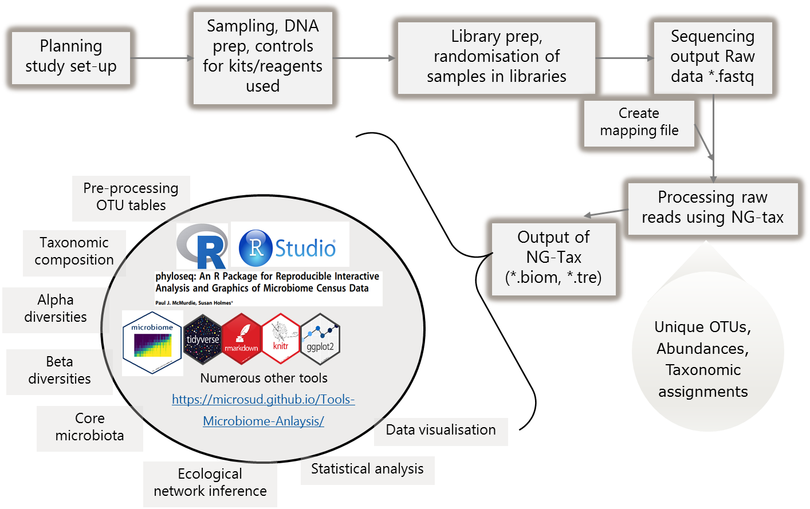

# Set-up and Pre-processing  

This tutorial will introduce you to basic steps of microbial community analysis. More importantly on how to look at your data and filter appropriately. We will use the [Human microbiome project phase I data](https://www.ncbi.nlm.nih.gov/pubmed/22699609).  

## OTU or ASVs or sOTUs  
For past few years (maybe decade), identifying Operational taxonomic units (OTUs) from raw sequences used clustering approach. Using 97% identity cut-off was a standard approach and often closed reference OTU picking was accepted in the sicentific community. During the time of the development of tools and bioinformatics approaches this was possibly the best available method. However, as with many other fields of science, the knowledge has been updated. Evolution of bioinformatics approaches is a constant process. Based on current knowledge, the cons of 97% OTU picking stratergy (using clustering approaches) have out-weighed the pros (eg. less time).  

Recent approaches are now focused towards Amplicon Seuence Variants/sOTUs:  
* [Oligotyping](https://www.ncbi.nlm.nih.gov/pmc/articles/PMC3864673/)  
* [Deblur](http://dx.doi.org/10.1128/mSystems.00191-16)  
* [DADA2](https://www.nature.com/articles/nmeth.3869)  
* [NG-Tax v2.0](https://f1000research.com/articles/5-1791/v1)   

All above approaches have one common theme, they avoid 97% clustering and focus on minor differences (in many cases single nucleotide variations) to identify unique ASVs/sOTU.   

Note: Some how naming is different and variable. For this purpose and in this book, I will stick to ASVs when data from NG-tax is used.  

In this, section, we will compare outputs from 97% OTU picking approach and NG-tax approach.  
The data used here is the 16S rRNA gene variable region (V1-V3) for 97% OTU-pciking. The raw reads were processed using QIIME 1.9.1, SortMeRNA, and OTU picking was done using the closed-reference OTU-picking at 97% identity.   

*QIIME is now replaced by QIIME2 with several features has been developed. It includes support for diverse of sOTU/ASVs picking stratergies. However, here we only use the 97% OTU picking data generated by us previously using QIIME (v1)*     

More about QIIME2 [click here](https://qiime2.org/) and the article describing it can be found here [Bolyen E, Rideout JR, Dillon MR, Bokulich NA... et al. 2019. Reproducible, interactive, scalable and extensible microbiome data science using QIIME 2. Nature Biotechnology 37: 852-857.](https://doi.org/10.1038/s41587-019-0209-9)    

For NG-Tax, we use the same raw data and processed through default settings.  

Here, we do not aim to bench mark. For this course, we aim to show differences between results from two approaches.  

For down stream analysis of *.biom files we use [Phyloseq](https://joey711.github.io/phyloseq/) and [microbiome](http://microbiome.github.io/microbiome/).    
Kindly cite all the packages and tools that were used in your analysis as listed at the end of each document in `sessionInfo`. Also make sure that you provide the workflow and scripts you used for analysis atleast as supplementary material with your research article.    
Check [Quick-R](http://www.statmethods.net/).  

## General overview  

<center></center> 

## Structure    

Let us create few folders to organize the analysis. While this can be personal preference, make sure you write the structure to guide others who do not know your data well.  

```{r, eval=FALSE}

# Create Folders as following
# Tables
dir.create("tables")

# Figures
dir.create("figures")

# Phyloseq objects
dir.create("phyobjects")

# Custom codes/notes
dir.create("codes_notes")
```

**Load packages**  

```{r, warning=FALSE, message=FALSE}

library(microbiome) # data analysis and visualisation
library(phyloseq) # also the basis of data object. Data analysis and visualisation
library(microbiomeutilities) # some utility tools
library(RColorBrewer) # nice color options
library(ggpubr) # publication quality figures, based on ggplot2
library(DT) # interactive tables in html and markdown
library(data.table) # alternative to data.frame
library(dplyr) # data handling

```

## Making a phyloseq object  

This is the basis for the analyses demonstrated in this tutorial. In the phyloseq object, information on OTU abundances, taxonomy of OTUs, the phylogenetic tree and metadata is stored. A single object with all this information provides a convinient way of handling, manipulating and visualizing data.  
For more infromation: [phyloseq](http://joey711.github.io/phyloseq/import-data)  

Please remember that the metadata (i.e. mapping) file has to be in *.csv* format (columns have sample attributes). The `read_phylseq` function from microbiome package requires metadata in *.csv* format.  


**Important Note 2**: If you have error in loading the biom files stating **JSON or HDF5** then you need to convert it in to a JSON format.  

For this, use the following command within the QIIME terminal and not in R!  

````{r}

# biom convert -i NGTaxMerged.biom -o ngtax_json.biom --table-type "OTU table" --to-json    

```

For more information on the biom format please  [click here](http://biom-format.org/documentation/biom_conversion.html). 

**Important Note 3**: The most recent version of NG-Tax does not have this issue. 

**NOTE**     
The `read_phyloseq` function can be used for reading other outputs (like .shared and consensus taxonomy files from mothur) into phyloseq object. type `?read_phyloseq` in the console pane for more information.      
If you don't have your own biom file, we have a test dataset stored in `input_data`. Unzip the humanmicrobiome.zip and you will have the original biom file, copy it in the `input_data` folder.  

## Read input to phyloseq object  

**NG-Tax output**    

```{r, eval=TRUE}

ps.ng.tax <- read_phyloseq(otu.file = "./input_data/humanmicrobiome.biom", 
                    taxonomy.file = NULL, 
                    metadata.file = "./input_data/metadata_table.csv", 
                    type = "biom") 

```

*NOTE* Creating the mapping file in Excel can give issues with `*.csv*` format. European format will use `;` as seperator and American format. One way to change this in MS-Excel is go to  Options->Advanced then uncheck `Use system operators` and change `decimal` to period `.` and `Thousands` to comma `'`     

Notice above, we use relative path and not `D:/myproject/input/mybiom.biom`. This is important! With an [RStudio project](https://support.rstudio.com/hc/en-us/articles/200526207-Using-Projects), the project folder is considered the root folder and any folders within this folder will be the branches to access data. Hence, sharing the Rproject folder with your article, users can conviniently re-run your analysis without having to play around with location of files.  

## Read the tree file.

Note: Requires a package called `ape` and the extension has to be ".tre" and not ".tree" (you can just change the name of the file extension)

```{r, eval=TRUE}
# Load tree file
library(ape)
treefile_p1 <- read.tree("./input_data/humanmicrobiome.tree")

```


## Merge into phyloseq object.

```{r, eval=TRUE}

ps.ng.tax <- merge_phyloseq(ps.ng.tax, treefile_p1)
# ps.ng.tax is the first phyloseq object.

print(ps.ng.tax)

rank_names(ps.ng.tax) # we check the taxonomic rank information

datatable(tax_table(ps.ng.tax)) # the table is interactive you can scrol and search thorugh it for details.
```

Before that we will clean the taxonomy table.  
```{r}

tax_table(ps.ng.tax)[, colnames(tax_table(ps.ng.tax))] <- gsub(tax_table(ps.ng.tax)[, colnames(tax_table(ps.ng.tax))], pattern = "[a-z]__", replacement = "")

tax_table(ps.ng.tax)[tax_table(ps.ng.tax)[, "Phylum"] == "", "Phylum"] <- "Unidentified"
```

```{r}
# save the pseq object

saveRDS(ps.ng.tax, "./phyobjects/ps.ng.tax.rds")

```


## Read data from OTU-picking stratergy

The data for tutorial is stored as *.rds file in the R project _input_data_ folder within the main  `Microbial-bioinformatics-introductory-course-Material-2018-master` folder.  

The data is from the [Human microbiome project phase I data](https://www.ncbi.nlm.nih.gov/pubmed/22699609).  

```{r}

ps.otu <- readRDS("./input_data/ps.sub.rds")
# microbiome::write_phyloseq(ps.otu, "METADATA")
# use print option to see the data saved as phyloseq object.


ps.ng.tax <- readRDS("./phyobjects/ps.ng.tax.rds")

print(ps.otu)

```

As can be seen, there is a difference in the number of OTU identifed by both approaches. NG-Tax has more OTUs identifed even aftering filtering the raw reads for rare sequences.  


```{r}
# check for features of data  
summarize_phyloseq(ps.ng.tax)
```


```{r}
summarize_phyloseq(ps.otu)
```

Notice the **Sparsity**, it is high for both approaches, the data has many zeros. A common property of amplicon based microbiota data generated by sequencing.    

## Variablity  

We will check the spread of variation for taxa identifed using both approaches. Coefficient of variation (C.V), i.e. sd(x)/mean(x) is a widely used approach to measure heterogeneity in OTU/ASV abundance data. The plot below shows CV-mean(relaive mean abundance) relationship in the scatter plot, where variation is calculated for each OTU/ASV across samples versus mean relative abundance.   
Now plot C.V.  
```{r}

# the plot_taxa_cv will first convert the counts to relative abundances and then calculate the C.V.

p1 <- plot_taxa_cv(ps.ng.tax, plot.type = "scatter")

p1 + scale_x_log10()
```

```{r}

p2 <- plot_taxa_cv(ps.otu, plot.type = "scatter")

p2 + scale_x_log10()

```

From the above two plots, we see that there are several OTUs which have high C.V. and low mean. The OTU-picking approach seems to be noisy and NG-Tax approach seems to have less noise. Thus, the ASVs identified by NG-Tax are of high confidence as they seem to be reprsented by high number of sequences in the raw data.  
Note: The data we use here is from different body sites and have large difference in composition and community structure. The observed high variance shown here can also be explained in part by the difference between sample groups (stool, sebus, oral) _biology of samples is also important_.  

Let us check for distribution of number of sequences retained after OTU picking and NG-tax approach.  

```{r}

p_seqdepth.otu <- plot_read_distribution(ps.otu, "scientific_name", "density")

p_seqdepth.ngtax <- plot_read_distribution(ps.ng.tax, "scientific_name", "density")
```


```{r}
print(p_seqdepth.otu)
```


```{r}
print(p_seqdepth.ngtax)
```

We see a better distribution of reads in NG-Tax data.  

Moving on to distribution of taxa

```{r}
# We make a data table with information on the OTUs
ps0_df_taxa <- data.table(tax_table(ps.ng.tax),
                          ASVabundance = taxa_sums(ps.ng.tax),
                          ASV = taxa_names(ps.ng.tax))

ps0_tax_plot <- ggplot(ps0_df_taxa, aes(ASVabundance)) +
  geom_histogram() + ggtitle("Histogram of ASVs (unique sequence) counts (NG-Tax)") +
  theme_bw() + scale_x_log10() + ylab("Frequency of ASVs") + xlab("Abundance (raw counts)")

print(ps0_tax_plot)
```


```{r}
# We make a data table with information on the OTUs
ps1_df_taxa <- data.table(tax_table(ps.otu), 
                        OTUabundance = taxa_sums(ps.otu), 
                        OTU = taxa_names(ps.otu))

ps1_tax_plot <- ggplot(ps1_df_taxa, aes(OTUabundance)) + 
  geom_histogram() + ggtitle("Histogram of OTU counts (OTU-picking 97%)") + 
  theme_bw() + scale_x_log10() + ylab("Frequency of OTUs") + xlab("Abundance (raw counts)")

print(ps1_tax_plot)
```

The ASVs distribution is close to normal distribution compared to OTU distribution for 97% otu-picking approach. This has implications in downstream statistical analysis like differential abundance testing (covered on Day3).    

We can also check for prevalance abundance distribtuion of ASVs and OTUs.  

```{r}

p <- plot_taxa_prevalence(ps.ng.tax, "Phylum")
p

```

```{r}
p2 <- plot_taxa_prevalence(ps.otu, "Phylum")
p2
```

The ASVs identified by NG-tax at low prevalance are represented by high abundance in the sequencing data. There is a higher chance that these are real observations.  

Checking for potentially spurious OTUs/ASVs. Usually, we do not expect mitochondria and chloroplast as part of the human microbiome.  

## OTU-picking stratergy  

```{r}
ps0.1.otu <- subset_taxa(ps.otu, Family != "mitochondria")

print(ps0.1.otu)

# also check how many are lost 

ntaxa(ps.otu)-ntaxa(ps0.1.otu)
```


## NG-tax stratergy   

```{r}
ps1.1.ngtax <- subset_taxa(ps.ng.tax, Family != "Mitochondria")

# also check how many lost 

ntaxa(ps.ng.tax)-ntaxa(ps1.1.ngtax)

```

There is large different in the mitochondrial sequences detected by OTU-picking approach and NG-Tax approach. Usually, sequence of mitochondrial and chloroplast origin are present is low abundance.   

Check how many total reads are there in the NG-tax data set.  

```{r}

#total number of reads in the dataset
reads_per_asv <- taxa_sums(ps1.1.ngtax)
print(sum(reads_per_asv))

```

There are 4662048 reads in the total data set.  
How many ASVs are less than 10 reads and how many reads do they contain?   

```{r}

print(length(reads_per_asv[reads_per_asv < 10]))

print(sum(reads_per_asv[reads_per_asv < 10]))

```

To put this into context; out of the 4705 OTUs, a 654 OTUs contain less than 10 reads, which is:  

```{r}

print((654/4705)*100)

```

OTU picking approach.    

```{r}

#total number of reads in the dataset
reads_per_otu <- taxa_sums(ps0.1.otu)

print(sum(reads_per_otu))

```

There are 2398446 reads in the total data set.  
How many ASVs are less than 10 reads and how many reads do they contain?   

```{r}

print(length(reads_per_otu[reads_per_otu < 10]))

print(sum(reads_per_otu[reads_per_otu < 10]))

```

To put this into context; out of the 3690 OTUs, 654 OTUs contain less than 10 reads, which is:  

```{r}

print((1678/3690)*100)

```

This is a major drawback of the OTU picking strategy. This percent can be lowered with NG_tax, DADA2, Deblur like approaches.  

Let us see how many singletons are there?

```{r}

length(which(taxa_sums(ps0.1.otu) <= 1))

length(which(taxa_sums(ps1.1.ngtax) <= 1))

```

Check how many doubletons are there?

```{r}

length(which(taxa_sums(ps0.1.otu) == 2))
length(which(taxa_sums(ps1.1.ngtax) == 2))
```

Check how many Singletons and doubletons are there?

```{r}

length(which(taxa_sums(ps0.1.otu) <= 2))

```

Singletons and doubletons  

```{r}

round((892/3690)*100, digits = 2)

```

24.17% of the OTUs are doubletons or singletons. This is suggests that there can be potentially spurious OTUs.    

It is important to understand that depending on origin of sample, the parameters in NG-tax have to be changed. If you expect your samples to have large diversity of which rare taxa are a major fraction, using less stringent parameters is important. Every data has its own properties.    

It is commonly observed that a large fraction of taxa are rare. A nice reading for this topic is the review by Michael D. J. Lynch & Josh D. Neufeld [Ecology and exploration of the rare biosphere](https://www.nature.com/articles/nrmicro3400).  

```{r}

sessionInfo()

```


