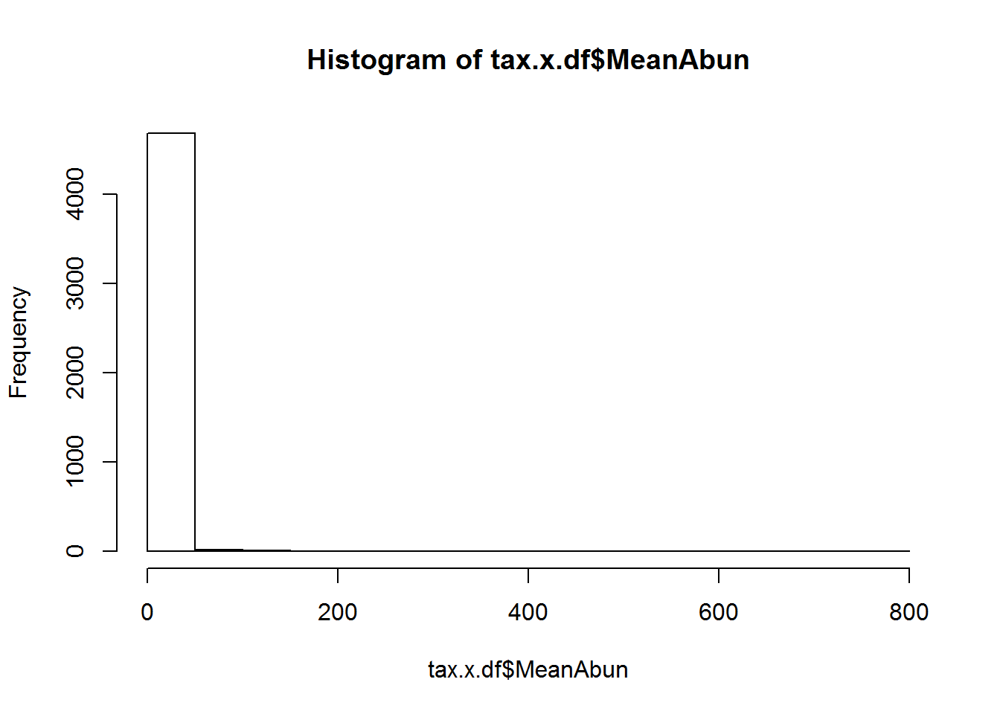
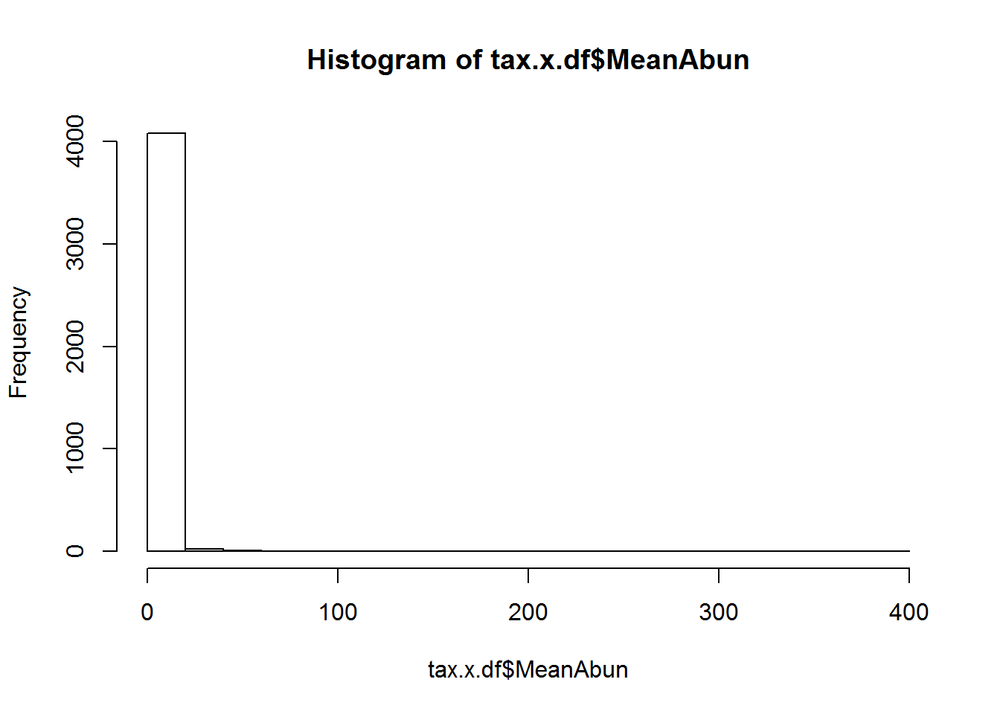
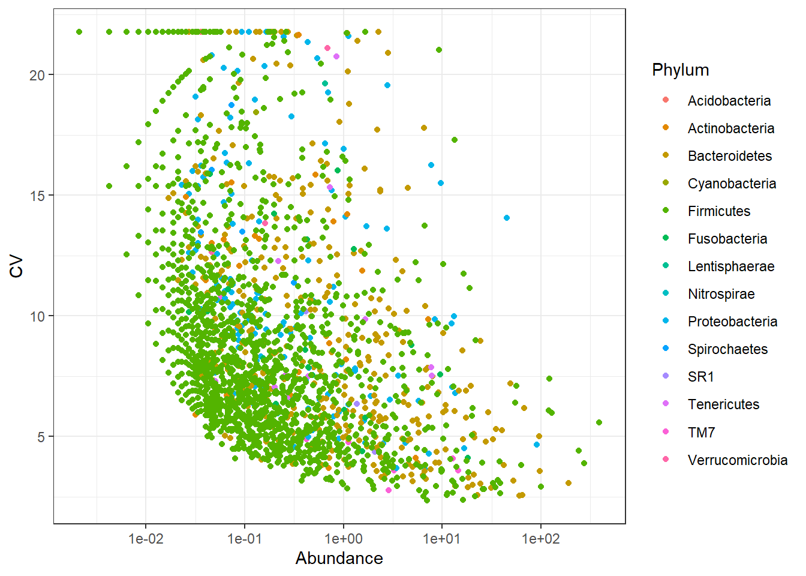
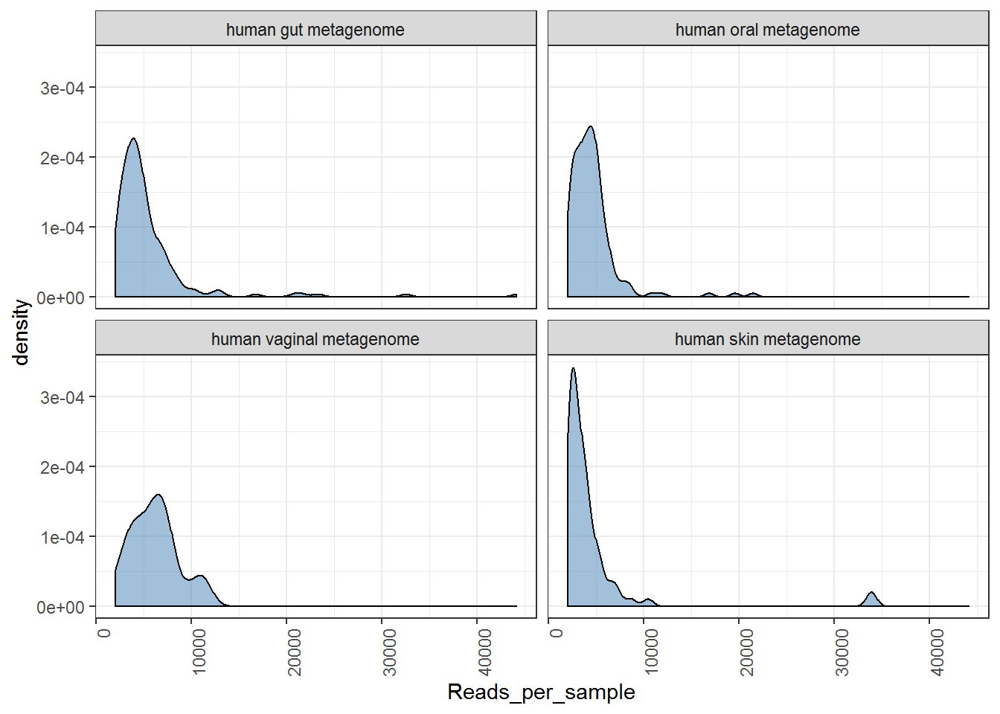
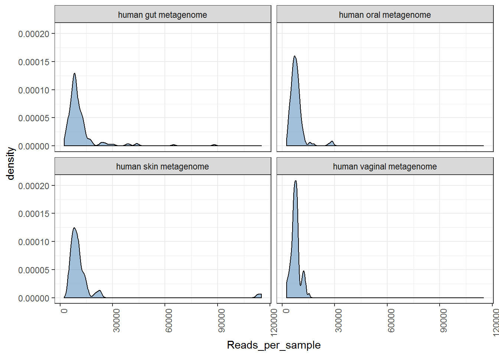
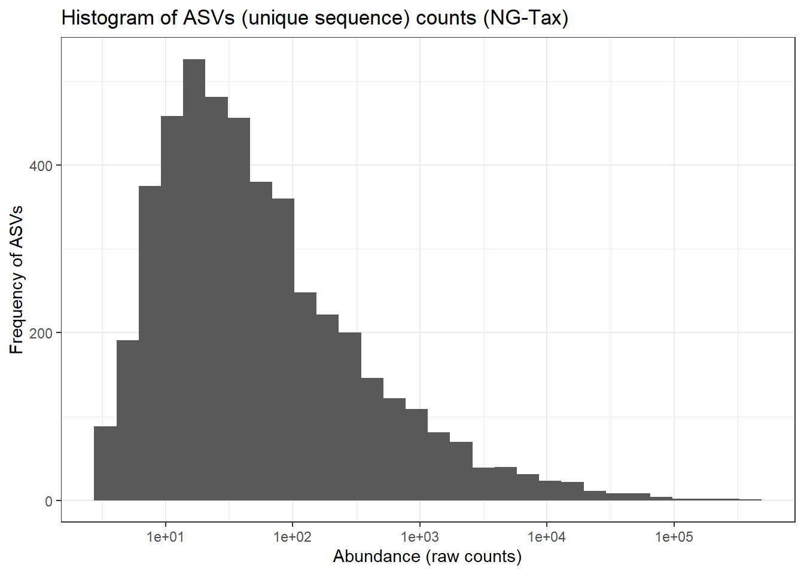
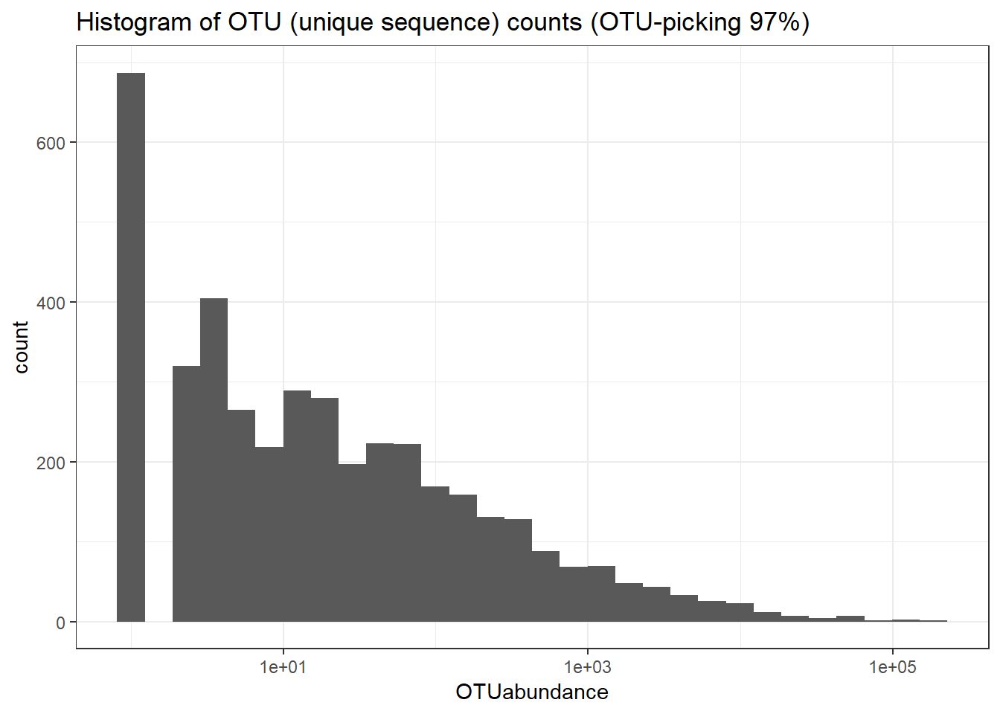
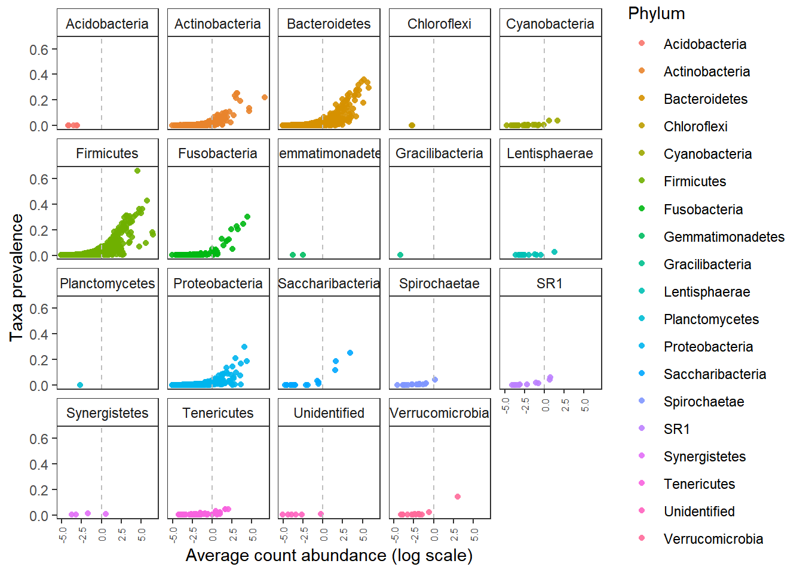
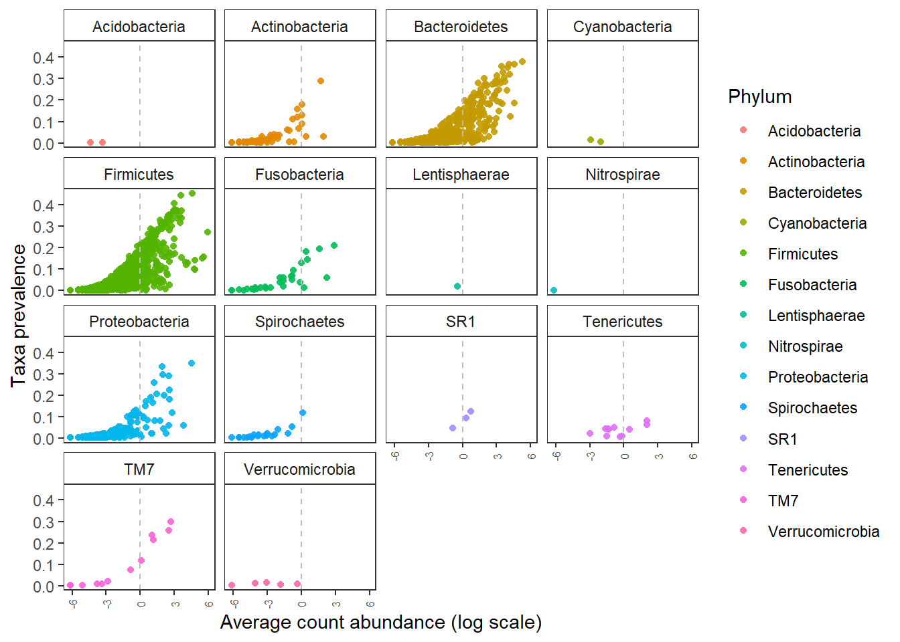

# Set-up and Pre-processing  

This tutorial will introduce you to basic steps of microbial community analysis. More importantly on how to look at your data and filter appropriately. We will use the [Human microbiome project phase I data](https://www.ncbi.nlm.nih.gov/pubmed/22699609).  

## OTU or ASVs or sOTUs  
For past few years (maybe decade), identifying Operational taxonomic units from raw sequences used clustering approach. Using 97% identity cut-off was a standard approach and often closed reference OTU picking was accepted in the sicentific community. During the time of the development of tools and bioinformatics approaches this was possibly the best available method. However, as with many other fields of science, the knowledge has been updated. Evolution of bioinformatics approaches is a constant process. Based on current knowledge, the cons of 97% OTU picking stratergy (using clustering approaches) have out-weighed the pros (eg. less time).  

Recent approaches are now focused towards Amplicon Seuence Variants/sOTUs:  
* [Oligotyping](https://www.ncbi.nlm.nih.gov/pmc/articles/PMC3864673/)  
* [Deblur](http://dx.doi.org/10.1128/mSystems.00191-16)  
* [DADA2](https://www.nature.com/articles/nmeth.3869)  
* [NG-Tax](https://f1000research.com/articles/5-1791/v1)  

All above approaches have one common theme, they avoid 97% clustering and focus on minor differences (in many cases single nucleotide variations) to identify unique ASVs/sOTU.   

Note: Some how naming is different and variable. For this purpose and in this book, I will stick to ASVs when data from NG-tax is used.  

In this, section, we will compare outputs from 97% OTU picking approach and NG-tax approach.  
The data used here is the 16S rRNA gene variable region (V1-V3) for 97% OTU-pciking. The raw reads were processed using QIIME 1.9.1, SortMeRNA, and OTU picking was done using the closed-reference OTU-picking at 97% identity.   

For NG-Tax we used the same raw data and processed thorough default settings.  

Here, we do not aim to bench mark. For this course we aim to show differences between results from two approaches.  

For down stream analysis of *.biom files we use [Phyloseq](https://joey711.github.io/phyloseq/) and [microbiome](http://microbiome.github.io/microbiome/).    
Kindly cite all the packages and tools that were used in your analysis as listed at the end of each document in `sessionInfo`. Also make sure that you provide the workflow and scripts you used for analysis atleast as supplementary material with your research article.    
Check [Quick-R](http://www.statmethods.net/).  

## General overview  

<center></center> 

## Structure    

Let us create few folders to organize the analysis. While this can be personal preference, make sure you write the structure to guide others who do not know your data well.  


```r
# Create Folders as following
#Tables  
dir.create("tables")

# Figures 
dir.create("figures")  

# Phyloseq objects  
dir.create("phyobjects")  

# Custom codes/notes  
dir.create("codes_notes")
```

**Load packages**  


```r
library(microbiome) # data analysis and visualisation
library(phyloseq) # also the basis of data object. Data analysis and visualisation
library(microbiomeutilities) # some utility tools 
library(RColorBrewer) # nice color options
library(ggpubr) # publication quality figures, based on ggplot2
library(DT) # interactive tables in html and markdown
library(data.table) # alternative to data.frame
library(dplyr) # data handling  
```

## Making a phyloseq object  

This is the basis for the analyses demonstrated in this tutorial. In the phyloseq object, information on OTU abundances, taxonomy of OTUs, the phylogenetic tree and metadata is stored. A single object with all this information provides a convinient way of handling, manipulating and visualizing data.  
For more infromation: [phyloseq](http://joey711.github.io/phyloseq/import-data)  

Please remember that the metadata (i.e. mapping) file has to be in *.csv* format (columns have sample attributes). The `read_phylseq` function from microbiome package requires metadata in *.csv* format.  

**Things to be done in QIIME terminal (if required):**
**Important Note 2**: If you have error in loading the biom files stating **JSON or HDF5** then you need to convert it in to a JSON format.  

For this, use the following command within the QIIME terminal and not in R!  


```r
# biom convert -i NGTaxMerged.biom -o ngtax_json.biom --table-type "OTU table" --to-json    
```

For more information on the biom format please  [click here](http://biom-format.org/documentation/biom_conversion.html). 

**Important Note 3**: The most recent version of NG-Tax does not have this issue. 

**NOTE**     
The `read_phyloseq` function can be used for reading other outputs (like .shared and consensus taxonomy files from mothur) into phyloseq object. type `?read_phyloseq` in the console pane for more information.      
If you don't have your own biom file, we have a test dataset.  
## Read input to phyloseq object  

NOTE: For this tutorial purpose, you need to download the test *.biom file from this [link](https://www.dropbox.com/s/tyhp85xrxmwzl9c/humanmicrobiome.biom?dl=0) and save it in the `input_data` folder of this project.  

**NG-Tax output**    


```r
ps.ng.tax <- read_phyloseq(otu.file = "./input_data/humanmicrobiome.biom", 
                    taxonomy.file = NULL, 
                    metadata.file = "./input_data/metadata_table.csv", 
                    type = "biom") 
```

```
## Time to complete depends on OTU file size
```


Notice above, we use relative path and not `D:/myproject/input/mybiom.biom`. This is important! With an [RStudio project](https://support.rstudio.com/hc/en-us/articles/200526207-Using-Projects), the project folder is considered the root folder and any folders within this folder will be the branches to access data. Hence, sharing the Rproject folder with your article, users can conviniently re-run your analysis without having to paly around with location of files.  

## Read the tree file.

Note: Requires a package called `ape` and the extension has to be ".tre" and not ".tree" (you can just change the name of the file extension)


```r
# Load tree file
library(ape)
```

```
## 
## Attaching package: 'ape'
```

```
## The following object is masked from 'package:ggpubr':
## 
##     rotate
```

```r
treefile_p1 <- read.tree("./input_data/humanmicrobiome.tree")
```


## Merge into phyloseq object.


```r
ps.ng.tax <-merge_phyloseq(ps.ng.tax,treefile_p1)
# ps0 is the first phyloseq object.

print(ps.ng.tax)
```

```
## phyloseq-class experiment-level object
## otu_table()   OTU Table:         [ 4710 taxa and 474 samples ]
## sample_data() Sample Data:       [ 474 samples by 30 sample variables ]
## tax_table()   Taxonomy Table:    [ 4710 taxa by 6 taxonomic ranks ]
## phy_tree()    Phylogenetic Tree: [ 4710 tips and 4709 internal nodes ]
```

```r
rank_names(ps.ng.tax) # we check the taxonomic rank information 
```

```
## [1] "Domain" "Phylum" "Class"  "Order"  "Family" "Genus"
```

```r
datatable(tax_table(ps.ng.tax)) # the table is interactive you can scrol and search thorugh it for details.
```

<!--html_preserve--><div id="htmlwidget-6faf3f8abca070f2b8e8" style="width:100%;height:auto;" class="datatables html-widget"></div>
<script type="application/json" data-for="htmlwidget-6faf3f8abca070f2b8e8">{"x":{"filter":"none","data":[["9410494158","9410494576","9410491420","9410491569","9410491595","9410491783","9410491526","9410491822","9410491516","9410494414","9410494352","9410491523","9410492612","9410491521","9410492867","9410493260","9410491824","9410491817","9410491518","9410494339","9410492625","9410492868","9410494049","9410491935","9410492999","9410493979","9410491827","9410491525","9410492686","9410492001","941049327","9410492547","9410491397","9410491404","9410491533","9410493211","9410491570","9410492078","9410493467","9410492084","9410491302","9410493982","9410493983","9410493996","9410492691","9410493330","9410491950","9410492475","941049977","9410494047","9410494051","9410493638","9410493672","94104936","9410491765","9410491776","9410491520","9410493170","9410493166","9410493828","9410492107","9410494038","9410492156","9410494043","9410493549","9410493579","9410492333","9410492300","9410494033","9410493677","9410492068","9410493987","9410492614","9410494416","941049649","9410494315","9410492869","9410491524","9410491522","9410494550","9410492155","9410492153","9410492158","9410492157","9410492250","9410492109","9410494053","941049119","9410491531","9410491519","941049949","941049488","9410491348","9410491534","9410491818","9410491774","9410491515","9410493976","9410492870","9410494289","941049239","9410492008","9410491405","9410494297","9410493584","9410491412","9410494244","9410494251","9410494246","9410494057","9410494054","9410491532","9410494388","9410494308","9410494250","9410494705","9410494247","9410494387","9410494418","9410494389","9410494226","9410491418","9410491411","9410491311","9410491339","9410491415","9410491814","9410491819","9410491517","9410492635","9410493000","9410493468","9410494343","9410494048","9410494338","9410494353","9410493981","9410493325","9410491430","9410494056","9410494050","9410494396","9410493984","941049852","9410491560","9410492799","9410494284","9410493990","9410494341","9410494220","9410491572","9410491934","9410491423","9410494337","9410494248","941049655","9410492800","9410491421","9410491775","9410494109","9410492296","9410494105","941049755","9410492863","9410494364","9410493631","9410492858","9410494020","9410492045","9410494125","9410494113","9410494275","9410494126","9410494293","9410494277","9410491772","9410494039","9410494042","9410493991","9410494041","9410493760","9410493758","9410493759","9410493745","9410493757","9410493751","9410493748","9410491317","9410494037","9410491308","9410491427","9410491942","9410491428","9410494214","9410494501","9410491343","9410493619","9410491346","9410494706","9410494702","9410492559","9410491937","9410494696","9410492605","9410492637","9410494112","9410494103","9410494108","9410492608","9410492670","94104965","9410492618","9410492901","9410493430","9410492613","9410493518","9410491307","9410492620","9410493756","9410493767","9410491939","9410493980","9410494633","9410491660","9410491658","9410491644","9410491661","9410492657","9410492658","9410492615","9410492636","9410492224","9410491344","9410492607","9410491334","9410492617","9410493457","9410494498","9410494335","9410494505","9410494507","9410494701","9410494496","9410494704","9410494504","9410493541","9410494061","9410491922","9410494499","9410493825","9410494062","9410491925","9410493832","9410492659","9410492651","9410493827","9410494491","9410494493","9410494693","9410494703","9410494692","9410494709","9410494700","9410494495","9410494560","9410494561","9410494559","9410492472","9410491750","9410491830","9410491752","9410493972","9410494463","9410494454","9410491751","9410491741","9410494596","9410494031","9410491731","9410493204","9410494595","9410492530","9410492755","941049288","9410491043","941049247","9410491032","9410492208","941049498","9410493826","9410491363","9410491722","9410491192","9410493222","9410491031","941049395","9410492194","9410492788","94104993","9410492826","9410493703","9410491747","9410493702","9410492407","9410491983","9410493139","9410493307","9410491986","9410493239","9410493138","9410494522","9410491889","9410493136","9410491993","9410491984","941049536","9410492292","941049992","9410492840","9410492865","9410491733","9410493684","9410494052","94104945","9410492108","9410492160","9410492159","9410492154","9410492675","9410492646","9410492630","941049484","9410491561","9410493302","9410492610","9410492214","9410492606","9410491941","9410492906","9410492629","9410492631","9410494346","9410492544","9410493275","9410493165","9410492912","9410493447","941049946","9410492351","94104948","9410491568","9410492626","9410491330","9410493040","9410493453","9410491988","9410492641","9410493465","9410491013","941049950","9410492645","9410493829","9410493336","9410493526","9410493454","941049994","941049953","9410494060","9410491011","9410494063","941049883","9410493201","9410492978","9410491981","941049878","941049874","941049996","941049993","9410491341","9410492046","9410491879","9410491888","9410491869","9410492886","941049610","9410494055","9410494044","9410492815","9410493546","9410493683","94104951","9410493808","941049319","94104950","9410493978","9410493988","9410493917","9410493918","9410492541","9410492003","9410491634","9410491885","94104953","941049726","9410494314","9410494304","9410494537","9410494423","9410494413","9410494114","9410494127","9410494318","9410494301","9410494101","9410494207","9410494221","9410494317","9410494231","9410491890","9410494632","9410494351","9410491949","941049489","9410494245","9410492012","9410491886","941049480","9410493762","9410493993","9410494555","9410494551","9410492007","9410491989","941049336","9410493274","9410491873","9410492565","9410491996","9410494119","9410494336","9410493147","9410494545","941049945","941049491","9410492689","9410491409","9410492977","9410494045","941049989","9410494394","941049991","9410491242","9410491318","9410491021","9410492671","9410493755","9410494548","941049725","9410494631","9410494386","9410491326","9410491881","941049322","9410491929","9410493765","9410493753","9410494212","9410494218","9410494302","9410494310","9410491928","9410493173","9410491662","9410493741","9410491304","9410493750","9410491245","9410491314","9410494508","9410494106","9410494694","9410491591","9410494398","9410494411","9410492836","9410491303","9410491987","9410491995","9410494222","9410494233","941049557","9410493145","9410491875","941049986","9410493830","9410494211","9410494205","9410493464","9410494492","9410494419","9410494312","9410493537","9410492621","9410494117","9410491948","9410491527","9410494035","941049469","9410494118","941049465","9410492702","9410494541","9410494215","9410491401","9410491932","9410491666","9410494261","9410494243","9410494100","9410491965","9410492904","9410493701","9410491557","94104973","9410492985","9410493333","9410493322","9410492817","9410494019","9410494544","9410493740","9410493344","9410494228","9410493679","941049983","9410493761","9410494320","9410493321","9410492816","9410494306","9410494021","9410493327","9410494307","9410494219","9410494230","9410494303","9410494316","9410492984","9410491946","941049975","9410493682","941049972","9410492889","9410492891","9410492805","9410493517","941049335","9410491753","9410491594","9410492685","9410493743","9410492549","9410492540","9410493455","941049473","9410494552","9410491974","9410493026","9410491328","9410492696","9410493831","9410492542","9410493318","941049453","9410492352","94104940","9410493409","9410493763","9410493742","9410491654","9410491225","941049551","9410493050","9410491923","9410493174","941049318","941049323","9410491640","9410492484","941049959","9410491633","941049798","9410491978","9410491977","9410491976","9410492487","9410491872","941049312","9410494390","9410494636","9410493744","9410491635","9410492818","9410493178","9410492677","941049723","9410492548","9410493179","941049308","9410493686","941049116","9410494213","94104964","9410491590","9410491642","9410492611","9410492627","9410492684","9410492700","9410492697","9410491395","9410491425","9410491230","9410491313","9410493346","9410493341","9410491592","9410493408","9410491663","9410491558","9410492905","9410491636","9410491656","9410493580","941049641","9410492616","9410492622","9410493694","9410493700","9410492897","9410493536","9410492895","9410493462","9410493461","9410491638","941049917","9410493188","941049724","9410494217","941049978","9410492024","9410491306","9410492701","9410491349","9410493535","9410492245","9410492844","9410492841","9410492560","9410493680","941049496","9410492898","9410492543","9410491514","9410493177","94104947","9410492749","9410492776","9410493582","9410492069","9410493448","9410491997","9410494034","94104937","9410491513","9410493317","941049150","9410493695","941049149","9410494350","9410493986","9410492768","9410492062","9410492923","941049962","941049979","9410494036","941049875","941049497","9410492044","9410494699","9410492110","9410491940","9410493533","9410493364","9410491882","9410494046","9410492049","941049957","9410493427","9410493226","941049258","9410491076","9410491042","941049265","9410493746","9410493752","9410492653","9410494224","9410492911","9410492913","9410493678","9410492917","9410493324","9410492812","9410494227","9410493329","9410494311","9410494319","9410493348","94104944","94104938","94104939","9410492922","9410491951","9410492312","9410493673","941049849","9410494015","941049971","9410491945","9410493674","9410493676","9410491763","9410493466","9410494347","9410492803","9410492831","941049816","9410491559","9410492220","9410492853","9410492298","9410492814","941049558","941049728","941049316","9410493747","9410491891","9410491652","9410494023","9410491766","9410494016","9410494018","9410494269","9410491883","9410493899","9410491196","9410493440","9410491647","9410491422","9410494653","9410494657","941049388","9410492366","9410492301","9410492579","9410492367","9410492845","9410492862","9410491768","9410493263","9410492676","9410492680","9410491773","9410492656","9410493463","9410493456","9410492075","9410491863","9410492042","9410492162","9410493277","9410491377","9410494194","9410492403","9410492398","9410494191","9410494190","9410491802","9410493834","941049741","9410491725","9410492161","9410492404","9410492395","9410494452","9410494589","9410493539","9410493754","9410491417","9410493345","9410494708","9410492673","9410494079","9410491748","9410491211","941049895","9410493024","9410493151","9410494096","9410491041","9410494088","941049603","941049608","9410492135","9410491289","9410493063","941049212","941049292","9410492093","941049569","9410492842","9410491426","9410491419","9410491414","9410493773","941049886","941049980","9410491226","9410492082","9410494543","9410492554","9410492856","9410492476","94104955","9410492915","9410492340","9410492683","9410491029","9410492429","941049409","941049579","941049740","9410491373","9410491370","941049432","9410492537","9410494433","9410494459","9410494324","9410492425","9410494447","941049568","9410493729","9410491737","941049304","941049412","941049572","9410491744","941049403","9410493877","9410493043","9410493044","941049573","941049417","9410492751","9410494077","941049246","9410493460","9410493459","9410492669","9410492638","9410492639","9410493047","941049879","941049940","941049510","9410492796","9410494002","9410491958","9410492077","9410491391","9410491018","9410491400","9410491024","9410493310","9410493311","941049500","9410493852","9410491957","9410492384","941049503","941049881","9410491729","9410491446","941049748","9410491071","941049203","9410491730","9410491799","9410493146","9410492139","9410493768","9410494208","9410494503","9410492852","9410494216","9410491408","9410494022","9410494115","9410494405","9410494695","9410494494","9410493246","9410492902","9410492916","9410491340","941049722","9410492811","94104954","9410491019","9410492791","9410492792","941049973","941049456","941049537","9410491529","941049458","94104957","9410493233","941049814","94104949","9410493236","9410493229","9410493242","9410493815","9410492885","9410491668","9410493360","9410492890","9410492892","9410491874","941049542","9410493241","9410492888","9410491901","941049873","9410493687","941049451","9410491390","9410492882","9410492883","9410492884","9410491865","9410491399","9410491424","941049556","9410492908","941049477","9410491975","9410492975","9410491028","941049943","9410491232","9410492983","941049553","9410492849","941049333","941049454","9410492027","9410493997","9410492546","9410492879","9410491998","94104943","9410492880","9410492874","9410492807","9410491573","9410492632","9410491322","9410491305","9410492881","9410491389","9410491310","9410491228","9410491320","9410494453","9410492030","9410492020","9410491760","9410492833","9410492687","9410491858","9410491853","9410491960","9410491952","9410491962","9410491961","9410494450","9410494442","9410493046","9410491299","9410491854","9410491850","9410491300","941049761","9410492359","9410493769","9410494526","9410494529","9410494523","9410494525","9410491222","9410491220","9410491967","9410491959","9410494409","941049880","9410492660","9410494395","9410494397","9410494391","9410491246","9410491244","9410491878","9410491877","9410492043","9410491871","9410491870","941049947","941049941","9410493338","9410493337","941049809","9410491234","9410491238","9410491241","9410491223","9410493266","9410492903","9410494280","9410494298","9410494258","9410492349","9410491637","9410493051","9410491639","9410492834","9410492486","9410491667","9410492899","9410491641","941049161","9410492059","941049701","941049774","9410493419","9410492813","9410492661","9410492774","94104942","9410492619","9410492609","9410493238","9410493231","9410493240","941049792","9410494415","9410494403","9410492753","9410493208","9410491048","9410492432","9410493658","9410492140","9410491436","9410493109","9410491971","9410491972","9410491047","9410491444","9410491152","9410491840","9410491739","941049916","941049408","9410492121","9410494189","9410491579","9410491542","9410493353","941049298","9410491034","941049401","9410494196","9410494186","9410494573","9410492188","9410491251","9410491204","941049426","9410492739","9410493933","9410492525","9410493060","9410493033","941049735","9410491182","9410493214","941049383","9410491968","941049193","9410494588","9410491757","9410493256","9410492437","9410491713","9410491365","941049191","9410492146","9410493347","9410493665","941049249","9410491749","9410491202","9410492737","9410493781","9410491038","941049410","9410492427","9410493283","9410493452","9410492846","9410492838","9410491852","9410491771","9410492672","9410492679","9410491985","9410491999","9410492644","9410491761","9410491758","9410491188","9410492428","9410493281","9410492167","9410491719","9410492408","9410491375","9410491035","9410494652","9410491416","9410491335","9410494535","9410493922","9410493172","9410494528","941049803","9410491782","9410492871","9410492790","9410492477","9410492478","9410493989","9410493924","9410494340","9410492393","9410491327","9410491167","9410491162","941049718","941049715","941049820","9410491655","9410491323","941049960","941049961","941049952","9410491804","9410492783","941049719","9410491364","941049346","941049406","941049750","941049793","9410492236","941049428","9410493225","9410492438","941049927","9410493863","9410492854","9410492859","9410492480","9410492028","9410492851","9410492847","9410494358","9410493251","9410491720","9410491829","9410494569","9410491227","9410491145","9410491155","9410491153","9410494679","9410494146","9410494566","9410492585","9410492575","9410491077","9410491175","9410493791","9410492520","9410494432","941049434","9410491258","9410491756","9410494455","9410494430","9410491796","9410492436","9410493220","9410493190","9410492664","9410492900","9410491857","9410493921","9410491813","9410493608","9410493603","9410493605","9410493432","9410493778","941049269","9410494680","941049894","9410494383","94104988","9410493405","9410493499","9410491439","941049777","9410491012","9410493088","9410493869","9410493855","9410493854","9410493328","9410492703","9410493314","9410491593","9410493697","9410493696","9410492634","9410491884","9410492688","9410491963","9410492623","9410491947","9410492624","9410494655","9410492860","9410492074","9410492482","9410494361","9410492073","9410491973","9410491982","9410492023","9410492848","9410492022","941049970","9410491867","9410491664","9410492864","9410493627","9410492808","9410491649","9410492866","9410493335","9410492855","9410493690","9410492083","9410493084","9410492021","9410491990","9410492017","9410492354","9410494360","9410494356","9410492325","9410494359","9410492479","9410492809","9410491239","9410491221","9410491447","9410494643","9410493521","9410491445","9410494469","9410494600","9410493862","9410494240","9410494622","9410493657","9410491159","9410494427","9410494382","9410494685","9410494585","9410491742","9410494331","9410494486","9410494675","9410494193","9410494677","9410494648","9410494658","9410494644","9410493602","941049934","9410493904","9410492527","9410493894","9410494678","9410493122","9410493150","9410491969","941049197","9410492390","9410491250","9410492130","941049287","941049924","9410491179","9410491449","9410493209","9410492389","941049747","9410492924","9410493634","9410492306","9410491648","9410491980","941049965","941049954","9410494357","9410494362","9410491336","9410493628","9410492861","9410492850","9410494355","9410493028","9410492857","9410494354","9410493029","9410493030","9410491337","9410493334","9410492013","9410492026","9410493425","9410493423","9410491994","9410492481","9410492483","941049955","9410492346","941049958","9410491279","941049183","9410491716","9410493931","941049782","9410491806","9410491794","9410491014","9410493612","9410493643","9410493654","9410493651","9410493647","941049708","9410493642","9410493641","9410493630","9410491851","9410491849","9410493625","9410493623","9410493624","9410491861","9410491856","9410493626","9410493622","9410491754","9410491200","9410492394","941049779","9410491726","9410493663","941049999","941049591","9410493048","9410491184","9410493783","9410491369","9410493966","9410491058","941049400","9410494688","9410492386","9410493903","9410493103","941049656","9410493856","9410493883","941049915","9410494065","9410492174","9410493892","941049241","9410492071","941049449","9410493861","9410491448","9410493496","9410491738","941049370","9410491163","9410493588","9410493195","941049443","941049389","9410491164","941049194","9410493505","94104975","9410492770","9410493403","941049898","94104998","9410493604","9410492387","9410493412","9410493600","941049909","9410491082","941049932","9410492787","9410492391","9410492385","9410491039","9410491080","9410492780","9410492784","9410492412","941049202","9410493399","9410493786","9410493443","9410491165","9410491178","9410492132","9410491257","9410491433","9410491746","9410491173","9410491156","9410493522","9410492248","941049390","9410493525","941049195","9410491000","941049174","9410493089","9410491160","9410491154","9410492584","9410491172","9410491151","9410491177","9410492987","9410491157","9410492523","9410492522","9410494645","941049343","9410491083","9410494192","9410494076","9410492368","941049179","9410492418","9410492416","9410492087","9410492426","9410492704","9410493207","9410494256","9410493039","9410493038","9410493025","9410493020","9410494707","9410494554","9410493415","9410493413","9410493414","9410494530","9410494290","9410491187","9410492590","9410492832","9410492213","9410491816","9410493789","9410491206","9410492577","9410493259","9410492576","9410491815","9410494003","9410491319","9410492827","9410492830","9410493820","9410492918","941049142","9410492674","9410493853","9410493319","941049139","9410492111","9410492835","9410492690","9410493149","941049144","941049310","9410493629","941049128","941049167","9410491095","9410492742","9410492682","9410493801","9410492014","9410493350","9410494506","9410493480","9410493434","941049145","94104962","9410491392","9410494313","9410492556","941049534","9410492442","9410491880","9410493685","941049851","941049855","94104956","941049791","9410491887","9410491842","9410493140","9410491386","9410492561","941049561","94104959","941049800","941049122","94104974","9410492819","9410494542","941049824","9410493085","941049134","941049988","9410492824","941049325","9410492297","941049143","94104987","9410492875","941049788","9410493822","941049200","941049342","941049215","941049170","9410492143","9410493994","9410493216","9410492299","9410494001","9410492329","941049112","9410493101","941049923","9410493666","941049206","941049944","9410493618","941049548","9410493323","9410493187","9410493114","9410493577","9410491099","9410493681","94104958","941049795","941049125","941049237","941049132","9410493340","9410494267","9410491231","9410492383","9410493819","9410494254","9410492334","9410493219","9410494299","9410493342","9410494549","941049165","9410491017","941049104","9410491823","9410494004","9410493857","9410491777","9410491778","9410494124","9410491581","941049331","9410491767","941049523","9410494123","9410494404","9410494425","9410494102","9410494283","9410491309","9410494377","9410493809","9410494274","9410494257","9410494570","9410494255","9410494401","9410494107","9410493264","9410492588","9410494410","9410491197","9410494099","9410494445","9410494635","9410494630","9410494502","9410494288","9410494271","9410494266","9410494285","941049111","941049115","9410494408","9410493538","9410492293","941049475","941049543","9410492668","9410494232","941049479","9410492974","9410494017","941049109","9410492441","9410494122","9410491790","941049545","941049159","9410492822","9410491571","941049860","9410492820","9410492887","9410493929","9410492976","94104969","9410494292","9410491325","9410494407","9410494121","9410494270","9410493693","9410494259","9410492650","941049948","941049105","9410491868","9410493516","9410493493","9410491845","941049766","9410492060","9410494634","941049541","9410492321","9410494272","941049324","941049733","941049482","9410494406","9410494420","9410494393","941049156","9410494110","9410493428","9410492319","9410491847","9410491859","9410493261","941049529","9410494279","9410493365","9410493540","9410492878","9410492982","9410493617","94104960","9410493049","9410494260","9410494296","9410492553","941049502","9410492823","9410492006","9410493339","941049313","941049314","9410492029","9410492926","941049981","9410491966","9410491927","9410491991","941049876","9410492311","94104968","9410494206","9410492837","9410494392","9410491321","9410491316","9410494000","9410494546","9410491247","9410491229","9410493483","9410493474","9410492802","9410493090","9410492473","9410492551","9410492358","941049903","94104984","9410493383","9410491836","9410494590","9410494575","941049866","941049900","9410491063","9410493282","941049821","9410492330","9410492376","9410491810","9410491101","9410491876","941049140","941049146","941049859","941049160","9410491396","9410494300","9410492422","941049853","9410492363","941049828","9410491301","9410493919","941049508","9410492063","9410493352","9410491894","941049464","941049527","9410493814","941049166","9410493386","9410492665","9410492343","9410491237","9410492396","9410491055","9410492223","9410491393","9410491821","9410493205","9410493946","9410493873","941049526","941049217","9410493734","9410492417","941049189","9410492468","9410494574","9410494129","9410494619","9410494309","941049493","941049606","9410492766","941049330","9410493548","941049974","941049546","941049942","9410492643","9410494291","9410493161","9410491769","9410492490","941049951","9410492485","941049544","941049244","9410492328","9410493691","9410493087","941049773","9410493426","9410492323","9410492338","941049732","9410491844","941049233","9410493037","9410492654","9410491312","9410492557","941049770","9410492341","9410493438","9410491383","9410491398","9410492667","941049468","941049511","9410491895","941049528","9410492695","9410493210","9410492694","9410492355","941049757","9410494562","941049784","9410492216","9410493567","9410492229","9410491057","9410491324","9410493217","941049152","941049985","9410494532","9410493081","9410494197","9410494572","9410494626","9410494627","9410492909","9410492681","941049729","9410493775","9410492778","9410493429","9410493884","9410493422","941049483","941049555","9410492747","941049995","9410492314","941049334","9410491900","9410492332","9410494265","9410494295","9410494276","9410494252","941049854","9410493475","9410492080","9410493547","941049969","9410493351","9410494557","9410494531","9410491406","941049559","941049956","9410492907","9410494538","9410491224","9410493091","9410493439","941049984","9410492420","941049110","9410493361","9410491770","941049157","941049530","9410492652","9410493192","9410493410","9410492295","941049796","9410493086","9410492825","9410493143","941049505","9410493010","9410492678","9410492666","941049231","9410493550","9410493193","941049531","941049332","9410493315","9410493688","941049131","941049818","941049827","9410493308","9410493777","94104983","9410494553","9410494671","9410491350","9410491248","941049539","9410494264","9410494547","9410491402","9410491839","941049262","9410494581","941049251","9410491734","941049787","9410492663","941049861","9410493433","9410493735","9410491079","941049812","9410494273","9410493421","9410491394","941049117","941049236","9410493014","941049612","941049678","9410493309","9410494202","9410492896","941049106","941049533","941049826","9410492995","9410492745","9410491410","941049858","9410493802","9410493926","9410493925","9410493995","941049540","9410491902","941049309","9410492103","941049457","9410494175","941049141","941049547","941049466","941049734","9410492019","9410491218","9410493514","9410494614","9410492515","941049857","941049136","9410492336","9410491954","941049756","941049205","94104982","941049163","9410492558","9410493326","9410493169","9410492199","941049155","9410492310","941049102","9410494399","941049130","9410494210","941049486","941049765","941049147","9410492640","9410493358","9410493810","941049768","9410493313","941049154","9410493167","9410492440","9410493544","941049775","9410493098","9410493698","9410492765","9410492489","941049108","9410493568","9410491022","9410493481","941049321","9410494177","941049823","941049222","9410493067","941049504","9410493569","9410493570","9410494278","9410492335","941049135","9410492324","9410491027","9410491381","9410493164","9410491820","941049811","9410493142","9410492979","94104924","9410492209","9410492195","9410493818","9410493470","9410493284","9410492163","9410491578","941049306","9410493417","9410492246","9410492225","9410491551","9410492568","9410492179","9410492285","941049295","9410491470","9410492570","9410494489","941049248","941049348","9410492569","9410492707","9410492458","9410492444","9410493621","9410493587","9410492289","9410492284","9410491547","9410491576","9410492170","9410492454","9410492449","9410492288","9410493930","9410492287","9410494625","941049703","9410492463","9410492466","9410494474","9410494464","9410494472","9410494475","9410494468","9410493123","9410491438","941049822","941049736","9410491191","941049781","9410492171","941049744","9410494332","9410493944","9410491352","9410492532","9410494624","9410494490","9410493198","941049349","9410493596","9410493524","9410493530","9410493719","941049175","9410493022","9410493975","9410491190","9410492521","941049219","941049284","9410494150","9410494025","9410491052","941049185","9410492129","9410494067","9410491009","9410492100","9410493055","9410493069","941049786","9410494333","9410491376","9410491366","941049738","9410491209","9410493886","941049577","9410491582","9410494477","9410494484","9410494482","9410492789","9410492149","9410492148","9410492147","9410492152","9410492150","9410492169","941049386","9410493527","9410492072","9410492092","9410492091","9410492097","9410492096","9410492094","9410492099","9410493369","941049201","941049291","9410492990","941049198","9410492102","9410492123","9410492122","9410492127","9410492128","9410492134","9410492133","9410492137","9410492144","9410491695","9410492101","9410494187","9410493711","9410492451","9410492455","941049172","9410491453","9410494176","94104978","9410494328","9410493215","9410494329","9410492283","9410492470","9410493939","9410494621","9410492291","9410494480","9410494365","9410494029","9410493197","9410492471","9410491970","9410493213","9410494669","9410492464","9410494488","9410491359","9410493523","9410492443","9410491207","9410492461","9410492462","9410493934","9410493937","9410494649","9410494133","9410492164","9410493940","9410493649","9410493646","9410493392","941049578","941049563","9410492711","941049367","9410491454","9410492251","941049601","9410492938","9410492241","9410493887","941049616","9410493294","9410493838","9410493953","941049614","9410494323","9410492374","941049623","9410493289","9410492566","941049625","9410491564","9410494089","9410494073","9410492260","9410494094","9410492255","9410494093","9410492206","9410491563","9410491598","9410491567","9410493293","9410491596","9410494090","9410493837","941049630","941049611","9410491473","9410493019","941049707","941049702","941049620","941049621","941049627","941049628","941049629","941049624","941049667","941049675","941049687","941049688","9410493839","941049617","941049618","941049619","941049615","9410493292","9410493291","9410491597","9410491452","9410491472","9410491474","9410493560","9410491672","9410492945","9410492972","9410494098","9410494072","9410492375","9410492379","9410492378","9410492377","9410492381","941049365","9410493905","9410492183","9410492190","9410493285","9410492193","9410492419","9410492172","9410493811","9410493509","9410493963","941049901","9410492356","941049690","9410492506","9410492501","9410492500","9410492357","9410492502","9410493799","9410492967","941049693","9410491693","9410491094","9410491677","9410493864","941049636","9410492201","941049998","9410491508","9410491700","9410491694","9410491679","9410493807","9410493800","9410493508","9410491117","9410493497","941049697","9410492940","9410493070","9410492505","9410492513","9410492447","9410491478","941049657","9410493224","9410491088","94104992","9410493888","9410494640","9410491841","9410492304","9410492453","941049904","94104976","9410493958","941049238","9410491914","9410492497","9410491458","9410491480","9410492222","9410492205","9410491703","941049692","941049666","9410493836","941049937","9410491144","9410493960","9410493911","9410493299","9410492237","9410492996","9410492946","9410492414","9410492445","941049639","9410492406","9410494085","9410492966","941049652","9410493908","9410493954","941049674","9410492492","9410492373","941049609","9410492724","9410492723","941049659","9410491692","9410491706","941049658","9410491468","9410493590","941049633","9410492730","9410492733","941049662","9410492939","941049613","9410492732","9410493909","9410493118","9410492719","9410493591","941049597","9410493614","9410494681","9410493572","9410494686","9410493389","9410491528","9410494691","9410493401","9410493388","9410493652","9410492720","9410492491","9410492731","9410492729","9410492715","9410492712","9410492713","9410492710","9410494134","9410494656","9410493511","9410491505","9410493504","9410492244","9410491709","9410491678","9410492936","9410493486","9410491682","9410492516","9410491685","9410491671","9410493732","9410491477","9410491699","9410491687","9410492495","941049642","9410491681","9410491463","9410493111","9410492210","9410492761","9410494081","9410492509","9410492431","9410493502","9410493707","9410491208","9410492514","9410492507","941049361","9410493298","9410492504","9410491403","941049661","9410492270","9410492271","9410492935","9410491705","9410491680","9410492510","9410492512","9410492725","9410492727","9410491708","9410491710","9410491686","9410492517","9410493870","9410492722","9410491499","9410491493","9410491495","941049905","9410492273","9410492276","9410492274","9410492279","9410492278","9410492280","9410492281","941049599","9410491674","9410491696","9410491675","9410492714","9410493296","9410492511","9410491701","9410491711","9410491698","9410491684","9410491554","9410492446","9410491540","9410491539","9410493880","941049644","9410491484","9410493804","941049622","9410492015","9410493478","9410494536","9410493148","941049863","941049123","941049138","9410491233","9410492698","9410494412","9410493458","9410494400","9410493280","9410491056","9410493228","9410493113","941049216","9410493664","9410491054","9410491059","9410493391","9410493771","9410493772","9410494683","9410492948","941049931","9410493221","941049254","9410492781","9410492226","9410493021","941049576","9410492227","941049565","9410493102","941049581","941049570","9410493705","9410493202","9410493110","9410493941","941049582","9410492782","941049574","9410493120","9410493199","9410494437","9410491899","9410494342","9410494556","9410492829","941049255","9410494229","9410491249","9410493653","9410493648","9410491461","9410493301","9410493093","9410492263","941049626","9410492186","9410492261","9410494097","9410493488","9410494661","9410493382","9410493390","9410493650","9410493402","9410493552","9410493397","9410493375","9410492587","9410491727","9410493062","9410492305","9410492578","9410491831","9410493471","9410492567","9410492580","9410494650","9410494478","9410492371","941049250","9410492572","9410492574","9410493712","9410492589","9410493586","9410491069","941049754","9410494639","9410494476","9410493595","9410493779","941049182","9410491718","9410493578","941049345","941049339","9410491440","9410492843","9410494665","9410491435","9410492372","941049519","9410492779","9410492397","9410493780","941049209","9410491785","941049302","9410492539","9410491255","941049517","941049245","9410492988","9410491066","941049914","941049184","941049380","9410493714","9410493706","9410493717","9410492573","9410491360","9410494465","9410493191","9410494660","9410494646","9410491068","9410494651","9410493715","941049411","9410494563","9410494667","9410494483","9410494458","9410494429","9410494673","9410493713","9410491176","9410491194","9410491065","9410491067","9410491361","9410493716","9410491193","9410493795","9410493058","9410493400","9410493387","9410493249","9410491807","9410491715","9410493042","9410494564","9410493974","9410494438","9410492534","9410492705","9410492709","9410494198","9410494080","941049402","9410491811","9410491755","9410494577","9410491721","9410494451","941049268","9410494431","9410494200","941049382","9410494578","9410492930","9410491717","9410494565","941049385","9410494582","941049780","9410492932","9410492741","9410491198","9410494179","9410491723","9410493738","941049583","941049908","941049933","941049176","941049242","9410491837","9410494441","9410492533","9410492469","9410492430","9410493662","941049190","9410494444","9410493721","9410494138","9410494434","941049926","941049422","9410491465","9410491479","9410492494","9410492175","9410491488","9410493992","9410493080","9410491236","9410493912","9410491243","9410491240","9410493354","9410493355","941049776","9410493331","9410494204","9410492550","941049976","941049460","9410492326","9410492322","9410492969","9410492221","9410492177","9410492217","9410492498","9410493710","9410493107","941049431","941049418","9410493999","9410492628","941049910","9410493011","9410493012","9410493945","9410493885","9410493441","9410493106","9410491205","9410493709","9410492435","941049227","9410492524","9410493218","941049208","9410492411","941049267","941049664","941049665","9410493859","9410491697","9410491683","9410494378","9410493512","9410494607","941049840","9410492762","9410494385","94104986","941049679","9410491676","9410493500","9410491689","94104979","9410491673","9410494071","941049663","94104977","941049587","9410491195","9410491186","9410491356","9410491189","9410491203","9410491354","9410492754","9410491353","9410491351","9410491735","941049425","9410494460","9410491743","9410492931","9410491378","9410492934","9410491745","9410492928","9410492738","9410494461","9410493398","9410491800","9410494439","9410491010","9410494457","9410491362","9410491789","9410493061","941049421","9410492586","9410491235","9410491219","9410493849","9410492503","9410492563","9410493542","9410492342","941049317","9410494286","9410493927","9410494064","9410492971","9410491501","9410491475","9410492409","9410491476","9410493871","9410494074","9410491481","9410491688","9410491691","941049670","9410494446","9410494440","941049420","9410491368","941049398","941049399","9410491371","9410491372","9410492061","9410491898","9410491933","9410491897","9410491338","9410491342","941049550","94104970","9410494294","9410493356","9410493362","9410491780","9410491530","9410492662","9410493320","9410493699","941049805","941049320","9410492081","9410492564","9410493180","941049470","9410494116","941049171","9410491023","941049808","941049120","9410494422","9410494417","9410494120","9410491846","9410491659","9410493393","941049487","941049767","9410492769","9410493424","9410492315","9410492317","9410491825","9410493363","941049771","9410494629","941049162","941049650","941049817","9410492064","9410491924","941049535","9410491926","941049532","9410491166","9410493718","9410491168","9410492465","9410493589","9410492070","9410494148","9410494580","9410492773","9410494592","941049405","9410491169","9410492125","941049790","9410491033","9410491098","9410493469","9410492764","9410493163","941049121","9410494349","9410491102","941049192","941049407","9410491026","9410493445","941049151","9410493265","9410493444","9410493262","9410491826","9410493332","9410494262","9410493175","9410494263","941049982","9410494253","941049632","9410493162","941049459","941049461","941049113","941049107","9410492316","9410491025","94104980","9410494613","9410492410","9410492947","9410493961","9410491509","9410493730","941049902","941049892","941049907","9410492242","941049605","941049602","9410491265","9410494092","9410492499","941049700","9410492048","941049474","9410492804","941049685","9410493476","9410491460","9410493782","9410492235","9410493555","941049393","9410492047","941049485","9410493366","9410493095","941049772","9410492327","9410494281","9410491964","941049801","9410492562","9410494682","9410493655","9410493645","9410493377","9410493367","94104963","9410492365","941049549","9410493168","941049501","941049507","94104966","94104967","9410493660","9410491049","941049328","941049169","941049495","941049463","941049509","9410493998","9410493910","941049326","9410491953","9410493977","9410493635","94104961","9410491956","9410493137","9410494402","9410494628","9410494203","941049762","9410491298","941049490","941049467","9410492004","941049447","9410492439","941049968","941049631","9410492348","9410491020","9410491893","941049129","9410491992","941049884","941049153","941049118","9410491053","941049260","9410493494","941049158","941049990","9410491784","941049476","941049764","9410492794","9410493812","9410492699","941049819","9410492105","9410491669","9410492801","9410494040","9410493923","941049882","9410492744","94104981","9410491158","9410491256","941049180","941049374","9410492041","9410493551","9410493288","9410491864","941049966","9410491078","9410492402","9410492308","9410491896","941049311","941049804","9410494032","9410493477","941049133","941049329","941049315","9410492876","9410491943","9410492693","9410491936","94104946","9410492793","941049337","9410492914","941049124","941049114","9410492920","9410492910","9410493380","9410493803","9410492104","941049967","9410492633","941049925","9410493985","9410493731","941049137","9410492382","9410492364","9410493962","9410493573","941049865","941049825","9410492748","941049478","9410491917","941049815","9410491955","9410492964","941049699","9410493842","9410494091","9410493906","9410493396","9410493385","9410493860","9410491651","9410491650","9410491653","9410491646","9410491556","9410493232","9410493234","9410493230","9410491643","9410491657","9410493244","9410493243","9410493235","9410494305","9410493616","9410491645","9410491665","941049730","9410492555","941049103","9410493534","9410494485","9410494473","9410494642","9410494674","9410494662","9410494647","9410493943","9410494670","9410492772","9410492571","9410491259","9410493371","941049450","941049713","9410492528","9410493867","9410493881","9410493890","941049424","941049341","9410493597","9410492399","9410491003","941049178","9410492118","9410492114","9410493034","9410493874","941049430","941049445","941049448","9410493154","9410492247","9410492400","941049181","9410494571","9410494641","9410492929","9410494638","9410494586","9410494567","9410494139","9410493196","9410494201","9410494159","9410492115","941049440","9410493891","941049375","941049387","941049305","9410493189","9410492583","9410494151","9410491062","9410493970","9410493031","9410493099","9410493529","9410492095","9410491075","941049396","941049778","9410493736","9410494024","9410491001","941049270","9410491543","9410492582","9410493194","9410492232","941049234","9410493725","9410492142","9410493276","9410492215","9410492942","941049225","9410493057","9410493065","9410493035","9410491379","941049739","941049404","9410493182","9410493181","9410493200","9410492173","941049347","9410493554","941049210","9410492124","941049164","9410491073","9410494594","9410494156","9410494157","9410493968","9410493971","9410493965","9410493094","9410492839","9410494363","9410492973","9410493316","9410491384","9410491387","9410491385","9410493519","9410491382","9410493247","9410493250","9410493254","9410491791","9410493203","9410492740","9410492989","941049711","9410493258","9410491798","9410493252","9410493253","9410491072","9410493257","9410493255","9410491801","9410491803","9410491808","9410493248","9410491787","9410491809","9410491795","9410491788","9410492434","94104990","9410493858","941049257","94104989","9410493774","9410492771","9410493770","9410493776","9410493485","9410492331","9410493788","9410492581","9410493790","9410493785","9410493787","9410493784","9410493394","9410493395","9410493406","9410493843","9410493381","9410493376","9410492925","941049499","941049506","9410491848","9410494668","9410494663","941049275","941049289","941049372","9410491253","9410491254","941049378","941049223","941049283","9410492117","9410492424","941049274","9410492760","9410493384","9410493378","9410493576","9410493581","9410493575","9410493574","941049645","941049911","941049100","9410492231","9410493821","9410492405","941049299","9410493901","941049919","941049716","941049444","9410492457","941049263","9410493279","9410493893","9410493407","941049494","9410493286","941049436","941049290","941049384","9410491431","941049928","9410493290","9410493227","9410493875","9410491367","941049433","9410493878","9410494672","9410494659","9410492401","941049285","9410493728","9410493036","9410493278","941049922","9410491037","941049913","9410492538","9410491074","941049745","941049746","941049751","9410493056","941049717","9410493879","9410493897","9410493593","941049232","941049253","941049271","941049240","9410493176","9410491462","9410493245","941049935","941049435","941049427","9410493868","941049429","9410492388","9410491185","9410492119","9410493727","9410492433","9410492991","9410492131","9410492116","9410493304","9410493083","9410493357","9410492010","9410494287","9410493435","9410492806","9410492810","9410492016","9410491892","9410493675","94104952","9410492921","9410492873","9410491781","9410492777","9410492877","941049807","941049813","9410492474","9410493928","9410491345","9410493796","9410491332","9410493920","9410492647","9410493484","9410493479","9410492767","9410494104","941049646","9410492828","9410493543","9410491315","9410492508","9410493075","941049586","9410492758","9410491093","941049936","9410491","9410493487","941049277","9410493520","9410491112","9410491115","9410491110","9410491217","9410491137","9410491138","9410492597","94104920","9410492598","9410494007","9410492593","9410492594","9410492797","9410494059","9410494010","9410494366","9410493611","9410493609","9410493601","9410491912","9410493072","9410492058","9410494521","9410494370","9410494344","9410493947","9410494178","9410492032","9410492033","9410492085","941049589","9410492036","9410494345","9410491114","9410491116","9410491142","9410491214","9410492595","9410491148","9410491134","941049596","9410493571","9410491045","9410491130","9410491128","94104994","9410493598","941049360","941049889","941049888","9410493184","9410491930","941049276","9410491139","941049351","9410494241","9410492089","9410492086","9410491140","9410493472","9410493052","941049593","941049594","941049592","94104999","94104996","94104997","94104995","94104991","94104935","94104933","94104929","94104928","941049355","941049356","941049357","941049358","941049352","941049353","941049354","941049368","941049362","941049363","941049364","941049371","9410492088","9410492031","9410492035","9410492034","9410492038","9410492040","9410492055","9410491086","9410491085","9410491092","941049938","941049939","9410492361","9410492360","9410491044","9410491046","9410494","9410492596","9410494058","9410491215","9410492203","9410491909","9410491908","9410491921","941049838","9410493071","9410493076","9410493074","9410493073","9410493078","9410493267","9410493269","9410493268","9410493273","9410493272","9410493271","9410492759","9410494511","9410494520","9410492219","9410492053","9410492051","9410492050","9410492057","9410492056","9410492054","9410491087","9410491910","9410491911","9410491919","9410491913","9410491915","9410491920","9410493724","941049836","941049837","941049835","941049829","941049841","941049848","941049843","941049845","941049846","9410498","9410493001","9410494011","9410491264","9410493491","9410493492","9410494598","9410493490","9410494005","9410494012","941049906","9410491124","9410491113","9410497","9410491120","941049759","9410492600","9410494616","941049279","941049280","941049758","941049760","9410492603","9410491260","9410493185","94104923","94104922","94104919","94104916","94104917","94104914","94104915","94104912","94104913","94104911","9410492798","9410493510","9410493515","9410492065","9410491931","9410491118","9410491127","9410491126","941049867","941049868","941049872","941049870","941049887","9410493671","9410490","9410493160","941049278","94104921","9410492601","9410491267","9410499","9410493503","94104918","9410491262","9410494164","9410493562","9410491270","9410493501","9410493951","9410494612","9410494014","9410494162","9410491121","9410494618","9410494599","9410494610","9410491123","9410494601","9410491111","9410491122","9410494173","9410491119","9410491104","9410491108","9410492066","9410492602","9410491263","9410494608","9410494615","9410494597","9410493186","94104910","9410494689","9410492","9410491109","9410491107","9410494604","9410491103","9410491261","9410493670","9410493669","9410491266","9410491268","9410494171","9410491105","9410494376","9410494687","941049871","9410494161","9410496","9410491210","9410491269","9410491106","9410493668","9410491125","9410494606","9410492067","9410492591","9410492599","9410492592","9410495","9410493564","9410493489","9410491916","9410492763","9410494510","9410494379","9410493077","9410494239","9410494517","9410494519","941049839","941049847","941049832","9410494234","9410491143","9410494381","9410491918","9410491907","9410491131","94104930","94104934","9410494168","9410494163","9410494609","9410494605","9410494367","9410494617","9410492052","9410494169","9410494182","9410494372","9410494235","9410494238","94104925","9410492037","9410493473","94104927","9410494369","9410493948","9410492526","94104931","94104926","9410494174","9410494183","9410494180","9410494184","9410494160","9410494008","9410494165","9410494170","9410494172","9410493950","9410494611","9410494603","9410494013","9410494602","9410493607","941049842","9410491136","941049595","9410491149","9410494009","9410493720","9410494006","9410493002","941049369","9410492039","9410493949","9410493053","9410493835","9410492894","9410491146","9410491213","9410491133","94104932","9410491129","9410491135","9410491132","9410492893","9410494380","941049833","9410493079","9410493615","941049830","9410493606","9410493270","9410493613","9410494375","9410492230","9410494515","9410494509","9410494516","9410494518","9410494514","9410494181","9410494166","9410491141","9410494167","9410494368","9410494371","9410494236","941049366","9410494237","9410492238","941049696","9410491504","9410493956","9410493610","9410493599","9410492757","9410492187","9410491096","941049272","9410492529","9410491577","941049235","9410491002","941049286","9410491724","941049415","941049439","941049416","941049204","9410493059","941049379","941049749","9410492519","9410491442","941049413","9410494620","9410491586","9410494143","9410494467","9410492535","9410494144","9410491170","9410494481","9410494676","9410494128","9410494583","9410494131","9410494155","9410494435","9410494145","9410491580","9410491201","9410494448","9410494136","9410494137","9410494130","9410493737","941049350","9410491180","9410491380","9410492531","941049391","941049338","9410494132","9410491355","941049414","941049438","941049376","9410491150","941049264","9410491181","9410493068","9410493373","941049344","9410491437","9410494456","9410491588","941049721","9410492536","941049229","941049186","9410494149","9410492302","9410494147","9410493967","941049226","941049377","9410491252","9410492369","941049446","941049281","941049515","9410491374","9410492927","9410492933","9410494152","9410494322","9410492706","9410493157","9410494026","9410493156","9410494082","9410492286","9410492290","9410494078","9410493973","9410493153","9410491432","9410491549","9410493938","9410491833","9410491536","9410493902","9410493900","9410491358","9410493898","9410493896","9410493594","9410493739","941049930","941049214","9410494030","9410491081","941049419","9410493833","941049514","9410494587","9410494584","9410491535","9410491546","9410491555","9410491585","9410493159","9410493158","9410493152","9410493155","941049196","9410492113","9410491070","9410492145","9410494083","9410491550","9410493135","9410491627","9410493134","9410493126","9410492756","9410493531","9410492450","9410493726","9410491632","9410491614","9410491611","9410491625","9410491631","9410491610","9410491616","9410491609","9410491618","9410491619","9410491615","9410491606","9410493133","9410491740","9410491608","9410491612","9410491602","9410493841","9410492189","9410491622","9410493125","9410491607","9410491834","9410491603","9410493045","9410493959","9410491007","9410491628","9410493129","9410493128","9410493130","9410491626","9410491630","9410493132","9410491832","941049252","9410491600","9410491604","9410491601","9410491624","9410493131","9410491621","9410493127","9410491623","9410491599","9410491357","9410492708","941049580","9410492953","9410492185","9410494209","9410494086","941049643","9410492950","9410492249","9410493004","9410493005","9410493006","9410493007","9410493446","94104972","9410491429","9410493303","9410494424","9410493766","9410493749","9410494249","9410494500","9410494497","9410493411","9410493306","9410491574","941049554","941049481","941049471","941049797","941049560","9410493305","941049637","941049997","941049472","941049635","9410493583","941049727","9410493013","9410492460","9410491629","9410493969","9410491620","9410491613","9410491541","9410491617","9410491605","9410493015","941049230","9410494623","9410494579","941049397","9410493632","9410491471","9410491183","9410494449","9410494436","9410494462","9410494428","9410493637","9410492958","9410492151","9410492228","9410491575","9410491548","9410492126","941049564","9410493957","9410493041","9410491040","941049566","941049538","9410492258","941049673","9410494223","9410494225","941049877","94104971","9410491944","9410491407","9410492649","941049604","941049897","941049831","941049899","9410494095","9410493297","9410493916","9410491030","9410493844","9410493840","941049653","941049640","9410492218","9410492735","9410493018","9410493009","9410493592","9410491467","9410491904","9410491903","941049844","941049834","9410492197","941049896","9410492413","9410492207","941049651","9410492076","9410491762","9410493848","9410492239","9410494087","9410493116","9410493876","9410494282","9410491388","9410492775","941049885","9410491862","9410492079","9410491469","9410492176","9410494140","941049259","9410493585","941049307","941049709","941049187","9410492191","9410492184","9410494141","941049680","941049671","9410493507","9410493506","9410494527","9410493017","9410492821","9410492736","9410492721","9410493914","9410492726","9410492211","9410493952","9410493806","9410491502","9410492728","941049359","9410492734","941049891","941049869","941049890","941049864","9410492992","9410492198","9410493846","9410493108","9410493733","9410492959","9410491413","9410494698","9410494697","9410492604","941049452","94104941","9410492655","9410491329","9410491333","9410491860","9410491331","9410493636","9410491855","9410492168","9410494084","941049301","9410493105","941049221","9410492180","9410491347","941049963","941049964","9410491938","941049455","941049492","941049462","9410493764","9410491482","9410493915","9410492951","9410493793","9410491587","9410493913","9410492212","941049600","9410492716","9410492717","9410492980","9410492981","9410492243","9410492233","9410492392","941049689","9410492956","9410492952","9410491566","9410491704","9410492265","941049681","9410492968","9410491456","9410492941","9410492937","9410491455","9410492518","9410491487","9410492275","9410491450","9410492266","9410491490","9410491866","9410493312","9410492943","9410493866","9410492957","9410492965","941049706","9410494069","941049684","9410492282","9410492994","941049686","9410492718","9410493865","9410493792","9410494068","9410492962","9410491690","941049683","9410492944","941049647","9410493008","941049660","9410493823","9410492259","9410492254","941049654","9410492960","9410491457","9410492269","9410491707","941049668","9410491702","9410493845","9410491497","941049634","941049677","9410491553","941049669","9410492963","9410493556","9410493559","941049691","941049694","9410493557","9410493513","9410493498","9410492256","9410492257","9410493558","9410491565","9410491510","9410492196","9410493003","9410493016","941049638","941049676","941049682","941049698","941049695","9410493847","9410493824","9410493889","9410491562","9410491503","9410491500","9410491507","9410491512","9410491511","9410491451","9410491498","9410491459","9410491464","9410491466","9410491485","9410491486","9410491489","9410491494","9410491496","9410491492","9410493563","9410492262","9410492202","9410492993","9410492997","9410491670","9410492970","9410492106","9410492493","9410492268","9410492267","9410492272","9410492277","9410492380","9410493","9410491147","9410491216","9410494242","9410493223","941049423","9410493689","9410491287","9410491051","9410492752","9410494111","9410494421","9410492309","9410492307","9410492318","9410492320","9410492353","9410492350","9410492344","9410491060","941049261","941049705","9410494066","941049704","9410493644","9410491064","9410494326","9410492459","941049297","941049920","941049912","9410492785","941049575","9410493064","9410493066","9410493104","941049737","941049672","9410491786","9410492098","9410493370","941049211","9410493451","9410493723","9410491812","9410493633","941049173","9410492264","9410491828","9410494268","9410491843","9410493404","9410492496","9410494028","9410493374","9410493932","9410494154","9410494153","9410493872","9410492234","9410493708","9410493907","9410491090","9410494684","9410493300","9410491091","9410494327","941049571","9410492090","9410492423","941049188","9410493964","9410492303","9410494512","9410493054","9410493495","9410494593","9410494135","9410491434","9410492120","941049524","941049300","941049177","9410493416","9410493692","941049769","9410492552","9410492545","9410494539","9410492919","9410492018","9410493436","9410494524","9410492743","941049552","941049802","941049806","9410492872","9410492025","9410492011","941049714","941049789","941049712","9410491779","9410492002","9410492746","941049987","9410492005","9410492488","941049731","9410491050","9410493805","9410491015","9410493368","9410491759","9410492009","941049856","9410493851","9410493798","941049127","941049168","9410493082","9410492337","941049126","9410493349","9410493936","9410491441","941049199","9410491161","941049293","9410493183","9410493656","9410491089","9410493295","941049598","941049607","9410493287","9410493797","9410493817","9410493704","9410493112","9410493096","9410493097","9410493237","9410494348","941049810","9410492294","9410492362","941049763","9410494533","9410492642","941049850","941049862","9410493343","9410492692","9410492795","9410493171","9410492000","941049799","9410491764","941049148","9410492345","9410491979","9410492998","9410493092","9410493437","9410494540","9410492347","9410492421","9410494534","9410491016","9410493482","9410492750","9410492204","9410491491","9410491483","9410492415","941049525","9410492240","9410492141","9410491712","9410492253","9410492136","9410492165","9410492252","9410492138","9410492200","9410494325","9410493659","9410494568","9410494558","9410494666","9410494426","9410494470","9410494487","9410494142","9410494199","9410494188","9410494591","9410494443","9410491835","9410494195","9410494334","9410491838","9410491732","9410494330","9410494075","941049794","9410492178","9410491714","9410491061","9410491006","9410491004","9410491084","9410493565","9410492181","9410493935","941049720","9410493895","9410491545","9410493566","9410493640","9410491005","941049228","9410493121","941049648","9410493816","9410493206","9410492954","9410492949","941049893","94104985","9410491538","9410493528","9410493955","9410491537","9410492955","9410491583","941049921","9410491544","9410491584","9410493212","9410493532","9410493639","9410493450","9410493449","9410494027","9410491736","9410492456","9410492452","9410491284","9410491277","941049929","9410491552","9410491273","9410491285","9410491274","9410491276","9410491286","9410491280","9410491281","9410491282","9410491283","9410491295","9410491297","9410491291","9410491292","9410491293","9410491294","9410491728","941049218","9410491792","9410494479","9410493100","9410492166","9410491797","9410493553","9410491793","9410491288","9410491275","9410492467","9410492448","9410491278","9410491296","9410491272","9410491290","9410491271","9410494384","9410492192","941049294","9410491506","9410493124","941049207","941049585","9410494321","941049224","9410493115","941049562","941049584","941049303","9410493119","9410492182","9410493117","941049567","9410493882","941049213","9410493144","9410493027","9410493023","9410493379","941049101","941049381","9410494471","941049256","941049340","9410493442","941049392","941049296","9410491199","9410491100","941049520","9410494664","9410491097","941049512","941049752","9410493032","941049521","9410492112","941049441","941049710","941049742","9410494185","9410491174","9410493620","941049282","941049753","941049516","9410494654","941049273","941049442","9410494466","9410494637","941049522","9410493372","9410491171","941049220","9410491443","941049743","941049785","941049518","941049513","9410491589","941049437","941049243","941049373","9410493942","9410494513","9410494373","9410494374","9410494690","9410493794","9410493813","9410494070","941049394","9410492961","9410493359","9410492339","9410493545","9410492313","9410493141","9410492786","9410491008","9410491805","941049918","9410493667","941049266","9410493722","9410493661","9410492370","941049783","9410491212","9410493561","9410492986","941049588","941049590","9410491906","9410491905","9410492648","9410491036","9410493420","9410493431","9410493418","9410493850"],["k__Bacteria","k__Bacteria","k__Bacteria","k__Bacteria","k__Bacteria","k__Bacteria","k__Bacteria","k__Bacteria","k__Bacteria","k__Bacteria","k__Bacteria","k__Bacteria","k__Bacteria","k__Bacteria","k__Bacteria","k__Bacteria","k__Bacteria","k__Bacteria","k__Bacteria","k__Bacteria","k__Bacteria","k__Bacteria","k__Bacteria","k__Bacteria","k__Bacteria","k__Bacteria","k__Bacteria","k__Bacteria","k__Bacteria","k__Bacteria","k__Bacteria","k__Bacteria","k__Bacteria","k__Bacteria","k__Bacteria","k__Bacteria","k__Bacteria","k__Bacteria","k__Bacteria","k__Bacteria","k__Bacteria","k__Bacteria","k__Bacteria","k__Bacteria","k__Bacteria","k__Bacteria","k__Bacteria","k__Bacteria","k__Bacteria","k__Bacteria","k__Bacteria","k__Bacteria","k__Bacteria","k__Bacteria","k__Bacteria","k__Bacteria","k__Bacteria","k__Bacteria","k__Bacteria","k__Bacteria","k__Bacteria","k__Bacteria","k__Bacteria","k__Bacteria","k__Bacteria","k__Bacteria","k__Bacteria","k__Bacteria","k__Bacteria","k__Bacteria","k__Bacteria","k__Bacteria","k__Bacteria","k__Bacteria","k__Bacteria","k__Bacteria","k__Bacteria","k__Bacteria","k__Bacteria","k__Bacteria","k__Bacteria","k__Bacteria","k__Bacteria","k__Bacteria","k__Bacteria","k__Bacteria","k__Bacteria","k__Bacteria","k__Bacteria","k__Bacteria","k__Bacteria","k__Bacteria","k__Bacteria","k__Bacteria","k__Bacteria","k__Bacteria","k__Bacteria","k__Bacteria","k__Bacteria","k__Bacteria","k__Bacteria","k__Bacteria","k__Bacteria","k__Bacteria","k__Bacteria","k__Bacteria","k__Bacteria","k__Bacteria","k__Bacteria","k__Bacteria","k__Bacteria","k__Bacteria","k__Bacteria","k__Bacteria","k__Bacteria","k__Bacteria","k__Bacteria","k__Bacteria","k__Bacteria","k__Bacteria","k__Bacteria","k__Bacteria","k__Bacteria","k__Bacteria","k__Bacteria","k__Bacteria","k__Bacteria","k__Bacteria","k__Bacteria","k__Bacteria","k__Bacteria","k__Bacteria","k__Bacteria","k__Bacteria","k__Bacteria","k__Bacteria","k__Bacteria","k__Bacteria","k__Bacteria","k__Bacteria","k__Bacteria","k__Bacteria","k__Bacteria","k__Bacteria","k__Bacteria","k__Bacteria","k__Bacteria","k__Bacteria","k__Bacteria","k__Bacteria","k__Bacteria","k__Bacteria","k__Bacteria","k__Bacteria","k__Bacteria","k__Bacteria","k__Bacteria","k__Bacteria","k__Bacteria","k__Bacteria","k__Bacteria","k__Bacteria","k__Bacteria","k__Bacteria","k__Bacteria","k__Bacteria","k__Bacteria","k__Bacteria","k__Bacteria","k__Bacteria","k__Bacteria","k__Bacteria","k__Bacteria","k__Bacteria","k__Bacteria","k__Bacteria","k__Bacteria","k__Bacteria","k__Bacteria","k__Bacteria","k__Bacteria","k__Bacteria","k__Bacteria","k__Bacteria","k__Bacteria","k__Bacteria","k__Bacteria","k__Bacteria","k__Bacteria","k__Bacteria","k__Bacteria","k__Bacteria","k__Bacteria","k__Bacteria","k__Bacteria","k__Bacteria","k__Bacteria","k__Bacteria","k__Bacteria","k__Bacteria","k__Bacteria","k__Bacteria","k__Bacteria","k__Bacteria","k__Bacteria","k__Bacteria","k__Bacteria","k__Bacteria","k__Bacteria","k__Bacteria","k__Bacteria","k__Bacteria","k__Bacteria","k__Bacteria","k__Bacteria","k__Bacteria","k__Bacteria","k__Bacteria","k__Bacteria","k__Bacteria","k__Bacteria","k__Bacteria","k__Bacteria","k__Bacteria","k__Bacteria","k__Bacteria","k__Bacteria","k__Bacteria","k__Bacteria","k__Bacteria","k__Bacteria","k__Bacteria","k__Bacteria","k__Bacteria","k__Bacteria","k__Bacteria","k__Bacteria","k__Bacteria","k__Bacteria","k__Bacteria","k__Bacteria","k__Bacteria","k__Bacteria","k__Bacteria","k__Bacteria","k__Bacteria","k__Bacteria","k__Bacteria","k__Bacteria","k__Bacteria","k__Bacteria","k__Bacteria","k__Bacteria","k__Bacteria","k__Bacteria","k__Bacteria","k__Bacteria","k__Bacteria","k__Bacteria","k__Bacteria","k__Bacteria","k__Bacteria","k__Bacteria","k__Bacteria","k__Bacteria","k__Bacteria","k__Bacteria","k__Bacteria","k__Bacteria","k__Bacteria","k__Bacteria","k__Bacteria","k__Bacteria","k__Bacteria","k__Bacteria","k__Bacteria","k__Bacteria","k__Bacteria","k__Bacteria","k__Bacteria","k__Bacteria","k__Bacteria","k__Bacteria","k__Bacteria","k__Bacteria","k__Bacteria","k__Bacteria","k__Bacteria","k__Bacteria","k__Bacteria","k__Bacteria","k__Bacteria","k__Bacteria","k__Bacteria","k__Bacteria","k__Bacteria","k__Bacteria","k__Bacteria","k__Bacteria","k__Bacteria","k__Bacteria","k__Bacteria","k__Bacteria","k__Bacteria","k__Bacteria","k__Bacteria","k__Bacteria","k__Bacteria","k__Bacteria","k__Bacteria","k__Bacteria","k__Bacteria","k__Bacteria","k__Bacteria","k__Bacteria","k__Bacteria","k__Bacteria","k__Bacteria","k__Bacteria","k__Bacteria","k__Bacteria","k__Bacteria","k__Bacteria","k__Bacteria","k__Bacteria","k__Bacteria","k__Bacteria","k__Bacteria","k__Bacteria","k__Bacteria","k__Bacteria","k__Bacteria","k__Bacteria","k__Bacteria","k__Bacteria","k__Bacteria","k__Bacteria","k__Bacteria","k__Bacteria","k__Bacteria","k__Bacteria","k__Bacteria","k__Bacteria","k__Bacteria","k__Bacteria","k__Bacteria","k__Bacteria","k__Bacteria","k__Bacteria","k__Bacteria","k__Bacteria","k__Bacteria","k__Bacteria","k__Bacteria","k__Bacteria","k__Bacteria","k__Bacteria","k__Bacteria","k__Bacteria","k__Bacteria","k__Bacteria","k__Bacteria","k__Bacteria","k__Bacteria","k__Bacteria","k__Bacteria","k__Bacteria","k__Bacteria","k__Bacteria","k__Bacteria","k__Bacteria","k__Bacteria","k__Bacteria","k__Bacteria","k__Bacteria","k__Bacteria","k__Bacteria","k__Bacteria","k__Bacteria","k__Bacteria","k__Bacteria","k__Bacteria","k__Bacteria","k__Bacteria","k__Bacteria","k__Bacteria","k__Bacteria","k__Bacteria","k__Bacteria","k__Bacteria","k__Bacteria","k__Bacteria","k__Bacteria","k__Bacteria","k__Bacteria","k__Bacteria","k__Bacteria","k__Bacteria","k__Bacteria","k__Bacteria","k__Bacteria","k__Bacteria","k__Bacteria","k__Bacteria","k__Bacteria","k__Bacteria","k__Bacteria","k__Bacteria","k__Bacteria","k__Bacteria","k__Bacteria","k__Bacteria","k__Bacteria","k__Bacteria","k__Bacteria","k__Bacteria","k__Bacteria","k__Bacteria","k__Bacteria","k__Bacteria","k__Bacteria","k__Bacteria","k__Bacteria","k__Bacteria","k__Bacteria","k__Bacteria","k__Bacteria","k__Bacteria","k__Bacteria","k__Bacteria","k__Bacteria","k__Bacteria","k__Bacteria","k__Bacteria","k__Bacteria","k__Bacteria","k__Bacteria","k__Bacteria","k__Bacteria","k__Bacteria","k__Bacteria","k__Bacteria","k__Bacteria","k__Bacteria","k__Bacteria","k__Bacteria","k__Bacteria","k__Bacteria","k__Bacteria","k__Bacteria","k__Bacteria","k__Bacteria","k__Bacteria","k__Bacteria","k__Bacteria","k__Bacteria","k__Bacteria","k__Bacteria","k__Bacteria","k__Bacteria","k__Bacteria","k__Bacteria","k__Bacteria","k__Bacteria","k__Bacteria","k__Bacteria","k__Bacteria","k__Bacteria","k__Bacteria","k__Bacteria","k__Bacteria","k__Bacteria","k__Bacteria","k__Bacteria","k__Bacteria","k__Bacteria","k__Bacteria","k__Bacteria","k__Bacteria","k__Bacteria","k__Bacteria","k__Bacteria","k__Bacteria","k__Bacteria","k__Bacteria","k__Bacteria","k__Bacteria","k__Bacteria","k__Bacteria","k__Bacteria","k__Bacteria","k__Bacteria","k__Bacteria","k__Bacteria","k__Bacteria","k__Bacteria","k__Bacteria","k__Bacteria","k__Bacteria","k__Bacteria","k__Bacteria","k__Bacteria","k__Bacteria","k__Bacteria","k__Bacteria","k__Bacteria","k__Bacteria","k__Bacteria","k__Bacteria","k__Bacteria","k__Bacteria","k__Bacteria","k__Bacteria","k__Bacteria","k__Bacteria","k__Bacteria","k__Bacteria","k__Bacteria","k__Bacteria","k__Bacteria","k__Bacteria","k__Bacteria","k__Bacteria","k__Bacteria","k__Bacteria","k__Bacteria","k__Bacteria","k__Bacteria","k__Bacteria","k__Bacteria","k__Bacteria","k__Bacteria","k__Bacteria","k__Bacteria","k__Bacteria","k__Bacteria","k__Bacteria","k__Bacteria","k__Bacteria","k__Bacteria","k__Bacteria","k__Bacteria","k__Bacteria","k__Bacteria","k__Bacteria","k__Bacteria","k__Bacteria","k__Bacteria","k__Bacteria","k__Bacteria","k__Bacteria","k__Bacteria","k__Bacteria","k__Bacteria","k__Bacteria","k__Bacteria","k__Bacteria","k__Bacteria","k__Bacteria","k__Bacteria","k__Bacteria","k__Bacteria","k__Bacteria","k__Bacteria","k__Bacteria","k__Bacteria","k__Bacteria","k__Bacteria","k__Bacteria","k__Bacteria","k__Bacteria","k__Bacteria","k__Bacteria","k__Bacteria","k__Bacteria","k__Bacteria","k__Bacteria","k__Bacteria","k__Bacteria","k__Bacteria","k__Bacteria","k__Bacteria","k__Bacteria","k__Bacteria","k__Bacteria","k__Bacteria","k__Bacteria","k__Bacteria","k__Bacteria","k__Bacteria","k__Bacteria","k__Bacteria","k__Bacteria","k__Bacteria","k__Bacteria","k__Bacteria","k__Bacteria","k__Bacteria","k__Bacteria","k__Bacteria","k__Bacteria","k__Bacteria","k__Bacteria","k__Bacteria","k__Bacteria","k__Bacteria","k__Bacteria","k__Bacteria","k__Bacteria","k__Bacteria","k__Bacteria","k__Bacteria","k__Bacteria","k__Bacteria","k__Bacteria","k__Bacteria","k__Bacteria","k__Bacteria","k__Bacteria","k__Bacteria","k__Bacteria","k__Bacteria","k__Bacteria","k__Bacteria","k__Bacteria","k__Bacteria","k__Bacteria","k__Bacteria","k__Bacteria","k__Bacteria","k__Bacteria","k__Bacteria","k__Bacteria","k__Bacteria","k__Bacteria","k__Bacteria","k__Bacteria","k__Bacteria","k__Bacteria","k__Bacteria","k__Bacteria","k__Bacteria","k__Bacteria","k__Bacteria","k__Bacteria","k__Bacteria","k__Bacteria","k__Bacteria","k__Bacteria","k__Bacteria","k__Bacteria","k__Bacteria","k__Bacteria","k__Bacteria","k__Bacteria","k__Bacteria","k__Bacteria","k__Bacteria","k__Bacteria","k__Bacteria","k__Bacteria","k__Bacteria","k__Bacteria","k__Bacteria","k__Bacteria","k__Bacteria","k__Bacteria","k__Bacteria","k__Bacteria","k__Bacteria","k__Bacteria","k__Bacteria","k__Bacteria","k__Bacteria","k__Bacteria","k__Bacteria","k__Bacteria","k__Bacteria","k__Bacteria","k__Bacteria","k__Bacteria","k__Bacteria","k__Bacteria","k__Bacteria","k__Bacteria","k__Bacteria","k__Bacteria","k__Bacteria","k__Bacteria","k__Bacteria","k__Bacteria","k__Bacteria","k__Bacteria","k__Bacteria","k__Bacteria","k__Bacteria","k__Bacteria","k__Bacteria","k__Bacteria","k__Bacteria","k__Bacteria","k__Bacteria","k__Bacteria","k__Bacteria","k__Bacteria","k__Bacteria","k__Bacteria","k__Bacteria","k__Bacteria","k__Bacteria","k__Bacteria","k__Bacteria","k__Bacteria","k__Bacteria","k__Bacteria","k__Bacteria","k__Bacteria","k__Bacteria","k__Bacteria","k__Bacteria","k__Bacteria","k__Bacteria","k__Bacteria","k__Bacteria","k__Bacteria","k__Bacteria","k__Bacteria","k__Bacteria","k__Bacteria","k__Bacteria","k__Bacteria","k__Bacteria","k__Bacteria","k__Bacteria","k__Bacteria","k__Bacteria","k__Bacteria","k__Bacteria","k__Bacteria","k__Bacteria","k__Bacteria","k__Bacteria","k__Bacteria","k__Bacteria","k__Bacteria","k__Bacteria","k__Bacteria","k__Bacteria","k__Bacteria","k__Bacteria","k__Bacteria","k__Bacteria","k__Bacteria","k__Bacteria","k__Bacteria","k__Bacteria","k__Bacteria","k__Bacteria","k__Bacteria","k__Bacteria","k__Bacteria","k__Bacteria","k__Bacteria","k__Bacteria","k__Bacteria","k__Bacteria","k__Bacteria","k__Bacteria","k__Bacteria","k__Bacteria","k__Bacteria","k__Bacteria","k__Bacteria","k__Bacteria","k__Bacteria","k__Bacteria","k__Bacteria","k__Bacteria","k__Bacteria","k__Bacteria","k__Bacteria","k__Bacteria","k__Bacteria","k__Bacteria","k__Bacteria","k__Bacteria","k__Bacteria","k__Bacteria","k__Bacteria","k__Bacteria","k__Bacteria","k__Bacteria","k__Bacteria","k__Bacteria","k__Bacteria","k__Bacteria","k__Bacteria","k__Bacteria","k__Bacteria","k__Bacteria","k__Bacteria","k__Bacteria","k__Bacteria","k__Bacteria","k__Bacteria","k__Bacteria","k__Bacteria","k__Bacteria","k__Bacteria","k__Bacteria","k__Bacteria","k__Bacteria","k__Bacteria","k__Bacteria","k__Bacteria","k__Bacteria","k__Bacteria","k__Bacteria","k__Bacteria","k__Bacteria","k__Bacteria","k__Bacteria","k__Bacteria","k__Bacteria","k__Bacteria","k__Bacteria","k__Bacteria","k__Bacteria","k__Bacteria","k__Bacteria","k__Bacteria","k__Bacteria","k__Bacteria","k__Bacteria","k__Bacteria","k__Bacteria","k__Bacteria","k__Bacteria","k__Bacteria","k__Bacteria","k__Bacteria","k__Bacteria","k__Bacteria","k__Bacteria","k__Bacteria","k__Bacteria","k__Bacteria","k__Bacteria","k__Bacteria","k__Bacteria","k__Bacteria","k__Bacteria","k__Bacteria","k__Bacteria","k__Bacteria","k__Bacteria","k__Bacteria","k__Bacteria","k__Bacteria","k__Bacteria","k__Bacteria","k__Bacteria","k__Bacteria","k__Bacteria","k__Bacteria","k__Bacteria","k__Bacteria","k__Bacteria","k__Bacteria","k__Bacteria","k__Bacteria","k__Bacteria","k__Bacteria","k__Bacteria","k__Bacteria","k__Bacteria","k__Bacteria","k__Bacteria","k__Bacteria","k__Bacteria","k__Bacteria","k__Bacteria","k__Bacteria","k__Bacteria","k__Bacteria","k__Bacteria","k__Bacteria","k__Bacteria","k__Bacteria","k__Bacteria","k__Bacteria","k__Bacteria","k__Bacteria","k__Bacteria","k__Bacteria","k__Bacteria","k__Bacteria","k__Bacteria","k__Bacteria","k__Bacteria","k__Bacteria","k__Bacteria","k__Bacteria","k__Bacteria","k__Bacteria","k__Bacteria","k__Bacteria","k__Bacteria","k__Bacteria","k__Bacteria","k__Bacteria","k__Bacteria","k__Bacteria","k__Bacteria","k__Bacteria","k__Bacteria","k__Bacteria","k__Bacteria","k__Bacteria","k__Bacteria","k__Bacteria","k__Bacteria","k__Bacteria","k__Bacteria","k__Bacteria","k__Bacteria","k__Bacteria","k__Bacteria","k__Bacteria","k__Bacteria","k__Bacteria","k__Bacteria","k__Bacteria","k__Bacteria","k__Bacteria","k__Bacteria","k__Bacteria","k__Bacteria","k__Bacteria","k__Bacteria","k__Bacteria","k__Bacteria","k__Bacteria","k__Bacteria","k__Bacteria","k__Bacteria","k__Bacteria","k__Bacteria","k__Bacteria","k__Bacteria","k__Bacteria","k__Bacteria","k__Bacteria","k__Bacteria","k__Bacteria","k__Bacteria","k__Bacteria","k__Bacteria","k__Bacteria","k__Bacteria","k__Bacteria","k__Bacteria","k__Bacteria","k__Bacteria","k__Bacteria","k__Bacteria","k__Bacteria","k__Bacteria","k__Bacteria","k__Bacteria","k__Bacteria","k__Bacteria","k__Bacteria","k__Bacteria","k__Bacteria","k__Bacteria","k__Bacteria","k__Bacteria","k__Bacteria","k__Bacteria","k__Bacteria","k__Bacteria","k__Bacteria","k__Bacteria","k__Bacteria","k__Bacteria","k__Bacteria","k__Bacteria","k__Bacteria","k__Bacteria","k__Bacteria","k__Bacteria","k__Bacteria","k__Bacteria","k__Bacteria","k__Bacteria","k__Bacteria","k__Bacteria","k__Bacteria","k__Bacteria","k__Bacteria","k__Bacteria","k__Bacteria","k__Bacteria","k__Bacteria","k__Bacteria","k__Bacteria","k__Bacteria","k__Bacteria","k__Bacteria","k__Bacteria","k__Bacteria","k__Bacteria","k__Bacteria","k__Bacteria","k__Bacteria","k__Bacteria","k__Bacteria","k__Bacteria","k__Bacteria","k__Bacteria","k__Bacteria","k__Bacteria","k__Bacteria","k__Bacteria","k__Bacteria","k__Bacteria","k__Bacteria","k__Bacteria","k__Bacteria","k__Bacteria","k__Bacteria","k__Bacteria","k__Bacteria","k__Bacteria","k__Bacteria","k__Bacteria","k__Bacteria","k__Bacteria","k__Bacteria","k__Bacteria","k__Bacteria","k__Bacteria","k__Bacteria","k__Bacteria","k__Bacteria","k__Bacteria","k__Bacteria","k__Bacteria","k__Bacteria","k__Bacteria","k__Bacteria","k__Bacteria","k__Bacteria","k__Bacteria","k__Bacteria","k__Bacteria","k__Bacteria","k__Bacteria","k__Bacteria","k__Bacteria","k__Bacteria","k__Bacteria","k__Bacteria","k__Bacteria","k__Bacteria","k__Bacteria","k__Bacteria","k__Bacteria","k__Bacteria","k__Bacteria","k__Bacteria","k__Bacteria","k__Bacteria","k__Bacteria","k__Bacteria","k__Bacteria","k__Bacteria","k__Bacteria","k__Bacteria","k__Bacteria","k__Bacteria","k__Bacteria","k__Bacteria","k__Bacteria","k__Bacteria","k__Bacteria","k__Bacteria","k__Bacteria","k__Bacteria","k__Bacteria","k__Bacteria","k__Bacteria","k__Bacteria","k__Bacteria","k__Bacteria","k__Bacteria","k__Bacteria","k__Bacteria","k__Bacteria","k__Bacteria","k__Bacteria","k__Bacteria","k__Bacteria","k__Bacteria","k__Bacteria","k__Bacteria","k__Bacteria","k__Bacteria","k__Bacteria","k__Bacteria","k__Bacteria","k__Bacteria","k__Bacteria","k__Bacteria","k__Bacteria","k__Bacteria","k__Bacteria","k__Bacteria","k__Bacteria","k__Bacteria","k__Bacteria","k__Bacteria","k__Bacteria","k__Bacteria","k__Bacteria","k__Bacteria","k__Bacteria","k__Bacteria","k__Bacteria","k__Bacteria","k__Bacteria","k__Bacteria","k__Bacteria","k__Bacteria","k__Bacteria","k__Bacteria","k__Bacteria","k__Bacteria","k__Bacteria","k__Bacteria","k__Bacteria","k__Bacteria","k__Bacteria","k__Bacteria","k__Bacteria","k__Bacteria","k__Bacteria","k__Bacteria","k__Bacteria","k__Bacteria","k__Bacteria","k__Bacteria","k__Bacteria","k__Bacteria","k__Bacteria","k__Bacteria","k__Bacteria","k__Bacteria","k__Bacteria","k__Bacteria","k__Bacteria","k__Bacteria","k__Bacteria","k__Bacteria","k__Bacteria","k__Bacteria","k__Bacteria","k__Bacteria","k__Bacteria","k__Bacteria","k__Bacteria","k__Bacteria","k__Bacteria","k__Bacteria","k__Bacteria","k__Bacteria","k__Bacteria","k__Bacteria","k__Bacteria","k__Bacteria","k__Bacteria","k__Bacteria","k__Bacteria","k__Bacteria","k__Bacteria","k__Bacteria","k__Bacteria","k__Bacteria","k__Bacteria","k__Bacteria","k__Bacteria","k__Bacteria","k__Bacteria","k__Bacteria","k__Bacteria","k__Bacteria","k__Bacteria","k__Bacteria","k__Bacteria","k__Bacteria","k__Bacteria","k__Bacteria","k__Bacteria","k__Bacteria","k__Bacteria","k__Bacteria","k__Bacteria","k__Bacteria","k__Bacteria","k__Bacteria","k__Bacteria","k__Bacteria","k__Bacteria","k__Bacteria","k__Bacteria","k__Bacteria","k__Bacteria","k__Bacteria","k__Bacteria","k__Bacteria","k__Bacteria","k__Bacteria","k__Bacteria","k__Bacteria","k__Bacteria","k__Bacteria","k__Bacteria","k__Bacteria","k__Bacteria","k__Bacteria","k__Bacteria","k__Bacteria","k__Bacteria","k__Bacteria","k__Bacteria","k__Bacteria","k__Bacteria","k__Bacteria","k__Bacteria","k__Bacteria","k__Bacteria","k__Bacteria","k__Bacteria","k__Bacteria","k__Bacteria","k__Bacteria","k__Bacteria","k__Bacteria","k__Bacteria","k__Bacteria","k__Bacteria","k__Bacteria","k__Bacteria","k__Bacteria","k__Bacteria","k__Bacteria","k__Bacteria","k__Bacteria","k__Bacteria","k__Bacteria","k__Bacteria","k__Bacteria","k__Bacteria","k__Bacteria","k__Bacteria","k__Bacteria","k__Bacteria","k__Bacteria","k__Bacteria","k__Bacteria","k__Bacteria","k__Bacteria","k__Bacteria","k__Bacteria","k__Bacteria","k__Bacteria","k__Bacteria","k__Bacteria","k__Bacteria","k__Bacteria","k__Bacteria","k__Bacteria","k__Bacteria","k__Bacteria","k__Bacteria","k__Bacteria","k__Bacteria","k__Bacteria","k__Bacteria","k__Bacteria","k__Bacteria","k__Bacteria","k__Bacteria","k__Bacteria","k__Bacteria","k__Bacteria","k__Bacteria","k__Bacteria","k__Bacteria","k__Bacteria","k__Bacteria","k__Bacteria","k__Bacteria","k__Bacteria","k__Bacteria","k__Bacteria","k__Bacteria","k__Bacteria","k__Bacteria","k__Bacteria","k__Bacteria","k__Bacteria","k__Bacteria","k__Bacteria","k__Bacteria","k__Bacteria","k__Bacteria","k__Bacteria","k__Bacteria","k__Bacteria","k__Bacteria","k__Bacteria","k__Bacteria","k__Bacteria","k__Bacteria","k__Bacteria","k__Bacteria","k__Bacteria","k__Bacteria","k__Bacteria","k__Bacteria","k__Bacteria","k__Bacteria","k__Bacteria","k__Bacteria","k__Bacteria","k__Bacteria","k__Bacteria","k__Bacteria","k__Bacteria","k__Bacteria","k__Bacteria","k__Bacteria","k__Bacteria","k__Bacteria","k__Bacteria","k__Bacteria","k__Bacteria","k__Bacteria","k__Bacteria","k__Bacteria","k__Bacteria","k__Bacteria","k__Bacteria","k__Bacteria","k__Bacteria","k__Bacteria","k__Bacteria","k__Bacteria","k__Bacteria","k__Bacteria","k__Bacteria","k__Bacteria","k__Bacteria","k__Bacteria","k__Bacteria","k__Bacteria","k__Bacteria","k__Bacteria","k__Bacteria","k__Bacteria","k__Bacteria","k__Bacteria","k__Bacteria","k__Bacteria","k__Bacteria","k__Bacteria","k__Bacteria","k__Bacteria","k__Bacteria","k__Bacteria","k__Bacteria","k__Bacteria","k__Bacteria","k__Bacteria","k__Bacteria","k__Bacteria","k__Bacteria","k__Bacteria","k__Bacteria","k__Bacteria","k__Bacteria","k__Bacteria","k__Bacteria","k__Bacteria","k__Bacteria","k__Bacteria","k__Bacteria","k__Bacteria","k__Bacteria","k__Bacteria","k__Bacteria","k__Bacteria","k__Bacteria","k__Bacteria","k__Bacteria","k__Bacteria","k__Bacteria","k__Bacteria","k__Bacteria","k__Bacteria","k__Bacteria","k__Bacteria","k__Bacteria","k__Bacteria","k__Bacteria","k__Bacteria","k__Bacteria","k__Bacteria","k__Bacteria","k__Bacteria","k__Bacteria","k__Bacteria","k__Bacteria","k__Bacteria","k__Bacteria","k__Bacteria","k__Bacteria","k__Bacteria","k__Bacteria","k__Bacteria","k__Bacteria","k__Bacteria","k__Bacteria","k__Bacteria","k__Bacteria","k__Bacteria","k__Bacteria","k__Bacteria","k__Bacteria","k__Bacteria","k__Bacteria","k__Bacteria","k__Bacteria","k__Bacteria","k__Bacteria","k__Bacteria","k__Bacteria","k__Bacteria","k__Bacteria","k__Bacteria","k__Bacteria","k__Bacteria","k__Bacteria","k__Bacteria","k__Bacteria","k__Bacteria","k__Bacteria","k__Bacteria","k__Bacteria","k__Bacteria","k__Bacteria","k__Bacteria","k__Bacteria","k__Bacteria","k__Bacteria","k__Bacteria","k__Bacteria","k__Bacteria","k__Bacteria","k__Bacteria","k__Bacteria","k__Bacteria","k__Bacteria","k__Bacteria","k__Bacteria","k__Bacteria","k__Bacteria","k__Bacteria","k__Bacteria","k__Bacteria","k__Bacteria","k__Bacteria","k__Bacteria","k__Bacteria","k__Bacteria","k__Bacteria","k__Bacteria","k__Bacteria","k__Bacteria","k__Bacteria","k__Bacteria","k__Bacteria","k__Bacteria","k__Bacteria","k__Bacteria","k__Bacteria","k__Bacteria","k__Bacteria","k__Bacteria","k__Bacteria","NA","NA","NA","NA","NA","k__Bacteria","NA","k__Bacteria","k__Bacteria","k__Bacteria","k__Bacteria","k__Bacteria","k__Bacteria","k__Bacteria","k__Bacteria","k__Bacteria","k__Bacteria","k__Bacteria","k__Bacteria","k__Bacteria","k__Bacteria","k__Bacteria","k__Bacteria","k__Bacteria","k__Bacteria","k__Bacteria","k__Bacteria","k__Bacteria","k__Bacteria","k__Bacteria","k__Bacteria","k__Bacteria","k__Bacteria","k__Bacteria","k__Bacteria","k__Bacteria","k__Bacteria","k__Bacteria","k__Bacteria","k__Bacteria","k__Bacteria","k__Bacteria","k__Bacteria","k__Bacteria","k__Bacteria","k__Bacteria","k__Bacteria","k__Bacteria","k__Bacteria","k__Bacteria","k__Bacteria","k__Bacteria","k__Bacteria","k__Bacteria","k__Bacteria","k__Bacteria","k__Bacteria","k__Bacteria","k__Bacteria","k__Bacteria","k__Bacteria","k__Bacteria","k__Bacteria","k__Bacteria","k__Bacteria","k__Bacteria","k__Bacteria","k__Bacteria","k__Bacteria","k__Bacteria","k__Bacteria","k__Bacteria","k__Bacteria","k__Bacteria","k__Bacteria","k__Bacteria","k__Bacteria","k__Bacteria","k__Bacteria","k__Bacteria","k__Bacteria","k__Bacteria","k__Bacteria","k__Bacteria","k__Bacteria","k__Bacteria","k__Bacteria","k__Bacteria","k__Bacteria","k__Bacteria","k__Bacteria","k__Bacteria","k__Bacteria","k__Bacteria","k__Bacteria","k__Bacteria","k__Bacteria","k__Bacteria","k__Bacteria","k__Bacteria","k__Bacteria","k__Bacteria","k__Bacteria","k__Bacteria","k__Bacteria","k__Bacteria","k__Bacteria","k__Bacteria","k__Bacteria","k__Bacteria","k__Bacteria","k__Bacteria","k__Bacteria","k__Bacteria","k__Bacteria","k__Bacteria","k__Bacteria","k__Bacteria","k__Bacteria","k__Bacteria","k__Bacteria","k__Bacteria","k__Bacteria","k__Bacteria","k__Bacteria","k__Bacteria","k__Bacteria","k__Bacteria","k__Bacteria","k__Bacteria","k__Bacteria","k__Bacteria","k__Bacteria","k__Bacteria","k__Bacteria","k__Bacteria","k__Bacteria","k__Bacteria","k__Bacteria","k__Bacteria","k__Bacteria","k__Bacteria","k__Bacteria","k__Bacteria","k__Bacteria","k__Bacteria","k__Bacteria","k__Bacteria","k__Bacteria","k__Bacteria","k__Bacteria","k__Bacteria","k__Bacteria","k__Bacteria","k__Bacteria","k__Bacteria","k__Bacteria","k__Bacteria","k__Bacteria","k__Bacteria","k__Bacteria","k__Bacteria","k__Bacteria","k__Bacteria","k__Bacteria","k__Bacteria","k__Bacteria","k__Bacteria","k__Bacteria","k__Bacteria","k__Bacteria","k__Bacteria","k__Bacteria","k__Bacteria","k__Bacteria","k__Bacteria","k__Bacteria","k__Bacteria","k__Bacteria","k__Bacteria","k__Bacteria","k__Bacteria","k__Bacteria","k__Bacteria","k__Bacteria","k__Bacteria","k__Bacteria","k__Bacteria","k__Bacteria","k__Bacteria","k__Bacteria","k__Bacteria","k__Bacteria","k__Bacteria","k__Bacteria","k__Bacteria","k__Bacteria","k__Bacteria","k__Bacteria","k__Bacteria","k__Bacteria","k__Bacteria","k__Bacteria","k__Bacteria","k__Bacteria","k__Bacteria","k__Bacteria","k__Bacteria","k__Bacteria","k__Bacteria","k__Bacteria","k__Bacteria","k__Bacteria","k__Bacteria","k__Bacteria","k__Bacteria","k__Bacteria","k__Bacteria","k__Bacteria","k__Bacteria","k__Bacteria","k__Bacteria","k__Bacteria","k__Bacteria","k__Bacteria","k__Bacteria","k__Bacteria","k__Bacteria","k__Bacteria","k__Bacteria","k__Bacteria","k__Bacteria","k__Bacteria","k__Bacteria","k__Bacteria","k__Bacteria","k__Bacteria","k__Bacteria","k__Bacteria","k__Bacteria","k__Bacteria","k__Bacteria","k__Bacteria","k__Bacteria","k__Bacteria","k__Bacteria","k__Bacteria","k__Bacteria","k__Bacteria","k__Bacteria","k__Bacteria","k__Bacteria","k__Bacteria","k__Bacteria","k__Bacteria","k__Bacteria","k__Bacteria","k__Bacteria","k__Bacteria","k__Bacteria","k__Bacteria","k__Bacteria","k__Bacteria","k__Bacteria","k__Bacteria","k__Bacteria","k__Bacteria","k__Bacteria","k__Bacteria","k__Bacteria","k__Bacteria","k__Bacteria","k__Bacteria","k__Bacteria","k__Bacteria","k__Bacteria","k__Bacteria","k__Bacteria","k__Bacteria","k__Bacteria","k__Bacteria","k__Bacteria","k__Bacteria","k__Bacteria","k__Bacteria","k__Bacteria","k__Bacteria","k__Bacteria","k__Bacteria","k__Bacteria","k__Bacteria","k__Bacteria","k__Bacteria","k__Bacteria","k__Bacteria","k__Bacteria","k__Bacteria","k__Bacteria","k__Bacteria","k__Bacteria","k__Bacteria","k__Bacteria","k__Bacteria","k__Bacteria","k__Bacteria","k__Bacteria","k__Bacteria","k__Bacteria","k__Bacteria","k__Bacteria","k__Bacteria","k__Bacteria","k__Bacteria","k__Bacteria","k__Bacteria","k__Bacteria","k__Bacteria","k__Bacteria","k__Bacteria","k__Bacteria","k__Bacteria","k__Bacteria","k__Bacteria","k__Bacteria","k__Bacteria","k__Bacteria","k__Bacteria","k__Bacteria","k__Bacteria","k__Bacteria","k__Bacteria","k__Bacteria","k__Bacteria","k__Bacteria","k__Bacteria","k__Bacteria","k__Bacteria","k__Bacteria","k__Bacteria","k__Bacteria","k__Bacteria","k__Bacteria","k__Bacteria","k__Bacteria","k__Bacteria","k__Bacteria","k__Bacteria","k__Bacteria","k__Bacteria","k__Bacteria","k__Bacteria","k__Bacteria","k__Bacteria","k__Bacteria","k__Bacteria","k__Bacteria","k__Bacteria","k__Bacteria","k__Bacteria","k__Bacteria","k__Bacteria","k__Bacteria","k__Bacteria","k__Bacteria","k__Bacteria","k__Bacteria","k__Bacteria","k__Bacteria","k__Bacteria","k__Bacteria","k__Bacteria","k__Bacteria","k__Bacteria","k__Bacteria","k__Bacteria","k__Bacteria","k__Bacteria","k__Bacteria","k__Bacteria","k__Bacteria","k__Bacteria","k__Bacteria","k__Bacteria","k__Bacteria","k__Bacteria","k__Bacteria","k__Bacteria","k__Bacteria","k__Bacteria","k__Bacteria","k__Bacteria","k__Bacteria","k__Bacteria","k__Bacteria","k__Bacteria","k__Bacteria","k__Bacteria","k__Bacteria","k__Bacteria","k__Bacteria","k__Bacteria","k__Bacteria","k__Bacteria","k__Bacteria","k__Bacteria","k__Bacteria","k__Bacteria","k__Bacteria","k__Bacteria","k__Bacteria","k__Bacteria","k__Bacteria","k__Bacteria","k__Bacteria","k__Bacteria","k__Bacteria","k__Bacteria","k__Bacteria","k__Bacteria","k__Bacteria","k__Bacteria","k__Bacteria","k__Bacteria","k__Bacteria","k__Bacteria","k__Bacteria","k__Bacteria","k__Bacteria","k__Bacteria","k__Bacteria","k__Bacteria","k__Bacteria","k__Bacteria","k__Bacteria","k__Bacteria","k__Bacteria","k__Bacteria","k__Bacteria","k__Bacteria","k__Bacteria","k__Bacteria","k__Bacteria","k__Bacteria","k__Bacteria","k__Bacteria","k__Bacteria","k__Bacteria","k__Bacteria","k__Bacteria","k__Bacteria","k__Bacteria","k__Bacteria","k__Bacteria","k__Bacteria","k__Bacteria","k__Bacteria","k__Bacteria","k__Bacteria","k__Bacteria","k__Bacteria","k__Bacteria","k__Bacteria","k__Bacteria","k__Bacteria","k__Bacteria","k__Bacteria","k__Bacteria","k__Bacteria","k__Bacteria","k__Bacteria","k__Bacteria","k__Bacteria","k__Bacteria","k__Bacteria","k__Bacteria","k__Bacteria","k__Bacteria","k__Bacteria","k__Bacteria","k__Bacteria","k__Bacteria","k__Bacteria","k__Bacteria","k__Bacteria","k__Bacteria","k__Bacteria","k__Bacteria","k__Bacteria","k__Bacteria","k__Bacteria","k__Bacteria","k__Bacteria","k__Bacteria","k__Bacteria","k__Bacteria","k__Bacteria","k__Bacteria","k__Bacteria","k__Bacteria","k__Bacteria","k__Bacteria","k__Bacteria","k__Bacteria","k__Bacteria","k__Bacteria","k__Bacteria","k__Bacteria","k__Bacteria","k__Bacteria","k__Bacteria","k__Bacteria","k__Bacteria","k__Bacteria","k__Bacteria","k__Bacteria","k__Bacteria","k__Bacteria","k__Bacteria","k__Bacteria","k__Bacteria","k__Bacteria","k__Bacteria","k__Bacteria","k__Bacteria","k__Bacteria","k__Bacteria","k__Bacteria","k__Bacteria","k__Bacteria","k__Bacteria","k__Bacteria","k__Bacteria","k__Bacteria","k__Bacteria","k__Bacteria","k__Bacteria","k__Bacteria","k__Bacteria","k__Bacteria","k__Bacteria","k__Bacteria","k__Bacteria","k__Bacteria","k__Bacteria","k__Bacteria","k__Bacteria","k__Bacteria","k__Bacteria","k__Bacteria","k__Bacteria","k__Bacteria","k__Bacteria","k__Bacteria","k__Bacteria","k__Bacteria","k__Bacteria","k__Bacteria","k__Bacteria","k__Bacteria","k__Bacteria","k__Bacteria","k__Bacteria","k__Bacteria","k__Bacteria","k__Bacteria","k__Bacteria","k__Bacteria","k__Bacteria","k__Bacteria","k__Bacteria","k__Bacteria","k__Bacteria","k__Bacteria","k__Bacteria","k__Bacteria","k__Bacteria","k__Bacteria","k__Bacteria","k__Bacteria","k__Bacteria","k__Bacteria","k__Bacteria","k__Bacteria","k__Bacteria","k__Bacteria","k__Bacteria","k__Bacteria","k__Bacteria","k__Bacteria","k__Bacteria","k__Bacteria","k__Bacteria","k__Bacteria","k__Bacteria","k__Bacteria","k__Bacteria","k__Bacteria","k__Bacteria","k__Bacteria","k__Bacteria","k__Bacteria","k__Bacteria","k__Bacteria","k__Bacteria","k__Bacteria","k__Bacteria","k__Bacteria","k__Bacteria","k__Bacteria","k__Bacteria","k__Bacteria","k__Bacteria","k__Bacteria","k__Bacteria","k__Bacteria","k__Bacteria","k__Bacteria","k__Bacteria","k__Bacteria","k__Bacteria","k__Bacteria","k__Bacteria","k__Bacteria","k__Bacteria","k__Bacteria","k__Bacteria","k__Bacteria","k__Bacteria","k__Bacteria","k__Bacteria","k__Bacteria","k__Bacteria","k__Bacteria","k__Bacteria","k__Bacteria","k__Bacteria","k__Bacteria","k__Bacteria","k__Bacteria","k__Bacteria","k__Bacteria","k__Bacteria","k__Bacteria","k__Bacteria","k__Bacteria","k__Bacteria","k__Bacteria","k__Bacteria","k__Bacteria","k__Bacteria","k__Bacteria","k__Bacteria","k__Bacteria","k__Bacteria","k__Bacteria","k__Bacteria","k__Bacteria","k__Bacteria","k__Bacteria","k__Bacteria","k__Bacteria","k__Bacteria","k__Bacteria","k__Bacteria","k__Bacteria","k__Bacteria","k__Bacteria","k__Bacteria","k__Bacteria","k__Bacteria","k__Bacteria","k__Bacteria","k__Bacteria","k__Bacteria","k__Bacteria","k__Bacteria","k__Bacteria","k__Bacteria","k__Bacteria","k__Bacteria","k__Bacteria","k__Bacteria","k__Bacteria","k__Bacteria","k__Bacteria","k__Bacteria","k__Bacteria","k__Bacteria","k__Bacteria","k__Bacteria","k__Bacteria","k__Bacteria","k__Bacteria","k__Bacteria","k__Bacteria","k__Bacteria","k__Bacteria","k__Bacteria","k__Bacteria","k__Bacteria","k__Bacteria","k__Bacteria","k__Bacteria","k__Bacteria","k__Bacteria","k__Bacteria","k__Bacteria","k__Bacteria","k__Bacteria","k__Bacteria","k__Bacteria","k__Bacteria","k__Bacteria","k__Bacteria","k__Bacteria","k__Bacteria","k__Bacteria","k__Bacteria","k__Bacteria","k__Bacteria","k__Bacteria","k__Bacteria","k__Bacteria","k__Bacteria","k__Bacteria","k__Bacteria","k__Bacteria","k__Bacteria","k__Bacteria","k__Bacteria","k__Bacteria","k__Bacteria","k__Bacteria","k__Bacteria","k__Bacteria","k__Bacteria","k__Bacteria","k__Bacteria","k__Bacteria","k__Bacteria","k__Bacteria","k__Bacteria","k__Bacteria","k__Bacteria","k__Bacteria","k__Bacteria","k__Bacteria","k__Bacteria","k__Bacteria","k__Bacteria","k__Bacteria","k__Bacteria","k__Bacteria","k__Bacteria","k__Bacteria","k__Bacteria","k__Bacteria","k__Bacteria","k__Bacteria","k__Bacteria","k__Bacteria","k__Bacteria","k__Bacteria","k__Bacteria","k__Bacteria","k__Bacteria","k__Bacteria","k__Bacteria","k__Bacteria","k__Bacteria","k__Bacteria","k__Bacteria","k__Bacteria","k__Bacteria","k__Bacteria","k__Bacteria","k__Bacteria","k__Bacteria","k__Bacteria","k__Bacteria","k__Bacteria","k__Bacteria","k__Bacteria","k__Bacteria","k__Bacteria","k__Bacteria","k__Bacteria","k__Bacteria","k__Bacteria","k__Bacteria","k__Bacteria","k__Bacteria","k__Bacteria","k__Bacteria","k__Bacteria","k__Bacteria","k__Bacteria","k__Bacteria","k__Bacteria","k__Bacteria","k__Bacteria","k__Bacteria","k__Bacteria","k__Bacteria","k__Bacteria","k__Bacteria","k__Bacteria","k__Bacteria","k__Bacteria","k__Bacteria","k__Bacteria","k__Bacteria","k__Bacteria","k__Bacteria","k__Bacteria","k__Bacteria","k__Bacteria","k__Bacteria","k__Bacteria","k__Bacteria","k__Bacteria","k__Bacteria","k__Bacteria","k__Bacteria","k__Bacteria","k__Bacteria","k__Bacteria","k__Bacteria","k__Bacteria","k__Bacteria","k__Bacteria","k__Bacteria","k__Bacteria","k__Bacteria","k__Bacteria","k__Bacteria","k__Bacteria","k__Bacteria","k__Bacteria","k__Bacteria","k__Bacteria","k__Bacteria","k__Bacteria","k__Bacteria","k__Bacteria","k__Bacteria","k__Bacteria","k__Bacteria","k__Bacteria","k__Bacteria","k__Bacteria","k__Bacteria","k__Bacteria","k__Bacteria","k__Bacteria","k__Bacteria","k__Bacteria","k__Bacteria","k__Bacteria","k__Bacteria","k__Bacteria","k__Bacteria","k__Bacteria","k__Bacteria","k__Bacteria","k__Bacteria","k__Bacteria","k__Bacteria","k__Bacteria","k__Bacteria","k__Bacteria","k__Bacteria","k__Bacteria","k__Bacteria","k__Bacteria","k__Bacteria","k__Bacteria","k__Bacteria","k__Bacteria","k__Bacteria","k__Bacteria","k__Bacteria","k__Bacteria","k__Bacteria","k__Bacteria","k__Bacteria","k__Bacteria","k__Bacteria","k__Bacteria","k__Bacteria","k__Bacteria","k__Bacteria","k__Bacteria","k__Bacteria","k__Bacteria","k__Bacteria","k__Bacteria","k__Bacteria","k__Bacteria","k__Bacteria","k__Bacteria","k__Bacteria","k__Bacteria","k__Bacteria","k__Bacteria","k__Bacteria","k__Bacteria","k__Bacteria","k__Bacteria","k__Bacteria","k__Bacteria","k__Bacteria","k__Bacteria","k__Bacteria","k__Bacteria","k__Bacteria","k__Bacteria","k__Bacteria","k__Bacteria","k__Bacteria","k__Bacteria","k__Bacteria","k__Bacteria","k__Bacteria","k__Bacteria","k__Bacteria","k__Bacteria","k__Bacteria","k__Bacteria","k__Bacteria","k__Bacteria","k__Bacteria","k__Bacteria","k__Bacteria","k__Bacteria","k__Bacteria","k__Bacteria","k__Bacteria","k__Bacteria","k__Bacteria","k__Bacteria","k__Bacteria","k__Bacteria","k__Bacteria","k__Bacteria","k__Bacteria","k__Bacteria","k__Bacteria","k__Bacteria","k__Bacteria","k__Bacteria","k__Bacteria","k__Bacteria","k__Bacteria","k__Bacteria","k__Bacteria","k__Bacteria","k__Bacteria","k__Bacteria","k__Bacteria","k__Bacteria","k__Bacteria","k__Bacteria","k__Bacteria","k__Bacteria","k__Bacteria","k__Bacteria","k__Bacteria","k__Bacteria","k__Bacteria","k__Bacteria","k__Bacteria","k__Bacteria","k__Bacteria","k__Bacteria","k__Bacteria","k__Bacteria","k__Bacteria","k__Bacteria","k__Bacteria","k__Bacteria","k__Bacteria","k__Bacteria","k__Bacteria","k__Bacteria","k__Bacteria","k__Bacteria","k__Bacteria","k__Bacteria","k__Bacteria","k__Bacteria","k__Bacteria","k__Bacteria","k__Bacteria","k__Bacteria","k__Bacteria","k__Bacteria","k__Bacteria","k__Bacteria","k__Bacteria","k__Bacteria","k__Bacteria","k__Bacteria","k__Bacteria","k__Bacteria","k__Bacteria","k__Bacteria","k__Bacteria","k__Bacteria","k__Bacteria","k__Bacteria","k__Bacteria","k__Bacteria","k__Bacteria","k__Bacteria","k__Bacteria","k__Bacteria","k__Bacteria","k__Bacteria","k__Bacteria","k__Bacteria","k__Bacteria","k__Bacteria","k__Bacteria","k__Bacteria","k__Bacteria","k__Bacteria","k__Bacteria","k__Bacteria","k__Bacteria","k__Bacteria","k__Bacteria","k__Bacteria","k__Bacteria","k__Bacteria","k__Bacteria","k__Bacteria","k__Bacteria","k__Bacteria","k__Bacteria","k__Bacteria","k__Bacteria","k__Bacteria","k__Bacteria","k__Bacteria","k__Bacteria","k__Bacteria","k__Bacteria","k__Bacteria","k__Bacteria","k__Bacteria","k__Bacteria","k__Bacteria","k__Bacteria","k__Bacteria","k__Bacteria","k__Bacteria","k__Bacteria","k__Bacteria","k__Bacteria","k__Bacteria","k__Bacteria","k__Bacteria","k__Bacteria","k__Bacteria","k__Bacteria","k__Bacteria","k__Bacteria","k__Bacteria","k__Bacteria","k__Bacteria","k__Bacteria","k__Bacteria","k__Bacteria","k__Bacteria","k__Bacteria","k__Bacteria","k__Bacteria","k__Bacteria","k__Bacteria","k__Bacteria","k__Bacteria","k__Bacteria","k__Bacteria","k__Bacteria","k__Bacteria","k__Bacteria","k__Bacteria","k__Bacteria","k__Bacteria","k__Bacteria","k__Bacteria","k__Bacteria","k__Bacteria","k__Bacteria","k__Bacteria","k__Bacteria","k__Bacteria","k__Bacteria","k__Bacteria","k__Bacteria","k__Bacteria","k__Bacteria","k__Bacteria","k__Bacteria","k__Bacteria","k__Bacteria","k__Bacteria","k__Bacteria","k__Bacteria","k__Bacteria","k__Bacteria","k__Bacteria","k__Bacteria","k__Bacteria","k__Bacteria","k__Bacteria","k__Bacteria","k__Bacteria","k__Bacteria","k__Bacteria","k__Bacteria","k__Bacteria","k__Bacteria","k__Bacteria","k__Bacteria","k__Bacteria","k__Bacteria","k__Bacteria","k__Bacteria","k__Bacteria","k__Bacteria","k__Bacteria","k__Bacteria","k__Bacteria","k__Bacteria","k__Bacteria","k__Bacteria","k__Bacteria","k__Bacteria","k__Bacteria","k__Bacteria","k__Bacteria","k__Bacteria","k__Bacteria","k__Bacteria","k__Bacteria","k__Bacteria","k__Bacteria","k__Bacteria","k__Bacteria","k__Bacteria","k__Bacteria","k__Bacteria","k__Bacteria","k__Bacteria","k__Bacteria","k__Bacteria","k__Bacteria","k__Bacteria","k__Bacteria","k__Bacteria","k__Bacteria","k__Bacteria","k__Bacteria","k__Bacteria","k__Bacteria","k__Bacteria","k__Bacteria","k__Bacteria","k__Bacteria","k__Bacteria","k__Bacteria","k__Bacteria","k__Bacteria","k__Bacteria","k__Bacteria","k__Bacteria","k__Bacteria","k__Bacteria","k__Bacteria","k__Bacteria","k__Bacteria","k__Bacteria","k__Bacteria","k__Bacteria","k__Bacteria","k__Bacteria","k__Bacteria","k__Bacteria","k__Bacteria","k__Bacteria","k__Bacteria","k__Bacteria","k__Bacteria","k__Bacteria","k__Bacteria","k__Bacteria","k__Bacteria","k__Bacteria","k__Bacteria","k__Bacteria","k__Bacteria","k__Bacteria","k__Bacteria","k__Bacteria","k__Bacteria","k__Bacteria","k__Bacteria","k__Bacteria","k__Bacteria","k__Bacteria","k__Bacteria","k__Bacteria","k__Bacteria","k__Bacteria","k__Bacteria","k__Bacteria","k__Bacteria","k__Bacteria","k__Bacteria","k__Bacteria","k__Bacteria","k__Bacteria","k__Bacteria","k__Bacteria","k__Bacteria","k__Bacteria","k__Bacteria","k__Bacteria","k__Bacteria","k__Bacteria","k__Bacteria","k__Bacteria","k__Bacteria","k__Bacteria","k__Bacteria","k__Bacteria","k__Bacteria","k__Bacteria","k__Bacteria","k__Bacteria","k__Bacteria","k__Bacteria","k__Bacteria","k__Bacteria","k__Bacteria","k__Bacteria","k__Bacteria","k__Bacteria","k__Bacteria","k__Bacteria","k__Bacteria","k__Bacteria","k__Bacteria","k__Bacteria","k__Bacteria","k__Bacteria","k__Bacteria","k__Bacteria","k__Bacteria","k__Bacteria","k__Bacteria","k__Bacteria","k__Bacteria","k__Bacteria","k__Bacteria","k__Bacteria","k__Bacteria","k__Bacteria","k__Bacteria","k__Bacteria","k__Bacteria","k__Bacteria","k__Bacteria","k__Bacteria","k__Bacteria","k__Bacteria","k__Bacteria","k__Bacteria","k__Bacteria","k__Bacteria","k__Bacteria","k__Bacteria","k__Bacteria","k__Bacteria","k__Bacteria","k__Bacteria","k__Bacteria","k__Bacteria","k__Bacteria","k__Bacteria","k__Bacteria","k__Bacteria","k__Bacteria","k__Bacteria","k__Bacteria","k__Bacteria","k__Bacteria","k__Bacteria","k__Bacteria","k__Bacteria","k__Bacteria","k__Bacteria","k__Bacteria","k__Bacteria","k__Bacteria","k__Bacteria","k__Bacteria","k__Bacteria","k__Bacteria","k__Bacteria","k__Bacteria","k__Bacteria","k__Bacteria","k__Bacteria","k__Bacteria","k__Bacteria","k__Bacteria","k__Bacteria","k__Bacteria","k__Bacteria","k__Bacteria","k__Bacteria","k__Bacteria","k__Bacteria","k__Bacteria","k__Bacteria","k__Bacteria","k__Bacteria","k__Bacteria","k__Bacteria","k__Bacteria","k__Bacteria","k__Bacteria","k__Bacteria","k__Bacteria","k__Bacteria","k__Bacteria","k__Bacteria","k__Bacteria","k__Bacteria","k__Bacteria","k__Bacteria","k__Bacteria","k__Bacteria","k__Bacteria","k__Bacteria","k__Bacteria","k__Bacteria","k__Bacteria","k__Bacteria","k__Bacteria","k__Bacteria","k__Bacteria","k__Bacteria","k__Bacteria","k__Bacteria","k__Bacteria","k__Bacteria","k__Bacteria","k__Bacteria","k__Bacteria","k__Bacteria","k__Bacteria","k__Bacteria","k__Bacteria","k__Bacteria","k__Bacteria","k__Bacteria","k__Bacteria","k__Bacteria","k__Bacteria","k__Bacteria","k__Bacteria","k__Bacteria","k__Bacteria","k__Bacteria","k__Bacteria","k__Bacteria","k__Bacteria","k__Bacteria","k__Bacteria","k__Bacteria","k__Bacteria","k__Bacteria","k__Bacteria","k__Bacteria","k__Bacteria","k__Bacteria","k__Bacteria","k__Bacteria","k__Bacteria","k__Bacteria","k__Bacteria","k__Bacteria","k__Bacteria","k__Bacteria","k__Bacteria","k__Bacteria","k__Bacteria","k__Bacteria","k__Bacteria","k__Bacteria","k__Bacteria","k__Bacteria","k__Bacteria","k__Bacteria","k__Bacteria","k__Bacteria","k__Bacteria","k__Bacteria","k__Bacteria","k__Bacteria","k__Bacteria","k__Bacteria","k__Bacteria","k__Bacteria","k__Bacteria","k__Bacteria","k__Bacteria","k__Bacteria","k__Bacteria","k__Bacteria","k__Bacteria","k__Bacteria","k__Bacteria","k__Bacteria","k__Bacteria","k__Bacteria","k__Bacteria","k__Bacteria","k__Bacteria","k__Bacteria","k__Bacteria","k__Bacteria","k__Bacteria","k__Bacteria","k__Bacteria","k__Bacteria","k__Bacteria","k__Bacteria","k__Bacteria","k__Bacteria","k__Bacteria","k__Bacteria","k__Bacteria","k__Bacteria","k__Bacteria","k__Bacteria","k__Bacteria","k__Bacteria","k__Bacteria","k__Bacteria","k__Bacteria","k__Bacteria","k__Bacteria","k__Bacteria","k__Bacteria","k__Bacteria","k__Bacteria","k__Bacteria","k__Bacteria","k__Bacteria","k__Bacteria","k__Bacteria","k__Bacteria","k__Bacteria","k__Bacteria","k__Bacteria","k__Bacteria","k__Bacteria","k__Bacteria","k__Bacteria","k__Bacteria","k__Bacteria","k__Bacteria","k__Bacteria","k__Bacteria","k__Bacteria","k__Bacteria","k__Bacteria","k__Bacteria","k__Bacteria","k__Bacteria","k__Bacteria","k__Bacteria","k__Bacteria","k__Bacteria","k__Bacteria","k__Bacteria","k__Bacteria","k__Bacteria","k__Bacteria","k__Bacteria","k__Bacteria","k__Bacteria","k__Bacteria","k__Bacteria","k__Bacteria","k__Bacteria","k__Bacteria","k__Bacteria","k__Bacteria","k__Bacteria","k__Bacteria","k__Bacteria","k__Bacteria","k__Bacteria","k__Bacteria","k__Bacteria","k__Bacteria","k__Bacteria","k__Bacteria","k__Bacteria","k__Bacteria","k__Bacteria","k__Bacteria","k__Bacteria","k__Bacteria","k__Bacteria","k__Bacteria","k__Bacteria","k__Bacteria","k__Bacteria","k__Bacteria","k__Bacteria","k__Bacteria","k__Bacteria","k__Bacteria","k__Bacteria","k__Bacteria","k__Bacteria","k__Bacteria","k__Bacteria","k__Bacteria","k__Bacteria","k__Bacteria","k__Bacteria","k__Bacteria","k__Bacteria","k__Bacteria","k__Bacteria","k__Bacteria","k__Bacteria","k__Bacteria","k__Bacteria","k__Bacteria","k__Bacteria","k__Bacteria","k__Bacteria","k__Bacteria","k__Bacteria","k__Bacteria","k__Bacteria","k__Bacteria","k__Bacteria","k__Bacteria","k__Bacteria","k__Bacteria","k__Bacteria","k__Bacteria","k__Bacteria","k__Bacteria","k__Bacteria","k__Bacteria","k__Bacteria","k__Bacteria","k__Bacteria","k__Bacteria","k__Bacteria","k__Bacteria","k__Bacteria","k__Bacteria","k__Bacteria","k__Bacteria","k__Bacteria","k__Bacteria","k__Bacteria","k__Bacteria","k__Bacteria","k__Bacteria","k__Bacteria","k__Bacteria","k__Bacteria","k__Bacteria","k__Bacteria","k__Bacteria","k__Bacteria","k__Bacteria","k__Bacteria","k__Bacteria","k__Bacteria","k__Bacteria","k__Bacteria","k__Bacteria","k__Bacteria","k__Bacteria","k__Bacteria","k__Bacteria","k__Bacteria","k__Bacteria","k__Bacteria","k__Bacteria","k__Bacteria","k__Bacteria","k__Bacteria","k__Bacteria","k__Bacteria","k__Bacteria","k__Bacteria","k__Bacteria","k__Bacteria","k__Bacteria","k__Bacteria","k__Bacteria","k__Bacteria","k__Bacteria","k__Bacteria","k__Bacteria","k__Bacteria","k__Bacteria","k__Bacteria","k__Bacteria","k__Bacteria","k__Bacteria","k__Bacteria","k__Bacteria","k__Bacteria","k__Bacteria","k__Bacteria","k__Bacteria","k__Bacteria","k__Bacteria","k__Bacteria","k__Bacteria","k__Bacteria","k__Bacteria","k__Bacteria","k__Bacteria","k__Bacteria","k__Bacteria","k__Bacteria","k__Bacteria","k__Bacteria","k__Bacteria","k__Bacteria","k__Bacteria","k__Bacteria","k__Bacteria","k__Bacteria","k__Bacteria","k__Bacteria","k__Bacteria","k__Bacteria","k__Bacteria","k__Bacteria","k__Bacteria","k__Bacteria","k__Bacteria","k__Bacteria","k__Bacteria","k__Bacteria","k__Bacteria","k__Bacteria","k__Bacteria","k__Bacteria","k__Bacteria","k__Bacteria","k__Bacteria","k__Bacteria","k__Bacteria","k__Bacteria","k__Bacteria","k__Bacteria","k__Bacteria","k__Bacteria","k__Bacteria","k__Bacteria","k__Bacteria","k__Bacteria","k__Bacteria","k__Bacteria","k__Bacteria","k__Bacteria","k__Bacteria","k__Bacteria","k__Bacteria","k__Bacteria","k__Bacteria","k__Bacteria","k__Bacteria","k__Bacteria","k__Bacteria","k__Bacteria","k__Bacteria","k__Bacteria","k__Bacteria","k__Bacteria","k__Bacteria","k__Bacteria","k__Bacteria","k__Bacteria","k__Bacteria","k__Bacteria","k__Bacteria","k__Bacteria","k__Bacteria","k__Bacteria","k__Bacteria","k__Bacteria","k__Bacteria","k__Bacteria","k__Bacteria","k__Bacteria","k__Bacteria","k__Bacteria","k__Bacteria","k__Bacteria","k__Bacteria","k__Bacteria","k__Bacteria","k__Bacteria","k__Bacteria","k__Bacteria","k__Bacteria","k__Bacteria","k__Bacteria","k__Bacteria","k__Bacteria","k__Bacteria","k__Bacteria","k__Bacteria","k__Bacteria","k__Bacteria","k__Bacteria","k__Bacteria","k__Bacteria","k__Bacteria","k__Bacteria","k__Bacteria","k__Bacteria","k__Bacteria","k__Bacteria","k__Bacteria","k__Bacteria","k__Bacteria","k__Bacteria","k__Bacteria","k__Bacteria","k__Bacteria","k__Bacteria","k__Bacteria","k__Bacteria","k__Bacteria","k__Bacteria","k__Bacteria","k__Bacteria","k__Bacteria","k__Bacteria","k__Bacteria","k__Bacteria","k__Bacteria","k__Bacteria","k__Bacteria","k__Bacteria","k__Bacteria","k__Bacteria","k__Bacteria","k__Bacteria","k__Bacteria","k__Bacteria","k__Bacteria","k__Bacteria","k__Bacteria","k__Bacteria","k__Bacteria","k__Bacteria","k__Bacteria","k__Bacteria","k__Bacteria","k__Bacteria","k__Bacteria","k__Bacteria","k__Bacteria","k__Bacteria","k__Bacteria","k__Bacteria","k__Bacteria","k__Bacteria","k__Bacteria","k__Bacteria","k__Bacteria","k__Bacteria","k__Bacteria","k__Bacteria","k__Bacteria","k__Bacteria","k__Bacteria","k__Bacteria","k__Bacteria","k__Bacteria","k__Bacteria","k__Bacteria","k__Bacteria","k__Bacteria","k__Bacteria","k__Bacteria","k__Bacteria","k__Bacteria","k__Bacteria","k__Bacteria","k__Bacteria","k__Bacteria","k__Bacteria","k__Bacteria","k__Bacteria","k__Bacteria","k__Bacteria","k__Bacteria","k__Bacteria","k__Bacteria","k__Bacteria","k__Bacteria","k__Bacteria","k__Bacteria","k__Bacteria","k__Bacteria","k__Bacteria","k__Bacteria","k__Bacteria","k__Bacteria","k__Bacteria","k__Bacteria","k__Bacteria","k__Bacteria","k__Bacteria","k__Bacteria","k__Bacteria","k__Bacteria","k__Bacteria","k__Bacteria","k__Bacteria","k__Bacteria","k__Bacteria","k__Bacteria","k__Bacteria","k__Bacteria","k__Bacteria","k__Bacteria","k__Bacteria","k__Bacteria","k__Bacteria","k__Bacteria","k__Bacteria","k__Bacteria","k__Bacteria","k__Bacteria","k__Bacteria","k__Bacteria","k__Bacteria","k__Bacteria","k__Bacteria","k__Bacteria","k__Bacteria","k__Bacteria","k__Bacteria","k__Bacteria","k__Bacteria","k__Bacteria","k__Bacteria","k__Bacteria","k__Bacteria","k__Bacteria","k__Bacteria","k__Bacteria","k__Bacteria","k__Bacteria","k__Bacteria","k__Bacteria","k__Bacteria","k__Bacteria","k__Bacteria","k__Bacteria","k__Bacteria","k__Bacteria","k__Bacteria","k__Bacteria","k__Bacteria","k__Bacteria","k__Bacteria","k__Bacteria","k__Bacteria","k__Bacteria","k__Bacteria","k__Bacteria","k__Bacteria","k__Bacteria","k__Bacteria","k__Bacteria","k__Bacteria","k__Bacteria","k__Bacteria","k__Bacteria","k__Bacteria","k__Bacteria","k__Bacteria","k__Bacteria","k__Bacteria","k__Bacteria","k__Bacteria","k__Bacteria","k__Bacteria","k__Bacteria","k__Bacteria","k__Bacteria","k__Bacteria","k__Bacteria","k__Bacteria","k__Bacteria","k__Bacteria","k__Bacteria","k__Bacteria","k__Bacteria","k__Bacteria","k__Bacteria","k__Bacteria","k__Bacteria","k__Bacteria","k__Bacteria","k__Bacteria","k__Bacteria","k__Bacteria","k__Bacteria","k__Bacteria","k__Bacteria","k__Bacteria","k__Bacteria","k__Bacteria","k__Bacteria","k__Bacteria","k__Bacteria","k__Bacteria","k__Bacteria","k__Bacteria","k__Bacteria","k__Bacteria","k__Bacteria","k__Bacteria","k__Bacteria","k__Bacteria","k__Bacteria","k__Bacteria","k__Bacteria","k__Bacteria","k__Bacteria","k__Bacteria","k__Bacteria","k__Bacteria","k__Bacteria","k__Bacteria","k__Bacteria","k__Bacteria","k__Bacteria","k__Bacteria","k__Bacteria","k__Bacteria","k__Bacteria","k__Bacteria","k__Bacteria","k__Bacteria","k__Bacteria","k__Bacteria","k__Bacteria","k__Bacteria","k__Bacteria","k__Bacteria","k__Bacteria","k__Bacteria","k__Bacteria","k__Bacteria","k__Bacteria","k__Bacteria","k__Bacteria","k__Bacteria","k__Bacteria","k__Bacteria","k__Bacteria","k__Bacteria","k__Bacteria","k__Bacteria","k__Bacteria","k__Bacteria","k__Bacteria","k__Bacteria","k__Bacteria","k__Bacteria","k__Bacteria","k__Bacteria","k__Bacteria","k__Bacteria","k__Bacteria","k__Bacteria","k__Bacteria","k__Bacteria","k__Bacteria","k__Bacteria","k__Bacteria","k__Bacteria","k__Bacteria","k__Bacteria","k__Bacteria","k__Bacteria","k__Bacteria","k__Bacteria","k__Bacteria","k__Bacteria","k__Bacteria","k__Bacteria","k__Bacteria","k__Bacteria","k__Bacteria","k__Bacteria","k__Bacteria","k__Bacteria","k__Bacteria","k__Bacteria","k__Bacteria","k__Bacteria","k__Bacteria","k__Bacteria","k__Bacteria","k__Bacteria","k__Bacteria","k__Bacteria","k__Bacteria","k__Bacteria","k__Bacteria","k__Bacteria","k__Bacteria","k__Bacteria","k__Bacteria","k__Bacteria","k__Bacteria","k__Bacteria","k__Bacteria","k__Bacteria","k__Bacteria","k__Bacteria","k__Bacteria","k__Bacteria","k__Bacteria","k__Bacteria","k__Bacteria","k__Bacteria","k__Bacteria","k__Bacteria","k__Bacteria","k__Bacteria","k__Bacteria","k__Bacteria","k__Bacteria","k__Bacteria","k__Bacteria","k__Bacteria","k__Bacteria","k__Bacteria","k__Bacteria","k__Bacteria","k__Bacteria","k__Bacteria","k__Bacteria","k__Bacteria","k__Bacteria","k__Bacteria","k__Bacteria","k__Bacteria","k__Bacteria","k__Bacteria","k__Bacteria","k__Bacteria","k__Bacteria","k__Bacteria","k__Bacteria","k__Bacteria","k__Bacteria","k__Bacteria","k__Bacteria","k__Bacteria","k__Bacteria","k__Bacteria","k__Bacteria","k__Bacteria","k__Bacteria","k__Bacteria","k__Bacteria","k__Bacteria","k__Bacteria","k__Bacteria","k__Bacteria","k__Bacteria","k__Bacteria","k__Bacteria","k__Bacteria","k__Bacteria","k__Bacteria","k__Bacteria","k__Bacteria","k__Bacteria","k__Bacteria","k__Bacteria","k__Bacteria","k__Bacteria","k__Bacteria","k__Bacteria","k__Bacteria","k__Bacteria","k__Bacteria","k__Bacteria","k__Bacteria","k__Bacteria","k__Bacteria","k__Bacteria","k__Bacteria","k__Bacteria","k__Bacteria","k__Bacteria","k__Bacteria","k__Bacteria","k__Bacteria","k__Bacteria","k__Bacteria","k__Bacteria","k__Bacteria","k__Bacteria","k__Bacteria","k__Bacteria","k__Bacteria","k__Bacteria","k__Bacteria","k__Bacteria","k__Bacteria","k__Bacteria","k__Bacteria","k__Bacteria","k__Bacteria","k__Bacteria","k__Bacteria","k__Bacteria","k__Bacteria","k__Bacteria","k__Bacteria","k__Bacteria","k__Bacteria","k__Bacteria","k__Bacteria","k__Bacteria","k__Bacteria","k__Bacteria","k__Bacteria","k__Bacteria","k__Bacteria","k__Bacteria","k__Bacteria","k__Bacteria","k__Bacteria","k__Bacteria","k__Bacteria","k__Bacteria","k__Bacteria","k__Bacteria","k__Bacteria","k__Bacteria","k__Bacteria","k__Bacteria","k__Bacteria","k__Bacteria","k__Bacteria","k__Bacteria","k__Bacteria","k__Bacteria","k__Bacteria","k__Bacteria","k__Bacteria","k__Bacteria","k__Bacteria","k__Bacteria","k__Bacteria","k__Bacteria","k__Bacteria","k__Bacteria","k__Bacteria","k__Bacteria","k__Bacteria","k__Bacteria","k__Bacteria","k__Bacteria","k__Bacteria","k__Bacteria","k__Bacteria","k__Bacteria","k__Bacteria","k__Bacteria","k__Bacteria","k__Bacteria","k__Bacteria","k__Bacteria","k__Bacteria","k__Bacteria","k__Bacteria","k__Bacteria","k__Bacteria","k__Bacteria","k__Bacteria","k__Bacteria","k__Bacteria","k__Bacteria","k__Bacteria","k__Bacteria","k__Bacteria","k__Bacteria","k__Bacteria","k__Bacteria","k__Bacteria","k__Bacteria","k__Bacteria","k__Bacteria","k__Bacteria","k__Bacteria","k__Bacteria","k__Bacteria","k__Bacteria","k__Bacteria","k__Bacteria","k__Bacteria","k__Bacteria","k__Bacteria","k__Bacteria","k__Bacteria","k__Bacteria","k__Bacteria","k__Bacteria","k__Bacteria","k__Bacteria","k__Bacteria","k__Bacteria","k__Bacteria","k__Bacteria","k__Bacteria","k__Bacteria","k__Bacteria","k__Bacteria","k__Bacteria","k__Bacteria","k__Bacteria","k__Bacteria","k__Bacteria","k__Bacteria","k__Bacteria","k__Bacteria","k__Bacteria","k__Bacteria","k__Bacteria","k__Bacteria","k__Bacteria","k__Bacteria","k__Bacteria","k__Bacteria","k__Bacteria","k__Bacteria","k__Bacteria","k__Bacteria","k__Bacteria","k__Bacteria","k__Bacteria","k__Bacteria","k__Bacteria","k__Bacteria","k__Bacteria","k__Bacteria","k__Bacteria","k__Bacteria","k__Bacteria","k__Bacteria","k__Bacteria","k__Bacteria","k__Bacteria","k__Bacteria","k__Bacteria","k__Bacteria","k__Bacteria","k__Bacteria","k__Bacteria","k__Bacteria","k__Bacteria","k__Bacteria","k__Bacteria","k__Bacteria","k__Bacteria","k__Bacteria","k__Bacteria","k__Bacteria","k__Bacteria","k__Bacteria","k__Bacteria","k__Bacteria","k__Bacteria","k__Bacteria","k__Bacteria","k__Bacteria","k__Bacteria","k__Bacteria","k__Bacteria","k__Bacteria","k__Bacteria","k__Bacteria","k__Bacteria","k__Bacteria","k__Bacteria","k__Bacteria","k__Bacteria","k__Bacteria","k__Bacteria","k__Bacteria","k__Bacteria","k__Bacteria","k__Bacteria","k__Bacteria","k__Bacteria","k__Bacteria","k__Bacteria","k__Bacteria","k__Bacteria","k__Bacteria","k__Bacteria","k__Bacteria","k__Bacteria","k__Bacteria","k__Bacteria","k__Bacteria","k__Bacteria","k__Bacteria","k__Bacteria","k__Bacteria","k__Bacteria","k__Bacteria","k__Bacteria","k__Bacteria","k__Bacteria","k__Bacteria","k__Bacteria","k__Bacteria","k__Bacteria","k__Bacteria","k__Bacteria","k__Bacteria","k__Bacteria","k__Bacteria","k__Bacteria","k__Bacteria","k__Bacteria","k__Bacteria","k__Bacteria","k__Bacteria","k__Bacteria","k__Bacteria","k__Bacteria","k__Bacteria","k__Bacteria","k__Bacteria","k__Bacteria","k__Bacteria","k__Bacteria","k__Bacteria","k__Bacteria","k__Bacteria","k__Bacteria","k__Bacteria","k__Bacteria","k__Bacteria","k__Bacteria","k__Bacteria","k__Bacteria","k__Bacteria","k__Bacteria","k__Bacteria","k__Bacteria","k__Bacteria","k__Bacteria","k__Bacteria","k__Bacteria","k__Bacteria","k__Bacteria","k__Bacteria","k__Bacteria","k__Bacteria","k__Bacteria","k__Bacteria","k__Bacteria","k__Bacteria","k__Bacteria","k__Bacteria","k__Bacteria","k__Bacteria","k__Bacteria","k__Bacteria","k__Bacteria","k__Bacteria","k__Bacteria","k__Bacteria","k__Bacteria","k__Bacteria","k__Bacteria","k__Bacteria","k__Bacteria","k__Bacteria","k__Bacteria","k__Bacteria","k__Bacteria","k__Bacteria","k__Bacteria","k__Bacteria","k__Bacteria","k__Bacteria","k__Bacteria","k__Bacteria","k__Bacteria","k__Bacteria","k__Bacteria","k__Bacteria","k__Bacteria","k__Bacteria","k__Bacteria","k__Bacteria","k__Bacteria","k__Bacteria","k__Bacteria","k__Bacteria","k__Bacteria","k__Bacteria","k__Bacteria","k__Bacteria","k__Bacteria","k__Bacteria","k__Bacteria","k__Bacteria","k__Bacteria","k__Bacteria","k__Bacteria","k__Bacteria","k__Bacteria","k__Bacteria","k__Bacteria","k__Bacteria","k__Bacteria","k__Bacteria","k__Bacteria","k__Bacteria","k__Bacteria","k__Bacteria","k__Bacteria","k__Bacteria","k__Bacteria","k__Bacteria","k__Bacteria","k__Bacteria","k__Bacteria","k__Bacteria","k__Bacteria","k__Bacteria","k__Bacteria","k__Bacteria","k__Bacteria","k__Bacteria","k__Bacteria","k__Bacteria","k__Bacteria","k__Bacteria","k__Bacteria","k__Bacteria","k__Bacteria","k__Bacteria","k__Bacteria","k__Bacteria","k__Bacteria","k__Bacteria","k__Bacteria","k__Bacteria","k__Bacteria","k__Bacteria","k__Bacteria","k__Bacteria","k__Bacteria","k__Bacteria","k__Bacteria","k__Bacteria","k__Bacteria","k__Bacteria","k__Bacteria","k__Bacteria","k__Bacteria","k__Bacteria","k__Bacteria","k__Bacteria","k__Bacteria","k__Bacteria","k__Bacteria","k__Bacteria","k__Bacteria","k__Bacteria","k__Bacteria","k__Bacteria","k__Bacteria","k__Bacteria","k__Bacteria","k__Bacteria","k__Bacteria","k__Bacteria","k__Bacteria","k__Bacteria","k__Bacteria","k__Bacteria","k__Bacteria","k__Bacteria","k__Bacteria","k__Bacteria","k__Bacteria","k__Bacteria","k__Bacteria","k__Bacteria","k__Bacteria","k__Bacteria","k__Bacteria","k__Bacteria","k__Bacteria","k__Bacteria","k__Bacteria","k__Bacteria","k__Bacteria","k__Bacteria","k__Bacteria","k__Bacteria","k__Bacteria","k__Bacteria","k__Bacteria","k__Bacteria","k__Bacteria","k__Bacteria","k__Bacteria","k__Bacteria","k__Bacteria","k__Bacteria","k__Bacteria","k__Bacteria","k__Bacteria","k__Bacteria","k__Bacteria","k__Bacteria","k__Bacteria","k__Bacteria","k__Bacteria","k__Bacteria","k__Bacteria","k__Bacteria","k__Bacteria","k__Bacteria","k__Bacteria","k__Bacteria","k__Bacteria","k__Bacteria","k__Bacteria","k__Bacteria","k__Bacteria","k__Bacteria","k__Bacteria","k__Bacteria","k__Bacteria","k__Bacteria","k__Bacteria","k__Bacteria","k__Bacteria","k__Bacteria","k__Bacteria","k__Bacteria","k__Bacteria","k__Bacteria","k__Bacteria","k__Bacteria","k__Bacteria","k__Bacteria","k__Bacteria","k__Bacteria","k__Bacteria","k__Bacteria","k__Bacteria","k__Bacteria","k__Bacteria","k__Bacteria","k__Bacteria","k__Bacteria","k__Bacteria","k__Bacteria","k__Bacteria","k__Bacteria","k__Bacteria","k__Bacteria","k__Bacteria","k__Bacteria","k__Bacteria","k__Bacteria","k__Bacteria","k__Bacteria","k__Bacteria","k__Bacteria","k__Bacteria","k__Bacteria","k__Bacteria","k__Bacteria","k__Bacteria","k__Bacteria","k__Bacteria","k__Bacteria","k__Bacteria","k__Bacteria","k__Bacteria","k__Bacteria","k__Bacteria","k__Bacteria","k__Bacteria","k__Bacteria","k__Bacteria","k__Bacteria","k__Bacteria","k__Bacteria","k__Bacteria","k__Bacteria","k__Bacteria","k__Bacteria","k__Bacteria","k__Bacteria","k__Bacteria","k__Bacteria","k__Bacteria","k__Bacteria","k__Bacteria","k__Bacteria","k__Bacteria","k__Bacteria","k__Bacteria","k__Bacteria","k__Bacteria","k__Bacteria","k__Bacteria","k__Bacteria","k__Bacteria","k__Bacteria","k__Bacteria","k__Bacteria","k__Bacteria","k__Bacteria","k__Bacteria","k__Bacteria","k__Bacteria","k__Bacteria","k__Bacteria","k__Bacteria","k__Bacteria","k__Bacteria","k__Bacteria","k__Bacteria","k__Bacteria","k__Bacteria","k__Bacteria","k__Bacteria","k__Bacteria","k__Bacteria","k__Bacteria","k__Bacteria","k__Bacteria","k__Bacteria","k__Bacteria","k__Bacteria","k__Bacteria","k__Bacteria","k__Bacteria","k__Bacteria","k__Bacteria","k__Bacteria","k__Bacteria","k__Bacteria","k__Bacteria","k__Bacteria","k__Bacteria","k__Bacteria","k__Bacteria","k__Bacteria","k__Bacteria","k__Bacteria","k__Bacteria","k__Bacteria","k__Bacteria","k__Bacteria","k__Bacteria","k__Bacteria","k__Bacteria","k__Bacteria","k__Bacteria","k__Bacteria","k__Bacteria","k__Bacteria","k__Bacteria","k__Bacteria","k__Bacteria","k__Bacteria","k__Bacteria","k__Bacteria","k__Bacteria","k__Bacteria","k__Bacteria","k__Bacteria","k__Bacteria","k__Bacteria","k__Bacteria","k__Bacteria","k__Bacteria","k__Bacteria","k__Bacteria","k__Bacteria","k__Bacteria","k__Bacteria","k__Bacteria","k__Bacteria","k__Bacteria","k__Bacteria","k__Bacteria","k__Bacteria","k__Bacteria","k__Bacteria","k__Bacteria","k__Bacteria","k__Bacteria","k__Bacteria","k__Bacteria","k__Bacteria","k__Bacteria","k__Bacteria","k__Bacteria","k__Bacteria","k__Bacteria","k__Bacteria","k__Bacteria","k__Bacteria","k__Bacteria","k__Bacteria","k__Bacteria","k__Bacteria","k__Bacteria","k__Bacteria","k__Bacteria","k__Bacteria","k__Bacteria","k__Bacteria","k__Bacteria","k__Bacteria","k__Bacteria","k__Bacteria","k__Bacteria","k__Bacteria","k__Bacteria","k__Bacteria","k__Bacteria","k__Bacteria","k__Bacteria","k__Bacteria","k__Bacteria","k__Bacteria","k__Bacteria","k__Bacteria","k__Bacteria","k__Bacteria","k__Bacteria","k__Bacteria","k__Bacteria","k__Bacteria","k__Bacteria","k__Bacteria","k__Bacteria","k__Bacteria","k__Bacteria","k__Bacteria","k__Bacteria","k__Bacteria","k__Bacteria","k__Bacteria","k__Bacteria","k__Bacteria","k__Bacteria","k__Bacteria","k__Bacteria","k__Bacteria","k__Bacteria","k__Bacteria","k__Bacteria","k__Bacteria","k__Bacteria","k__Bacteria","k__Bacteria","k__Bacteria","k__Bacteria","k__Bacteria","k__Bacteria","k__Bacteria","k__Bacteria","k__Bacteria","k__Bacteria","k__Bacteria","k__Bacteria","k__Bacteria","k__Bacteria","k__Bacteria","k__Bacteria","k__Bacteria","k__Bacteria","k__Bacteria","k__Bacteria","k__Bacteria","k__Bacteria","k__Bacteria","k__Bacteria","k__Bacteria","k__Bacteria","k__Bacteria","k__Bacteria","k__Bacteria","k__Bacteria","k__Bacteria","k__Bacteria","k__Bacteria","k__Bacteria","k__Bacteria","k__Bacteria","k__Bacteria","k__Bacteria","k__Bacteria","k__Bacteria","k__Bacteria","k__Bacteria","k__Bacteria","k__Bacteria","k__Bacteria","k__Bacteria","k__Bacteria","k__Bacteria","k__Bacteria","k__Bacteria","k__Bacteria","k__Bacteria","k__Bacteria","k__Bacteria","k__Bacteria","k__Bacteria","k__Bacteria","k__Bacteria","k__Bacteria","k__Bacteria","k__Bacteria","k__Bacteria","k__Bacteria","k__Bacteria","k__Bacteria","k__Bacteria","k__Bacteria","k__Bacteria","k__Bacteria","k__Bacteria","k__Bacteria","k__Bacteria","k__Bacteria","k__Bacteria","k__Bacteria","k__Bacteria","k__Bacteria","k__Bacteria","k__Bacteria","k__Bacteria","k__Bacteria","k__Bacteria","k__Bacteria","k__Bacteria","k__Bacteria","k__Bacteria","k__Bacteria","k__Bacteria","k__Bacteria","k__Bacteria","k__Bacteria","k__Bacteria","k__Bacteria","k__Bacteria","k__Bacteria","k__Bacteria","k__Bacteria","k__Bacteria","k__Bacteria","k__Bacteria","k__Bacteria","k__Bacteria","k__Bacteria","k__Bacteria","k__Bacteria","k__Bacteria","k__Bacteria","k__Bacteria","k__Bacteria","k__Bacteria","k__Bacteria","k__Bacteria","k__Bacteria","k__Bacteria","k__Bacteria","k__Bacteria","k__Bacteria","k__Bacteria","k__Bacteria","k__Bacteria","k__Bacteria","k__Bacteria","k__Bacteria","k__Bacteria","k__Bacteria","k__Bacteria","k__Bacteria","k__Bacteria","k__Bacteria","k__Bacteria","k__Bacteria","k__Bacteria","k__Bacteria","k__Bacteria","k__Bacteria","k__Bacteria","k__Bacteria","k__Bacteria","k__Bacteria","k__Bacteria","k__Bacteria","k__Bacteria","k__Bacteria","k__Bacteria","k__Bacteria","k__Bacteria","k__Bacteria","k__Bacteria","k__Bacteria","k__Bacteria","k__Bacteria","k__Bacteria","k__Bacteria","k__Bacteria","k__Bacteria","k__Bacteria","k__Bacteria","k__Bacteria","k__Bacteria","k__Bacteria","k__Bacteria","k__Bacteria","k__Bacteria","k__Bacteria","k__Bacteria","k__Bacteria","k__Bacteria","k__Bacteria","k__Bacteria","k__Bacteria","k__Bacteria","k__Bacteria","k__Bacteria","k__Bacteria","k__Bacteria","k__Bacteria","k__Bacteria","k__Bacteria","k__Bacteria","k__Bacteria","k__Bacteria","k__Bacteria","k__Bacteria","k__Bacteria","k__Bacteria","k__Bacteria","k__Bacteria","k__Bacteria","k__Bacteria","k__Bacteria","k__Bacteria","k__Bacteria","k__Bacteria","k__Bacteria","k__Bacteria","k__Bacteria","k__Bacteria","k__Bacteria","k__Bacteria","k__Bacteria","k__Bacteria","k__Bacteria","k__Bacteria","k__Bacteria","k__Bacteria","k__Bacteria","k__Bacteria","k__Bacteria","k__Bacteria","k__Bacteria","k__Bacteria","k__Bacteria","k__Bacteria","k__Bacteria","k__Bacteria","k__Bacteria","k__Bacteria","k__Bacteria","k__Bacteria","k__Bacteria","k__Bacteria","k__Bacteria","k__Bacteria","k__Bacteria","k__Bacteria","k__Bacteria","k__Bacteria","k__Bacteria","k__Bacteria","k__Bacteria","k__Bacteria","k__Bacteria","k__Bacteria","k__Bacteria","k__Bacteria","k__Bacteria","k__Bacteria","k__Bacteria","k__Bacteria","k__Bacteria","k__Bacteria","k__Bacteria","k__Bacteria","k__Bacteria","k__Bacteria","k__Bacteria","k__Bacteria","k__Bacteria","k__Bacteria","k__Bacteria","k__Bacteria","k__Bacteria","k__Bacteria","k__Bacteria","k__Bacteria","k__Bacteria","k__Bacteria","k__Bacteria","k__Bacteria","k__Bacteria","k__Bacteria","k__Bacteria","k__Bacteria","k__Bacteria","k__Bacteria","k__Bacteria","k__Bacteria","k__Bacteria","k__Bacteria","k__Bacteria","k__Bacteria","k__Bacteria","k__Bacteria","k__Bacteria","k__Bacteria","k__Bacteria","k__Bacteria","k__Bacteria","k__Bacteria","k__Bacteria","k__Bacteria","k__Bacteria","k__Bacteria","k__Bacteria","k__Bacteria","k__Bacteria","k__Bacteria","k__Bacteria","k__Bacteria","k__Bacteria","k__Bacteria","k__Bacteria","k__Bacteria","k__Bacteria","k__Bacteria","k__Bacteria","k__Bacteria","k__Bacteria","k__Bacteria","k__Bacteria","k__Bacteria","k__Bacteria","k__Bacteria","k__Bacteria","k__Bacteria","k__Bacteria","k__Bacteria","k__Bacteria","k__Bacteria","k__Bacteria","k__Bacteria","k__Bacteria","k__Bacteria","k__Bacteria","k__Bacteria","k__Bacteria","k__Bacteria","k__Bacteria","k__Bacteria","k__Bacteria","k__Bacteria","k__Bacteria","k__Bacteria","k__Bacteria","k__Bacteria","k__Bacteria","k__Bacteria","k__Bacteria","k__Bacteria","k__Bacteria","k__Bacteria","k__Bacteria","k__Bacteria","k__Bacteria","k__Bacteria","k__Bacteria","k__Bacteria","k__Bacteria","k__Bacteria","k__Bacteria","k__Bacteria","k__Bacteria","k__Bacteria","k__Bacteria","k__Bacteria","k__Bacteria","k__Bacteria","k__Bacteria","k__Bacteria","k__Bacteria","k__Bacteria","k__Bacteria","k__Bacteria","k__Bacteria","k__Bacteria","k__Bacteria","k__Bacteria","k__Bacteria","k__Bacteria","k__Bacteria","k__Bacteria","k__Bacteria","k__Bacteria","k__Bacteria","k__Bacteria","k__Bacteria","k__Bacteria","k__Bacteria","k__Bacteria","k__Bacteria","k__Bacteria","k__Bacteria","k__Bacteria","k__Bacteria","k__Bacteria","k__Bacteria","k__Bacteria","k__Bacteria","k__Bacteria","k__Bacteria","k__Bacteria","k__Bacteria","k__Bacteria","k__Bacteria","k__Bacteria","k__Bacteria","k__Bacteria","k__Bacteria","k__Bacteria","k__Bacteria","k__Bacteria","k__Bacteria","k__Bacteria","k__Bacteria","k__Bacteria","k__Bacteria","k__Bacteria","k__Bacteria","k__Bacteria","k__Bacteria","k__Bacteria","k__Bacteria","k__Bacteria"],["p__Bacteroidetes","p__Bacteroidetes","p__Bacteroidetes","p__Bacteroidetes","p__Bacteroidetes","p__Bacteroidetes","p__Bacteroidetes","p__Bacteroidetes","p__Bacteroidetes","p__Bacteroidetes","p__Bacteroidetes","p__Bacteroidetes","p__Bacteroidetes","p__Bacteroidetes","p__Bacteroidetes","p__Bacteroidetes","p__Bacteroidetes","p__Bacteroidetes","p__Bacteroidetes","p__Bacteroidetes","p__Bacteroidetes","p__Bacteroidetes","p__Bacteroidetes","p__Bacteroidetes","p__Bacteroidetes","p__Bacteroidetes","p__Bacteroidetes","p__Bacteroidetes","p__Bacteroidetes","p__Bacteroidetes","p__Bacteroidetes","p__Bacteroidetes","p__Bacteroidetes","p__Bacteroidetes","p__Bacteroidetes","p__Bacteroidetes","p__Bacteroidetes","p__Bacteroidetes","p__Bacteroidetes","p__Bacteroidetes","p__Bacteroidetes","p__Bacteroidetes","p__Bacteroidetes","p__Bacteroidetes","p__Bacteroidetes","p__Bacteroidetes","p__Bacteroidetes","p__Bacteroidetes","p__Bacteroidetes","p__Bacteroidetes","p__Bacteroidetes","p__Bacteroidetes","p__Bacteroidetes","p__Bacteroidetes","p__Bacteroidetes","p__Bacteroidetes","p__Bacteroidetes","p__Bacteroidetes","p__Bacteroidetes","p__Bacteroidetes","p__Bacteroidetes","p__Bacteroidetes","p__Bacteroidetes","p__Bacteroidetes","p__Bacteroidetes","p__Bacteroidetes","p__Bacteroidetes","p__Bacteroidetes","p__Bacteroidetes","p__Bacteroidetes","p__Bacteroidetes","p__Bacteroidetes","p__Bacteroidetes","p__Bacteroidetes","p__Bacteroidetes","p__Bacteroidetes","p__Bacteroidetes","p__Bacteroidetes","p__Bacteroidetes","p__Bacteroidetes","p__Bacteroidetes","p__Bacteroidetes","p__Bacteroidetes","p__Bacteroidetes","p__Bacteroidetes","p__Bacteroidetes","p__Bacteroidetes","p__Bacteroidetes","p__Bacteroidetes","p__Bacteroidetes","p__Bacteroidetes","p__Bacteroidetes","p__Bacteroidetes","p__Bacteroidetes","p__Bacteroidetes","p__Bacteroidetes","p__Bacteroidetes","p__Bacteroidetes","p__Bacteroidetes","p__Bacteroidetes","p__Bacteroidetes","p__Bacteroidetes","p__Bacteroidetes","p__Bacteroidetes","p__Bacteroidetes","p__Bacteroidetes","p__Bacteroidetes","p__Bacteroidetes","p__Bacteroidetes","p__Bacteroidetes","p__Bacteroidetes","p__Bacteroidetes","p__Bacteroidetes","p__Bacteroidetes","p__Bacteroidetes","p__Bacteroidetes","p__Bacteroidetes","p__Bacteroidetes","p__Bacteroidetes","p__Bacteroidetes","p__Bacteroidetes","p__Bacteroidetes","p__Bacteroidetes","p__Bacteroidetes","p__Bacteroidetes","p__Bacteroidetes","p__Bacteroidetes","p__Bacteroidetes","p__Bacteroidetes","p__Bacteroidetes","p__Bacteroidetes","p__Bacteroidetes","p__Bacteroidetes","p__Bacteroidetes","p__Bacteroidetes","p__Bacteroidetes","p__Bacteroidetes","p__Bacteroidetes","p__Bacteroidetes","p__Bacteroidetes","p__Bacteroidetes","p__Bacteroidetes","p__Bacteroidetes","p__Bacteroidetes","p__Bacteroidetes","p__Bacteroidetes","p__Bacteroidetes","p__Bacteroidetes","p__Bacteroidetes","p__Bacteroidetes","p__Bacteroidetes","p__Bacteroidetes","p__Bacteroidetes","p__Bacteroidetes","p__Bacteroidetes","p__Bacteroidetes","p__Bacteroidetes","p__Bacteroidetes","p__Bacteroidetes","p__Bacteroidetes","p__Bacteroidetes","p__Bacteroidetes","p__Bacteroidetes","p__Bacteroidetes","p__Bacteroidetes","p__Bacteroidetes","p__Bacteroidetes","p__Bacteroidetes","p__Bacteroidetes","p__Bacteroidetes","p__Bacteroidetes","p__Bacteroidetes","p__Bacteroidetes","p__Bacteroidetes","p__Bacteroidetes","p__Bacteroidetes","p__Bacteroidetes","p__Bacteroidetes","p__Bacteroidetes","p__Bacteroidetes","p__Bacteroidetes","p__Bacteroidetes","p__Bacteroidetes","p__Bacteroidetes","p__Bacteroidetes","p__Bacteroidetes","p__Bacteroidetes","p__Bacteroidetes","p__Bacteroidetes","p__Bacteroidetes","p__Bacteroidetes","p__Bacteroidetes","p__Bacteroidetes","p__Bacteroidetes","p__Bacteroidetes","p__Bacteroidetes","p__Bacteroidetes","p__Bacteroidetes","p__Bacteroidetes","p__Bacteroidetes","p__Bacteroidetes","p__Bacteroidetes","p__Bacteroidetes","p__Bacteroidetes","p__Bacteroidetes","p__Bacteroidetes","p__Bacteroidetes","p__Bacteroidetes","p__Bacteroidetes","p__Bacteroidetes","p__Bacteroidetes","p__Bacteroidetes","p__Bacteroidetes","p__Bacteroidetes","p__Bacteroidetes","p__Bacteroidetes","p__Bacteroidetes","p__Bacteroidetes","p__Bacteroidetes","p__Bacteroidetes","p__Bacteroidetes","p__Bacteroidetes","p__Bacteroidetes","p__Bacteroidetes","p__Bacteroidetes","p__Bacteroidetes","p__Bacteroidetes","p__Bacteroidetes","p__Bacteroidetes","p__Bacteroidetes","p__Bacteroidetes","p__Bacteroidetes","p__Bacteroidetes","p__Bacteroidetes","p__Bacteroidetes","p__Bacteroidetes","p__Bacteroidetes","p__Bacteroidetes","p__Bacteroidetes","p__Bacteroidetes","p__Bacteroidetes","p__Bacteroidetes","p__Bacteroidetes","p__Bacteroidetes","p__Bacteroidetes","p__Bacteroidetes","p__Bacteroidetes","p__Bacteroidetes","p__Bacteroidetes","p__Bacteroidetes","p__Bacteroidetes","p__Bacteroidetes","p__Bacteroidetes","p__Bacteroidetes","p__Bacteroidetes","p__Bacteroidetes","p__Bacteroidetes","p__Bacteroidetes","p__Bacteroidetes","p__Bacteroidetes","p__Bacteroidetes","p__Bacteroidetes","p__Bacteroidetes","p__Bacteroidetes","p__Bacteroidetes","p__Bacteroidetes","p__Bacteroidetes","p__Bacteroidetes","p__Bacteroidetes","p__Bacteroidetes","p__Bacteroidetes","p__Bacteroidetes","p__Bacteroidetes","p__Bacteroidetes","p__Bacteroidetes","p__Bacteroidetes","p__Bacteroidetes","p__Bacteroidetes","p__Bacteroidetes","p__Bacteroidetes","p__Bacteroidetes","p__Bacteroidetes","p__Bacteroidetes","p__Bacteroidetes","p__Bacteroidetes","p__Bacteroidetes","p__Bacteroidetes","p__Bacteroidetes","p__Bacteroidetes","p__Bacteroidetes","p__Bacteroidetes","p__Bacteroidetes","p__Bacteroidetes","p__Bacteroidetes","p__Bacteroidetes","p__Bacteroidetes","p__Bacteroidetes","p__Bacteroidetes","p__Bacteroidetes","p__Bacteroidetes","p__Bacteroidetes","p__Bacteroidetes","p__Bacteroidetes","p__Bacteroidetes","p__Bacteroidetes","p__Bacteroidetes","p__Bacteroidetes","p__Bacteroidetes","p__Bacteroidetes","p__Bacteroidetes","p__Bacteroidetes","p__Bacteroidetes","p__Bacteroidetes","p__Bacteroidetes","p__Bacteroidetes","p__Bacteroidetes","p__Bacteroidetes","p__Bacteroidetes","p__Bacteroidetes","p__Bacteroidetes","p__Bacteroidetes","p__Bacteroidetes","p__Bacteroidetes","p__Bacteroidetes","p__Bacteroidetes","p__Bacteroidetes","p__Bacteroidetes","p__Bacteroidetes","p__Bacteroidetes","p__Bacteroidetes","p__Bacteroidetes","p__Bacteroidetes","p__Bacteroidetes","p__Bacteroidetes","p__Bacteroidetes","p__Bacteroidetes","p__Bacteroidetes","p__Bacteroidetes","p__Bacteroidetes","p__Bacteroidetes","p__Bacteroidetes","p__Bacteroidetes","p__Bacteroidetes","p__Bacteroidetes","p__Bacteroidetes","p__Bacteroidetes","p__Bacteroidetes","p__Bacteroidetes","p__Bacteroidetes","p__Bacteroidetes","p__Bacteroidetes","p__Bacteroidetes","p__Bacteroidetes","p__Bacteroidetes","p__Bacteroidetes","p__Bacteroidetes","p__Bacteroidetes","p__Bacteroidetes","p__Bacteroidetes","p__Bacteroidetes","p__Bacteroidetes","p__Bacteroidetes","p__Bacteroidetes","p__Bacteroidetes","p__Bacteroidetes","p__Bacteroidetes","p__Bacteroidetes","p__Bacteroidetes","p__Bacteroidetes","p__Bacteroidetes","p__Bacteroidetes","p__Bacteroidetes","p__Bacteroidetes","p__Bacteroidetes","p__Bacteroidetes","p__Bacteroidetes","p__Bacteroidetes","p__Bacteroidetes","p__Bacteroidetes","p__Bacteroidetes","p__Bacteroidetes","p__Bacteroidetes","p__Bacteroidetes","p__Bacteroidetes","p__Bacteroidetes","p__Bacteroidetes","p__Bacteroidetes","p__Bacteroidetes","p__Bacteroidetes","p__Bacteroidetes","p__Bacteroidetes","p__Bacteroidetes","p__Bacteroidetes","p__Bacteroidetes","p__Bacteroidetes","p__Bacteroidetes","p__Bacteroidetes","p__Bacteroidetes","p__Bacteroidetes","p__Bacteroidetes","p__Bacteroidetes","p__Bacteroidetes","p__Bacteroidetes","p__Bacteroidetes","p__Bacteroidetes","p__Bacteroidetes","p__Bacteroidetes","p__Bacteroidetes","p__Bacteroidetes","p__Bacteroidetes","p__Bacteroidetes","p__Bacteroidetes","p__Bacteroidetes","p__Bacteroidetes","p__Bacteroidetes","p__Bacteroidetes","p__Bacteroidetes","p__Bacteroidetes","p__Bacteroidetes","p__Bacteroidetes","p__Bacteroidetes","p__Bacteroidetes","p__Bacteroidetes","p__Bacteroidetes","p__Bacteroidetes","p__Bacteroidetes","p__Bacteroidetes","p__Bacteroidetes","p__Bacteroidetes","p__Bacteroidetes","p__Bacteroidetes","p__Bacteroidetes","p__Bacteroidetes","p__Bacteroidetes","p__Bacteroidetes","p__Bacteroidetes","p__Bacteroidetes","p__Bacteroidetes","p__Bacteroidetes","p__Bacteroidetes","p__Bacteroidetes","p__Bacteroidetes","p__Bacteroidetes","p__Bacteroidetes","p__Bacteroidetes","p__Bacteroidetes","p__Bacteroidetes","p__Bacteroidetes","p__Bacteroidetes","p__Bacteroidetes","p__Bacteroidetes","p__Bacteroidetes","p__Bacteroidetes","p__Bacteroidetes","p__Bacteroidetes","p__Bacteroidetes","p__Bacteroidetes","p__Bacteroidetes","p__Bacteroidetes","p__Bacteroidetes","p__Bacteroidetes","p__Bacteroidetes","p__Bacteroidetes","p__Bacteroidetes","p__Bacteroidetes","p__Bacteroidetes","p__Bacteroidetes","p__Bacteroidetes","p__Bacteroidetes","p__Bacteroidetes","p__Bacteroidetes","p__Bacteroidetes","p__Bacteroidetes","p__Bacteroidetes","p__Bacteroidetes","p__Bacteroidetes","p__Bacteroidetes","p__Bacteroidetes","p__Bacteroidetes","p__Bacteroidetes","p__Bacteroidetes","p__Bacteroidetes","p__Bacteroidetes","p__Bacteroidetes","p__Bacteroidetes","p__Bacteroidetes","p__Bacteroidetes","p__Bacteroidetes","p__Bacteroidetes","p__Bacteroidetes","p__Bacteroidetes","p__Bacteroidetes","p__Bacteroidetes","p__Bacteroidetes","p__Bacteroidetes","p__Bacteroidetes","p__Bacteroidetes","p__Bacteroidetes","p__Bacteroidetes","p__Bacteroidetes","p__Bacteroidetes","p__Bacteroidetes","p__Bacteroidetes","p__Bacteroidetes","p__Bacteroidetes","p__Bacteroidetes","p__Bacteroidetes","p__Bacteroidetes","p__Bacteroidetes","p__Bacteroidetes","p__Bacteroidetes","p__Bacteroidetes","p__Bacteroidetes","p__Bacteroidetes","p__Bacteroidetes","p__Bacteroidetes","p__Bacteroidetes","p__Bacteroidetes","p__Bacteroidetes","p__Bacteroidetes","p__Bacteroidetes","p__Bacteroidetes","p__Bacteroidetes","p__Bacteroidetes","p__Bacteroidetes","p__Bacteroidetes","p__Bacteroidetes","p__Bacteroidetes","p__Bacteroidetes","p__Bacteroidetes","p__Bacteroidetes","p__Bacteroidetes","p__Bacteroidetes","p__Bacteroidetes","p__Bacteroidetes","p__Bacteroidetes","p__Bacteroidetes","p__Bacteroidetes","p__Bacteroidetes","p__Bacteroidetes","p__Bacteroidetes","p__Bacteroidetes","p__Bacteroidetes","p__Bacteroidetes","p__Bacteroidetes","p__Bacteroidetes","p__Bacteroidetes","p__Bacteroidetes","p__Bacteroidetes","p__Bacteroidetes","p__Bacteroidetes","p__Bacteroidetes","p__Bacteroidetes","p__Bacteroidetes","p__Bacteroidetes","p__Bacteroidetes","p__Bacteroidetes","p__Bacteroidetes","p__Bacteroidetes","p__Bacteroidetes","p__Bacteroidetes","p__Bacteroidetes","p__Bacteroidetes","p__Bacteroidetes","p__Bacteroidetes","p__Bacteroidetes","p__Bacteroidetes","p__Bacteroidetes","p__Bacteroidetes","p__Bacteroidetes","p__Bacteroidetes","p__Bacteroidetes","p__Bacteroidetes","p__Bacteroidetes","p__Bacteroidetes","p__Bacteroidetes","p__Bacteroidetes","p__Bacteroidetes","p__Bacteroidetes","p__Bacteroidetes","p__Bacteroidetes","p__Bacteroidetes","p__Bacteroidetes","p__Bacteroidetes","p__Bacteroidetes","p__Bacteroidetes","p__Bacteroidetes","p__Bacteroidetes","p__Bacteroidetes","p__Bacteroidetes","p__Bacteroidetes","p__Bacteroidetes","p__Bacteroidetes","p__Bacteroidetes","p__Bacteroidetes","p__Bacteroidetes","p__Bacteroidetes","p__Bacteroidetes","p__Bacteroidetes","p__Bacteroidetes","p__Bacteroidetes","p__Bacteroidetes","p__Bacteroidetes","p__Bacteroidetes","p__Bacteroidetes","p__Bacteroidetes","p__Bacteroidetes","p__Bacteroidetes","p__Bacteroidetes","p__Bacteroidetes","p__Bacteroidetes","p__Bacteroidetes","p__Bacteroidetes","p__Bacteroidetes","p__Bacteroidetes","p__Bacteroidetes","p__Bacteroidetes","p__Bacteroidetes","p__Bacteroidetes","p__Bacteroidetes","p__Bacteroidetes","p__Bacteroidetes","p__Bacteroidetes","p__Bacteroidetes","p__Bacteroidetes","p__Bacteroidetes","p__Bacteroidetes","p__Bacteroidetes","p__Bacteroidetes","p__Bacteroidetes","p__Bacteroidetes","p__Bacteroidetes","p__Bacteroidetes","p__Bacteroidetes","p__Bacteroidetes","p__Bacteroidetes","p__Bacteroidetes","p__Bacteroidetes","p__Bacteroidetes","p__Bacteroidetes","p__Bacteroidetes","p__Bacteroidetes","p__Bacteroidetes","p__Bacteroidetes","p__Bacteroidetes","p__Bacteroidetes","p__Bacteroidetes","p__Bacteroidetes","p__Bacteroidetes","p__Bacteroidetes","p__Bacteroidetes","p__Bacteroidetes","p__Bacteroidetes","p__Bacteroidetes","p__Bacteroidetes","p__Bacteroidetes","p__Bacteroidetes","p__Bacteroidetes","p__Bacteroidetes","p__Bacteroidetes","p__Bacteroidetes","p__Bacteroidetes","p__Bacteroidetes","p__Bacteroidetes","p__Bacteroidetes","p__Bacteroidetes","p__Bacteroidetes","p__Bacteroidetes","p__Bacteroidetes","p__Bacteroidetes","p__Bacteroidetes","p__Bacteroidetes","p__Bacteroidetes","p__Bacteroidetes","p__Bacteroidetes","p__Bacteroidetes","p__Bacteroidetes","p__Bacteroidetes","p__Bacteroidetes","p__Bacteroidetes","p__Bacteroidetes","p__Bacteroidetes","p__Bacteroidetes","p__Bacteroidetes","p__Bacteroidetes","p__Bacteroidetes","p__Bacteroidetes","p__Bacteroidetes","p__Bacteroidetes","p__Bacteroidetes","p__Bacteroidetes","p__Bacteroidetes","p__Bacteroidetes","p__Bacteroidetes","p__Bacteroidetes","p__Bacteroidetes","p__Bacteroidetes","p__Bacteroidetes","p__Bacteroidetes","p__Bacteroidetes","p__Bacteroidetes","p__Bacteroidetes","p__Bacteroidetes","p__Bacteroidetes","p__Bacteroidetes","p__Bacteroidetes","p__Bacteroidetes","p__Bacteroidetes","p__Bacteroidetes","p__Bacteroidetes","p__Bacteroidetes","p__Bacteroidetes","p__Bacteroidetes","p__Bacteroidetes","p__Bacteroidetes","p__Bacteroidetes","p__Bacteroidetes","p__Bacteroidetes","p__Bacteroidetes","p__Bacteroidetes","p__Bacteroidetes","p__Bacteroidetes","p__Bacteroidetes","p__Bacteroidetes","p__Bacteroidetes","p__Bacteroidetes","p__Bacteroidetes","p__Bacteroidetes","p__Bacteroidetes","p__Bacteroidetes","p__Bacteroidetes","p__Bacteroidetes","p__Bacteroidetes","p__Bacteroidetes","p__Bacteroidetes","p__Bacteroidetes","p__Bacteroidetes","p__Bacteroidetes","p__Bacteroidetes","p__Bacteroidetes","p__Bacteroidetes","p__Bacteroidetes","p__Bacteroidetes","p__Bacteroidetes","p__Bacteroidetes","p__Bacteroidetes","p__Bacteroidetes","p__Bacteroidetes","p__Bacteroidetes","p__Bacteroidetes","p__Bacteroidetes","p__Bacteroidetes","p__Bacteroidetes","p__Bacteroidetes","p__Bacteroidetes","p__Bacteroidetes","p__Bacteroidetes","p__Bacteroidetes","p__Bacteroidetes","p__Bacteroidetes","p__Bacteroidetes","p__Bacteroidetes","p__Bacteroidetes","p__Bacteroidetes","p__Bacteroidetes","p__Bacteroidetes","p__Bacteroidetes","p__Bacteroidetes","p__Bacteroidetes","p__Bacteroidetes","p__Bacteroidetes","p__Bacteroidetes","p__Bacteroidetes","p__Bacteroidetes","p__Bacteroidetes","p__Bacteroidetes","p__Bacteroidetes","p__Bacteroidetes","p__Bacteroidetes","p__Bacteroidetes","p__Bacteroidetes","p__Bacteroidetes","p__Bacteroidetes","p__Bacteroidetes","p__Bacteroidetes","p__Bacteroidetes","p__Bacteroidetes","p__Bacteroidetes","p__Bacteroidetes","p__Bacteroidetes","p__Bacteroidetes","p__Bacteroidetes","p__Bacteroidetes","p__Bacteroidetes","p__Bacteroidetes","p__Bacteroidetes","p__Bacteroidetes","p__Bacteroidetes","p__Bacteroidetes","p__Bacteroidetes","p__Bacteroidetes","p__Bacteroidetes","p__Bacteroidetes","p__Bacteroidetes","p__Bacteroidetes","p__Bacteroidetes","p__Bacteroidetes","p__Bacteroidetes","p__Bacteroidetes","p__Bacteroidetes","p__Bacteroidetes","p__Bacteroidetes","p__Bacteroidetes","p__Bacteroidetes","p__Bacteroidetes","p__Bacteroidetes","p__Bacteroidetes","p__Bacteroidetes","p__Bacteroidetes","p__Bacteroidetes","p__Bacteroidetes","p__Bacteroidetes","p__Bacteroidetes","p__Bacteroidetes","p__Bacteroidetes","p__Bacteroidetes","p__Bacteroidetes","p__Bacteroidetes","p__Bacteroidetes","p__Bacteroidetes","p__Bacteroidetes","p__Bacteroidetes","p__Bacteroidetes","p__Bacteroidetes","p__Bacteroidetes","p__Bacteroidetes","p__Bacteroidetes","p__Bacteroidetes","p__Bacteroidetes","p__Bacteroidetes","p__Bacteroidetes","p__Bacteroidetes","p__Bacteroidetes","p__Bacteroidetes","p__Bacteroidetes","p__Bacteroidetes","p__Bacteroidetes","p__Bacteroidetes","p__Bacteroidetes","p__Bacteroidetes","p__Bacteroidetes","p__Bacteroidetes","p__Bacteroidetes","p__Bacteroidetes","p__Bacteroidetes","p__Bacteroidetes","p__Bacteroidetes","p__Bacteroidetes","p__Bacteroidetes","p__Bacteroidetes","p__Bacteroidetes","p__Bacteroidetes","p__Bacteroidetes","p__Bacteroidetes","p__Bacteroidetes","p__Bacteroidetes","p__Bacteroidetes","p__Bacteroidetes","p__Bacteroidetes","p__Bacteroidetes","p__Bacteroidetes","p__Bacteroidetes","p__Bacteroidetes","p__Bacteroidetes","p__Bacteroidetes","p__Bacteroidetes","p__Bacteroidetes","p__Bacteroidetes","p__Bacteroidetes","p__Bacteroidetes","p__Bacteroidetes","p__Bacteroidetes","p__Bacteroidetes","p__Bacteroidetes","p__Bacteroidetes","p__Bacteroidetes","p__Bacteroidetes","p__Bacteroidetes","p__Bacteroidetes","p__Bacteroidetes","p__Bacteroidetes","p__Bacteroidetes","p__Bacteroidetes","p__Bacteroidetes","p__Bacteroidetes","p__Bacteroidetes","p__Bacteroidetes","p__Bacteroidetes","p__Bacteroidetes","p__Bacteroidetes","p__Bacteroidetes","p__Bacteroidetes","p__Bacteroidetes","p__Bacteroidetes","p__Bacteroidetes","p__Bacteroidetes","p__Bacteroidetes","p__Bacteroidetes","p__Bacteroidetes","p__Bacteroidetes","p__Bacteroidetes","p__Bacteroidetes","p__Bacteroidetes","p__Bacteroidetes","p__Bacteroidetes","p__Bacteroidetes","p__Bacteroidetes","p__Bacteroidetes","p__Bacteroidetes","p__Bacteroidetes","p__Bacteroidetes","p__Bacteroidetes","p__Bacteroidetes","p__Bacteroidetes","p__Bacteroidetes","p__Bacteroidetes","p__Bacteroidetes","p__Bacteroidetes","p__Bacteroidetes","p__Bacteroidetes","p__Bacteroidetes","p__Bacteroidetes","p__Bacteroidetes","p__Bacteroidetes","p__Bacteroidetes","p__Bacteroidetes","p__Bacteroidetes","p__Bacteroidetes","p__Bacteroidetes","p__Bacteroidetes","p__Bacteroidetes","p__Bacteroidetes","p__Bacteroidetes","p__Bacteroidetes","p__Bacteroidetes","p__Bacteroidetes","p__Bacteroidetes","p__Bacteroidetes","p__Bacteroidetes","p__Bacteroidetes","p__Bacteroidetes","p__Bacteroidetes","p__Bacteroidetes","p__Bacteroidetes","p__Bacteroidetes","p__Bacteroidetes","p__Bacteroidetes","p__Bacteroidetes","p__Bacteroidetes","p__Bacteroidetes","p__Bacteroidetes","p__Bacteroidetes","p__Bacteroidetes","p__Bacteroidetes","p__Bacteroidetes","p__Bacteroidetes","p__Bacteroidetes","p__Bacteroidetes","p__Bacteroidetes","p__Bacteroidetes","p__Bacteroidetes","p__Bacteroidetes","p__Bacteroidetes","p__Bacteroidetes","p__Bacteroidetes","p__Bacteroidetes","p__Bacteroidetes","p__Bacteroidetes","p__Bacteroidetes","p__Bacteroidetes","p__Bacteroidetes","p__Bacteroidetes","p__Bacteroidetes","p__Bacteroidetes","p__Bacteroidetes","p__Bacteroidetes","p__Bacteroidetes","p__Bacteroidetes","p__Bacteroidetes","p__Bacteroidetes","p__Bacteroidetes","p__Bacteroidetes","p__Bacteroidetes","p__Bacteroidetes","p__Bacteroidetes","p__Bacteroidetes","p__Bacteroidetes","p__Bacteroidetes","p__Bacteroidetes","p__Bacteroidetes","p__Bacteroidetes","p__Bacteroidetes","p__Bacteroidetes","p__Bacteroidetes","p__Bacteroidetes","p__Bacteroidetes","p__Bacteroidetes","p__Bacteroidetes","p__Bacteroidetes","p__Bacteroidetes","p__Bacteroidetes","p__Bacteroidetes","p__Bacteroidetes","p__Bacteroidetes","p__Bacteroidetes","p__Bacteroidetes","p__Bacteroidetes","p__Bacteroidetes","p__Bacteroidetes","p__Bacteroidetes","p__Bacteroidetes","p__Bacteroidetes","p__Bacteroidetes","p__Bacteroidetes","p__Bacteroidetes","p__Bacteroidetes","p__Bacteroidetes","p__Bacteroidetes","p__Bacteroidetes","p__Bacteroidetes","p__Bacteroidetes","p__Bacteroidetes","p__Bacteroidetes","p__Bacteroidetes","p__Bacteroidetes","p__Bacteroidetes","p__Bacteroidetes","p__Bacteroidetes","p__Bacteroidetes","p__Bacteroidetes","p__Bacteroidetes","p__Bacteroidetes","p__Bacteroidetes","p__Bacteroidetes","p__Bacteroidetes","p__Bacteroidetes","p__Bacteroidetes","p__Bacteroidetes","p__Bacteroidetes","p__Bacteroidetes","p__Bacteroidetes","p__Bacteroidetes","p__Bacteroidetes","p__Bacteroidetes","p__Bacteroidetes","p__Bacteroidetes","p__Bacteroidetes","p__Bacteroidetes","p__Bacteroidetes","p__Bacteroidetes","p__Bacteroidetes","p__Bacteroidetes","p__Bacteroidetes","p__Bacteroidetes","p__Bacteroidetes","p__Bacteroidetes","p__Bacteroidetes","p__Bacteroidetes","p__Bacteroidetes","p__Bacteroidetes","p__Bacteroidetes","p__Bacteroidetes","p__Bacteroidetes","p__Bacteroidetes","p__Bacteroidetes","p__Bacteroidetes","p__Bacteroidetes","p__Bacteroidetes","p__Bacteroidetes","p__Bacteroidetes","p__Bacteroidetes","p__Bacteroidetes","p__Bacteroidetes","p__Bacteroidetes","p__Bacteroidetes","p__Bacteroidetes","p__Bacteroidetes","p__Bacteroidetes","p__Bacteroidetes","p__Bacteroidetes","p__Bacteroidetes","p__Bacteroidetes","p__Bacteroidetes","p__Bacteroidetes","p__Bacteroidetes","p__Bacteroidetes","p__Bacteroidetes","p__Bacteroidetes","p__Bacteroidetes","p__Bacteroidetes","p__Bacteroidetes","p__Bacteroidetes","p__Bacteroidetes","p__Bacteroidetes","p__Bacteroidetes","p__Bacteroidetes","p__Bacteroidetes","p__Bacteroidetes","p__Bacteroidetes","p__Bacteroidetes","p__Bacteroidetes","p__Bacteroidetes","p__Bacteroidetes","p__Bacteroidetes","p__Bacteroidetes","p__Bacteroidetes","p__Bacteroidetes","p__Bacteroidetes","p__Bacteroidetes","p__Bacteroidetes","p__Bacteroidetes","p__Bacteroidetes","p__Bacteroidetes","p__Bacteroidetes","p__Bacteroidetes","p__Bacteroidetes","p__Bacteroidetes","p__Bacteroidetes","p__Bacteroidetes","p__Bacteroidetes","p__Bacteroidetes","p__Bacteroidetes","p__Bacteroidetes","p__Bacteroidetes","p__Bacteroidetes","p__Bacteroidetes","p__Bacteroidetes","p__Bacteroidetes","p__Bacteroidetes","p__Bacteroidetes","p__Bacteroidetes","p__Bacteroidetes","p__Bacteroidetes","p__Bacteroidetes","p__Bacteroidetes","p__Bacteroidetes","p__Bacteroidetes","p__Bacteroidetes","p__Bacteroidetes","p__Bacteroidetes","p__Bacteroidetes","p__Bacteroidetes","p__Bacteroidetes","p__Bacteroidetes","p__Bacteroidetes","p__Bacteroidetes","p__Bacteroidetes","p__Bacteroidetes","p__Bacteroidetes","p__Bacteroidetes","p__Bacteroidetes","p__Bacteroidetes","p__Bacteroidetes","p__Bacteroidetes","p__Bacteroidetes","p__Bacteroidetes","p__Bacteroidetes","p__Bacteroidetes","p__Bacteroidetes","p__Bacteroidetes","p__Bacteroidetes","p__Bacteroidetes","p__Bacteroidetes","p__Bacteroidetes","p__Bacteroidetes","p__Bacteroidetes","p__Bacteroidetes","p__Bacteroidetes","p__Bacteroidetes","p__Bacteroidetes","p__Bacteroidetes","p__Bacteroidetes","p__Bacteroidetes","p__Bacteroidetes","p__Bacteroidetes","p__Bacteroidetes","p__Bacteroidetes","p__Bacteroidetes","p__Bacteroidetes","p__Bacteroidetes","p__Bacteroidetes","p__Bacteroidetes","p__Bacteroidetes","p__Bacteroidetes","p__Bacteroidetes","p__Bacteroidetes","p__Bacteroidetes","p__Bacteroidetes","p__Bacteroidetes","p__Bacteroidetes","p__Bacteroidetes","p__Bacteroidetes","p__Bacteroidetes","p__Bacteroidetes","p__Bacteroidetes","p__Bacteroidetes","p__Bacteroidetes","p__Bacteroidetes","p__Bacteroidetes","p__Bacteroidetes","p__Bacteroidetes","p__Bacteroidetes","p__Bacteroidetes","p__Bacteroidetes","p__Bacteroidetes","p__Bacteroidetes","p__Bacteroidetes","p__Bacteroidetes","p__Bacteroidetes","p__Bacteroidetes","p__Bacteroidetes","p__Bacteroidetes","p__Bacteroidetes","p__Bacteroidetes","p__Bacteroidetes","p__Bacteroidetes","p__Bacteroidetes","p__Bacteroidetes","p__Bacteroidetes","p__Bacteroidetes","p__Bacteroidetes","p__Bacteroidetes","p__Bacteroidetes","p__Bacteroidetes","p__Bacteroidetes","p__Bacteroidetes","p__Bacteroidetes","p__Bacteroidetes","p__Bacteroidetes","p__Bacteroidetes","p__Bacteroidetes","p__Bacteroidetes","p__Bacteroidetes","p__Bacteroidetes","p__Bacteroidetes","p__Bacteroidetes","p__Bacteroidetes","p__Bacteroidetes","p__Bacteroidetes","p__Bacteroidetes","p__Bacteroidetes","p__Bacteroidetes","p__Bacteroidetes","p__Bacteroidetes","p__Bacteroidetes","p__Bacteroidetes","p__Bacteroidetes","p__Bacteroidetes","p__Bacteroidetes","p__Bacteroidetes","p__Bacteroidetes","p__Bacteroidetes","p__Bacteroidetes","p__Bacteroidetes","p__Bacteroidetes","p__Bacteroidetes","p__Bacteroidetes","p__Bacteroidetes","p__Bacteroidetes","p__Bacteroidetes","p__Bacteroidetes","p__Bacteroidetes","p__Bacteroidetes","p__Bacteroidetes","p__Bacteroidetes","p__Bacteroidetes","p__Bacteroidetes","p__Bacteroidetes","p__Bacteroidetes","p__Bacteroidetes","p__Bacteroidetes","p__Bacteroidetes","p__Bacteroidetes","p__Bacteroidetes","p__Bacteroidetes","p__Bacteroidetes","p__Bacteroidetes","p__Bacteroidetes","p__Bacteroidetes","p__Bacteroidetes","p__Bacteroidetes","p__Bacteroidetes","p__Bacteroidetes","p__Bacteroidetes","p__Bacteroidetes","p__Bacteroidetes","p__Bacteroidetes","p__Bacteroidetes","p__Bacteroidetes","p__Bacteroidetes","p__Bacteroidetes","p__Bacteroidetes","p__Bacteroidetes","p__Bacteroidetes","p__Bacteroidetes","p__Bacteroidetes","p__Bacteroidetes","p__Bacteroidetes","p__Bacteroidetes","p__Bacteroidetes","p__Bacteroidetes","p__Bacteroidetes","p__Bacteroidetes","p__Bacteroidetes","p__Bacteroidetes","p__Bacteroidetes","p__Bacteroidetes","p__Bacteroidetes","p__Bacteroidetes","p__Bacteroidetes","p__Bacteroidetes","p__Bacteroidetes","p__Bacteroidetes","p__Bacteroidetes","p__Bacteroidetes","p__Bacteroidetes","p__Bacteroidetes","p__Bacteroidetes","p__Bacteroidetes","p__Bacteroidetes","p__Bacteroidetes","p__Bacteroidetes","p__Bacteroidetes","p__Bacteroidetes","p__Bacteroidetes","p__Bacteroidetes","p__Bacteroidetes","p__Bacteroidetes","p__Bacteroidetes","p__Bacteroidetes","p__Bacteroidetes","p__Bacteroidetes","p__Bacteroidetes","p__Bacteroidetes","p__Bacteroidetes","p__Bacteroidetes","p__Bacteroidetes","p__Bacteroidetes","p__Bacteroidetes","p__Bacteroidetes","p__Bacteroidetes","p__Bacteroidetes","p__Bacteroidetes","p__Bacteroidetes","p__Bacteroidetes","p__Bacteroidetes","p__Bacteroidetes","p__Bacteroidetes","p__Bacteroidetes","p__Bacteroidetes","p__Bacteroidetes","p__Bacteroidetes","p__Bacteroidetes","p__Bacteroidetes","p__Bacteroidetes","p__Bacteroidetes","p__Bacteroidetes","p__Bacteroidetes","p__Bacteroidetes","p__Bacteroidetes","p__Bacteroidetes","p__Bacteroidetes","p__Bacteroidetes","p__Bacteroidetes","p__Bacteroidetes","p__Bacteroidetes","p__Bacteroidetes","p__Bacteroidetes","p__Bacteroidetes","p__Bacteroidetes","p__Bacteroidetes","p__Bacteroidetes","p__Bacteroidetes","p__Bacteroidetes","p__Bacteroidetes","p__Bacteroidetes","p__Bacteroidetes","p__Bacteroidetes","p__Bacteroidetes","p__Bacteroidetes","p__Bacteroidetes","p__Bacteroidetes","p__Bacteroidetes","p__Bacteroidetes","p__Bacteroidetes","p__Bacteroidetes","p__Bacteroidetes","p__Bacteroidetes","p__Bacteroidetes","p__Bacteroidetes","p__Bacteroidetes","p__Bacteroidetes","p__Bacteroidetes","p__Bacteroidetes","p__Bacteroidetes","p__Bacteroidetes","p__Bacteroidetes","p__Bacteroidetes","p__Bacteroidetes","p__Bacteroidetes","p__Bacteroidetes","p__Bacteroidetes","p__Bacteroidetes","p__Bacteroidetes","p__Bacteroidetes","p__Bacteroidetes","p__Bacteroidetes","p__Bacteroidetes","p__Bacteroidetes","p__Bacteroidetes","p__Bacteroidetes","p__Bacteroidetes","p__Bacteroidetes","p__Bacteroidetes","p__Bacteroidetes","p__Bacteroidetes","p__Bacteroidetes","p__Bacteroidetes","p__Bacteroidetes","p__Bacteroidetes","p__Bacteroidetes","p__Bacteroidetes","p__Bacteroidetes","p__Bacteroidetes","p__Bacteroidetes","p__Bacteroidetes","p__Bacteroidetes","p__Bacteroidetes","p__Bacteroidetes","p__Bacteroidetes","p__Bacteroidetes","p__Bacteroidetes","p__Bacteroidetes","p__Bacteroidetes","p__Bacteroidetes","p__Bacteroidetes","p__Bacteroidetes","p__Bacteroidetes","p__Bacteroidetes","p__Bacteroidetes","p__Bacteroidetes","p__Bacteroidetes","p__Bacteroidetes","p__Bacteroidetes","p__Bacteroidetes","p__Bacteroidetes","p__Bacteroidetes","p__Bacteroidetes","p__Bacteroidetes","p__Bacteroidetes","p__Bacteroidetes","p__Bacteroidetes","p__Bacteroidetes","p__Bacteroidetes","p__Bacteroidetes","p__Bacteroidetes","p__Bacteroidetes","p__Bacteroidetes","p__Bacteroidetes","p__Bacteroidetes","p__Bacteroidetes","p__Bacteroidetes","p__Bacteroidetes","p__Bacteroidetes","p__Bacteroidetes","p__Bacteroidetes","p__Bacteroidetes","p__Bacteroidetes","p__Bacteroidetes","p__Bacteroidetes","p__Bacteroidetes","p__Bacteroidetes","p__Bacteroidetes","p__Bacteroidetes","p__Bacteroidetes","p__Bacteroidetes","p__Bacteroidetes","p__Bacteroidetes","p__Bacteroidetes","p__Bacteroidetes","p__Bacteroidetes","p__Bacteroidetes","p__Bacteroidetes","p__Bacteroidetes","p__Bacteroidetes","p__Bacteroidetes","p__Bacteroidetes","p__Bacteroidetes","p__Bacteroidetes","p__Bacteroidetes","p__Bacteroidetes","p__Bacteroidetes","p__","p__","p__","p__","p__","p__Firmicutes","p__","p__Firmicutes","p__Firmicutes","p__Firmicutes","p__Firmicutes","p__Firmicutes","p__Firmicutes","p__Firmicutes","p__Firmicutes","p__Firmicutes","p__Firmicutes","p__Firmicutes","p__Firmicutes","p__Firmicutes","p__Firmicutes","p__Firmicutes","p__Firmicutes","p__Firmicutes","p__Firmicutes","p__Firmicutes","p__Firmicutes","p__Firmicutes","p__Firmicutes","p__Firmicutes","p__Firmicutes","p__Firmicutes","p__Firmicutes","p__Firmicutes","p__Firmicutes","p__Firmicutes","p__Firmicutes","p__Firmicutes","p__Firmicutes","p__Firmicutes","p__Firmicutes","p__Firmicutes","p__Firmicutes","p__Firmicutes","p__Firmicutes","p__Firmicutes","p__Firmicutes","p__Firmicutes","p__Firmicutes","p__Firmicutes","p__Firmicutes","p__Firmicutes","p__Firmicutes","p__Firmicutes","p__Firmicutes","p__Firmicutes","p__Firmicutes","p__Firmicutes","p__Firmicutes","p__Firmicutes","p__Firmicutes","p__Firmicutes","p__Firmicutes","p__Firmicutes","p__Firmicutes","p__Firmicutes","p__Firmicutes","p__Firmicutes","p__Firmicutes","p__Firmicutes","p__Firmicutes","p__Firmicutes","p__Firmicutes","p__Firmicutes","p__Firmicutes","p__Firmicutes","p__Firmicutes","p__Firmicutes","p__Firmicutes","p__Firmicutes","p__Firmicutes","p__Firmicutes","p__Firmicutes","p__Firmicutes","p__Firmicutes","p__Firmicutes","p__Firmicutes","p__Firmicutes","p__Firmicutes","p__Firmicutes","p__Firmicutes","p__Firmicutes","p__Firmicutes","p__Firmicutes","p__Firmicutes","p__Firmicutes","p__Firmicutes","p__Firmicutes","p__Firmicutes","p__Firmicutes","p__Firmicutes","p__Firmicutes","p__Firmicutes","p__Firmicutes","p__Firmicutes","p__Firmicutes","p__Firmicutes","p__Firmicutes","p__Firmicutes","p__Firmicutes","p__Firmicutes","p__Firmicutes","p__Firmicutes","p__Firmicutes","p__Firmicutes","p__Firmicutes","p__Firmicutes","p__Firmicutes","p__Firmicutes","p__Firmicutes","p__Firmicutes","p__Firmicutes","p__Firmicutes","p__Firmicutes","p__Firmicutes","p__Firmicutes","p__Firmicutes","p__Firmicutes","p__Firmicutes","p__Firmicutes","p__Firmicutes","p__Firmicutes","p__Firmicutes","p__Firmicutes","p__Firmicutes","p__Firmicutes","p__Firmicutes","p__Firmicutes","p__Firmicutes","p__Firmicutes","p__Firmicutes","p__Firmicutes","p__Firmicutes","p__Firmicutes","p__Firmicutes","p__Firmicutes","p__Firmicutes","p__Firmicutes","p__Firmicutes","p__Firmicutes","p__Firmicutes","p__Firmicutes","p__Firmicutes","p__Firmicutes","p__Firmicutes","p__Firmicutes","p__Firmicutes","p__Firmicutes","p__Firmicutes","p__Firmicutes","p__Firmicutes","p__Firmicutes","p__Firmicutes","p__Firmicutes","p__Firmicutes","p__Firmicutes","p__Firmicutes","p__Firmicutes","p__Firmicutes","p__Firmicutes","p__Firmicutes","p__Firmicutes","p__Firmicutes","p__Firmicutes","p__Firmicutes","p__Firmicutes","p__Firmicutes","p__Firmicutes","p__Firmicutes","p__Firmicutes","p__Firmicutes","p__Firmicutes","p__Firmicutes","p__Firmicutes","p__Firmicutes","p__Firmicutes","p__Firmicutes","p__Firmicutes","p__Firmicutes","p__Firmicutes","p__Firmicutes","p__Firmicutes","p__Firmicutes","p__Firmicutes","p__Firmicutes","p__Firmicutes","p__Firmicutes","p__Firmicutes","p__Firmicutes","p__Firmicutes","p__Firmicutes","p__Firmicutes","p__Firmicutes","p__Firmicutes","p__Firmicutes","p__Firmicutes","p__Firmicutes","p__Firmicutes","p__Firmicutes","p__Firmicutes","p__Firmicutes","p__Lentisphaerae","p__Firmicutes","p__Firmicutes","p__Firmicutes","p__Firmicutes","p__Firmicutes","p__Firmicutes","p__Firmicutes","p__Firmicutes","p__Firmicutes","p__Firmicutes","p__Firmicutes","p__Firmicutes","p__Firmicutes","p__Firmicutes","p__Firmicutes","p__Firmicutes","p__Firmicutes","p__Firmicutes","p__Firmicutes","p__Firmicutes","p__Firmicutes","p__Firmicutes","p__Firmicutes","p__Firmicutes","p__Firmicutes","p__Firmicutes","p__Firmicutes","p__Firmicutes","p__Firmicutes","p__Firmicutes","p__Firmicutes","p__Firmicutes","p__Firmicutes","p__Firmicutes","p__Firmicutes","p__Firmicutes","p__Firmicutes","p__Firmicutes","p__Firmicutes","p__Firmicutes","p__Firmicutes","p__Firmicutes","p__Firmicutes","p__Firmicutes","p__Firmicutes","p__Firmicutes","p__Firmicutes","p__Firmicutes","p__Firmicutes","p__Firmicutes","p__Firmicutes","p__Firmicutes","p__Firmicutes","p__Firmicutes","p__Firmicutes","p__Firmicutes","p__Proteobacteria","p__Proteobacteria","p__Proteobacteria","p__Proteobacteria","p__Proteobacteria","p__Proteobacteria","p__Proteobacteria","p__Proteobacteria","p__Firmicutes","p__Firmicutes","p__Firmicutes","p__Firmicutes","p__Firmicutes","p__Firmicutes","p__Firmicutes","p__Cyanobacteria","p__Cyanobacteria","p__Firmicutes","p__Firmicutes","p__Firmicutes","p__Verrucomicrobia","p__Firmicutes","p__Firmicutes","p__Firmicutes","p__Firmicutes","p__Firmicutes","p__Firmicutes","p__Firmicutes","p__Firmicutes","p__Firmicutes","p__Firmicutes","p__Firmicutes","p__Firmicutes","p__Firmicutes","p__Firmicutes","p__Firmicutes","p__Firmicutes","p__Firmicutes","p__Firmicutes","p__Firmicutes","p__Firmicutes","p__Firmicutes","p__Firmicutes","p__Firmicutes","p__Firmicutes","p__Firmicutes","p__Lentisphaerae","p__Firmicutes","p__Firmicutes","p__Firmicutes","p__Firmicutes","p__Firmicutes","p__Firmicutes","p__Firmicutes","p__Firmicutes","p__Actinobacteria","p__Actinobacteria","p__Actinobacteria","p__Actinobacteria","p__Actinobacteria","p__Actinobacteria","p__Actinobacteria","p__Actinobacteria","p__Actinobacteria","p__Actinobacteria","p__Actinobacteria","p__Firmicutes","p__Firmicutes","p__Firmicutes","p__Firmicutes","p__Firmicutes","p__Firmicutes","p__Firmicutes","p__Firmicutes","p__Firmicutes","p__Firmicutes","p__Firmicutes","p__Firmicutes","p__Firmicutes","p__Firmicutes","p__Firmicutes","p__Firmicutes","p__Firmicutes","p__Firmicutes","p__Firmicutes","p__Firmicutes","p__Firmicutes","p__Firmicutes","p__Firmicutes","p__Firmicutes","p__Firmicutes","p__Firmicutes","p__Firmicutes","p__Firmicutes","p__Firmicutes","p__Lentisphaerae","p__Lentisphaerae","p__Firmicutes","p__Firmicutes","p__Firmicutes","p__Firmicutes","p__Firmicutes","p__Firmicutes","p__Lentisphaerae","p__Firmicutes","p__Firmicutes","p__Firmicutes","p__Firmicutes","p__Firmicutes","p__Firmicutes","p__Firmicutes","p__Firmicutes","p__Firmicutes","p__Firmicutes","p__Firmicutes","p__Firmicutes","p__Firmicutes","p__Firmicutes","p__Firmicutes","p__Firmicutes","p__Firmicutes","p__Firmicutes","p__Firmicutes","p__Firmicutes","p__Firmicutes","p__Firmicutes","p__Firmicutes","p__Firmicutes","p__Firmicutes","p__Firmicutes","p__Firmicutes","p__Firmicutes","p__Firmicutes","p__Firmicutes","p__Firmicutes","p__Firmicutes","p__Firmicutes","p__Firmicutes","p__Firmicutes","p__Firmicutes","p__Firmicutes","p__Firmicutes","p__Firmicutes","p__Firmicutes","p__Firmicutes","p__Firmicutes","p__Firmicutes","p__Firmicutes","p__Firmicutes","p__Firmicutes","p__Lentisphaerae","p__Lentisphaerae","p__Firmicutes","p__Firmicutes","p__Firmicutes","p__Firmicutes","p__Firmicutes","p__Firmicutes","p__Firmicutes","p__Firmicutes","p__Firmicutes","p__Firmicutes","p__Lentisphaerae","p__Lentisphaerae","p__Firmicutes","p__Firmicutes","p__Firmicutes","p__Firmicutes","p__Firmicutes","p__Firmicutes","p__Firmicutes","p__Firmicutes","p__Lentisphaerae","p__Firmicutes","p__Firmicutes","p__Firmicutes","p__Firmicutes","p__Firmicutes","p__Firmicutes","p__Firmicutes","p__Firmicutes","p__Gemmatimonadetes","p__Lentisphaerae","p__Firmicutes","p__Actinobacteria","p__Firmicutes","p__Firmicutes","p__Firmicutes","p__Firmicutes","p__Firmicutes","p__Firmicutes","p__Firmicutes","p__Firmicutes","p__Firmicutes","p__Firmicutes","p__Synergistetes","p__Synergistetes","p__Firmicutes","p__Firmicutes","p__Firmicutes","p__Firmicutes","p__Firmicutes","p__Firmicutes","p__Firmicutes","p__Firmicutes","p__Firmicutes","p__Firmicutes","p__Firmicutes","p__Firmicutes","p__Firmicutes","p__Firmicutes","p__Firmicutes","p__Firmicutes","p__Firmicutes","p__Firmicutes","p__Firmicutes","p__Firmicutes","p__Firmicutes","p__Firmicutes","p__Firmicutes","p__Actinobacteria","p__Proteobacteria","p__Proteobacteria","p__Proteobacteria","p__Proteobacteria","p__Firmicutes","p__Firmicutes","p__Firmicutes","p__Firmicutes","p__Firmicutes","p__Firmicutes","p__Firmicutes","p__Firmicutes","p__Firmicutes","p__Firmicutes","p__Firmicutes","p__Firmicutes","p__Firmicutes","p__Firmicutes","p__Firmicutes","p__Firmicutes","p__Firmicutes","p__Firmicutes","p__Firmicutes","p__Firmicutes","p__Firmicutes","p__Firmicutes","p__Firmicutes","p__Firmicutes","p__Proteobacteria","p__Proteobacteria","p__Firmicutes","p__Firmicutes","p__Firmicutes","p__Firmicutes","p__Firmicutes","p__Firmicutes","p__Firmicutes","p__Firmicutes","p__Firmicutes","p__Firmicutes","p__Firmicutes","p__Firmicutes","p__Firmicutes","p__Firmicutes","p__Firmicutes","p__Firmicutes","p__Firmicutes","p__Firmicutes","p__Firmicutes","p__Firmicutes","p__Firmicutes","p__Firmicutes","p__Firmicutes","p__Firmicutes","p__Firmicutes","p__Firmicutes","p__Firmicutes","p__Firmicutes","p__Firmicutes","p__Firmicutes","p__Firmicutes","p__Firmicutes","p__Firmicutes","p__Firmicutes","p__Firmicutes","p__Firmicutes","p__Firmicutes","p__Firmicutes","p__Firmicutes","p__Firmicutes","p__Firmicutes","p__Firmicutes","p__Firmicutes","p__Firmicutes","p__Firmicutes","p__Firmicutes","p__Firmicutes","p__Firmicutes","p__Firmicutes","p__Firmicutes","p__Firmicutes","p__Firmicutes","p__Firmicutes","p__Firmicutes","p__Firmicutes","p__Firmicutes","p__Firmicutes","p__Firmicutes","p__Firmicutes","p__Firmicutes","p__Firmicutes","p__Firmicutes","p__Firmicutes","p__Firmicutes","p__Acidobacteria","p__Firmicutes","p__Firmicutes","p__Firmicutes","p__Firmicutes","p__Firmicutes","p__Firmicutes","p__Firmicutes","p__Firmicutes","p__Firmicutes","p__Firmicutes","p__Firmicutes","p__Firmicutes","p__Firmicutes","p__Firmicutes","p__Firmicutes","p__Firmicutes","p__Firmicutes","p__Firmicutes","p__Firmicutes","p__Firmicutes","p__Firmicutes","p__Firmicutes","p__Firmicutes","p__Firmicutes","p__Firmicutes","p__Firmicutes","p__Firmicutes","p__Firmicutes","p__Firmicutes","p__Firmicutes","p__Firmicutes","p__Firmicutes","p__Firmicutes","p__Firmicutes","p__Firmicutes","p__Firmicutes","p__Firmicutes","p__Firmicutes","p__Firmicutes","p__Firmicutes","p__Firmicutes","p__Firmicutes","p__Firmicutes","p__Firmicutes","p__Firmicutes","p__Firmicutes","p__Firmicutes","p__Firmicutes","p__Firmicutes","p__Firmicutes","p__Firmicutes","p__Firmicutes","p__Firmicutes","p__Firmicutes","p__Firmicutes","p__Firmicutes","p__Firmicutes","p__Firmicutes","p__Firmicutes","p__Firmicutes","p__Firmicutes","p__Firmicutes","p__Firmicutes","p__Firmicutes","p__Firmicutes","p__Firmicutes","p__Firmicutes","p__Firmicutes","p__Firmicutes","p__Firmicutes","p__Firmicutes","p__Firmicutes","p__Firmicutes","p__Firmicutes","p__Firmicutes","p__Firmicutes","p__Firmicutes","p__Firmicutes","p__Firmicutes","p__Firmicutes","p__Firmicutes","p__Firmicutes","p__Firmicutes","p__Firmicutes","p__Firmicutes","p__Firmicutes","p__Firmicutes","p__Firmicutes","p__Firmicutes","p__Firmicutes","p__Firmicutes","p__Firmicutes","p__Firmicutes","p__Firmicutes","p__Firmicutes","p__Firmicutes","p__Firmicutes","p__Firmicutes","p__Firmicutes","p__Firmicutes","p__Firmicutes","p__Firmicutes","p__Firmicutes","p__Firmicutes","p__Firmicutes","p__Firmicutes","p__Firmicutes","p__Firmicutes","p__Firmicutes","p__Firmicutes","p__Firmicutes","p__Firmicutes","p__Firmicutes","p__Firmicutes","p__Firmicutes","p__Firmicutes","p__Firmicutes","p__Firmicutes","p__Firmicutes","p__Firmicutes","p__Firmicutes","p__Firmicutes","p__Firmicutes","p__Firmicutes","p__Firmicutes","p__Firmicutes","p__Firmicutes","p__Firmicutes","p__Firmicutes","p__Firmicutes","p__Firmicutes","p__Firmicutes","p__Firmicutes","p__Firmicutes","p__Firmicutes","p__Firmicutes","p__Firmicutes","p__Firmicutes","p__Firmicutes","p__Firmicutes","p__Firmicutes","p__Firmicutes","p__Firmicutes","p__Firmicutes","p__Firmicutes","p__Firmicutes","p__Firmicutes","p__Firmicutes","p__Firmicutes","p__Firmicutes","p__Firmicutes","p__Firmicutes","p__Firmicutes","p__Firmicutes","p__Firmicutes","p__Firmicutes","p__Firmicutes","p__Firmicutes","p__Firmicutes","p__Firmicutes","p__Firmicutes","p__Firmicutes","p__Actinobacteria","p__Actinobacteria","p__Actinobacteria","p__Actinobacteria","p__Actinobacteria","p__Actinobacteria","p__Actinobacteria","p__Actinobacteria","p__Actinobacteria","p__Actinobacteria","p__Actinobacteria","p__Actinobacteria","p__Actinobacteria","p__Actinobacteria","p__Actinobacteria","p__Actinobacteria","p__Actinobacteria","p__Actinobacteria","p__Actinobacteria","p__Actinobacteria","p__Actinobacteria","p__Actinobacteria","p__Actinobacteria","p__Actinobacteria","p__Actinobacteria","p__Actinobacteria","p__Actinobacteria","p__Actinobacteria","p__Actinobacteria","p__Actinobacteria","p__Actinobacteria","p__Actinobacteria","p__Actinobacteria","p__Actinobacteria","p__Actinobacteria","p__Actinobacteria","p__Actinobacteria","p__Actinobacteria","p__Actinobacteria","p__Actinobacteria","p__Actinobacteria","p__Actinobacteria","p__Actinobacteria","p__Actinobacteria","p__Actinobacteria","p__Actinobacteria","p__Actinobacteria","p__Actinobacteria","p__Actinobacteria","p__Actinobacteria","p__Actinobacteria","p__Actinobacteria","p__Actinobacteria","p__Actinobacteria","p__Actinobacteria","p__Actinobacteria","p__Actinobacteria","p__Actinobacteria","p__Actinobacteria","p__Actinobacteria","p__Actinobacteria","p__Actinobacteria","p__Actinobacteria","p__Actinobacteria","p__Actinobacteria","p__Actinobacteria","p__Actinobacteria","p__Actinobacteria","p__Actinobacteria","p__Actinobacteria","p__Actinobacteria","p__Actinobacteria","p__Actinobacteria","p__Actinobacteria","p__Actinobacteria","p__Actinobacteria","p__Actinobacteria","p__Actinobacteria","p__Actinobacteria","p__Actinobacteria","p__Actinobacteria","p__Actinobacteria","p__Actinobacteria","p__Actinobacteria","p__Actinobacteria","p__Actinobacteria","p__Actinobacteria","p__Actinobacteria","p__Actinobacteria","p__Actinobacteria","p__Actinobacteria","p__Actinobacteria","p__Actinobacteria","p__Actinobacteria","p__Actinobacteria","p__Actinobacteria","p__Actinobacteria","p__Actinobacteria","p__Actinobacteria","p__Actinobacteria","p__Actinobacteria","p__Actinobacteria","p__Actinobacteria","p__Actinobacteria","p__Actinobacteria","p__Actinobacteria","p__Actinobacteria","p__Actinobacteria","p__Actinobacteria","p__Actinobacteria","p__Actinobacteria","p__Actinobacteria","p__Actinobacteria","p__Actinobacteria","p__Actinobacteria","p__Actinobacteria","p__Actinobacteria","p__Actinobacteria","p__Actinobacteria","p__Actinobacteria","p__Actinobacteria","p__Actinobacteria","p__Actinobacteria","p__Actinobacteria","p__Actinobacteria","p__Actinobacteria","p__Actinobacteria","p__Actinobacteria","p__Actinobacteria","p__Actinobacteria","p__Actinobacteria","p__Actinobacteria","p__Actinobacteria","p__Actinobacteria","p__Actinobacteria","p__Actinobacteria","p__Actinobacteria","p__Actinobacteria","p__Actinobacteria","p__Actinobacteria","p__Actinobacteria","p__Actinobacteria","p__Actinobacteria","p__Actinobacteria","p__Actinobacteria","p__Actinobacteria","p__Actinobacteria","p__Actinobacteria","p__Actinobacteria","p__Actinobacteria","p__Actinobacteria","p__Actinobacteria","p__Actinobacteria","p__Actinobacteria","p__Actinobacteria","p__Actinobacteria","p__Actinobacteria","p__Actinobacteria","p__Actinobacteria","p__Actinobacteria","p__Actinobacteria","p__Actinobacteria","p__Actinobacteria","p__Actinobacteria","p__Actinobacteria","p__Actinobacteria","p__Actinobacteria","p__Actinobacteria","p__Actinobacteria","p__Actinobacteria","p__Actinobacteria","p__Actinobacteria","p__Actinobacteria","p__Actinobacteria","p__Actinobacteria","p__Actinobacteria","p__Actinobacteria","p__Actinobacteria","p__Actinobacteria","p__Actinobacteria","p__Actinobacteria","p__Actinobacteria","p__Actinobacteria","p__Actinobacteria","p__Actinobacteria","p__Actinobacteria","p__Actinobacteria","p__Actinobacteria","p__Actinobacteria","p__Actinobacteria","p__Actinobacteria","p__Actinobacteria","p__Actinobacteria","p__Actinobacteria","p__Actinobacteria","p__Actinobacteria","p__Actinobacteria","p__Actinobacteria","p__Actinobacteria","p__Actinobacteria","p__Actinobacteria","p__Actinobacteria","p__Actinobacteria","p__Actinobacteria","p__Actinobacteria","p__Actinobacteria","p__Actinobacteria","p__Actinobacteria","p__Actinobacteria","p__Actinobacteria","p__Actinobacteria","p__Actinobacteria","p__Actinobacteria","p__Actinobacteria","p__Actinobacteria","p__Actinobacteria","p__Actinobacteria","p__Actinobacteria","p__Actinobacteria","p__Actinobacteria","p__Actinobacteria","p__Actinobacteria","p__Actinobacteria","p__Actinobacteria","p__Actinobacteria","p__Actinobacteria","p__Actinobacteria","p__Actinobacteria","p__Actinobacteria","p__Actinobacteria","p__Actinobacteria","p__Actinobacteria","p__Actinobacteria","p__Actinobacteria","p__Actinobacteria","p__Actinobacteria","p__Actinobacteria","p__Actinobacteria","p__Actinobacteria","p__Actinobacteria","p__Firmicutes","p__Actinobacteria","p__Actinobacteria","p__Actinobacteria","p__Actinobacteria","p__Actinobacteria","p__Actinobacteria","p__Actinobacteria","p__Actinobacteria","p__Actinobacteria","p__Actinobacteria","p__Actinobacteria","p__Actinobacteria","p__Actinobacteria","p__Actinobacteria","p__Actinobacteria","p__Actinobacteria","p__Actinobacteria","p__Actinobacteria","p__Actinobacteria","p__Actinobacteria","p__Actinobacteria","p__Actinobacteria","p__Actinobacteria","p__Actinobacteria","p__Actinobacteria","p__Actinobacteria","p__Actinobacteria","p__Actinobacteria","p__Actinobacteria","p__Actinobacteria","p__Actinobacteria","p__Actinobacteria","p__Actinobacteria","p__Actinobacteria","p__Actinobacteria","p__Actinobacteria","p__Actinobacteria","p__Actinobacteria","p__Proteobacteria","p__Proteobacteria","p__Proteobacteria","p__Proteobacteria","p__Proteobacteria","p__Proteobacteria","p__Proteobacteria","p__Proteobacteria","p__Proteobacteria","p__Verrucomicrobia","p__Verrucomicrobia","p__Verrucomicrobia","p__Verrucomicrobia","p__Firmicutes","p__Firmicutes","p__Firmicutes","p__Bacteroidetes","p__Bacteroidetes","p__Bacteroidetes","p__Bacteroidetes","p__Bacteroidetes","p__Spirochaetae","p__Spirochaetae","p__Spirochaetae","p__Spirochaetae","p__Spirochaetae","p__Spirochaetae","p__Spirochaetae","p__Spirochaetae","p__Actinobacteria","p__Actinobacteria","p__Actinobacteria","p__Actinobacteria","p__Actinobacteria","p__Actinobacteria","p__Actinobacteria","p__Actinobacteria","p__Actinobacteria","p__Cyanobacteria","p__Actinobacteria","p__Actinobacteria","p__Actinobacteria","p__Actinobacteria","p__Actinobacteria","p__Actinobacteria","p__Actinobacteria","p__Actinobacteria","p__Actinobacteria","p__Actinobacteria","p__Actinobacteria","p__Actinobacteria","p__Actinobacteria","p__Actinobacteria","p__Actinobacteria","p__Actinobacteria","p__Firmicutes","p__Verrucomicrobia","p__Verrucomicrobia","p__Firmicutes","p__Firmicutes","p__Firmicutes","p__Firmicutes","p__Proteobacteria","p__Actinobacteria","p__Actinobacteria","p__Firmicutes","p__Planctomycetes","p__Lentisphaerae","p__Actinobacteria","p__Actinobacteria","p__Actinobacteria","p__Actinobacteria","p__Actinobacteria","p__Actinobacteria","p__Actinobacteria","p__Fusobacteria","p__Fusobacteria","p__Fusobacteria","p__Fusobacteria","p__Fusobacteria","p__Fusobacteria","p__Fusobacteria","p__Fusobacteria","p__Fusobacteria","p__Fusobacteria","p__Fusobacteria","p__Fusobacteria","p__Fusobacteria","p__Fusobacteria","p__Fusobacteria","p__Fusobacteria","p__Fusobacteria","p__Fusobacteria","p__Fusobacteria","p__Fusobacteria","p__Fusobacteria","p__Fusobacteria","p__Fusobacteria","p__Fusobacteria","p__Fusobacteria","p__Fusobacteria","p__Fusobacteria","p__Fusobacteria","p__Fusobacteria","p__Fusobacteria","p__Fusobacteria","p__Fusobacteria","p__Fusobacteria","p__Fusobacteria","p__Fusobacteria","p__Fusobacteria","p__Fusobacteria","p__Fusobacteria","p__Fusobacteria","p__Fusobacteria","p__Fusobacteria","p__Fusobacteria","p__Fusobacteria","p__Fusobacteria","p__Fusobacteria","p__Fusobacteria","p__Fusobacteria","p__Fusobacteria","p__Fusobacteria","p__Fusobacteria","p__Fusobacteria","p__Fusobacteria","p__Fusobacteria","p__Fusobacteria","p__Fusobacteria","p__Fusobacteria","p__Fusobacteria","p__Fusobacteria","p__Fusobacteria","p__Fusobacteria","p__Fusobacteria","p__Fusobacteria","p__Fusobacteria","p__Fusobacteria","p__Fusobacteria","p__Fusobacteria","p__Fusobacteria","p__Fusobacteria","p__Fusobacteria","p__Fusobacteria","p__Fusobacteria","p__Fusobacteria","p__Fusobacteria","p__Fusobacteria","p__Fusobacteria","p__Fusobacteria","p__Fusobacteria","p__Fusobacteria","p__Fusobacteria","p__Fusobacteria","p__Fusobacteria","p__Fusobacteria","p__Fusobacteria","p__Fusobacteria","p__Actinobacteria","p__Fusobacteria","p__Fusobacteria","p__Fusobacteria","p__Fusobacteria","p__Fusobacteria","p__Fusobacteria","p__Fusobacteria","p__Fusobacteria","p__Fusobacteria","p__Fusobacteria","p__Fusobacteria","p__Fusobacteria","p__Fusobacteria","p__Fusobacteria","p__Fusobacteria","p__Fusobacteria","p__Fusobacteria","p__Fusobacteria","p__Fusobacteria","p__Fusobacteria","p__Fusobacteria","p__Fusobacteria","p__Fusobacteria","p__Fusobacteria","p__Fusobacteria","p__Fusobacteria","p__Fusobacteria","p__Fusobacteria","p__Fusobacteria","p__Fusobacteria","p__Fusobacteria","p__Fusobacteria","p__Fusobacteria","p__Fusobacteria","p__Fusobacteria","p__Fusobacteria","p__Fusobacteria","p__Fusobacteria","p__Fusobacteria","p__Fusobacteria","p__Fusobacteria","p__Fusobacteria","p__Fusobacteria","p__Fusobacteria","p__Fusobacteria","p__Fusobacteria","p__Fusobacteria","p__Fusobacteria","p__Fusobacteria","p__Fusobacteria","p__Fusobacteria","p__Fusobacteria","p__Fusobacteria","p__Firmicutes","p__Firmicutes","p__Firmicutes","p__Proteobacteria","p__Proteobacteria","p__Proteobacteria","p__Proteobacteria","p__Proteobacteria","p__Firmicutes","p__Proteobacteria","p__Proteobacteria","p__Proteobacteria","p__Proteobacteria","p__Proteobacteria","p__Verrucomicrobia","p__Verrucomicrobia","p__Verrucomicrobia","p__Verrucomicrobia","p__Verrucomicrobia","p__Verrucomicrobia","p__Verrucomicrobia","p__Verrucomicrobia","p__Firmicutes","p__Firmicutes","p__Cyanobacteria","p__Cyanobacteria","p__Cyanobacteria","p__Cyanobacteria","p__Cyanobacteria","p__Cyanobacteria","p__Gracilibacteria","p__SR1","p__SR1","p__Firmicutes","p__Actinobacteria","p__Firmicutes","p__Chloroflexi","p__Chloroflexi","p__Saccharibacteria","p__Saccharibacteria","p__Saccharibacteria","p__Saccharibacteria","p__Saccharibacteria","p__Saccharibacteria","p__Saccharibacteria","p__Saccharibacteria","p__Saccharibacteria","p__Saccharibacteria","p__Saccharibacteria","p__Saccharibacteria","p__Saccharibacteria","p__Firmicutes","p__Firmicutes","p__Firmicutes","p__Firmicutes","p__Firmicutes","p__Firmicutes","p__Firmicutes","p__Firmicutes","p__Firmicutes","p__Firmicutes","p__Firmicutes","p__Firmicutes","p__Firmicutes","p__Firmicutes","p__Firmicutes","p__Firmicutes","p__Firmicutes","p__Firmicutes","p__Firmicutes","p__Firmicutes","p__Firmicutes","p__Firmicutes","p__Fusobacteria","p__Fusobacteria","p__Fusobacteria","p__Fusobacteria","p__Fusobacteria","p__Fusobacteria","p__Fusobacteria","p__Fusobacteria","p__Fusobacteria","p__Fusobacteria","p__Fusobacteria","p__Fusobacteria","p__Fusobacteria","p__Fusobacteria","p__Fusobacteria","p__Fusobacteria","p__Fusobacteria","p__Fusobacteria","p__Fusobacteria","p__Fusobacteria","p__Fusobacteria","p__Fusobacteria","p__Fusobacteria","p__Fusobacteria","p__Fusobacteria","p__Fusobacteria","p__Firmicutes","p__Firmicutes","p__Firmicutes","p__Firmicutes","p__Proteobacteria","p__Proteobacteria","p__Proteobacteria","p__Actinobacteria","p__Firmicutes","p__Firmicutes","p__Firmicutes","p__Firmicutes","p__Firmicutes","p__Firmicutes","p__Cyanobacteria","p__Cyanobacteria","p__Cyanobacteria","p__Cyanobacteria","p__Cyanobacteria","p__Cyanobacteria","p__Cyanobacteria","p__Cyanobacteria","p__Cyanobacteria","p__Cyanobacteria","p__Cyanobacteria","p__Cyanobacteria","p__SR1","p__SR1","p__SR1","p__SR1","p__SR1","p__SR1","p__SR1","p__SR1","p__Firmicutes","p__Firmicutes","p__Firmicutes","p__Firmicutes","p__Firmicutes","p__Firmicutes","p__Firmicutes","p__Firmicutes","p__Firmicutes","p__Firmicutes","p__Firmicutes","p__Firmicutes","p__Firmicutes","p__Firmicutes","p__Firmicutes","p__Firmicutes","p__Firmicutes","p__Firmicutes","p__Firmicutes","p__Firmicutes","p__Firmicutes","p__Firmicutes","p__Firmicutes","p__Firmicutes","p__Firmicutes","p__Firmicutes","p__Firmicutes","p__Firmicutes","p__Firmicutes","p__Firmicutes","p__Firmicutes","p__Firmicutes","p__Firmicutes","p__Firmicutes","p__Firmicutes","p__Firmicutes","p__Firmicutes","p__Firmicutes","p__Firmicutes","p__Firmicutes","p__Firmicutes","p__Firmicutes","p__Firmicutes","p__Firmicutes","p__Firmicutes","p__Firmicutes","p__Firmicutes","p__Firmicutes","p__Firmicutes","p__Firmicutes","p__Firmicutes","p__Proteobacteria","p__Proteobacteria","p__Proteobacteria","p__Proteobacteria","p__Proteobacteria","p__Proteobacteria","p__Proteobacteria","p__Proteobacteria","p__Proteobacteria","p__Proteobacteria","p__Proteobacteria","p__Proteobacteria","p__Proteobacteria","p__Proteobacteria","p__Proteobacteria","p__Proteobacteria","p__Proteobacteria","p__Cyanobacteria","p__Firmicutes","p__Firmicutes","p__Firmicutes","p__Saccharibacteria","p__Saccharibacteria","p__SR1","p__Firmicutes","p__Firmicutes","p__Firmicutes","p__Firmicutes","p__Firmicutes","p__Firmicutes","p__Firmicutes","p__Firmicutes","p__Firmicutes","p__Firmicutes","p__Firmicutes","p__Firmicutes","p__Firmicutes","p__Firmicutes","p__Firmicutes","p__Firmicutes","p__Firmicutes","p__Firmicutes","p__Firmicutes","p__Tenericutes","p__Tenericutes","p__Firmicutes","p__Firmicutes","p__Acidobacteria","p__Acidobacteria","p__Cyanobacteria","p__Proteobacteria","p__Proteobacteria","p__Proteobacteria","p__Proteobacteria","p__Proteobacteria","p__Proteobacteria","p__Proteobacteria","p__Proteobacteria","p__Proteobacteria","p__Proteobacteria","p__Proteobacteria","p__Proteobacteria","p__Proteobacteria","p__Proteobacteria","p__Proteobacteria","p__Proteobacteria","p__Proteobacteria","p__Proteobacteria","p__Proteobacteria","p__Proteobacteria","p__Proteobacteria","p__Proteobacteria","p__Firmicutes","p__Firmicutes","p__Firmicutes","p__Firmicutes","p__Firmicutes","p__Firmicutes","p__Firmicutes","p__Firmicutes","p__Firmicutes","p__Firmicutes","p__Firmicutes","p__Firmicutes","p__Firmicutes","p__Firmicutes","p__Firmicutes","p__Firmicutes","p__Firmicutes","p__Firmicutes","p__Firmicutes","p__Firmicutes","p__Firmicutes","p__Firmicutes","p__Firmicutes","p__Firmicutes","p__Firmicutes","p__Firmicutes","p__Firmicutes","p__Firmicutes","p__Firmicutes","p__Firmicutes","p__Firmicutes","p__Cyanobacteria","p__Firmicutes","p__Firmicutes","p__Firmicutes","p__Firmicutes","p__Firmicutes","p__Firmicutes","p__Firmicutes","p__Firmicutes","p__Firmicutes","p__Firmicutes","p__Firmicutes","p__Firmicutes","p__Firmicutes","p__Firmicutes","p__Firmicutes","p__Firmicutes","p__Firmicutes","p__Firmicutes","p__Firmicutes","p__Firmicutes","p__Firmicutes","p__Firmicutes","p__Firmicutes","p__Firmicutes","p__Firmicutes","p__Firmicutes","p__Firmicutes","p__Synergistetes","p__Synergistetes","p__Firmicutes","p__Firmicutes","p__Firmicutes","p__Firmicutes","p__Firmicutes","p__Firmicutes","p__Firmicutes","p__Firmicutes","p__Firmicutes","p__Firmicutes","p__Firmicutes","p__Firmicutes","p__Cyanobacteria","p__Cyanobacteria","p__Cyanobacteria","p__Cyanobacteria","p__Cyanobacteria","p__Proteobacteria","p__Proteobacteria","p__Proteobacteria","p__Proteobacteria","p__Proteobacteria","p__Firmicutes","p__Firmicutes","p__Firmicutes","p__Firmicutes","p__Firmicutes","p__Firmicutes","p__Firmicutes","p__Firmicutes","p__Firmicutes","p__Firmicutes","p__Firmicutes","p__Firmicutes","p__Firmicutes","p__Firmicutes","p__Firmicutes","p__Firmicutes","p__Firmicutes","p__Firmicutes","p__Firmicutes","p__Firmicutes","p__Firmicutes","p__Firmicutes","p__Firmicutes","p__Firmicutes","p__Firmicutes","p__Firmicutes","p__Firmicutes","p__Firmicutes","p__Actinobacteria","p__Actinobacteria","p__Actinobacteria","p__Actinobacteria","p__Actinobacteria","p__Actinobacteria","p__Actinobacteria","p__Actinobacteria","p__Actinobacteria","p__Actinobacteria","p__Actinobacteria","p__Actinobacteria","p__Firmicutes","p__Proteobacteria","p__Firmicutes","p__Firmicutes","p__Firmicutes","p__Proteobacteria","p__Firmicutes","p__Firmicutes","p__Acidobacteria","p__Proteobacteria","p__Proteobacteria","p__Proteobacteria","p__Proteobacteria","p__Firmicutes","p__Firmicutes","p__Firmicutes","p__Firmicutes","p__Firmicutes","p__Firmicutes","p__Firmicutes","p__Firmicutes","p__Firmicutes","p__Firmicutes","p__Firmicutes","p__Firmicutes","p__Firmicutes","p__Firmicutes","p__Firmicutes","p__Firmicutes","p__Firmicutes","p__Firmicutes","p__Firmicutes","p__Firmicutes","p__Firmicutes","p__Firmicutes","p__Firmicutes","p__Firmicutes","p__Firmicutes","p__Firmicutes","p__Firmicutes","p__Firmicutes","p__Firmicutes","p__Firmicutes","p__Firmicutes","p__Firmicutes","p__Firmicutes","p__Firmicutes","p__Firmicutes","p__Firmicutes","p__Firmicutes","p__Firmicutes","p__Firmicutes","p__Firmicutes","p__Firmicutes","p__Firmicutes","p__Firmicutes","p__Firmicutes","p__Firmicutes","p__Firmicutes","p__Firmicutes","p__Firmicutes","p__Firmicutes","p__Firmicutes","p__Firmicutes","p__Firmicutes","p__Firmicutes","p__Firmicutes","p__Firmicutes","p__Firmicutes","p__Firmicutes","p__Firmicutes","p__Firmicutes","p__Firmicutes","p__Firmicutes","p__Firmicutes","p__Firmicutes","p__Firmicutes","p__Firmicutes","p__Firmicutes","p__Firmicutes","p__Firmicutes","p__Firmicutes","p__Firmicutes","p__Firmicutes","p__Firmicutes","p__Firmicutes","p__Firmicutes","p__Firmicutes","p__Firmicutes","p__Firmicutes","p__Firmicutes","p__Firmicutes","p__Firmicutes","p__Firmicutes","p__Firmicutes","p__Firmicutes","p__Firmicutes","p__Firmicutes","p__Firmicutes","p__Firmicutes","p__Firmicutes","p__Firmicutes","p__Firmicutes","p__Firmicutes","p__Firmicutes","p__Firmicutes","p__Firmicutes","p__Firmicutes","p__Firmicutes","p__Firmicutes","p__Firmicutes","p__Firmicutes","p__Firmicutes","p__Firmicutes","p__Firmicutes","p__Firmicutes","p__Firmicutes","p__Firmicutes","p__Firmicutes","p__Firmicutes","p__Firmicutes","p__Firmicutes","p__Firmicutes","p__Firmicutes","p__Firmicutes","p__Firmicutes","p__Firmicutes","p__Firmicutes","p__Firmicutes","p__Firmicutes","p__Firmicutes","p__Firmicutes","p__Firmicutes","p__Firmicutes","p__Firmicutes","p__Firmicutes","p__Firmicutes","p__Lentisphaerae","p__Firmicutes","p__Firmicutes","p__Firmicutes","p__Firmicutes","p__Firmicutes","p__Firmicutes","p__Firmicutes","p__Firmicutes","p__Firmicutes","p__Firmicutes","p__Firmicutes","p__Firmicutes","p__Firmicutes","p__Firmicutes","p__Firmicutes","p__Firmicutes","p__Firmicutes","p__Firmicutes","p__Firmicutes","p__Firmicutes","p__Firmicutes","p__Firmicutes","p__Firmicutes","p__Firmicutes","p__Firmicutes","p__Firmicutes","p__Firmicutes","p__Firmicutes","p__Firmicutes","p__Firmicutes","p__Firmicutes","p__Firmicutes","p__Firmicutes","p__Firmicutes","p__Firmicutes","p__Firmicutes","p__Firmicutes","p__Firmicutes","p__Firmicutes","p__Firmicutes","p__Firmicutes","p__Firmicutes","p__Proteobacteria","p__Firmicutes","p__Firmicutes","p__Firmicutes","p__Firmicutes","p__Firmicutes","p__Firmicutes","p__Firmicutes","p__Firmicutes","p__Firmicutes","p__Firmicutes","p__Firmicutes","p__Firmicutes","p__Firmicutes","p__Firmicutes","p__Firmicutes","p__Firmicutes","p__Firmicutes","p__Firmicutes","p__Firmicutes","p__Firmicutes","p__Firmicutes","p__Firmicutes","p__Firmicutes","p__Firmicutes","p__Firmicutes","p__Firmicutes","p__Firmicutes","p__Firmicutes","p__Firmicutes","p__Firmicutes","p__Firmicutes","p__Firmicutes","p__Firmicutes","p__Firmicutes","p__Firmicutes","p__Firmicutes","p__Firmicutes","p__Firmicutes","p__Firmicutes","p__Firmicutes","p__Firmicutes","p__Firmicutes","p__Firmicutes","p__Firmicutes","p__Firmicutes","p__Firmicutes","p__Firmicutes","p__Firmicutes","p__Firmicutes","p__Firmicutes","p__Firmicutes","p__Firmicutes","p__Firmicutes","p__Firmicutes","p__Firmicutes","p__Firmicutes","p__Firmicutes","p__Firmicutes","p__Firmicutes","p__Firmicutes","p__Firmicutes","p__Firmicutes","p__Firmicutes","p__Firmicutes","p__Firmicutes","p__Firmicutes","p__Firmicutes","p__Firmicutes","p__Firmicutes","p__Firmicutes","p__Firmicutes","p__Firmicutes","p__Firmicutes","p__Firmicutes","p__Firmicutes","p__Firmicutes","p__Firmicutes","p__Firmicutes","p__Firmicutes","p__Firmicutes","p__Firmicutes","p__Firmicutes","p__Firmicutes","p__Firmicutes","p__Firmicutes","p__Firmicutes","p__Firmicutes","p__Firmicutes","p__Firmicutes","p__Tenericutes","p__Firmicutes","p__Firmicutes","p__Firmicutes","p__Firmicutes","p__Firmicutes","p__Firmicutes","p__Firmicutes","p__Firmicutes","p__Firmicutes","p__Firmicutes","p__Firmicutes","p__Firmicutes","p__Firmicutes","p__Firmicutes","p__Firmicutes","p__Firmicutes","p__Firmicutes","p__Firmicutes","p__Firmicutes","p__Firmicutes","p__Firmicutes","p__Firmicutes","p__Firmicutes","p__Firmicutes","p__Firmicutes","p__Firmicutes","p__Firmicutes","p__Firmicutes","p__Firmicutes","p__Firmicutes","p__Firmicutes","p__Firmicutes","p__Firmicutes","p__Firmicutes","p__Firmicutes","p__Firmicutes","p__Firmicutes","p__Firmicutes","p__Firmicutes","p__Firmicutes","p__Firmicutes","p__Firmicutes","p__Firmicutes","p__Firmicutes","p__Firmicutes","p__Firmicutes","p__Firmicutes","p__Firmicutes","p__Firmicutes","p__Firmicutes","p__Firmicutes","p__Firmicutes","p__Firmicutes","p__Firmicutes","p__Firmicutes","p__Firmicutes","p__Firmicutes","p__Firmicutes","p__Firmicutes","p__Firmicutes","p__Firmicutes","p__Firmicutes","p__Firmicutes","p__Firmicutes","p__Firmicutes","p__Firmicutes","p__Firmicutes","p__Firmicutes","p__Firmicutes","p__Firmicutes","p__Firmicutes","p__Firmicutes","p__Firmicutes","p__Firmicutes","p__Firmicutes","p__Firmicutes","p__Firmicutes","p__Firmicutes","p__Firmicutes","p__Firmicutes","p__Firmicutes","p__Firmicutes","p__Firmicutes","p__Firmicutes","p__Firmicutes","p__Firmicutes","p__Firmicutes","p__Firmicutes","p__Firmicutes","p__Firmicutes","p__Firmicutes","p__Firmicutes","p__Firmicutes","p__Firmicutes","p__Firmicutes","p__Firmicutes","p__Firmicutes","p__Firmicutes","p__Firmicutes","p__Firmicutes","p__Firmicutes","p__Firmicutes","p__Firmicutes","p__Firmicutes","p__Firmicutes","p__Firmicutes","p__Firmicutes","p__Firmicutes","p__Firmicutes","p__Firmicutes","p__Firmicutes","p__Firmicutes","p__Firmicutes","p__Firmicutes","p__Firmicutes","p__Firmicutes","p__Firmicutes","p__Firmicutes","p__Firmicutes","p__Firmicutes","p__Firmicutes","p__Firmicutes","p__Firmicutes","p__Firmicutes","p__Firmicutes","p__Firmicutes","p__Firmicutes","p__Firmicutes","p__Firmicutes","p__Firmicutes","p__Firmicutes","p__Firmicutes","p__Firmicutes","p__Firmicutes","p__Firmicutes","p__Firmicutes","p__Firmicutes","p__Firmicutes","p__Firmicutes","p__Firmicutes","p__Firmicutes","p__Firmicutes","p__Firmicutes","p__Firmicutes","p__Firmicutes","p__Firmicutes","p__Firmicutes","p__Firmicutes","p__Firmicutes","p__Firmicutes","p__Firmicutes","p__Firmicutes","p__Firmicutes","p__Firmicutes","p__Firmicutes","p__Firmicutes","p__Firmicutes","p__Firmicutes","p__Firmicutes","p__Firmicutes","p__Firmicutes","p__Firmicutes","p__Firmicutes","p__Firmicutes","p__Firmicutes","p__Firmicutes","p__Firmicutes","p__Firmicutes","p__Firmicutes","p__Firmicutes","p__Firmicutes","p__Firmicutes","p__Firmicutes","p__Firmicutes","p__Firmicutes","p__Firmicutes","p__Firmicutes","p__Firmicutes","p__Firmicutes","p__Firmicutes","p__Firmicutes","p__Firmicutes","p__Firmicutes","p__Firmicutes","p__Firmicutes","p__Firmicutes","p__Firmicutes","p__Firmicutes","p__Firmicutes","p__Firmicutes","p__Firmicutes","p__Firmicutes","p__Firmicutes","p__Firmicutes","p__Firmicutes","p__Firmicutes","p__Firmicutes","p__Firmicutes","p__Firmicutes","p__Firmicutes","p__Firmicutes","p__Firmicutes","p__Firmicutes","p__Firmicutes","p__Firmicutes","p__Firmicutes","p__Firmicutes","p__Firmicutes","p__Firmicutes","p__Firmicutes","p__Firmicutes","p__Firmicutes","p__Firmicutes","p__Firmicutes","p__Firmicutes","p__Firmicutes","p__Firmicutes","p__Firmicutes","p__Firmicutes","p__Firmicutes","p__Firmicutes","p__Firmicutes","p__Firmicutes","p__Firmicutes","p__Firmicutes","p__Firmicutes","p__Firmicutes","p__Firmicutes","p__Firmicutes","p__Firmicutes","p__Firmicutes","p__Firmicutes","p__Firmicutes","p__Firmicutes","p__Firmicutes","p__Firmicutes","p__Firmicutes","p__Firmicutes","p__Firmicutes","p__Firmicutes","p__Firmicutes","p__Firmicutes","p__Firmicutes","p__Firmicutes","p__Firmicutes","p__Firmicutes","p__Firmicutes","p__Firmicutes","p__Firmicutes","p__Firmicutes","p__Firmicutes","p__Firmicutes","p__Firmicutes","p__Firmicutes","p__Firmicutes","p__Firmicutes","p__Firmicutes","p__Firmicutes","p__Firmicutes","p__Firmicutes","p__Firmicutes","p__Firmicutes","p__Firmicutes","p__Firmicutes","p__Firmicutes","p__Firmicutes","p__Firmicutes","p__Firmicutes","p__Firmicutes","p__Firmicutes","p__Firmicutes","p__Firmicutes","p__Firmicutes","p__Firmicutes","p__Firmicutes","p__Firmicutes","p__Firmicutes","p__Firmicutes","p__Firmicutes","p__Firmicutes","p__Firmicutes","p__Firmicutes","p__Firmicutes","p__Firmicutes","p__Firmicutes","p__Firmicutes","p__Firmicutes","p__Firmicutes","p__Firmicutes","p__Firmicutes","p__Firmicutes","p__Firmicutes","p__Firmicutes","p__Firmicutes","p__Firmicutes","p__Firmicutes","p__Firmicutes","p__Firmicutes","p__Firmicutes","p__Firmicutes","p__Firmicutes","p__Firmicutes","p__Firmicutes","p__Firmicutes","p__Firmicutes","p__Firmicutes","p__Firmicutes","p__Firmicutes","p__Firmicutes","p__Firmicutes","p__Firmicutes","p__Firmicutes","p__Firmicutes","p__Firmicutes","p__Firmicutes","p__Firmicutes","p__Firmicutes","p__Firmicutes","p__Firmicutes","p__Firmicutes","p__Firmicutes","p__Firmicutes","p__Firmicutes","p__Firmicutes","p__Firmicutes","p__Firmicutes","p__Firmicutes","p__Firmicutes","p__Firmicutes","p__Firmicutes","p__Firmicutes","p__Firmicutes","p__Firmicutes","p__Firmicutes","p__Firmicutes","p__Firmicutes","p__Firmicutes","p__Firmicutes","p__Firmicutes","p__Firmicutes","p__Firmicutes","p__Firmicutes","p__Firmicutes","p__Firmicutes","p__Firmicutes","p__Firmicutes","p__Firmicutes","p__Firmicutes","p__Firmicutes","p__Firmicutes","p__Firmicutes","p__Firmicutes","p__Firmicutes","p__Firmicutes","p__Firmicutes","p__Firmicutes","p__Firmicutes","p__Firmicutes","p__Firmicutes","p__Firmicutes","p__Firmicutes","p__Firmicutes","p__Firmicutes","p__Firmicutes","p__Firmicutes","p__Firmicutes","p__Firmicutes","p__Firmicutes","p__Firmicutes","p__Firmicutes","p__Firmicutes","p__Firmicutes","p__Firmicutes","p__Firmicutes","p__Firmicutes","p__Firmicutes","p__Firmicutes","p__Firmicutes","p__Firmicutes","p__Firmicutes","p__Firmicutes","p__Firmicutes","p__Firmicutes","p__Firmicutes","p__Firmicutes","p__Firmicutes","p__Firmicutes","p__Firmicutes","p__Firmicutes","p__Firmicutes","p__Firmicutes","p__Firmicutes","p__Firmicutes","p__Firmicutes","p__Firmicutes","p__Firmicutes","p__Firmicutes","p__Firmicutes","p__Firmicutes","p__Firmicutes","p__Firmicutes","p__Firmicutes","p__Firmicutes","p__Firmicutes","p__Firmicutes","p__Firmicutes","p__Firmicutes","p__Firmicutes","p__Firmicutes","p__Firmicutes","p__Firmicutes","p__Firmicutes","p__Firmicutes","p__Firmicutes","p__Firmicutes","p__Firmicutes","p__Firmicutes","p__Firmicutes","p__Firmicutes","p__Firmicutes","p__Firmicutes","p__Firmicutes","p__Firmicutes","p__Firmicutes","p__Firmicutes","p__Firmicutes","p__Firmicutes","p__Firmicutes","p__Firmicutes","p__Firmicutes","p__Actinobacteria","p__Actinobacteria","p__Actinobacteria","p__Actinobacteria","p__Actinobacteria","p__Actinobacteria","p__Actinobacteria","p__Actinobacteria","p__Actinobacteria","p__Actinobacteria","p__Actinobacteria","p__Actinobacteria","p__Actinobacteria","p__Actinobacteria","p__Actinobacteria","p__Actinobacteria","p__Actinobacteria","p__Actinobacteria","p__Actinobacteria","p__Actinobacteria","p__Actinobacteria","p__Actinobacteria","p__Actinobacteria","p__Actinobacteria","p__Actinobacteria","p__Actinobacteria","p__Actinobacteria","p__Actinobacteria","p__Actinobacteria","p__Actinobacteria","p__Actinobacteria","p__Actinobacteria","p__Actinobacteria","p__Actinobacteria","p__Actinobacteria","p__Actinobacteria","p__Actinobacteria","p__Actinobacteria","p__Actinobacteria","p__Actinobacteria","p__Actinobacteria","p__Actinobacteria","p__Actinobacteria","p__Actinobacteria","p__Actinobacteria","p__Actinobacteria","p__Actinobacteria","p__Actinobacteria","p__Actinobacteria","p__Actinobacteria","p__Actinobacteria","p__Actinobacteria","p__Actinobacteria","p__Actinobacteria","p__Actinobacteria","p__Actinobacteria","p__Actinobacteria","p__Actinobacteria","p__Actinobacteria","p__Actinobacteria","p__Actinobacteria","p__Actinobacteria","p__Actinobacteria","p__Actinobacteria","p__Actinobacteria","p__Actinobacteria","p__Actinobacteria","p__Actinobacteria","p__Actinobacteria","p__Actinobacteria","p__Actinobacteria","p__Actinobacteria","p__Actinobacteria","p__Actinobacteria","p__Actinobacteria","p__Actinobacteria","p__Actinobacteria","p__Actinobacteria","p__Actinobacteria","p__Proteobacteria","p__Proteobacteria","p__Proteobacteria","p__Proteobacteria","p__Proteobacteria","p__Proteobacteria","p__Proteobacteria","p__Proteobacteria","p__Proteobacteria","p__Proteobacteria","p__Proteobacteria","p__Proteobacteria","p__Proteobacteria","p__Proteobacteria","p__Proteobacteria","p__Proteobacteria","p__Proteobacteria","p__Proteobacteria","p__Proteobacteria","p__Proteobacteria","p__Proteobacteria","p__Proteobacteria","p__Proteobacteria","p__Proteobacteria","p__Proteobacteria","p__Proteobacteria","p__Proteobacteria","p__Proteobacteria","p__Proteobacteria","p__Proteobacteria","p__Proteobacteria","p__Proteobacteria","p__Proteobacteria","p__Proteobacteria","p__Proteobacteria","p__Proteobacteria","p__Proteobacteria","p__Proteobacteria","p__Proteobacteria","p__Proteobacteria","p__Proteobacteria","p__Proteobacteria","p__Proteobacteria","p__Proteobacteria","p__Proteobacteria","p__Proteobacteria","p__Proteobacteria","p__Proteobacteria","p__Proteobacteria","p__Proteobacteria","p__Proteobacteria","p__Proteobacteria","p__Proteobacteria","p__Proteobacteria","p__Proteobacteria","p__Proteobacteria","p__Proteobacteria","p__Proteobacteria","p__Proteobacteria","p__Proteobacteria","p__Proteobacteria","p__Proteobacteria","p__Proteobacteria","p__Proteobacteria","p__Proteobacteria","p__Proteobacteria","p__Proteobacteria","p__Proteobacteria","p__Proteobacteria","p__Proteobacteria","p__Proteobacteria","p__Proteobacteria","p__Proteobacteria","p__Proteobacteria","p__Proteobacteria","p__Proteobacteria","p__Proteobacteria","p__Proteobacteria","p__Proteobacteria","p__Proteobacteria","p__Proteobacteria","p__Proteobacteria","p__Proteobacteria","p__Proteobacteria","p__Proteobacteria","p__Proteobacteria","p__Proteobacteria","p__Proteobacteria","p__Proteobacteria","p__Proteobacteria","p__Proteobacteria","p__Proteobacteria","p__Proteobacteria","p__Proteobacteria","p__Proteobacteria","p__Proteobacteria","p__Proteobacteria","p__Proteobacteria","p__Proteobacteria","p__Proteobacteria","p__Proteobacteria","p__Proteobacteria","p__Proteobacteria","p__Bacteroidetes","p__Proteobacteria","p__Proteobacteria","p__Proteobacteria","p__Proteobacteria","p__Proteobacteria","p__Proteobacteria","p__Proteobacteria","p__Proteobacteria","p__Proteobacteria","p__Proteobacteria","p__Proteobacteria","p__Proteobacteria","p__Proteobacteria","p__Proteobacteria","p__Proteobacteria","p__Proteobacteria","p__Proteobacteria","p__Proteobacteria","p__Proteobacteria","p__Proteobacteria","p__Proteobacteria","p__Proteobacteria","p__Proteobacteria","p__Proteobacteria","p__Proteobacteria","p__Proteobacteria","p__Proteobacteria","p__Proteobacteria","p__Proteobacteria","p__Proteobacteria","p__Proteobacteria","p__Proteobacteria","p__Proteobacteria","p__Proteobacteria","p__Proteobacteria","p__Proteobacteria","p__Proteobacteria","p__Proteobacteria","p__Acidobacteria","p__Proteobacteria","p__Proteobacteria","p__Proteobacteria","p__Proteobacteria","p__Proteobacteria","p__Proteobacteria","p__Proteobacteria","p__Proteobacteria","p__Actinobacteria","p__Proteobacteria","p__Proteobacteria","p__Proteobacteria","p__Proteobacteria","p__Proteobacteria","p__Proteobacteria","p__Proteobacteria","p__Proteobacteria","p__Proteobacteria","p__Proteobacteria","p__Proteobacteria","p__Proteobacteria","p__Proteobacteria","p__Proteobacteria","p__Proteobacteria","p__Proteobacteria","p__Proteobacteria","p__Proteobacteria","p__Proteobacteria","p__Proteobacteria","p__Proteobacteria","p__Proteobacteria","p__Proteobacteria","p__Proteobacteria","p__Proteobacteria","p__Proteobacteria","p__Proteobacteria","p__Proteobacteria","p__Proteobacteria","p__Proteobacteria","p__Proteobacteria","p__Proteobacteria","p__Proteobacteria","p__Proteobacteria","p__Proteobacteria","p__Proteobacteria","p__Proteobacteria","p__Proteobacteria","p__Proteobacteria","p__Proteobacteria","p__Proteobacteria","p__Proteobacteria","p__Proteobacteria","p__Proteobacteria","p__Proteobacteria","p__Proteobacteria","p__Proteobacteria","p__Proteobacteria","p__Proteobacteria","p__Proteobacteria","p__Proteobacteria","p__Proteobacteria","p__Proteobacteria","p__Proteobacteria","p__Proteobacteria","p__Proteobacteria","p__Proteobacteria","p__Proteobacteria","p__Proteobacteria","p__Proteobacteria","p__Proteobacteria","p__Proteobacteria","p__Proteobacteria","p__Proteobacteria","p__Proteobacteria","p__Proteobacteria","p__Proteobacteria","p__Proteobacteria","p__Proteobacteria","p__Proteobacteria","p__Proteobacteria","p__Proteobacteria","p__Proteobacteria","p__Proteobacteria","p__Proteobacteria","p__Proteobacteria","p__Proteobacteria","p__Proteobacteria","p__Proteobacteria","p__Proteobacteria","p__Proteobacteria","p__Proteobacteria","p__Proteobacteria","p__Proteobacteria","p__Proteobacteria","p__Proteobacteria","p__Proteobacteria","p__Proteobacteria","p__Proteobacteria","p__Proteobacteria","p__Proteobacteria","p__Proteobacteria","p__Proteobacteria","p__Proteobacteria","p__Proteobacteria","p__Proteobacteria","p__Proteobacteria","p__Proteobacteria","p__Proteobacteria","p__Proteobacteria","p__Proteobacteria","p__Proteobacteria","p__Proteobacteria","p__Proteobacteria","p__Proteobacteria","p__Proteobacteria","p__Proteobacteria","p__Proteobacteria","p__Proteobacteria","p__Proteobacteria","p__Proteobacteria","p__Proteobacteria","p__Proteobacteria","p__Proteobacteria","p__Proteobacteria","p__Proteobacteria","p__Proteobacteria","p__Proteobacteria","p__Proteobacteria","p__Proteobacteria","p__Proteobacteria","p__Proteobacteria","p__Proteobacteria","p__Proteobacteria","p__Proteobacteria","p__Proteobacteria","p__Proteobacteria","p__Proteobacteria","p__Proteobacteria","p__Proteobacteria","p__Proteobacteria","p__Proteobacteria","p__Proteobacteria","p__Proteobacteria","p__Proteobacteria","p__Proteobacteria","p__Proteobacteria","p__Proteobacteria","p__Proteobacteria","p__Proteobacteria","p__Proteobacteria","p__Proteobacteria","p__Proteobacteria","p__Proteobacteria","p__Proteobacteria","p__Proteobacteria","p__Proteobacteria","p__Proteobacteria","p__Proteobacteria","p__Proteobacteria","p__Proteobacteria","p__Proteobacteria","p__Proteobacteria","p__Proteobacteria","p__Proteobacteria","p__Firmicutes","p__Firmicutes","p__Firmicutes","p__Firmicutes","p__Firmicutes","p__Firmicutes","p__Firmicutes","p__Firmicutes","p__Firmicutes","p__Firmicutes","p__Firmicutes","p__Firmicutes","p__Firmicutes","p__Firmicutes","p__Firmicutes","p__Firmicutes","p__Firmicutes","p__Firmicutes","p__Firmicutes","p__Firmicutes","p__Firmicutes","p__Firmicutes","p__Firmicutes","p__Firmicutes","p__Firmicutes","p__Firmicutes","p__Firmicutes","p__Firmicutes","p__Firmicutes","p__Firmicutes","p__Firmicutes","p__Firmicutes","p__Firmicutes","p__Firmicutes","p__Firmicutes","p__Firmicutes","p__Firmicutes","p__Firmicutes","p__Firmicutes","p__Firmicutes","p__Firmicutes","p__Firmicutes","p__Firmicutes","p__Firmicutes","p__Firmicutes","p__Firmicutes","p__Firmicutes","p__Firmicutes","p__Firmicutes","p__Firmicutes","p__Firmicutes","p__Firmicutes","p__Firmicutes","p__Firmicutes","p__Firmicutes","p__Firmicutes","p__Firmicutes","p__Firmicutes","p__Firmicutes","p__Firmicutes","p__Firmicutes","p__Firmicutes","p__Firmicutes","p__Firmicutes","p__Firmicutes","p__Firmicutes","p__Firmicutes","p__Firmicutes","p__Firmicutes","p__Firmicutes","p__Firmicutes","p__Firmicutes","p__Firmicutes","p__Firmicutes","p__Firmicutes","p__Firmicutes","p__Firmicutes","p__Firmicutes","p__Firmicutes","p__Firmicutes","p__Firmicutes","p__Firmicutes","p__Firmicutes","p__Firmicutes","p__Firmicutes","p__Firmicutes","p__Firmicutes","p__Firmicutes","p__Firmicutes","p__Firmicutes","p__Firmicutes","p__Firmicutes","p__Firmicutes","p__Firmicutes","p__Firmicutes","p__Firmicutes","p__Firmicutes","p__Firmicutes","p__Firmicutes","p__Firmicutes","p__Firmicutes","p__Firmicutes","p__Firmicutes","p__Firmicutes","p__Firmicutes","p__Firmicutes","p__Firmicutes","p__Firmicutes","p__Firmicutes","p__Firmicutes","p__Firmicutes","p__Firmicutes","p__Firmicutes","p__Firmicutes","p__Firmicutes","p__Firmicutes","p__Firmicutes","p__Tenericutes","p__Tenericutes","p__Tenericutes","p__Tenericutes","p__Firmicutes","p__Firmicutes","p__Firmicutes","p__Firmicutes","p__Firmicutes","p__Firmicutes","p__Firmicutes","p__Firmicutes","p__Firmicutes","p__Spirochaetae","p__Spirochaetae","p__Firmicutes","p__Firmicutes","p__Firmicutes","p__Firmicutes","p__Firmicutes","p__Firmicutes","p__Firmicutes","p__Firmicutes","p__Firmicutes","p__Firmicutes","p__Firmicutes","p__Firmicutes","p__Firmicutes","p__Firmicutes","p__Firmicutes","p__Firmicutes","p__Firmicutes","p__Firmicutes","p__Firmicutes","p__Firmicutes","p__Firmicutes","p__Firmicutes","p__Firmicutes","p__Firmicutes","p__Firmicutes","p__Firmicutes","p__Firmicutes","p__Firmicutes","p__Firmicutes","p__Firmicutes","p__Firmicutes","p__Firmicutes","p__Firmicutes","p__Firmicutes","p__Firmicutes","p__Firmicutes","p__Firmicutes","p__Firmicutes","p__Firmicutes","p__Firmicutes","p__Firmicutes","p__Firmicutes","p__Firmicutes","p__Firmicutes","p__Firmicutes","p__Firmicutes","p__Firmicutes","p__Firmicutes","p__Firmicutes","p__Firmicutes","p__Firmicutes","p__Firmicutes","p__Firmicutes","p__Firmicutes","p__Firmicutes","p__Firmicutes","p__Firmicutes","p__Firmicutes","p__Firmicutes","p__Firmicutes","p__Firmicutes","p__Firmicutes","p__Firmicutes","p__Tenericutes","p__Tenericutes","p__Tenericutes","p__Tenericutes","p__Tenericutes","p__Tenericutes","p__Tenericutes","p__Tenericutes","p__Tenericutes","p__Tenericutes","p__Firmicutes","p__Tenericutes","p__Tenericutes","p__Tenericutes","p__Tenericutes","p__Tenericutes","p__Tenericutes","p__Tenericutes","p__Tenericutes","p__Tenericutes","p__Tenericutes","p__Tenericutes","p__Tenericutes","p__Tenericutes","p__Firmicutes","p__Firmicutes","p__Firmicutes","p__Firmicutes","p__Firmicutes","p__Firmicutes","p__Firmicutes","p__Firmicutes","p__Firmicutes","p__Firmicutes","p__Firmicutes","p__Firmicutes","p__Firmicutes","p__Firmicutes","p__Firmicutes","p__Firmicutes","p__Firmicutes","p__Firmicutes","p__Firmicutes","p__Firmicutes","p__Firmicutes","p__Firmicutes","p__Firmicutes","p__Firmicutes","p__Firmicutes","p__Firmicutes","p__Firmicutes","p__Firmicutes","p__Firmicutes","p__Firmicutes","p__Firmicutes","p__Firmicutes","p__Firmicutes","p__Tenericutes","p__Tenericutes","p__Tenericutes","p__Tenericutes","p__Tenericutes","p__Tenericutes","p__Tenericutes","p__Tenericutes","p__Firmicutes","p__Firmicutes","p__Firmicutes","p__Firmicutes","p__Firmicutes","p__Firmicutes","p__Firmicutes","p__Firmicutes","p__Tenericutes","p__Firmicutes","p__Firmicutes","p__Firmicutes","p__Firmicutes","p__Firmicutes","p__Firmicutes","p__Tenericutes","p__Tenericutes","p__Tenericutes","p__Tenericutes","p__Tenericutes","p__Tenericutes","p__Tenericutes","p__Tenericutes","p__Tenericutes","p__Proteobacteria","p__Proteobacteria","p__Proteobacteria","p__Proteobacteria","p__Proteobacteria","p__Proteobacteria","p__Proteobacteria","p__Proteobacteria","p__Proteobacteria","p__Proteobacteria","p__Proteobacteria","p__Proteobacteria","p__Proteobacteria","p__Proteobacteria","p__Proteobacteria","p__Proteobacteria","p__Proteobacteria","p__Proteobacteria","p__Proteobacteria","p__Proteobacteria","p__Proteobacteria","p__Proteobacteria","p__Proteobacteria","p__Proteobacteria","p__Proteobacteria","p__Proteobacteria","p__Proteobacteria","p__Proteobacteria","p__Proteobacteria","p__Proteobacteria","p__Proteobacteria","p__Proteobacteria","p__Proteobacteria","p__Proteobacteria","p__Proteobacteria","p__Proteobacteria","p__Proteobacteria","p__Proteobacteria","p__Proteobacteria","p__Proteobacteria","p__Proteobacteria","p__Proteobacteria","p__Proteobacteria","p__Proteobacteria","p__Proteobacteria","p__Proteobacteria","p__Proteobacteria","p__Proteobacteria","p__Proteobacteria","p__Proteobacteria","p__Proteobacteria","p__Proteobacteria","p__Proteobacteria","p__Proteobacteria","p__Proteobacteria","p__Proteobacteria","p__Proteobacteria","p__Proteobacteria","p__Proteobacteria","p__Proteobacteria","p__Proteobacteria","p__Proteobacteria","p__Proteobacteria","p__Proteobacteria","p__Proteobacteria","p__Proteobacteria","p__Proteobacteria","p__Proteobacteria","p__Proteobacteria","p__Proteobacteria","p__Proteobacteria","p__Proteobacteria","p__Proteobacteria","p__Proteobacteria","p__Proteobacteria","p__Proteobacteria","p__Proteobacteria","p__Proteobacteria","p__Proteobacteria","p__Proteobacteria","p__Proteobacteria","p__Proteobacteria","p__Proteobacteria","p__Proteobacteria","p__Proteobacteria","p__Proteobacteria","p__Proteobacteria","p__Proteobacteria","p__Proteobacteria","p__Proteobacteria","p__Proteobacteria","p__Proteobacteria","p__Proteobacteria","p__Proteobacteria","p__Proteobacteria","p__Proteobacteria","p__Proteobacteria","p__Proteobacteria","p__Proteobacteria","p__Proteobacteria","p__Proteobacteria","p__Proteobacteria","p__Proteobacteria","p__Proteobacteria","p__Proteobacteria","p__Proteobacteria","p__Proteobacteria","p__Proteobacteria","p__Proteobacteria","p__Proteobacteria","p__Proteobacteria","p__Proteobacteria","p__Proteobacteria","p__Proteobacteria","p__Actinobacteria","p__Actinobacteria","p__Actinobacteria","p__Actinobacteria","p__Actinobacteria","p__Actinobacteria","p__Actinobacteria","p__Actinobacteria","p__Actinobacteria","p__Actinobacteria","p__Actinobacteria","p__Actinobacteria","p__Actinobacteria","p__Actinobacteria","p__Actinobacteria","p__Actinobacteria","p__Actinobacteria","p__Actinobacteria","p__Actinobacteria","p__Actinobacteria","p__Actinobacteria","p__Actinobacteria","p__Actinobacteria","p__Actinobacteria","p__Actinobacteria","p__Actinobacteria","p__Actinobacteria","p__Actinobacteria","p__Actinobacteria","p__Actinobacteria","p__Actinobacteria","p__Actinobacteria","p__Actinobacteria","p__Actinobacteria","p__Actinobacteria","p__Actinobacteria","p__Actinobacteria","p__Actinobacteria","p__Actinobacteria","p__Actinobacteria","p__Actinobacteria","p__Actinobacteria","p__Actinobacteria","p__Actinobacteria","p__Actinobacteria","p__Actinobacteria","p__Actinobacteria","p__Actinobacteria","p__Actinobacteria","p__Actinobacteria","p__Actinobacteria","p__Actinobacteria","p__Actinobacteria","p__Actinobacteria","p__Actinobacteria","p__Actinobacteria","p__Actinobacteria","p__Actinobacteria","p__Actinobacteria","p__Actinobacteria","p__Actinobacteria","p__Actinobacteria","p__Actinobacteria","p__Actinobacteria","p__Actinobacteria","p__Actinobacteria","p__Actinobacteria","p__Actinobacteria","p__Saccharibacteria","p__Actinobacteria","p__Actinobacteria","p__Actinobacteria","p__Actinobacteria","p__Actinobacteria","p__Actinobacteria","p__Proteobacteria","p__Actinobacteria","p__Gemmatimonadetes","p__Proteobacteria","p__Proteobacteria","p__Proteobacteria","p__Proteobacteria","p__Proteobacteria","p__Proteobacteria","p__Tenericutes","p__Spirochaetae","p__Spirochaetae","p__Spirochaetae","p__Spirochaetae","p__Spirochaetae","p__Spirochaetae","p__Spirochaetae","p__Spirochaetae","p__Tenericutes","p__Tenericutes","p__Tenericutes","p__Tenericutes","p__Tenericutes","p__Tenericutes","p__Tenericutes","p__Tenericutes","p__Spirochaetae","p__Tenericutes","p__Tenericutes","p__Tenericutes","p__Tenericutes"],["c__Bacteroidia","c__Bacteroidia","c__Bacteroidia","c__Bacteroidia","c__Bacteroidia","c__Bacteroidia","c__Bacteroidia","c__Bacteroidia","c__Bacteroidia","c__Bacteroidia","c__Bacteroidia","c__Bacteroidia","c__Bacteroidia","c__Bacteroidia","c__Bacteroidia","c__Bacteroidia","c__Bacteroidia","c__Bacteroidia","c__Bacteroidia","c__Bacteroidia","c__Bacteroidia","c__Bacteroidia","c__Bacteroidia","c__Bacteroidia","c__Bacteroidia","c__Bacteroidia","c__Bacteroidia","c__Bacteroidia","c__Bacteroidia","c__Bacteroidia","c__Bacteroidia","c__Bacteroidia","c__Bacteroidia","c__Bacteroidia","c__Bacteroidia","c__Bacteroidia","c__Bacteroidia","c__Bacteroidia","c__Bacteroidia","c__Bacteroidia","c__Bacteroidia","c__Bacteroidia","c__Bacteroidia","c__Bacteroidia","c__Bacteroidia","c__Bacteroidia","c__Bacteroidia","c__Bacteroidia","c__Bacteroidia","c__Bacteroidia","c__Bacteroidia","c__Bacteroidia","c__Bacteroidia","c__Bacteroidia","c__Bacteroidia","c__Bacteroidia","c__Bacteroidia","c__Bacteroidia","c__Bacteroidia","c__Bacteroidia","c__Bacteroidia","c__Bacteroidia","c__Bacteroidia","c__Bacteroidia","c__Bacteroidia","c__Bacteroidia","c__Bacteroidia","c__Bacteroidia","c__Bacteroidia","c__Bacteroidia","c__Bacteroidia","c__Bacteroidia","c__Bacteroidia","c__Bacteroidia","c__Bacteroidia","c__Bacteroidia","c__Bacteroidia","c__Bacteroidia","c__Bacteroidia","c__Bacteroidia","c__Bacteroidia","c__Bacteroidia","c__Bacteroidia","c__Bacteroidia","c__Bacteroidia","c__Bacteroidia","c__Bacteroidia","c__Bacteroidia","c__Bacteroidia","c__Bacteroidia","c__Bacteroidia","c__Bacteroidia","c__Bacteroidia","c__Bacteroidia","c__Bacteroidia","c__Bacteroidia","c__Bacteroidia","c__Bacteroidia","c__Bacteroidia","c__Bacteroidia","c__Bacteroidia","c__Bacteroidia","c__Bacteroidia","c__Bacteroidia","c__Bacteroidia","c__Bacteroidia","c__Bacteroidia","c__Bacteroidia","c__Bacteroidia","c__Bacteroidia","c__Bacteroidia","c__Bacteroidia","c__Bacteroidia","c__Bacteroidia","c__Bacteroidia","c__Bacteroidia","c__Bacteroidia","c__Bacteroidia","c__Bacteroidia","c__Bacteroidia","c__Bacteroidia","c__Bacteroidia","c__Bacteroidia","c__Bacteroidia","c__Bacteroidia","c__Bacteroidia","c__Bacteroidia","c__Bacteroidia","c__Bacteroidia","c__Bacteroidia","c__Bacteroidia","c__Bacteroidia","c__Bacteroidia","c__Bacteroidia","c__Bacteroidia","c__Bacteroidia","c__Bacteroidia","c__Bacteroidia","c__Bacteroidia","c__Bacteroidia","c__Bacteroidia","c__Bacteroidia","c__Bacteroidia","c__Bacteroidia","c__Bacteroidia","c__Bacteroidia","c__Bacteroidia","c__Bacteroidia","c__Bacteroidia","c__Bacteroidia","c__Bacteroidia","c__Bacteroidia","c__Bacteroidia","c__Bacteroidia","c__Bacteroidia","c__Bacteroidia","c__Bacteroidia","c__Bacteroidia","c__Bacteroidia","c__Bacteroidia","c__Bacteroidia","c__Bacteroidia","c__Bacteroidia","c__Bacteroidia","c__Bacteroidia","c__Bacteroidia","c__Bacteroidia","c__Bacteroidia","c__Bacteroidia","c__Bacteroidia","c__Bacteroidia","c__Bacteroidia","c__Bacteroidia","c__Bacteroidia","c__Bacteroidia","c__Bacteroidia","c__Bacteroidia","c__Bacteroidia","c__Bacteroidia","c__Bacteroidia","c__Bacteroidia","c__Bacteroidia","c__Bacteroidia","c__Bacteroidia","c__Bacteroidia","c__Bacteroidia","c__Bacteroidia","c__Bacteroidia","c__Bacteroidia","c__Bacteroidia","c__Bacteroidia","c__Bacteroidia","c__Bacteroidia","c__Bacteroidia","c__Bacteroidia","c__Bacteroidia","c__Bacteroidia","c__Bacteroidia","c__Bacteroidia","c__Bacteroidia","c__Bacteroidia","c__Bacteroidia","c__Bacteroidia","c__Bacteroidia","c__Bacteroidia","c__Bacteroidia","c__Bacteroidia","c__Bacteroidia","c__Bacteroidia","c__Bacteroidia","c__Bacteroidia","c__Bacteroidia","c__Bacteroidia","c__Bacteroidia","c__Bacteroidia","c__Bacteroidia","c__Bacteroidia","c__Bacteroidia","c__Bacteroidia","c__Bacteroidia","c__Bacteroidia","c__Bacteroidia","c__Bacteroidia","c__Bacteroidia","c__Bacteroidia","c__Bacteroidia","c__Bacteroidia","c__Bacteroidia","c__Bacteroidia","c__Bacteroidia","c__Bacteroidia","c__Bacteroidia","c__Bacteroidia","c__Bacteroidia","c__Bacteroidia","c__Bacteroidia","c__Bacteroidia","c__Bacteroidia","c__Bacteroidia","c__Bacteroidia","c__Bacteroidia","c__Bacteroidia","c__Bacteroidia","c__Bacteroidia","c__Bacteroidia","c__Bacteroidia","c__Bacteroidia","c__Bacteroidia","c__Bacteroidia","c__Bacteroidia","c__Bacteroidia","c__Bacteroidia","c__Bacteroidia","c__Bacteroidia","c__Bacteroidia","c__Bacteroidia","c__Bacteroidia","c__Bacteroidia","c__Bacteroidia","c__Bacteroidia","c__Bacteroidia","c__Bacteroidia","c__Bacteroidia","c__Bacteroidia","c__Bacteroidia","c__Bacteroidia","c__Bacteroidia","c__Bacteroidia","c__Bacteroidia","c__Bacteroidia","c__Bacteroidia","c__Bacteroidia","c__Bacteroidia","c__Bacteroidia","c__Bacteroidia","c__Bacteroidia","c__Bacteroidia","c__Bacteroidia","c__Bacteroidia","c__Bacteroidia","c__Bacteroidia","c__Bacteroidia","c__Bacteroidia","c__Bacteroidia","c__Bacteroidia","c__Bacteroidia","c__Bacteroidia","c__Bacteroidia","c__Bacteroidia","c__Bacteroidia","c__Flavobacteriia","c__Bacteroidia","c__Bacteroidia","c__Bacteroidia","c__Bacteroidia","c__Bacteroidia","c__Bacteroidia","c__Bacteroidia","c__Bacteroidia","c__Bacteroidia","c__Bacteroidia","c__Bacteroidia","c__Bacteroidia","c__Bacteroidia","c__Bacteroidia","c__Bacteroidia","c__Bacteroidia","c__Bacteroidia","c__Bacteroidia","c__Bacteroidia","c__Bacteroidia","c__Bacteroidia","c__Bacteroidia","c__Bacteroidia","c__Bacteroidia","c__Bacteroidia","c__Bacteroidia","c__Bacteroidia","c__Bacteroidia","c__Bacteroidia","c__Bacteroidia","c__Bacteroidia","c__Bacteroidia","c__Bacteroidia","c__Bacteroidia","c__Bacteroidia","c__Bacteroidia","c__Bacteroidia","c__Bacteroidia","c__Bacteroidia","c__Bacteroidia","c__Bacteroidia","c__Bacteroidia","c__Bacteroidia","c__Bacteroidia","c__Bacteroidia","c__Bacteroidia","c__Bacteroidia","c__Bacteroidia","c__Bacteroidia","c__Bacteroidia","c__Bacteroidia","c__Bacteroidia","c__Bacteroidia","c__Bacteroidia","c__Bacteroidia","c__Bacteroidia","c__Bacteroidia","c__Bacteroidia","c__Bacteroidia","c__Bacteroidia","c__Bacteroidia","c__Bacteroidia","c__Bacteroidia","c__Bacteroidia","c__Bacteroidia","c__Bacteroidia","c__Bacteroidia","c__Bacteroidia","c__Bacteroidia","c__Bacteroidia","c__Bacteroidia","c__Bacteroidia","c__Bacteroidia","c__Bacteroidia","c__Bacteroidia","c__Bacteroidia","c__Bacteroidia","c__Bacteroidia","c__Bacteroidia","c__Bacteroidia","c__Bacteroidia","c__Bacteroidia","c__Bacteroidia","c__Bacteroidia","c__Bacteroidia","c__Bacteroidia","c__Bacteroidia","c__Bacteroidia","c__Bacteroidia","c__Bacteroidia","c__Bacteroidia","c__Bacteroidia","c__Bacteroidia","c__Bacteroidia","c__Bacteroidia","c__Bacteroidia","c__Bacteroidia","c__Bacteroidia","c__Bacteroidia","c__Bacteroidia","c__Bacteroidia","c__Bacteroidia","c__Bacteroidia","c__Bacteroidia","c__Bacteroidia","c__Bacteroidia","c__Bacteroidia","c__Bacteroidia","c__Bacteroidia","c__Bacteroidia","c__Bacteroidia","c__Bacteroidia","c__Bacteroidia","c__Bacteroidia","c__Bacteroidia","c__Bacteroidia","c__Bacteroidia","c__Bacteroidia","c__Bacteroidia","c__Bacteroidia","c__Bacteroidia","c__Bacteroidia","c__Bacteroidia","c__Bacteroidia","c__Bacteroidia","c__Bacteroidia","c__Bacteroidia","c__Bacteroidia","c__Bacteroidia","c__Bacteroidia","c__Bacteroidia","c__Bacteroidia","c__Bacteroidia","c__Bacteroidia","c__Bacteroidia","c__Bacteroidia","c__Bacteroidia","c__Bacteroidia","c__Bacteroidia","c__Bacteroidia","c__Bacteroidia","c__Bacteroidia","c__Bacteroidia","c__Bacteroidia","c__Bacteroidia","c__Bacteroidia","c__Bacteroidia","c__Bacteroidia","c__Bacteroidia","c__Bacteroidia","c__Bacteroidia","c__Bacteroidia","c__Bacteroidia","c__Bacteroidia","c__Bacteroidia","c__Bacteroidia","c__Bacteroidia","c__Bacteroidia","c__Bacteroidia","c__Bacteroidia","c__Bacteroidia","c__Bacteroidia","c__Bacteroidia","c__Bacteroidia","c__Bacteroidia","c__Bacteroidia","c__Bacteroidia","c__Bacteroidia","c__Bacteroidia","c__Bacteroidia","c__Bacteroidia","c__Bacteroidia","c__Bacteroidia","c__Bacteroidia","c__Bacteroidia","c__Bacteroidia","c__Bacteroidia","c__Bacteroidia","c__Bacteroidia","c__Bacteroidia","c__Bacteroidia","c__Bacteroidia","c__Bacteroidia","c__Bacteroidia","c__Bacteroidia","c__Bacteroidia","c__Bacteroidia","c__Bacteroidia","c__Bacteroidia","c__Bacteroidia","c__Bacteroidia","c__Bacteroidia","c__Bacteroidia","c__Bacteroidia","c__Bacteroidia","c__Bacteroidia","c__Bacteroidia","c__Bacteroidia","c__Bacteroidia","c__Bacteroidia","c__Bacteroidia","c__Bacteroidia","c__Bacteroidia","c__Bacteroidia","c__Bacteroidia","c__Bacteroidia","c__Bacteroidia","c__Bacteroidia","c__Bacteroidia","c__Bacteroidia","c__Bacteroidia","c__Bacteroidia","c__Bacteroidia","c__Bacteroidia","c__Bacteroidia","c__Bacteroidia","c__Bacteroidia","c__Bacteroidia","c__Bacteroidia","c__Bacteroidia","c__Bacteroidia","c__Bacteroidia","c__Bacteroidia","c__Bacteroidia","c__Bacteroidia","c__Bacteroidia","c__Bacteroidia","c__Bacteroidia","c__Bacteroidia","c__Bacteroidia","c__Bacteroidia","c__Bacteroidia","c__Bacteroidia","c__Bacteroidia","c__Bacteroidia","c__Bacteroidia","c__Bacteroidia","c__Bacteroidia","c__Bacteroidia","c__Bacteroidia","c__Bacteroidia","c__Bacteroidia","c__Bacteroidia","c__Bacteroidia","c__Bacteroidia","c__Bacteroidia","c__Bacteroidia","c__Bacteroidia","c__Bacteroidia","c__Bacteroidia","c__Bacteroidia","c__Bacteroidia","c__Bacteroidia","c__Bacteroidia","c__Bacteroidia","c__Bacteroidia","c__Bacteroidia","c__Bacteroidia","c__Bacteroidia","c__Bacteroidia","c__Bacteroidia","c__Bacteroidia","c__Bacteroidia","c__Bacteroidia","c__Bacteroidia","c__Bacteroidia","c__Bacteroidia","c__Bacteroidia","c__Bacteroidia","c__Bacteroidia","c__Bacteroidia","c__Bacteroidia","c__Bacteroidia","c__Bacteroidia","c__Bacteroidia","c__Bacteroidia","c__Bacteroidia","c__Bacteroidia","c__Bacteroidia","c__Bacteroidia","c__Bacteroidia","c__Bacteroidia","c__Bacteroidia","c__Bacteroidia","c__Bacteroidia","c__Bacteroidia","c__Bacteroidia","c__Bacteroidia","c__Bacteroidia","c__Bacteroidia","c__Bacteroidia","c__Bacteroidia","c__Bacteroidia","c__Bacteroidia","c__Bacteroidia","c__Bacteroidia","c__Bacteroidia","c__Bacteroidia","c__Bacteroidia","c__Bacteroidia","c__Bacteroidia","c__Bacteroidia","c__Bacteroidia","c__Bacteroidia","c__Bacteroidia","c__Bacteroidia","c__Bacteroidia","c__Bacteroidia","c__Bacteroidia","c__Bacteroidia","c__Bacteroidia","c__Bacteroidia","c__Bacteroidia","c__Bacteroidia","c__Bacteroidia","c__Bacteroidia","c__Bacteroidia","c__Bacteroidia","c__Bacteroidia","c__Bacteroidia","c__Bacteroidia","c__Bacteroidia","c__Bacteroidia","c__Bacteroidia","c__Bacteroidia","c__Bacteroidia","c__Bacteroidia","c__Bacteroidia","c__Bacteroidia","c__Bacteroidia","c__Bacteroidia","c__Bacteroidia","c__Bacteroidia","c__Bacteroidia","c__Bacteroidia","c__Bacteroidia","c__Bacteroidia","c__Bacteroidia","c__Bacteroidia","c__Bacteroidia","c__Bacteroidia","c__Bacteroidia","c__Bacteroidia","c__Bacteroidia","c__Bacteroidia","c__Bacteroidia","c__Bacteroidia","c__Bacteroidia","c__Bacteroidia","c__Bacteroidia","c__Bacteroidia","c__Bacteroidia","c__Bacteroidia","c__Bacteroidia","c__Bacteroidia","c__Bacteroidia","c__Bacteroidia","c__Bacteroidia","c__Bacteroidia","c__Bacteroidia","c__Bacteroidia","c__Bacteroidia","c__Bacteroidia","c__Bacteroidia","c__Bacteroidia","c__Bacteroidia","c__Bacteroidia","c__Bacteroidia","c__Bacteroidia","c__Bacteroidia","c__Bacteroidia","c__Bacteroidia","c__Bacteroidia","c__Bacteroidia","c__Bacteroidia","c__Bacteroidia","c__Bacteroidia","c__Bacteroidia","c__Bacteroidia","c__Bacteroidia","c__Bacteroidia","c__Bacteroidia","c__Bacteroidia","c__Bacteroidia","c__Bacteroidia","c__Bacteroidia","c__Bacteroidia","c__Bacteroidia","c__Bacteroidia","c__Bacteroidia","c__Bacteroidia","c__Bacteroidia","c__Bacteroidia","c__Bacteroidia","c__Bacteroidia","c__Bacteroidia","c__Bacteroidia","c__Bacteroidia","c__Bacteroidia","c__Bacteroidia","c__Bacteroidia","c__Bacteroidia","c__Bacteroidia","c__Bacteroidia","c__Bacteroidia","c__Bacteroidia","c__Bacteroidia","c__Bacteroidia","c__Bacteroidia","c__Bacteroidia","c__Bacteroidia","c__Bacteroidia","c__Bacteroidia","c__Bacteroidia","c__Bacteroidia","c__Bacteroidia","c__Bacteroidia","c__Bacteroidia","c__Bacteroidia","c__Bacteroidia","c__Bacteroidia","c__Bacteroidia","c__Bacteroidia","c__Bacteroidia","c__Bacteroidia","c__Bacteroidia","c__Bacteroidia","c__Bacteroidia","c__Bacteroidia","c__Bacteroidia","c__Bacteroidia","c__Bacteroidia","c__Bacteroidia","c__Bacteroidia","c__Bacteroidia","c__Bacteroidia","c__Bacteroidia","c__Bacteroidia","c__Bacteroidia","c__Bacteroidia","c__Bacteroidia","c__Bacteroidia","c__Bacteroidia","c__Bacteroidia","c__Bacteroidia","c__Bacteroidia","c__Bacteroidia","c__Bacteroidia","c__Bacteroidia","c__Bacteroidia","c__Bacteroidia","c__Bacteroidia","c__Bacteroidia","c__Bacteroidia","c__Bacteroidia","c__Bacteroidia","c__Bacteroidia","c__Bacteroidia","c__Bacteroidia","c__Bacteroidia","c__Bacteroidia","c__Bacteroidia","c__Bacteroidia","c__Bacteroidia","c__Bacteroidia","c__Bacteroidia","c__Bacteroidia","c__Bacteroidia","c__Bacteroidia","c__Bacteroidia","c__Bacteroidia","c__Bacteroidia","c__Bacteroidia","c__Bacteroidia","c__Bacteroidia","c__Bacteroidia","c__Bacteroidia","c__Bacteroidia","c__Bacteroidia","c__Bacteroidia","c__Bacteroidia","c__Bacteroidia","c__Bacteroidia","c__Bacteroidia","c__Bacteroidia","c__Bacteroidia","c__Bacteroidia","c__Bacteroidia","c__Bacteroidia","c__Bacteroidia","c__Bacteroidia","c__Bacteroidia","c__Bacteroidia","c__Bacteroidia","c__Bacteroidia","c__Bacteroidia","c__Bacteroidia","c__Bacteroidia","c__Bacteroidia","c__Bacteroidia","c__Bacteroidia","c__Bacteroidia","c__Bacteroidia","c__Bacteroidia","c__Bacteroidia","c__Bacteroidia","c__Bacteroidia","c__Bacteroidia","c__Bacteroidia","c__Bacteroidia","c__Bacteroidia","c__Bacteroidia","c__Bacteroidia","c__Bacteroidia","c__Bacteroidia","c__Flavobacteriia","c__Flavobacteriia","c__Flavobacteriia","c__Flavobacteriia","c__Flavobacteriia","c__Flavobacteriia","c__Flavobacteriia","c__Flavobacteriia","c__Flavobacteriia","c__Flavobacteriia","c__Flavobacteriia","c__Flavobacteriia","c__Flavobacteriia","c__Flavobacteriia","c__Flavobacteriia","c__Flavobacteriia","c__Bacteroidia","c__Bacteroidia","c__Bacteroidia","c__Bacteroidia","c__Flavobacteriia","c__Bacteroidia","c__Flavobacteriia","c__Flavobacteriia","c__Flavobacteriia","c__Bacteroidia","c__Bacteroidia","c__Bacteroidia","c__Bacteroidia","c__Bacteroidia","c__Flavobacteriia","c__Bacteroidia","c__Bacteroidia","c__Flavobacteriia","c__Flavobacteriia","c__Flavobacteriia","c__Flavobacteriia","c__Flavobacteriia","c__Flavobacteriia","c__Flavobacteriia","c__Flavobacteriia","c__Flavobacteriia","c__Flavobacteriia","c__Flavobacteriia","c__Flavobacteriia","c__Flavobacteriia","c__Flavobacteriia","c__Flavobacteriia","c__Flavobacteriia","c__Flavobacteriia","c__Flavobacteriia","c__Flavobacteriia","c__Flavobacteriia","c__Flavobacteriia","c__Flavobacteriia","c__Flavobacteriia","c__Flavobacteriia","c__Flavobacteriia","c__Flavobacteriia","c__Flavobacteriia","c__Flavobacteriia","c__Flavobacteriia","c__Flavobacteriia","c__Bacteroidia","c__Bacteroidia","c__Bacteroidia","c__Bacteroidia","c__Bacteroidia","c__Bacteroidia","c__Bacteroidia","c__Bacteroidia","c__Bacteroidia","c__Bacteroidia","c__Bacteroidia","c__Bacteroidia","c__Bacteroidia","c__Bacteroidia","c__Bacteroidia","c__Bacteroidia","c__Bacteroidia","c__Bacteroidia","c__Bacteroidia","c__Bacteroidia","c__Bacteroidia","c__Bacteroidia","c__Bacteroidia","c__Bacteroidia","c__Bacteroidia","c__Bacteroidia","c__Bacteroidia","c__Bacteroidia","c__Bacteroidia","c__Bacteroidia","c__Sphingobacteriia","c__Sphingobacteriia","c__Bacteroidia","c__Bacteroidia","c__Bacteroidia","c__Bacteroidia","c__Bacteroidia","c__Bacteroidia","c__Bacteroidia","c__Bacteroidia","c__Bacteroidia","c__Bacteroidia","c__Bacteroidia","c__Bacteroidia","c__Bacteroidia","c__Bacteroidia","c__Bacteroidia","c__Bacteroidia","c__Bacteroidia","c__Bacteroidia","c__Bacteroidia","c__Bacteroidia","c__Bacteroidia","c__Bacteroidia","c__Bacteroidia","c__Bacteroidia","c__Bacteroidia","c__Bacteroidia","c__Bacteroidia","c__Bacteroidia","c__Bacteroidia","c__Bacteroidia","c__Bacteroidia","c__Bacteroidia","c__Bacteroidia","c__Bacteroidia","c__Bacteroidia","c__Bacteroidia","c__Bacteroidia","c__Bacteroidia","c__Bacteroidia","c__Bacteroidia","c__Bacteroidia","c__Bacteroidia","c__Bacteroidia","c__Bacteroidia","c__Bacteroidia","c__Bacteroidia","c__Bacteroidia","c__Bacteroidia","c__Bacteroidia","c__Bacteroidia","c__Bacteroidia","c__Bacteroidia","c__Bacteroidia","c__Bacteroidia","c__Bacteroidia","c__Bacteroidia","c__Bacteroidia","c__Bacteroidia","c__Bacteroidia","c__Bacteroidia","c__Bacteroidia","c__Bacteroidia","c__Bacteroidia","c__Bacteroidia","c__Bacteroidia","c__Bacteroidia","c__Bacteroidia","c__Bacteroidia","c__Bacteroidia","c__Bacteroidia","c__Bacteroidia","c__Bacteroidia","c__Bacteroidia","c__Bacteroidia","c__Bacteroidia","c__Bacteroidia","c__Bacteroidia","c__Bacteroidia","c__Bacteroidia","c__Bacteroidia","c__Bacteroidia","c__Bacteroidia","c__Bacteroidia","c__Bacteroidia","c__Bacteroidia","c__Bacteroidia","c__Bacteroidia","c__Flavobacteriia","c__Flavobacteriia","c__Bacteroidia","c__Bacteroidia","c__Bacteroidia","c__Bacteroidia","c__Bacteroidia","c__Bacteroidia","c__Bacteroidia","c__Bacteroidia","c__Bacteroidia","c__Bacteroidia","c__Flavobacteriia","c__Flavobacteriia","c__Bacteroidia","c__Bacteroidia","c__Bacteroidia","c__Bacteroidia","c__Bacteroidia","c__Bacteroidia","c__Bacteroidia","c__Bacteroidia","c__Bacteroidia","c__Bacteroidia","c__Bacteroidia","c__Bacteroidia","c__Bacteroidia","c__Bacteroidia","c__Bacteroidia","c__Bacteroidia","c__Bacteroidia","c__Bacteroidia","c__Bacteroidia","c__Bacteroidia","c__Bacteroidia","c__Bacteroidia","c__Bacteroidia","c__Bacteroidia","c__Bacteroidia","c__Bacteroidia","c__Bacteroidia","c__Bacteroidia","c__Bacteroidia","c__Bacteroidia","c__Bacteroidia","c__Bacteroidia","c__Bacteroidia","c__Bacteroidia","c__Bacteroidia","c__Bacteroidia","c__Bacteroidia","c__Bacteroidia","c__Bacteroidia","c__Bacteroidia","c__Bacteroidia","c__Bacteroidia","c__Bacteroidia","c__Bacteroidia","c__Bacteroidia","c__Bacteroidia","c__Bacteroidia","c__Bacteroidia","c__Bacteroidia","c__Bacteroidia","c__Bacteroidia","c__Bacteroidia","c__Bacteroidia","c__Bacteroidia","c__Bacteroidia","c__Bacteroidia","c__Bacteroidia","c__Bacteroidia","c__Bacteroidia","c__Bacteroidia","c__Bacteroidia","c__Bacteroidia","c__Bacteroidia","c__Bacteroidia","c__Bacteroidia","c__Bacteroidia","c__Bacteroidia","c__Bacteroidia","c__Bacteroidia","c__Sphingobacteriia","c__Sphingobacteriia","c__Sphingobacteriia","c__Sphingobacteriia","c__Sphingobacteriia","c__Sphingobacteriia","c__Sphingobacteriia","c__Sphingobacteriia","c__Bacteroidia","c__Bacteroidia","c__Bacteroidia","c__Bacteroidia","c__Bacteroidia","c__Bacteroidia","c__Bacteroidia","c__Bacteroidia","c__Bacteroidia","c__Bacteroidia","c__Bacteroidia","c__Bacteroidia","c__Bacteroidia","c__Bacteroidia","c__Bacteroidia","c__Bacteroidia","c__Bacteroidia","c__Bacteroidia","c__Bacteroidia","c__Bacteroidia","c__Bacteroidia","c__Bacteroidia","c__Bacteroidia","c__Bacteroidia","c__Bacteroidia","c__Bacteroidia","c__Bacteroidia","c__Bacteroidia","c__Bacteroidia","c__Bacteroidia","c__Bacteroidia","c__Bacteroidia","c__Bacteroidia","c__Bacteroidia","c__Bacteroidia","c__Bacteroidia","c__Bacteroidia","c__Bacteroidia","c__Bacteroidia","c__Bacteroidia","c__Bacteroidia","c__Bacteroidia","c__Bacteroidia","c__Bacteroidia","c__Bacteroidia","c__Bacteroidia","c__Bacteroidia","c__Bacteroidia","c__Bacteroidia","c__Bacteroidia","c__Bacteroidia","c__Bacteroidia","c__Bacteroidia","c__Bacteroidia","c__Bacteroidia","c__Bacteroidia","c__Bacteroidia","c__Bacteroidia","c__Bacteroidia","c__Bacteroidia","c__Bacteroidia","c__Bacteroidia","c__Bacteroidia","c__Bacteroidia","c__Bacteroidia","c__Bacteroidia","c__Bacteroidia","c__Bacteroidia","c__Bacteroidia","c__Bacteroidia","c__Bacteroidia","c__Bacteroidia","c__Bacteroidia","c__Bacteroidia","c__Bacteroidia","c__Bacteroidia","c__Bacteroidia","c__Bacteroidia","c__Bacteroidia","c__Bacteroidia","c__Bacteroidia","c__Bacteroidia","c__Bacteroidia","c__Bacteroidia","c__Bacteroidia","c__Bacteroidia","c__Bacteroidia","c__Bacteroidia","c__Bacteroidia","c__Bacteroidia","c__Bacteroidia","c__Bacteroidia","c__Bacteroidia","c__Bacteroidia","c__Bacteroidia","c__Bacteroidia","c__Bacteroidia","c__Bacteroidia","c__Bacteroidia","c__Bacteroidia","c__Bacteroidia","c__Bacteroidia","c__Bacteroidia","c__Bacteroidia","c__Bacteroidia","c__Bacteroidia","c__Bacteroidia","c__Bacteroidia","c__Bacteroidia","c__Bacteroidia","c__Bacteroidia","c__Bacteroidia","c__Bacteroidia","c__Bacteroidia","c__Bacteroidia","c__Bacteroidia","c__Bacteroidia","c__Bacteroidia","c__Bacteroidia","c__Bacteroidia","c__Bacteroidia","c__Bacteroidia","c__Bacteroidia","c__Bacteroidia","c__Bacteroidia","c__Bacteroidia","c__Bacteroidia","c__Bacteroidia","c__Bacteroidia","c__Bacteroidia","c__Bacteroidia","c__Bacteroidia","c__Bacteroidia","c__Bacteroidia","c__Bacteroidia","c__Bacteroidia","c__Bacteroidia","c__Bacteroidia","c__Bacteroidia","c__Bacteroidia","c__Bacteroidia","c__Bacteroidia","c__Bacteroidia","c__Bacteroidia","c__Bacteroidia","c__Bacteroidia","c__Bacteroidia","c__Bacteroidia","c__Bacteroidia","c__Bacteroidia","c__Bacteroidia","c__Bacteroidia","c__Bacteroidia","c__Bacteroidia","c__Bacteroidia","c__Bacteroidia","c__Bacteroidia","c__Bacteroidia","c__Bacteroidia","c__Bacteroidia","c__Bacteroidia","c__Bacteroidia","c__Bacteroidia","c__Bacteroidia","c__Bacteroidia","c__Bacteroidia","c__Bacteroidia","c__Bacteroidia","c__Bacteroidia","c__Bacteroidia","c__Bacteroidia","c__Bacteroidia","c__Bacteroidia","c__Bacteroidia","c__Bacteroidia","c__Bacteroidia","c__Bacteroidia","c__Bacteroidia","c__Bacteroidia","c__Bacteroidia","c__Bacteroidia","c__Bacteroidia","c__Bacteroidia","c__Bacteroidia","c__Bacteroidia","c__Bacteroidia","c__Bacteroidia","c__Bacteroidia","c__Bacteroidia","c__Bacteroidia","c__Bacteroidia","c__Bacteroidia","c__Bacteroidia","c__Bacteroidia","c__Bacteroidia","c__Bacteroidia","c__Bacteroidia","c__Bacteroidia","c__Bacteroidia","c__Bacteroidia","c__Bacteroidia","c__Bacteroidia","c__Bacteroidia","c__Bacteroidia","c__Bacteroidia","c__Bacteroidia","c__Bacteroidia","c__Bacteroidia","c__Bacteroidia","c__Bacteroidia","c__Bacteroidia","c__Bacteroidia","c__Bacteroidia","c__Bacteroidia","c__Bacteroidia","c__Bacteroidia","c__Bacteroidia","c__Bacteroidia","c__Bacteroidia","c__Bacteroidia","c__Bacteroidia","c__Bacteroidia","c__Bacteroidia","c__Bacteroidia","c__Bacteroidia","c__Bacteroidia","c__Bacteroidia","c__Bacteroidia","c__Bacteroidia","c__Bacteroidia","c__Bacteroidia","c__Bacteroidia","c__Bacteroidia","c__Bacteroidia","c__Bacteroidia","c__Bacteroidia","c__Bacteroidia","c__Bacteroidia","c__Bacteroidia","c__Bacteroidia","c__Bacteroidia","c__Bacteroidia","c__Bacteroidia","c__Bacteroidia","c__Bacteroidia","c__Bacteroidia","c__Bacteroidia","c__Bacteroidia","c__Bacteroidia","c__Bacteroidia","c__Bacteroidia","c__Bacteroidia","c__Bacteroidia","c__Bacteroidia","c__Bacteroidia","c__Bacteroidia","c__Bacteroidia","c__Bacteroidia","c__Bacteroidia","c__Bacteroidia","c__Bacteroidia","c__Bacteroidia","c__Bacteroidia","c__Bacteroidia","c__Bacteroidia","c__Bacteroidia","c__Bacteroidia","c__Bacteroidia","c__Bacteroidia","c__Bacteroidia","c__Bacteroidia","c__Bacteroidia","c__Bacteroidia","c__Bacteroidia","c__Bacteroidia","c__Bacteroidia","c__Bacteroidia","c__Bacteroidia","c__Bacteroidia","c__Bacteroidia","c__Bacteroidia","c__Bacteroidia","c__Bacteroidia","c__Bacteroidia","c__Bacteroidia","c__Bacteroidia","c__Bacteroidia","c__Bacteroidia","c__Bacteroidia","c__Bacteroidia","c__Bacteroidia","c__Bacteroidia","c__Bacteroidia","c__Bacteroidia","c__Bacteroidia","c__Bacteroidia","c__Bacteroidia","c__Bacteroidia","c__Bacteroidia","c__Bacteroidia","c__Bacteroidia","c__Bacteroidia","c__Bacteroidia","c__Bacteroidia","c__Bacteroidia","c__Bacteroidia","c__Bacteroidia","c__Bacteroidia","c__Bacteroidia","c__Bacteroidia","c__Bacteroidia","c__Bacteroidia","c__Bacteroidia","c__Bacteroidia","c__Bacteroidia","c__Bacteroidia","c__Bacteroidia","c__Bacteroidia","c__Bacteroidia","c__Bacteroidia","c__Bacteroidia","c__Bacteroidia","c__Bacteroidia","c__Bacteroidia","c__Bacteroidia","c__Bacteroidia","c__Bacteroidia","c__Bacteroidia","c__Bacteroidia","c__Bacteroidia","c__Bacteroidia","c__Bacteroidia","c__Bacteroidia","c__Bacteroidia","c__Bacteroidia","c__Bacteroidia","c__Bacteroidia","c__Bacteroidia","c__Bacteroidia","c__Bacteroidia","c__Bacteroidia","c__Bacteroidia","c__Bacteroidia","c__Bacteroidia","c__Bacteroidia","c__Bacteroidia","c__Bacteroidia","c__Bacteroidia","c__Bacteroidia","c__Bacteroidia","c__Bacteroidia","c__Bacteroidia","c__Bacteroidia","c__Bacteroidia","c__Bacteroidia","c__Bacteroidia","c__Bacteroidia","c__Bacteroidia","c__Bacteroidia","c__Bacteroidia","c__Bacteroidia","c__Bacteroidia","c__Bacteroidia","c__Bacteroidia","c__Bacteroidia","c__Bacteroidia","c__Bacteroidia","c__Bacteroidia","c__Bacteroidia","c__Bacteroidia","c__Bacteroidia","c__Bacteroidia","c__Bacteroidia","c__Bacteroidia","c__Bacteroidia","c__Bacteroidia","c__Bacteroidia","c__Bacteroidia","c__Bacteroidia","c__Bacteroidia","c__Bacteroidia","c__Bacteroidia","c__Bacteroidia","c__Bacteroidia","c__Bacteroidia","c__Bacteroidia","c__Bacteroidia","c__Bacteroidia","c__Bacteroidia","c__Bacteroidia","c__Bacteroidia","c__Bacteroidia","c__Bacteroidia","c__Bacteroidia","c__Bacteroidia","c__Bacteroidia","c__Bacteroidia","c__Bacteroidia","c__Bacteroidia","c__Bacteroidia","c__Bacteroidia","c__Bacteroidia","c__Bacteroidia","c__Bacteroidia","c__Bacteroidia","c__Bacteroidia","c__Bacteroidia","c__Bacteroidia","c__Bacteroidia","c__Bacteroidia","c__Bacteroidia","c__Bacteroidia","c__Bacteroidia","c__Bacteroidia","c__Bacteroidia","c__Bacteroidia","c__Bacteroidia","c__Bacteroidia","c__Bacteroidia","c__Bacteroidia","c__Bacteroidia","c__Bacteroidia","c__Bacteroidia","c__","c__","c__","c__","c__","c__Clostridia","c__","c__Erysipelotrichia","c__Erysipelotrichia","c__Erysipelotrichia","c__Erysipelotrichia","c__Clostridia","c__Clostridia","c__Clostridia","c__Clostridia","c__Clostridia","c__Clostridia","c__Clostridia","c__Clostridia","c__Clostridia","c__Clostridia","c__Clostridia","c__Clostridia","c__Clostridia","c__Clostridia","c__Clostridia","c__Clostridia","c__Clostridia","c__Clostridia","c__Clostridia","c__Clostridia","c__Clostridia","c__Clostridia","c__Clostridia","c__Clostridia","c__Clostridia","c__Clostridia","c__Clostridia","c__Clostridia","c__Clostridia","c__Clostridia","c__Clostridia","c__Clostridia","c__Clostridia","c__Clostridia","c__Clostridia","c__Clostridia","c__Clostridia","c__Clostridia","c__Clostridia","c__Clostridia","c__Clostridia","c__Clostridia","c__Clostridia","c__Clostridia","c__Clostridia","c__Clostridia","c__Clostridia","c__Clostridia","c__Clostridia","c__Clostridia","c__Clostridia","c__Clostridia","c__Clostridia","c__Clostridia","c__Clostridia","c__Clostridia","c__Clostridia","c__Clostridia","c__Clostridia","c__Clostridia","c__Clostridia","c__Clostridia","c__Clostridia","c__Clostridia","c__Clostridia","c__Clostridia","c__Clostridia","c__Clostridia","c__Clostridia","c__Clostridia","c__Clostridia","c__Clostridia","c__Clostridia","c__Clostridia","c__Clostridia","c__Clostridia","c__Clostridia","c__Clostridia","c__Clostridia","c__Clostridia","c__Clostridia","c__Clostridia","c__Clostridia","c__Clostridia","c__Clostridia","c__Clostridia","c__Clostridia","c__Clostridia","c__Clostridia","c__Clostridia","c__Clostridia","c__Clostridia","c__Clostridia","c__Clostridia","c__Clostridia","c__Clostridia","c__Clostridia","c__Clostridia","c__Clostridia","c__Clostridia","c__Clostridia","c__Clostridia","c__Clostridia","c__Clostridia","c__Clostridia","c__Clostridia","c__Clostridia","c__Clostridia","c__Clostridia","c__Clostridia","c__Clostridia","c__Clostridia","c__Clostridia","c__Clostridia","c__Clostridia","c__Clostridia","c__Clostridia","c__Clostridia","c__Clostridia","c__Clostridia","c__Clostridia","c__Clostridia","c__Clostridia","c__Clostridia","c__Clostridia","c__Clostridia","c__Clostridia","c__Clostridia","c__Clostridia","c__Clostridia","c__Clostridia","c__Clostridia","c__Clostridia","c__Clostridia","c__Clostridia","c__Clostridia","c__Clostridia","c__Clostridia","c__Clostridia","c__Clostridia","c__Clostridia","c__Clostridia","c__Clostridia","c__Clostridia","c__Clostridia","c__Clostridia","c__Clostridia","c__Clostridia","c__Clostridia","c__Clostridia","c__Clostridia","c__Clostridia","c__Clostridia","c__Clostridia","c__Clostridia","c__Clostridia","c__Clostridia","c__Clostridia","c__Clostridia","c__Clostridia","c__Clostridia","c__Clostridia","c__Clostridia","c__Clostridia","c__Clostridia","c__Clostridia","c__Clostridia","c__Clostridia","c__Clostridia","c__Clostridia","c__Clostridia","c__Clostridia","c__Clostridia","c__Clostridia","c__Clostridia","c__Clostridia","c__Clostridia","c__Clostridia","c__Clostridia","c__Clostridia","c__Clostridia","c__Clostridia","c__Clostridia","c__Clostridia","c__Clostridia","c__Clostridia","c__Clostridia","c__Clostridia","c__Clostridia","c__Clostridia","c__Clostridia","c__Clostridia","c__Clostridia","c__Clostridia","c__Clostridia","c__Clostridia","c__Clostridia","c__Clostridia","c__Clostridia","c__Clostridia","c__Lentisphaeria","c__Clostridia","c__Clostridia","c__Clostridia","c__Clostridia","c__Clostridia","c__Clostridia","c__Clostridia","c__Clostridia","c__Clostridia","c__Clostridia","c__Clostridia","c__Clostridia","c__Clostridia","c__Clostridia","c__Clostridia","c__Clostridia","c__Clostridia","c__Clostridia","c__Clostridia","c__Clostridia","c__Clostridia","c__Clostridia","c__Clostridia","c__Clostridia","c__Clostridia","c__Clostridia","c__Clostridia","c__Clostridia","c__Clostridia","c__Clostridia","c__Clostridia","c__Clostridia","c__Clostridia","c__Clostridia","c__Clostridia","c__Clostridia","c__Clostridia","c__Clostridia","c__Clostridia","c__Clostridia","c__Clostridia","c__Clostridia","c__Clostridia","c__Clostridia","c__Clostridia","c__Clostridia","c__Clostridia","c__Clostridia","c__Clostridia","c__Clostridia","c__Clostridia","c__Clostridia","c__Clostridia","c__Clostridia","c__Clostridia","c__Clostridia","c__Alphaproteobacteria","c__Alphaproteobacteria","c__Alphaproteobacteria","c__Alphaproteobacteria","c__Alphaproteobacteria","c__Alphaproteobacteria","c__Alphaproteobacteria","c__Alphaproteobacteria","c__Clostridia","c__Clostridia","c__Clostridia","c__Clostridia","c__Clostridia","c__Clostridia","c__Clostridia","c__Melainabacteria","c__Melainabacteria","c__Clostridia","c__Clostridia","c__Clostridia","c__LD1-PB3","c__Clostridia","c__Clostridia","c__Clostridia","c__Clostridia","c__Clostridia","c__Clostridia","c__Clostridia","c__Clostridia","c__Clostridia","c__Clostridia","c__Clostridia","c__Clostridia","c__Clostridia","c__Clostridia","c__Clostridia","c__Clostridia","c__Clostridia","c__Clostridia","c__Clostridia","c__Clostridia","c__Clostridia","c__Clostridia","c__Clostridia","c__Clostridia","c__Clostridia","c__Lentisphaeria","c__Clostridia","c__Clostridia","c__Clostridia","c__Clostridia","c__Clostridia","c__Clostridia","c__Clostridia","c__Clostridia","c__Actinobacteria","c__Actinobacteria","c__Actinobacteria","c__Actinobacteria","c__Actinobacteria","c__Actinobacteria","c__Actinobacteria","c__Actinobacteria","c__Actinobacteria","c__Actinobacteria","c__Actinobacteria","c__Clostridia","c__Clostridia","c__Clostridia","c__Clostridia","c__Clostridia","c__Clostridia","c__Clostridia","c__Clostridia","c__Clostridia","c__Clostridia","c__Clostridia","c__Clostridia","c__Clostridia","c__Clostridia","c__Clostridia","c__Clostridia","c__Clostridia","c__Clostridia","c__Clostridia","c__Clostridia","c__Clostridia","c__Clostridia","c__Clostridia","c__Clostridia","c__Clostridia","c__Clostridia","c__Clostridia","c__Clostridia","c__Clostridia","c__Lentisphaeria","c__Lentisphaeria","c__Clostridia","c__Clostridia","c__Clostridia","c__Clostridia","c__Clostridia","c__Clostridia","c__Lentisphaeria","c__Clostridia","c__Clostridia","c__Clostridia","c__Clostridia","c__Clostridia","c__Clostridia","c__Clostridia","c__Clostridia","c__Clostridia","c__Clostridia","c__Clostridia","c__Clostridia","c__Clostridia","c__Clostridia","c__Clostridia","c__Clostridia","c__Clostridia","c__Clostridia","c__Clostridia","c__Clostridia","c__Clostridia","c__Clostridia","c__Clostridia","c__Clostridia","c__Clostridia","c__Clostridia","c__Clostridia","c__Clostridia","c__Clostridia","c__Clostridia","c__Clostridia","c__Clostridia","c__Clostridia","c__Clostridia","c__Clostridia","c__Clostridia","c__Clostridia","c__Clostridia","c__Clostridia","c__Clostridia","c__Clostridia","c__Clostridia","c__Clostridia","c__Clostridia","c__Clostridia","c__Clostridia","c__Lentisphaeria","c__Lentisphaeria","c__Clostridia","c__Clostridia","c__Clostridia","c__Clostridia","c__Clostridia","c__Clostridia","c__Clostridia","c__Clostridia","c__Clostridia","c__Clostridia","c__Lentisphaeria","c__Lentisphaeria","c__Clostridia","c__Clostridia","c__Clostridia","c__Clostridia","c__Clostridia","c__Clostridia","c__Clostridia","c__Clostridia","c__Lentisphaeria","c__Clostridia","c__Clostridia","c__Clostridia","c__Clostridia","c__Clostridia","c__Clostridia","c__Clostridia","c__Clostridia","c__Gemmatimonadetes","c__Lentisphaeria","c__Clostridia","c__Actinobacteria","c__Clostridia","c__Clostridia","c__Clostridia","c__Clostridia","c__Clostridia","c__Clostridia","c__Clostridia","c__Clostridia","c__Clostridia","c__Clostridia","c__Synergistia","c__Synergistia","c__Clostridia","c__Clostridia","c__Clostridia","c__Clostridia","c__Clostridia","c__Clostridia","c__Clostridia","c__Clostridia","c__Clostridia","c__Clostridia","c__Clostridia","c__Clostridia","c__Clostridia","c__Clostridia","c__Clostridia","c__Clostridia","c__Clostridia","c__Clostridia","c__Clostridia","c__Clostridia","c__Clostridia","c__Clostridia","c__Clostridia","c__Coriobacteriia","c__Alphaproteobacteria","c__Alphaproteobacteria","c__Alphaproteobacteria","c__Alphaproteobacteria","c__Clostridia","c__Clostridia","c__Clostridia","c__Clostridia","c__Clostridia","c__Clostridia","c__Clostridia","c__Clostridia","c__Clostridia","c__Clostridia","c__Clostridia","c__Clostridia","c__Clostridia","c__Clostridia","c__Clostridia","c__Clostridia","c__Clostridia","c__Clostridia","c__Clostridia","c__Clostridia","c__Clostridia","c__Clostridia","c__Clostridia","c__Clostridia","c__Alphaproteobacteria","c__Alphaproteobacteria","c__Clostridia","c__Clostridia","c__Clostridia","c__Clostridia","c__Clostridia","c__Clostridia","c__Clostridia","c__Clostridia","c__Clostridia","c__Clostridia","c__Clostridia","c__Clostridia","c__Clostridia","c__Clostridia","c__Clostridia","c__Clostridia","c__Clostridia","c__Clostridia","c__Clostridia","c__Clostridia","c__Clostridia","c__Clostridia","c__Clostridia","c__Clostridia","c__Clostridia","c__Clostridia","c__Clostridia","c__Clostridia","c__Clostridia","c__Clostridia","c__Clostridia","c__Clostridia","c__Clostridia","c__Clostridia","c__Clostridia","c__Clostridia","c__Clostridia","c__Clostridia","c__Clostridia","c__Clostridia","c__Clostridia","c__Clostridia","c__Clostridia","c__Clostridia","c__Clostridia","c__Clostridia","c__Clostridia","c__Clostridia","c__Clostridia","c__Clostridia","c__Clostridia","c__Clostridia","c__Clostridia","c__Clostridia","c__Clostridia","c__Clostridia","c__Clostridia","c__Clostridia","c__Clostridia","c__Clostridia","c__Clostridia","c__Clostridia","c__Clostridia","c__Clostridia","c__Blastocatellia","c__Bacilli","c__Bacilli","c__Bacilli","c__Bacilli","c__Bacilli","c__Bacilli","c__Bacilli","c__Bacilli","c__Bacilli","c__Bacilli","c__Bacilli","c__Bacilli","c__Bacilli","c__Bacilli","c__Bacilli","c__Bacilli","c__Bacilli","c__Bacilli","c__Bacilli","c__Bacilli","c__Bacilli","c__Bacilli","c__Bacilli","c__Bacilli","c__Bacilli","c__Bacilli","c__Bacilli","c__Bacilli","c__Bacilli","c__Bacilli","c__Bacilli","c__Bacilli","c__Bacilli","c__Bacilli","c__Bacilli","c__Bacilli","c__Bacilli","c__Bacilli","c__Bacilli","c__Bacilli","c__Bacilli","c__Bacilli","c__Bacilli","c__Bacilli","c__Bacilli","c__Bacilli","c__Bacilli","c__Bacilli","c__Bacilli","c__Bacilli","c__Bacilli","c__Bacilli","c__Bacilli","c__Bacilli","c__Bacilli","c__Bacilli","c__Bacilli","c__Bacilli","c__Bacilli","c__Bacilli","c__Bacilli","c__Bacilli","c__Bacilli","c__Bacilli","c__Bacilli","c__Bacilli","c__Bacilli","c__Bacilli","c__Bacilli","c__Bacilli","c__Bacilli","c__Bacilli","c__Bacilli","c__Bacilli","c__Bacilli","c__Bacilli","c__Bacilli","c__Bacilli","c__Bacilli","c__Bacilli","c__Bacilli","c__Bacilli","c__Bacilli","c__Bacilli","c__Bacilli","c__Bacilli","c__Bacilli","c__Bacilli","c__Bacilli","c__Bacilli","c__Bacilli","c__Bacilli","c__Bacilli","c__Bacilli","c__Bacilli","c__Bacilli","c__Bacilli","c__Bacilli","c__Bacilli","c__Bacilli","c__Bacilli","c__Bacilli","c__Bacilli","c__Bacilli","c__Bacilli","c__Bacilli","c__Bacilli","c__Bacilli","c__Bacilli","c__Bacilli","c__Bacilli","c__Bacilli","c__Bacilli","c__Bacilli","c__Bacilli","c__Bacilli","c__Bacilli","c__Bacilli","c__Bacilli","c__Bacilli","c__Bacilli","c__Bacilli","c__Bacilli","c__Bacilli","c__Bacilli","c__Bacilli","c__Bacilli","c__Bacilli","c__Bacilli","c__Bacilli","c__Bacilli","c__Bacilli","c__Bacilli","c__Bacilli","c__Bacilli","c__Bacilli","c__Bacilli","c__Bacilli","c__Bacilli","c__Bacilli","c__Bacilli","c__Bacilli","c__Bacilli","c__Bacilli","c__Bacilli","c__Bacilli","c__Bacilli","c__Bacilli","c__Bacilli","c__Bacilli","c__Bacilli","c__Bacilli","c__Bacilli","c__Bacilli","c__Bacilli","c__Bacilli","c__Bacilli","c__Bacilli","c__Bacilli","c__Bacilli","c__Bacilli","c__Bacilli","c__Coriobacteriia","c__Coriobacteriia","c__Coriobacteriia","c__Actinobacteria","c__Actinobacteria","c__Actinobacteria","c__Actinobacteria","c__Actinobacteria","c__Actinobacteria","c__Actinobacteria","c__Actinobacteria","c__Actinobacteria","c__Actinobacteria","c__Actinobacteria","c__Actinobacteria","c__Actinobacteria","c__Actinobacteria","c__Actinobacteria","c__Actinobacteria","c__Actinobacteria","c__Actinobacteria","c__Actinobacteria","c__Actinobacteria","c__Actinobacteria","c__Actinobacteria","c__Actinobacteria","c__Actinobacteria","c__Actinobacteria","c__Actinobacteria","c__Actinobacteria","c__Actinobacteria","c__Actinobacteria","c__Actinobacteria","c__Actinobacteria","c__Actinobacteria","c__Actinobacteria","c__Actinobacteria","c__Actinobacteria","c__Actinobacteria","c__Actinobacteria","c__Actinobacteria","c__Actinobacteria","c__Actinobacteria","c__Actinobacteria","c__Actinobacteria","c__Actinobacteria","c__Actinobacteria","c__Actinobacteria","c__Actinobacteria","c__Actinobacteria","c__Actinobacteria","c__Actinobacteria","c__Actinobacteria","c__Actinobacteria","c__Actinobacteria","c__Actinobacteria","c__Actinobacteria","c__Actinobacteria","c__Actinobacteria","c__Actinobacteria","c__Actinobacteria","c__Actinobacteria","c__Actinobacteria","c__Actinobacteria","c__Actinobacteria","c__Actinobacteria","c__Actinobacteria","c__Actinobacteria","c__Actinobacteria","c__Actinobacteria","c__Actinobacteria","c__Actinobacteria","c__Actinobacteria","c__Actinobacteria","c__Actinobacteria","c__Actinobacteria","c__Actinobacteria","c__Actinobacteria","c__Actinobacteria","c__Actinobacteria","c__Actinobacteria","c__Actinobacteria","c__Actinobacteria","c__Actinobacteria","c__Actinobacteria","c__Actinobacteria","c__Actinobacteria","c__Actinobacteria","c__Actinobacteria","c__Actinobacteria","c__Actinobacteria","c__Actinobacteria","c__Actinobacteria","c__Actinobacteria","c__Actinobacteria","c__Actinobacteria","c__Actinobacteria","c__Actinobacteria","c__Actinobacteria","c__Actinobacteria","c__Actinobacteria","c__Actinobacteria","c__Actinobacteria","c__Actinobacteria","c__Actinobacteria","c__Actinobacteria","c__Actinobacteria","c__Actinobacteria","c__Actinobacteria","c__Actinobacteria","c__Actinobacteria","c__Actinobacteria","c__Actinobacteria","c__Actinobacteria","c__Actinobacteria","c__Actinobacteria","c__Actinobacteria","c__Actinobacteria","c__Actinobacteria","c__Actinobacteria","c__Actinobacteria","c__Actinobacteria","c__Actinobacteria","c__Coriobacteriia","c__Coriobacteriia","c__Coriobacteriia","c__Actinobacteria","c__Coriobacteriia","c__Coriobacteriia","c__Actinobacteria","c__Actinobacteria","c__Actinobacteria","c__Actinobacteria","c__Actinobacteria","c__Coriobacteriia","c__Actinobacteria","c__Actinobacteria","c__Actinobacteria","c__Actinobacteria","c__Actinobacteria","c__Actinobacteria","c__Actinobacteria","c__Actinobacteria","c__Actinobacteria","c__Actinobacteria","c__Actinobacteria","c__Actinobacteria","c__Actinobacteria","c__Actinobacteria","c__Actinobacteria","c__Actinobacteria","c__Actinobacteria","c__Actinobacteria","c__Actinobacteria","c__Actinobacteria","c__Actinobacteria","c__Actinobacteria","c__Actinobacteria","c__Actinobacteria","c__Actinobacteria","c__Actinobacteria","c__Actinobacteria","c__Actinobacteria","c__Actinobacteria","c__Actinobacteria","c__Actinobacteria","c__Actinobacteria","c__Actinobacteria","c__Actinobacteria","c__Actinobacteria","c__Actinobacteria","c__Actinobacteria","c__Actinobacteria","c__Actinobacteria","c__Actinobacteria","c__Actinobacteria","c__Actinobacteria","c__Actinobacteria","c__Actinobacteria","c__Actinobacteria","c__Actinobacteria","c__Actinobacteria","c__Actinobacteria","c__Actinobacteria","c__Actinobacteria","c__Actinobacteria","c__Actinobacteria","c__Actinobacteria","c__Actinobacteria","c__Actinobacteria","c__Actinobacteria","c__Actinobacteria","c__Actinobacteria","c__Actinobacteria","c__Actinobacteria","c__Coriobacteriia","c__Actinobacteria","c__Actinobacteria","c__Actinobacteria","c__Actinobacteria","c__Actinobacteria","c__Actinobacteria","c__Actinobacteria","c__Actinobacteria","c__Actinobacteria","c__Actinobacteria","c__Actinobacteria","c__Actinobacteria","c__Actinobacteria","c__Actinobacteria","c__Actinobacteria","c__Actinobacteria","c__Actinobacteria","c__Actinobacteria","c__Actinobacteria","c__Actinobacteria","c__Actinobacteria","c__Actinobacteria","c__Actinobacteria","c__Actinobacteria","c__Actinobacteria","c__Actinobacteria","c__Actinobacteria","c__Actinobacteria","c__Actinobacteria","c__Actinobacteria","c__Actinobacteria","c__Actinobacteria","c__Actinobacteria","c__Actinobacteria","c__Actinobacteria","c__Actinobacteria","c__Actinobacteria","c__Actinobacteria","c__Actinobacteria","c__Actinobacteria","c__Actinobacteria","c__Actinobacteria","c__Actinobacteria","c__Actinobacteria","c__Clostridia","c__Actinobacteria","c__Actinobacteria","c__Actinobacteria","c__Actinobacteria","c__Actinobacteria","c__Actinobacteria","c__Actinobacteria","c__Actinobacteria","c__Actinobacteria","c__Actinobacteria","c__Actinobacteria","c__Actinobacteria","c__Actinobacteria","c__Actinobacteria","c__Actinobacteria","c__Actinobacteria","c__Actinobacteria","c__Actinobacteria","c__Actinobacteria","c__Actinobacteria","c__Actinobacteria","c__Actinobacteria","c__Actinobacteria","c__Actinobacteria","c__Actinobacteria","c__Actinobacteria","c__Actinobacteria","c__Actinobacteria","c__Actinobacteria","c__Actinobacteria","c__Actinobacteria","c__Actinobacteria","c__Actinobacteria","c__Actinobacteria","c__Actinobacteria","c__Actinobacteria","c__Actinobacteria","c__Actinobacteria","c__Gammaproteobacteria","c__Gammaproteobacteria","c__Gammaproteobacteria","c__Gammaproteobacteria","c__Gammaproteobacteria","c__Gammaproteobacteria","c__Gammaproteobacteria","c__Gammaproteobacteria","c__Gammaproteobacteria","c__Opitutae","c__Opitutae","c__Opitutae","c__Opitutae","c__Clostridia","c__Clostridia","c__Clostridia","c__Bacteroidia","c__Bacteroidia","c__Bacteroidia","c__Bacteroidia","c__Bacteroidia","c__Spirochaetes","c__Spirochaetes","c__Spirochaetes","c__Spirochaetes","c__Spirochaetes","c__Spirochaetes","c__Spirochaetes","c__Spirochaetes","c__Actinobacteria","c__Actinobacteria","c__Actinobacteria","c__Actinobacteria","c__Actinobacteria","c__Actinobacteria","c__Actinobacteria","c__Actinobacteria","c__Actinobacteria","c__Chloroplast","c__Actinobacteria","c__Actinobacteria","c__Actinobacteria","c__Actinobacteria","c__Actinobacteria","c__Actinobacteria","c__Actinobacteria","c__Actinobacteria","c__Actinobacteria","c__Actinobacteria","c__Actinobacteria","c__Actinobacteria","c__Actinobacteria","c__Actinobacteria","c__Actinobacteria","c__Actinobacteria","c__Clostridia","c__Verrucomicrobiae","c__Verrucomicrobiae","c__Clostridia","c__Clostridia","c__Clostridia","c__Clostridia","c__Alphaproteobacteria","c__Coriobacteriia","c__Coriobacteriia","c__Bacilli","c__Planctomycetacia","c__Lentisphaeria","c__Actinobacteria","c__Actinobacteria","c__Actinobacteria","c__Actinobacteria","c__Actinobacteria","c__Actinobacteria","c__Actinobacteria","c__Fusobacteriia","c__Fusobacteriia","c__Fusobacteriia","c__Fusobacteriia","c__Fusobacteriia","c__Fusobacteriia","c__Fusobacteriia","c__Fusobacteriia","c__Fusobacteriia","c__Fusobacteriia","c__Fusobacteriia","c__Fusobacteriia","c__Fusobacteriia","c__Fusobacteriia","c__Fusobacteriia","c__Fusobacteriia","c__Fusobacteriia","c__Fusobacteriia","c__Fusobacteriia","c__Fusobacteriia","c__Fusobacteriia","c__Fusobacteriia","c__Fusobacteriia","c__Fusobacteriia","c__Fusobacteriia","c__Fusobacteriia","c__Fusobacteriia","c__Fusobacteriia","c__Fusobacteriia","c__Fusobacteriia","c__Fusobacteriia","c__Fusobacteriia","c__Fusobacteriia","c__Fusobacteriia","c__Fusobacteriia","c__Fusobacteriia","c__Fusobacteriia","c__Fusobacteriia","c__Fusobacteriia","c__Fusobacteriia","c__Fusobacteriia","c__Fusobacteriia","c__Fusobacteriia","c__Fusobacteriia","c__Fusobacteriia","c__Fusobacteriia","c__Fusobacteriia","c__Fusobacteriia","c__Fusobacteriia","c__Fusobacteriia","c__Fusobacteriia","c__Fusobacteriia","c__Fusobacteriia","c__Fusobacteriia","c__Fusobacteriia","c__Fusobacteriia","c__Fusobacteriia","c__Fusobacteriia","c__Fusobacteriia","c__Fusobacteriia","c__Fusobacteriia","c__Fusobacteriia","c__Fusobacteriia","c__Fusobacteriia","c__Fusobacteriia","c__Fusobacteriia","c__Fusobacteriia","c__Fusobacteriia","c__Fusobacteriia","c__Fusobacteriia","c__Fusobacteriia","c__Fusobacteriia","c__Fusobacteriia","c__Fusobacteriia","c__Fusobacteriia","c__Fusobacteriia","c__Fusobacteriia","c__Fusobacteriia","c__Fusobacteriia","c__Fusobacteriia","c__Fusobacteriia","c__Fusobacteriia","c__Fusobacteriia","c__Fusobacteriia","c__Coriobacteriia","c__Fusobacteriia","c__Fusobacteriia","c__Fusobacteriia","c__Fusobacteriia","c__Fusobacteriia","c__Fusobacteriia","c__Fusobacteriia","c__Fusobacteriia","c__Fusobacteriia","c__Fusobacteriia","c__Fusobacteriia","c__Fusobacteriia","c__Fusobacteriia","c__Fusobacteriia","c__Fusobacteriia","c__Fusobacteriia","c__Fusobacteriia","c__Fusobacteriia","c__Fusobacteriia","c__Fusobacteriia","c__Fusobacteriia","c__Fusobacteriia","c__Fusobacteriia","c__Fusobacteriia","c__Fusobacteriia","c__Fusobacteriia","c__Fusobacteriia","c__Fusobacteriia","c__Fusobacteriia","c__Fusobacteriia","c__Fusobacteriia","c__Fusobacteriia","c__Fusobacteriia","c__Fusobacteriia","c__Fusobacteriia","c__Fusobacteriia","c__Fusobacteriia","c__Fusobacteriia","c__Fusobacteriia","c__Fusobacteriia","c__Fusobacteriia","c__Fusobacteriia","c__Fusobacteriia","c__Fusobacteriia","c__Fusobacteriia","c__Fusobacteriia","c__Fusobacteriia","c__Fusobacteriia","c__Fusobacteriia","c__Fusobacteriia","c__Fusobacteriia","c__Fusobacteriia","c__Fusobacteriia","c__Clostridia","c__Clostridia","c__Clostridia","c__Alphaproteobacteria","c__Alphaproteobacteria","c__Alphaproteobacteria","c__Alphaproteobacteria","c__Alphaproteobacteria","c__Clostridia","c__Alphaproteobacteria","c__Alphaproteobacteria","c__Alphaproteobacteria","c__Alphaproteobacteria","c__Alphaproteobacteria","c__Verrucomicrobiae","c__Verrucomicrobiae","c__Verrucomicrobiae","c__Verrucomicrobiae","c__Verrucomicrobiae","c__Verrucomicrobiae","c__Verrucomicrobiae","c__Verrucomicrobiae","c__Clostridia","c__Clostridia","c__Chloroplast","c__Chloroplast","c__Chloroplast","c__Chloroplast","c__Chloroplast","c__Chloroplast","c__uncultured","c____","c____","c__Clostridia","c__Coriobacteriia","c__Clostridia","c__SBR2076","c__Anaerolineae","c__uncultured","c__uncultured","c__uncultured","c__uncultured","c__Unknown","c__uncultured","c__uncultured","c__Unknown","c__uncultured","c__uncultured","c__uncultured","c__uncultured","c__uncultured","c__Clostridia","c__Clostridia","c__Clostridia","c__Clostridia","c__Clostridia","c__Clostridia","c__Clostridia","c__Clostridia","c__Clostridia","c__Clostridia","c__Clostridia","c__Clostridia","c__Clostridia","c__Clostridia","c__Clostridia","c__Clostridia","c__Clostridia","c__Clostridia","c__Clostridia","c__Clostridia","c__Clostridia","c__Clostridia","c__Fusobacteriia","c__Fusobacteriia","c__Fusobacteriia","c__Fusobacteriia","c__Fusobacteriia","c__Fusobacteriia","c__Fusobacteriia","c__Fusobacteriia","c__Fusobacteriia","c__Fusobacteriia","c__Fusobacteriia","c__Fusobacteriia","c__Fusobacteriia","c__Fusobacteriia","c__Fusobacteriia","c__Fusobacteriia","c__Fusobacteriia","c__Fusobacteriia","c__Fusobacteriia","c__Fusobacteriia","c__Fusobacteriia","c__Fusobacteriia","c__Fusobacteriia","c__Fusobacteriia","c__Fusobacteriia","c__Fusobacteriia","c__Clostridia","c__Clostridia","c__Clostridia","c__Clostridia","c__Alphaproteobacteria","c__Alphaproteobacteria","c__Alphaproteobacteria","c__Actinobacteria","c__Clostridia","c__Clostridia","c__Clostridia","c__Clostridia","c__Clostridia","c__Clostridia","c__Cyanobacteria","c__Chloroplast","c__Chloroplast","c__Chloroplast","c__Chloroplast","c__Chloroplast","c__Chloroplast","c__Chloroplast","c__Chloroplast","c__Chloroplast","c__Chloroplast","c__Chloroplast","c____","c____","c____","c____","c____","c____","c____","c____","c__Clostridia","c__Clostridia","c__Clostridia","c__Clostridia","c__Clostridia","c__Clostridia","c__Clostridia","c__Clostridia","c__Clostridia","c__Clostridia","c__Clostridia","c__Clostridia","c__Clostridia","c__Clostridia","c__Clostridia","c__Clostridia","c__Clostridia","c__Clostridia","c__Clostridia","c__Clostridia","c__Clostridia","c__Clostridia","c__Clostridia","c__Clostridia","c__Clostridia","c__Clostridia","c__Clostridia","c__Clostridia","c__Clostridia","c__Clostridia","c__Clostridia","c__Clostridia","c__Clostridia","c__Clostridia","c__Clostridia","c__Clostridia","c__Clostridia","c__Clostridia","c__Clostridia","c__Clostridia","c__Clostridia","c__Clostridia","c__Clostridia","c__Clostridia","c__Clostridia","c__Clostridia","c__Clostridia","c__Clostridia","c__Clostridia","c__Clostridia","c__Clostridia","c__Epsilonproteobacteria","c__Epsilonproteobacteria","c__Epsilonproteobacteria","c__Epsilonproteobacteria","c__Epsilonproteobacteria","c__Epsilonproteobacteria","c__Epsilonproteobacteria","c__Epsilonproteobacteria","c__Epsilonproteobacteria","c__Epsilonproteobacteria","c__Epsilonproteobacteria","c__Epsilonproteobacteria","c__Epsilonproteobacteria","c__Epsilonproteobacteria","c__Epsilonproteobacteria","c__Epsilonproteobacteria","c__Epsilonproteobacteria","c__Melainabacteria","c__Clostridia","c__Clostridia","c__Clostridia","c__uncultured","c__uncultured","c____","c__Clostridia","c__Clostridia","c__Clostridia","c__Clostridia","c__Clostridia","c__Clostridia","c__Clostridia","c__Clostridia","c__Clostridia","c__Clostridia","c__Clostridia","c__Clostridia","c__Clostridia","c__Clostridia","c__Clostridia","c__Clostridia","c__Clostridia","c__Clostridia","c__Clostridia","c__Mollicutes","c__Mollicutes","c__Clostridia","c__Clostridia","c__Acidobacteria","c__Acidobacteria","c__Cyanobacteria","c__Alphaproteobacteria","c__Alphaproteobacteria","c__Alphaproteobacteria","c__Alphaproteobacteria","c__Alphaproteobacteria","c__Alphaproteobacteria","c__Alphaproteobacteria","c__Alphaproteobacteria","c__Alphaproteobacteria","c__Alphaproteobacteria","c__Alphaproteobacteria","c__Alphaproteobacteria","c__Alphaproteobacteria","c__Alphaproteobacteria","c__Alphaproteobacteria","c__Alphaproteobacteria","c__Alphaproteobacteria","c__Alphaproteobacteria","c__Alphaproteobacteria","c__Alphaproteobacteria","c__Alphaproteobacteria","c__Alphaproteobacteria","c__Clostridia","c__Clostridia","c__Clostridia","c__Clostridia","c__Clostridia","c__Clostridia","c__Clostridia","c__Clostridia","c__Clostridia","c__Clostridia","c__Clostridia","c__Clostridia","c__Clostridia","c__Clostridia","c__Clostridia","c__Clostridia","c__Clostridia","c__Clostridia","c__Clostridia","c__Clostridia","c__Clostridia","c__Clostridia","c__Clostridia","c__Clostridia","c__Clostridia","c__Clostridia","c__Clostridia","c__Clostridia","c__Clostridia","c__Clostridia","c__Clostridia","c__Cyanobacteria","c__Clostridia","c__Clostridia","c__Clostridia","c__Clostridia","c__Clostridia","c__Clostridia","c__Clostridia","c__Clostridia","c__Clostridia","c__Clostridia","c__Clostridia","c__Clostridia","c__Clostridia","c__Clostridia","c__Clostridia","c__Clostridia","c__Clostridia","c__Clostridia","c__Clostridia","c__Clostridia","c__Clostridia","c__Clostridia","c__Clostridia","c__Clostridia","c__Clostridia","c__Clostridia","c__Clostridia","c__Synergistia","c__Synergistia","c__Clostridia","c__Clostridia","c__Clostridia","c__Clostridia","c__Clostridia","c__Clostridia","c__Clostridia","c__Clostridia","c__Clostridia","c__Clostridia","c__Clostridia","c__Clostridia","c__Melainabacteria","c__Melainabacteria","c__Melainabacteria","c__Melainabacteria","c__Melainabacteria","c__Epsilonproteobacteria","c__Epsilonproteobacteria","c__Epsilonproteobacteria","c__Epsilonproteobacteria","c__Epsilonproteobacteria","c__Clostridia","c__Clostridia","c__Clostridia","c__Clostridia","c__Clostridia","c__Clostridia","c__Clostridia","c__Clostridia","c__Clostridia","c__Clostridia","c__Clostridia","c__Clostridia","c__Clostridia","c__Clostridia","c__Clostridia","c__Clostridia","c__Clostridia","c__Clostridia","c__Clostridia","c__Clostridia","c__Clostridia","c__Clostridia","c__Clostridia","c__Clostridia","c__Clostridia","c__Clostridia","c__Clostridia","c__Clostridia","c__Coriobacteriia","c__Coriobacteriia","c__Coriobacteriia","c__Coriobacteriia","c__Coriobacteriia","c__Coriobacteriia","c__Coriobacteriia","c__Acidimicrobiia","c__Coriobacteriia","c__Coriobacteriia","c__Coriobacteriia","c__Actinobacteria","c__Clostridia","c__Alphaproteobacteria","c__Clostridia","c__Clostridia","c__Clostridia","c__Alphaproteobacteria","c__Clostridia","c__Clostridia","c__Acidobacteria","c__Alphaproteobacteria","c__Alphaproteobacteria","c__Alphaproteobacteria","c__Alphaproteobacteria","c__Negativicutes","c__Negativicutes","c__Negativicutes","c__Negativicutes","c__Negativicutes","c__Negativicutes","c__Negativicutes","c__Negativicutes","c__Negativicutes","c__Negativicutes","c__Negativicutes","c__Negativicutes","c__Negativicutes","c__Negativicutes","c__Negativicutes","c__Negativicutes","c__Negativicutes","c__Negativicutes","c__Negativicutes","c__Negativicutes","c__Negativicutes","c__Negativicutes","c__Negativicutes","c__Negativicutes","c__Negativicutes","c__Negativicutes","c__Negativicutes","c__Negativicutes","c__Negativicutes","c__Negativicutes","c__Negativicutes","c__Negativicutes","c__Negativicutes","c__Negativicutes","c__Negativicutes","c__Negativicutes","c__Negativicutes","c__Negativicutes","c__Negativicutes","c__Negativicutes","c__Negativicutes","c__Negativicutes","c__Negativicutes","c__Negativicutes","c__Negativicutes","c__Negativicutes","c__Negativicutes","c__Negativicutes","c__Negativicutes","c__Negativicutes","c__Negativicutes","c__Negativicutes","c__Negativicutes","c__Negativicutes","c__Negativicutes","c__Negativicutes","c__Negativicutes","c__Negativicutes","c__Negativicutes","c__Negativicutes","c__Negativicutes","c__Negativicutes","c__Negativicutes","c__Negativicutes","c__Negativicutes","c__Negativicutes","c__Negativicutes","c__Negativicutes","c__Negativicutes","c__Negativicutes","c__Negativicutes","c__Negativicutes","c__Negativicutes","c__Negativicutes","c__Negativicutes","c__Negativicutes","c__Negativicutes","c__Negativicutes","c__Negativicutes","c__Negativicutes","c__Negativicutes","c__Negativicutes","c__Negativicutes","c__Negativicutes","c__Negativicutes","c__Negativicutes","c__Negativicutes","c__Negativicutes","c__Negativicutes","c__Negativicutes","c__Negativicutes","c__Negativicutes","c__Negativicutes","c__Negativicutes","c__Negativicutes","c__Negativicutes","c__Negativicutes","c__Negativicutes","c__Negativicutes","c__Negativicutes","c__Negativicutes","c__Negativicutes","c__Negativicutes","c__Negativicutes","c__Negativicutes","c__Negativicutes","c__Negativicutes","c__Negativicutes","c__Negativicutes","c__Negativicutes","c__Negativicutes","c__Negativicutes","c__Negativicutes","c__Negativicutes","c__Negativicutes","c__Negativicutes","c__Negativicutes","c__Negativicutes","c__Negativicutes","c__Negativicutes","c__Negativicutes","c__Negativicutes","c__Negativicutes","c__Negativicutes","c__Lentisphaeria","c__Negativicutes","c__Negativicutes","c__Negativicutes","c__Negativicutes","c__Negativicutes","c__Negativicutes","c__Negativicutes","c__Negativicutes","c__Negativicutes","c__Negativicutes","c__Negativicutes","c__Negativicutes","c__Negativicutes","c__Negativicutes","c__Negativicutes","c__Negativicutes","c__Negativicutes","c__Negativicutes","c__Negativicutes","c__Negativicutes","c__Negativicutes","c__Negativicutes","c__Negativicutes","c__Negativicutes","c__Negativicutes","c__Negativicutes","c__Negativicutes","c__Negativicutes","c__Negativicutes","c__Negativicutes","c__Negativicutes","c__Negativicutes","c__Negativicutes","c__Negativicutes","c__Negativicutes","c__Negativicutes","c__Negativicutes","c__Negativicutes","c__Negativicutes","c__Negativicutes","c__Negativicutes","c__Negativicutes","c__Deltaproteobacteria","c__Negativicutes","c__Negativicutes","c__Negativicutes","c__Negativicutes","c__Negativicutes","c__Negativicutes","c__Negativicutes","c__Negativicutes","c__Negativicutes","c__Negativicutes","c__Negativicutes","c__Negativicutes","c__Negativicutes","c__Negativicutes","c__Negativicutes","c__Negativicutes","c__Negativicutes","c__Negativicutes","c__Negativicutes","c__Negativicutes","c__Negativicutes","c__Negativicutes","c__Negativicutes","c__Negativicutes","c__Negativicutes","c__Negativicutes","c__Negativicutes","c__Negativicutes","c__Negativicutes","c__Negativicutes","c__Negativicutes","c__Negativicutes","c__Negativicutes","c__Negativicutes","c__Negativicutes","c__Negativicutes","c__Negativicutes","c__Negativicutes","c__Negativicutes","c__Negativicutes","c__Negativicutes","c__Negativicutes","c__Negativicutes","c__Negativicutes","c__Negativicutes","c__Negativicutes","c__Negativicutes","c__Negativicutes","c__Negativicutes","c__Negativicutes","c__Negativicutes","c__Negativicutes","c__Negativicutes","c__Negativicutes","c__Negativicutes","c__Negativicutes","c__Negativicutes","c__Negativicutes","c__Negativicutes","c__Negativicutes","c__Negativicutes","c__Negativicutes","c__Negativicutes","c__Negativicutes","c__Negativicutes","c__Negativicutes","c__Negativicutes","c__Negativicutes","c__Negativicutes","c__Negativicutes","c__Negativicutes","c__Negativicutes","c__Negativicutes","c__Negativicutes","c__Negativicutes","c__Negativicutes","c__Negativicutes","c__Negativicutes","c__Negativicutes","c__Negativicutes","c__Negativicutes","c__Negativicutes","c__Negativicutes","c__Negativicutes","c__Negativicutes","c__Negativicutes","c__Negativicutes","c__Negativicutes","c__Negativicutes","c__Mollicutes","c__Bacilli","c__Clostridia","c__Negativicutes","c__Negativicutes","c__Negativicutes","c__Negativicutes","c__Negativicutes","c__Negativicutes","c__Negativicutes","c__Negativicutes","c__Negativicutes","c__Negativicutes","c__Negativicutes","c__Negativicutes","c__Negativicutes","c__Clostridia","c__Clostridia","c__Negativicutes","c__Negativicutes","c__Negativicutes","c__Negativicutes","c__Negativicutes","c__Negativicutes","c__Negativicutes","c__Negativicutes","c__Negativicutes","c__Negativicutes","c__Negativicutes","c__Negativicutes","c__Negativicutes","c__Negativicutes","c__Negativicutes","c__Negativicutes","c__Negativicutes","c__Negativicutes","c__Negativicutes","c__Negativicutes","c__Negativicutes","c__Negativicutes","c__Negativicutes","c__Negativicutes","c__Negativicutes","c__Negativicutes","c__Clostridia","c__Clostridia","c__Clostridia","c__Clostridia","c__Clostridia","c__Clostridia","c__Bacilli","c__Bacilli","c__Bacilli","c__Bacilli","c__Bacilli","c__Bacilli","c__Bacilli","c__Bacilli","c__Bacilli","c__Bacilli","c__Bacilli","c__Bacilli","c__Bacilli","c__Bacilli","c__Bacilli","c__Bacilli","c__Bacilli","c__Bacilli","c__Bacilli","c__Bacilli","c__Bacilli","c__Bacilli","c__Bacilli","c__Bacilli","c__Bacilli","c__Bacilli","c__Bacilli","c__Bacilli","c__Bacilli","c__Bacilli","c__Bacilli","c__Bacilli","c__Bacilli","c__Bacilli","c__Bacilli","c__Bacilli","c__Bacilli","c__Bacilli","c__Bacilli","c__Bacilli","c__Bacilli","c__Bacilli","c__Bacilli","c__Bacilli","c__Bacilli","c__Bacilli","c__Bacilli","c__Bacilli","c__Bacilli","c__Bacilli","c__Bacilli","c__Bacilli","c__Bacilli","c__Bacilli","c__Bacilli","c__Bacilli","c__Bacilli","c__Bacilli","c__Bacilli","c__Bacilli","c__Bacilli","c__Bacilli","c__Bacilli","c__Bacilli","c__Bacilli","c__Bacilli","c__Bacilli","c__Bacilli","c__Bacilli","c__Bacilli","c__Bacilli","c__Bacilli","c__Bacilli","c__Bacilli","c__Bacilli","c__Bacilli","c__Bacilli","c__Bacilli","c__Bacilli","c__Bacilli","c__Bacilli","c__Bacilli","c__Bacilli","c__Bacilli","c__Bacilli","c__Bacilli","c__Bacilli","c__Bacilli","c__Bacilli","c__Bacilli","c__Bacilli","c__Bacilli","c__Bacilli","c__Bacilli","c__Bacilli","c__Bacilli","c__Bacilli","c__Bacilli","c__Bacilli","c__Bacilli","c__Bacilli","c__Bacilli","c__Bacilli","c__Bacilli","c__Bacilli","c__Bacilli","c__Bacilli","c__Bacilli","c__Bacilli","c__Bacilli","c__Bacilli","c__Bacilli","c__Bacilli","c__Bacilli","c__Bacilli","c__Bacilli","c__Bacilli","c__Bacilli","c__Bacilli","c__Bacilli","c__Bacilli","c__Bacilli","c__Bacilli","c__Bacilli","c__Bacilli","c__Bacilli","c__Bacilli","c__Bacilli","c__Bacilli","c__Bacilli","c__Bacilli","c__Bacilli","c__Bacilli","c__Bacilli","c__Bacilli","c__Bacilli","c__Bacilli","c__Bacilli","c__Bacilli","c__Bacilli","c__Bacilli","c__Bacilli","c__Bacilli","c__Bacilli","c__Bacilli","c__Bacilli","c__Bacilli","c__Bacilli","c__Bacilli","c__Bacilli","c__Bacilli","c__Bacilli","c__Bacilli","c__Bacilli","c__Bacilli","c__Bacilli","c__Bacilli","c__Bacilli","c__Bacilli","c__Bacilli","c__Bacilli","c__Bacilli","c__Bacilli","c__Bacilli","c__Bacilli","c__Bacilli","c__Bacilli","c__Bacilli","c__Bacilli","c__Bacilli","c__Bacilli","c__Bacilli","c__Bacilli","c__Bacilli","c__Bacilli","c__Bacilli","c__Bacilli","c__Bacilli","c__Bacilli","c__Bacilli","c__Bacilli","c__Bacilli","c__Bacilli","c__Bacilli","c__Bacilli","c__Bacilli","c__Bacilli","c__Bacilli","c__Bacilli","c__Bacilli","c__Bacilli","c__Bacilli","c__Bacilli","c__Bacilli","c__Bacilli","c__Bacilli","c__Bacilli","c__Bacilli","c__Bacilli","c__Bacilli","c__Bacilli","c__Bacilli","c__Bacilli","c__Bacilli","c__Bacilli","c__Bacilli","c__Bacilli","c__Bacilli","c__Bacilli","c__Bacilli","c__Bacilli","c__Bacilli","c__Bacilli","c__Bacilli","c__Bacilli","c__Bacilli","c__Bacilli","c__Bacilli","c__Bacilli","c__Bacilli","c__Bacilli","c__Bacilli","c__Bacilli","c__Bacilli","c__Bacilli","c__Bacilli","c__Bacilli","c__Bacilli","c__Bacilli","c__Bacilli","c__Bacilli","c__Bacilli","c__Bacilli","c__Bacilli","c__Bacilli","c__Bacilli","c__Bacilli","c__Bacilli","c__Bacilli","c__Bacilli","c__Bacilli","c__Bacilli","c__Bacilli","c__Bacilli","c__Bacilli","c__Bacilli","c__Bacilli","c__Bacilli","c__Bacilli","c__Bacilli","c__Bacilli","c__Bacilli","c__Bacilli","c__Bacilli","c__Bacilli","c__Bacilli","c__Bacilli","c__Bacilli","c__Bacilli","c__Bacilli","c__Bacilli","c__Bacilli","c__Bacilli","c__Bacilli","c__Bacilli","c__Bacilli","c__Bacilli","c__Bacilli","c__Bacilli","c__Bacilli","c__Bacilli","c__Bacilli","c__Bacilli","c__Bacilli","c__Bacilli","c__Bacilli","c__Bacilli","c__Bacilli","c__Bacilli","c__Bacilli","c__Bacilli","c__Bacilli","c__Bacilli","c__Bacilli","c__Bacilli","c__Bacilli","c__Bacilli","c__Bacilli","c__Bacilli","c__Bacilli","c__Bacilli","c__Bacilli","c__Bacilli","c__Bacilli","c__Bacilli","c__Bacilli","c__Bacilli","c__Bacilli","c__Bacilli","c__Bacilli","c__Bacilli","c__Bacilli","c__Bacilli","c__Bacilli","c__Bacilli","c__Bacilli","c__Bacilli","c__Bacilli","c__Bacilli","c__Bacilli","c__Bacilli","c__Bacilli","c__Bacilli","c__Bacilli","c__Bacilli","c__Bacilli","c__Bacilli","c__Bacilli","c__Bacilli","c__Bacilli","c__Bacilli","c__Bacilli","c__Bacilli","c__Bacilli","c__Bacilli","c__Bacilli","c__Bacilli","c__Bacilli","c__Bacilli","c__Bacilli","c__Bacilli","c__Bacilli","c__Bacilli","c__Bacilli","c__Bacilli","c__Bacilli","c__Bacilli","c__Bacilli","c__Bacilli","c__Bacilli","c__Bacilli","c__Bacilli","c__Bacilli","c__Bacilli","c__Bacilli","c__Bacilli","c__Bacilli","c__Bacilli","c__Bacilli","c__Bacilli","c__Bacilli","c__Bacilli","c__Bacilli","c__Bacilli","c__Bacilli","c__Bacilli","c__Bacilli","c__Bacilli","c__Bacilli","c__Bacilli","c__Bacilli","c__Bacilli","c__Bacilli","c__Bacilli","c__Bacilli","c__Bacilli","c__Bacilli","c__Bacilli","c__Bacilli","c__Bacilli","c__Bacilli","c__Bacilli","c__Bacilli","c__Bacilli","c__Bacilli","c__Bacilli","c__Bacilli","c__Bacilli","c__Bacilli","c__Bacilli","c__Bacilli","c__Actinobacteria","c__Actinobacteria","c__Actinobacteria","c__Actinobacteria","c__Actinobacteria","c__Actinobacteria","c__Actinobacteria","c__Actinobacteria","c__Actinobacteria","c__Actinobacteria","c__Actinobacteria","c__Actinobacteria","c__Actinobacteria","c__Actinobacteria","c__Actinobacteria","c__Actinobacteria","c__Actinobacteria","c__Actinobacteria","c__Actinobacteria","c__Actinobacteria","c__Actinobacteria","c__Actinobacteria","c__Actinobacteria","c__Actinobacteria","c__Actinobacteria","c__Actinobacteria","c__Actinobacteria","c__Actinobacteria","c__Actinobacteria","c__Actinobacteria","c__Actinobacteria","c__Actinobacteria","c__Actinobacteria","c__Actinobacteria","c__Actinobacteria","c__Actinobacteria","c__Actinobacteria","c__Actinobacteria","c__Actinobacteria","c__Actinobacteria","c__Actinobacteria","c__Actinobacteria","c__Actinobacteria","c__Actinobacteria","c__Actinobacteria","c__Actinobacteria","c__Actinobacteria","c__Actinobacteria","c__Actinobacteria","c__Actinobacteria","c__Actinobacteria","c__Actinobacteria","c__Actinobacteria","c__Actinobacteria","c__Actinobacteria","c__Actinobacteria","c__Actinobacteria","c__Actinobacteria","c__Actinobacteria","c__Actinobacteria","c__Actinobacteria","c__Actinobacteria","c__Actinobacteria","c__Actinobacteria","c__Actinobacteria","c__Actinobacteria","c__Actinobacteria","c__Actinobacteria","c__Actinobacteria","c__Actinobacteria","c__Actinobacteria","c__Actinobacteria","c__Actinobacteria","c__Actinobacteria","c__Actinobacteria","c__Actinobacteria","c__Actinobacteria","c__Actinobacteria","c__Actinobacteria","c__Betaproteobacteria","c__Betaproteobacteria","c__Betaproteobacteria","c__Betaproteobacteria","c__Betaproteobacteria","c__Betaproteobacteria","c__Betaproteobacteria","c__Betaproteobacteria","c__Betaproteobacteria","c__Betaproteobacteria","c__Betaproteobacteria","c__Betaproteobacteria","c__Betaproteobacteria","c__Betaproteobacteria","c__Betaproteobacteria","c__Betaproteobacteria","c__Betaproteobacteria","c__Betaproteobacteria","c__Betaproteobacteria","c__Betaproteobacteria","c__Betaproteobacteria","c__Betaproteobacteria","c__Betaproteobacteria","c__Betaproteobacteria","c__Betaproteobacteria","c__Betaproteobacteria","c__Betaproteobacteria","c__Betaproteobacteria","c__Betaproteobacteria","c__Betaproteobacteria","c__Betaproteobacteria","c__Betaproteobacteria","c__Betaproteobacteria","c__Betaproteobacteria","c__Betaproteobacteria","c__Betaproteobacteria","c__Betaproteobacteria","c__Betaproteobacteria","c__Betaproteobacteria","c__Betaproteobacteria","c__Betaproteobacteria","c__Betaproteobacteria","c__Betaproteobacteria","c__Betaproteobacteria","c__Betaproteobacteria","c__Betaproteobacteria","c__Betaproteobacteria","c__Betaproteobacteria","c__Betaproteobacteria","c__Betaproteobacteria","c__Betaproteobacteria","c__Betaproteobacteria","c__Betaproteobacteria","c__Betaproteobacteria","c__Betaproteobacteria","c__Betaproteobacteria","c__Betaproteobacteria","c__Betaproteobacteria","c__Betaproteobacteria","c__Betaproteobacteria","c__Betaproteobacteria","c__Betaproteobacteria","c__Betaproteobacteria","c__Betaproteobacteria","c__Betaproteobacteria","c__Betaproteobacteria","c__Betaproteobacteria","c__Betaproteobacteria","c__Betaproteobacteria","c__Betaproteobacteria","c__Betaproteobacteria","c__Betaproteobacteria","c__Betaproteobacteria","c__Betaproteobacteria","c__Betaproteobacteria","c__Betaproteobacteria","c__Betaproteobacteria","c__Betaproteobacteria","c__Betaproteobacteria","c__Betaproteobacteria","c__Betaproteobacteria","c__Betaproteobacteria","c__Betaproteobacteria","c__Betaproteobacteria","c__Betaproteobacteria","c__Betaproteobacteria","c__Betaproteobacteria","c__Betaproteobacteria","c__Betaproteobacteria","c__Betaproteobacteria","c__Betaproteobacteria","c__Betaproteobacteria","c__Betaproteobacteria","c__Betaproteobacteria","c__Betaproteobacteria","c__Betaproteobacteria","c__Betaproteobacteria","c__Betaproteobacteria","c__Betaproteobacteria","c__Betaproteobacteria","c__Betaproteobacteria","c__Betaproteobacteria","c__Betaproteobacteria","c__Sphingobacteriia","c__Gammaproteobacteria","c__Gammaproteobacteria","c__Gammaproteobacteria","c__Gammaproteobacteria","c__Gammaproteobacteria","c__Gammaproteobacteria","c__Gammaproteobacteria","c__Gammaproteobacteria","c__Gammaproteobacteria","c__Betaproteobacteria","c__Betaproteobacteria","c__Betaproteobacteria","c__Betaproteobacteria","c__Betaproteobacteria","c__Betaproteobacteria","c__Betaproteobacteria","c__Betaproteobacteria","c__Betaproteobacteria","c__Betaproteobacteria","c__Betaproteobacteria","c__Betaproteobacteria","c__Betaproteobacteria","c__Betaproteobacteria","c__Betaproteobacteria","c__Betaproteobacteria","c__Betaproteobacteria","c__Betaproteobacteria","c__Betaproteobacteria","c__Betaproteobacteria","c__Betaproteobacteria","c__Betaproteobacteria","c__Betaproteobacteria","c__Betaproteobacteria","c__Betaproteobacteria","c__Betaproteobacteria","c__Betaproteobacteria","c__Betaproteobacteria","c__Betaproteobacteria","c__Subgroup","c__Betaproteobacteria","c__Betaproteobacteria","c__Betaproteobacteria","c__Betaproteobacteria","c__Betaproteobacteria","c__Betaproteobacteria","c__Betaproteobacteria","c__Betaproteobacteria","c__Thermoleophilia","c__Betaproteobacteria","c__Betaproteobacteria","c__Betaproteobacteria","c__Betaproteobacteria","c__Betaproteobacteria","c__Betaproteobacteria","c__Betaproteobacteria","c__Betaproteobacteria","c__Betaproteobacteria","c__Betaproteobacteria","c__Betaproteobacteria","c__Betaproteobacteria","c__Betaproteobacteria","c__Betaproteobacteria","c__Betaproteobacteria","c__Betaproteobacteria","c__Betaproteobacteria","c__Betaproteobacteria","c__Betaproteobacteria","c__Betaproteobacteria","c__Betaproteobacteria","c__Betaproteobacteria","c__Betaproteobacteria","c__Betaproteobacteria","c__Betaproteobacteria","c__Betaproteobacteria","c__Betaproteobacteria","c__Betaproteobacteria","c__Betaproteobacteria","c__Betaproteobacteria","c__Betaproteobacteria","c__Betaproteobacteria","c__Betaproteobacteria","c__Gammaproteobacteria","c__Gammaproteobacteria","c__Gammaproteobacteria","c__Gammaproteobacteria","c__Gammaproteobacteria","c__Gammaproteobacteria","c__Betaproteobacteria","c__Betaproteobacteria","c__Betaproteobacteria","c__Betaproteobacteria","c__Betaproteobacteria","c__Betaproteobacteria","c__Betaproteobacteria","c__Betaproteobacteria","c__Betaproteobacteria","c__Betaproteobacteria","c__Betaproteobacteria","c__Betaproteobacteria","c__Betaproteobacteria","c__Betaproteobacteria","c__Betaproteobacteria","c__Betaproteobacteria","c__Betaproteobacteria","c__Betaproteobacteria","c__Betaproteobacteria","c__Betaproteobacteria","c__Betaproteobacteria","c__Betaproteobacteria","c__Betaproteobacteria","c__Betaproteobacteria","c__Betaproteobacteria","c__Betaproteobacteria","c__Betaproteobacteria","c__Betaproteobacteria","c__Betaproteobacteria","c__Betaproteobacteria","c__Betaproteobacteria","c__Betaproteobacteria","c__Betaproteobacteria","c__Betaproteobacteria","c__Betaproteobacteria","c__Betaproteobacteria","c__Betaproteobacteria","c__Betaproteobacteria","c__Betaproteobacteria","c__Betaproteobacteria","c__Betaproteobacteria","c__Betaproteobacteria","c__Betaproteobacteria","c__Betaproteobacteria","c__Betaproteobacteria","c__Betaproteobacteria","c__Betaproteobacteria","c__Betaproteobacteria","c__Betaproteobacteria","c__Betaproteobacteria","c__Betaproteobacteria","c__Betaproteobacteria","c__Betaproteobacteria","c__Betaproteobacteria","c__Betaproteobacteria","c__Betaproteobacteria","c__Betaproteobacteria","c__Betaproteobacteria","c__Betaproteobacteria","c__Betaproteobacteria","c__Betaproteobacteria","c__Betaproteobacteria","c__Betaproteobacteria","c__Betaproteobacteria","c__Betaproteobacteria","c__Betaproteobacteria","c__Betaproteobacteria","c__Betaproteobacteria","c__Betaproteobacteria","c__Betaproteobacteria","c__Betaproteobacteria","c__Betaproteobacteria","c__Betaproteobacteria","c__Betaproteobacteria","c__Betaproteobacteria","c__Betaproteobacteria","c__Betaproteobacteria","c__Betaproteobacteria","c__Betaproteobacteria","c__Betaproteobacteria","c__Betaproteobacteria","c__Betaproteobacteria","c__Betaproteobacteria","c__Betaproteobacteria","c__Betaproteobacteria","c__Betaproteobacteria","c__Betaproteobacteria","c__Betaproteobacteria","c__Betaproteobacteria","c__Betaproteobacteria","c__Betaproteobacteria","c__Betaproteobacteria","c__Betaproteobacteria","c__Betaproteobacteria","c__Betaproteobacteria","c__Betaproteobacteria","c__Betaproteobacteria","c__Betaproteobacteria","c__Betaproteobacteria","c__Betaproteobacteria","c__Betaproteobacteria","c__Betaproteobacteria","c__Betaproteobacteria","c__Betaproteobacteria","c__Betaproteobacteria","c__Betaproteobacteria","c__Betaproteobacteria","c__Betaproteobacteria","c__Betaproteobacteria","c__Betaproteobacteria","c__Betaproteobacteria","c__Betaproteobacteria","c__Betaproteobacteria","c__Betaproteobacteria","c__Betaproteobacteria","c__Betaproteobacteria","c__Bacilli","c__Bacilli","c__Bacilli","c__Bacilli","c__Bacilli","c__Bacilli","c__Bacilli","c__Bacilli","c__Bacilli","c__Bacilli","c__Bacilli","c__Bacilli","c__Bacilli","c__Bacilli","c__Bacilli","c__Bacilli","c__Bacilli","c__Erysipelotrichia","c__Erysipelotrichia","c__Bacilli","c__Bacilli","c__Bacilli","c__Bacilli","c__Bacilli","c__Bacilli","c__Bacilli","c__Bacilli","c__Bacilli","c__Bacilli","c__Bacilli","c__Bacilli","c__Bacilli","c__Bacilli","c__Bacilli","c__Bacilli","c__Bacilli","c__Bacilli","c__Bacilli","c__Bacilli","c__Bacilli","c__Bacilli","c__Bacilli","c__Bacilli","c__Bacilli","c__Bacilli","c__Bacilli","c__Bacilli","c__Bacilli","c__Bacilli","c__Bacilli","c__Bacilli","c__Bacilli","c__Bacilli","c__Bacilli","c__Bacilli","c__Bacilli","c__Bacilli","c__Bacilli","c__Bacilli","c__Bacilli","c__Bacilli","c__Bacilli","c__Bacilli","c__Bacilli","c__Bacilli","c__Bacilli","c__Bacilli","c__Bacilli","c__Bacilli","c__Bacilli","c__Bacilli","c__Bacilli","c__Bacilli","c__Bacilli","c__Bacilli","c__Bacilli","c__Bacilli","c__Bacilli","c__Bacilli","c__Bacilli","c__Bacilli","c__Bacilli","c__Bacilli","c__Bacilli","c__Bacilli","c__Bacilli","c__Bacilli","c__Bacilli","c__Bacilli","c__Bacilli","c__Bacilli","c__Bacilli","c__Bacilli","c__Bacilli","c__Bacilli","c__Bacilli","c__Bacilli","c__Bacilli","c__Bacilli","c__Bacilli","c__Bacilli","c__Bacilli","c__Bacilli","c__Bacilli","c__Bacilli","c__Bacilli","c__Bacilli","c__Bacilli","c__Bacilli","c__Bacilli","c__Bacilli","c__Bacilli","c__Bacilli","c__Bacilli","c__Bacilli","c__Clostridia","c__Clostridia","c__Mollicutes","c__Mollicutes","c__Mollicutes","c__Mollicutes","c__Negativicutes","c__Negativicutes","c__Negativicutes","c__Negativicutes","c__Negativicutes","c__Negativicutes","c__Negativicutes","c__Negativicutes","c__Negativicutes","c__Spirochaetes","c__Spirochaetes","c__Bacilli","c__Bacilli","c__Bacilli","c__Bacilli","c__Bacilli","c__Bacilli","c__Bacilli","c__Bacilli","c__Bacilli","c__Bacilli","c__Bacilli","c__Bacilli","c__Bacilli","c__Bacilli","c__Bacilli","c__Bacilli","c__Bacilli","c__Bacilli","c__Bacilli","c__Bacilli","c__Bacilli","c__Bacilli","c__Bacilli","c__Bacilli","c__Bacilli","c__Bacilli","c__Bacilli","c__Erysipelotrichia","c__Erysipelotrichia","c__Erysipelotrichia","c__Erysipelotrichia","c__Bacilli","c__Bacilli","c__Bacilli","c__Bacilli","c__Bacilli","c__Bacilli","c__Bacilli","c__Bacilli","c__Bacilli","c__Bacilli","c__Bacilli","c__Bacilli","c__Bacilli","c__Bacilli","c__Bacilli","c__Bacilli","c__Bacilli","c__Bacilli","c__Bacilli","c__Bacilli","c__Bacilli","c__Bacilli","c__Bacilli","c__Bacilli","c__Bacilli","c__Bacilli","c__Bacilli","c__Bacilli","c__Bacilli","c__Bacilli","c__Bacilli","c__Bacilli","c__Mollicutes","c__Mollicutes","c__Mollicutes","c__Mollicutes","c__Mollicutes","c__Mollicutes","c__Mollicutes","c__Mollicutes","c__Mollicutes","c__Mollicutes","c__Erysipelotrichia","c__Mollicutes","c__Mollicutes","c__Mollicutes","c__Mollicutes","c__Mollicutes","c__Mollicutes","c__Mollicutes","c__Mollicutes","c__Mollicutes","c__Mollicutes","c__Mollicutes","c__Mollicutes","c__Mollicutes","c__Erysipelotrichia","c__Erysipelotrichia","c__Erysipelotrichia","c__Erysipelotrichia","c__Erysipelotrichia","c__Erysipelotrichia","c__Erysipelotrichia","c__Erysipelotrichia","c__Erysipelotrichia","c__Erysipelotrichia","c__Erysipelotrichia","c__Erysipelotrichia","c__Erysipelotrichia","c__Erysipelotrichia","c__Erysipelotrichia","c__Erysipelotrichia","c__Erysipelotrichia","c__Erysipelotrichia","c__Erysipelotrichia","c__Erysipelotrichia","c__Erysipelotrichia","c__Erysipelotrichia","c__Bacilli","c__Bacilli","c__Bacilli","c__Bacilli","c__Bacilli","c__Bacilli","c__Bacilli","c__Bacilli","c__Bacilli","c__Bacilli","c__Bacilli","c__Mollicutes","c__Mollicutes","c__Mollicutes","c__Mollicutes","c__Mollicutes","c__Mollicutes","c__Mollicutes","c__Mollicutes","c__Erysipelotrichia","c__Erysipelotrichia","c__Erysipelotrichia","c__Erysipelotrichia","c__Erysipelotrichia","c__Erysipelotrichia","c__Erysipelotrichia","c__Erysipelotrichia","c__Mollicutes","c__Erysipelotrichia","c__Erysipelotrichia","c__Erysipelotrichia","c__Erysipelotrichia","c__Erysipelotrichia","c__Bacilli","c__Mollicutes","c__Mollicutes","c__Mollicutes","c__Mollicutes","c__Mollicutes","c__Mollicutes","c__Mollicutes","c__Mollicutes","c__Mollicutes","c__Deltaproteobacteria","c__Deltaproteobacteria","c__Deltaproteobacteria","c__Gammaproteobacteria","c__Deltaproteobacteria","c__Gammaproteobacteria","c__Gammaproteobacteria","c__Gammaproteobacteria","c__Gammaproteobacteria","c__Gammaproteobacteria","c__Gammaproteobacteria","c__Gammaproteobacteria","c__Gammaproteobacteria","c__Gammaproteobacteria","c__Gammaproteobacteria","c__Gammaproteobacteria","c__Gammaproteobacteria","c__Gammaproteobacteria","c__Gammaproteobacteria","c__Gammaproteobacteria","c__Gammaproteobacteria","c__Gammaproteobacteria","c__Gammaproteobacteria","c__Gammaproteobacteria","c__Gammaproteobacteria","c__Gammaproteobacteria","c__Gammaproteobacteria","c__Gammaproteobacteria","c__Gammaproteobacteria","c__Gammaproteobacteria","c__Gammaproteobacteria","c__Gammaproteobacteria","c__Gammaproteobacteria","c__Gammaproteobacteria","c__Gammaproteobacteria","c__Gammaproteobacteria","c__Gammaproteobacteria","c__Gammaproteobacteria","c__Gammaproteobacteria","c__Gammaproteobacteria","c__Gammaproteobacteria","c__Gammaproteobacteria","c__Gammaproteobacteria","c__Gammaproteobacteria","c__Gammaproteobacteria","c__Gammaproteobacteria","c__Gammaproteobacteria","c__Gammaproteobacteria","c__Gammaproteobacteria","c__Gammaproteobacteria","c__Gammaproteobacteria","c__Gammaproteobacteria","c__Gammaproteobacteria","c__Gammaproteobacteria","c__Gammaproteobacteria","c__Gammaproteobacteria","c__Gammaproteobacteria","c__Gammaproteobacteria","c__Gammaproteobacteria","c__Gammaproteobacteria","c__Gammaproteobacteria","c__Gammaproteobacteria","c__Gammaproteobacteria","c__Gammaproteobacteria","c__Gammaproteobacteria","c__Gammaproteobacteria","c__Gammaproteobacteria","c__Gammaproteobacteria","c__Gammaproteobacteria","c__Gammaproteobacteria","c__Gammaproteobacteria","c__Gammaproteobacteria","c__Gammaproteobacteria","c__Gammaproteobacteria","c__Gammaproteobacteria","c__Gammaproteobacteria","c__Gammaproteobacteria","c__Gammaproteobacteria","c__Gammaproteobacteria","c__Gammaproteobacteria","c__Gammaproteobacteria","c__Gammaproteobacteria","c__Gammaproteobacteria","c__Gammaproteobacteria","c__Gammaproteobacteria","c__Gammaproteobacteria","c__Gammaproteobacteria","c__Gammaproteobacteria","c__Gammaproteobacteria","c__Gammaproteobacteria","c__Gammaproteobacteria","c__Gammaproteobacteria","c__Gammaproteobacteria","c__Gammaproteobacteria","c__Gammaproteobacteria","c__Gammaproteobacteria","c__Gammaproteobacteria","c__Gammaproteobacteria","c__Gammaproteobacteria","c__Gammaproteobacteria","c__Gammaproteobacteria","c__Gammaproteobacteria","c__Gammaproteobacteria","c__Gammaproteobacteria","c__Gammaproteobacteria","c__Gammaproteobacteria","c__Gammaproteobacteria","c__Gammaproteobacteria","c__Gammaproteobacteria","c__Gammaproteobacteria","c__Gammaproteobacteria","c__Gammaproteobacteria","c__Gammaproteobacteria","c__Gammaproteobacteria","c__Actinobacteria","c__Actinobacteria","c__Actinobacteria","c__Actinobacteria","c__Actinobacteria","c__Actinobacteria","c__Actinobacteria","c__Actinobacteria","c__Actinobacteria","c__Actinobacteria","c__Actinobacteria","c__Actinobacteria","c__Actinobacteria","c__Actinobacteria","c__Actinobacteria","c__Actinobacteria","c__Actinobacteria","c__Actinobacteria","c__Actinobacteria","c__Actinobacteria","c__Actinobacteria","c__Actinobacteria","c__Actinobacteria","c__Actinobacteria","c__Actinobacteria","c__Actinobacteria","c__Actinobacteria","c__Actinobacteria","c__Actinobacteria","c__Actinobacteria","c__Actinobacteria","c__Actinobacteria","c__Actinobacteria","c__Actinobacteria","c__Actinobacteria","c__Actinobacteria","c__Actinobacteria","c__Actinobacteria","c__Actinobacteria","c__Actinobacteria","c__Actinobacteria","c__Actinobacteria","c__Actinobacteria","c__Actinobacteria","c__Actinobacteria","c__Actinobacteria","c__Actinobacteria","c__Actinobacteria","c__Actinobacteria","c__Actinobacteria","c__Actinobacteria","c__Actinobacteria","c__Actinobacteria","c__Actinobacteria","c__Actinobacteria","c__Actinobacteria","c__Actinobacteria","c__Actinobacteria","c__Actinobacteria","c__Actinobacteria","c__Actinobacteria","c__Actinobacteria","c__Actinobacteria","c__Actinobacteria","c__Actinobacteria","c__Actinobacteria","c__Actinobacteria","c__Actinobacteria","c__uncultured","c__Actinobacteria","c__Actinobacteria","c__Actinobacteria","c__Actinobacteria","c__Actinobacteria","c__Actinobacteria","c__Gammaproteobacteria","c__Thermoleophilia","c__Gemmatimonadetes","c__Deltaproteobacteria","c__Deltaproteobacteria","c__Deltaproteobacteria","c__Deltaproteobacteria","c__Deltaproteobacteria","c__Deltaproteobacteria","c__Mollicutes","c__Spirochaetes","c__Spirochaetes","c__Spirochaetes","c__Spirochaetes","c__Spirochaetes","c__Spirochaetes","c__Spirochaetes","c__Spirochaetes","c__Mollicutes","c__Mollicutes","c__Mollicutes","c__Mollicutes","c__Mollicutes","c__Mollicutes","c__Mollicutes","c__Mollicutes","c__Spirochaetes","c__Mollicutes","c__Mollicutes","c__Mollicutes","c__Mollicutes"],["o__Bacteroidales","o__Bacteroidales","o__Bacteroidales","o__Bacteroidales","o__Bacteroidales","o__Bacteroidales","o__Bacteroidales","o__Bacteroidales","o__Bacteroidales","o__Bacteroidales","o__Bacteroidales","o__Bacteroidales","o__Bacteroidales","o__Bacteroidales","o__Bacteroidales","o__Bacteroidales","o__Bacteroidales","o__Bacteroidales","o__Bacteroidales","o__Bacteroidales","o__Bacteroidales","o__Bacteroidales","o__Bacteroidales","o__Bacteroidales","o__Bacteroidales","o__Bacteroidales","o__Bacteroidales","o__Bacteroidales","o__Bacteroidales","o__Bacteroidales","o__Bacteroidales","o__Bacteroidales","o__Bacteroidales","o__Bacteroidales","o__Bacteroidales","o__Bacteroidales","o__Bacteroidales","o__Bacteroidales","o__Bacteroidales","o__Bacteroidales","o__Bacteroidales","o__Bacteroidales","o__Bacteroidales","o__Bacteroidales","o__Bacteroidales","o__Bacteroidales","o__Bacteroidales","o__Bacteroidales","o__Bacteroidales","o__Bacteroidales","o__Bacteroidales","o__Bacteroidales","o__Bacteroidales","o__Bacteroidales","o__Bacteroidales","o__Bacteroidales","o__Bacteroidales","o__Bacteroidales","o__Bacteroidales","o__Bacteroidales","o__Bacteroidales","o__Bacteroidales","o__Bacteroidales","o__Bacteroidales","o__Bacteroidales","o__Bacteroidales","o__Bacteroidales","o__Bacteroidales","o__Bacteroidales","o__Bacteroidales","o__Bacteroidales","o__Bacteroidales","o__Bacteroidales","o__Bacteroidales","o__Bacteroidales","o__Bacteroidales","o__Bacteroidales","o__Bacteroidales","o__Bacteroidales","o__Bacteroidales","o__Bacteroidales","o__Bacteroidales","o__Bacteroidales","o__Bacteroidales","o__Bacteroidales","o__Bacteroidales","o__Bacteroidales","o__Bacteroidales","o__Bacteroidales","o__Bacteroidales","o__Bacteroidales","o__Bacteroidales","o__Bacteroidales","o__Bacteroidales","o__Bacteroidales","o__Bacteroidales","o__Bacteroidales","o__Bacteroidales","o__Bacteroidales","o__Bacteroidales","o__Bacteroidales","o__Bacteroidales","o__Bacteroidales","o__Bacteroidales","o__Bacteroidales","o__Bacteroidales","o__Bacteroidales","o__Bacteroidales","o__Bacteroidales","o__Bacteroidales","o__Bacteroidales","o__Bacteroidales","o__Bacteroidales","o__Bacteroidales","o__Bacteroidales","o__Bacteroidales","o__Bacteroidales","o__Bacteroidales","o__Bacteroidales","o__Bacteroidales","o__Bacteroidales","o__Bacteroidales","o__Bacteroidales","o__Bacteroidales","o__Bacteroidales","o__Bacteroidales","o__Bacteroidales","o__Bacteroidales","o__Bacteroidales","o__Bacteroidales","o__Bacteroidales","o__Bacteroidales","o__Bacteroidales","o__Bacteroidales","o__Bacteroidales","o__Bacteroidales","o__Bacteroidales","o__Bacteroidales","o__Bacteroidales","o__Bacteroidales","o__Bacteroidales","o__Bacteroidales","o__Bacteroidales","o__Bacteroidales","o__Bacteroidales","o__Bacteroidales","o__Bacteroidales","o__Bacteroidales","o__Bacteroidales","o__Bacteroidales","o__Bacteroidales","o__Bacteroidales","o__Bacteroidales","o__Bacteroidales","o__Bacteroidales","o__Bacteroidales","o__Bacteroidales","o__Bacteroidales","o__Bacteroidales","o__Bacteroidales","o__Bacteroidales","o__Bacteroidales","o__Bacteroidales","o__Bacteroidales","o__Bacteroidales","o__Bacteroidales","o__Bacteroidales","o__Bacteroidales","o__Bacteroidales","o__Bacteroidales","o__Bacteroidales","o__Bacteroidales","o__Bacteroidales","o__Bacteroidales","o__Bacteroidales","o__Bacteroidales","o__Bacteroidales","o__Bacteroidales","o__Bacteroidales","o__Bacteroidales","o__Bacteroidales","o__Bacteroidales","o__Bacteroidales","o__Bacteroidales","o__Bacteroidales","o__Bacteroidales","o__Bacteroidales","o__Bacteroidales","o__Bacteroidales","o__Bacteroidales","o__Bacteroidales","o__Bacteroidales","o__Bacteroidales","o__Bacteroidales","o__Bacteroidales","o__Bacteroidales","o__Bacteroidales","o__Bacteroidales","o__Bacteroidales","o__Bacteroidales","o__Bacteroidales","o__Bacteroidales","o__Bacteroidales","o__Bacteroidales","o__Bacteroidales","o__Bacteroidales","o__Bacteroidales","o__Bacteroidales","o__Bacteroidales","o__Bacteroidales","o__Bacteroidales","o__Bacteroidales","o__Bacteroidales","o__Bacteroidales","o__Bacteroidales","o__Bacteroidales","o__Bacteroidales","o__Bacteroidales","o__Bacteroidales","o__Bacteroidales","o__Bacteroidales","o__Bacteroidales","o__Bacteroidales","o__Bacteroidales","o__Bacteroidales","o__Bacteroidales","o__Bacteroidales","o__Bacteroidales","o__Bacteroidales","o__Bacteroidales","o__Bacteroidales","o__Bacteroidales","o__Bacteroidales","o__Bacteroidales","o__Bacteroidales","o__Bacteroidales","o__Bacteroidales","o__Bacteroidales","o__Bacteroidales","o__Bacteroidales","o__Bacteroidales","o__Bacteroidales","o__Bacteroidales","o__Bacteroidales","o__Bacteroidales","o__Bacteroidales","o__Bacteroidales","o__Bacteroidales","o__Bacteroidales","o__Bacteroidales","o__Bacteroidales","o__Bacteroidales","o__Bacteroidales","o__Bacteroidales","o__Bacteroidales","o__Bacteroidales","o__Bacteroidales","o__Bacteroidales","o__Bacteroidales","o__Bacteroidales","o__Bacteroidales","o__Bacteroidales","o__Bacteroidales","o__Bacteroidales","o__Bacteroidales","o__Bacteroidales","o__Bacteroidales","o__Bacteroidales","o__Bacteroidales","o__Bacteroidales","o__Bacteroidales","o__Bacteroidales","o__Bacteroidales","o__Bacteroidales","o__Bacteroidales","o__Bacteroidales","o__Bacteroidales","o__Bacteroidales","o__Bacteroidales","o__Bacteroidales","o__Bacteroidales","o__Bacteroidales","o__Bacteroidales","o__Bacteroidales","o__Bacteroidales","o__Bacteroidales","o__Bacteroidales","o__Bacteroidales","o__Bacteroidales","o__Bacteroidales","o__Flavobacteriales","o__Bacteroidales","o__Bacteroidales","o__Bacteroidales","o__Bacteroidales","o__Bacteroidales","o__Bacteroidales","o__Bacteroidales","o__Bacteroidales","o__Bacteroidales","o__Bacteroidales","o__Bacteroidales","o__Bacteroidales","o__Bacteroidales","o__Bacteroidales","o__Bacteroidales","o__Bacteroidales","o__Bacteroidales","o__Bacteroidales","o__Bacteroidales","o__Bacteroidales","o__Bacteroidales","o__Bacteroidales","o__Bacteroidales","o__Bacteroidales","o__Bacteroidales","o__Bacteroidales","o__Bacteroidales","o__Bacteroidales","o__Bacteroidales","o__Bacteroidales","o__Bacteroidales","o__Bacteroidales","o__Bacteroidales","o__Bacteroidales","o__Bacteroidales","o__Bacteroidales","o__Bacteroidales","o__Bacteroidales","o__Bacteroidales","o__Bacteroidales","o__Bacteroidales","o__Bacteroidales","o__Bacteroidales","o__Bacteroidales","o__Bacteroidales","o__Bacteroidales","o__Bacteroidales","o__Bacteroidales","o__Bacteroidales","o__Bacteroidales","o__Bacteroidales","o__Bacteroidales","o__Bacteroidales","o__Bacteroidales","o__Bacteroidales","o__Bacteroidales","o__Bacteroidales","o__Bacteroidales","o__Bacteroidales","o__Bacteroidales","o__Bacteroidales","o__Bacteroidales","o__Bacteroidales","o__Bacteroidales","o__Bacteroidales","o__Bacteroidales","o__Bacteroidales","o__Bacteroidales","o__Bacteroidales","o__Bacteroidales","o__Bacteroidales","o__Bacteroidales","o__Bacteroidales","o__Bacteroidales","o__Bacteroidales","o__Bacteroidales","o__Bacteroidales","o__Bacteroidales","o__Bacteroidales","o__Bacteroidales","o__Bacteroidales","o__Bacteroidales","o__Bacteroidales","o__Bacteroidales","o__Bacteroidales","o__Bacteroidales","o__Bacteroidales","o__Bacteroidales","o__Bacteroidales","o__Bacteroidales","o__Bacteroidales","o__Bacteroidales","o__Bacteroidales","o__Bacteroidales","o__Bacteroidales","o__Bacteroidales","o__Bacteroidales","o__Bacteroidales","o__Bacteroidales","o__Bacteroidales","o__Bacteroidales","o__Bacteroidales","o__Bacteroidales","o__Bacteroidales","o__Bacteroidales","o__Bacteroidales","o__Bacteroidales","o__Bacteroidales","o__Bacteroidales","o__Bacteroidales","o__Bacteroidales","o__Bacteroidales","o__Bacteroidales","o__Bacteroidales","o__Bacteroidales","o__Bacteroidales","o__Bacteroidales","o__Bacteroidales","o__Bacteroidales","o__Bacteroidales","o__Bacteroidales","o__Bacteroidales","o__Bacteroidales","o__Bacteroidales","o__Bacteroidales","o__Bacteroidales","o__Bacteroidales","o__Bacteroidales","o__Bacteroidales","o__Bacteroidales","o__Bacteroidales","o__Bacteroidales","o__Bacteroidales","o__Bacteroidales","o__Bacteroidales","o__Bacteroidales","o__Bacteroidales","o__Bacteroidales","o__Bacteroidales","o__Bacteroidales","o__Bacteroidales","o__Bacteroidales","o__Bacteroidales","o__Bacteroidales","o__Bacteroidales","o__Bacteroidales","o__Bacteroidales","o__Bacteroidales","o__Bacteroidales","o__Bacteroidales","o__Bacteroidales","o__Bacteroidales","o__Bacteroidales","o__Bacteroidales","o__Bacteroidales","o__Bacteroidales","o__Bacteroidales","o__Bacteroidales","o__Bacteroidales","o__Bacteroidales","o__Bacteroidales","o__Bacteroidales","o__Bacteroidales","o__Bacteroidales","o__Bacteroidales","o__Bacteroidales","o__Bacteroidales","o__Bacteroidales","o__Bacteroidales","o__Bacteroidales","o__Bacteroidales","o__Bacteroidales","o__Bacteroidales","o__Bacteroidales","o__Bacteroidales","o__Bacteroidales","o__Bacteroidales","o__Bacteroidales","o__Bacteroidales","o__Bacteroidales","o__Bacteroidales","o__Bacteroidales","o__Bacteroidales","o__Bacteroidales","o__Bacteroidales","o__Bacteroidales","o__Bacteroidales","o__Bacteroidales","o__Bacteroidales","o__Bacteroidales","o__Bacteroidales","o__Bacteroidales","o__Bacteroidales","o__Bacteroidales","o__Bacteroidales","o__Bacteroidales","o__Bacteroidales","o__Bacteroidales","o__Bacteroidales","o__Bacteroidales","o__Bacteroidales","o__Bacteroidales","o__Bacteroidales","o__Bacteroidales","o__Bacteroidales","o__Bacteroidales","o__Bacteroidales","o__Bacteroidales","o__Bacteroidales","o__Bacteroidales","o__Bacteroidales","o__Bacteroidales","o__Bacteroidales","o__Bacteroidales","o__Bacteroidales","o__Bacteroidales","o__Bacteroidales","o__Bacteroidales","o__Bacteroidales","o__Bacteroidales","o__Bacteroidales","o__Bacteroidales","o__Bacteroidales","o__Bacteroidales","o__Bacteroidales","o__Bacteroidales","o__Bacteroidales","o__Bacteroidales","o__Bacteroidales","o__Bacteroidales","o__Bacteroidales","o__Bacteroidales","o__Bacteroidales","o__Bacteroidales","o__Bacteroidales","o__Bacteroidales","o__Bacteroidales","o__Bacteroidales","o__Bacteroidales","o__Bacteroidales","o__Bacteroidales","o__Bacteroidales","o__Bacteroidales","o__Bacteroidales","o__Bacteroidales","o__Bacteroidales","o__Bacteroidales","o__Bacteroidales","o__Bacteroidales","o__Bacteroidales","o__Bacteroidales","o__Bacteroidales","o__Bacteroidales","o__Bacteroidales","o__Bacteroidales","o__Bacteroidales","o__Bacteroidales","o__Bacteroidales","o__Bacteroidales","o__Bacteroidales","o__Bacteroidales","o__Bacteroidales","o__Bacteroidales","o__Bacteroidales","o__Bacteroidales","o__Bacteroidales","o__Bacteroidales","o__Bacteroidales","o__Bacteroidales","o__Bacteroidales","o__Bacteroidales","o__Bacteroidales","o__Bacteroidales","o__Bacteroidales","o__Bacteroidales","o__Bacteroidales","o__Bacteroidales","o__Bacteroidales","o__Bacteroidales","o__Bacteroidales","o__Bacteroidales","o__Bacteroidales","o__Bacteroidales","o__Bacteroidales","o__Bacteroidales","o__Bacteroidales","o__Bacteroidales","o__Bacteroidales","o__Bacteroidales","o__Bacteroidales","o__Bacteroidales","o__Bacteroidales","o__Bacteroidales","o__Bacteroidales","o__Bacteroidales","o__Bacteroidales","o__Bacteroidales","o__Bacteroidales","o__Bacteroidales","o__Bacteroidales","o__Bacteroidales","o__Bacteroidales","o__Bacteroidales","o__Bacteroidales","o__Bacteroidales","o__Bacteroidales","o__Bacteroidales","o__Bacteroidales","o__Bacteroidales","o__Bacteroidales","o__Bacteroidales","o__Bacteroidales","o__Bacteroidales","o__Bacteroidales","o__Bacteroidales","o__Bacteroidales","o__Bacteroidales","o__Bacteroidales","o__Bacteroidales","o__Bacteroidales","o__Bacteroidales","o__Bacteroidales","o__Bacteroidales","o__Bacteroidales","o__Bacteroidales","o__Bacteroidales","o__Bacteroidales","o__Bacteroidales","o__Bacteroidales","o__Bacteroidales","o__Bacteroidales","o__Bacteroidales","o__Bacteroidales","o__Bacteroidales","o__Bacteroidales","o__Bacteroidales","o__Bacteroidales","o__Bacteroidales","o__Bacteroidales","o__Bacteroidales","o__Bacteroidales","o__Bacteroidales","o__Bacteroidales","o__Bacteroidales","o__Bacteroidales","o__Bacteroidales","o__Bacteroidales","o__Bacteroidales","o__Bacteroidales","o__Bacteroidales","o__Bacteroidales","o__Bacteroidales","o__Bacteroidales","o__Bacteroidales","o__Bacteroidales","o__Bacteroidales","o__Bacteroidales","o__Bacteroidales","o__Bacteroidales","o__Bacteroidales","o__Bacteroidales","o__Bacteroidales","o__Bacteroidales","o__Bacteroidales","o__Bacteroidales","o__Bacteroidales","o__Bacteroidales","o__Bacteroidales","o__Bacteroidales","o__Bacteroidales","o__Bacteroidales","o__Bacteroidales","o__Bacteroidales","o__Bacteroidales","o__Bacteroidales","o__Bacteroidales","o__Bacteroidales","o__Bacteroidales","o__Bacteroidales","o__Bacteroidales","o__Bacteroidales","o__Bacteroidales","o__Bacteroidales","o__Bacteroidales","o__Bacteroidales","o__Bacteroidales","o__Bacteroidales","o__Bacteroidales","o__Bacteroidales","o__Bacteroidales","o__Bacteroidales","o__Bacteroidales","o__Bacteroidales","o__Bacteroidales","o__Bacteroidales","o__Bacteroidales","o__Bacteroidales","o__Bacteroidales","o__Bacteroidales","o__Bacteroidales","o__Bacteroidales","o__Bacteroidales","o__Bacteroidales","o__Bacteroidales","o__Bacteroidales","o__Bacteroidales","o__Bacteroidales","o__Bacteroidales","o__Bacteroidales","o__Bacteroidales","o__Bacteroidales","o__Bacteroidales","o__Bacteroidales","o__Bacteroidales","o__Bacteroidales","o__Bacteroidales","o__Bacteroidales","o__Bacteroidales","o__Bacteroidales","o__Bacteroidales","o__Bacteroidales","o__Bacteroidales","o__Bacteroidales","o__Bacteroidales","o__Bacteroidales","o__Bacteroidales","o__Bacteroidales","o__Bacteroidales","o__Bacteroidales","o__Bacteroidales","o__Bacteroidales","o__Bacteroidales","o__Bacteroidales","o__Bacteroidales","o__Bacteroidales","o__Bacteroidales","o__Bacteroidales","o__Bacteroidales","o__Bacteroidales","o__Bacteroidales","o__Bacteroidales","o__Bacteroidales","o__Bacteroidales","o__Bacteroidales","o__Bacteroidales","o__Bacteroidales","o__Bacteroidales","o__Bacteroidales","o__Bacteroidales","o__Bacteroidales","o__Bacteroidales","o__Bacteroidales","o__Bacteroidales","o__Bacteroidales","o__Bacteroidales","o__Bacteroidales","o__Bacteroidales","o__Bacteroidales","o__Bacteroidales","o__Bacteroidales","o__Bacteroidales","o__Bacteroidales","o__Bacteroidales","o__Bacteroidales","o__Bacteroidales","o__Bacteroidales","o__Bacteroidales","o__Bacteroidales","o__Bacteroidales","o__Bacteroidales","o__Bacteroidales","o__Bacteroidales","o__Bacteroidales","o__Bacteroidales","o__Bacteroidales","o__Bacteroidales","o__Bacteroidales","o__Bacteroidales","o__Bacteroidales","o__Bacteroidales","o__Bacteroidales","o__Bacteroidales","o__Bacteroidales","o__Bacteroidales","o__Bacteroidales","o__Bacteroidales","o__Bacteroidales","o__Bacteroidales","o__Bacteroidales","o__Bacteroidales","o__Bacteroidales","o__Bacteroidales","o__Bacteroidales","o__Bacteroidales","o__Bacteroidales","o__Bacteroidales","o__Bacteroidales","o__Bacteroidales","o__Bacteroidales","o__Bacteroidales","o__Bacteroidales","o__Bacteroidales","o__Bacteroidales","o__Bacteroidales","o__Bacteroidales","o__Bacteroidales","o__Bacteroidales","o__Bacteroidales","o__Bacteroidales","o__Bacteroidales","o__Bacteroidales","o__Bacteroidales","o__Bacteroidales","o__Bacteroidales","o__Bacteroidales","o__Flavobacteriales","o__Flavobacteriales","o__Flavobacteriales","o__Flavobacteriales","o__Flavobacteriales","o__Flavobacteriales","o__Flavobacteriales","o__Flavobacteriales","o__Flavobacteriales","o__Flavobacteriales","o__Flavobacteriales","o__Flavobacteriales","o__Flavobacteriales","o__Flavobacteriales","o__Flavobacteriales","o__Flavobacteriales","o__Bacteroidales","o__Bacteroidales","o__Bacteroidales","o__Bacteroidales","o__Flavobacteriales","o__Bacteroidales","o__Flavobacteriales","o__Flavobacteriales","o__Flavobacteriales","o__Bacteroidales","o__Bacteroidales","o__Bacteroidales","o__Bacteroidales","o__Bacteroidales","o__Flavobacteriales","o__Bacteroidales","o__Bacteroidales","o__Flavobacteriales","o__Flavobacteriales","o__Flavobacteriales","o__Flavobacteriales","o__Flavobacteriales","o__Flavobacteriales","o__Flavobacteriales","o__Flavobacteriales","o__Flavobacteriales","o__Flavobacteriales","o__Flavobacteriales","o__Flavobacteriales","o__Flavobacteriales","o__Flavobacteriales","o__Flavobacteriales","o__Flavobacteriales","o__Flavobacteriales","o__Flavobacteriales","o__Flavobacteriales","o__Flavobacteriales","o__Flavobacteriales","o__Flavobacteriales","o__Flavobacteriales","o__Flavobacteriales","o__Flavobacteriales","o__Flavobacteriales","o__Flavobacteriales","o__Flavobacteriales","o__Flavobacteriales","o__Flavobacteriales","o__Bacteroidales","o__Bacteroidales","o__Bacteroidales","o__Bacteroidales","o__Bacteroidales","o__Bacteroidales","o__Bacteroidales","o__Bacteroidales","o__Bacteroidales","o__Bacteroidales","o__Bacteroidales","o__Bacteroidales","o__Bacteroidales","o__Bacteroidales","o__Bacteroidales","o__Bacteroidales","o__Bacteroidales","o__Bacteroidales","o__Bacteroidales","o__Bacteroidales","o__Bacteroidales","o__Bacteroidales","o__Bacteroidales","o__Bacteroidales","o__Bacteroidales","o__Bacteroidales","o__Bacteroidales","o__Bacteroidales","o__Bacteroidales","o__Bacteroidales","o__Sphingobacteriales","o__Sphingobacteriales","o__Bacteroidales","o__Bacteroidales","o__Bacteroidales","o__Bacteroidales","o__Bacteroidales","o__Bacteroidales","o__Bacteroidales","o__Bacteroidales","o__Bacteroidales","o__Bacteroidales","o__Bacteroidales","o__Bacteroidales","o__Bacteroidales","o__Bacteroidales","o__Bacteroidales","o__Bacteroidales","o__Bacteroidales","o__Bacteroidales","o__Bacteroidales","o__Bacteroidales","o__Bacteroidales","o__Bacteroidales","o__Bacteroidales","o__Bacteroidales","o__Bacteroidales","o__Bacteroidales","o__Bacteroidales","o__Bacteroidales","o__Bacteroidales","o__Bacteroidales","o__Bacteroidales","o__Bacteroidales","o__Bacteroidales","o__Bacteroidales","o__Bacteroidales","o__Bacteroidales","o__Bacteroidales","o__Bacteroidales","o__Bacteroidales","o__Bacteroidales","o__Bacteroidales","o__Bacteroidales","o__Bacteroidales","o__Bacteroidales","o__Bacteroidales","o__Bacteroidales","o__Bacteroidales","o__Bacteroidales","o__Bacteroidales","o__Bacteroidales","o__Bacteroidales","o__Bacteroidales","o__Bacteroidales","o__Bacteroidales","o__Bacteroidales","o__Bacteroidales","o__Bacteroidales","o__Bacteroidales","o__Bacteroidales","o__Bacteroidales","o__Bacteroidales","o__Bacteroidales","o__Bacteroidales","o__Bacteroidales","o__Bacteroidales","o__Bacteroidales","o__Bacteroidales","o__Bacteroidales","o__Bacteroidales","o__Bacteroidales","o__Bacteroidales","o__Bacteroidales","o__Bacteroidales","o__Bacteroidales","o__Bacteroidales","o__Bacteroidales","o__Bacteroidales","o__Bacteroidales","o__Bacteroidales","o__Bacteroidales","o__Bacteroidales","o__Bacteroidales","o__Bacteroidales","o__Bacteroidales","o__Bacteroidales","o__Bacteroidales","o__Bacteroidales","o__Flavobacteriales","o__Flavobacteriales","o__Bacteroidales","o__Bacteroidales","o__Bacteroidales","o__Bacteroidales","o__Bacteroidales","o__Bacteroidales","o__Bacteroidales","o__Bacteroidales","o__Bacteroidales","o__Bacteroidales","o__Flavobacteriales","o__Flavobacteriales","o__Bacteroidales","o__Bacteroidales","o__Bacteroidales","o__Bacteroidales","o__Bacteroidales","o__Bacteroidales","o__Bacteroidales","o__Bacteroidales","o__Bacteroidales","o__Bacteroidales","o__Bacteroidales","o__Bacteroidales","o__Bacteroidales","o__Bacteroidales","o__Bacteroidales","o__Bacteroidales","o__Bacteroidales","o__Bacteroidales","o__Bacteroidales","o__Bacteroidales","o__Bacteroidales","o__Bacteroidales","o__Bacteroidales","o__Bacteroidales","o__Bacteroidales","o__Bacteroidales","o__Bacteroidales","o__Bacteroidales","o__Bacteroidales","o__Bacteroidales","o__Bacteroidales","o__Bacteroidales","o__Bacteroidales","o__Bacteroidales","o__Bacteroidales","o__Bacteroidales","o__Bacteroidales","o__Bacteroidales","o__Bacteroidales","o__Bacteroidales","o__Bacteroidales","o__Bacteroidales","o__Bacteroidales","o__Bacteroidales","o__Bacteroidales","o__Bacteroidales","o__Bacteroidales","o__Bacteroidales","o__Bacteroidales","o__Bacteroidales","o__Bacteroidales","o__Bacteroidales","o__Bacteroidales","o__Bacteroidales","o__Bacteroidales","o__Bacteroidales","o__Bacteroidales","o__Bacteroidales","o__Bacteroidales","o__Bacteroidales","o__Bacteroidales","o__Bacteroidales","o__Bacteroidales","o__Bacteroidales","o__Bacteroidales","o__Bacteroidales","o__Bacteroidales","o__Bacteroidales","o__Bacteroidales","o__Sphingobacteriales","o__Sphingobacteriales","o__Sphingobacteriales","o__Sphingobacteriales","o__Sphingobacteriales","o__Sphingobacteriales","o__Sphingobacteriales","o__Sphingobacteriales","o__Bacteroidales","o__Bacteroidales","o__Bacteroidales","o__Bacteroidales","o__Bacteroidales","o__Bacteroidales","o__Bacteroidales","o__Bacteroidales","o__Bacteroidales","o__Bacteroidales","o__Bacteroidales","o__Bacteroidales","o__Bacteroidales","o__Bacteroidales","o__Bacteroidales","o__Bacteroidales","o__Bacteroidales","o__Bacteroidales","o__Bacteroidales","o__Bacteroidales","o__Bacteroidales","o__Bacteroidales","o__Bacteroidales","o__Bacteroidales","o__Bacteroidales","o__Bacteroidales","o__Bacteroidales","o__Bacteroidales","o__Bacteroidales","o__Bacteroidales","o__Bacteroidales","o__Bacteroidales","o__Bacteroidales","o__Bacteroidales","o__Bacteroidales","o__Bacteroidales","o__Bacteroidales","o__Bacteroidales","o__Bacteroidales","o__Bacteroidales","o__Bacteroidales","o__Bacteroidales","o__Bacteroidales","o__Bacteroidales","o__Bacteroidales","o__Bacteroidales","o__Bacteroidales","o__Bacteroidales","o__Bacteroidales","o__Bacteroidales","o__Bacteroidales","o__Bacteroidales","o__Bacteroidales","o__Bacteroidales","o__Bacteroidales","o__Bacteroidales","o__Bacteroidales","o__Bacteroidales","o__Bacteroidales","o__Bacteroidales","o__Bacteroidales","o__Bacteroidales","o__Bacteroidales","o__Bacteroidales","o__Bacteroidales","o__Bacteroidales","o__Bacteroidales","o__Bacteroidales","o__Bacteroidales","o__Bacteroidales","o__Bacteroidales","o__Bacteroidales","o__Bacteroidales","o__Bacteroidales","o__Bacteroidales","o__Bacteroidales","o__Bacteroidales","o__Bacteroidales","o__Bacteroidales","o__Bacteroidales","o__Bacteroidales","o__Bacteroidales","o__Bacteroidales","o__Bacteroidales","o__Bacteroidales","o__Bacteroidales","o__Bacteroidales","o__Bacteroidales","o__Bacteroidales","o__Bacteroidales","o__Bacteroidales","o__Bacteroidales","o__Bacteroidales","o__Bacteroidales","o__Bacteroidales","o__Bacteroidales","o__Bacteroidales","o__Bacteroidales","o__Bacteroidales","o__Bacteroidales","o__Bacteroidales","o__Bacteroidales","o__Bacteroidales","o__Bacteroidales","o__Bacteroidales","o__Bacteroidales","o__Bacteroidales","o__Bacteroidales","o__Bacteroidales","o__Bacteroidales","o__Bacteroidales","o__Bacteroidales","o__Bacteroidales","o__Bacteroidales","o__Bacteroidales","o__Bacteroidales","o__Bacteroidales","o__Bacteroidales","o__Bacteroidales","o__Bacteroidales","o__Bacteroidales","o__Bacteroidales","o__Bacteroidales","o__Bacteroidales","o__Bacteroidales","o__Bacteroidales","o__Bacteroidales","o__Bacteroidales","o__Bacteroidales","o__Bacteroidales","o__Bacteroidales","o__Bacteroidales","o__Bacteroidales","o__Bacteroidales","o__Bacteroidales","o__Bacteroidales","o__Bacteroidales","o__Bacteroidales","o__Bacteroidales","o__Bacteroidales","o__Bacteroidales","o__Bacteroidales","o__Bacteroidales","o__Bacteroidales","o__Bacteroidales","o__Bacteroidales","o__Bacteroidales","o__Bacteroidales","o__Bacteroidales","o__Bacteroidales","o__Bacteroidales","o__Bacteroidales","o__Bacteroidales","o__Bacteroidales","o__Bacteroidales","o__Bacteroidales","o__Bacteroidales","o__Bacteroidales","o__Bacteroidales","o__Bacteroidales","o__Bacteroidales","o__Bacteroidales","o__Bacteroidales","o__Bacteroidales","o__Bacteroidales","o__Bacteroidales","o__Bacteroidales","o__Bacteroidales","o__Bacteroidales","o__Bacteroidales","o__Bacteroidales","o__Bacteroidales","o__Bacteroidales","o__Bacteroidales","o__Bacteroidales","o__Bacteroidales","o__Bacteroidales","o__Bacteroidales","o__Bacteroidales","o__Bacteroidales","o__Bacteroidales","o__Bacteroidales","o__Bacteroidales","o__Bacteroidales","o__Bacteroidales","o__Bacteroidales","o__Bacteroidales","o__Bacteroidales","o__Bacteroidales","o__Bacteroidales","o__Bacteroidales","o__Bacteroidales","o__Bacteroidales","o__Bacteroidales","o__Bacteroidales","o__Bacteroidales","o__Bacteroidales","o__Bacteroidales","o__Bacteroidales","o__Bacteroidales","o__Bacteroidales","o__Bacteroidales","o__Bacteroidales","o__Bacteroidales","o__Bacteroidales","o__Bacteroidales","o__Bacteroidales","o__Bacteroidales","o__Bacteroidales","o__Bacteroidales","o__Bacteroidales","o__Bacteroidales","o__Bacteroidales","o__Bacteroidales","o__Bacteroidales","o__Bacteroidales","o__Bacteroidales","o__Bacteroidales","o__Bacteroidales","o__Bacteroidales","o__Bacteroidales","o__Bacteroidales","o__Bacteroidales","o__Bacteroidales","o__Bacteroidales","o__Bacteroidales","o__Bacteroidales","o__Bacteroidales","o__Bacteroidales","o__Bacteroidales","o__Bacteroidales","o__Bacteroidales","o__Bacteroidales","o__Bacteroidales","o__Bacteroidales","o__Bacteroidales","o__Bacteroidales","o__Bacteroidales","o__Bacteroidales","o__Bacteroidales","o__Bacteroidales","o__Bacteroidales","o__Bacteroidales","o__Bacteroidales","o__Bacteroidales","o__Bacteroidales","o__Bacteroidales","o__Bacteroidales","o__Bacteroidales","o__Bacteroidales","o__Bacteroidales","o__Bacteroidales","o__Bacteroidales","o__Bacteroidales","o__Bacteroidales","o__Bacteroidales","o__Bacteroidales","o__Bacteroidales","o__Bacteroidales","o__Bacteroidales","o__Bacteroidales","o__Bacteroidales","o__Bacteroidales","o__Bacteroidales","o__Bacteroidales","o__Bacteroidales","o__Bacteroidales","o__Bacteroidales","o__Bacteroidales","o__Bacteroidales","o__Bacteroidales","o__Bacteroidales","o__Bacteroidales","o__Bacteroidales","o__Bacteroidales","o__Bacteroidales","o__Bacteroidales","o__Bacteroidales","o__Bacteroidales","o__Bacteroidales","o__Bacteroidales","o__Bacteroidales","o__Bacteroidales","o__Bacteroidales","o__Bacteroidales","o__Bacteroidales","o__Bacteroidales","o__Bacteroidales","o__Bacteroidales","o__Bacteroidales","o__Bacteroidales","o__Bacteroidales","o__Bacteroidales","o__Bacteroidales","o__Bacteroidales","o__Bacteroidales","o__Bacteroidales","o__Bacteroidales","o__Bacteroidales","o__Bacteroidales","o__Bacteroidales","o__Bacteroidales","o__Bacteroidales","o__Bacteroidales","o__Bacteroidales","o__Bacteroidales","o__Bacteroidales","o__Bacteroidales","o__Bacteroidales","o__Bacteroidales","o__Bacteroidales","o__Bacteroidales","o__Bacteroidales","o__Bacteroidales","o__Bacteroidales","o__Bacteroidales","o__Bacteroidales","o__Bacteroidales","o__Bacteroidales","o__Bacteroidales","o__Bacteroidales","o__Bacteroidales","o__Bacteroidales","o__Bacteroidales","o__Bacteroidales","o__Bacteroidales","o__Bacteroidales","o__Bacteroidales","o__Bacteroidales","o__Bacteroidales","o__Bacteroidales","o__Bacteroidales","o__Bacteroidales","o__Bacteroidales","o__Bacteroidales","o__Bacteroidales","o__Bacteroidales","o__Bacteroidales","o__Bacteroidales","o__Bacteroidales","o__Bacteroidales","o__Bacteroidales","o__Bacteroidales","o__Bacteroidales","o__Bacteroidales","o__Bacteroidales","o__Bacteroidales","o__Bacteroidales","o__Bacteroidales","o__Bacteroidales","o__Bacteroidales","o__Bacteroidales","o__Bacteroidales","o__Bacteroidales","o__Bacteroidales","o__Bacteroidales","o__Bacteroidales","o__Bacteroidales","o__Bacteroidales","o__Bacteroidales","o__Bacteroidales","o__Bacteroidales","o__Bacteroidales","o__Bacteroidales","o__Bacteroidales","o__Bacteroidales","o__Bacteroidales","o__Bacteroidales","o__Bacteroidales","o__Bacteroidales","o__Bacteroidales","o__Bacteroidales","o__Bacteroidales","o__Bacteroidales","o__Bacteroidales","o__Bacteroidales","o__Bacteroidales","o__Bacteroidales","o__Bacteroidales","o__Bacteroidales","o__Bacteroidales","o__Bacteroidales","o__Bacteroidales","o__Bacteroidales","o__Bacteroidales","o__Bacteroidales","o__Bacteroidales","o__Bacteroidales","o__Bacteroidales","o__Bacteroidales","o__Bacteroidales","o__Bacteroidales","o__Bacteroidales","o__Bacteroidales","o__Bacteroidales","o__Bacteroidales","o__Bacteroidales","o__Bacteroidales","o__Bacteroidales","o__Bacteroidales","o__Bacteroidales","o__Bacteroidales","o__Bacteroidales","o__Bacteroidales","o__Bacteroidales","o__Bacteroidales","o__Bacteroidales","o__Bacteroidales","o__Bacteroidales","o__Bacteroidales","o__Bacteroidales","o__Bacteroidales","o__Bacteroidales","o__Bacteroidales","o__Bacteroidales","o__Bacteroidales","o__Bacteroidales","o__Bacteroidales","o__Bacteroidales","o__Bacteroidales","o__Bacteroidales","o__Bacteroidales","o__Bacteroidales","o__","o__","o__","o__","o__","o__Clostridiales","o__","o__Erysipelotrichales","o__Erysipelotrichales","o__Erysipelotrichales","o__Erysipelotrichales","o__Clostridiales","o__Clostridiales","o__Clostridiales","o__Clostridiales","o__Clostridiales","o__Clostridiales","o__Clostridiales","o__Clostridiales","o__Clostridiales","o__Clostridiales","o__Clostridiales","o__Clostridiales","o__Clostridiales","o__Clostridiales","o__Clostridiales","o__Clostridiales","o__Clostridiales","o__Clostridiales","o__Clostridiales","o__Clostridiales","o__Clostridiales","o__Clostridiales","o__Clostridiales","o__Clostridiales","o__Clostridiales","o__Clostridiales","o__Clostridiales","o__Clostridiales","o__Clostridiales","o__Clostridiales","o__Clostridiales","o__Clostridiales","o__Clostridiales","o__Clostridiales","o__Clostridiales","o__Clostridiales","o__Clostridiales","o__Clostridiales","o__Clostridiales","o__Clostridiales","o__Clostridiales","o__Clostridiales","o__Clostridiales","o__Clostridiales","o__Clostridiales","o__Clostridiales","o__Clostridiales","o__Clostridiales","o__Clostridiales","o__Clostridiales","o__Clostridiales","o__Clostridiales","o__Clostridiales","o__Clostridiales","o__Clostridiales","o__Clostridiales","o__Clostridiales","o__Clostridiales","o__Clostridiales","o__Clostridiales","o__Clostridiales","o__Clostridiales","o__Clostridiales","o__Clostridiales","o__Clostridiales","o__Clostridiales","o__Clostridiales","o__Clostridiales","o__Clostridiales","o__Clostridiales","o__Clostridiales","o__Clostridiales","o__Clostridiales","o__Clostridiales","o__Clostridiales","o__Clostridiales","o__Clostridiales","o__Clostridiales","o__Clostridiales","o__Clostridiales","o__Clostridiales","o__Clostridiales","o__Clostridiales","o__Clostridiales","o__Clostridiales","o__Clostridiales","o__Clostridiales","o__Clostridiales","o__Clostridiales","o__Clostridiales","o__Clostridiales","o__Clostridiales","o__Clostridiales","o__Clostridiales","o__Clostridiales","o__Clostridiales","o__Clostridiales","o__Clostridiales","o__Clostridiales","o__Clostridiales","o__Clostridiales","o__Clostridiales","o__Clostridiales","o__Clostridiales","o__Clostridiales","o__Clostridiales","o__Clostridiales","o__Clostridiales","o__Clostridiales","o__Clostridiales","o__Clostridiales","o__Clostridiales","o__Clostridiales","o__Clostridiales","o__Clostridiales","o__Clostridiales","o__Clostridiales","o__Clostridiales","o__Clostridiales","o__Clostridiales","o__Clostridiales","o__Clostridiales","o__Clostridiales","o__Clostridiales","o__Clostridiales","o__Clostridiales","o__Clostridiales","o__Clostridiales","o__Clostridiales","o__Clostridiales","o__Clostridiales","o__Clostridiales","o__Clostridiales","o__Clostridiales","o__Clostridiales","o__Clostridiales","o__Clostridiales","o__Clostridiales","o__Clostridiales","o__Clostridiales","o__Clostridiales","o__Clostridiales","o__Clostridiales","o__Clostridiales","o__Clostridiales","o__Clostridiales","o__Clostridiales","o__Clostridiales","o__Clostridiales","o__Clostridiales","o__Clostridiales","o__Clostridiales","o__Clostridiales","o__Clostridiales","o__Clostridiales","o__Clostridiales","o__Clostridiales","o__Clostridiales","o__Clostridiales","o__Clostridiales","o__Clostridiales","o__Clostridiales","o__Clostridiales","o__Clostridiales","o__Clostridiales","o__Clostridiales","o__Clostridiales","o__Clostridiales","o__Clostridiales","o__Clostridiales","o__Clostridiales","o__Clostridiales","o__Clostridiales","o__Clostridiales","o__Clostridiales","o__Clostridiales","o__Clostridiales","o__Clostridiales","o__Clostridiales","o__Clostridiales","o__Clostridiales","o__Clostridiales","o__Clostridiales","o__Clostridiales","o__Clostridiales","o__Clostridiales","o__Clostridiales","o__Clostridiales","o__Clostridiales","o__Clostridiales","o__Clostridiales","o__Clostridiales","o__Clostridiales","o__Clostridiales","o__Clostridiales","o__Clostridiales","o__Clostridiales","o__Clostridiales","o__Clostridiales","o__Clostridiales","o__Victivallales","o__Clostridiales","o__Clostridiales","o__Clostridiales","o__Clostridiales","o__Clostridiales","o__Clostridiales","o__Clostridiales","o__Clostridiales","o__Clostridiales","o__Clostridiales","o__Clostridiales","o__Clostridiales","o__Clostridiales","o__Clostridiales","o__Clostridiales","o__Clostridiales","o__Clostridiales","o__Clostridiales","o__Clostridiales","o__Clostridiales","o__Clostridiales","o__Clostridiales","o__Clostridiales","o__Clostridiales","o__Clostridiales","o__Clostridiales","o__Clostridiales","o__Clostridiales","o__Clostridiales","o__Clostridiales","o__Clostridiales","o__Clostridiales","o__Clostridiales","o__Clostridiales","o__Clostridiales","o__Clostridiales","o__Clostridiales","o__Clostridiales","o__Clostridiales","o__Clostridiales","o__Clostridiales","o__Clostridiales","o__Clostridiales","o__Clostridiales","o__Clostridiales","o__Clostridiales","o__Clostridiales","o__Clostridiales","o__Clostridiales","o__Clostridiales","o__Clostridiales","o__Clostridiales","o__Clostridiales","o__Clostridiales","o__Clostridiales","o__Clostridiales","o__Rhodospirillales","o__Rhodospirillales","o__Rhodospirillales","o__Rhodospirillales","o__Rhodospirillales","o__Rhodospirillales","o__Rhodospirillales","o__Rhodospirillales","o__Clostridiales","o__Clostridiales","o__Clostridiales","o__Clostridiales","o__Clostridiales","o__Clostridiales","o__Clostridiales","o__Obscuribacterales","o__Obscuribacterales","o__Clostridiales","o__Clostridiales","o__Clostridiales","o__uncultured","o__Clostridiales","o__Clostridiales","o__Clostridiales","o__Clostridiales","o__Clostridiales","o__Clostridiales","o__Clostridiales","o__Clostridiales","o__Clostridiales","o__Clostridiales","o__Clostridiales","o__Clostridiales","o__Clostridiales","o__Clostridiales","o__Clostridiales","o__Clostridiales","o__Clostridiales","o__Clostridiales","o__Clostridiales","o__Clostridiales","o__Clostridiales","o__Clostridiales","o__Clostridiales","o__Clostridiales","o__Clostridiales","o__Victivallales","o__Clostridiales","o__Clostridiales","o__Clostridiales","o__Clostridiales","o__Clostridiales","o__Clostridiales","o__Clostridiales","o__Clostridiales","o__Micrococcales","o__Micrococcales","o__Micrococcales","o__Micrococcales","o__Micrococcales","o__Micrococcales","o__Micrococcales","o__Micrococcales","o__Micrococcales","o__Micrococcales","o__Micrococcales","o__Clostridiales","o__Clostridiales","o__Clostridiales","o__Clostridiales","o__Clostridiales","o__Clostridiales","o__Clostridiales","o__Clostridiales","o__Clostridiales","o__Clostridiales","o__Clostridiales","o__Clostridiales","o__Clostridiales","o__Clostridiales","o__Clostridiales","o__Clostridiales","o__Clostridiales","o__Clostridiales","o__Clostridiales","o__Clostridiales","o__Clostridiales","o__Clostridiales","o__Clostridiales","o__Clostridiales","o__Clostridiales","o__Clostridiales","o__Clostridiales","o__Clostridiales","o__Clostridiales","o__Victivallales","o__Victivallales","o__Clostridiales","o__Clostridiales","o__Clostridiales","o__Clostridiales","o__Clostridiales","o__Clostridiales","o__Victivallales","o__Clostridiales","o__Clostridiales","o__Clostridiales","o__Clostridiales","o__Clostridiales","o__Clostridiales","o__Clostridiales","o__Clostridiales","o__Clostridiales","o__Clostridiales","o__Clostridiales","o__Clostridiales","o__Clostridiales","o__Clostridiales","o__Clostridiales","o__Clostridiales","o__Clostridiales","o__Clostridiales","o__Clostridiales","o__Clostridiales","o__Clostridiales","o__Clostridiales","o__Clostridiales","o__Clostridiales","o__Clostridiales","o__Clostridiales","o__Clostridiales","o__Clostridiales","o__Clostridiales","o__Clostridiales","o__Clostridiales","o__Clostridiales","o__Clostridiales","o__Clostridiales","o__Clostridiales","o__Clostridiales","o__Clostridiales","o__Clostridiales","o__Clostridiales","o__Clostridiales","o__Clostridiales","o__Clostridiales","o__Clostridiales","o__Clostridiales","o__Clostridiales","o__Clostridiales","o__Victivallales","o__Victivallales","o__Clostridiales","o__Clostridiales","o__Clostridiales","o__Clostridiales","o__Clostridiales","o__Clostridiales","o__Clostridiales","o__Clostridiales","o__Clostridiales","o__Clostridiales","o__Victivallales","o__Victivallales","o__Clostridiales","o__Clostridiales","o__Clostridiales","o__Clostridiales","o__Clostridiales","o__Clostridiales","o__Clostridiales","o__Clostridiales","o__Victivallales","o__Clostridiales","o__Clostridiales","o__Clostridiales","o__Clostridiales","o__Clostridiales","o__Clostridiales","o__Clostridiales","o__Clostridiales","o__Gemmatimonadales","o__Victivallales","o__Clostridiales","o__Micrococcales","o__Clostridiales","o__Clostridiales","o__Clostridiales","o__Clostridiales","o__Clostridiales","o__Clostridiales","o__Clostridiales","o__Clostridiales","o__Clostridiales","o__Clostridiales","o__Synergistales","o__Synergistales","o__Clostridiales","o__Clostridiales","o__Clostridiales","o__Clostridiales","o__Clostridiales","o__Clostridiales","o__Clostridiales","o__Clostridiales","o__Clostridiales","o__Clostridiales","o__Clostridiales","o__Clostridiales","o__Clostridiales","o__Clostridiales","o__Clostridiales","o__Clostridiales","o__Clostridiales","o__Clostridiales","o__Clostridiales","o__Clostridiales","o__Clostridiales","o__Clostridiales","o__Clostridiales","o__Coriobacteriales","o__Rhodobacterales","o__Rhizobiales","o__Rhizobiales","o__Rhizobiales","o__Clostridiales","o__Clostridiales","o__Clostridiales","o__Clostridiales","o__Clostridiales","o__Clostridiales","o__Clostridiales","o__Clostridiales","o__Clostridiales","o__Clostridiales","o__Clostridiales","o__Clostridiales","o__Clostridiales","o__Clostridiales","o__Clostridiales","o__Clostridiales","o__Clostridiales","o__Clostridiales","o__Clostridiales","o__Clostridiales","o__Clostridiales","o__Clostridiales","o__Clostridiales","o__Clostridiales","o__Rhodospirillales","o__Rhodospirillales","o__Clostridiales","o__Clostridiales","o__Clostridiales","o__Clostridiales","o__Clostridiales","o__Clostridiales","o__Clostridiales","o__Clostridiales","o__Clostridiales","o__Clostridiales","o__Clostridiales","o__Clostridiales","o__Clostridiales","o__Clostridiales","o__Clostridiales","o__Clostridiales","o__Clostridiales","o__Clostridiales","o__Clostridiales","o__Clostridiales","o__Clostridiales","o__Clostridiales","o__Clostridiales","o__Clostridiales","o__Clostridiales","o__Clostridiales","o__Clostridiales","o__Clostridiales","o__Clostridiales","o__Clostridiales","o__Clostridiales","o__Clostridiales","o__Clostridiales","o__Clostridiales","o__Clostridiales","o__Clostridiales","o__Clostridiales","o__Clostridiales","o__Clostridiales","o__Clostridiales","o__Clostridiales","o__Clostridiales","o__Clostridiales","o__Clostridiales","o__Clostridiales","o__Clostridiales","o__Clostridiales","o__Clostridiales","o__Clostridiales","o__Clostridiales","o__Clostridiales","o__Clostridiales","o__Clostridiales","o__Clostridiales","o__Clostridiales","o__Clostridiales","o__Clostridiales","o__Clostridiales","o__Clostridiales","o__Clostridiales","o__Clostridiales","o__Clostridiales","o__Clostridiales","o__Clostridiales","o__Blastocatellales","o__Lactobacillales","o__Lactobacillales","o__Lactobacillales","o__Lactobacillales","o__Lactobacillales","o__Lactobacillales","o__Lactobacillales","o__Lactobacillales","o__Lactobacillales","o__Lactobacillales","o__Lactobacillales","o__Lactobacillales","o__Lactobacillales","o__Lactobacillales","o__Lactobacillales","o__Lactobacillales","o__Lactobacillales","o__Lactobacillales","o__Lactobacillales","o__Lactobacillales","o__Lactobacillales","o__Lactobacillales","o__Lactobacillales","o__Lactobacillales","o__Lactobacillales","o__Lactobacillales","o__Lactobacillales","o__Lactobacillales","o__Lactobacillales","o__Lactobacillales","o__Lactobacillales","o__Lactobacillales","o__Lactobacillales","o__Lactobacillales","o__Lactobacillales","o__Bacillales","o__Bacillales","o__Bacillales","o__Lactobacillales","o__Lactobacillales","o__Lactobacillales","o__Lactobacillales","o__Lactobacillales","o__Lactobacillales","o__Lactobacillales","o__Lactobacillales","o__Lactobacillales","o__Lactobacillales","o__Lactobacillales","o__Lactobacillales","o__Lactobacillales","o__Lactobacillales","o__Lactobacillales","o__Lactobacillales","o__Lactobacillales","o__Lactobacillales","o__Lactobacillales","o__Lactobacillales","o__Lactobacillales","o__Lactobacillales","o__Lactobacillales","o__Lactobacillales","o__Lactobacillales","o__Lactobacillales","o__Lactobacillales","o__Lactobacillales","o__Lactobacillales","o__Lactobacillales","o__Lactobacillales","o__Lactobacillales","o__Lactobacillales","o__Lactobacillales","o__Lactobacillales","o__Lactobacillales","o__Lactobacillales","o__Lactobacillales","o__Lactobacillales","o__Lactobacillales","o__Lactobacillales","o__Lactobacillales","o__Lactobacillales","o__Lactobacillales","o__Lactobacillales","o__Lactobacillales","o__Lactobacillales","o__Lactobacillales","o__Lactobacillales","o__Lactobacillales","o__Lactobacillales","o__Lactobacillales","o__Lactobacillales","o__Lactobacillales","o__Lactobacillales","o__Lactobacillales","o__Lactobacillales","o__Lactobacillales","o__Lactobacillales","o__Lactobacillales","o__Lactobacillales","o__Lactobacillales","o__Lactobacillales","o__Lactobacillales","o__Lactobacillales","o__Lactobacillales","o__Lactobacillales","o__Lactobacillales","o__Lactobacillales","o__Lactobacillales","o__Lactobacillales","o__Lactobacillales","o__Lactobacillales","o__Lactobacillales","o__Lactobacillales","o__Lactobacillales","o__Lactobacillales","o__Lactobacillales","o__Lactobacillales","o__Lactobacillales","o__Lactobacillales","o__Lactobacillales","o__Lactobacillales","o__Lactobacillales","o__Lactobacillales","o__Lactobacillales","o__Lactobacillales","o__Lactobacillales","o__Lactobacillales","o__Lactobacillales","o__Lactobacillales","o__Lactobacillales","o__Lactobacillales","o__Lactobacillales","o__Lactobacillales","o__Lactobacillales","o__Lactobacillales","o__Lactobacillales","o__Lactobacillales","o__Lactobacillales","o__Lactobacillales","o__Lactobacillales","o__Lactobacillales","o__Lactobacillales","o__Lactobacillales","o__Lactobacillales","o__Lactobacillales","o__Lactobacillales","o__Lactobacillales","o__Lactobacillales","o__Lactobacillales","o__Lactobacillales","o__Lactobacillales","o__Lactobacillales","o__Lactobacillales","o__Lactobacillales","o__Lactobacillales","o__Lactobacillales","o__Lactobacillales","o__Lactobacillales","o__Lactobacillales","o__Lactobacillales","o__Lactobacillales","o__Lactobacillales","o__Coriobacteriales","o__Coriobacteriales","o__Coriobacteriales","o__Corynebacteriales","o__Corynebacteriales","o__Propionibacteriales","o__Corynebacteriales","o__Corynebacteriales","o__Corynebacteriales","o__Corynebacteriales","o__Corynebacteriales","o__Corynebacteriales","o__Propionibacteriales","o__Propionibacteriales","o__Propionibacteriales","o__Propionibacteriales","o__Propionibacteriales","o__Propionibacteriales","o__Propionibacteriales","o__Propionibacteriales","o__Propionibacteriales","o__Propionibacteriales","o__Propionibacteriales","o__Propionibacteriales","o__Propionibacteriales","o__Propionibacteriales","o__Propionibacteriales","o__Propionibacteriales","o__Propionibacteriales","o__Propionibacteriales","o__Propionibacteriales","o__Propionibacteriales","o__Propionibacteriales","o__Propionibacteriales","o__Propionibacteriales","o__Propionibacteriales","o__Propionibacteriales","o__Propionibacteriales","o__Propionibacteriales","o__Propionibacteriales","o__Propionibacteriales","o__Propionibacteriales","o__Propionibacteriales","o__Propionibacteriales","o__Propionibacteriales","o__Propionibacteriales","o__Propionibacteriales","o__Propionibacteriales","o__Propionibacteriales","o__Propionibacteriales","o__Propionibacteriales","o__Propionibacteriales","o__Propionibacteriales","o__Propionibacteriales","o__Propionibacteriales","o__Propionibacteriales","o__Propionibacteriales","o__Propionibacteriales","o__Propionibacteriales","o__Propionibacteriales","o__Propionibacteriales","o__Propionibacteriales","o__Propionibacteriales","o__Propionibacteriales","o__Propionibacteriales","o__Propionibacteriales","o__Propionibacteriales","o__Propionibacteriales","o__Propionibacteriales","o__Propionibacteriales","o__Propionibacteriales","o__Propionibacteriales","o__Propionibacteriales","o__Propionibacteriales","o__Propionibacteriales","o__Propionibacteriales","o__Propionibacteriales","o__Propionibacteriales","o__Corynebacteriales","o__Propionibacteriales","o__Propionibacteriales","o__Propionibacteriales","o__Propionibacteriales","o__Frankiales","o__Propionibacteriales","o__Propionibacteriales","o__Corynebacteriales","o__Corynebacteriales","o__Corynebacteriales","o__Corynebacteriales","o__Corynebacteriales","o__Corynebacteriales","o__Corynebacteriales","o__Corynebacteriales","o__Corynebacteriales","o__Corynebacteriales","o__Corynebacteriales","o__Corynebacteriales","o__Corynebacteriales","o__Corynebacteriales","o__Corynebacteriales","o__Corynebacteriales","o__Corynebacteriales","o__Corynebacteriales","o__Corynebacteriales","o__Corynebacteriales","o__Corynebacteriales","o__Corynebacteriales","o__Corynebacteriales","o__Corynebacteriales","o__Corynebacteriales","o__Corynebacteriales","o__Corynebacteriales","o__Corynebacteriales","o__Corynebacteriales","o__Corynebacteriales","o__Corynebacteriales","o__Corynebacteriales","o__Corynebacteriales","o__Corynebacteriales","o__Corynebacteriales","o__Corynebacteriales","o__Micrococcales","o__Coriobacteriales","o__Coriobacteriales","o__Coriobacteriales","o__Corynebacteriales","o__Coriobacteriales","o__Coriobacteriales","o__Propionibacteriales","o__Corynebacteriales","o__Corynebacteriales","o__Corynebacteriales","o__Corynebacteriales","o__Coriobacteriales","o__Corynebacteriales","o__Corynebacteriales","o__Corynebacteriales","o__Corynebacteriales","o__Corynebacteriales","o__Corynebacteriales","o__Corynebacteriales","o__Corynebacteriales","o__Corynebacteriales","o__Corynebacteriales","o__Corynebacteriales","o__Corynebacteriales","o__Corynebacteriales","o__Micrococcales","o__Micrococcales","o__Micrococcales","o__Micrococcales","o__Streptomycetales","o__Frankiales","o__Streptomycetales","o__Micrococcales","o__Micrococcales","o__Streptomycetales","o__Streptomycetales","o__Micrococcales","o__Micrococcales","o__Corynebacteriales","o__Corynebacteriales","o__Corynebacteriales","o__Corynebacteriales","o__Corynebacteriales","o__Propionibacteriales","o__","o__","o__Propionibacteriales","o__Propionibacteriales","o__Propionibacteriales","o__Propionibacteriales","o__Propionibacteriales","o__Propionibacteriales","o__Micrococcales","o__Propionibacteriales","o__Propionibacteriales","o__Propionibacteriales","o__Propionibacteriales","o__Propionibacteriales","o__Propionibacteriales","o__Propionibacteriales","o__Propionibacteriales","o__Propionibacteriales","o__Propionibacteriales","o__Bifidobacteriales","o__Bifidobacteriales","o__Bifidobacteriales","o__Bifidobacteriales","o__Bifidobacteriales","o__Bifidobacteriales","o__Bifidobacteriales","o__Bifidobacteriales","o__Bifidobacteriales","o__Coriobacteriales","o__Corynebacteriales","o__Propionibacteriales","o__Propionibacteriales","o__","o__Micrococcales","o__Propionibacteriales","o__Propionibacteriales","o__Propionibacteriales","o__Actinomycetales","o__Actinomycetales","o__Corynebacteriales","o__Corynebacteriales","o__Corynebacteriales","o__Corynebacteriales","o__Corynebacteriales","o__Corynebacteriales","o__Corynebacteriales","o__Corynebacteriales","o__Corynebacteriales","o__Corynebacteriales","o__Corynebacteriales","o__Corynebacteriales","o__Corynebacteriales","o__Corynebacteriales","o__Corynebacteriales","o__Corynebacteriales","o__Corynebacteriales","o__Corynebacteriales","o__Corynebacteriales","o__Corynebacteriales","o__Propionibacteriales","o__Micrococcales","o__Micrococcales","o__Corynebacteriales","o__Corynebacteriales","o__Corynebacteriales","o__Corynebacteriales","o__Corynebacteriales","o__Corynebacteriales","o__Corynebacteriales","o__Corynebacteriales","o__Corynebacteriales","o__Corynebacteriales","o__Corynebacteriales","o__Clostridiales","o__Propionibacteriales","o__Corynebacteriales","o__Corynebacteriales","o__Propionibacteriales","o__Corynebacteriales","o__Corynebacteriales","o__Corynebacteriales","o__Corynebacteriales","o__Corynebacteriales","o__Corynebacteriales","o__Corynebacteriales","o__Corynebacteriales","o__Corynebacteriales","o__Corynebacteriales","o__Corynebacteriales","o__Corynebacteriales","o__Corynebacteriales","o__Corynebacteriales","o__Corynebacteriales","o__Corynebacteriales","o__Corynebacteriales","o__Corynebacteriales","o__Corynebacteriales","o__Corynebacteriales","o__Corynebacteriales","o__Corynebacteriales","o__Corynebacteriales","o__Corynebacteriales","o__Corynebacteriales","o__Corynebacteriales","o__Corynebacteriales","o__Corynebacteriales","o__Corynebacteriales","o__Corynebacteriales","o__Corynebacteriales","o__Corynebacteriales","o__Corynebacteriales","o__Corynebacteriales","o__Pseudomonadales","o__Pasteurellales","o__Pseudomonadales","o__Pseudomonadales","o__Pseudomonadales","o__Pseudomonadales","o__Pseudomonadales","o__Pseudomonadales","o__Pseudomonadales","o__Opitutae","o__Opitutae","o__Opitutae","o__Opitutae","o__Clostridiales","o__Clostridiales","o__Clostridiales","o__Bacteroidales","o__Bacteroidales","o__Bacteroidales","o__Bacteroidales","o__Bacteroidales","o__Spirochaetales","o__Spirochaetales","o__Spirochaetales","o__Spirochaetales","o__Spirochaetales","o__Spirochaetales","o__Spirochaetales","o__Spirochaetales","o__Actinomycetales","o__Actinomycetales","o__Actinomycetales","o__Bifidobacteriales","o__Actinomycetales","o__Actinomycetales","o__Actinomycetales","o__Actinomycetales","o__Actinomycetales","o__","o__Actinomycetales","o__Corynebacteriales","o__Corynebacteriales","o__Corynebacteriales","o__Corynebacteriales","o__Corynebacteriales","o__Corynebacteriales","o__Corynebacteriales","o__Corynebacteriales","o__Corynebacteriales","o__Corynebacteriales","o__Corynebacteriales","o__Corynebacteriales","o__Corynebacteriales","o__Corynebacteriales","o__Corynebacteriales","o__Clostridiales","o__Verrucomicrobiales","o__Verrucomicrobiales","o__Clostridiales","o__Clostridiales","o__Clostridiales","o__Clostridiales","o__Rhodospirillales","o__Coriobacteriales","o__Coriobacteriales","o__Bacillales","o__Planctomycetales","o__Victivallales","o__Propionibacteriales","o__Propionibacteriales","o__Propionibacteriales","o__Propionibacteriales","o__Propionibacteriales","o__Propionibacteriales","o__Streptomycetales","o__Fusobacteriales","o__Fusobacteriales","o__Fusobacteriales","o__Fusobacteriales","o__Fusobacteriales","o__Fusobacteriales","o__Fusobacteriales","o__Fusobacteriales","o__Fusobacteriales","o__Fusobacteriales","o__Fusobacteriales","o__Fusobacteriales","o__Fusobacteriales","o__Fusobacteriales","o__Fusobacteriales","o__Fusobacteriales","o__Fusobacteriales","o__Fusobacteriales","o__Fusobacteriales","o__Fusobacteriales","o__Fusobacteriales","o__Fusobacteriales","o__Fusobacteriales","o__Fusobacteriales","o__Fusobacteriales","o__Fusobacteriales","o__Fusobacteriales","o__Fusobacteriales","o__Fusobacteriales","o__Fusobacteriales","o__Fusobacteriales","o__Fusobacteriales","o__Fusobacteriales","o__Fusobacteriales","o__Fusobacteriales","o__Fusobacteriales","o__Fusobacteriales","o__Fusobacteriales","o__Fusobacteriales","o__Fusobacteriales","o__Fusobacteriales","o__Fusobacteriales","o__Fusobacteriales","o__Fusobacteriales","o__Fusobacteriales","o__Fusobacteriales","o__Fusobacteriales","o__Fusobacteriales","o__Fusobacteriales","o__Fusobacteriales","o__Fusobacteriales","o__Fusobacteriales","o__Fusobacteriales","o__Fusobacteriales","o__Fusobacteriales","o__Fusobacteriales","o__Fusobacteriales","o__Fusobacteriales","o__Fusobacteriales","o__Fusobacteriales","o__Fusobacteriales","o__Fusobacteriales","o__Fusobacteriales","o__Fusobacteriales","o__Fusobacteriales","o__Fusobacteriales","o__Fusobacteriales","o__Fusobacteriales","o__Fusobacteriales","o__Fusobacteriales","o__Fusobacteriales","o__Fusobacteriales","o__Fusobacteriales","o__Fusobacteriales","o__Fusobacteriales","o__Fusobacteriales","o__Fusobacteriales","o__Fusobacteriales","o__Fusobacteriales","o__Fusobacteriales","o__Fusobacteriales","o__Fusobacteriales","o__Fusobacteriales","o__Fusobacteriales","o__Coriobacteriales","o__Fusobacteriales","o__Fusobacteriales","o__Fusobacteriales","o__Fusobacteriales","o__Fusobacteriales","o__Fusobacteriales","o__Fusobacteriales","o__Fusobacteriales","o__Fusobacteriales","o__Fusobacteriales","o__Fusobacteriales","o__Fusobacteriales","o__Fusobacteriales","o__Fusobacteriales","o__Fusobacteriales","o__Fusobacteriales","o__Fusobacteriales","o__Fusobacteriales","o__Fusobacteriales","o__Fusobacteriales","o__Fusobacteriales","o__Fusobacteriales","o__Fusobacteriales","o__Fusobacteriales","o__Fusobacteriales","o__Fusobacteriales","o__Fusobacteriales","o__Fusobacteriales","o__Fusobacteriales","o__Fusobacteriales","o__Fusobacteriales","o__Fusobacteriales","o__Fusobacteriales","o__Fusobacteriales","o__Fusobacteriales","o__Fusobacteriales","o__Fusobacteriales","o__Fusobacteriales","o__Fusobacteriales","o__Fusobacteriales","o__Fusobacteriales","o__Fusobacteriales","o__Fusobacteriales","o__Fusobacteriales","o__Fusobacteriales","o__Fusobacteriales","o__Fusobacteriales","o__Fusobacteriales","o__Fusobacteriales","o__Fusobacteriales","o__Fusobacteriales","o__Fusobacteriales","o__Fusobacteriales","o__Clostridiales","o__Clostridiales","o__Clostridiales","o__Rickettsiales","o__Rickettsiales","o__Rickettsiales","o__Rickettsiales","o__Rickettsiales","o__Clostridiales","o__Rhodospirillales","o__Rhodospirillales","o__Rhodobacterales","o__Rhodospirillales","o__Rhodospirillales","o__Verrucomicrobiales","o__Verrucomicrobiales","o__Verrucomicrobiales","o__Verrucomicrobiales","o__Verrucomicrobiales","o__Verrucomicrobiales","o__Verrucomicrobiales","o__Verrucomicrobiales","o__Clostridiales","o__Clostridiales","o__uncultured","o__","o__uncultured","o__","o__","o__","o____","o____","o____","o__Clostridiales","o__Coriobacteriales","o__Clostridiales","o__uncultured","o__Anaerolineales","o____","o____","o____","o____","o____","o____","o____","o____","o____","o____","o____","o____","o____","o__Clostridiales","o__Clostridiales","o__Clostridiales","o__Clostridiales","o__Clostridiales","o__Clostridiales","o__Clostridiales","o__Clostridiales","o__Clostridiales","o__Clostridiales","o__Clostridiales","o__Clostridiales","o__Clostridiales","o__Clostridiales","o__Clostridiales","o__Clostridiales","o__Clostridiales","o__Clostridiales","o__Clostridiales","o__Clostridiales","o__Clostridiales","o__Clostridiales","o__Fusobacteriales","o__Fusobacteriales","o__Fusobacteriales","o__Fusobacteriales","o__Fusobacteriales","o__Fusobacteriales","o__Fusobacteriales","o__Fusobacteriales","o__Fusobacteriales","o__Fusobacteriales","o__Fusobacteriales","o__Fusobacteriales","o__Fusobacteriales","o__Fusobacteriales","o__Fusobacteriales","o__Fusobacteriales","o__Fusobacteriales","o__Fusobacteriales","o__Fusobacteriales","o__Fusobacteriales","o__Fusobacteriales","o__Fusobacteriales","o__Fusobacteriales","o__Fusobacteriales","o__Fusobacteriales","o__Fusobacteriales","o__Clostridiales","o__Clostridiales","o__Clostridiales","o__Clostridiales","o__Rhodospirillales","o__Rhodospirillales","o__Rhodospirillales","o__Corynebacteriales","o__Clostridiales","o__Clostridiales","o__Clostridiales","o__Clostridiales","o__Clostridiales","o__Clostridiales","o__SubsectionII","o__uncultured","o__","o__uncultured","o__","o__","o__","o__","o__","o__","o__","o__","o____","o____","o____","o____","o____","o____","o____","o____","o__Clostridiales","o__Clostridiales","o__Clostridiales","o__Clostridiales","o__Clostridiales","o__Clostridiales","o__Clostridiales","o__Clostridiales","o__Clostridiales","o__Clostridiales","o__Clostridiales","o__Clostridiales","o__Clostridiales","o__Clostridiales","o__Clostridiales","o__Clostridiales","o__Clostridiales","o__Clostridiales","o__Clostridiales","o__Clostridiales","o__Clostridiales","o__Clostridiales","o__Clostridiales","o__Clostridiales","o__Clostridiales","o__Clostridiales","o__Clostridiales","o__Clostridiales","o__Clostridiales","o__Clostridiales","o__Clostridiales","o__Clostridiales","o__Clostridiales","o__Clostridiales","o__Clostridiales","o__Clostridiales","o__Clostridiales","o__Clostridiales","o__Clostridiales","o__Clostridiales","o__Clostridiales","o__Clostridiales","o__Clostridiales","o__Clostridiales","o__Clostridiales","o__Clostridiales","o__Clostridiales","o__Clostridiales","o__Clostridiales","o__Clostridiales","o__Clostridiales","o__Campylobacterales","o__Campylobacterales","o__Campylobacterales","o__Campylobacterales","o__Campylobacterales","o__Campylobacterales","o__Campylobacterales","o__Campylobacterales","o__Campylobacterales","o__Campylobacterales","o__Campylobacterales","o__Campylobacterales","o__Campylobacterales","o__Campylobacterales","o__Campylobacterales","o__Campylobacterales","o__Campylobacterales","o__Gastranaerophilales","o__Clostridiales","o__Clostridiales","o__Clostridiales","o____","o____","o____","o__Clostridiales","o__Clostridiales","o__Clostridiales","o__Clostridiales","o__Clostridiales","o__Clostridiales","o__Clostridiales","o__Clostridiales","o__Clostridiales","o__Clostridiales","o__Clostridiales","o__Clostridiales","o__Clostridiales","o__Clostridiales","o__Clostridiales","o__Clostridiales","o__Clostridiales","o__Clostridiales","o__Clostridiales","o__Anaeroplasmatales","o__Anaeroplasmatales","o__Clostridiales","o__Clostridiales","o__Acidobacteriales","o__Acidobacteriales","o__SubsectionIV","o__Rhodospirillales","o__Sphingomonadales","o__Sphingomonadales","o__Sphingomonadales","o__Sphingomonadales","o__Sphingomonadales","o__Sphingomonadales","o__Rhizobiales","o__Rhizobiales","o__Rhizobiales","o__Rhizobiales","o__Rhizobiales","o__Rhodospirillales","o__Rhodospirillales","o__Rhodospirillales","o__Rhodobacterales","o__Rhodospirillales","o__Rhizobiales","o__Rhizobiales","o__Rhizobiales","o__Rhodospirillales","o__Caulobacterales","o__Clostridiales","o__Clostridiales","o__Clostridiales","o__Clostridiales","o__Clostridiales","o__Clostridiales","o__Clostridiales","o__Clostridiales","o__Clostridiales","o__Clostridiales","o__Clostridiales","o__Clostridiales","o__Clostridiales","o__Clostridiales","o__Clostridiales","o__Clostridiales","o__Clostridiales","o__Clostridiales","o__Clostridiales","o__Clostridiales","o__Clostridiales","o__Clostridiales","o__Clostridiales","o__Clostridiales","o__Clostridiales","o__Clostridiales","o__Clostridiales","o__Clostridiales","o__Clostridiales","o__Clostridiales","o__Clostridiales","o__SubsectionIII","o__Clostridiales","o__Clostridiales","o__Clostridiales","o__Clostridiales","o__Clostridiales","o__Clostridiales","o__Clostridiales","o__Clostridiales","o__Clostridiales","o__Clostridiales","o__Clostridiales","o__Clostridiales","o__Clostridiales","o__Clostridiales","o__Clostridiales","o__Clostridiales","o__Clostridiales","o__Clostridiales","o__Clostridiales","o__Clostridiales","o__Clostridiales","o__Clostridiales","o__Clostridiales","o__Clostridiales","o__Clostridiales","o__Clostridiales","o__Clostridiales","o__Synergistales","o__Synergistales","o__Clostridiales","o__Clostridiales","o__Clostridiales","o__Clostridiales","o__Clostridiales","o__Clostridiales","o__Clostridiales","o__Clostridiales","o__Clostridiales","o__Clostridiales","o__Clostridiales","o__Clostridiales","o__Gastranaerophilales","o__Gastranaerophilales","o__Gastranaerophilales","o__Gastranaerophilales","o__Gastranaerophilales","o__Campylobacterales","o__Campylobacterales","o__Campylobacterales","o__Campylobacterales","o__Campylobacterales","o__Clostridiales","o__Clostridiales","o__Clostridiales","o__Clostridiales","o__Clostridiales","o__Clostridiales","o__Clostridiales","o__Clostridiales","o__Clostridiales","o__Clostridiales","o__Clostridiales","o__Clostridiales","o__Clostridiales","o__Clostridiales","o__Clostridiales","o__Clostridiales","o__Clostridiales","o__Clostridiales","o__Clostridiales","o__Clostridiales","o__Clostridiales","o__Clostridiales","o__Clostridiales","o__Clostridiales","o__Clostridiales","o__Clostridiales","o__Clostridiales","o__Clostridiales","o__Coriobacteriales","o__Coriobacteriales","o__Coriobacteriales","o__Coriobacteriales","o__Coriobacteriales","o__Coriobacteriales","o__Coriobacteriales","o__Acidimicrobiales","o__Coriobacteriales","o__Coriobacteriales","o__Coriobacteriales","o__Corynebacteriales","o__Clostridiales","o__Sphingomonadales","o__Clostridiales","o__Clostridiales","o__Clostridiales","o__Rhodobacterales","o__Clostridiales","o__Clostridiales","o__Acidobacteriales","o__Caulobacterales","o__Rhizobiales","o__Rhodospirillales","o__Rhodospirillales","o__Selenomonadales","o__Selenomonadales","o__Selenomonadales","o__Selenomonadales","o__Selenomonadales","o__Selenomonadales","o__Selenomonadales","o__Selenomonadales","o__Selenomonadales","o__Selenomonadales","o__Selenomonadales","o__Selenomonadales","o__Selenomonadales","o__Selenomonadales","o__Selenomonadales","o__Selenomonadales","o__Selenomonadales","o__Selenomonadales","o__Selenomonadales","o__Selenomonadales","o__Selenomonadales","o__Selenomonadales","o__Selenomonadales","o__Selenomonadales","o__Selenomonadales","o__Selenomonadales","o__Selenomonadales","o__Selenomonadales","o__Selenomonadales","o__Selenomonadales","o__Selenomonadales","o__Selenomonadales","o__Selenomonadales","o__Selenomonadales","o__Selenomonadales","o__Selenomonadales","o__Selenomonadales","o__Selenomonadales","o__Selenomonadales","o__Selenomonadales","o__Selenomonadales","o__Selenomonadales","o__Selenomonadales","o__Selenomonadales","o__Selenomonadales","o__Selenomonadales","o__Selenomonadales","o__Selenomonadales","o__Selenomonadales","o__Selenomonadales","o__Selenomonadales","o__Selenomonadales","o__Selenomonadales","o__Selenomonadales","o__Selenomonadales","o__Selenomonadales","o__Selenomonadales","o__Selenomonadales","o__Selenomonadales","o__Selenomonadales","o__Selenomonadales","o__Selenomonadales","o__Selenomonadales","o__Selenomonadales","o__Selenomonadales","o__Selenomonadales","o__Selenomonadales","o__Selenomonadales","o__Selenomonadales","o__Selenomonadales","o__Selenomonadales","o__Selenomonadales","o__Selenomonadales","o__Selenomonadales","o__Selenomonadales","o__Selenomonadales","o__Selenomonadales","o__Selenomonadales","o__Selenomonadales","o__Selenomonadales","o__Selenomonadales","o__Selenomonadales","o__Selenomonadales","o__Selenomonadales","o__Selenomonadales","o__Selenomonadales","o__Selenomonadales","o__Selenomonadales","o__Selenomonadales","o__Selenomonadales","o__Selenomonadales","o__Selenomonadales","o__Selenomonadales","o__Selenomonadales","o__Selenomonadales","o__Selenomonadales","o__Selenomonadales","o__Selenomonadales","o__Selenomonadales","o__Selenomonadales","o__Selenomonadales","o__Selenomonadales","o__Selenomonadales","o__Selenomonadales","o__Selenomonadales","o__Selenomonadales","o__Selenomonadales","o__Selenomonadales","o__Selenomonadales","o__Selenomonadales","o__Selenomonadales","o__Selenomonadales","o__Selenomonadales","o__Selenomonadales","o__Selenomonadales","o__Selenomonadales","o__Selenomonadales","o__Selenomonadales","o__Selenomonadales","o__Selenomonadales","o__Selenomonadales","o__Selenomonadales","o__Selenomonadales","o__Selenomonadales","o__Victivallales","o__Selenomonadales","o__Selenomonadales","o__Selenomonadales","o__Selenomonadales","o__Selenomonadales","o__Selenomonadales","o__Selenomonadales","o__Selenomonadales","o__Selenomonadales","o__Selenomonadales","o__Selenomonadales","o__Selenomonadales","o__Selenomonadales","o__Selenomonadales","o__Selenomonadales","o__Selenomonadales","o__Selenomonadales","o__Selenomonadales","o__Selenomonadales","o__Selenomonadales","o__Selenomonadales","o__Selenomonadales","o__Selenomonadales","o__Selenomonadales","o__Selenomonadales","o__Selenomonadales","o__Selenomonadales","o__Selenomonadales","o__Selenomonadales","o__Selenomonadales","o__Selenomonadales","o__Selenomonadales","o__Selenomonadales","o__Selenomonadales","o__Selenomonadales","o__Selenomonadales","o__Selenomonadales","o__Selenomonadales","o__Selenomonadales","o__Selenomonadales","o__Selenomonadales","o__Selenomonadales","o__Desulfovibrionales","o__Selenomonadales","o__Selenomonadales","o__Selenomonadales","o__Selenomonadales","o__Selenomonadales","o__Selenomonadales","o__Selenomonadales","o__Selenomonadales","o__Selenomonadales","o__Selenomonadales","o__Selenomonadales","o__Selenomonadales","o__Selenomonadales","o__Selenomonadales","o__Selenomonadales","o__Selenomonadales","o__Selenomonadales","o__Selenomonadales","o__Selenomonadales","o__Selenomonadales","o__Selenomonadales","o__Selenomonadales","o__Selenomonadales","o__Selenomonadales","o__Selenomonadales","o__Selenomonadales","o__Selenomonadales","o__Selenomonadales","o__Selenomonadales","o__Selenomonadales","o__Selenomonadales","o__Selenomonadales","o__Selenomonadales","o__Selenomonadales","o__Selenomonadales","o__Selenomonadales","o__Selenomonadales","o__Selenomonadales","o__Selenomonadales","o__Selenomonadales","o__Selenomonadales","o__Selenomonadales","o__Selenomonadales","o__Selenomonadales","o__Selenomonadales","o__Selenomonadales","o__Selenomonadales","o__Selenomonadales","o__Selenomonadales","o__Selenomonadales","o__Selenomonadales","o__Selenomonadales","o__Selenomonadales","o__Selenomonadales","o__Selenomonadales","o__Selenomonadales","o__Selenomonadales","o__Selenomonadales","o__Selenomonadales","o__Selenomonadales","o__Selenomonadales","o__Selenomonadales","o__Selenomonadales","o__Selenomonadales","o__Selenomonadales","o__Selenomonadales","o__Selenomonadales","o__Selenomonadales","o__Selenomonadales","o__Selenomonadales","o__Selenomonadales","o__Selenomonadales","o__Selenomonadales","o__Selenomonadales","o__Selenomonadales","o__Selenomonadales","o__Selenomonadales","o__Selenomonadales","o__Selenomonadales","o__Selenomonadales","o__Selenomonadales","o__Selenomonadales","o__Selenomonadales","o__Selenomonadales","o__Selenomonadales","o__Selenomonadales","o__Selenomonadales","o__Selenomonadales","o__Selenomonadales","o__Mollicutes","o__Bacillales","o__Clostridiales","o__Selenomonadales","o__Selenomonadales","o__Selenomonadales","o__Selenomonadales","o__Selenomonadales","o__Selenomonadales","o__Selenomonadales","o__Selenomonadales","o__Selenomonadales","o__Selenomonadales","o__Selenomonadales","o__Selenomonadales","o__Selenomonadales","o__Clostridiales","o__Clostridiales","o__Selenomonadales","o__Selenomonadales","o__Selenomonadales","o__Selenomonadales","o__Selenomonadales","o__Selenomonadales","o__Selenomonadales","o__Selenomonadales","o__Selenomonadales","o__Selenomonadales","o__Selenomonadales","o__Selenomonadales","o__Selenomonadales","o__Selenomonadales","o__Selenomonadales","o__Selenomonadales","o__Selenomonadales","o__Selenomonadales","o__Selenomonadales","o__Selenomonadales","o__Selenomonadales","o__Selenomonadales","o__Selenomonadales","o__Selenomonadales","o__Selenomonadales","o__Selenomonadales","o__Clostridiales","o__Clostridiales","o__Clostridiales","o__Clostridiales","o__Clostridiales","o__Clostridiales","o__Lactobacillales","o__Lactobacillales","o__Lactobacillales","o__Lactobacillales","o__Lactobacillales","o__Lactobacillales","o__Lactobacillales","o__Lactobacillales","o__Lactobacillales","o__Lactobacillales","o__Lactobacillales","o__Lactobacillales","o__Lactobacillales","o__Lactobacillales","o__Lactobacillales","o__Lactobacillales","o__Lactobacillales","o__Lactobacillales","o__Lactobacillales","o__Lactobacillales","o__Lactobacillales","o__Lactobacillales","o__Lactobacillales","o__Lactobacillales","o__Lactobacillales","o__Lactobacillales","o__Lactobacillales","o__Lactobacillales","o__Lactobacillales","o__Lactobacillales","o__Lactobacillales","o__Lactobacillales","o__Lactobacillales","o__Lactobacillales","o__Lactobacillales","o__Lactobacillales","o__Lactobacillales","o__Lactobacillales","o__Lactobacillales","o__Lactobacillales","o__Lactobacillales","o__Lactobacillales","o__Lactobacillales","o__Lactobacillales","o__Lactobacillales","o__Lactobacillales","o__Lactobacillales","o__Lactobacillales","o__Lactobacillales","o__Lactobacillales","o__Lactobacillales","o__Lactobacillales","o__Lactobacillales","o__Lactobacillales","o__Lactobacillales","o__Lactobacillales","o__Lactobacillales","o__Lactobacillales","o__Lactobacillales","o__Lactobacillales","o__Lactobacillales","o__Lactobacillales","o__Lactobacillales","o__Lactobacillales","o__Lactobacillales","o__Lactobacillales","o__Lactobacillales","o__Lactobacillales","o__Lactobacillales","o__Lactobacillales","o__Lactobacillales","o__Lactobacillales","o__Lactobacillales","o__Lactobacillales","o__Lactobacillales","o__Lactobacillales","o__Lactobacillales","o__Lactobacillales","o__Lactobacillales","o__Lactobacillales","o__Lactobacillales","o__Lactobacillales","o__Lactobacillales","o__Lactobacillales","o__Lactobacillales","o__Lactobacillales","o__Lactobacillales","o__Lactobacillales","o__Lactobacillales","o__Lactobacillales","o__Lactobacillales","o__Lactobacillales","o__Lactobacillales","o__Lactobacillales","o__Lactobacillales","o__Lactobacillales","o__Lactobacillales","o__Lactobacillales","o__Lactobacillales","o__Lactobacillales","o__Lactobacillales","o__Lactobacillales","o__Lactobacillales","o__Lactobacillales","o__Lactobacillales","o__Lactobacillales","o__Lactobacillales","o__Lactobacillales","o__Lactobacillales","o__Lactobacillales","o__Lactobacillales","o__Lactobacillales","o__Lactobacillales","o__Lactobacillales","o__Lactobacillales","o__Lactobacillales","o__Lactobacillales","o__Lactobacillales","o__Lactobacillales","o__Lactobacillales","o__Lactobacillales","o__Lactobacillales","o__Lactobacillales","o__Lactobacillales","o__Lactobacillales","o__Lactobacillales","o__Lactobacillales","o__Lactobacillales","o__Lactobacillales","o__Lactobacillales","o__Lactobacillales","o__Lactobacillales","o__Lactobacillales","o__Lactobacillales","o__Lactobacillales","o__Lactobacillales","o__Lactobacillales","o__Lactobacillales","o__Lactobacillales","o__Lactobacillales","o__Lactobacillales","o__Lactobacillales","o__Lactobacillales","o__Lactobacillales","o__Lactobacillales","o__Lactobacillales","o__Lactobacillales","o__Lactobacillales","o__Lactobacillales","o__Lactobacillales","o__Lactobacillales","o__Lactobacillales","o__Lactobacillales","o__Lactobacillales","o__Lactobacillales","o__Lactobacillales","o__Lactobacillales","o__Lactobacillales","o__Lactobacillales","o__Lactobacillales","o__Lactobacillales","o__Lactobacillales","o__Lactobacillales","o__Lactobacillales","o__Lactobacillales","o__Lactobacillales","o__Lactobacillales","o__Lactobacillales","o__Lactobacillales","o__Lactobacillales","o__Lactobacillales","o__Lactobacillales","o__Lactobacillales","o__Lactobacillales","o__Lactobacillales","o__Lactobacillales","o__Lactobacillales","o__Lactobacillales","o__Lactobacillales","o__Lactobacillales","o__Lactobacillales","o__Lactobacillales","o__Lactobacillales","o__Lactobacillales","o__Lactobacillales","o__Lactobacillales","o__Lactobacillales","o__Lactobacillales","o__Lactobacillales","o__Lactobacillales","o__Lactobacillales","o__Lactobacillales","o__Lactobacillales","o__Lactobacillales","o__Lactobacillales","o__Lactobacillales","o__Lactobacillales","o__Lactobacillales","o__Lactobacillales","o__Lactobacillales","o__Lactobacillales","o__Lactobacillales","o__Lactobacillales","o__Lactobacillales","o__Lactobacillales","o__Lactobacillales","o__Lactobacillales","o__Lactobacillales","o__Lactobacillales","o__Lactobacillales","o__Lactobacillales","o__Lactobacillales","o__Lactobacillales","o__Lactobacillales","o__Lactobacillales","o__Lactobacillales","o__Lactobacillales","o__Lactobacillales","o__Lactobacillales","o__Lactobacillales","o__Lactobacillales","o__Lactobacillales","o__Lactobacillales","o__Lactobacillales","o__Lactobacillales","o__Lactobacillales","o__Lactobacillales","o__Lactobacillales","o__Lactobacillales","o__Lactobacillales","o__Lactobacillales","o__Lactobacillales","o__Lactobacillales","o__Lactobacillales","o__Lactobacillales","o__Lactobacillales","o__Lactobacillales","o__Lactobacillales","o__Lactobacillales","o__Lactobacillales","o__Lactobacillales","o__Lactobacillales","o__Lactobacillales","o__Lactobacillales","o__Lactobacillales","o__Lactobacillales","o__Lactobacillales","o__Lactobacillales","o__Lactobacillales","o__Lactobacillales","o__Lactobacillales","o__Lactobacillales","o__Lactobacillales","o__Lactobacillales","o__Lactobacillales","o__Lactobacillales","o__Lactobacillales","o__Lactobacillales","o__Lactobacillales","o__Lactobacillales","o__Lactobacillales","o__Lactobacillales","o__Lactobacillales","o__Lactobacillales","o__Lactobacillales","o__Lactobacillales","o__Lactobacillales","o__Lactobacillales","o__Lactobacillales","o__Lactobacillales","o__Lactobacillales","o__Lactobacillales","o__Lactobacillales","o__Lactobacillales","o__Lactobacillales","o__Lactobacillales","o__Lactobacillales","o__Lactobacillales","o__Lactobacillales","o__Lactobacillales","o__Lactobacillales","o__Lactobacillales","o__Lactobacillales","o__Lactobacillales","o__Lactobacillales","o__Lactobacillales","o__Lactobacillales","o__Lactobacillales","o__Lactobacillales","o__Lactobacillales","o__Lactobacillales","o__Lactobacillales","o__Lactobacillales","o__Lactobacillales","o__Lactobacillales","o__Lactobacillales","o__Lactobacillales","o__Lactobacillales","o__Lactobacillales","o__Lactobacillales","o__Lactobacillales","o__Lactobacillales","o__Lactobacillales","o__Lactobacillales","o__Lactobacillales","o__Lactobacillales","o__Lactobacillales","o__Lactobacillales","o__Lactobacillales","o__Lactobacillales","o__Lactobacillales","o__Lactobacillales","o__Lactobacillales","o__Lactobacillales","o__Lactobacillales","o__Lactobacillales","o__Lactobacillales","o__Lactobacillales","o__Lactobacillales","o__Lactobacillales","o__Lactobacillales","o__Lactobacillales","o__Lactobacillales","o__Lactobacillales","o__Lactobacillales","o__Lactobacillales","o__Lactobacillales","o__Lactobacillales","o__Lactobacillales","o__Lactobacillales","o__Lactobacillales","o__Lactobacillales","o__Lactobacillales","o__Lactobacillales","o__Lactobacillales","o__Lactobacillales","o__Lactobacillales","o__Lactobacillales","o__Lactobacillales","o__Lactobacillales","o__Lactobacillales","o__Lactobacillales","o__Lactobacillales","o__Lactobacillales","o__Lactobacillales","o__Lactobacillales","o__Lactobacillales","o__Lactobacillales","o__Lactobacillales","o__Lactobacillales","o__Lactobacillales","o__Lactobacillales","o__Lactobacillales","o__Lactobacillales","o__Lactobacillales","o__Lactobacillales","o__Lactobacillales","o__Lactobacillales","o__Lactobacillales","o__Lactobacillales","o__Lactobacillales","o__Lactobacillales","o__Lactobacillales","o__Lactobacillales","o__Lactobacillales","o__Lactobacillales","o__Lactobacillales","o__Lactobacillales","o__Lactobacillales","o__Lactobacillales","o__Lactobacillales","o__Lactobacillales","o__Lactobacillales","o__Lactobacillales","o__Lactobacillales","o__Lactobacillales","o__Lactobacillales","o__Lactobacillales","o__Lactobacillales","o__Lactobacillales","o__Bacillales","o__Actinomycetales","o__Actinomycetales","o__Actinomycetales","o__Actinomycetales","o__Actinomycetales","o__Actinomycetales","o__Actinomycetales","o__Actinomycetales","o__Actinomycetales","o__Actinomycetales","o__Actinomycetales","o__Actinomycetales","o__Actinomycetales","o__Actinomycetales","o__Actinomycetales","o__Actinomycetales","o__Actinomycetales","o__Actinomycetales","o__Actinomycetales","o__Actinomycetales","o__Actinomycetales","o__Actinomycetales","o__Actinomycetales","o__Actinomycetales","o__Actinomycetales","o__Actinomycetales","o__Actinomycetales","o__Actinomycetales","o__Actinomycetales","o__Actinomycetales","o__Actinomycetales","o__Actinomycetales","o__Actinomycetales","o__Actinomycetales","o__Actinomycetales","o__Actinomycetales","o__Actinomycetales","o__Actinomycetales","o__Actinomycetales","o__Actinomycetales","o__Actinomycetales","o__Actinomycetales","o__Actinomycetales","o__Actinomycetales","o__Actinomycetales","o__Actinomycetales","o__Actinomycetales","o__Actinomycetales","o__Actinomycetales","o__Actinomycetales","o__Actinomycetales","o__Actinomycetales","o__Actinomycetales","o__Actinomycetales","o__Actinomycetales","o__Actinomycetales","o__Actinomycetales","o__Actinomycetales","o__Actinomycetales","o__Actinomycetales","o__Actinomycetales","o__Actinomycetales","o__Actinomycetales","o__Actinomycetales","o__Actinomycetales","o__Actinomycetales","o__Actinomycetales","o__Actinomycetales","o__Actinomycetales","o__Actinomycetales","o__Actinomycetales","o__Actinomycetales","o__Actinomycetales","o__Actinomycetales","o__Actinomycetales","o__Actinomycetales","o__Actinomycetales","o__Actinomycetales","o__Actinomycetales","o__Neisseriales","o__Neisseriales","o__Neisseriales","o__Neisseriales","o__Neisseriales","o__Neisseriales","o__Neisseriales","o__Neisseriales","o__Neisseriales","o__Neisseriales","o__Neisseriales","o__Neisseriales","o__Neisseriales","o__Neisseriales","o__Neisseriales","o__Neisseriales","o__Neisseriales","o__Neisseriales","o__Neisseriales","o__Neisseriales","o__Neisseriales","o__Neisseriales","o__Neisseriales","o__Neisseriales","o__Neisseriales","o__Neisseriales","o__Neisseriales","o__Neisseriales","o__Neisseriales","o__Neisseriales","o__Neisseriales","o__Neisseriales","o__Neisseriales","o__Neisseriales","o__Neisseriales","o__Neisseriales","o__Neisseriales","o__Neisseriales","o__Neisseriales","o__Neisseriales","o__Neisseriales","o__Neisseriales","o__Neisseriales","o__Neisseriales","o__Neisseriales","o__Neisseriales","o__Neisseriales","o__Neisseriales","o__Neisseriales","o__Neisseriales","o__Neisseriales","o__Neisseriales","o__Neisseriales","o__Neisseriales","o__Neisseriales","o__Neisseriales","o__Neisseriales","o__Neisseriales","o__Neisseriales","o__Neisseriales","o__Neisseriales","o__Neisseriales","o__Neisseriales","o__Neisseriales","o__Neisseriales","o__Neisseriales","o__Neisseriales","o__Neisseriales","o__Neisseriales","o__Neisseriales","o__Neisseriales","o__Neisseriales","o__Neisseriales","o__Neisseriales","o__Neisseriales","o__Neisseriales","o__Neisseriales","o__Neisseriales","o__Neisseriales","o__Neisseriales","o__Neisseriales","o__Neisseriales","o__Neisseriales","o__Burkholderiales","o__Neisseriales","o__Neisseriales","o__Neisseriales","o__Neisseriales","o__Neisseriales","o__Neisseriales","o__Neisseriales","o__Neisseriales","o__Neisseriales","o__Neisseriales","o__Neisseriales","o__Neisseriales","o__Neisseriales","o__Neisseriales","o__Neisseriales","o__Neisseriales","o__Neisseriales","o__Neisseriales","o__Neisseriales","o__Sphingobacteriales","o__Cardiobacteriales","o__Cardiobacteriales","o__Enterobacteriales","o__Enterobacteriales","o__Enterobacteriales","o__Pseudomonadales","o__Pseudomonadales","o__Pseudomonadales","o__Pseudomonadales","o__Neisseriales","o__Neisseriales","o__Neisseriales","o__Neisseriales","o__Burkholderiales","o__Burkholderiales","o__Burkholderiales","o__Burkholderiales","o__Burkholderiales","o__Burkholderiales","o__Burkholderiales","o__Burkholderiales","o__Burkholderiales","o__Burkholderiales","o__Burkholderiales","o__Burkholderiales","o__Burkholderiales","o__Burkholderiales","o__Burkholderiales","o__Burkholderiales","o__Burkholderiales","o__Burkholderiales","o__Burkholderiales","o__Burkholderiales","o__Burkholderiales","o__Burkholderiales","o__Burkholderiales","o__Burkholderiales","o__Burkholderiales","o____","o__Neisseriales","o__Neisseriales","o__Neisseriales","o__Neisseriales","o__Neisseriales","o__Neisseriales","o__Neisseriales","o__Neisseriales","o__Solirubrobacterales","o__Neisseriales","o__Neisseriales","o__Burkholderiales","o__Neisseriales","o__Neisseriales","o__Neisseriales","o__Neisseriales","o__Neisseriales","o__Neisseriales","o__Neisseriales","o__Neisseriales","o__Burkholderiales","o__Neisseriales","o__Neisseriales","o__Neisseriales","o__Neisseriales","o__Neisseriales","o__Neisseriales","o__Neisseriales","o__Neisseriales","o__Neisseriales","o__Neisseriales","o__Neisseriales","o__Burkholderiales","o__Neisseriales","o__Neisseriales","o__Burkholderiales","o__Burkholderiales","o__Burkholderiales","o__Burkholderiales","o__Burkholderiales","o__Burkholderiales","o__Burkholderiales","o__Xanthomonadales","o__Xanthomonadales","o__Xanthomonadales","o__Xanthomonadales","o__Xanthomonadales","o__Xanthomonadales","o__Burkholderiales","o__Burkholderiales","o__Burkholderiales","o__Burkholderiales","o__Burkholderiales","o__Hydrogenophilales","o__Burkholderiales","o__Burkholderiales","o__Rhodocyclales","o__Neisseriales","o__Neisseriales","o__Neisseriales","o__Burkholderiales","o__Burkholderiales","o__Burkholderiales","o__Burkholderiales","o__Burkholderiales","o__Burkholderiales","o__Burkholderiales","o__Burkholderiales","o__Burkholderiales","o__Burkholderiales","o__Burkholderiales","o__Burkholderiales","o__Burkholderiales","o__Burkholderiales","o__Burkholderiales","o__Neisseriales","o__Burkholderiales","o__Burkholderiales","o__Burkholderiales","o__Burkholderiales","o__Burkholderiales","o__Burkholderiales","o__Neisseriales","o__Neisseriales","o__Neisseriales","o__Neisseriales","o__Neisseriales","o__Neisseriales","o__Neisseriales","o__Neisseriales","o__Neisseriales","o__Neisseriales","o__Neisseriales","o__Neisseriales","o__Neisseriales","o__Neisseriales","o__Neisseriales","o__Neisseriales","o__Ferrovales","o__Burkholderiales","o__Burkholderiales","o__Burkholderiales","o__Burkholderiales","o__Burkholderiales","o__Burkholderiales","o__Burkholderiales","o__Burkholderiales","o__Burkholderiales","o__Burkholderiales","o__Burkholderiales","o__Burkholderiales","o__Burkholderiales","o__Burkholderiales","o__Burkholderiales","o__Burkholderiales","o__Burkholderiales","o__Burkholderiales","o__Burkholderiales","o__Burkholderiales","o__Burkholderiales","o__Burkholderiales","o__Burkholderiales","o__Burkholderiales","o__Burkholderiales","o__Burkholderiales","o__Burkholderiales","o__Burkholderiales","o__Burkholderiales","o__Burkholderiales","o__Burkholderiales","o__Burkholderiales","o__Burkholderiales","o__Burkholderiales","o__Burkholderiales","o__Burkholderiales","o__Burkholderiales","o__Burkholderiales","o__Burkholderiales","o__Burkholderiales","o__Burkholderiales","o__Burkholderiales","o__Burkholderiales","o__Burkholderiales","o__Burkholderiales","o__Burkholderiales","o__Burkholderiales","o__Burkholderiales","o__Burkholderiales","o__Burkholderiales","o__Burkholderiales","o__Burkholderiales","o__Burkholderiales","o__Burkholderiales","o__Burkholderiales","o__Burkholderiales","o__Burkholderiales","o__Burkholderiales","o__Burkholderiales","o__Burkholderiales","o__Burkholderiales","o__Burkholderiales","o__Burkholderiales","o__Burkholderiales","o__Burkholderiales","o__Bacillales","o__Bacillales","o__Bacillales","o__Bacillales","o__Bacillales","o__Bacillales","o__Bacillales","o__Bacillales","o__Bacillales","o__Bacillales","o__Bacillales","o__Bacillales","o__Bacillales","o__Bacillales","o__Bacillales","o__Bacillales","o__Bacillales","o__Erysipelotrichales","o__Erysipelotrichales","o__Lactobacillales","o__Bacillales","o__Bacillales","o__Bacillales","o__Bacillales","o__Bacillales","o__Bacillales","o__Bacillales","o__Bacillales","o__Bacillales","o__Bacillales","o__Bacillales","o__Bacillales","o__Bacillales","o__Bacillales","o__Bacillales","o__Bacillales","o__Bacillales","o__Bacillales","o__Bacillales","o__Bacillales","o__Bacillales","o__Bacillales","o__Bacillales","o__Bacillales","o__Bacillales","o__Bacillales","o__Bacillales","o__Bacillales","o__Bacillales","o__Bacillales","o__Bacillales","o__Bacillales","o__Bacillales","o__Bacillales","o__Bacillales","o__Bacillales","o__Bacillales","o__Bacillales","o__Bacillales","o__Bacillales","o__Bacillales","o__Bacillales","o__Bacillales","o__Bacillales","o__Bacillales","o__Bacillales","o__Bacillales","o__Bacillales","o__Bacillales","o__Bacillales","o__Bacillales","o__Bacillales","o__Bacillales","o__Bacillales","o__Bacillales","o__Bacillales","o__Bacillales","o__Bacillales","o__Bacillales","o__Bacillales","o__Bacillales","o__Bacillales","o__Bacillales","o__Bacillales","o__Bacillales","o__Bacillales","o__Bacillales","o__Bacillales","o__Bacillales","o__Bacillales","o__Bacillales","o__Bacillales","o__Bacillales","o__Bacillales","o__Bacillales","o__Bacillales","o__Bacillales","o__Bacillales","o__Bacillales","o__Bacillales","o__Bacillales","o__Bacillales","o__Bacillales","o__Bacillales","o__Bacillales","o__Bacillales","o__Bacillales","o__Bacillales","o__Bacillales","o__Bacillales","o__Bacillales","o__Bacillales","o__Lactobacillales","o__Lactobacillales","o__Lactobacillales","o__Clostridiales","o__Clostridiales","o__Mollicutes","o__Mycoplasmatales","o__Mycoplasmatales","o__Mycoplasmatales","o__Selenomonadales","o__Selenomonadales","o__Selenomonadales","o__Selenomonadales","o__Selenomonadales","o__Selenomonadales","o__Selenomonadales","o__Selenomonadales","o__Selenomonadales","o__Spirochaetales","o__Spirochaetales","o__Bacillales","o__Bacillales","o__Bacillales","o__Bacillales","o__Bacillales","o__Bacillales","o__Bacillales","o__Bacillales","o__Bacillales","o__Bacillales","o__Bacillales","o__Bacillales","o__Bacillales","o__Bacillales","o__Bacillales","o__Bacillales","o__Bacillales","o__Bacillales","o__Bacillales","o__Bacillales","o__Bacillales","o__Bacillales","o__Bacillales","o__Bacillales","o__Bacillales","o__Bacillales","o__Bacillales","o__Erysipelotrichales","o__Erysipelotrichales","o__Erysipelotrichales","o__Erysipelotrichales","o__Lactobacillales","o__Lactobacillales","o__Lactobacillales","o__Lactobacillales","o__Lactobacillales","o__Lactobacillales","o__Bacillales","o__Bacillales","o__Bacillales","o__Bacillales","o__Lactobacillales","o__Lactobacillales","o__Lactobacillales","o__Lactobacillales","o__Lactobacillales","o__Lactobacillales","o__Lactobacillales","o__Lactobacillales","o__Lactobacillales","o__Bacillales","o__Lactobacillales","o__Lactobacillales","o__Lactobacillales","o__Lactobacillales","o__Lactobacillales","o__Lactobacillales","o__Lactobacillales","o__Lactobacillales","o__Lactobacillales","o__Lactobacillales","o__Lactobacillales","o__Lactobacillales","o__NB1-n","o__NB1-n","o__NB1-n","o__NB1-n","o__NB1-n","o__NB1-n","o__NB1-n","o__Mollicutes","o__Mollicutes","o__Mollicutes","o__Erysipelotrichales","o__Mollicutes","o__Mollicutes","o__Mollicutes","o__Mollicutes","o__Mollicutes","o__Mollicutes","o__Mollicutes","o__Mollicutes","o__Mollicutes","o__Mollicutes","o__Mollicutes","o__Mollicutes","o__Mollicutes","o__Erysipelotrichales","o__Erysipelotrichales","o__Erysipelotrichales","o__Erysipelotrichales","o__Erysipelotrichales","o__Erysipelotrichales","o__Erysipelotrichales","o__Erysipelotrichales","o__Erysipelotrichales","o__Erysipelotrichales","o__Erysipelotrichales","o__Erysipelotrichales","o__Erysipelotrichales","o__Erysipelotrichales","o__Erysipelotrichales","o__Erysipelotrichales","o__Erysipelotrichales","o__Erysipelotrichales","o__Erysipelotrichales","o__Erysipelotrichales","o__Erysipelotrichales","o__Erysipelotrichales","o__Lactobacillales","o__Lactobacillales","o__Lactobacillales","o__Bacillales","o__Bacillales","o__Bacillales","o__Bacillales","o__Bacillales","o__Bacillales","o__Lactobacillales","o__Lactobacillales","o__Mollicutes","o__Mollicutes","o__Mollicutes","o__Mollicutes","o__Mollicutes","o__Mollicutes","o__Mollicutes","o__Mollicutes","o__Erysipelotrichales","o__Erysipelotrichales","o__Erysipelotrichales","o__Erysipelotrichales","o__Erysipelotrichales","o__Erysipelotrichales","o__Erysipelotrichales","o__Erysipelotrichales","o__Mollicutes","o__Erysipelotrichales","o__Erysipelotrichales","o__Erysipelotrichales","o__Erysipelotrichales","o__Erysipelotrichales","o__Lactobacillales","o__Mollicutes","o__Mollicutes","o__Mollicutes","o__Mollicutes","o__Mollicutes","o__Mollicutes","o__Mollicutes","o__Mollicutes","o__Mollicutes","o__Myxococcales","o__Myxococcales","o__Myxococcales","o__Xanthomonadales","o__Myxococcales","o__Enterobacteriales","o__Enterobacteriales","o__Enterobacteriales","o__Enterobacteriales","o__Enterobacteriales","o__Enterobacteriales","o__Enterobacteriales","o__Enterobacteriales","o__Enterobacteriales","o__Pasteurellales","o__Pasteurellales","o__Pasteurellales","o__Pasteurellales","o__Pasteurellales","o__Pasteurellales","o__Pasteurellales","o__Pasteurellales","o__Pasteurellales","o__Pasteurellales","o__Pasteurellales","o__Pasteurellales","o__Pasteurellales","o__Pasteurellales","o__Pasteurellales","o__Pasteurellales","o__Pasteurellales","o__Pasteurellales","o__Pasteurellales","o__Pasteurellales","o__Pasteurellales","o__Pasteurellales","o__Pasteurellales","o__Pasteurellales","o__Pasteurellales","o__Pasteurellales","o__Pasteurellales","o__Pasteurellales","o__Pasteurellales","o__Pasteurellales","o__Pasteurellales","o__Pasteurellales","o__Pasteurellales","o__Pasteurellales","o__Pasteurellales","o__Pasteurellales","o__Pasteurellales","o__Pseudomonadales","o__Pseudomonadales","o__Xanthomonadales","o__HTA4","o__Pseudomonadales","o__Pseudomonadales","o__Pseudomonadales","o__Pseudomonadales","o__Pseudomonadales","o__Pseudomonadales","o__Pseudomonadales","o__Pseudomonadales","o__Pseudomonadales","o__Pseudomonadales","o__Pseudomonadales","o__Pseudomonadales","o__Pasteurellales","o__Pasteurellales","o__Pasteurellales","o__Pasteurellales","o__Pasteurellales","o__Pasteurellales","o__Pasteurellales","o__Pasteurellales","o__Pasteurellales","o__Pasteurellales","o__Pasteurellales","o__Pasteurellales","o__Pasteurellales","o__Pasteurellales","o__Pasteurellales","o__Pasteurellales","o__Pasteurellales","o__Pasteurellales","o__Pasteurellales","o__Pasteurellales","o__Pasteurellales","o__Pasteurellales","o__Pasteurellales","o__Pasteurellales","o__Pasteurellales","o__Pasteurellales","o__Pasteurellales","o__Pasteurellales","o__Pasteurellales","o__Pasteurellales","o__Pasteurellales","o__Pasteurellales","o__Pasteurellales","o__Pasteurellales","o__Pasteurellales","o__Pasteurellales","o__Pasteurellales","o__Pasteurellales","o__Pasteurellales","o__Pasteurellales","o__Pasteurellales","o__Pasteurellales","o__Pasteurellales","o__Pasteurellales","o__Pasteurellales","o__Pasteurellales","o__Pasteurellales","o__Bifidobacteriales","o__Actinomycetales","o__Actinomycetales","o__Actinomycetales","o__Actinomycetales","o__Actinomycetales","o__Actinomycetales","o__Actinomycetales","o__Actinomycetales","o__Actinomycetales","o__Actinomycetales","o__Actinomycetales","o__Actinomycetales","o__Actinomycetales","o__Actinomycetales","o__Actinomycetales","o__Actinomycetales","o__Actinomycetales","o__Actinomycetales","o__Actinomycetales","o__Micrococcales","o__Micrococcales","o__Actinomycetales","o__Actinomycetales","o__Actinomycetales","o__Actinomycetales","o__Actinomycetales","o__Actinomycetales","o__Actinomycetales","o__Actinomycetales","o__Actinomycetales","o__Actinomycetales","o__Actinomycetales","o__Actinomycetales","o__Actinomycetales","o__Actinomycetales","o__Actinomycetales","o__Actinomycetales","o__Actinomycetales","o__Actinomycetales","o__Actinomycetales","o__Actinomycetales","o__Actinomycetales","o__Actinomycetales","o__Actinomycetales","o__Actinomycetales","o__Actinomycetales","o__Actinomycetales","o__Actinomycetales","o__Actinomycetales","o__Actinomycetales","o__Actinomycetales","o__Actinomycetales","o__Actinomycetales","o__Actinomycetales","o__Actinomycetales","o__Actinomycetales","o__Actinomycetales","o__Actinomycetales","o__Actinomycetales","o__Actinomycetales","o__Actinomycetales","o__Actinomycetales","o__Actinomycetales","o__Actinomycetales","o__Actinomycetales","o__Actinomycetales","o__Actinomycetales","o____","o__Bifidobacteriales","o__Bifidobacteriales","o__Bifidobacteriales","o__Bifidobacteriales","o__Bifidobacteriales","o__Bifidobacteriales","o__Xanthomonadales","o__Gaiellales","o__Gemmatimonadales","o__Desulfovibrionales","o__Desulfovibrionales","o__Desulfovibrionales","o__Desulfovibrionales","o__Desulfovibrionales","o__Oligoflexales","o__Acholeplasmatales","o__Spirochaetales","o__Spirochaetales","o__Spirochaetales","o__Spirochaetales","o__Spirochaetales","o__Spirochaetales","o__Spirochaetales","o__Spirochaetales","o__Mycoplasmatales","o__Mycoplasmatales","o__Mycoplasmatales","o__Mycoplasmatales","o__Mycoplasmatales","o__Mycoplasmatales","o__Mycoplasmatales","o__Mollicutes","o__Spirochaetales","o__Mollicutes","o__Mollicutes","o__Mollicutes","o__Mollicutes"],["f__Prevotellaceae","f__Prevotellaceae","f__Bacteroidaceae","f__Bacteroidaceae","f__Bacteroidaceae","f__Bacteroidaceae","f__Bacteroidaceae","f__Bacteroidaceae","f__Bacteroidaceae","f__Bacteroidaceae","f__Bacteroidaceae","f__Bacteroidaceae","f__Bacteroidaceae","f__Bacteroidaceae","f__Bacteroidaceae","f__Bacteroidaceae","f__Bacteroidaceae","f__Bacteroidaceae","f__Bacteroidaceae","f__Bacteroidaceae","f__Bacteroidaceae","f__Bacteroidaceae","f__Bacteroidaceae","f__Bacteroidaceae","f__Bacteroidaceae","f__Bacteroidaceae","f__Bacteroidaceae","f__Bacteroidaceae","f__Bacteroidaceae","f__Bacteroidaceae","f__Bacteroidaceae","f__Bacteroidaceae","f__Bacteroidaceae","f__Bacteroidaceae","f__Bacteroidaceae","f__Bacteroidaceae","f__Bacteroidaceae","f__Bacteroidaceae","f__Bacteroidaceae","f__Bacteroidaceae","f__Bacteroidaceae","f__Bacteroidaceae","f__Bacteroidaceae","f__Bacteroidaceae","f__Bacteroidaceae","f__Bacteroidaceae","f__Bacteroidaceae","f__Bacteroidaceae","f__Bacteroidaceae","f__Bacteroidaceae","f__Bacteroidaceae","f__Bacteroidaceae","f__Bacteroidaceae","f__Bacteroidaceae","f__Bacteroidaceae","f__Bacteroidaceae","f__Bacteroidaceae","f__Bacteroidaceae","f__Bacteroidaceae","f__Bacteroidaceae","f__Bacteroidaceae","f__Bacteroidaceae","f__Bacteroidaceae","f__Bacteroidaceae","f__Bacteroidaceae","f__Bacteroidaceae","f__Bacteroidaceae","f__Bacteroidaceae","f__Bacteroidaceae","f__Bacteroidaceae","f__Bacteroidaceae","f__Bacteroidaceae","f__Bacteroidaceae","f__Bacteroidaceae","f__Bacteroidaceae","f__Bacteroidaceae","f__Bacteroidaceae","f__Bacteroidaceae","f__Bacteroidaceae","f__Bacteroidaceae","f__Bacteroidaceae","f__Bacteroidaceae","f__Bacteroidaceae","f__Bacteroidaceae","f__Bacteroidaceae","f__Bacteroidaceae","f__Bacteroidaceae","f__Bacteroidaceae","f__Bacteroidaceae","f__Bacteroidaceae","f__Bacteroidaceae","f__Bacteroidaceae","f__Bacteroidaceae","f__Bacteroidaceae","f__Bacteroidaceae","f__Bacteroidaceae","f__Bacteroidaceae","f__Bacteroidaceae","f__Bacteroidaceae","f__Bacteroidaceae","f__Prevotellaceae","f__Bacteroidaceae","f__Bacteroidaceae","f__Bacteroidaceae","f__Bacteroidaceae","f__Bacteroidaceae","f__Bacteroidaceae","f__Bacteroidaceae","f__Bacteroidaceae","f__Bacteroidaceae","f__Bacteroidaceae","f__Bacteroidaceae","f__Bacteroidaceae","f__Bacteroidaceae","f__Bacteroidaceae","f__Bacteroidaceae","f__Bacteroidaceae","f__Bacteroidaceae","f__Bacteroidaceae","f__Bacteroidaceae","f__Bacteroidaceae","f__Bacteroidaceae","f__Bacteroidaceae","f__Bacteroidaceae","f__Bacteroidaceae","f__Bacteroidaceae","f__Bacteroidaceae","f__Bacteroidaceae","f__Bacteroidaceae","f__Bacteroidaceae","f__Bacteroidaceae","f__Bacteroidaceae","f__Bacteroidaceae","f__Bacteroidaceae","f__Bacteroidaceae","f__Bacteroidaceae","f__Bacteroidaceae","f__Bacteroidaceae","f__Bacteroidaceae","f__Bacteroidaceae","f__Bacteroidaceae","f__Bacteroidaceae","f__Bacteroidaceae","f__Bacteroidaceae","f__Bacteroidaceae","f__Bacteroidaceae","f__Bacteroidaceae","f__Bacteroidaceae","f__Bacteroidaceae","f__Bacteroidaceae","f__Bacteroidaceae","f__Bacteroidaceae","f__Bacteroidaceae","f__Bacteroidaceae","f__Bacteroidaceae","f__Bacteroidaceae","f__Bacteroidaceae","f__Bacteroidaceae","f__Bacteroidaceae","f__Bacteroidaceae","f__Bacteroidaceae","f__Bacteroidaceae","f__Porphyromonadaceae","f__Prevotellaceae","f__Prevotellaceae","f__Prevotellaceae","f__Prevotellaceae","f__Bacteroidaceae","f__Bacteroidaceae","f__Bacteroidaceae","f__Bacteroidaceae","f__Bacteroidaceae","f__Bacteroidaceae","f__Bacteroidaceae","f__Bacteroidaceae","f__Bacteroidaceae","f__Bacteroidaceae","f__Bacteroidaceae","f__Bacteroidaceae","f__Bacteroidaceae","f__Bacteroidaceae","f__Bacteroidaceae","f__Bacteroidaceae","f__Bacteroidaceae","f__Bacteroidaceae","f__Bacteroidaceae","f__Bacteroidaceae","f__Bacteroidaceae","f__Bacteroidaceae","f__Bacteroidaceae","f__Bacteroidaceae","f__Bacteroidaceae","f__Bacteroidaceae","f__Prevotellaceae","f__Bacteroidaceae","f__Porphyromonadaceae","f__Porphyromonadaceae","f__Porphyromonadaceae","f__Porphyromonadaceae","f__Porphyromonadaceae","f__Porphyromonadaceae","f__Porphyromonadaceae","f__Porphyromonadaceae","f__Porphyromonadaceae","f__Porphyromonadaceae","f__Porphyromonadaceae","f__Porphyromonadaceae","f__Porphyromonadaceae","f__Porphyromonadaceae","f__Porphyromonadaceae","f__Porphyromonadaceae","f__Porphyromonadaceae","f__Porphyromonadaceae","f__Porphyromonadaceae","f__Porphyromonadaceae","f__Porphyromonadaceae","f__Porphyromonadaceae","f__Porphyromonadaceae","f__Bacteroidaceae","f__Bacteroidaceae","f__Bacteroidaceae","f__Bacteroidaceae","f__Bacteroidaceae","f__Bacteroidaceae","f__Bacteroidaceae","f__Bacteroidaceae","f__Bacteroidaceae","f__Bacteroidaceae","f__Bacteroidaceae","f__Porphyromonadaceae","f__Porphyromonadaceae","f__Porphyromonadaceae","f__Porphyromonadaceae","f__Porphyromonadaceae","f__Porphyromonadaceae","f__Porphyromonadaceae","f__Bacteroidaceae","f__Bacteroidaceae","f__Bacteroidaceae","f__Bacteroidaceae","f__Bacteroidaceae","f__Bacteroidaceae","f__Bacteroidaceae","f__Bacteroidaceae","f__Bacteroidaceae","f__Bacteroidaceae","f__Bacteroidaceae","f__Bacteroidaceae","f__Bacteroidaceae","f__Bacteroidaceae","f__Bacteroidaceae","f__Bacteroidaceae","f__Bacteroidaceae","f__Bacteroidaceae","f__Bacteroidaceae","f__Bacteroidaceae","f__Bacteroidaceae","f__Bacteroidaceae","f__Bacteroidaceae","f__Bacteroidaceae","f__Bacteroidaceae","f__Bacteroidaceae","f__Bacteroidaceae","f__Bacteroidaceae","f__Porphyromonadaceae","f__Porphyromonadaceae","f__Porphyromonadaceae","f__Porphyromonadaceae","f__Porphyromonadaceae","f__Porphyromonadaceae","f__Porphyromonadaceae","f__Porphyromonadaceae","f__Porphyromonadaceae","f__Porphyromonadaceae","f__Porphyromonadaceae","f__Porphyromonadaceae","f__Porphyromonadaceae","f__Porphyromonadaceae","f__Porphyromonadaceae","f__Porphyromonadaceae","f__Porphyromonadaceae","f__Porphyromonadaceae","f__Porphyromonadaceae","f__Porphyromonadaceae","f__Porphyromonadaceae","f__Porphyromonadaceae","f__Porphyromonadaceae","f__Porphyromonadaceae","f__Porphyromonadaceae","f__Porphyromonadaceae","f__Flavobacteriaceae","f__Porphyromonadaceae","f__Porphyromonadaceae","f__Porphyromonadaceae","f__Porphyromonadaceae","f__Porphyromonadaceae","f__Porphyromonadaceae","f__Porphyromonadaceae","f__Porphyromonadaceae","f__Porphyromonadaceae","f__Porphyromonadaceae","f__Porphyromonadaceae","f__Porphyromonadaceae","f__Porphyromonadaceae","f__Bacteroidaceae","f__Bacteroidaceae","f__Bacteroidaceae","f__Bacteroidaceae","f__Bacteroidaceae","f__Bacteroidaceae","f__Bacteroidaceae","f__Bacteroidaceae","f__Bacteroidaceae","f__Bacteroidaceae","f__Bacteroidaceae","f__Bacteroidaceae","f__Bacteroidaceae","f__Bacteroidaceae","f__Prevotellaceae","f__Prevotellaceae","f__Bacteroidaceae","f__Bacteroidaceae","f__Bacteroidaceae","f__Bacteroidaceae","f__Bacteroidaceae","f__Bacteroidaceae","f__Bacteroidaceae","f__Bacteroidaceae","f__Bacteroidaceae","f__Bacteroidaceae","f__Porphyromonadaceae","f__Porphyromonadaceae","f__Porphyromonadaceae","f__Bacteroidaceae","f__Porphyromonadaceae","f__Porphyromonadaceae","f__Porphyromonadaceae","f__Porphyromonadaceae","f__Porphyromonadaceae","f__Porphyromonadaceae","f__Porphyromonadaceae","f__Porphyromonadaceae","f__Porphyromonadaceae","f__Porphyromonadaceae","f__Porphyromonadaceae","f__Porphyromonadaceae","f__Porphyromonadaceae","f__Porphyromonadaceae","f__Porphyromonadaceae","f__Porphyromonadaceae","f__Bacteroidaceae","f__Bacteroidaceae","f__Prevotellaceae","f__Prevotellaceae","f__Bacteroidaceae","f__Bacteroidaceae","f__Bacteroidaceae","f__Bacteroidaceae","f__Bacteroidaceae","f__Bacteroidaceae","f__Bacteroidaceae","f__Bacteroidaceae","f__Bacteroidaceae","f__Bacteroidaceae","f__Bacteroidaceae","f__Bacteroidaceae","f__Bacteroidaceae","f__Bacteroidaceae","f__Bacteroidaceae","f__Bacteroidaceae","f__Porphyromonadaceae","f__Porphyromonadaceae","f__Porphyromonadaceae","f__Porphyromonadaceae","f__Porphyromonadaceae","f__Porphyromonadaceae","f__Porphyromonadaceae","f__Porphyromonadaceae","f__Prevotellaceae","f__Bacteroidaceae","f__Bacteroidaceae","f__Prevotellaceae","f__Bacteroidaceae","f__Porphyromonadaceae","f__Porphyromonadaceae","f__Porphyromonadaceae","f__Porphyromonadaceae","f__Porphyromonadaceae","f__Porphyromonadaceae","f__Porphyromonadaceae","f__Porphyromonadaceae","f__Bacteroidaceae","f__Porphyromonadaceae","f__Porphyromonadaceae","f__Porphyromonadaceae","f__Porphyromonadaceae","f__Porphyromonadaceae","f__Porphyromonadaceae","f__Porphyromonadaceae","f__Porphyromonadaceae","f__Porphyromonadaceae","f__Porphyromonadaceae","f__Porphyromonadaceae","f__Porphyromonadaceae","f__Bacteroidaceae","f__Bacteroidaceae","f__Bacteroidaceae","f__Bacteroidaceae","f__Bacteroidaceae","f__Bacteroidaceae","f__Bacteroidaceae","f__Bacteroidaceae","f__Bacteroidaceae","f__Bacteroidaceae","f__Bacteroidaceae","f__Bacteroidaceae","f__Bacteroidaceae","f__Bacteroidaceae","f__Prevotellaceae","f__Porphyromonadaceae","f__Porphyromonadaceae","f__Porphyromonadaceae","f__Porphyromonadaceae","f__Porphyromonadaceae","f__Porphyromonadaceae","f__Porphyromonadaceae","f__Porphyromonadaceae","f__Bacteroidaceae","f__Bacteroidaceae","f__Bacteroidaceae","f__Bacteroidaceae","f__Porphyromonadaceae","f__Porphyromonadaceae","f__Porphyromonadaceae","f__Porphyromonadaceae","f__Bacteroidaceae","f__Bacteroidaceae","f__Bacteroidaceae","f__Bacteroidaceae","f__Bacteroidaceae","f__Bacteroidaceae","f__Bacteroidaceae","f__Bacteroidaceae","f__Bacteroidaceae","f__Bacteroidaceae","f__Bacteroidaceae","f__Bacteroidaceae","f__Bacteroidaceae","f__Bacteroidaceae","f__Bacteroidaceae","f__Bacteroidaceae","f__Bacteroidaceae","f__Bacteroidaceae","f__Bacteroidaceae","f__Bacteroidaceae","f__Bacteroidaceae","f__Bacteroidaceae","f__Bacteroidaceae","f__Bacteroidaceae","f__Bacteroidaceae","f__Bacteroidaceae","f__Bacteroidaceae","f__Bacteroidaceae","f__Porphyromonadaceae","f__Bacteroidaceae","f__Bacteroidaceae","f__Bacteroidaceae","f__Bacteroidaceae","f__Bacteroidaceae","f__Bacteroidaceae","f__Bacteroidaceae","f__Bacteroidaceae","f__Bacteroidaceae","f__Bacteroidaceae","f__Bacteroidaceae","f__Bacteroidaceae","f__Bacteroidaceae","f__Bacteroidaceae","f__Bacteroidaceae","f__Bacteroidaceae","f__Bacteroidaceae","f__Bacteroidaceae","f__Bacteroidaceae","f__Bacteroidaceae","f__Bacteroidaceae","f__Bacteroidaceae","f__Porphyromonadaceae","f__Bacteroidaceae","f__Bacteroidaceae","f__Bacteroidaceae","f__Bacteroidaceae","f__Bacteroidaceae","f__Bacteroidaceae","f__Bacteroidaceae","f__Bacteroidaceae","f__Prevotellaceae","f__Prevotellaceae","f__Bacteroidaceae","f__Bacteroidaceae","f__Bacteroidaceae","f__Bacteroidaceae","f__Bacteroidaceae","f__Bacteroidaceae","f__Bacteroidaceae","f__Bacteroidaceae","f__Bacteroidaceae","f__Bacteroidaceae","f__Bacteroidaceae","f__Bacteroidaceae","f__Bacteroidaceae","f__Bacteroidaceae","f__Bacteroidaceae","f__Bacteroidaceae","f__Bacteroidaceae","f__Bacteroidaceae","f__Bacteroidaceae","f__Bacteroidaceae","f__Bacteroidaceae","f__Bacteroidaceae","f__Bacteroidaceae","f__Bacteroidaceae","f__Bacteroidaceae","f__Bacteroidaceae","f__Bacteroidaceae","f__Bacteroidaceae","f__Bacteroidaceae","f__Bacteroidaceae","f__Bacteroidaceae","f__Bacteroidaceae","f__Bacteroidaceae","f__Bacteroidaceae","f__Bacteroidaceae","f__Bacteroidaceae","f__Bacteroidaceae","f__Bacteroidaceae","f__Bacteroidaceae","f__Bacteroidaceae","f__Bacteroidaceae","f__Bacteroidaceae","f__Bacteroidaceae","f__Bacteroidaceae","f__Bacteroidaceae","f__Bacteroidaceae","f__Bacteroidaceae","f__Bacteroidaceae","f__Bacteroidaceae","f__Bacteroidaceae","f__Bacteroidaceae","f__Bacteroidaceae","f__Bacteroidaceae","f__Bacteroidaceae","f__Bacteroidaceae","f__Bacteroidaceae","f__Bacteroidaceae","f__Bacteroidaceae","f__Bacteroidaceae","f__Bacteroidaceae","f__Prevotellaceae","f__Bacteroidaceae","f__Bacteroidaceae","f__Bacteroidaceae","f__Bacteroidaceae","f__Bacteroidaceae","f__Bacteroidaceae","f__Bacteroidaceae","f__Bacteroidaceae","f__Bacteroidaceae","f__Bacteroidaceae","f__Bacteroidaceae","f__Bacteroidaceae","f__Bacteroidaceae","f__Bacteroidaceae","f__Bacteroidaceae","f__Bacteroidaceae","f__Bacteroidaceae","f__Bacteroidaceae","f__Bacteroidaceae","f__Bacteroidaceae","f__Bacteroidaceae","f__Prevotellaceae","f__Bacteroidaceae","f__Bacteroidaceae","f__Bacteroidaceae","f__Porphyromonadaceae","f__Bacteroidaceae","f__Bacteroidaceae","f__Bacteroidaceae","f__Bacteroidaceae","f__Bacteroidaceae","f__Bacteroidaceae","f__Bacteroidaceae","f__Prevotellaceae","f__Bacteroidaceae","f__Porphyromonadaceae","f__Bacteroidaceae","f__Bacteroidaceae","f__Bacteroidaceae","f__Bacteroidaceae","f__Bacteroidaceae","f__Bacteroidaceae","f__Bacteroidaceae","f__Bacteroidaceae","f__Bacteroidaceae","f__Bacteroidaceae","f__Bacteroidaceae","f__Bacteroidaceae","f__Bacteroidaceae","f__Bacteroidaceae","f__Bacteroidaceae","f__Bacteroidaceae","f__Bacteroidaceae","f__Bacteroidaceae","f__Bacteroidaceae","f__Bacteroidaceae","f__Bacteroidaceae","f__Bacteroidaceae","f__Bacteroidaceae","f__Bacteroidaceae","f__Bacteroidaceae","f__Bacteroidaceae","f__Bacteroidaceae","f__Bacteroidaceae","f__Bacteroidaceae","f__Bacteroidaceae","f__Bacteroidaceae","f__Bacteroidaceae","f__Bacteroidaceae","f__Bacteroidaceae","f__Bacteroidaceae","f__Bacteroidaceae","f__Bacteroidaceae","f__Bacteroidaceae","f__Bacteroidaceae","f__Bacteroidaceae","f__Bacteroidaceae","f__Bacteroidaceae","f__Bacteroidaceae","f__Bacteroidaceae","f__Bacteroidaceae","f__Bacteroidaceae","f__Bacteroidaceae","f__Bacteroidaceae","f__Bacteroidaceae","f__Bacteroidaceae","f__Prevotellaceae","f__Prevotellaceae","f__Prevotellaceae","f__Bacteroidaceae","f__Bacteroidaceae","f__Bacteroidaceae","f__Bacteroidaceae","f__Bacteroidaceae","f__Bacteroidaceae","f__Bacteroidaceae","f__Bacteroidaceae","f__Bacteroidaceae","f__Bacteroidaceae","f__Bacteroidaceae","f__Bacteroidaceae","f__Bacteroidaceae","f__Bacteroidaceae","f__Bacteroidaceae","f__Bacteroidaceae","f__Bacteroidaceae","f__Bacteroidaceae","f__Bacteroidaceae","f__Bacteroidaceae","f__Bacteroidaceae","f__Bacteroidaceae","f__Bacteroidaceae","f__Bacteroidaceae","f__Bacteroidaceae","f__Bacteroidaceae","f__Bacteroidaceae","f__Bacteroidaceae","f__Bacteroidaceae","f__Bacteroidaceae","f__Bacteroidaceae","f__Bacteroidaceae","f__Bacteroidaceae","f__Bacteroidaceae","f__Bacteroidaceae","f__Bacteroidaceae","f__Bacteroidaceae","f__Bacteroidaceae","f__Bacteroidaceae","f__Bacteroidaceae","f__Bacteroidaceae","f__Bacteroidaceae","f__Bacteroidaceae","f__Bacteroidaceae","f__Bacteroidaceae","f__Bacteroidaceae","f__Bacteroidaceae","f__Bacteroidaceae","f__Bacteroidaceae","f__Bacteroidaceae","f__Prevotellaceae","f__Prevotellaceae","f__Prevotellaceae","f__Porphyromonadaceae","f__Porphyromonadaceae","f__Porphyromonadaceae","f__Porphyromonadaceae","f__Porphyromonadaceae","f__Bacteroidaceae","f__Bacteroidaceae","f__Bacteroidaceae","f__Bacteroidaceae","f__Bacteroidaceae","f__Bacteroidaceae","f__Bacteroidaceae","f__Bacteroidaceae","f__Bacteroidaceae","f__Bacteroidaceae","f__Bacteroidaceae","f__Bacteroidaceae","f__Bacteroidaceae","f__Bacteroidaceae","f__Bacteroidaceae","f__Bacteroidaceae","f__Bacteroidaceae","f__Bacteroidaceae","f__Bacteroidaceae","f__Bacteroidaceae","f__Bacteroidaceae","f__Bacteroidaceae","f__Bacteroidaceae","f__Bacteroidaceae","f__Bacteroidaceae","f__Bacteroidaceae","f__Bacteroidaceae","f__Bacteroidaceae","f__Bacteroidaceae","f__Bacteroidaceae","f__Bacteroidaceae","f__Bacteroidaceae","f__Bacteroidaceae","f__Bacteroidaceae","f__Bacteroidaceae","f__Bacteroidaceae","f__Bacteroidaceae","f__Bacteroidaceae","f__Bacteroidaceae","f__Bacteroidaceae","f__Bacteroidaceae","f__Bacteroidaceae","f__Bacteroidaceae","f__Bacteroidaceae","f__Bacteroidaceae","f__Bacteroidaceae","f__Bacteroidaceae","f__Bacteroidaceae","f__Bacteroidaceae","f__Bacteroidaceae","f__Bacteroidales","f__Prevotellaceae","f__Prevotellaceae","f__Porphyromonadaceae","f__Porphyromonadaceae","f__Bacteroidaceae","f__Prevotellaceae","f__Prevotellaceae","f__Prevotellaceae","f__Prevotellaceae","f__Prevotellaceae","f__Prevotellaceae","f__Prevotellaceae","f__Prevotellaceae","f__Prevotellaceae","f__Prevotellaceae","f__Prevotellaceae","f__Prevotellaceae","f__Prevotellaceae","f__Prevotellaceae","f__Prevotellaceae","f__Prevotellaceae","f__Prevotellaceae","f__Prevotellaceae","f__Prevotellaceae","f__Prevotellaceae","f__Prevotellaceae","f__Prevotellaceae","f__Prevotellaceae","f__Prevotellaceae","f__Prevotellaceae","f__Prevotellaceae","f__Prevotellaceae","f__Prevotellaceae","f__Prevotellaceae","f__Prevotellaceae","f__Prevotellaceae","f__Prevotellaceae","f__Prevotellaceae","f__Prevotellaceae","f__Prevotellaceae","f__Porphyromonadaceae","f__Porphyromonadaceae","f__Bacteroidaceae","f__Bacteroidaceae","f__Bacteroidaceae","f__Bacteroidaceae","f__Bacteroidaceae","f__Bacteroidaceae","f__Porphyromonadaceae","f__Porphyromonadaceae","f__Flavobacteriaceae","f__Flavobacteriaceae","f__Flavobacteriaceae","f__Flavobacteriaceae","f__Flavobacteriaceae","f__Flavobacteriaceae","f__Flavobacteriaceae","f__Flavobacteriaceae","f__Flavobacteriaceae","f__Flavobacteriaceae","f__Flavobacteriaceae","f__Flavobacteriaceae","f__Flavobacteriaceae","f__Flavobacteriaceae","f__Flavobacteriaceae","f__Flavobacteriaceae","f__Bacteroidales","f__Bacteroidales","f__Bacteroidales","f__Bacteroidales","f__Flavobacteriaceae","f__Porphyromonadaceae","f__Flavobacteriaceae","f__Flavobacteriaceae","f__Flavobacteriaceae","f__Porphyromonadaceae","f__Porphyromonadaceae","f__Porphyromonadaceae","f__Porphyromonadaceae","f__Porphyromonadaceae","f__Flavobacteriaceae","f__Porphyromonadaceae","f__Porphyromonadaceae","f__Flavobacteriaceae","f__Flavobacteriaceae","f__Flavobacteriaceae","f__Flavobacteriaceae","f__Flavobacteriaceae","f__Flavobacteriaceae","f__Flavobacteriaceae","f__Flavobacteriaceae","f__Flavobacteriaceae","f__Flavobacteriaceae","f__Flavobacteriaceae","f__Flavobacteriaceae","f__Flavobacteriaceae","f__Flavobacteriaceae","f__Flavobacteriaceae","f__Flavobacteriaceae","f__Flavobacteriaceae","f__Flavobacteriaceae","f__Flavobacteriaceae","f__Flavobacteriaceae","f__Flavobacteriaceae","f__Flavobacteriaceae","f__Flavobacteriaceae","f__Flavobacteriaceae","f__Flavobacteriaceae","f__Flavobacteriaceae","f__Flavobacteriaceae","f__Flavobacteriaceae","f__Flavobacteriaceae","f__Flavobacteriaceae","f__Bacteroidales","f__Bacteroidales","f__Bacteroidales","f__Bacteroidales","f__Bacteroidales","f__Porphyromonadaceae","f__Porphyromonadaceae","f__Porphyromonadaceae","f__Porphyromonadaceae","f__Porphyromonadaceae","f__Porphyromonadaceae","f__Porphyromonadaceae","f__Porphyromonadaceae","f__Porphyromonadaceae","f__Porphyromonadaceae","f__Porphyromonadaceae","f__Porphyromonadaceae","f__Porphyromonadaceae","f__Porphyromonadaceae","f__Porphyromonadaceae","f__Porphyromonadaceae","f__Porphyromonadaceae","f__Porphyromonadaceae","f__Porphyromonadaceae","f__Porphyromonadaceae","f__Porphyromonadaceae","f__Porphyromonadaceae","f__Porphyromonadaceae","f__Porphyromonadaceae","f__Porphyromonadaceae","f__Lentimicrobiaceae","f__Lentimicrobiaceae","f__Porphyromonadaceae","f__Porphyromonadaceae","f__Porphyromonadaceae","f__Rikenellaceae","f__Rikenellaceae","f__Rikenellaceae","f__Rikenellaceae","f__Rikenellaceae","f__Rikenellaceae","f__Rikenellaceae","f__Rikenellaceae","f__Rikenellaceae","f__Rikenellaceae","f__Rikenellaceae","f__Rikenellaceae","f__Rikenellaceae","f__Rikenellaceae","f__Rikenellaceae","f__Rikenellaceae","f__Rikenellaceae","f__Rikenellaceae","f__Rikenellaceae","f__Rikenellaceae","f__Rikenellaceae","f__Rikenellaceae","f__Rikenellaceae","f__Rikenellaceae","f__Rikenellaceae","f__Rikenellaceae","f__Rikenellaceae","f__Rikenellaceae","f__Rikenellaceae","f__Rikenellaceae","f__Rikenellaceae","f__Rikenellaceae","f__Rikenellaceae","f__Rikenellaceae","f__Rikenellaceae","f__Rikenellaceae","f__Rikenellaceae","f__Rikenellaceae","f__Rikenellaceae","f__Rikenellaceae","f__Rikenellaceae","f__Rikenellaceae","f__Rikenellaceae","f__Rikenellaceae","f__Rikenellaceae","f__Rikenellaceae","f__Rikenellaceae","f__Rikenellaceae","f__Rikenellaceae","f__Rikenellaceae","f__Rikenellaceae","f__Rikenellaceae","f__Rikenellaceae","f__Rikenellaceae","f__Rikenellaceae","f__Rikenellaceae","f__Rikenellaceae","f__Rikenellaceae","f__Rikenellaceae","f__Rikenellaceae","f__Rikenellaceae","f__Rikenellaceae","f__Rikenellaceae","f__Rikenellaceae","f__Rikenellaceae","f__Rikenellaceae","f__Rikenellaceae","f__Rikenellaceae","f__Rikenellaceae","f__Rikenellaceae","f__Rikenellaceae","f__Rikenellaceae","f__Rikenellaceae","f__Rikenellaceae","f__Rikenellaceae","f__Rikenellaceae","f__Rikenellaceae","f__Rikenellaceae","f__Rikenellaceae","f__Rikenellaceae","f__Rikenellaceae","f__Rikenellaceae","f__Rikenellaceae","f__Rikenellaceae","f__Flavobacteriaceae","f__Flavobacteriaceae","f__Porphyromonadaceae","f__Porphyromonadaceae","f__Porphyromonadaceae","f__Bacteroidales","f__Bacteroidales","f__Bacteroidales","f__Bacteroidales","f__Bacteroidales","f__Bacteroidales","f__Bacteroidales","f__Flavobacteriaceae","f__Flavobacteriaceae","f__Bacteroidales","f__Bacteroidales","f__Bacteroidales","f__Bacteroidales","f__Bacteroidales","f__Porphyromonadaceae","f__Porphyromonadaceae","f__Porphyromonadaceae","f__Rikenellaceae","f__Rikenellaceae","f__Rikenellaceae","f__Rikenellaceae","f__Porphyromonadaceae","f__Porphyromonadaceae","f__Bacteroidales","f__Bacteroidales","f__Bacteroidales","f__Bacteroidales","f__Bacteroidales","f__Bacteroidales","f__Bacteroidales","f__Bacteroidales","f__Bacteroidales","f__Bacteroidales","f__Bacteroidales","f__Bacteroidales","f__Bacteroidales","f__Bacteroidales","f__Bacteroidales","f__Bacteroidales","f__Bacteroidales","f__Bacteroidales","f__Bacteroidales","f__Porphyromonadaceae","f__Porphyromonadaceae","f__Porphyromonadaceae","f__Porphyromonadaceae","f__Porphyromonadaceae","f__Porphyromonadaceae","f__Porphyromonadaceae","f__Porphyromonadaceae","f__Porphyromonadaceae","f__Porphyromonadaceae","f__Porphyromonadaceae","f__Porphyromonadaceae","f__Porphyromonadaceae","f__Porphyromonadaceae","f__Porphyromonadaceae","f__Porphyromonadaceae","f__Porphyromonadaceae","f__Porphyromonadaceae","f__Porphyromonadaceae","f__Porphyromonadaceae","f__Porphyromonadaceae","f__Porphyromonadaceae","f__Porphyromonadaceae","f__Porphyromonadaceae","f__Porphyromonadaceae","f__Porphyromonadaceae","f__Porphyromonadaceae","f__Porphyromonadaceae","f__Rikenellaceae","f__Rikenellaceae","f__Rikenellaceae","f__Rikenellaceae","f__Rikenellaceae","f__Rikenellaceae","f__Rikenellaceae","f__Bacteroidales","f__Lentimicrobiaceae","f__Lentimicrobiaceae","f__Lentimicrobiaceae","f__Lentimicrobiaceae","f__Lentimicrobiaceae","f__Lentimicrobiaceae","f__Lentimicrobiaceae","f__Lentimicrobiaceae","f__Rikenellaceae","f__Rikenellaceae","f__Rikenellaceae","f__Rikenellaceae","f__Prevotellaceae","f__Prevotellaceae","f__Prevotellaceae","f__Prevotellaceae","f__Prevotellaceae","f__Prevotellaceae","f__Prevotellaceae","f__Prevotellaceae","f__Prevotellaceae","f__Prevotellaceae","f__Prevotellaceae","f__Prevotellaceae","f__Prevotellaceae","f__Prevotellaceae","f__Prevotellaceae","f__Prevotellaceae","f__Prevotellaceae","f__Prevotellaceae","f__Prevotellaceae","f__Prevotellaceae","f__Prevotellaceae","f__Prevotellaceae","f__Prevotellaceae","f__Prevotellaceae","f__Prevotellaceae","f__Prevotellaceae","f__Prevotellaceae","f__Prevotellaceae","f__Prevotellaceae","f__Prevotellaceae","f__Prevotellaceae","f__Prevotellaceae","f__Prevotellaceae","f__Prevotellaceae","f__Prevotellaceae","f__Prevotellaceae","f__Prevotellaceae","f__Prevotellaceae","f__Prevotellaceae","f__Prevotellaceae","f__Prevotellaceae","f__Prevotellaceae","f__Prevotellaceae","f__Prevotellaceae","f__Prevotellaceae","f__Prevotellaceae","f__Prevotellaceae","f__Prevotellaceae","f__Prevotellaceae","f__Prevotellaceae","f__Prevotellaceae","f__Prevotellaceae","f__Prevotellaceae","f__Prevotellaceae","f__Prevotellaceae","f__Prevotellaceae","f__Prevotellaceae","f__Prevotellaceae","f__Prevotellaceae","f__Prevotellaceae","f__Prevotellaceae","f__Prevotellaceae","f__Rikenellaceae","f__Prevotellaceae","f__Prevotellaceae","f__Prevotellaceae","f__Prevotellaceae","f__Prevotellaceae","f__Prevotellaceae","f__Prevotellaceae","f__Prevotellaceae","f__Bacteroidaceae","f__Bacteroidaceae","f__Porphyromonadaceae","f__Porphyromonadaceae","f__Porphyromonadaceae","f__Porphyromonadaceae","f__Porphyromonadaceae","f__Porphyromonadaceae","f__Porphyromonadaceae","f__Porphyromonadaceae","f__Porphyromonadaceae","f__Porphyromonadaceae","f__Bacteroidaceae","f__Bacteroidaceae","f__Bacteroidaceae","f__Bacteroidales","f__uncultured","f__Prevotellaceae","f__Prevotellaceae","f__Prevotellaceae","f__Prevotellaceae","f__Prevotellaceae","f__Prevotellaceae","f__Prevotellaceae","f__Prevotellaceae","f__Prevotellaceae","f__Prevotellaceae","f__Prevotellaceae","f__Prevotellaceae","f__Prevotellaceae","f__Prevotellaceae","f__Prevotellaceae","f__Prevotellaceae","f__Prevotellaceae","f__Prevotellaceae","f__Prevotellaceae","f__Prevotellaceae","f__Prevotellaceae","f__Prevotellaceae","f__Prevotellaceae","f__Prevotellaceae","f__Prevotellaceae","f__Prevotellaceae","f__Prevotellaceae","f__Prevotellaceae","f__Prevotellaceae","f__Prevotellaceae","f__Prevotellaceae","f__Prevotellaceae","f__Prevotellaceae","f__Prevotellaceae","f__Prevotellaceae","f__Porphyromonadaceae","f__Prevotellaceae","f__Prevotellaceae","f__Prevotellaceae","f__Prevotellaceae","f__Prevotellaceae","f__Prevotellaceae","f__Prevotellaceae","f__Prevotellaceae","f__Prevotellaceae","f__Prevotellaceae","f__Prevotellaceae","f__Prevotellaceae","f__Prevotellaceae","f__Prevotellaceae","f__Prevotellaceae","f__Prevotellaceae","f__Prevotellaceae","f__Prevotellaceae","f__Prevotellaceae","f__Prevotellaceae","f__Prevotellaceae","f__Prevotellaceae","f__Porphyromonadaceae","f__Porphyromonadaceae","f__Bacteroidaceae","f__Bacteroidaceae","f__Prevotellaceae","f__Prevotellaceae","f__Prevotellaceae","f__Prevotellaceae","f__Prevotellaceae","f__Prevotellaceae","f__Prevotellaceae","f__Prevotellaceae","f__Prevotellaceae","f__Prevotellaceae","f__Prevotellaceae","f__Prevotellaceae","f__Prevotellaceae","f__Prevotellaceae","f__Prevotellaceae","f__Prevotellaceae","f__Prevotellaceae","f__Prevotellaceae","f__Prevotellaceae","f__Prevotellaceae","f__Bacteroidaceae","f__Bacteroidaceae","f__Bacteroidaceae","f__Bacteroidaceae","f__Bacteroidaceae","f__Bacteroidaceae","f__Bacteroidaceae","f__Bacteroidaceae","f__Bacteroidaceae","f__Bacteroidaceae","f__Bacteroidaceae","f__Bacteroidaceae","f__Bacteroidaceae","f__Prevotellaceae","f__Prevotellaceae","f__Prevotellaceae","f__Prevotellaceae","f__Prevotellaceae","f__Prevotellaceae","f__Prevotellaceae","f__Prevotellaceae","f__Prevotellaceae","f__Prevotellaceae","f__Prevotellaceae","f__Prevotellaceae","f__Prevotellaceae","f__Prevotellaceae","f__Prevotellaceae","f__Prevotellaceae","f__Prevotellaceae","f__Prevotellaceae","f__Prevotellaceae","f__Prevotellaceae","f__Prevotellaceae","f__Prevotellaceae","f__Prevotellaceae","f__Prevotellaceae","f__Prevotellaceae","f__Prevotellaceae","f__Prevotellaceae","f__Prevotellaceae","f__Prevotellaceae","f__Prevotellaceae","f__Prevotellaceae","f__Prevotellaceae","f__Prevotellaceae","f__Prevotellaceae","f__Prevotellaceae","f__Prevotellaceae","f__Prevotellaceae","f__Prevotellaceae","f__Prevotellaceae","f__Prevotellaceae","f__Prevotellaceae","f__Prevotellaceae","f__Prevotellaceae","f__Prevotellaceae","f__Prevotellaceae","f__Prevotellaceae","f__Prevotellaceae","f__Prevotellaceae","f__Prevotellaceae","f__Prevotellaceae","f__Prevotellaceae","f__Prevotellaceae","f__Prevotellaceae","f__Prevotellaceae","f__Prevotellaceae","f__Prevotellaceae","f__Prevotellaceae","f__Prevotellaceae","f__Prevotellaceae","f__Prevotellaceae","f__Prevotellaceae","f__Prevotellaceae","f__Prevotellaceae","f__Prevotellaceae","f__Prevotellaceae","f__Prevotellaceae","f__Prevotellaceae","f__Prevotellaceae","f__Prevotellaceae","f__Prevotellaceae","f__Prevotellaceae","f__Prevotellaceae","f__Prevotellaceae","f__Prevotellaceae","f__Prevotellaceae","f__Prevotellaceae","f__Prevotellaceae","f__Prevotellaceae","f__Prevotellaceae","f__Prevotellaceae","f__Prevotellaceae","f__Prevotellaceae","f__Prevotellaceae","f__Prevotellaceae","f__Prevotellaceae","f__Prevotellaceae","f__Prevotellaceae","f__Prevotellaceae","f__Prevotellaceae","f__Prevotellaceae","f__Prevotellaceae","f__Prevotellaceae","f__Prevotellaceae","f__Prevotellaceae","f__Prevotellaceae","f__Prevotellaceae","f__Prevotellaceae","f__Prevotellaceae","f__Prevotellaceae","f__Prevotellaceae","f__Prevotellaceae","f__Prevotellaceae","f__Prevotellaceae","f__Prevotellaceae","f__Prevotellaceae","f__Prevotellaceae","f__Prevotellaceae","f__Prevotellaceae","f__Prevotellaceae","f__Prevotellaceae","f__Prevotellaceae","f__Prevotellaceae","f__Prevotellaceae","f__Prevotellaceae","f__Prevotellaceae","f__Prevotellaceae","f__Prevotellaceae","f__Prevotellaceae","f__Prevotellaceae","f__Prevotellaceae","f__Prevotellaceae","f__Prevotellaceae","f__Prevotellaceae","f__Prevotellaceae","f__Prevotellaceae","f__Prevotellaceae","f__Prevotellaceae","f__Prevotellaceae","f__Prevotellaceae","f__Prevotellaceae","f__Prevotellaceae","f__Prevotellaceae","f__Prevotellaceae","f__Prevotellaceae","f__Prevotellaceae","f__Prevotellaceae","f__Prevotellaceae","f__Prevotellaceae","f__Prevotellaceae","f__Prevotellaceae","f__Prevotellaceae","f__Prevotellaceae","f__Prevotellaceae","f__Prevotellaceae","f__Prevotellaceae","f__Prevotellaceae","f__Prevotellaceae","f__Prevotellaceae","f__Prevotellaceae","f__Prevotellaceae","f__Prevotellaceae","f__Prevotellaceae","f__Prevotellaceae","f__Prevotellaceae","f__Prevotellaceae","f__Prevotellaceae","f__Prevotellaceae","f__Prevotellaceae","f__Prevotellaceae","f__Prevotellaceae","f__Prevotellaceae","f__Prevotellaceae","f__Prevotellaceae","f__Prevotellaceae","f__Prevotellaceae","f__Prevotellaceae","f__Prevotellaceae","f__Prevotellaceae","f__Prevotellaceae","f__Prevotellaceae","f__Prevotellaceae","f__Prevotellaceae","f__Prevotellaceae","f__Prevotellaceae","f__Prevotellaceae","f__Prevotellaceae","f__Prevotellaceae","f__Prevotellaceae","f__Prevotellaceae","f__Prevotellaceae","f__Prevotellaceae","f__Prevotellaceae","f__Prevotellaceae","f__Prevotellaceae","f__Prevotellaceae","f__Prevotellaceae","f__Prevotellaceae","f__Prevotellaceae","f__Prevotellaceae","f__Prevotellaceae","f__Prevotellaceae","f__Prevotellaceae","f__Prevotellaceae","f__Prevotellaceae","f__Prevotellaceae","f__Prevotellaceae","f__Prevotellaceae","f__Prevotellaceae","f__Prevotellaceae","f__Prevotellaceae","f__Prevotellaceae","f__Prevotellaceae","f__Prevotellaceae","f__Prevotellaceae","f__Prevotellaceae","f__Prevotellaceae","f__Prevotellaceae","f__Prevotellaceae","f__Prevotellaceae","f__Prevotellaceae","f__Prevotellaceae","f__Prevotellaceae","f__Prevotellaceae","f__Prevotellaceae","f__Prevotellaceae","f__Prevotellaceae","f__Prevotellaceae","f__Prevotellaceae","f__Prevotellaceae","f__Prevotellaceae","f__Prevotellaceae","f__Prevotellaceae","f__Prevotellaceae","f__Prevotellaceae","f__Prevotellaceae","f__Prevotellaceae","f__Prevotellaceae","f__Prevotellaceae","f__Prevotellaceae","f__Prevotellaceae","f__Prevotellaceae","f__Prevotellaceae","f__Prevotellaceae","f__Prevotellaceae","f__Prevotellaceae","f__Prevotellaceae","f__","f__","f__","f__","f__","f__Ruminococcaceae","f__","f__Erysipelotrichaceae","f__Erysipelotrichaceae","f__Erysipelotrichaceae","f__Erysipelotrichaceae","f__Lachnospiraceae","f__Lachnospiraceae","f__Lachnospiraceae","f__Lachnospiraceae","f__Lachnospiraceae","f__Lachnospiraceae","f__Lachnospiraceae","f__Lachnospiraceae","f__Lachnospiraceae","f__Lachnospiraceae","f__Lachnospiraceae","f__Lachnospiraceae","f__Lachnospiraceae","f__Lachnospiraceae","f__Lachnospiraceae","f__Lachnospiraceae","f__Lachnospiraceae","f__Lachnospiraceae","f__Lachnospiraceae","f__Lachnospiraceae","f__Lachnospiraceae","f__Lachnospiraceae","f__Lachnospiraceae","f__Lachnospiraceae","f__Lachnospiraceae","f__Lachnospiraceae","f__Lachnospiraceae","f__Lachnospiraceae","f__Lachnospiraceae","f__Lachnospiraceae","f__Lachnospiraceae","f__Lachnospiraceae","f__Lachnospiraceae","f__Lachnospiraceae","f__Lachnospiraceae","f__Lachnospiraceae","f__Lachnospiraceae","f__Lachnospiraceae","f__Lachnospiraceae","f__Lachnospiraceae","f__Lachnospiraceae","f__Lachnospiraceae","f__Lachnospiraceae","f__Lachnospiraceae","f__Lachnospiraceae","f__Lachnospiraceae","f__Lachnospiraceae","f__Lachnospiraceae","f__Lachnospiraceae","f__Lachnospiraceae","f__Lachnospiraceae","f__Lachnospiraceae","f__Lachnospiraceae","f__Lachnospiraceae","f__Lachnospiraceae","f__Lachnospiraceae","f__Lachnospiraceae","f__Lachnospiraceae","f__Lachnospiraceae","f__Defluviitaleaceae","f__Lachnospiraceae","f__Lachnospiraceae","f__Lachnospiraceae","f__Lachnospiraceae","f__Lachnospiraceae","f__Lachnospiraceae","f__Lachnospiraceae","f__Lachnospiraceae","f__Lachnospiraceae","f__Lachnospiraceae","f__Lachnospiraceae","f__Lachnospiraceae","f__Lachnospiraceae","f__Lachnospiraceae","f__Lachnospiraceae","f__Lachnospiraceae","f__Lachnospiraceae","f__Lachnospiraceae","f__Lachnospiraceae","f__Lachnospiraceae","f__Lachnospiraceae","f__Lachnospiraceae","f__Lachnospiraceae","f__Lachnospiraceae","f__Lachnospiraceae","f__Lachnospiraceae","f__Lachnospiraceae","f__Lachnospiraceae","f__Lachnospiraceae","f__Lachnospiraceae","f__Lachnospiraceae","f__Lachnospiraceae","f__Lachnospiraceae","f__Lachnospiraceae","f__Lachnospiraceae","f__Lachnospiraceae","f__Lachnospiraceae","f__Lachnospiraceae","f__Lachnospiraceae","f__Lachnospiraceae","f__Lachnospiraceae","f__Lachnospiraceae","f__Lachnospiraceae","f__Lachnospiraceae","f__Lachnospiraceae","f__Lachnospiraceae","f__Lachnospiraceae","f__Lachnospiraceae","f__Lachnospiraceae","f__Lachnospiraceae","f__Lachnospiraceae","f__Lachnospiraceae","f__Lachnospiraceae","f__Lachnospiraceae","f__Lachnospiraceae","f__Lachnospiraceae","f__Lachnospiraceae","f__Lachnospiraceae","f__Lachnospiraceae","f__Lachnospiraceae","f__Lachnospiraceae","f__Lachnospiraceae","f__Lachnospiraceae","f__Lachnospiraceae","f__Lachnospiraceae","f__Lachnospiraceae","f__Lachnospiraceae","f__Lachnospiraceae","f__Lachnospiraceae","f__Lachnospiraceae","f__Lachnospiraceae","f__Lachnospiraceae","f__Lachnospiraceae","f__Lachnospiraceae","f__Lachnospiraceae","f__Lachnospiraceae","f__Lachnospiraceae","f__Lachnospiraceae","f__Lachnospiraceae","f__Lachnospiraceae","f__Lachnospiraceae","f__Lachnospiraceae","f__Lachnospiraceae","f__Lachnospiraceae","f__Lachnospiraceae","f__Lachnospiraceae","f__Lachnospiraceae","f__Lachnospiraceae","f__Lachnospiraceae","f__Lachnospiraceae","f__Lachnospiraceae","f__Lachnospiraceae","f__Lachnospiraceae","f__Lachnospiraceae","f__Lachnospiraceae","f__Lachnospiraceae","f__Lachnospiraceae","f__Lachnospiraceae","f__Lachnospiraceae","f__Lachnospiraceae","f__Lachnospiraceae","f__Lachnospiraceae","f__Lachnospiraceae","f__Lachnospiraceae","f__Lachnospiraceae","f__Lachnospiraceae","f__Lachnospiraceae","f__Lachnospiraceae","f__Lachnospiraceae","f__Lachnospiraceae","f__Lachnospiraceae","f__Lachnospiraceae","f__Lachnospiraceae","f__Lachnospiraceae","f__Lachnospiraceae","f__Lachnospiraceae","f__Lachnospiraceae","f__Lachnospiraceae","f__Lachnospiraceae","f__Lachnospiraceae","f__Lachnospiraceae","f__Lachnospiraceae","f__Lachnospiraceae","f__Lachnospiraceae","f__Lachnospiraceae","f__Lachnospiraceae","f__Lachnospiraceae","f__Lachnospiraceae","f__Lachnospiraceae","f__Lachnospiraceae","f__Lachnospiraceae","f__Lachnospiraceae","f__Lachnospiraceae","f__Lachnospiraceae","f__Lachnospiraceae","f__Christensenellaceae","f__Christensenellaceae","f__Christensenellaceae","f__Christensenellaceae","f__Christensenellaceae","f__Victivallaceae","f__Family","f__Family","f__Christensenellaceae","f__Christensenellaceae","f__Ruminococcaceae","f__Ruminococcaceae","f__Ruminococcaceae","f__Ruminococcaceae","f__Ruminococcaceae","f__Ruminococcaceae","f__Ruminococcaceae","f__Ruminococcaceae","f__Ruminococcaceae","f__Ruminococcaceae","f__Ruminococcaceae","f__Ruminococcaceae","f__Ruminococcaceae","f__Christensenellaceae","f__Ruminococcaceae","f__Ruminococcaceae","f__Ruminococcaceae","f__Ruminococcaceae","f__Ruminococcaceae","f__Ruminococcaceae","f__","f__Ruminococcaceae","f__Ruminococcaceae","f__Ruminococcaceae","f__Ruminococcaceae","f__Ruminococcaceae","f__Ruminococcaceae","f__Ruminococcaceae","f__Ruminococcaceae","f__Ruminococcaceae","f__Ruminococcaceae","f__Ruminococcaceae","f__Ruminococcaceae","f__Ruminococcaceae","f__Ruminococcaceae","f__Ruminococcaceae","f__Ruminococcaceae","f__Ruminococcaceae","f__Ruminococcaceae","f__Ruminococcaceae","f__Ruminococcaceae","f__Ruminococcaceae","f__Ruminococcaceae","f__Ruminococcaceae","f__Ruminococcaceae","f__Ruminococcaceae","f__Ruminococcaceae","f__Ruminococcaceae","f__Ruminococcaceae","f__Ruminococcaceae","f__Lachnospiraceae","f__Lachnospiraceae","f__Rhodospirillaceae","f__Rhodospirillaceae","f__Rhodospirillaceae","f__Rhodospirillaceae","f__Rhodospirillaceae","f__Rhodospirillaceae","f__Rhodospirillaceae","f__Rhodospirillaceae","f__Family","f__Family","f__Family","f__Family","f__Family","f__Family","f__Family","f__uncultured","f__uncultured","f__Family","f__Family","f__Family","f____","f__Family","f__Family","f__Family","f__Christensenellaceae","f__Family","f__Christensenellaceae","f__Christensenellaceae","f__Christensenellaceae","f__Ruminococcaceae","f__Ruminococcaceae","f__Ruminococcaceae","f__Ruminococcaceae","f__Ruminococcaceae","f__Ruminococcaceae","f__Clostridiales","f__Ruminococcaceae","f__Ruminococcaceae","f__Ruminococcaceae","f__Ruminococcaceae","f__Ruminococcaceae","f__Ruminococcaceae","f__Ruminococcaceae","f__Ruminococcaceae","f__Ruminococcaceae","f__Ruminococcaceae","f__Victivallaceae","f__Clostridiales","f__Ruminococcaceae","f__Family","f__Family","f__Christensenellaceae","f__Christensenellaceae","f__Christensenellaceae","f__Christensenellaceae","f__Micrococcaceae","f__Micrococcaceae","f__Micrococcaceae","f__Micrococcaceae","f__Micrococcaceae","f__Micrococcaceae","f__Micrococcaceae","f__Micrococcaceae","f__Micrococcaceae","f__Micrococcaceae","f__Micrococcaceae","f__Lachnospiraceae","f__Lachnospiraceae","f__Lachnospiraceae","f__Lachnospiraceae","f__Lachnospiraceae","f__Lachnospiraceae","f__Lachnospiraceae","f__Lachnospiraceae","f__Ruminococcaceae","f__Ruminococcaceae","f__Ruminococcaceae","f__Ruminococcaceae","f__Ruminococcaceae","f__Ruminococcaceae","f__Ruminococcaceae","f__Ruminococcaceae","f__Ruminococcaceae","f__Family","f__Ruminococcaceae","f__Ruminococcaceae","f__Ruminococcaceae","f__Ruminococcaceae","f__Ruminococcaceae","f__Christensenellaceae","f__Christensenellaceae","f__Christensenellaceae","f__Family","f__Family","f__Ruminococcaceae","f__vadinBE97","f__vadinBE97","f__Ruminococcaceae","f__Ruminococcaceae","f__Ruminococcaceae","f__Ruminococcaceae","f__Ruminococcaceae","f__Ruminococcaceae","f__vadinBE97","f__Ruminococcaceae","f__Ruminococcaceae","f__Ruminococcaceae","f__Ruminococcaceae","f__Ruminococcaceae","f__Ruminococcaceae","f__Ruminococcaceae","f__Family","f__Family","f__Family","f__Peptostreptococcaceae","f__Clostridiaceae","f__Clostridiaceae","f__Clostridiaceae","f__Family","f__Ruminococcaceae","f__Ruminococcaceae","f__Ruminococcaceae","f__Ruminococcaceae","f__Clostridiales","f__Clostridiales","f__Peptostreptococcaceae","f__Peptostreptococcaceae","f__Ruminococcaceae","f__Ruminococcaceae","f__Ruminococcaceae","f__Christensenellaceae","f__Ruminococcaceae","f__Eubacteriaceae","f__Family","f__Ruminococcaceae","f__Christensenellaceae","f__Ruminococcaceae","f__Ruminococcaceae","f__Ruminococcaceae","f__Ruminococcaceae","f__Ruminococcaceae","f__Ruminococcaceae","f__Ruminococcaceae","f__Ruminococcaceae","f__Ruminococcaceae","f__Ruminococcaceae","f__Ruminococcaceae","f__Ruminococcaceae","f__Ruminococcaceae","f__Ruminococcaceae","f__vadinBE97","f__vadinBE97","f__Ruminococcaceae","f__Clostridiales","f__Ruminococcaceae","f__Ruminococcaceae","f__Ruminococcaceae","f__Ruminococcaceae","f__Ruminococcaceae","f__Ruminococcaceae","f__Ruminococcaceae","f__Ruminococcaceae","f__Victivallaceae","f__Victivallaceae","f__Ruminococcaceae","f__Ruminococcaceae","f__Ruminococcaceae","f__Ruminococcaceae","f__Ruminococcaceae","f__Ruminococcaceae","f__Ruminococcaceae","f__Ruminococcaceae","f__Victivallaceae","f__Ruminococcaceae","f__Ruminococcaceae","f__Ruminococcaceae","f__Ruminococcaceae","f__Ruminococcaceae","f__Ruminococcaceae","f__Ruminococcaceae","f__Ruminococcaceae","f__Gemmatimonadaceae","f__Victivallaceae","f__Ruminococcaceae","f__Micrococcaceae","f__Ruminococcaceae","f__Ruminococcaceae","f__Ruminococcaceae","f__Ruminococcaceae","f__Ruminococcaceae","f__Ruminococcaceae","f__Ruminococcaceae","f__Christensenellaceae","f__Christensenellaceae","f__Christensenellaceae","f__Synergistaceae","f__Synergistaceae","f__Clostridiales","f__Family","f__Christensenellaceae","f__Christensenellaceae","f__Christensenellaceae","f__Christensenellaceae","f__Ruminococcaceae","f__Ruminococcaceae","f__Peptostreptococcaceae","f__Peptostreptococcaceae","f__Peptostreptococcaceae","f__Peptostreptococcaceae","f__Peptostreptococcaceae","f__Peptostreptococcaceae","f__Clostridiales","f__Ruminococcaceae","f__Ruminococcaceae","f__Family","f__Family","f__Ruminococcaceae","f__Ruminococcaceae","f__Ruminococcaceae","f__Ruminococcaceae","f__Coriobacteriaceae","f__Rhodobacteraceae","f__","f__","f__Methylocystaceae","f__Ruminococcaceae","f__Ruminococcaceae","f__Ruminococcaceae","f__Ruminococcaceae","f__Ruminococcaceae","f__Ruminococcaceae","f__Ruminococcaceae","f__Family","f__Ruminococcaceae","f__Ruminococcaceae","f__Ruminococcaceae","f__Ruminococcaceae","f__Ruminococcaceae","f__Ruminococcaceae","f__Ruminococcaceae","f__Ruminococcaceae","f__Ruminococcaceae","f__Peptostreptococcaceae","f__Peptostreptococcaceae","f__Clostridiaceae","f__Ruminococcaceae","f__Ruminococcaceae","f__Clostridiaceae","f__Clostridiaceae","f__Rhodospirillaceae","f__Rhodospirillaceae","f__Family","f__Family","f__Family","f__Family","f__Family","f__Family","f__Family","f__Family","f__Family","f__Family","f__Ruminococcaceae","f__Ruminococcaceae","f__Ruminococcaceae","f__Ruminococcaceae","f__Ruminococcaceae","f__Ruminococcaceae","f__Ruminococcaceae","f__Ruminococcaceae","f__Ruminococcaceae","f__Ruminococcaceae","f__Ruminococcaceae","f__Ruminococcaceae","f__Ruminococcaceae","f__Ruminococcaceae","f__Ruminococcaceae","f__Ruminococcaceae","f__Ruminococcaceae","f__Ruminococcaceae","f__Ruminococcaceae","f__Ruminococcaceae","f__Ruminococcaceae","f__Ruminococcaceae","f__Ruminococcaceae","f__Ruminococcaceae","f__Ruminococcaceae","f__Ruminococcaceae","f__Ruminococcaceae","f__Ruminococcaceae","f__Ruminococcaceae","f__Clostridiaceae","f__Clostridiales","f__Ruminococcaceae","f__Ruminococcaceae","f__Clostridiaceae","f__Family","f__Peptostreptococcaceae","f__Peptostreptococcaceae","f__Ruminococcaceae","f__Clostridiaceae","f__Clostridiaceae","f__Ruminococcaceae","f__Ruminococcaceae","f__Ruminococcaceae","f__Family","f__Family","f__Ruminococcaceae","f__Ruminococcaceae","f__Ruminococcaceae","f__Ruminococcaceae","f__Ruminococcaceae","f__Clostridiaceae","f__Clostridiaceae","f__Clostridiaceae","f__Clostridiaceae","f__Blastocatellaceae","f__Streptococcaceae","f__Streptococcaceae","f__Streptococcaceae","f__Streptococcaceae","f__Streptococcaceae","f__Streptococcaceae","f__Streptococcaceae","f__Streptococcaceae","f__Streptococcaceae","f__Streptococcaceae","f__Streptococcaceae","f__Streptococcaceae","f__Streptococcaceae","f__Streptococcaceae","f__Streptococcaceae","f__Streptococcaceae","f__Streptococcaceae","f__Streptococcaceae","f__Streptococcaceae","f__Streptococcaceae","f__Streptococcaceae","f__Streptococcaceae","f__Streptococcaceae","f__Streptococcaceae","f__Streptococcaceae","f__Streptococcaceae","f__Streptococcaceae","f__Streptococcaceae","f__Streptococcaceae","f__Streptococcaceae","f__Streptococcaceae","f__Streptococcaceae","f__Streptococcaceae","f__Streptococcaceae","f__Streptococcaceae","f__Staphylococcaceae","f__Family","f__Family","f__Streptococcaceae","f__Streptococcaceae","f__Streptococcaceae","f__Streptococcaceae","f__Streptococcaceae","f__Streptococcaceae","f__Streptococcaceae","f__Streptococcaceae","f__Streptococcaceae","f__Streptococcaceae","f__Streptococcaceae","f__Streptococcaceae","f__Streptococcaceae","f__Streptococcaceae","f__Streptococcaceae","f__Streptococcaceae","f__Streptococcaceae","f__Streptococcaceae","f__Streptococcaceae","f__Streptococcaceae","f__Streptococcaceae","f__Streptococcaceae","f__Streptococcaceae","f__Streptococcaceae","f__Streptococcaceae","f__Streptococcaceae","f__Streptococcaceae","f__Streptococcaceae","f__Streptococcaceae","f__Streptococcaceae","f__Streptococcaceae","f__Streptococcaceae","f__Streptococcaceae","f__Streptococcaceae","f__Streptococcaceae","f__Streptococcaceae","f__Streptococcaceae","f__Streptococcaceae","f__Streptococcaceae","f__Streptococcaceae","f__Streptococcaceae","f__Streptococcaceae","f__Streptococcaceae","f__Streptococcaceae","f__Streptococcaceae","f__Streptococcaceae","f__Streptococcaceae","f__Streptococcaceae","f__Streptococcaceae","f__Streptococcaceae","f__Streptococcaceae","f__Streptococcaceae","f__Streptococcaceae","f__Streptococcaceae","f__Streptococcaceae","f__Streptococcaceae","f__Streptococcaceae","f__Streptococcaceae","f__Streptococcaceae","f__Streptococcaceae","f__Streptococcaceae","f__Streptococcaceae","f__Streptococcaceae","f__Streptococcaceae","f__Streptococcaceae","f__Streptococcaceae","f__Streptococcaceae","f__Streptococcaceae","f__Streptococcaceae","f__Streptococcaceae","f__Streptococcaceae","f__Streptococcaceae","f__Streptococcaceae","f__Streptococcaceae","f__Streptococcaceae","f__Streptococcaceae","f__Streptococcaceae","f__Streptococcaceae","f__Streptococcaceae","f__Streptococcaceae","f__Streptococcaceae","f__Streptococcaceae","f__Streptococcaceae","f__Streptococcaceae","f__Streptococcaceae","f__Streptococcaceae","f__Streptococcaceae","f__Streptococcaceae","f__Streptococcaceae","f__Streptococcaceae","f__Streptococcaceae","f__Streptococcaceae","f__Streptococcaceae","f__Streptococcaceae","f__Streptococcaceae","f__Streptococcaceae","f__Streptococcaceae","f__Streptococcaceae","f__Streptococcaceae","f__Streptococcaceae","f__Streptococcaceae","f__Streptococcaceae","f__Streptococcaceae","f__Streptococcaceae","f__Streptococcaceae","f__Streptococcaceae","f__Streptococcaceae","f__Streptococcaceae","f__Streptococcaceae","f__Streptococcaceae","f__Streptococcaceae","f__Streptococcaceae","f__Streptococcaceae","f__Streptococcaceae","f__Streptococcaceae","f__Streptococcaceae","f__Streptococcaceae","f__Streptococcaceae","f__Streptococcaceae","f__Streptococcaceae","f__Streptococcaceae","f__Streptococcaceae","f__Streptococcaceae","f__Streptococcaceae","f__Coriobacteriaceae","f__Coriobacteriaceae","f__Coriobacteriaceae","f__Corynebacteriaceae","f__Corynebacteriaceae","f__Nocardioidaceae","f__Corynebacteriaceae","f__Corynebacteriaceae","f__Corynebacteriaceae","f__Corynebacteriaceae","f__Corynebacteriaceae","f__Corynebacteriaceae","f__Propionibacteriaceae","f__Propionibacteriaceae","f__Propionibacteriaceae","f__Propionibacteriaceae","f__Propionibacteriaceae","f__Propionibacteriaceae","f__Propionibacteriaceae","f__Propionibacteriaceae","f__Propionibacteriaceae","f__Propionibacteriaceae","f__Propionibacteriaceae","f__Propionibacteriaceae","f__Propionibacteriaceae","f__Propionibacteriaceae","f__Propionibacteriaceae","f__Propionibacteriaceae","f__Propionibacteriaceae","f__Propionibacteriaceae","f__Propionibacteriaceae","f__Propionibacteriaceae","f__Propionibacteriaceae","f__Propionibacteriaceae","f__Propionibacteriaceae","f__Nocardioidaceae","f__Propionibacteriaceae","f__Propionibacteriaceae","f__Propionibacteriaceae","f__Propionibacteriaceae","f__Propionibacteriaceae","f__Propionibacteriaceae","f__Propionibacteriaceae","f__Propionibacteriaceae","f__Propionibacteriaceae","f__Propionibacteriaceae","f__Propionibacteriaceae","f__Propionibacteriaceae","f__Propionibacteriaceae","f__Propionibacteriaceae","f__Propionibacteriaceae","f__Propionibacteriaceae","f__Propionibacteriaceae","f__Propionibacteriaceae","f__Propionibacteriaceae","f__Propionibacteriaceae","f__Propionibacteriaceae","f__Propionibacteriaceae","f__Propionibacteriaceae","f__Propionibacteriaceae","f__Propionibacteriaceae","f__Propionibacteriaceae","f__Propionibacteriaceae","f__Propionibacteriaceae","f__Propionibacteriaceae","f__Propionibacteriaceae","f__Propionibacteriaceae","f__Propionibacteriaceae","f__Propionibacteriaceae","f__Propionibacteriaceae","f__Propionibacteriaceae","f__Propionibacteriaceae","f__Propionibacteriaceae","f__Propionibacteriaceae","f__Propionibacteriaceae","f__Propionibacteriaceae","f__Propionibacteriaceae","f__Propionibacteriaceae","f__Mycobacteriaceae","f__Propionibacteriaceae","f__Propionibacteriaceae","f__Propionibacteriaceae","f__Propionibacteriaceae","f__Geodermatophilaceae","f__Propionibacteriaceae","f__Nocardioidaceae","f__Corynebacteriaceae","f__Corynebacteriaceae","f__Corynebacteriaceae","f__Corynebacteriaceae","f__Corynebacteriaceae","f__Corynebacteriaceae","f__Corynebacteriaceae","f__Corynebacteriaceae","f__Corynebacteriaceae","f__Corynebacteriaceae","f__Corynebacteriaceae","f__Corynebacteriaceae","f__Corynebacteriaceae","f__Corynebacteriaceae","f__Corynebacteriaceae","f__Corynebacteriaceae","f__Corynebacteriaceae","f__Corynebacteriaceae","f__Corynebacteriaceae","f__Corynebacteriaceae","f__Corynebacteriaceae","f__Corynebacteriaceae","f__Corynebacteriaceae","f__Corynebacteriaceae","f__Corynebacteriaceae","f__Corynebacteriaceae","f__Corynebacteriaceae","f__Corynebacteriaceae","f__Corynebacteriaceae","f__Corynebacteriaceae","f__Corynebacteriaceae","f__Corynebacteriaceae","f__Corynebacteriaceae","f__Corynebacteriaceae","f__Corynebacteriaceae","f__Corynebacteriaceae","f__Micrococcaceae","f__Coriobacteriaceae","f__Coriobacteriaceae","f__Coriobacteriaceae","f__Mycobacteriaceae","f__Coriobacteriaceae","f__Coriobacteriaceae","f__Nocardioidaceae","f__Mycobacteriaceae","f__Mycobacteriaceae","f__Mycobacteriaceae","f__Dietziaceae","f__Coriobacteriaceae","f__Mycobacteriaceae","f__Mycobacteriaceae","f__Nocardiaceae","f__Nocardiaceae","f__Corynebacteriaceae","f__Corynebacteriaceae","f__Corynebacteriaceae","f__Corynebacteriaceae","f__Corynebacteriaceae","f__Nocardiaceae","f__Corynebacteriaceae","f__Nocardiaceae","f__Nocardiaceae","f__Microbacteriaceae","f__Dermabacteraceae","f__Micrococcaceae","f__Dermabacteraceae","f__Streptomycetaceae","f__","f__Streptomycetaceae","f__Micrococcaceae","f__Micrococcaceae","f__Streptomycetaceae","f__Streptomycetaceae","f__Micrococcaceae","f__Brevibacteriaceae","f__Corynebacteriaceae","f__Corynebacteriaceae","f__Corynebacteriaceae","f__Corynebacteriaceae","f__Corynebacteriaceae","f__Propionibacteriaceae","f__","f__","f__Propionibacteriaceae","f__Propionibacteriaceae","f__Propionibacteriaceae","f__Propionibacteriaceae","f__Propionibacteriaceae","f__Propionibacteriaceae","f__Dermacoccaceae","f__Propionibacteriaceae","f__Propionibacteriaceae","f__Propionibacteriaceae","f__Propionibacteriaceae","f__Propionibacteriaceae","f__Propionibacteriaceae","f__Propionibacteriaceae","f__Propionibacteriaceae","f__Propionibacteriaceae","f__Propionibacteriaceae","f__Bifidobacteriaceae","f__Bifidobacteriaceae","f__Bifidobacteriaceae","f__Bifidobacteriaceae","f__Bifidobacteriaceae","f__Bifidobacteriaceae","f__Bifidobacteriaceae","f__Bifidobacteriaceae","f__Bifidobacteriaceae","f__Coriobacteriaceae","f__Nocardiaceae","f__Propionibacteriaceae","f__Propionibacteriaceae","f__","f__Dermacoccaceae","f__Propionibacteriaceae","f__Propionibacteriaceae","f__Propionibacteriaceae","f__Actinomycetaceae","f__Actinomycetaceae","f__Corynebacteriaceae","f__Corynebacteriaceae","f__Corynebacteriaceae","f__Corynebacteriaceae","f__Corynebacteriaceae","f__Corynebacteriaceae","f__Corynebacteriaceae","f__Corynebacteriaceae","f__Corynebacteriaceae","f__Corynebacteriaceae","f__Corynebacteriaceae","f__Corynebacteriaceae","f__Corynebacteriaceae","f__Corynebacteriaceae","f__Corynebacteriaceae","f__Corynebacteriaceae","f__Corynebacteriaceae","f__Corynebacteriaceae","f__Corynebacteriaceae","f__Corynebacteriaceae","f__Propionibacteriaceae","f__Intrasporangiaceae","f__Intrasporangiaceae","f__Corynebacteriaceae","f__Corynebacteriaceae","f__Corynebacteriaceae","f__Corynebacteriaceae","f__Corynebacteriaceae","f__Corynebacteriaceae","f__Corynebacteriaceae","f__Corynebacteriaceae","f__Corynebacteriaceae","f__Corynebacteriaceae","f__Corynebacteriaceae","f__Ruminococcaceae","f__Propionibacteriaceae","f__Corynebacteriaceae","f__Corynebacteriaceae","f__Propionibacteriaceae","f__Corynebacteriaceae","f__Corynebacteriaceae","f__Corynebacteriaceae","f__Corynebacteriaceae","f__Corynebacteriaceae","f__Corynebacteriaceae","f__Corynebacteriaceae","f__Corynebacteriaceae","f__Corynebacteriaceae","f__Corynebacteriaceae","f__Corynebacteriaceae","f__Corynebacteriaceae","f__Corynebacteriaceae","f__Corynebacteriaceae","f__Corynebacteriaceae","f__Corynebacteriaceae","f__Corynebacteriaceae","f__Corynebacteriaceae","f__Corynebacteriaceae","f__Corynebacteriaceae","f__Corynebacteriaceae","f__Corynebacteriaceae","f__Corynebacteriaceae","f__Corynebacteriaceae","f__Corynebacteriaceae","f__Corynebacteriaceae","f__Corynebacteriaceae","f__Corynebacteriaceae","f__Corynebacteriaceae","f__Corynebacteriaceae","f__Corynebacteriaceae","f__Corynebacteriaceae","f__Corynebacteriaceae","f__Corynebacteriaceae","f__Moraxellaceae","f__Pasteurellaceae","f__Moraxellaceae","f__Moraxellaceae","f__Moraxellaceae","f__Moraxellaceae","f__Moraxellaceae","f__Moraxellaceae","f__Moraxellaceae","f____","f____","f____","f____","f__Defluviitaleaceae","f__Defluviitaleaceae","f__Defluviitaleaceae","f__Rikenellaceae","f__Bacteroidales","f__Bacteroidales","f__Bacteroidales","f__Bacteroidales","f__Spirochaetaceae","f__Spirochaetaceae","f__Spirochaetaceae","f__Spirochaetaceae","f__Spirochaetaceae","f__Spirochaetaceae","f__Spirochaetaceae","f__Spirochaetaceae","f__Actinomycetaceae","f__Actinomycetaceae","f__Actinomycetaceae","f__Bifidobacteriaceae","f__Actinomycetaceae","f__Actinomycetaceae","f__Actinomycetaceae","f__Actinomycetaceae","f__Actinomycetaceae","f__","f__Actinomycetaceae","f__Corynebacteriaceae","f__Corynebacteriaceae","f__Corynebacteriaceae","f__Corynebacteriaceae","f__Corynebacteriaceae","f__Corynebacteriaceae","f__Corynebacteriaceae","f__Corynebacteriaceae","f__Corynebacteriaceae","f__Corynebacteriaceae","f__Corynebacteriaceae","f__Corynebacteriaceae","f__Corynebacteriaceae","f__Corynebacteriaceae","f__Corynebacteriaceae","f__Lachnospiraceae","f__Verrucomicrobiaceae","f__Verrucomicrobiaceae","f__Christensenellaceae","f__Christensenellaceae","f__Ruminococcaceae","f__Lachnospiraceae","f__Rhodospirillaceae","f__Coriobacteriaceae","f__Coriobacteriaceae","f__Staphylococcaceae","f__Planctomycetaceae","f__Victivallaceae","f__Propionibacteriaceae","f__Propionibacteriaceae","f__Propionibacteriaceae","f__Propionibacteriaceae","f__Propionibacteriaceae","f__Propionibacteriaceae","f__Streptomycetaceae","f__Leptotrichiaceae","f__Leptotrichiaceae","f__Leptotrichiaceae","f__Leptotrichiaceae","f__Leptotrichiaceae","f__Leptotrichiaceae","f__Leptotrichiaceae","f__Leptotrichiaceae","f__Leptotrichiaceae","f__Leptotrichiaceae","f__Leptotrichiaceae","f__Leptotrichiaceae","f__Leptotrichiaceae","f__Leptotrichiaceae","f__Leptotrichiaceae","f__Leptotrichiaceae","f__Leptotrichiaceae","f__Leptotrichiaceae","f__Leptotrichiaceae","f__Leptotrichiaceae","f__Leptotrichiaceae","f__Leptotrichiaceae","f__Leptotrichiaceae","f__Leptotrichiaceae","f__Leptotrichiaceae","f__Leptotrichiaceae","f__Leptotrichiaceae","f__Leptotrichiaceae","f__Leptotrichiaceae","f__Leptotrichiaceae","f__Leptotrichiaceae","f__Leptotrichiaceae","f__Fusobacteriaceae","f__Fusobacteriaceae","f__Fusobacteriaceae","f__Fusobacteriaceae","f__Fusobacteriaceae","f__Fusobacteriaceae","f__Leptotrichiaceae","f__Leptotrichiaceae","f__Leptotrichiaceae","f__Leptotrichiaceae","f__Leptotrichiaceae","f__Leptotrichiaceae","f__Leptotrichiaceae","f__Leptotrichiaceae","f__Leptotrichiaceae","f__Leptotrichiaceae","f__Leptotrichiaceae","f__Leptotrichiaceae","f__Leptotrichiaceae","f__Leptotrichiaceae","f__Leptotrichiaceae","f__Leptotrichiaceae","f__Leptotrichiaceae","f__Leptotrichiaceae","f__Leptotrichiaceae","f__Leptotrichiaceae","f__Leptotrichiaceae","f__Leptotrichiaceae","f__Leptotrichiaceae","f__Leptotrichiaceae","f__Leptotrichiaceae","f__Leptotrichiaceae","f__Leptotrichiaceae","f__Leptotrichiaceae","f__Leptotrichiaceae","f__Leptotrichiaceae","f__Leptotrichiaceae","f__Leptotrichiaceae","f__Leptotrichiaceae","f__Leptotrichiaceae","f__Leptotrichiaceae","f__Leptotrichiaceae","f__Leptotrichiaceae","f__Leptotrichiaceae","f__Leptotrichiaceae","f__Leptotrichiaceae","f__Leptotrichiaceae","f__Leptotrichiaceae","f__Leptotrichiaceae","f__Leptotrichiaceae","f__Leptotrichiaceae","f__Leptotrichiaceae","f__Coriobacteriaceae","f__Leptotrichiaceae","f__Leptotrichiaceae","f__Leptotrichiaceae","f__Leptotrichiaceae","f__Leptotrichiaceae","f__Leptotrichiaceae","f__Fusobacteriaceae","f__Fusobacteriaceae","f__Fusobacteriaceae","f__Fusobacteriaceae","f__Fusobacteriaceae","f__Fusobacteriaceae","f__Fusobacteriaceae","f__Fusobacteriaceae","f__Fusobacteriaceae","f__Fusobacteriaceae","f__Fusobacteriaceae","f__Fusobacteriaceae","f__Fusobacteriaceae","f__Fusobacteriaceae","f__Fusobacteriaceae","f__Fusobacteriaceae","f__Fusobacteriaceae","f__Fusobacteriaceae","f__Fusobacteriaceae","f__Fusobacteriaceae","f__Fusobacteriaceae","f__Fusobacteriaceae","f__Fusobacteriaceae","f__Fusobacteriaceae","f__Fusobacteriaceae","f__Fusobacteriaceae","f__Fusobacteriaceae","f__Fusobacteriaceae","f__Fusobacteriaceae","f__Fusobacteriaceae","f__Fusobacteriaceae","f__Fusobacteriaceae","f__Fusobacteriaceae","f__Fusobacteriaceae","f__Fusobacteriaceae","f__Fusobacteriaceae","f__Fusobacteriaceae","f__Fusobacteriaceae","f__Fusobacteriaceae","f__Fusobacteriaceae","f__Fusobacteriaceae","f__Fusobacteriaceae","f__Fusobacteriaceae","f__Fusobacteriaceae","f__Fusobacteriaceae","f__Fusobacteriaceae","f__Fusobacteriaceae","f__Lachnospiraceae","f__Lachnospiraceae","f__Lachnospiraceae","f__Mitochondria","f__Mitochondria","f__Mitochondria","f__Mitochondria","f__Mitochondria","f__Lachnospiraceae","f__Rhodospirillaceae","f__Rhodospirillaceae","f__Rhodobacteraceae","f__Rhodospirillaceae","f__Rhodospirillaceae","f__Verrucomicrobiaceae","f__Verrucomicrobiaceae","f__Verrucomicrobiaceae","f__Verrucomicrobiaceae","f__Verrucomicrobiaceae","f__Verrucomicrobiaceae","f__Verrucomicrobiaceae","f__Verrucomicrobiaceae","f__Lachnospiraceae","f__Lachnospiraceae","f____","f__","f____","f__","f__","f__","f____","f____","f____","f__Ruminococcaceae","f__Coriobacteriaceae","f__Family","f____","f__Anaerolineaceae","f____","f____","f____","f____","f____","f____","f____","f____","f____","f____","f____","f____","f____","f__Family","f__Family","f__Family","f__Family","f__Family","f__Family","f__Family","f__Family","f__Family","f__Family","f__Family","f__Family","f__Family","f__Family","f__Family","f__Family","f__Family","f__Family","f__Family","f__Family","f__Family","f__Family","f__Leptotrichiaceae","f__Leptotrichiaceae","f__Fusobacteriaceae","f__Fusobacteriaceae","f__Fusobacteriaceae","f__Fusobacteriaceae","f__Fusobacteriaceae","f__Fusobacteriaceae","f__Fusobacteriaceae","f__Fusobacteriaceae","f__Fusobacteriaceae","f__Fusobacteriaceae","f__Fusobacteriaceae","f__Fusobacteriaceae","f__Fusobacteriaceae","f__Fusobacteriaceae","f__Fusobacteriaceae","f__Fusobacteriaceae","f__Fusobacteriaceae","f__Fusobacteriaceae","f__Leptotrichiaceae","f__Leptotrichiaceae","f__Fusobacteriaceae","f__Fusobacteriaceae","f__Fusobacteriaceae","f__Fusobacteriaceae","f__Lachnospiraceae","f__Lachnospiraceae","f__Lachnospiraceae","f__Lachnospiraceae","f__Rhodospirillaceae","f__Rhodospirillaceae","f__Rhodospirillaceae","f__Corynebacteriaceae","f__Ruminococcaceae","f__Ruminococcaceae","f__Ruminococcaceae","f__Ruminococcaceae","f__Ruminococcaceae","f__Ruminococcaceae","f__FamilyII","f____","f__","f____","f__","f__","f__","f__","f__","f__","f__","f__","f____","f____","f____","f____","f____","f____","f____","f____","f__Ruminococcaceae","f__Ruminococcaceae","f__Ruminococcaceae","f__Ruminococcaceae","f__Ruminococcaceae","f__Ruminococcaceae","f__Ruminococcaceae","f__Ruminococcaceae","f__Ruminococcaceae","f__Ruminococcaceae","f__Ruminococcaceae","f__Ruminococcaceae","f__Ruminococcaceae","f__Ruminococcaceae","f__Ruminococcaceae","f__Ruminococcaceae","f__Ruminococcaceae","f__Ruminococcaceae","f__Ruminococcaceae","f__Ruminococcaceae","f__Ruminococcaceae","f__Ruminococcaceae","f__Ruminococcaceae","f__Ruminococcaceae","f__Ruminococcaceae","f__Ruminococcaceae","f__Ruminococcaceae","f__Ruminococcaceae","f__Ruminococcaceae","f__Ruminococcaceae","f__Ruminococcaceae","f__Ruminococcaceae","f__Ruminococcaceae","f__Ruminococcaceae","f__Ruminococcaceae","f__Ruminococcaceae","f__Ruminococcaceae","f__Lachnospiraceae","f__Lachnospiraceae","f__Ruminococcaceae","f__Ruminococcaceae","f__Ruminococcaceae","f__Ruminococcaceae","f__Ruminococcaceae","f__Ruminococcaceae","f__Ruminococcaceae","f__Ruminococcaceae","f__Ruminococcaceae","f__Ruminococcaceae","f__Ruminococcaceae","f__Ruminococcaceae","f__Campylobacteraceae","f__Campylobacteraceae","f__Campylobacteraceae","f__Campylobacteraceae","f__Campylobacteraceae","f__Campylobacteraceae","f__Campylobacteraceae","f__Campylobacteraceae","f__Campylobacteraceae","f__Campylobacteraceae","f__Campylobacteraceae","f__Campylobacteraceae","f__Campylobacteraceae","f__Campylobacteraceae","f__Campylobacteraceae","f__Campylobacteraceae","f__Campylobacteraceae","f__uncultured","f__Ruminococcaceae","f__Ruminococcaceae","f__Ruminococcaceae","f____","f____","f____","f__Ruminococcaceae","f__Ruminococcaceae","f__Ruminococcaceae","f__Ruminococcaceae","f__Ruminococcaceae","f__Ruminococcaceae","f__Ruminococcaceae","f__Ruminococcaceae","f__Ruminococcaceae","f__Ruminococcaceae","f__Ruminococcaceae","f__Ruminococcaceae","f__Ruminococcaceae","f__Ruminococcaceae","f__Ruminococcaceae","f__Ruminococcaceae","f__Ruminococcaceae","f__Ruminococcaceae","f__Ruminococcaceae","f__Anaeroplasmataceae","f__Anaeroplasmataceae","f__Family","f__Family","f__Acidobacteriaceae","f__Acidobacteriaceae","f__FamilyII","f__Rhodospirillaceae","f__Sphingomonadaceae","f__Sphingomonadaceae","f__Sphingomonadaceae","f__Sphingomonadaceae","f__Sphingomonadaceae","f__Sphingomonadaceae","f__Bradyrhizobiaceae","f__Bradyrhizobiaceae","f__Methylobacteriaceae","f__Methylobacteriaceae","f__Methylobacteriaceae","f__Rhodospirillaceae","f__Rhodospirillaceae","f__Rhodospirillaceae","f__Rhodobacteraceae","f__Rhodospirillaceae","f__Rhizobiaceae","f__","f__Phyllobacteriaceae","f__Acetobacteraceae","f__Caulobacteraceae","f__Clostridiales","f__Clostridiales","f__Clostridiales","f__Clostridiales","f__Ruminococcaceae","f__Ruminococcaceae","f__Ruminococcaceae","f__Clostridiales","f__Clostridiales","f__Clostridiales","f__Ruminococcaceae","f__Ruminococcaceae","f__Ruminococcaceae","f__Ruminococcaceae","f__Ruminococcaceae","f__Ruminococcaceae","f__Ruminococcaceae","f__Ruminococcaceae","f__Ruminococcaceae","f__Ruminococcaceae","f__Ruminococcaceae","f__Ruminococcaceae","f__Ruminococcaceae","f__Clostridiales","f__Clostridiales","f__Clostridiales","f__Ruminococcaceae","f__Ruminococcaceae","f__Ruminococcaceae","f__Ruminococcaceae","f__Ruminococcaceae","f__FamilyI","f__Clostridiales","f__Clostridiales","f__Ruminococcaceae","f__Ruminococcaceae","f__Ruminococcaceae","f__Ruminococcaceae","f__Ruminococcaceae","f__Ruminococcaceae","f__Ruminococcaceae","f__Ruminococcaceae","f__Ruminococcaceae","f__Clostridiales","f__Ruminococcaceae","f__Ruminococcaceae","f__Ruminococcaceae","f__Ruminococcaceae","f__Ruminococcaceae","f__Ruminococcaceae","f__Ruminococcaceae","f__Ruminococcaceae","f__Ruminococcaceae","f__Ruminococcaceae","f__Ruminococcaceae","f__Ruminococcaceae","f__Ruminococcaceae","f__Ruminococcaceae","f__Ruminococcaceae","f__Synergistaceae","f__Synergistaceae","f__Ruminococcaceae","f__Ruminococcaceae","f__Ruminococcaceae","f__Ruminococcaceae","f__Ruminococcaceae","f__Ruminococcaceae","f__Ruminococcaceae","f__Ruminococcaceae","f__Ruminococcaceae","f__Ruminococcaceae","f__Ruminococcaceae","f__Ruminococcaceae","f__uncultured","f__uncultured","f__uncultured","f__uncultured","f__uncultured","f__Campylobacteraceae","f__Campylobacteraceae","f__Campylobacteraceae","f__Campylobacteraceae","f__Campylobacteraceae","f__Ruminococcaceae","f__Ruminococcaceae","f__Ruminococcaceae","f__Ruminococcaceae","f__Ruminococcaceae","f__Ruminococcaceae","f__Ruminococcaceae","f__Ruminococcaceae","f__Ruminococcaceae","f__Ruminococcaceae","f__Ruminococcaceae","f__Ruminococcaceae","f__Ruminococcaceae","f__Ruminococcaceae","f__Ruminococcaceae","f__Ruminococcaceae","f__Ruminococcaceae","f__Ruminococcaceae","f__Ruminococcaceae","f__Ruminococcaceae","f__Ruminococcaceae","f__Ruminococcaceae","f__Ruminococcaceae","f__Ruminococcaceae","f__Ruminococcaceae","f__Ruminococcaceae","f__Ruminococcaceae","f__Ruminococcaceae","f__Coriobacteriaceae","f__Coriobacteriaceae","f__Coriobacteriaceae","f__Coriobacteriaceae","f__Coriobacteriaceae","f__Coriobacteriaceae","f__Coriobacteriaceae","f__Iamiaceae","f__Coriobacteriaceae","f__Coriobacteriaceae","f__Coriobacteriaceae","f__Nocardiaceae","f__Family","f__Sphingomonadaceae","f__Ruminococcaceae","f__Ruminococcaceae","f__Ruminococcaceae","f__Rhodobacteraceae","f__Ruminococcaceae","f__Ruminococcaceae","f__Acidobacteriaceae","f__Caulobacteraceae","f__Hyphomicrobiaceae","f__Acetobacteraceae","f__Acetobacteraceae","f__Veillonellaceae","f__Veillonellaceae","f__Veillonellaceae","f__Veillonellaceae","f__Veillonellaceae","f__Veillonellaceae","f__Veillonellaceae","f__Veillonellaceae","f__Veillonellaceae","f__Veillonellaceae","f__Veillonellaceae","f__Veillonellaceae","f__Veillonellaceae","f__Veillonellaceae","f__Veillonellaceae","f__Veillonellaceae","f__Veillonellaceae","f__Veillonellaceae","f__Veillonellaceae","f__Veillonellaceae","f__Veillonellaceae","f__Veillonellaceae","f__Veillonellaceae","f__Veillonellaceae","f__Veillonellaceae","f__Veillonellaceae","f__Veillonellaceae","f__Veillonellaceae","f__Veillonellaceae","f__Veillonellaceae","f__Veillonellaceae","f__Veillonellaceae","f__Veillonellaceae","f__Veillonellaceae","f__Veillonellaceae","f__Veillonellaceae","f__Veillonellaceae","f__Veillonellaceae","f__Veillonellaceae","f__Veillonellaceae","f__Veillonellaceae","f__Veillonellaceae","f__Veillonellaceae","f__Veillonellaceae","f__Veillonellaceae","f__Veillonellaceae","f__Veillonellaceae","f__Veillonellaceae","f__Veillonellaceae","f__Veillonellaceae","f__Veillonellaceae","f__Veillonellaceae","f__Veillonellaceae","f__Veillonellaceae","f__Veillonellaceae","f__Veillonellaceae","f__Veillonellaceae","f__Veillonellaceae","f__Veillonellaceae","f__Veillonellaceae","f__Veillonellaceae","f__Veillonellaceae","f__Veillonellaceae","f__Veillonellaceae","f__Veillonellaceae","f__Veillonellaceae","f__Veillonellaceae","f__Veillonellaceae","f__Veillonellaceae","f__Veillonellaceae","f__Veillonellaceae","f__Veillonellaceae","f__Veillonellaceae","f__Veillonellaceae","f__Veillonellaceae","f__Veillonellaceae","f__Veillonellaceae","f__Veillonellaceae","f__Veillonellaceae","f__Veillonellaceae","f__Veillonellaceae","f__Veillonellaceae","f__Veillonellaceae","f__Veillonellaceae","f__Veillonellaceae","f__Veillonellaceae","f__Veillonellaceae","f__Veillonellaceae","f__Veillonellaceae","f__Veillonellaceae","f__Veillonellaceae","f__Veillonellaceae","f__Veillonellaceae","f__Veillonellaceae","f__Veillonellaceae","f__Veillonellaceae","f__Veillonellaceae","f__Veillonellaceae","f__Veillonellaceae","f__Veillonellaceae","f__Veillonellaceae","f__Veillonellaceae","f__Veillonellaceae","f__Veillonellaceae","f__Veillonellaceae","f__Veillonellaceae","f__Veillonellaceae","f__Veillonellaceae","f__Veillonellaceae","f__Veillonellaceae","f__Veillonellaceae","f__Veillonellaceae","f__Veillonellaceae","f__Veillonellaceae","f__Veillonellaceae","f__Veillonellaceae","f__Veillonellaceae","f__Veillonellaceae","f__Veillonellaceae","f__Veillonellaceae","f__Veillonellaceae","f__Veillonellaceae","f__Veillonellaceae","f__Veillonellaceae","f__Victivallaceae","f__Veillonellaceae","f__Veillonellaceae","f__Veillonellaceae","f__Veillonellaceae","f__Veillonellaceae","f__Veillonellaceae","f__Veillonellaceae","f__Veillonellaceae","f__Veillonellaceae","f__Veillonellaceae","f__Veillonellaceae","f__Veillonellaceae","f__Veillonellaceae","f__Veillonellaceae","f__Veillonellaceae","f__Veillonellaceae","f__Veillonellaceae","f__Veillonellaceae","f__Veillonellaceae","f__Veillonellaceae","f__Veillonellaceae","f__Veillonellaceae","f__Veillonellaceae","f__Veillonellaceae","f__Veillonellaceae","f__Veillonellaceae","f__Veillonellaceae","f__Veillonellaceae","f__Veillonellaceae","f__Veillonellaceae","f__Veillonellaceae","f__Veillonellaceae","f__Veillonellaceae","f__Veillonellaceae","f__Veillonellaceae","f__Veillonellaceae","f__Veillonellaceae","f__Veillonellaceae","f__Veillonellaceae","f__Veillonellaceae","f__Veillonellaceae","f__Veillonellaceae","f__Desulfovibrionaceae","f__Veillonellaceae","f__Veillonellaceae","f__Veillonellaceae","f__Veillonellaceae","f__Veillonellaceae","f__Veillonellaceae","f__Veillonellaceae","f__Veillonellaceae","f__Veillonellaceae","f__Veillonellaceae","f__Veillonellaceae","f__Veillonellaceae","f__Veillonellaceae","f__Veillonellaceae","f__Veillonellaceae","f__Veillonellaceae","f__Veillonellaceae","f__Veillonellaceae","f__Veillonellaceae","f__Veillonellaceae","f__Veillonellaceae","f__Veillonellaceae","f__Veillonellaceae","f__Veillonellaceae","f__Veillonellaceae","f__Veillonellaceae","f__Veillonellaceae","f__Veillonellaceae","f__Veillonellaceae","f__Veillonellaceae","f__Veillonellaceae","f__Veillonellaceae","f__Veillonellaceae","f__Veillonellaceae","f__Veillonellaceae","f__Veillonellaceae","f__Veillonellaceae","f__Veillonellaceae","f__Veillonellaceae","f__Veillonellaceae","f__Veillonellaceae","f__Veillonellaceae","f__Veillonellaceae","f__Veillonellaceae","f__Veillonellaceae","f__Veillonellaceae","f__Veillonellaceae","f__Veillonellaceae","f__Veillonellaceae","f__Veillonellaceae","f__Veillonellaceae","f__Acidaminococcaceae","f__Acidaminococcaceae","f__Veillonellaceae","f__Veillonellaceae","f__Veillonellaceae","f__Veillonellaceae","f__Veillonellaceae","f__Veillonellaceae","f__Veillonellaceae","f__Veillonellaceae","f__Veillonellaceae","f__Veillonellaceae","f__Veillonellaceae","f__Veillonellaceae","f__Veillonellaceae","f__Veillonellaceae","f__Veillonellaceae","f__Veillonellaceae","f__Veillonellaceae","f__Veillonellaceae","f__Veillonellaceae","f__Veillonellaceae","f__Veillonellaceae","f__Veillonellaceae","f__Veillonellaceae","f__Veillonellaceae","f__Veillonellaceae","f__Veillonellaceae","f__Veillonellaceae","f__Veillonellaceae","f__Veillonellaceae","f__Veillonellaceae","f__Veillonellaceae","f__Veillonellaceae","f__Veillonellaceae","f__Veillonellaceae","f__Veillonellaceae","f__Veillonellaceae","f____","f__Alicyclobacillaceae","f__Peptococcaceae","f__Veillonellaceae","f__Veillonellaceae","f__Veillonellaceae","f__Veillonellaceae","f__Veillonellaceae","f__Veillonellaceae","f__Veillonellaceae","f__Veillonellaceae","f__Veillonellaceae","f__Veillonellaceae","f__Veillonellaceae","f__Veillonellaceae","f__Veillonellaceae","f__Peptococcaceae","f__Peptococcaceae","f__Acidaminococcaceae","f__Acidaminococcaceae","f__Acidaminococcaceae","f__Acidaminococcaceae","f__Acidaminococcaceae","f__Acidaminococcaceae","f__Acidaminococcaceae","f__Acidaminococcaceae","f__Acidaminococcaceae","f__Acidaminococcaceae","f__Acidaminococcaceae","f__Acidaminococcaceae","f__Acidaminococcaceae","f__Acidaminococcaceae","f__Acidaminococcaceae","f__Acidaminococcaceae","f__Acidaminococcaceae","f__Acidaminococcaceae","f__Acidaminococcaceae","f__Acidaminococcaceae","f__Acidaminococcaceae","f__Acidaminococcaceae","f__Acidaminococcaceae","f__Acidaminococcaceae","f__Acidaminococcaceae","f__Acidaminococcaceae","f__Ruminococcaceae","f__Ruminococcaceae","f__Ruminococcaceae","f__Christensenellaceae","f__Ruminococcaceae","f__Ruminococcaceae","f__Aerococcaceae","f__Lactobacillaceae","f__Lactobacillaceae","f__Lactobacillaceae","f__Lactobacillaceae","f__Lactobacillaceae","f__Lactobacillaceae","f__Carnobacteriaceae","f__Lactobacillaceae","f__Lactobacillaceae","f__Lactobacillaceae","f__Lactobacillaceae","f__Lactobacillaceae","f__Lactobacillaceae","f__Lactobacillaceae","f__Lactobacillaceae","f__Lactobacillaceae","f__Lactobacillaceae","f__Lactobacillaceae","f__Lactobacillaceae","f__Lactobacillaceae","f__Lactobacillaceae","f__Lactobacillaceae","f__Lactobacillaceae","f__Lactobacillaceae","f__Lactobacillaceae","f__Lactobacillaceae","f__Lactobacillaceae","f__Lactobacillaceae","f__Lactobacillaceae","f__Lactobacillaceae","f__Lactobacillaceae","f__Lactobacillaceae","f__Lactobacillaceae","f__Lactobacillaceae","f__Lactobacillaceae","f__Lactobacillaceae","f__Lactobacillaceae","f__Lactobacillaceae","f__Lactobacillaceae","f__Lactobacillaceae","f__Lactobacillaceae","f__Lactobacillaceae","f__Lactobacillaceae","f__Lactobacillaceae","f__Lactobacillaceae","f__Lactobacillaceae","f__Lactobacillaceae","f__Lactobacillaceae","f__Lactobacillaceae","f__Lactobacillaceae","f__Lactobacillaceae","f__Lactobacillaceae","f__Lactobacillaceae","f__Lactobacillaceae","f__Lactobacillaceae","f__Lactobacillaceae","f__Lactobacillaceae","f__Lactobacillaceae","f__Lactobacillaceae","f__Lactobacillaceae","f__Lactobacillaceae","f__Lactobacillaceae","f__Lactobacillaceae","f__Lactobacillaceae","f__Lactobacillaceae","f__Lactobacillaceae","f__Lactobacillaceae","f__Lactobacillaceae","f__Lactobacillaceae","f__Lactobacillaceae","f__Lactobacillaceae","f__Lactobacillaceae","f__Lactobacillaceae","f__Lactobacillaceae","f__Lactobacillaceae","f__Lactobacillaceae","f__Lactobacillaceae","f__Lactobacillaceae","f__Lactobacillaceae","f__Lactobacillaceae","f__Lactobacillaceae","f__Lactobacillaceae","f__Lactobacillaceae","f__Lactobacillaceae","f__Lactobacillaceae","f__Lactobacillaceae","f__Lactobacillaceae","f__Lactobacillaceae","f__Lactobacillaceae","f__Lactobacillaceae","f__Lactobacillaceae","f__Lactobacillaceae","f__Lactobacillaceae","f__Lactobacillaceae","f__Lactobacillaceae","f__Lactobacillaceae","f__Lactobacillaceae","f__Lactobacillaceae","f__Lactobacillaceae","f__Lactobacillaceae","f__Lactobacillaceae","f__Lactobacillaceae","f__Lactobacillaceae","f__Lactobacillaceae","f__Lactobacillaceae","f__Lactobacillaceae","f__Lactobacillaceae","f__Lactobacillaceae","f__Lactobacillaceae","f__Lactobacillaceae","f__Lactobacillaceae","f__Lactobacillaceae","f__Lactobacillaceae","f__Lactobacillaceae","f__Lactobacillaceae","f__Lactobacillaceae","f__Lactobacillaceae","f__Lactobacillaceae","f__Lactobacillaceae","f__Lactobacillaceae","f__Lactobacillaceae","f__Lactobacillaceae","f__Lactobacillaceae","f__Lactobacillaceae","f__Lactobacillaceae","f__Lactobacillaceae","f__Lactobacillaceae","f__Lactobacillaceae","f__Lactobacillaceae","f__Lactobacillaceae","f__Lactobacillaceae","f__Lactobacillaceae","f__Lactobacillaceae","f__Lactobacillaceae","f__Lactobacillaceae","f__Lactobacillaceae","f__Lactobacillaceae","f__Lactobacillaceae","f__Lactobacillaceae","f__Lactobacillaceae","f__Lactobacillaceae","f__Lactobacillaceae","f__Lactobacillaceae","f__Lactobacillaceae","f__Lactobacillaceae","f__Lactobacillaceae","f__Lactobacillaceae","f__Lactobacillaceae","f__Lactobacillaceae","f__Lactobacillaceae","f__Lactobacillaceae","f__Lactobacillaceae","f__Lactobacillaceae","f__Lactobacillaceae","f__Lactobacillaceae","f__Lactobacillaceae","f__Lactobacillaceae","f__Lactobacillaceae","f__Lactobacillaceae","f__Lactobacillaceae","f__Lactobacillaceae","f__Lactobacillaceae","f__Lactobacillaceae","f__Lactobacillaceae","f__Lactobacillaceae","f__Lactobacillaceae","f__Lactobacillaceae","f__Lactobacillaceae","f__Lactobacillaceae","f__Lactobacillaceae","f__Lactobacillaceae","f__Lactobacillaceae","f__Lactobacillaceae","f__Lactobacillaceae","f__Lactobacillaceae","f__Lactobacillaceae","f__Lactobacillaceae","f__Lactobacillaceae","f__Lactobacillaceae","f__Lactobacillaceae","f__Lactobacillaceae","f__Lactobacillaceae","f__Lactobacillaceae","f__Lactobacillaceae","f__Lactobacillaceae","f__Lactobacillaceae","f__Lactobacillaceae","f__Lactobacillaceae","f__Lactobacillaceae","f__Lactobacillaceae","f__Lactobacillaceae","f__Lactobacillaceae","f__Lactobacillaceae","f__Lactobacillaceae","f__Lactobacillaceae","f__Lactobacillaceae","f__Lactobacillaceae","f__Lactobacillaceae","f__Lactobacillaceae","f__Lactobacillaceae","f__Lactobacillaceae","f__Lactobacillaceae","f__Lactobacillaceae","f__Lactobacillaceae","f__Lactobacillaceae","f__Lactobacillaceae","f__Lactobacillaceae","f__Lactobacillaceae","f__Lactobacillaceae","f__Lactobacillaceae","f__Lactobacillaceae","f__Lactobacillaceae","f__Lactobacillaceae","f__Lactobacillaceae","f__Lactobacillaceae","f__Lactobacillaceae","f__Lactobacillaceae","f__Lactobacillaceae","f__Lactobacillaceae","f__Lactobacillaceae","f__Lactobacillaceae","f__Lactobacillaceae","f__Lactobacillaceae","f__Lactobacillaceae","f__Lactobacillaceae","f__Lactobacillaceae","f__Lactobacillaceae","f__Lactobacillaceae","f__Lactobacillaceae","f__Lactobacillaceae","f__Lactobacillaceae","f__Lactobacillaceae","f__Lactobacillaceae","f__Lactobacillaceae","f__Lactobacillaceae","f__Lactobacillaceae","f__Lactobacillaceae","f__Lactobacillaceae","f__Lactobacillaceae","f__Lactobacillaceae","f__Lactobacillaceae","f__Lactobacillaceae","f__Lactobacillaceae","f__Lactobacillaceae","f__Lactobacillaceae","f__Lactobacillaceae","f__Lactobacillaceae","f__Lactobacillaceae","f__Lactobacillaceae","f__Lactobacillaceae","f__Lactobacillaceae","f__Lactobacillaceae","f__Lactobacillaceae","f__Lactobacillaceae","f__Lactobacillaceae","f__Lactobacillaceae","f__Lactobacillaceae","f__Lactobacillaceae","f__Lactobacillaceae","f__Lactobacillaceae","f__Lactobacillaceae","f__Lactobacillaceae","f__Lactobacillaceae","f__Lactobacillaceae","f__Lactobacillaceae","f__Lactobacillaceae","f__Lactobacillaceae","f__Lactobacillaceae","f__Lactobacillaceae","f__Lactobacillaceae","f__Lactobacillaceae","f__Lactobacillaceae","f__Lactobacillaceae","f__Lactobacillaceae","f__Lactobacillaceae","f__Lactobacillaceae","f__Lactobacillaceae","f__Lactobacillaceae","f__Lactobacillaceae","f__Lactobacillaceae","f__Lactobacillaceae","f__Lactobacillaceae","f__Lactobacillaceae","f__Lactobacillaceae","f__Lactobacillaceae","f__Lactobacillaceae","f__Lactobacillaceae","f__Lactobacillaceae","f__Lactobacillaceae","f__Lactobacillaceae","f__Lactobacillaceae","f__Lactobacillaceae","f__Lactobacillaceae","f__Lactobacillaceae","f__Lactobacillaceae","f__Lactobacillaceae","f__Lactobacillaceae","f__Lactobacillaceae","f__Lactobacillaceae","f__Lactobacillaceae","f__Lactobacillaceae","f__Lactobacillaceae","f__Lactobacillaceae","f__Lactobacillaceae","f__Lactobacillaceae","f__Lactobacillaceae","f__Lactobacillaceae","f__Lactobacillaceae","f__Lactobacillaceae","f__Lactobacillaceae","f__Lactobacillaceae","f__Lactobacillaceae","f__Lactobacillaceae","f__Lactobacillaceae","f__Lactobacillaceae","f__Lactobacillaceae","f__Lactobacillaceae","f__Lactobacillaceae","f__Lactobacillaceae","f__Lactobacillaceae","f__Lactobacillaceae","f__Lactobacillaceae","f__Lactobacillaceae","f__Lactobacillaceae","f__Lactobacillaceae","f__Lactobacillaceae","f__Lactobacillaceae","f__Lactobacillaceae","f__Lactobacillaceae","f__Lactobacillaceae","f__Lactobacillaceae","f__Lactobacillaceae","f__Lactobacillaceae","f__Lactobacillaceae","f__Lactobacillaceae","f__Lactobacillaceae","f__Lactobacillaceae","f__Lactobacillaceae","f__Lactobacillaceae","f__Lactobacillaceae","f__Lactobacillaceae","f__Lactobacillaceae","f__Lactobacillaceae","f__Lactobacillaceae","f__Lactobacillaceae","f__Lactobacillaceae","f__Lactobacillaceae","f__Lactobacillaceae","f__Lactobacillaceae","f__Lactobacillaceae","f__Lactobacillaceae","f__Lactobacillaceae","f__Lactobacillaceae","f__Lactobacillaceae","f__Lactobacillaceae","f__Lactobacillaceae","f__Lactobacillaceae","f__Lactobacillaceae","f__Lactobacillaceae","f__Lactobacillaceae","f__Lactobacillaceae","f__Lactobacillaceae","f__Lactobacillaceae","f__Lactobacillaceae","f__Lactobacillaceae","f__Lactobacillaceae","f__Lactobacillaceae","f__Lactobacillaceae","f__Lactobacillaceae","f__Lactobacillaceae","f__Lactobacillaceae","f__Lactobacillaceae","f__Lactobacillaceae","f__Lactobacillaceae","f__Lactobacillaceae","f__Lactobacillaceae","f__Carnobacteriaceae","f__Aerococcaceae","f__Aerococcaceae","f__Staphylococcaceae","f__Actinomycetaceae","f__Actinomycetaceae","f__Actinomycetaceae","f__Actinomycetaceae","f__Actinomycetaceae","f__Actinomycetaceae","f__Actinomycetaceae","f__Actinomycetaceae","f__Actinomycetaceae","f__Actinomycetaceae","f__Actinomycetaceae","f__Actinomycetaceae","f__Actinomycetaceae","f__Actinomycetaceae","f__Actinomycetaceae","f__Actinomycetaceae","f__Actinomycetaceae","f__Actinomycetaceae","f__Actinomycetaceae","f__Actinomycetaceae","f__Actinomycetaceae","f__Actinomycetaceae","f__Actinomycetaceae","f__Actinomycetaceae","f__Actinomycetaceae","f__Actinomycetaceae","f__Actinomycetaceae","f__Actinomycetaceae","f__Actinomycetaceae","f__Actinomycetaceae","f__Actinomycetaceae","f__Actinomycetaceae","f__Actinomycetaceae","f__Actinomycetaceae","f__Actinomycetaceae","f__Actinomycetaceae","f__Actinomycetaceae","f__Actinomycetaceae","f__Actinomycetaceae","f__Actinomycetaceae","f__Actinomycetaceae","f__Actinomycetaceae","f__Actinomycetaceae","f__Actinomycetaceae","f__Actinomycetaceae","f__Actinomycetaceae","f__Actinomycetaceae","f__Actinomycetaceae","f__Actinomycetaceae","f__Actinomycetaceae","f__Actinomycetaceae","f__Actinomycetaceae","f__Actinomycetaceae","f__Actinomycetaceae","f__Actinomycetaceae","f__Actinomycetaceae","f__Actinomycetaceae","f__Actinomycetaceae","f__Actinomycetaceae","f__Actinomycetaceae","f__Actinomycetaceae","f__Actinomycetaceae","f__Actinomycetaceae","f__Actinomycetaceae","f__Actinomycetaceae","f__Actinomycetaceae","f__Actinomycetaceae","f__Actinomycetaceae","f__Actinomycetaceae","f__Actinomycetaceae","f__Actinomycetaceae","f__Actinomycetaceae","f__Actinomycetaceae","f__Actinomycetaceae","f__Actinomycetaceae","f__Actinomycetaceae","f__Actinomycetaceae","f__Actinomycetaceae","f__Actinomycetaceae","f__Neisseriaceae","f__Neisseriaceae","f__Neisseriaceae","f__Neisseriaceae","f__Neisseriaceae","f__Neisseriaceae","f__Neisseriaceae","f__Neisseriaceae","f__Neisseriaceae","f__Neisseriaceae","f__Neisseriaceae","f__Neisseriaceae","f__Neisseriaceae","f__Neisseriaceae","f__Neisseriaceae","f__Neisseriaceae","f__Neisseriaceae","f__Neisseriaceae","f__Neisseriaceae","f__Neisseriaceae","f__Neisseriaceae","f__Neisseriaceae","f__Neisseriaceae","f__Neisseriaceae","f__Neisseriaceae","f__Neisseriaceae","f__Neisseriaceae","f__Neisseriaceae","f__Neisseriaceae","f__Neisseriaceae","f__Neisseriaceae","f__Neisseriaceae","f__Neisseriaceae","f__Neisseriaceae","f__Neisseriaceae","f__Neisseriaceae","f__Neisseriaceae","f__Neisseriaceae","f__Neisseriaceae","f__Neisseriaceae","f__Neisseriaceae","f__Neisseriaceae","f__Neisseriaceae","f__Neisseriaceae","f__Neisseriaceae","f__Neisseriaceae","f__Neisseriaceae","f__Neisseriaceae","f__Neisseriaceae","f__Neisseriaceae","f__Neisseriaceae","f__Neisseriaceae","f__Neisseriaceae","f__Neisseriaceae","f__Neisseriaceae","f__Neisseriaceae","f__Neisseriaceae","f__Neisseriaceae","f__Neisseriaceae","f__Neisseriaceae","f__Neisseriaceae","f__Neisseriaceae","f__Neisseriaceae","f__Neisseriaceae","f__Neisseriaceae","f__Neisseriaceae","f__Neisseriaceae","f__Neisseriaceae","f__Neisseriaceae","f__Neisseriaceae","f__Neisseriaceae","f__Neisseriaceae","f__Neisseriaceae","f__Neisseriaceae","f__Neisseriaceae","f__Neisseriaceae","f__Neisseriaceae","f__Neisseriaceae","f__Neisseriaceae","f__Neisseriaceae","f__Neisseriaceae","f__Neisseriaceae","f__Neisseriaceae","f__Oxalobacteraceae","f__Neisseriaceae","f__Neisseriaceae","f__Neisseriaceae","f__Neisseriaceae","f__Neisseriaceae","f__Neisseriaceae","f__Neisseriaceae","f__Neisseriaceae","f__Neisseriaceae","f__Neisseriaceae","f__Neisseriaceae","f__Neisseriaceae","f__Neisseriaceae","f__Neisseriaceae","f__Neisseriaceae","f__Neisseriaceae","f__Neisseriaceae","f__Neisseriaceae","f__Neisseriaceae","f__Chitinophagaceae","f__Cardiobacteriaceae","f__Cardiobacteriaceae","f__Enterobacteriaceae","f__Enterobacteriaceae","f__Enterobacteriaceae","f__Moraxellaceae","f__Pseudomonadaceae","f__Pseudomonadaceae","f__Pseudomonadaceae","f__Neisseriaceae","f__Neisseriaceae","f__Neisseriaceae","f__Neisseriaceae","f__Alcaligenaceae","f__Alcaligenaceae","f__Alcaligenaceae","f__Alcaligenaceae","f__Alcaligenaceae","f__Alcaligenaceae","f__Alcaligenaceae","f__Alcaligenaceae","f__Alcaligenaceae","f__Alcaligenaceae","f__Alcaligenaceae","f__Alcaligenaceae","f__Alcaligenaceae","f__Alcaligenaceae","f__Alcaligenaceae","f__Alcaligenaceae","f__Alcaligenaceae","f__Alcaligenaceae","f__Alcaligenaceae","f__Alcaligenaceae","f__Alcaligenaceae","f__Alcaligenaceae","f__Alcaligenaceae","f__Alcaligenaceae","f__Alcaligenaceae","f____","f__Neisseriaceae","f__Neisseriaceae","f__Neisseriaceae","f__Neisseriaceae","f__Neisseriaceae","f__Neisseriaceae","f__Neisseriaceae","f__Neisseriaceae","f__Elev-16S-1332","f__Neisseriaceae","f__Neisseriaceae","f__Burkholderiaceae","f__Neisseriaceae","f__Neisseriaceae","f__Neisseriaceae","f__Neisseriaceae","f__Neisseriaceae","f__Neisseriaceae","f__Neisseriaceae","f__Neisseriaceae","f__Alcaligenaceae","f__Neisseriaceae","f__Neisseriaceae","f__Neisseriaceae","f__Neisseriaceae","f__Neisseriaceae","f__Neisseriaceae","f__Neisseriaceae","f__Neisseriaceae","f__Neisseriaceae","f__Neisseriaceae","f__Neisseriaceae","f__Alcaligenaceae","f__Neisseriaceae","f__Neisseriaceae","f__Alcaligenaceae","f__Alcaligenaceae","f__Alcaligenaceae","f__Alcaligenaceae","f__Alcaligenaceae","f__Alcaligenaceae","f__Alcaligenaceae","f__Xanthomonadaceae","f__Xanthomonadaceae","f__Xanthomonadaceae","f__Xanthomonadaceae","f__Xanthomonadaceae","f__Xanthomonadaceae","f__Comamonadaceae","f__Comamonadaceae","f__Comamonadaceae","f__Comamonadaceae","f__Comamonadaceae","f__Hydrogenophilaceae","f__Burkholderiaceae","f__Burkholderiaceae","f__Rhodocyclaceae","f__Neisseriaceae","f__Neisseriaceae","f__Neisseriaceae","f__Alcaligenaceae","f__Alcaligenaceae","f__Burkholderiaceae","f__Burkholderiaceae","f__Comamonadaceae","f__Burkholderiaceae","f__Burkholderiaceae","f__Comamonadaceae","f__Comamonadaceae","f__Alcaligenaceae","f__Alcaligenaceae","f__Alcaligenaceae","f__Comamonadaceae","f__Comamonadaceae","f__Oxalobacteraceae","f__Neisseriaceae","f__Oxalobacteraceae","f__Oxalobacteraceae","f__Oxalobacteraceae","f__Oxalobacteraceae","f__Oxalobacteraceae","f__Oxalobacteraceae","f__Neisseriaceae","f__Neisseriaceae","f__Neisseriaceae","f__Neisseriaceae","f__Neisseriaceae","f__Neisseriaceae","f__Neisseriaceae","f__Neisseriaceae","f__Neisseriaceae","f__Neisseriaceae","f__Neisseriaceae","f__Neisseriaceae","f__Neisseriaceae","f__Neisseriaceae","f__Neisseriaceae","f__Neisseriaceae","f__Ferrovaceae","f__Alcaligenaceae","f__Comamonadaceae","f__Comamonadaceae","f__Comamonadaceae","f__Comamonadaceae","f__Comamonadaceae","f__Comamonadaceae","f__Comamonadaceae","f__Comamonadaceae","f__Comamonadaceae","f__Comamonadaceae","f__Comamonadaceae","f__Oxalobacteraceae","f__Oxalobacteraceae","f__Oxalobacteraceae","f__Oxalobacteraceae","f__Oxalobacteraceae","f__Oxalobacteraceae","f__Oxalobacteraceae","f__Oxalobacteraceae","f__Oxalobacteraceae","f__Oxalobacteraceae","f__Alcaligenaceae","f__Alcaligenaceae","f__Alcaligenaceae","f__Alcaligenaceae","f__Alcaligenaceae","f__Alcaligenaceae","f__Alcaligenaceae","f__Alcaligenaceae","f__Alcaligenaceae","f__Alcaligenaceae","f__Alcaligenaceae","f__Alcaligenaceae","f__Alcaligenaceae","f__Burkholderiaceae","f__Burkholderiaceae","f__Burkholderiaceae","f__Burkholderiaceae","f__Burkholderiaceae","f__Burkholderiaceae","f__Alcaligenaceae","f__Alcaligenaceae","f__Alcaligenaceae","f__Alcaligenaceae","f__Alcaligenaceae","f__Alcaligenaceae","f__Alcaligenaceae","f__Alcaligenaceae","f__Comamonadaceae","f__Comamonadaceae","f__Comamonadaceae","f__Comamonadaceae","f__Comamonadaceae","f__Comamonadaceae","f__Burkholderiaceae","f__Burkholderiaceae","f__Burkholderiaceae","f__Burkholderiaceae","f__Alcaligenaceae","f__Alcaligenaceae","f__Comamonadaceae","f__Comamonadaceae","f__Burkholderiaceae","f__Comamonadaceae","f__Staphylococcaceae","f__Staphylococcaceae","f__Staphylococcaceae","f__Staphylococcaceae","f__Staphylococcaceae","f__Staphylococcaceae","f__Staphylococcaceae","f__Staphylococcaceae","f__Staphylococcaceae","f__Staphylococcaceae","f__Staphylococcaceae","f__Staphylococcaceae","f__Staphylococcaceae","f__Staphylococcaceae","f__Staphylococcaceae","f__Staphylococcaceae","f__Staphylococcaceae","f__Erysipelotrichaceae","f__Erysipelotrichaceae","f__Aerococcaceae","f__Staphylococcaceae","f__Staphylococcaceae","f__Staphylococcaceae","f__Staphylococcaceae","f__Staphylococcaceae","f__Staphylococcaceae","f__Staphylococcaceae","f__Staphylococcaceae","f__Staphylococcaceae","f__Staphylococcaceae","f__Staphylococcaceae","f__Staphylococcaceae","f__Staphylococcaceae","f__Staphylococcaceae","f__Staphylococcaceae","f__Staphylococcaceae","f__Staphylococcaceae","f__Staphylococcaceae","f__Staphylococcaceae","f__Staphylococcaceae","f__Staphylococcaceae","f__Staphylococcaceae","f__Staphylococcaceae","f__Staphylococcaceae","f__Staphylococcaceae","f__Staphylococcaceae","f__Staphylococcaceae","f__Staphylococcaceae","f__Staphylococcaceae","f__Staphylococcaceae","f__Staphylococcaceae","f__Staphylococcaceae","f__Staphylococcaceae","f__Staphylococcaceae","f__Staphylococcaceae","f__Staphylococcaceae","f__Staphylococcaceae","f__Staphylococcaceae","f__Staphylococcaceae","f__Staphylococcaceae","f__Staphylococcaceae","f__Staphylococcaceae","f__Staphylococcaceae","f__Staphylococcaceae","f__Staphylococcaceae","f__Staphylococcaceae","f__Staphylococcaceae","f__Staphylococcaceae","f__Staphylococcaceae","f__Staphylococcaceae","f__Staphylococcaceae","f__Staphylococcaceae","f__Staphylococcaceae","f__Staphylococcaceae","f__Staphylococcaceae","f__Staphylococcaceae","f__Staphylococcaceae","f__Staphylococcaceae","f__Staphylococcaceae","f__Staphylococcaceae","f__Staphylococcaceae","f__Staphylococcaceae","f__Staphylococcaceae","f__Staphylococcaceae","f__Staphylococcaceae","f__Staphylococcaceae","f__Staphylococcaceae","f__Staphylococcaceae","f__Staphylococcaceae","f__Staphylococcaceae","f__Staphylococcaceae","f__Staphylococcaceae","f__Staphylococcaceae","f__Staphylococcaceae","f__Staphylococcaceae","f__Staphylococcaceae","f__Staphylococcaceae","f__Staphylococcaceae","f__Staphylococcaceae","f__Staphylococcaceae","f__Staphylococcaceae","f__Staphylococcaceae","f__Staphylococcaceae","f__Staphylococcaceae","f__Staphylococcaceae","f__Staphylococcaceae","f__Staphylococcaceae","f__Staphylococcaceae","f__Staphylococcaceae","f__Staphylococcaceae","f__Staphylococcaceae","f__Staphylococcaceae","f__Lactobacillaceae","f__Lactobacillaceae","f__Lactobacillaceae","f__Peptococcaceae","f__Peptococcaceae","f____","f__Mycoplasmataceae","f__Mycoplasmataceae","f__Mycoplasmataceae","f__Acidaminococcaceae","f__Acidaminococcaceae","f__Acidaminococcaceae","f__Acidaminococcaceae","f__Acidaminococcaceae","f__Acidaminococcaceae","f__Acidaminococcaceae","f__Acidaminococcaceae","f__Acidaminococcaceae","f__Spirochaetaceae","f__Spirochaetaceae","f__Staphylococcaceae","f__Staphylococcaceae","f__Staphylococcaceae","f__Family","f__Family","f__Family","f__Family","f__Family","f__Family","f__Family","f__Family","f__Family","f__Family","f__Family","f__Family","f__Family","f__Family","f__Family","f__Family","f__Family","f__Family","f__Family","f__Family","f__Family","f__Family","f__Family","f__Staphylococcaceae","f__Erysipelotrichaceae","f__Erysipelotrichaceae","f__Erysipelotrichaceae","f__Erysipelotrichaceae","f__Enterococcaceae","f__Carnobacteriaceae","f__Carnobacteriaceae","f__Carnobacteriaceae","f__Carnobacteriaceae","f__Carnobacteriaceae","f__Bacillaceae","f__Bacillaceae","f__Bacillaceae","f__Bacillaceae","f__Aerococcaceae","f__Aerococcaceae","f__Leuconostocaceae","f__Enterococcaceae","f__Carnobacteriaceae","f__Carnobacteriaceae","f__Carnobacteriaceae","f__Carnobacteriaceae","f__Carnobacteriaceae","f__Bacillaceae","f__Carnobacteriaceae","f__Lactobacillaceae","f__Lactobacillaceae","f__Aerococcaceae","f__Carnobacteriaceae","f__Carnobacteriaceae","f__Carnobacteriaceae","f__Carnobacteriaceae","f__Carnobacteriaceae","f__Carnobacteriaceae","f__Carnobacteriaceae","f__Carnobacteriaceae","f__uncultured","f__uncultured","f__uncultured","f__uncultured","f__gut","f__gut","f__gut","f____","f____","f____","f__Erysipelotrichaceae","f____","f____","f____","f____","f____","f____","f____","f____","f____","f____","f____","f____","f____","f__Erysipelotrichaceae","f__Erysipelotrichaceae","f__Erysipelotrichaceae","f__Erysipelotrichaceae","f__Erysipelotrichaceae","f__Erysipelotrichaceae","f__Erysipelotrichaceae","f__Erysipelotrichaceae","f__Erysipelotrichaceae","f__Erysipelotrichaceae","f__Erysipelotrichaceae","f__Erysipelotrichaceae","f__Erysipelotrichaceae","f__Erysipelotrichaceae","f__Erysipelotrichaceae","f__Erysipelotrichaceae","f__Erysipelotrichaceae","f__Erysipelotrichaceae","f__Erysipelotrichaceae","f__Erysipelotrichaceae","f__Erysipelotrichaceae","f__Erysipelotrichaceae","f__Aerococcaceae","f__Aerococcaceae","f__Aerococcaceae","f__Family","f__Bacillaceae","f__Bacillaceae","f__Bacillaceae","f__Bacillaceae","f__Bacillaceae","f__Leuconostocaceae","f__Leuconostocaceae","f____","f____","f____","f____","f____","f____","f____","f____","f__Erysipelotrichaceae","f__Erysipelotrichaceae","f__Erysipelotrichaceae","f__Erysipelotrichaceae","f__Erysipelotrichaceae","f__Erysipelotrichaceae","f__Erysipelotrichaceae","f__Erysipelotrichaceae","f____","f__Erysipelotrichaceae","f__Erysipelotrichaceae","f__Erysipelotrichaceae","f__Erysipelotrichaceae","f__Erysipelotrichaceae","f__Aerococcaceae","f____","f____","f____","f____","f____","f____","f____","f____","f____","f__Polyangiaceae","f__Polyangiaceae","f__BIrii41","f__Xanthomonadaceae","f__P3OB-42","f__Enterobacteriaceae","f__Enterobacteriaceae","f__Enterobacteriaceae","f__Enterobacteriaceae","f__Enterobacteriaceae","f__Enterobacteriaceae","f__Enterobacteriaceae","f__Enterobacteriaceae","f__Enterobacteriaceae","f__Pasteurellaceae","f__Pasteurellaceae","f__Pasteurellaceae","f__Pasteurellaceae","f__Pasteurellaceae","f__Pasteurellaceae","f__Pasteurellaceae","f__Pasteurellaceae","f__Pasteurellaceae","f__Pasteurellaceae","f__Pasteurellaceae","f__Pasteurellaceae","f__Pasteurellaceae","f__Pasteurellaceae","f__Pasteurellaceae","f__Pasteurellaceae","f__Pasteurellaceae","f__Pasteurellaceae","f__Pasteurellaceae","f__Pasteurellaceae","f__Pasteurellaceae","f__Pasteurellaceae","f__Pasteurellaceae","f__Pasteurellaceae","f__Pasteurellaceae","f__Pasteurellaceae","f__Pasteurellaceae","f__Pasteurellaceae","f__Pasteurellaceae","f__Pasteurellaceae","f__Pasteurellaceae","f__Pasteurellaceae","f__Pasteurellaceae","f__Pasteurellaceae","f__Pasteurellaceae","f__Pasteurellaceae","f__Pasteurellaceae","f__Moraxellaceae","f__Moraxellaceae","f__Xanthomonadales","f__uncultured","f__Moraxellaceae","f__Moraxellaceae","f__Pseudomonadaceae","f__Pseudomonadaceae","f__Moraxellaceae","f__Moraxellaceae","f__Moraxellaceae","f__Moraxellaceae","f__Moraxellaceae","f__Moraxellaceae","f__Moraxellaceae","f__Moraxellaceae","f__Pasteurellaceae","f__Pasteurellaceae","f__Pasteurellaceae","f__Pasteurellaceae","f__Pasteurellaceae","f__Pasteurellaceae","f__Pasteurellaceae","f__Pasteurellaceae","f__Pasteurellaceae","f__Pasteurellaceae","f__Pasteurellaceae","f__Pasteurellaceae","f__Pasteurellaceae","f__Pasteurellaceae","f__Pasteurellaceae","f__Pasteurellaceae","f__Pasteurellaceae","f__Pasteurellaceae","f__Pasteurellaceae","f__Pasteurellaceae","f__Pasteurellaceae","f__Pasteurellaceae","f__Pasteurellaceae","f__Pasteurellaceae","f__Pasteurellaceae","f__Pasteurellaceae","f__Pasteurellaceae","f__Pasteurellaceae","f__Pasteurellaceae","f__Pasteurellaceae","f__Pasteurellaceae","f__Pasteurellaceae","f__Pasteurellaceae","f__Pasteurellaceae","f__Pasteurellaceae","f__Pasteurellaceae","f__Pasteurellaceae","f__Pasteurellaceae","f__Pasteurellaceae","f__Pasteurellaceae","f__Pasteurellaceae","f__Pasteurellaceae","f__Pasteurellaceae","f__Pasteurellaceae","f__Pasteurellaceae","f__Pasteurellaceae","f__Pasteurellaceae","f__Bifidobacteriaceae","f__Actinomycetaceae","f__Actinomycetaceae","f__Actinomycetaceae","f__Actinomycetaceae","f__Actinomycetaceae","f__Actinomycetaceae","f__Actinomycetaceae","f__Actinomycetaceae","f__Actinomycetaceae","f__Actinomycetaceae","f__Actinomycetaceae","f__Actinomycetaceae","f__Actinomycetaceae","f__Actinomycetaceae","f__Actinomycetaceae","f__Actinomycetaceae","f__Actinomycetaceae","f__Actinomycetaceae","f__Actinomycetaceae","f__Micrococcales","f__Micrococcales","f__Actinomycetaceae","f__Actinomycetaceae","f__Actinomycetaceae","f__Actinomycetaceae","f__Actinomycetaceae","f__Actinomycetaceae","f__Actinomycetaceae","f__Actinomycetaceae","f__Actinomycetaceae","f__Actinomycetaceae","f__Actinomycetaceae","f__Actinomycetaceae","f__Actinomycetaceae","f__Actinomycetaceae","f__Actinomycetaceae","f__Actinomycetaceae","f__Actinomycetaceae","f__Actinomycetaceae","f__Actinomycetaceae","f__Actinomycetaceae","f__Actinomycetaceae","f__Actinomycetaceae","f__Actinomycetaceae","f__Actinomycetaceae","f__Actinomycetaceae","f__Actinomycetaceae","f__Actinomycetaceae","f__Actinomycetaceae","f__Actinomycetaceae","f__Actinomycetaceae","f__Actinomycetaceae","f__Actinomycetaceae","f__Actinomycetaceae","f__Actinomycetaceae","f__Actinomycetaceae","f__Actinomycetaceae","f__Actinomycetaceae","f__Actinomycetaceae","f__Actinomycetaceae","f__Actinomycetaceae","f__Actinomycetaceae","f__Actinomycetaceae","f__Actinomycetaceae","f__Actinomycetaceae","f__Actinomycetaceae","f__Actinomycetaceae","f____","f__Bifidobacteriaceae","f__Bifidobacteriaceae","f__Bifidobacteriaceae","f__Bifidobacteriaceae","f__Bifidobacteriaceae","f__Bifidobacteriaceae","f__Nevskiaceae","f__Gaiellaceae","f__Gemmatimonadaceae","f__Desulfovibrionaceae","f__Desulfovibrionaceae","f__Desulfovibrionaceae","f__Desulfovibrionaceae","f__Desulfovibrionaceae","f__0319-6G20","f__Acholeplasmataceae","f__Spirochaetaceae","f__Spirochaetaceae","f__Spirochaetaceae","f__Spirochaetaceae","f__Spirochaetaceae","f__Spirochaetaceae","f__Spirochaetaceae","f__Spirochaetaceae","f__Mycoplasmataceae","f__Mycoplasmataceae","f__Mycoplasmataceae","f__Mycoplasmataceae","f__Mycoplasmataceae","f__Mycoplasmataceae","f__Mycoplasmataceae","f____","f__Spirochaetaceae","f____","f____","f____","f____"],["g__Prevotella","g__Prevotella","g__Bacteroides","g__Bacteroides","g__Bacteroides","g__Bacteroides","g__Bacteroides","g__Bacteroides","g__Bacteroides","g__Bacteroides","g__Bacteroides","g__Bacteroides","g__Bacteroides","g__Bacteroides","g__Bacteroides","g__Bacteroides","g__Bacteroides","g__Bacteroides","g__Bacteroides","g__Bacteroides","g__Bacteroides","g__Bacteroides","g__Bacteroides","g__Bacteroides","g__Bacteroides","g__Bacteroides","g__Bacteroides","g__Bacteroides","g__Bacteroides","g__Bacteroides","g__Bacteroides","g__Bacteroides","g__Bacteroides","g__Bacteroides","g__Bacteroides","g__Bacteroides","g__Bacteroides","g__Bacteroides","g__Bacteroides","g__Bacteroides","g__Bacteroides","g__Bacteroides","g__Bacteroides","g__Bacteroides","g__Bacteroides","g__Bacteroides","g__Bacteroides","g__Bacteroides","g__Bacteroides","g__Bacteroides","g__Bacteroides","g__Bacteroides","g__Bacteroides","g__Bacteroides","g__Bacteroides","g__Bacteroides","g__Bacteroides","g__Bacteroides","g__Bacteroides","g__Bacteroides","g__Bacteroides","g__Bacteroides","g__Bacteroides","g__Bacteroides","g__Bacteroides","g__Bacteroides","g__Bacteroides","g__Bacteroides","g__Bacteroides","g__Bacteroides","g__Bacteroides","g__Bacteroides","g__Bacteroides","g__Bacteroides","g__Bacteroides","g__Bacteroides","g__Bacteroides","g__Bacteroides","g__Bacteroides","g__Bacteroides","g__Bacteroides","g__Bacteroides","g__Bacteroides","g__Bacteroides","g__Bacteroides","g__Bacteroides","g__Bacteroides","g__Bacteroides","g__Bacteroides","g__Bacteroides","g__Bacteroides","g__Bacteroides","g__Bacteroides","g__Bacteroides","g__Bacteroides","g__Bacteroides","g__Bacteroides","g__Bacteroides","g__Bacteroides","g__Bacteroides","g__Prevotella","g__Bacteroides","g__Bacteroides","g__Bacteroides","g__Bacteroides","g__Bacteroides","g__Bacteroides","g__Bacteroides","g__Bacteroides","g__Bacteroides","g__Bacteroides","g__Bacteroides","g__Bacteroides","g__Bacteroides","g__Bacteroides","g__Bacteroides","g__Bacteroides","g__Bacteroides","g__Bacteroides","g__Bacteroides","g__Bacteroides","g__Bacteroides","g__Bacteroides","g__Bacteroides","g__Bacteroides","g__Bacteroides","g__Bacteroides","g__Bacteroides","g__Bacteroides","g__Bacteroides","g__Bacteroides","g__Bacteroides","g__Bacteroides","g__Bacteroides","g__Bacteroides","g__Bacteroides","g__Bacteroides","g__Bacteroides","g__Bacteroides","g__Bacteroides","g__Bacteroides","g__Bacteroides","g__Bacteroides","g__Bacteroides","g__Bacteroides","g__Bacteroides","g__Bacteroides","g__Bacteroides","g__Bacteroides","g__Bacteroides","g__Bacteroides","g__Bacteroides","g__Bacteroides","g__Bacteroides","g__Bacteroides","g__Bacteroides","g__Bacteroides","g__Bacteroides","g__Bacteroides","g__Bacteroides","g__Bacteroides","g__Bacteroides","g__Tannerella","g__Prevotella","g__Prevotella","g__Prevotella","g__Prevotella","g__Bacteroides","g__Bacteroides","g__Bacteroides","g__Bacteroides","g__Bacteroides","g__Bacteroides","g__Bacteroides","g__Bacteroides","g__Bacteroides","g__Bacteroides","g__Bacteroides","g__Bacteroides","g__Bacteroides","g__Bacteroides","g__Bacteroides","g__Bacteroides","g__Bacteroides","g__Bacteroides","g__Bacteroides","g__Bacteroides","g__Bacteroides","g__Bacteroides","g__Bacteroides","g__Bacteroides","g__Bacteroides","g__Bacteroides","g__Paraprevotella","g__Bacteroides","g__Parabacteroides","g__Parabacteroides","g__Parabacteroides","g__Parabacteroides","g__Parabacteroides","g__Parabacteroides","g__Parabacteroides","g__Parabacteroides","g__Parabacteroides","g__Parabacteroides","g__Parabacteroides","g__Parabacteroides","g__Parabacteroides","g__Parabacteroides","g__Parabacteroides","g__Parabacteroides","g__Parabacteroides","g__Parabacteroides","g__Parabacteroides","g__Parabacteroides","g__Parabacteroides","g__Parabacteroides","g__Parabacteroides","g__Bacteroides","g__Bacteroides","g__Bacteroides","g__Bacteroides","g__Bacteroides","g__Bacteroides","g__Bacteroides","g__Bacteroides","g__Bacteroides","g__Bacteroides","g__Bacteroides","g__Parabacteroides","g__Parabacteroides","g__Parabacteroides","g__Parabacteroides","g__Parabacteroides","g__Parabacteroides","g__Parabacteroides","g__Bacteroides","g__Bacteroides","g__Bacteroides","g__Bacteroides","g__Bacteroides","g__Bacteroides","g__Bacteroides","g__Bacteroides","g__Bacteroides","g__Bacteroides","g__Bacteroides","g__Bacteroides","g__Bacteroides","g__Bacteroides","g__Bacteroides","g__Bacteroides","g__Bacteroides","g__Bacteroides","g__Bacteroides","g__Bacteroides","g__Bacteroides","g__Bacteroides","g__Bacteroides","g__Bacteroides","g__Bacteroides","g__Bacteroides","g__Bacteroides","g__Bacteroides","g__Porphyromonas","g__Porphyromonas","g__Porphyromonas","g__Porphyromonas","g__Porphyromonas","g__Porphyromonas","g__Porphyromonas","g__Porphyromonas","g__Porphyromonas","g__Porphyromonas","g__Porphyromonas","g__Porphyromonas","g__Porphyromonas","g__Porphyromonas","g__Porphyromonas","g__Porphyromonas","g__Porphyromonas","g__Porphyromonas","g__Porphyromonas","g__Porphyromonas","g__Porphyromonas","g__Porphyromonas","g__uncultured","g__uncultured","g__Barnesiella","g__Barnesiella","g__Capnocytophaga","g__Porphyromonas","g__Tannerella","g__Tannerella","g__Tannerella","g__Tannerella","g__Porphyromonas","g__Porphyromonas","g__Porphyromonas","g__Porphyromonas","g__Porphyromonas","g__Porphyromonas","g__Porphyromonas","g__Porphyromonas","g__Bacteroides","g__Bacteroides","g__Bacteroides","g__Bacteroides","g__Bacteroides","g__Bacteroides","g__Bacteroides","g__Bacteroides","g__Bacteroides","g__Bacteroides","g__Bacteroides","g__Bacteroides","g__Bacteroides","g__Bacteroides","g__Paraprevotella","g__Paraprevotella","g__Bacteroides","g__Bacteroides","g__Bacteroides","g__Bacteroides","g__Bacteroides","g__Bacteroides","g__Bacteroides","g__Bacteroides","g__Bacteroides","g__Bacteroides","g__Parabacteroides","g__Parabacteroides","g__Parabacteroides","g__Bacteroides","g__Parabacteroides","g__Parabacteroides","g__Parabacteroides","g__Parabacteroides","g__Parabacteroides","g__Parabacteroides","g__Parabacteroides","g__Parabacteroides","g__Parabacteroides","g__Parabacteroides","g__Parabacteroides","g__Parabacteroides","g__Parabacteroides","g__Parabacteroides","g__Parabacteroides","g__Parabacteroides","g__Bacteroides","g__Bacteroides","g__Prevotella","g__Prevotella","g__Bacteroides","g__Bacteroides","g__Bacteroides","g__Bacteroides","g__Bacteroides","g__Bacteroides","g__Bacteroides","g__Bacteroides","g__Bacteroides","g__Bacteroides","g__Bacteroides","g__Bacteroides","g__Bacteroides","g__Bacteroides","g__Bacteroides","g__Bacteroides","g__Parabacteroides","g__Parabacteroides","g__Parabacteroides","g__Parabacteroides","g__Parabacteroides","g__Parabacteroides","g__Parabacteroides","g__Parabacteroides","g__Paraprevotella","g__Bacteroides","g__Bacteroides","g__Paraprevotella","g__Bacteroides","g__Parabacteroides","g__Parabacteroides","g__Parabacteroides","g__Parabacteroides","g__Parabacteroides","g__Parabacteroides","g__Parabacteroides","g__Parabacteroides","g__Bacteroides","g__Parabacteroides","g__Parabacteroides","g__Parabacteroides","g__Parabacteroides","g__Parabacteroides","g__Parabacteroides","g__Parabacteroides","g__Parabacteroides","g__Parabacteroides","g__Parabacteroides","g__Parabacteroides","g__Parabacteroides","g__Bacteroides","g__Bacteroides","g__Bacteroides","g__Bacteroides","g__Bacteroides","g__Bacteroides","g__Bacteroides","g__Bacteroides","g__Bacteroides","g__Bacteroides","g__Bacteroides","g__Bacteroides","g__Bacteroides","g__Bacteroides","g__Paraprevotella","g__Parabacteroides","g__Parabacteroides","g__Parabacteroides","g__Parabacteroides","g__Parabacteroides","g__Parabacteroides","g__Parabacteroides","g__Parabacteroides","g__Bacteroides","g__Bacteroides","g__Bacteroides","g__Bacteroides","g__Parabacteroides","g__Parabacteroides","g__Parabacteroides","g__Parabacteroides","g__Bacteroides","g__Bacteroides","g__Bacteroides","g__Bacteroides","g__Bacteroides","g__Bacteroides","g__Bacteroides","g__Bacteroides","g__Bacteroides","g__Bacteroides","g__Bacteroides","g__Bacteroides","g__Bacteroides","g__Bacteroides","g__Bacteroides","g__Bacteroides","g__Bacteroides","g__Bacteroides","g__Bacteroides","g__Bacteroides","g__Bacteroides","g__Bacteroides","g__Bacteroides","g__Bacteroides","g__Bacteroides","g__Bacteroides","g__Bacteroides","g__Bacteroides","g__Parabacteroides","g__Bacteroides","g__Bacteroides","g__Bacteroides","g__Bacteroides","g__Bacteroides","g__Bacteroides","g__Bacteroides","g__Bacteroides","g__Bacteroides","g__Bacteroides","g__Bacteroides","g__Bacteroides","g__Bacteroides","g__Bacteroides","g__Bacteroides","g__Bacteroides","g__Bacteroides","g__Bacteroides","g__Bacteroides","g__Bacteroides","g__Bacteroides","g__Bacteroides","g__Parabacteroides","g__Bacteroides","g__Bacteroides","g__Bacteroides","g__Bacteroides","g__Bacteroides","g__Bacteroides","g__Bacteroides","g__Bacteroides","g__Paraprevotella","g__Paraprevotella","g__Bacteroides","g__Bacteroides","g__Bacteroides","g__Bacteroides","g__Bacteroides","g__Bacteroides","g__Bacteroides","g__Bacteroides","g__Bacteroides","g__Bacteroides","g__Bacteroides","g__Bacteroides","g__Bacteroides","g__Bacteroides","g__Bacteroides","g__Bacteroides","g__Bacteroides","g__Bacteroides","g__Bacteroides","g__Bacteroides","g__Bacteroides","g__Bacteroides","g__Bacteroides","g__Bacteroides","g__Bacteroides","g__Bacteroides","g__Bacteroides","g__Bacteroides","g__Bacteroides","g__Bacteroides","g__Bacteroides","g__Bacteroides","g__Bacteroides","g__Bacteroides","g__Bacteroides","g__Bacteroides","g__Bacteroides","g__Bacteroides","g__Bacteroides","g__Bacteroides","g__Bacteroides","g__Bacteroides","g__Bacteroides","g__Bacteroides","g__Bacteroides","g__Bacteroides","g__Bacteroides","g__Bacteroides","g__Bacteroides","g__Bacteroides","g__Bacteroides","g__Bacteroides","g__Bacteroides","g__Bacteroides","g__Bacteroides","g__Bacteroides","g__Bacteroides","g__Bacteroides","g__Bacteroides","g__Bacteroides","g__Prevotella","g__Bacteroides","g__Bacteroides","g__Bacteroides","g__Bacteroides","g__Bacteroides","g__Bacteroides","g__Bacteroides","g__Bacteroides","g__Bacteroides","g__Bacteroides","g__Bacteroides","g__Bacteroides","g__Bacteroides","g__Bacteroides","g__Bacteroides","g__Bacteroides","g__Bacteroides","g__Bacteroides","g__Bacteroides","g__Bacteroides","g__Bacteroides","g__Prevotella","g__Bacteroides","g__Bacteroides","g__Bacteroides","g__Parabacteroides","g__Bacteroides","g__Bacteroides","g__Bacteroides","g__Bacteroides","g__Bacteroides","g__Bacteroides","g__Bacteroides","g__Paraprevotella","g__Bacteroides","g__Parabacteroides","g__Bacteroides","g__Bacteroides","g__Bacteroides","g__Bacteroides","g__Bacteroides","g__Bacteroides","g__Bacteroides","g__Bacteroides","g__Bacteroides","g__Bacteroides","g__Bacteroides","g__Bacteroides","g__Bacteroides","g__Bacteroides","g__Bacteroides","g__Bacteroides","g__Bacteroides","g__Bacteroides","g__Bacteroides","g__Bacteroides","g__Bacteroides","g__Bacteroides","g__Bacteroides","g__Bacteroides","g__Bacteroides","g__Bacteroides","g__Bacteroides","g__Bacteroides","g__Bacteroides","g__Bacteroides","g__Bacteroides","g__Bacteroides","g__Bacteroides","g__Bacteroides","g__Bacteroides","g__Bacteroides","g__Bacteroides","g__Bacteroides","g__Bacteroides","g__Bacteroides","g__Bacteroides","g__Bacteroides","g__Bacteroides","g__Bacteroides","g__Bacteroides","g__Bacteroides","g__Bacteroides","g__Bacteroides","g__Bacteroides","g__Bacteroides","g__Prevotella","g__Prevotella","g__Prevotella","g__Bacteroides","g__Bacteroides","g__Bacteroides","g__Bacteroides","g__Bacteroides","g__Bacteroides","g__Bacteroides","g__Bacteroides","g__Bacteroides","g__Bacteroides","g__Bacteroides","g__Bacteroides","g__Bacteroides","g__Bacteroides","g__Bacteroides","g__Bacteroides","g__Bacteroides","g__Bacteroides","g__Bacteroides","g__Bacteroides","g__Bacteroides","g__Bacteroides","g__Bacteroides","g__Bacteroides","g__Bacteroides","g__Bacteroides","g__Bacteroides","g__Bacteroides","g__Bacteroides","g__Bacteroides","g__Bacteroides","g__Bacteroides","g__Bacteroides","g__Bacteroides","g__Bacteroides","g__Bacteroides","g__Bacteroides","g__Bacteroides","g__Bacteroides","g__Bacteroides","g__Bacteroides","g__Bacteroides","g__Bacteroides","g__Bacteroides","g__Bacteroides","g__Bacteroides","g__Bacteroides","g__Bacteroides","g__Bacteroides","g__Bacteroides","g__Paraprevotella","g__Paraprevotella","g__Paraprevotella","g__Porphyromonas","g__Porphyromonas","g__Porphyromonas","g__Porphyromonas","g__Porphyromonas","g__Bacteroides","g__Bacteroides","g__Bacteroides","g__Bacteroides","g__Bacteroides","g__Bacteroides","g__Bacteroides","g__Bacteroides","g__Bacteroides","g__Bacteroides","g__Bacteroides","g__Bacteroides","g__Bacteroides","g__Bacteroides","g__Bacteroides","g__Bacteroides","g__Bacteroides","g__Bacteroides","g__Bacteroides","g__Bacteroides","g__Bacteroides","g__Bacteroides","g__Bacteroides","g__Bacteroides","g__Bacteroides","g__Bacteroides","g__Bacteroides","g__Bacteroides","g__Bacteroides","g__Bacteroides","g__Bacteroides","g__Bacteroides","g__Bacteroides","g__Bacteroides","g__Bacteroides","g__Bacteroides","g__Bacteroides","g__Bacteroides","g__Bacteroides","g__Bacteroides","g__Bacteroides","g__Bacteroides","g__Bacteroides","g__Bacteroides","g__Bacteroides","g__Bacteroides","g__Bacteroides","g__Bacteroides","g__Bacteroides","g__Bacteroides","g____","g__Alloprevotella","g__Alloprevotella","g__Barnesiella","g__Barnesiella","g__Bacteroides","g__Alloprevotella","g__","g__Alloprevotella","g__Alloprevotella","g__Alloprevotella","g__Alloprevotella","g__Alloprevotella","g__Alloprevotella","g__Alloprevotella","g__Alloprevotella","g__Alloprevotella","g__Alloprevotella","g__Alloprevotella","g__Alloprevotella","g__Alloprevotella","g__","g__","g__Alloprevotella","g__Alloprevotella","g__Alloprevotella","g__Alloprevotella","g__Alloprevotella","g__Alloprevotella","g__Alloprevotella","g__Alloprevotella","g__Alloprevotella","g__Alloprevotella","g__Alloprevotella","g__Alloprevotella","g__Alloprevotella","g__Alloprevotella","g__Alloprevotella","g__Alloprevotella","g__Alloprevotella","g__Alloprevotella","g__Porphyromonas","g__Porphyromonas","g__Bacteroides","g__Bacteroides","g__Bacteroides","g__Bacteroides","g__Bacteroides","g__Bacteroides","g__Tannerella","g__Porphyromonas","g__Elizabethkingia","g__Elizabethkingia","g__Elizabethkingia","g__Chryseobacterium","g__Chryseobacterium","g__Bergeyella","g__","g__Cloacibacterium","g__Cloacibacterium","g__Bergeyella","g__Bergeyella","g__Bergeyella","g__Bergeyella","g__Bergeyella","g__Bergeyella","g__Bergeyella","g____","g____","g____","g____","g__Flavobacterium","g__Odoribacter","g__uncultured","g__uncultured","g__Capnocytophaga","g__Odoribacter","g__Odoribacter","g__Odoribacter","g__Odoribacter","g__Odoribacter","g__uncultured","g__Odoribacter","g__Odoribacter","g__Capnocytophaga","g__Capnocytophaga","g__Capnocytophaga","g__Capnocytophaga","g__Capnocytophaga","g__Capnocytophaga","g__Capnocytophaga","g__Capnocytophaga","g__Capnocytophaga","g__Capnocytophaga","g__Capnocytophaga","g__Capnocytophaga","g__Capnocytophaga","g__Capnocytophaga","g__Capnocytophaga","g__Capnocytophaga","g__Capnocytophaga","g__Capnocytophaga","g__Capnocytophaga","g__Capnocytophaga","g__Capnocytophaga","g__Capnocytophaga","g__Capnocytophaga","g__Capnocytophaga","g__Capnocytophaga","g__Capnocytophaga","g__Capnocytophaga","g__Capnocytophaga","g__Capnocytophaga","g__Capnocytophaga","g____","g____","g____","g____","g____","g__Butyricimonas","g__Butyricimonas","g__Butyricimonas","g__Butyricimonas","g__Butyricimonas","g__Butyricimonas","g__Butyricimonas","g__Butyricimonas","g__Butyricimonas","g__Butyricimonas","g__Butyricimonas","g__","g__Butyricimonas","g__Butyricimonas","g__Butyricimonas","g__Butyricimonas","g__Butyricimonas","g__Butyricimonas","g__Butyricimonas","g__Butyricimonas","g__Porphyromonas","g__Porphyromonas","g__Porphyromonas","g__Porphyromonas","g__Porphyromonas","g__Bacteroidales","g__Bacteroidales","g__Barnesiella","g__Dysgonomonas","g__Porphyromonas","g__Alistipes","g__Alistipes","g__Alistipes","g__Alistipes","g__Alistipes","g__Alistipes","g__Alistipes","g__Alistipes","g__Alistipes","g__Alistipes","g__Alistipes","g__Alistipes","g__Alistipes","g__Alistipes","g__Alistipes","g__Alistipes","g__Alistipes","g__Alistipes","g__Alistipes","g__Alistipes","g__Alistipes","g__Alistipes","g__Alistipes","g__Alistipes","g__Alistipes","g__Alistipes","g__Alistipes","g__Alistipes","g__Alistipes","g__Alistipes","g__Alistipes","g__Alistipes","g__Alistipes","g__Alistipes","g__Alistipes","g__Alistipes","g__Alistipes","g__Alistipes","g__Alistipes","g__Alistipes","g__Alistipes","g__Alistipes","g__Alistipes","g__Alistipes","g__Alistipes","g__Alistipes","g__Alistipes","g__Alistipes","g__Alistipes","g__Alistipes","g__Alistipes","g__Alistipes","g__Alistipes","g__Alistipes","g__Alistipes","g__Alistipes","g__Alistipes","g__Alistipes","g__Alistipes","g__Alistipes","g__Alistipes","g__Alistipes","g__Alistipes","g__Alistipes","g__Alistipes","g__Alistipes","g__Alistipes","g__Alistipes","g__Alistipes","g__Alistipes","g__Alistipes","g__Alistipes","g__Alistipes","g__Alistipes","g__Alistipes","g__Alistipes","g__Alistipes","g__Alistipes","g__Alistipes","g__Alistipes","g__Alistipes","g__Alistipes","g__Alistipes","g__Alistipes","g__Bergeyella","g__","g__","g__Barnesiella","g__Butyricimonas","g____","g____","g____","g____","g____","g____","g____","g__Capnocytophaga","g__Capnocytophaga","g____","g____","g____","g____","g____","g__Porphyromonas","g__Porphyromonas","g__Porphyromonas","g__Rikenellaceae","g__Rikenellaceae","g__Rikenellaceae","g__Rikenellaceae","g__Barnesiella","g__Barnesiella","g____","g____","g____","g____","g____","g____","g____","g____","g____","g____","g____","g____","g____","g____","g____","g____","g____","g____","g____","g__Butyricimonas","g__Barnesiella","g__Barnesiella","g__Barnesiella","g__Barnesiella","g__","g__Barnesiella","g__Barnesiella","g__Barnesiella","g__Barnesiella","g__Barnesiella","g__Barnesiella","g__Barnesiella","g__Barnesiella","g__Barnesiella","g__Barnesiella","g__Barnesiella","g__Barnesiella","g__Barnesiella","g__Barnesiella","g__Barnesiella","g__Barnesiella","g__Barnesiella","g__Barnesiella","g__Barnesiella","g__Barnesiella","g__Barnesiella","g__Barnesiella","g__Alistipes","g__Alistipes","g__Alistipes","g__Alistipes","g__Alistipes","g__Rikenellaceae","g__Rikenellaceae","g____","g__uncultured","g__uncultured","g__uncultured","g__uncultured","g__uncultured","g__uncultured","g__uncultured","g__uncultured","g__Rikenellaceae","g__Rikenellaceae","g__Rikenellaceae","g__Rikenellaceae","g__Prevotella","g__Prevotella","g__Prevotella","g__Alloprevotella","g__Alloprevotella","g__Alloprevotella","g__Alloprevotella","g__Alloprevotella","g__Alloprevotella","g__Alloprevotella","g__Alloprevotella","g__Alloprevotella","g__Alloprevotella","g__Alloprevotella","g__Alloprevotella","g__Alloprevotella","g__Alloprevotella","g__Alloprevotella","g__Alloprevotella","g__Alloprevotella","g__Alloprevotella","g__Alloprevotella","g__Alloprevotella","g__Alloprevotella","g__Alloprevotella","g__Alloprevotella","g__Alloprevotella","g__Alloprevotella","g__Alloprevotella","g__Alloprevotella","g__Alloprevotella","g__Alloprevotella","g__Alloprevotella","g__Alloprevotella","g__Alloprevotella","g__Alloprevotella","g__Alloprevotella","g__Alloprevotella","g__Alloprevotella","g__Alloprevotella","g__Alloprevotella","g__Alloprevotella","g__Alloprevotella","g__Alloprevotella","g__Alloprevotella","g__Alloprevotella","g__Alloprevotella","g__Alloprevotella","g__Alloprevotella","g__Alloprevotella","g__Alloprevotella","g__Alloprevotella","g__Alloprevotella","g__Alloprevotella","g__Alloprevotella","g__Alloprevotella","g__Alloprevotella","g__Alloprevotella","g__Alloprevotella","g__Alloprevotella","g__Alloprevotella","g__Alloprevotella","g__","g__Alloprevotella","g__Alloprevotella","g__Alloprevotella","g__Alloprevotella","g__Alloprevotella","g__Alloprevotella","g__Alloprevotella","g__Alloprevotella","g__Bacteroides","g__Bacteroides","g__Coprobacter","g__Coprobacter","g__Coprobacter","g__Coprobacter","g__Coprobacter","g__Coprobacter","g__Coprobacter","g__Coprobacter","g__Coprobacter","g__Coprobacter","g__Bacteroides","g__Bacteroides","g__Bacteroides","g____","g__uncultured","g__Prevotella","g__Prevotella","g__Alloprevotella","g__Alloprevotella","g__Prevotella","g__Prevotella","g__Prevotella","g__Prevotella","g__Prevotella","g__Prevotella","g__Prevotella","g__Prevotella","g__Prevotella","g__Prevotella","g__Prevotella","g__Prevotella","g__Prevotella","g__Prevotella","g__Prevotella","g__Prevotella","g__Prevotella","g__Prevotella","g__Prevotella","g__Prevotella","g__Prevotella","g__Prevotella","g__Prevotella","g__Prevotella","g__Prevotella","g__Prevotella","g__Prevotella","g__Prevotella","g__Prevotella","g__Prevotella","g__Prevotella","g__Parabacteroides","g__Prevotella","g__Prevotella","g__Prevotella","g__Prevotella","g__Prevotella","g__Prevotella","g__Prevotella","g__Prevotella","g__Prevotella","g__Prevotella","g__Prevotella","g__Prevotella","g__Prevotella","g__Prevotella","g__Prevotella","g__Prevotella","g__Prevotella","g__Prevotella","g__Prevotella","g__Prevotella","g__Prevotella","g__Prevotella","g__uncultured","g__Parabacteroides","g__Bacteroides","g__Bacteroides","g__Prevotella","g__Prevotella","g__Prevotella","g__Prevotella","g__","g__Prevotella","g__Prevotella","g__Prevotella","g__Prevotella","g__Prevotella","g__Prevotella","g__Prevotella","g__Prevotella","g__Prevotella","g__Prevotella","g__Prevotellaceae","g__Prevotellaceae","g__Prevotella","g__Prevotella","g__Prevotella","g__Bacteroides","g__Bacteroides","g__Bacteroides","g__Bacteroides","g__Bacteroides","g__Bacteroides","g__Bacteroides","g__Bacteroides","g__Bacteroides","g__Bacteroides","g__Bacteroides","g__Bacteroides","g__Bacteroides","g__Prevotella","g__Prevotella","g__Prevotella","g__Prevotella","g__Prevotella","g__Prevotella","g__Prevotella","g__Prevotella","g__Prevotella","g__Prevotella","g__Prevotella","g__Prevotella","g__Prevotella","g__Prevotella","g__Prevotella","g__Prevotella","g__Prevotella","g__Prevotella","g__Prevotella","g__Prevotella","g__Prevotella","g__Prevotella","g__Prevotella","g__Prevotella","g__Prevotella","g__Prevotella","g__Prevotella","g__Prevotella","g__Prevotella","g__Prevotella","g__Prevotella","g__Prevotella","g__Prevotella","g__Prevotella","g__Prevotellaceae","g__Prevotellaceae","g__Prevotella","g__Prevotella","g__Prevotella","g__Prevotella","g__Prevotella","g__Prevotella","g__Prevotella","g__Prevotella","g__Prevotella","g__Prevotella","g__Prevotella","g__Prevotella","g__Prevotella","g__Prevotella","g__Prevotella","g__Prevotella","g__Prevotella","g__Prevotella","g__Prevotella","g__Prevotella","g__Prevotella","g__Prevotella","g__Prevotella","g__Prevotella","g__Prevotella","g__Prevotella","g__Prevotella","g__Prevotella","g__Prevotella","g__Prevotella","g__Prevotella","g__Prevotella","g__Prevotella","g__Prevotella","g__Prevotella","g__Prevotella","g__Prevotella","g__Prevotella","g__Prevotella","g__Prevotella","g__Prevotella","g__Prevotella","g__Prevotella","g__Prevotella","g__Prevotella","g__Prevotella","g__Prevotella","g__Prevotella","g__Prevotella","g__Prevotella","g__Prevotella","g__Prevotella","g__Prevotella","g__Prevotella","g__Prevotella","g__Prevotella","g__Prevotella","g__Prevotella","g__Prevotella","g__Prevotella","g__Prevotella","g__Prevotella","g__Prevotella","g__Prevotella","g__Prevotella","g__Prevotella","g__Prevotella","g__Prevotella","g__Prevotella","g__Prevotella","g__Prevotella","g__Prevotella","g__Prevotella","g__Prevotella","g__Prevotella","g__Prevotella","g__Prevotella","g__Prevotella","g__Prevotella","g__Prevotella","g__Prevotella","g__Prevotella","g__Alloprevotella","g__Prevotella","g__Prevotella","g__Prevotella","g__Prevotella","g__Prevotella","g__Prevotella","g__Prevotella","g__Prevotella","g__Prevotella","g__Prevotella","g__Prevotella","g__Prevotella","g__Prevotella","g__Prevotella","g__Prevotella","g__Prevotella","g__Prevotella","g__Prevotella","g__Prevotella","g__Prevotella","g__Prevotella","g__Prevotella","g__Prevotella","g__Prevotella","g__Prevotella","g__Prevotella","g__uncultured","g__Prevotella","g__Prevotella","g__Prevotella","g__Prevotella","g__Prevotella","g__Prevotella","g__Prevotella","g__Prevotella","g__Prevotella","g__Prevotella","g__Prevotella","g__Prevotella","g__Prevotella","g__Prevotella","g__Prevotella","g__Prevotella","g__Prevotella","g__Prevotella","g__Prevotella","g__Prevotella","g__Prevotella","g__Prevotella","g__Prevotella","g__Prevotella","g__Prevotella","g__Prevotella","g__Prevotella","g__Prevotella","g__Prevotella","g__Prevotella","g__Prevotella","g__Prevotella","g__Prevotella","g__Prevotella","g__Prevotella","g__Prevotella","g__Prevotella","g__Prevotella","g__Prevotella","g__Prevotella","g__Prevotella","g__Prevotella","g__Prevotella","g__uncultured","g__Prevotella","g__Prevotella","g__Prevotella","g__Prevotella","g__Prevotella","g__Prevotella","g__Prevotella","g__Prevotella","g__Prevotella","g__Prevotella","g__Prevotella","g__Prevotella","g__Prevotella","g__Prevotella","g__Prevotella","g__Prevotella","g__Prevotella","g__Prevotella","g__Prevotella","g__Prevotella","g__Prevotella","g__Prevotella","g__Prevotella","g__Prevotella","g__Prevotella","g__Prevotella","g__Prevotella","g__Prevotella","g__Prevotellaceae","g__Prevotella","g__Prevotella","g__Prevotella","g__Prevotella","g__Prevotella","g__Prevotella","g__Prevotella","g__Prevotella","g__Prevotella","g__Prevotella","g__Prevotella","g__Prevotella","g__Prevotella","g__Prevotella","g__Prevotella","g__Prevotella","g__Prevotella","g__","g__","g__","g__","g__","g__Ruminococcaceae","g__","g__uncultured","g__uncultured","g__uncultured","g__uncultured","g__Blautia","g__[Ruminococcus]","g__","g__","g__[Ruminococcus]","g__[Ruminococcus]","g__","g__","g__","g__[Eubacterium]","g__Blautia","g__","g__","g__","g__Oribacterium","g__","g__","g__","g__","g__[Eubacterium]","g__[Eubacterium]","g__[Eubacterium]","g__[Eubacterium]","g__","g__","g__","g__Shuttleworthia","g__Lachnospira","g__Lachnospira","g__Lachnospira","g__[Eubacterium]","g__[Eubacterium]","g__Lachnospiraceae","g__[Eubacterium]","g__Lachnospira","g__[Eubacterium]","g__[Eubacterium]","g__Howardella","g__Howardella","g__Sellimonas","g__[Eubacterium]","g__","g__[Eubacterium]","g__[Eubacterium]","g__[Eubacterium]","g__[Eubacterium]","g__[Eubacterium]","g__[Eubacterium]","g__[Eubacterium]","g__[Ruminococcus]","g__[Ruminococcus]","g__[Eubacterium]","g__[Eubacterium]","g__","g__[Ruminococcus]","g__[Ruminococcus]","g__","g__[Ruminococcus]","g__[Ruminococcus]","g__Defluviitaleaceae","g__Blautia","g__","g__","g__Blautia","g__Blautia","g__Blautia","g__Blautia","g__","g__Blautia","g__","g__","g__","g__Coprococcus","g__[Eubacterium]","g__[Eubacterium]","g__[Eubacterium]","g__Lachnospiraceae","g__","g__Lachnospiraceae","g__Lachnospiraceae","g__","g__","g__","g__","g__","g__","g__Catonella","g__uncultured","g__","g__","g__","g__","g__","g__","g__","g__Oribacterium","g__Oribacterium","g__","g__Oribacterium","g__[Bacteroides]","g__[Eubacterium]","g__","g__","g__","g__","g__","g__","g__","g__","g__","g__Fusicatenibacter","g__","g__Roseburia","g__Roseburia","g__Roseburia","g__Tyzzerella","g__Tyzzerella","g__Roseburia","g__","g__Tyzzerella","g__Shuttleworthia","g__Roseburia","g__Roseburia","g__Lachnospiraceae","g__Roseburia","g__Lachnospiraceae","g__Roseburia","g__","g__","g__Shuttleworthia","g__Blautia","g__","g__","g__Lachnospiraceae","g__","g__","g__","g__[Eubacterium]","g__Blautia","g__Blautia","g__","g__","g__[Eubacterium]","g__Howardella","g__[Eubacterium]","g__Blautia","g__Blautia","g__Oribacterium","g__Fusicatenibacter","g__[Ruminococcus]","g__Lachnospiraceae","g__","g__","g__Fusicatenibacter","g__","g__","g__","g__Blautia","g__[Ruminococcus]","g__","g__","g__","g__","g__Roseburia","g__","g__","g__Roseburia","g__Roseburia","g__","g__Roseburia","g__Roseburia","g__Roseburia","g__Roseburia","g__Roseburia","g__Roseburia","g__Roseburia","g__Roseburia","g__Lachnospiraceae","g__Blautia","g__","g__uncultured","g__","g__uncultured","g__Roseburia","g__Blautia","g__","g__[Ruminococcus]","g__Roseburia","g__Roseburia","g__Roseburia","g__[Eubacterium]","g__[Eubacterium]","g__[Eubacterium]","g__[Ruminococcus]","g__[Eubacterium]","g__Christensenellaceae","g__Christensenellaceae","g__Christensenellaceae","g__Christensenellaceae","g__Christensenellaceae","g__uncultured","g____","g____","g__Christensenellaceae","g__Christensenellaceae","g__Ruminiclostridium","g__Ruminiclostridium","g__Ruminiclostridium","g__[Eubacterium]","g__[Eubacterium]","g__[Eubacterium]","g__[Eubacterium]","g__Ruminiclostridium","g__Ruminiclostridium","g__Ruminiclostridium","g__Ruminiclostridium","g__Ruminiclostridium","g__Ruminiclostridium","g__Christensenellaceae","g__uncultured","g__uncultured","g__Ruminococcaceae","g__Ruminococcus","g__Ruminococcus","g__Faecalibacterium","g__","g__Faecalibacterium","g__Faecalibacterium","g__Faecalibacterium","g__Faecalibacterium","g__Faecalibacterium","g__Faecalibacterium","g__Faecalibacterium","g__Faecalibacterium","g__Faecalibacterium","g__Faecalibacterium","g__Faecalibacterium","g__Faecalibacterium","g__Faecalibacterium","g__Faecalibacterium","g__Faecalibacterium","g__Faecalibacterium","g__Faecalibacterium","g__Faecalibacterium","g__Faecalibacterium","g__Faecalibacterium","g__Faecalibacterium","g__Faecalibacterium","g__Faecalibacterium","g__Faecalibacterium","g__Faecalibacterium","g__Faecalibacterium","g__Faecalibacterium","g__Faecalibacterium","g__Faecalibacterium","g__Lachnospiraceae","g__Coprococcus","g__uncultured","g__uncultured","g__uncultured","g__uncultured","g__uncultured","g__uncultured","g__uncultured","g__uncultured","g____","g____","g____","g____","g____","g____","g____","g____","g____","g____","g____","g____","g____","g____","g____","g____","g__uncultured","g____","g__Christensenellaceae","g__Christensenella","g__uncultured","g__uncultured","g__uncultured","g__uncultured","g__uncultured","g__uncultured","g__uncultured","g____","g__Anaerotruncus","g__Ruminococcus","g__Ruminococcus","g__Ruminococcus","g__Ruminococcus","g__Ruminococcus","g__Ruminococcus","g__Ruminococcus","g__Papillibacter","g__Fastidiosipila","g__uncultured","g____","g__uncultured","g____","g____","g__Christensenellaceae","g__Christensenellaceae","g__Christensenellaceae","g__Christensenellaceae","g__Rothia","g__Rothia","g__Rothia","g__Rothia","g__Rothia","g__Rothia","g__Rothia","g__Rothia","g__Rothia","g__Rothia","g__Rothia","g__Tyzzerella","g__Tyzzerella","g__Tyzzerella","g__uncultured","g__uncultured","g__Tyzzerella","g__uncultured","g__uncultured","g__Ruminococcaceae","g__Ruminococcaceae","g__Ruminococcaceae","g__Ruminococcaceae","g__Ruminococcaceae","g__Ruminococcaceae","g__Ruminococcaceae","g__Ruminococcaceae","g__Ruminococcaceae","g____","g__[Eubacterium]","g__[Eubacterium]","g__Anaerotruncus","g__Anaerotruncus","g__Ruminococcaceae","g__Christensenellaceae","g__Christensenellaceae","g__Christensenellaceae","g____","g____","g__Ruminococcaceae","g__uncultured","g__uncultured","g__Ruminococcaceae","g__Ruminococcaceae","g__Ruminococcaceae","g__Ruminococcaceae","g__Ruminococcaceae","g__Anaerotruncus","g__uncultured","g__Ruminococcaceae","g__Anaerotruncus","g__Ruminococcus","g__Ruminococcus","g__Ruminococcus","g__Ruminococcus","g__Ruminococcus","g____","g____","g____","g__[Eubacterium]","g____","g____","g____","g____","g__Ruminococcus","g__Ruminococcus","g__Ruminococcus","g__Ruminococcus","g____","g____","g__Peptostreptococcus","g__Peptostreptococcus","g__uncultured","g__uncultured","g__Ruminococcaceae","g__Christensenellaceae","g__[Eubacterium]","g__Pseudoramibacter","g____","g__[Eubacterium]","g__Christensenellaceae","g__Ruminococcaceae","g__Ruminococcaceae","g__Ruminococcaceae","g__Ruminococcaceae","g__Ruminococcaceae","g__Ruminococcaceae","g__Ruminococcaceae","g__Ruminococcus","g__Anaerotruncus","g__Ruminococcus","g__Ruminococcus","g__Ruminococcus","g__Ruminococcus","g__Ruminococcaceae","g__uncultured","g__uncultured","g__Ruminococcus","g____","g__Ruminococcus","g__Anaerotruncus","g__Anaerotruncus","g__Anaerotruncus","g__Anaerotruncus","g__Anaerotruncus","g__Anaerotruncus","g__Ruminiclostridium","g__Victivallis","g__Victivallis","g__[Eubacterium]","g__[Eubacterium]","g__[Eubacterium]","g__[Eubacterium]","g__[Eubacterium]","g__[Eubacterium]","g__Anaerotruncus","g__Anaerotruncus","g__uncultured","g__uncultured","g__uncultured","g__uncultured","g__uncultured","g__uncultured","g__uncultured","g__uncultured","g__uncultured","g__uncultured","g__uncultured","g__Ruminococcaceae","g__Rothia","g__Ruminococcus","g__Ruminococcus","g__Ruminococcus","g__uncultured","g__uncultured","g__Ruminococcaceae","g__Ruminococcaceae","g__Christensenellaceae","g__Christensenellaceae","g__Christensenellaceae","g__Jonquetella","g__Jonquetella","g____","g____","g__Christensenellaceae","g__Christensenellaceae","g__Christensenellaceae","g__Christensenellaceae","g__uncultured","g__uncultured","g__Filifactor","g__Filifactor","g__[Eubacterium]","g__[Eubacterium]","g__[Eubacterium]","g__[Eubacterium]","g____","g__uncultured","g__Ruminococcaceae","g____","g____","g__[Eubacterium]","g__Ruminococcaceae","g__[Eubacterium]","g__Ruminococcaceae","g__uncultured","g__Paracoccus","g__","g__","g__","g__Ruminococcus","g__Ruminococcus","g__Ruminococcus","g__Ruminococcus","g__Ruminococcus","g__Anaerotruncus","g__Anaerotruncus","g____","g__uncultured","g__uncultured","g__uncultured","g__Ruminococcus","g__Ruminococcus","g__Ruminococcus","g__Ruminococcus","g__Ruminococcus","g__Ruminococcus","g__Peptoclostridium","g__","g____","g__uncultured","g__uncultured","g____","g____","g__uncultured","g__uncultured","g____","g____","g____","g____","g____","g____","g____","g____","g____","g____","g__Subdoligranulum","g__Subdoligranulum","g__Subdoligranulum","g__Subdoligranulum","g__Subdoligranulum","g__Subdoligranulum","g__Subdoligranulum","g__Subdoligranulum","g__Subdoligranulum","g__Subdoligranulum","g__Subdoligranulum","g__uncultured","g__uncultured","g__Ruminiclostridium","g__Ruminococcaceae","g__Ruminococcaceae","g__Ruminococcaceae","g__Ruminococcaceae","g__Anaerotruncus","g__Ruminiclostridium","g__Anaerotruncus","g__Ruminiclostridium","g__Anaerotruncus","g__Anaerotruncus","g__[Eubacterium]","g__Ruminiclostridium","g__Ruminiclostridium","g__Ruminiclostridium","g__Ruminiclostridium","g____","g____","g__Ruminococcaceae","g__Ruminococcus","g____","g____","g__Peptostreptococcus","g__Peptostreptococcus","g__uncultured","g__","g____","g__Anaerotruncus","g__uncultured","g__uncultured","g____","g____","g__uncultured","g__Ruminococcus","g__Ruminococcus","g__Ruminococcus","g__Ruminococcus","g____","g____","g____","g____","g____","g__Streptococcus","g__Streptococcus","g__Streptococcus","g__Streptococcus","g__Streptococcus","g__Streptococcus","g__Streptococcus","g__Streptococcus","g__Streptococcus","g__Streptococcus","g__Streptococcus","g__Streptococcus","g__Streptococcus","g__Streptococcus","g__Streptococcus","g__Streptococcus","g__Streptococcus","g__Streptococcus","g__Streptococcus","g__Streptococcus","g__Streptococcus","g__Streptococcus","g__Streptococcus","g__Streptococcus","g__Streptococcus","g__Streptococcus","g__Streptococcus","g__Streptococcus","g__Streptococcus","g__Streptococcus","g__Streptococcus","g__Streptococcus","g__Streptococcus","g__Streptococcus","g__Streptococcus","g__Staphylococcus","g____","g____","g__Streptococcus","g__Streptococcus","g__Streptococcus","g__Streptococcus","g__Streptococcus","g__Streptococcus","g__Streptococcus","g__Streptococcus","g__Streptococcus","g__Streptococcus","g__Streptococcus","g__Streptococcus","g__Streptococcus","g__Streptococcus","g__Streptococcus","g__Streptococcus","g__Streptococcus","g__Streptococcus","g__Streptococcus","g__Streptococcus","g__Streptococcus","g__Streptococcus","g__Streptococcus","g__Streptococcus","g__Streptococcus","g__Streptococcus","g__Streptococcus","g__Streptococcus","g__Streptococcus","g__Streptococcus","g__Streptococcus","g__Streptococcus","g__Streptococcus","g__Streptococcus","g__Streptococcus","g__Streptococcus","g__Streptococcus","g__Streptococcus","g__Streptococcus","g__Streptococcus","g__Streptococcus","g__Streptococcus","g__Streptococcus","g__Streptococcus","g__Streptococcus","g__Streptococcus","g__Streptococcus","g__Streptococcus","g__Streptococcus","g__Streptococcus","g__Streptococcus","g__Streptococcus","g__Streptococcus","g__Streptococcus","g__Streptococcus","g__Streptococcus","g__Streptococcus","g__Streptococcus","g__Streptococcus","g__Streptococcus","g__Streptococcus","g__Streptococcus","g__Streptococcus","g__Streptococcus","g__Streptococcus","g__Streptococcus","g__Streptococcus","g__Streptococcus","g__Streptococcus","g__Streptococcus","g__Streptococcus","g__Streptococcus","g__Streptococcus","g__Streptococcus","g__Streptococcus","g__Streptococcus","g__Streptococcus","g__Streptococcus","g__Streptococcus","g__Streptococcus","g__Streptococcus","g__Streptococcus","g__Streptococcus","g__Streptococcus","g__Streptococcus","g__Streptococcus","g__Streptococcus","g__Streptococcus","g__Streptococcus","g__Streptococcus","g__Streptococcus","g__Lactococcus","g__Streptococcus","g__Streptococcus","g__Streptococcus","g__Streptococcus","g__Streptococcus","g__Streptococcus","g__Streptococcus","g__Streptococcus","g__Streptococcus","g__Streptococcus","g__Streptococcus","g__Streptococcus","g__Streptococcus","g__Streptococcus","g__Streptococcus","g__Streptococcus","g__Streptococcus","g__Streptococcus","g__Streptococcus","g__Streptococcus","g__Streptococcus","g__Streptococcus","g__Streptococcus","g__Streptococcus","g__Streptococcus","g__Streptococcus","g__Streptococcus","g__Streptococcus","g__Streptococcus","g__Streptococcus","g__Streptococcus","g__Streptococcus","g__Atopobium","g__Atopobium","g__Atopobium","g__Corynebacterium","g__Corynebacterium","g__Nocardioides","g__Corynebacterium","g__Corynebacterium","g__Corynebacterium","g__Corynebacterium","g__Corynebacterium","g__Corynebacterium","g__Propionibacterium","g__Propionibacterium","g__Propionibacterium","g__Propionibacterium","g__Propionibacterium","g__Propionibacterium","g__Propionibacterium","g__Propionibacterium","g__Propionibacterium","g__Propionibacterium","g__Propionibacterium","g__Propionibacterium","g__Propionibacterium","g__Propionibacterium","g__Propionibacterium","g__Propionibacterium","g__Propionibacterium","g__Propionibacterium","g__Propionibacterium","g__Propionibacterium","g__Propionibacterium","g__Propionibacterium","g__Propionibacterium","g__Nocardioides","g__Propionibacterium","g__Propionibacterium","g__Propionibacterium","g__Propionibacterium","g__Propionibacterium","g__Propionibacterium","g__Propionibacterium","g__Propionibacterium","g__Propionibacterium","g__Propionibacterium","g__Propionibacterium","g__Propionibacterium","g__Propionibacterium","g__Propionibacterium","g__Propionibacterium","g__Propionibacterium","g__Propionibacterium","g__Propionibacterium","g__Propionibacterium","g__Propionibacterium","g__Propionibacterium","g__Propionibacterium","g__Propionibacterium","g__Propionibacterium","g__Propionibacterium","g__Propionibacterium","g__Propionibacterium","g__Propionibacterium","g__Propionibacterium","g__Propionibacterium","g__Propionibacterium","g__Propionibacterium","g__Propionibacterium","g__Propionibacterium","g__Propionibacterium","g__Propionibacterium","g__Propionibacterium","g__Propionibacterium","g__Propionibacterium","g__Propionibacterium","g__Propionibacterium","g__Propionibacterium","g__Mycobacterium","g__Propionibacterium","g__Propionibacterium","g__Propionibacterium","g__Propionibacterium","g__Geodermatophilus","g__Propionibacterium","g__Nocardioides","g__Corynebacterium","g__Corynebacterium","g__Corynebacterium","g__Corynebacterium","g__Corynebacterium","g__Corynebacterium","g__Corynebacterium","g__Corynebacterium","g__Corynebacterium","g__Corynebacterium","g__Corynebacterium","g__Corynebacterium","g__Corynebacterium","g__Corynebacterium","g__Corynebacterium","g__Corynebacterium","g__Corynebacterium","g__Corynebacterium","g__Corynebacterium","g__Corynebacterium","g__Corynebacterium","g__Corynebacterium","g__Corynebacterium","g__Corynebacterium","g__Corynebacterium","g__Corynebacterium","g__Corynebacterium","g__Corynebacterium","g__Corynebacterium","g__Corynebacterium","g__Corynebacterium","g__Corynebacterium","g__Corynebacterium","g__Corynebacterium","g__Corynebacterium","g__Corynebacterium","g__Kocuria","g__Olsenella","g__Atopobium","g__Atopobium","g__Mycobacterium","g__Atopobium","g__Atopobium","g__Nocardioides","g__Mycobacterium","g__Mycobacterium","g__Mycobacterium","g__Dietzia","g__Atopobium","g__Mycobacterium","g__Mycobacterium","g__Rhodococcus","g__Rhodococcus","g__Lawsonella","g__Lawsonella","g__Lawsonella","g__Lawsonella","g__Lawsonella","g__Rhodococcus","g__Lawsonella","g__Rhodococcus","g__Williamsia","g__","g__Dermabacter","g__Kocuria","g__Brachybacterium","g__Streptomyces","g__","g__Streptomyces","g__Micrococcus","g__","g__Streptomyces","g__Streptomyces","g__","g__Brevibacterium","g__Corynebacterium","g__Corynebacterium","g__Corynebacterium","g__Corynebacterium","g__Corynebacterium","g__Propionibacterium","g__","g__","g__Propionibacterium","g__Propionibacterium","g__Propionibacterium","g__Propionibacterium","g__Propionibacterium","g__Propionibacterium","g__Kytococcus","g__Propionibacterium","g__Propionibacterium","g__Propionibacterium","g__Propionibacterium","g__Propionibacterium","g__Propionibacterium","g__Propionibacterium","g__Propionibacterium","g__Propionibacterium","g__Propionibacterium","g__Bifidobacterium","g__Gardnerella","g__Gardnerella","g__Gardnerella","g__Gardnerella","g__Bifidobacterium","g__Gardnerella","g__Gardnerella","g__Gardnerella","g__Atopobium","g__","g__Propionibacterium","g__Propionibacterium","g__","g__Kytococcus","g__Propionibacterium","g__Propionibacterium","g__Propionibacterium","g__Actinomyces","g__Actinomyces","g__Corynebacterium","g__Corynebacterium","g__Corynebacterium","g__Corynebacterium","g__Corynebacterium","g__Corynebacterium","g__Corynebacterium","g__Corynebacterium","g__Corynebacterium","g__Corynebacterium","g__Corynebacterium","g__Corynebacterium","g__Corynebacterium","g__Corynebacterium","g__Corynebacterium","g__Corynebacterium","g__Corynebacterium","g__Corynebacterium","g__Corynebacterium","g__Corynebacterium","g__Propionibacterium","g__Ornithinimicrobium","g__Serinicoccus","g__Corynebacterium","g__Corynebacterium","g__Corynebacterium","g__Corynebacterium","g__Corynebacterium","g__Corynebacterium","g__Corynebacterium","g__Corynebacterium","g__Corynebacterium","g__Corynebacterium","g__Corynebacterium","g__Ruminococcaceae","g__Propionibacterium","g__Corynebacterium","g__Corynebacterium","g__Propionibacterium","g__Corynebacterium","g__Corynebacterium","g__Corynebacterium","g__Corynebacterium","g__Corynebacterium","g__Corynebacterium","g__Corynebacterium","g__Corynebacterium","g__Corynebacterium","g__Corynebacterium","g__Corynebacterium","g__Corynebacterium","g__Corynebacterium","g__Corynebacterium","g__Corynebacterium","g__Corynebacterium","g__Corynebacterium","g__Corynebacterium","g__Corynebacterium","g__Corynebacterium","g__Corynebacterium","g__Corynebacterium","g__Corynebacterium","g__Corynebacterium","g__Corynebacterium","g__Corynebacterium","g__Corynebacterium","g__Corynebacterium","g__Corynebacterium","g__Corynebacterium","g__Corynebacterium","g__Corynebacterium","g__Corynebacterium","g__Corynebacterium","g__Moraxella","g__Haemophilus","g__Acinetobacter","g__Acinetobacter","g__Acinetobacter","g__Acinetobacter","g__Acinetobacter","g__Acinetobacter","g__Acinetobacter","g____","g____","g____","g____","g__Defluviitaleaceae","g__Defluviitaleaceae","g__Defluviitaleaceae","g__Rikenellaceae","g____","g____","g____","g____","g__Treponema","g__Treponema","g__Treponema","g__Treponema","g__Treponema","g__Treponema","g__Treponema","g__Treponema","g__Mobiluncus","g__Varibaculum","g__Varibaculum","g__Gardnerella","g__Actinomyces","g__Actinomyces","g__Actinomyces","g__Actinomyces","g__Actinomyces","g__","g__Actinomyces","g__Corynebacterium","g__Corynebacterium","g__Corynebacterium","g__Corynebacterium","g__Corynebacterium","g__Corynebacterium","g__Corynebacterium","g__Corynebacterium","g__Corynebacterium","g__Corynebacterium","g__Corynebacterium","g__Corynebacterium","g__Corynebacterium","g__Corynebacterium","g__Corynebacterium","g__Johnsonella","g__Akkermansia","g__Akkermansia","g__Christensenellaceae","g__Christensenellaceae","g__Ruminococcaceae","g__","g__","g__Atopobium","g__","g__","g__uncultured","g__Victivallis","g__","g__Propionibacterium","g__Propionibacterium","g__Propionibacterium","g__Propionibacterium","g__Propionibacterium","g__Streptomyces","g__Sneathia","g__Sneathia","g__Sneathia","g__Sneathia","g__Sneathia","g__Sneathia","g__Sneathia","g__Leptotrichia","g__Leptotrichia","g__Leptotrichia","g__Leptotrichia","g__Leptotrichia","g__Leptotrichia","g__Leptotrichia","g__Leptotrichia","g__Leptotrichia","g__Leptotrichia","g__Leptotrichia","g__Leptotrichia","g__Leptotrichia","g__Leptotrichia","g__Leptotrichia","g__Leptotrichia","g__Leptotrichia","g__Leptotrichia","g__Leptotrichia","g__Leptotrichia","g__Leptotrichia","g__Leptotrichia","g__Leptotrichia","g__Leptotrichia","g__Leptotrichia","g__Fusobacterium","g__Fusobacterium","g__Fusobacterium","g__Fusobacterium","g__Cetobacterium","g__Fusobacterium","g__Leptotrichia","g__Leptotrichia","g__Leptotrichia","g__Leptotrichia","g__Leptotrichia","g__Leptotrichia","g__Leptotrichia","g__Leptotrichia","g__Streptobacillus","g__Leptotrichia","g__Leptotrichia","g__Leptotrichia","g__Leptotrichia","g__Leptotrichia","g__Leptotrichia","g__Leptotrichia","g__Leptotrichia","g__Leptotrichia","g__Leptotrichia","g__Leptotrichia","g__Leptotrichia","g__Leptotrichia","g__Leptotrichia","g__Leptotrichia","g__Leptotrichia","g__Leptotrichia","g__Leptotrichia","g__Leptotrichia","g__Leptotrichia","g__Leptotrichia","g__Leptotrichia","g__Leptotrichia","g__Leptotrichia","g__Leptotrichia","g__Leptotrichia","g__Leptotrichia","g__Leptotrichia","g__Leptotrichia","g__Leptotrichia","g__Leptotrichia","g__Leptotrichia","g__Leptotrichia","g__Leptotrichia","g__Leptotrichia","g__Leptotrichia","g__Leptotrichia","g__Senegalimassilia","g__Leptotrichia","g__Sneathia","g__Sneathia","g__Sneathia","g__Oceanivirga","g__Sneathia","g__Cetobacterium","g__Fusobacterium","g__Fusobacterium","g__Fusobacterium","g__Fusobacterium","g__Fusobacterium","g__Fusobacterium","g__Fusobacterium","g__Fusobacterium","g__Fusobacterium","g__Fusobacterium","g__Fusobacterium","g__Fusobacterium","g__Fusobacterium","g__Fusobacterium","g__Fusobacterium","g__Fusobacterium","g__Fusobacterium","g__Fusobacterium","g__Fusobacterium","g__Fusobacterium","g__Fusobacterium","g__Fusobacterium","g__Fusobacterium","g__Fusobacterium","g__Fusobacterium","g__Fusobacterium","g__Fusobacterium","g__Fusobacterium","g__Fusobacterium","g__Fusobacterium","g__Fusobacterium","g__Fusobacterium","g__Fusobacterium","g__Fusobacterium","g__Fusobacterium","g__Fusobacterium","g__Fusobacterium","g__Fusobacterium","g__Fusobacterium","g__Fusobacterium","g__Fusobacterium","g__Fusobacterium","g__Fusobacterium","g__Fusobacterium","g__Fusobacterium","g__Fusobacterium","g__Johnsonella","g__Johnsonella","g__Johnsonella","g__","g__uncultured","g__Brassica","g__","g__","g__","g__uncultured","g__uncultured","g__Paracoccus","g__uncultured","g__uncultured","g__Akkermansia","g__Akkermansia","g__Akkermansia","g__Akkermansia","g__Akkermansia","g__Akkermansia","g__Akkermansia","g__Akkermansia","g__[Eubacterium]","g__[Eubacterium]","g____","g__","g____","g__","g__","g__","g____","g____","g____","g__Ruminococcaceae","g__Collinsella","g____","g____","g__uncultured","g____","g____","g____","g____","g____","g____","g____","g____","g____","g____","g____","g____","g____","g____","g____","g____","g____","g____","g____","g____","g____","g____","g____","g____","g____","g____","g____","g____","g____","g____","g____","g____","g____","g____","g____","g__Leptotrichia","g__Leptotrichia","g__Fusobacterium","g__Fusobacterium","g__Fusobacterium","g__Fusobacterium","g__Fusobacterium","g__Fusobacterium","g__Fusobacterium","g__Fusobacterium","g__Fusobacterium","g__Fusobacterium","g__Fusobacterium","g__Fusobacterium","g__","g__Fusobacterium","g__Fusobacterium","g__Fusobacterium","g__Fusobacterium","g__Fusobacterium","g__Sneathia","g__Oceanivirga","g__Fusobacterium","g__Fusobacterium","g__Fusobacterium","g__Fusobacterium","g__Butyrivibrio","g__Butyrivibrio","g__Butyrivibrio","g__Butyrivibrio","g__uncultured","g__uncultured","g__uncultured","g__Corynebacterium","g__Ruminococcaceae","g__Ruminococcaceae","g__Ruminococcaceae","g__Ruminococcaceae","g__Ruminococcaceae","g__Ruminococcaceae","g__Chroococcidiopsis","g____","g__","g____","g__","g__","g__","g__","g__","g__","g__","g__","g____","g____","g____","g____","g____","g____","g____","g____","g__Ruminococcaceae","g__Ruminococcaceae","g__uncultured","g__Ruminococcaceae","g__Ruminococcaceae","g__Ruminococcaceae","g__Ruminococcaceae","g__uncultured","g__uncultured","g__Ruminococcaceae","g__Ruminococcaceae","g__","g__Ruminococcaceae","g__Ruminococcaceae","g__Ruminococcaceae","g__Ruminococcaceae","g__Ruminococcaceae","g__Ruminococcaceae","g__Ruminococcaceae","g__Ruminococcaceae","g__","g__","g__Ruminococcaceae","g__Ruminococcaceae","g__Ruminococcaceae","g__Ruminococcaceae","g__Ruminococcaceae","g__Ruminococcaceae","g__Ruminococcaceae","g__Ruminococcaceae","g__Ruminococcaceae","g__Ruminococcaceae","g__","g__Ruminiclostridium","g__Ruminiclostridium","g__Ruminococcaceae","g__Ruminococcaceae","g__[Eubacterium]","g__[Eubacterium]","g__","g__uncultured","g__uncultured","g__Flavonifractor","g__Ruminococcaceae","g__Ruminococcaceae","g__[Eubacterium]","g__Ruminococcus","g__Ruminococcus","g__Ruminococcus","g__Ruminococcus","g__Ruminococcus","g__Campylobacter","g__Campylobacter","g__Campylobacter","g__Campylobacter","g__Campylobacter","g__Campylobacter","g__Campylobacter","g__Campylobacter","g__Campylobacter","g__Campylobacter","g__Campylobacter","g__Campylobacter","g__Campylobacter","g__Campylobacter","g__Campylobacter","g__Campylobacter","g__Campylobacter","g____","g__Ruminococcaceae","g__Ruminococcaceae","g__Ruminococcaceae","g____","g____","g____","g__Butyricicoccus","g__Ruminococcus","g__Ruminococcus","g__Ruminococcus","g__Ruminococcus","g__Ruminococcus","g__Ruminococcus","g__Ruminococcus","g__Ruminococcus","g__Ruminococcus","g__Ruminococcus","g__Ruminococcus","g__Ruminococcus","g__uncultured","g__Ruminococcus","g__Ruminococcus","g__Ruminococcus","g__Ruminococcus","g__Ruminococcus","g__Anaeroplasma","g__Anaeroplasma","g____","g____","g____","g____","g__Calothrix","g__Defluviicoccus","g__Sphingomonas","g__Sphingomonas","g__Sphingomonas","g__Sphingomonas","g__Sphingomonas","g__Sphingomonas","g__Bradyrhizobium","g__Bosea","g__Methylobacterium","g__Methylobacterium","g__Methylobacterium","g__uncultured","g__uncultured","g__uncultured","g__Paracoccus","g__uncultured","g__Rhizobium","g__","g__Mesorhizobium","g__Roseomonas","g__Brevundimonas","g____","g____","g____","g____","g__Ruminococcaceae","g__Ruminococcaceae","g__Ruminococcaceae","g____","g____","g____","g__Fastidiosipila","g__Fastidiosipila","g__Fastidiosipila","g__Fastidiosipila","g__uncultured","g__uncultured","g__uncultured","g__uncultured","g__Flavonifractor","g__Flavonifractor","g__","g__Flavonifractor","g__Flavonifractor","g____","g____","g____","g__Butyricicoccus","g__Butyricicoccus","g__Butyricicoccus","g__Butyricicoccus","g__Butyricicoccus","g__Phormidium","g____","g____","g__uncultured","g__[Eubacterium]","g__Ruminiclostridium","g__Ruminiclostridium","g__Ruminiclostridium","g__Ruminococcaceae","g__uncultured","g__Ruminococcaceae","g__uncultured","g____","g__uncultured","g__uncultured","g__Ruminococcaceae","g__Ruminococcaceae","g__Ruminococcaceae","g__Ruminococcaceae","g__Ruminococcaceae","g__Ruminococcaceae","g__Ruminococcaceae","g__Ruminococcaceae","g__Ruminococcaceae","g__Ruminococcaceae","g__Ruminococcaceae","g__Ruminococcaceae","g__Ruminococcaceae","g__Fretibacterium","g__Fretibacterium","g__Fastidiosipila","g__Ruminococcaceae","g__Ruminococcaceae","g__Ruminococcaceae","g__uncultured","g__Ruminococcaceae","g__uncultured","g__uncultured","g__Ruminococcaceae","g__uncultured","g__uncultured","g__Pseudoflavonifractor","g____","g____","g____","g____","g____","g__Campylobacter","g__Campylobacter","g__Campylobacter","g__Campylobacter","g__Campylobacter","g__Butyricicoccus","g__Butyricicoccus","g__Butyricicoccus","g__Ruminococcaceae","g__Ruminococcaceae","g__Ruminococcaceae","g__Ruminococcaceae","g__Ruminococcaceae","g__Ruminococcaceae","g__Ruminococcaceae","g__Ruminococcaceae","g__Ruminococcaceae","g__Ruminococcaceae","g__Ruminococcaceae","g__Ruminococcaceae","g__Ruminococcaceae","g__Oscillibacter","g__uncultured","g__Ruminiclostridium","g__uncultured","g__uncultured","g__uncultured","g__","g__Ruminococcaceae","g__Ruminococcaceae","g__Ruminococcaceae","g__Ruminococcaceae","g__Ruminococcaceae","g__Senegalimassilia","g__Adlercreutzia","g__Enterorhabdus","g__Slackia","g__Collinsella","g__Slackia","g__Collinsella","g__Iamia","g__Collinsella","g__Collinsella","g__Collinsella","g__Williamsia","g____","g__","g__Ruminiclostridium","g__Ruminococcus","g__Ruminococcus","g__Rhodobacter","g__Ruminococcaceae","g__Ruminococcaceae","g____","g__Brevundimonas","g__","g__Roseomonas","g__Acidiphilium","g__Dialister","g__Dialister","g__Dialister","g__Dialister","g__Dialister","g__Dialister","g__Dialister","g__Dialister","g__Dialister","g__Dialister","g__Dialister","g__Dialister","g__Dialister","g__Dialister","g__Dialister","g__Dialister","g__Dialister","g__Dialister","g__Dialister","g__Dialister","g__Dialister","g__Dialister","g__Dialister","g__Dialister","g__Veillonella","g__Veillonella","g__Veillonella","g__Veillonella","g__Veillonella","g__Veillonella","g__Veillonella","g__Veillonella","g__Veillonella","g__Veillonella","g__Veillonella","g__Veillonella","g__Veillonella","g__Veillonella","g__Veillonella","g__Veillonella","g__Veillonella","g__Veillonella","g__Veillonella","g__Veillonella","g__Veillonella","g__Veillonella","g__Veillonella","g__Veillonella","g__Veillonella","g__Veillonella","g__Veillonella","g__Veillonella","g__Veillonella","g__Veillonella","g__Veillonella","g__Veillonella","g__Veillonella","g__Veillonella","g__Veillonella","g__Veillonella","g__Veillonella","g__Veillonella","g__Veillonella","g__Veillonella","g__Veillonella","g__Veillonella","g__Veillonella","g__Veillonella","g__Veillonella","g__Veillonella","g__Veillonella","g__Veillonella","g__Veillonella","g__Veillonella","g__Veillonella","g__Veillonella","g__Veillonella","g__Veillonella","g__Veillonella","g__Veillonella","g__Veillonella","g__Veillonella","g__Veillonella","g__Veillonella","g__Veillonella","g__Veillonella","g__Veillonella","g__Veillonella","g__Veillonella","g__Veillonella","g__Veillonella","g__Veillonella","g__Veillonella","g__Veillonella","g__Veillonella","g__Veillonella","g__Veillonella","g__Veillonella","g__Veillonella","g__Veillonella","g__Veillonella","g__Veillonella","g__Veillonella","g__Veillonella","g__Veillonella","g__Veillonella","g__Veillonella","g__Veillonella","g__Veillonella","g__Veillonella","g__Veillonella","g__Veillonella","g__Veillonella","g__Veillonella","g__Veillonella","g__Veillonella","g__Veillonella","g__Veillonella","g__Veillonella","g__Veillonella","g__Veillonella","g__Veillonella","g__Veillonella","g__Veillonella","g__Victivallis","g__Dialister","g__Dialister","g__Dialister","g__Dialister","g__Dialister","g__Dialister","g__Dialister","g__Dialister","g__Dialister","g__Veillonella","g__Veillonella","g__Veillonella","g__Veillonella","g__Veillonella","g__Veillonella","g__Veillonella","g__Veillonella","g__Veillonella","g__Veillonella","g__Veillonella","g__Veillonella","g__Veillonella","g__Veillonella","g__Veillonella","g__Veillonella","g__Veillonella","g__Veillonella","g__Veillonella","g__Veillonella","g__Veillonella","g__Veillonella","g__Veillonella","g__Anaeroglobus","g__Dialister","g__Dialister","g__Dialister","g__Dialister","g__Dialister","g__Dialister","g__Dialister","g__Dialister","g__Dialister","g__Bilophila","g__Veillonella","g__Veillonella","g__Veillonella","g__Veillonella","g__Veillonella","g__Veillonella","g__Megasphaera","g__Megasphaera","g__Megasphaera","g__Megasphaera","g__Megasphaera","g__Megasphaera","g__Megasphaera","g__Megasphaera","g__Megasphaera","g__Megasphaera","g__Megasphaera","g__Megasphaera","g__Megasphaera","g__Megasphaera","g__Megasphaera","g__Megasphaera","g__Megasphaera","g__Megasphaera","g__Megasphaera","g__Megasphaera","g__Megasphaera","g__Megasphaera","g__Megasphaera","g__Dialister","g__Dialister","g__Dialister","g__Megamonas","g__Megamonas","g__Megamonas","g__Megamonas","g__Megamonas","g__Anaeroglobus","g__Anaeroglobus","g__Mitsuokella","g__Mitsuokella","g__Selenomonas","g__Selenomonas","g__Selenomonas","g__Selenomonas","g__Selenomonas","g__Selenomonas","g__Selenomonas","g__Selenomonas","g__Selenomonas","g__Selenomonas","g__Acidaminococcus","g__Acidaminococcus","g__Selenomonas","g__uncultured","g__uncultured","g__uncultured","g__Selenomonas","g__Selenomonas","g__Selenomonas","g__Selenomonas","g__Selenomonas","g__Selenomonas","g__Selenomonas","g__Selenomonas","g__Selenomonas","g__Selenomonas","g__Selenomonas","g__Selenomonas","g__Centipeda","g__Selenomonas","g__Centipeda","g__Selenomonas","g__Selenomonas","g__Selenomonas","g__Selenomonas","g__Selenomonas","g__Selenomonas","g__Selenomonas","g__Selenomonas","g__Selenomonas","g__Selenomonas","g__Selenomonas","g__Selenomonas","g__Selenomonas","g__Selenomonas","g__Selenomonas","g__Selenomonas","g__Selenomonas","g____","g__Tumebacillus","g__uncultured","g__Selenomonas","g__Selenomonas","g__Selenomonas","g__Selenomonas","g__Selenomonas","g__Selenomonas","g__Selenomonas","g__Selenomonas","g__Selenomonas","g__Selenomonas","g__Selenomonas","g__Selenomonas","g__Selenomonas","g__uncultured","g__Peptococcus","g__Succiniclasticum","g__Succiniclasticum","g__Phascolarctobacterium","g__Phascolarctobacterium","g__Phascolarctobacterium","g__Phascolarctobacterium","g__Phascolarctobacterium","g__Phascolarctobacterium","g__Phascolarctobacterium","g__Phascolarctobacterium","g__Phascolarctobacterium","g__Phascolarctobacterium","g__Phascolarctobacterium","g__Phascolarctobacterium","g__Phascolarctobacterium","g__Phascolarctobacterium","g__Phascolarctobacterium","g__Phascolarctobacterium","g__Phascolarctobacterium","g__Phascolarctobacterium","g__Phascolarctobacterium","g__Phascolarctobacterium","g__Phascolarctobacterium","g__Phascolarctobacterium","g__Phascolarctobacterium","g__Phascolarctobacterium","g__Ruminiclostridium","g__Ruminiclostridium","g__Ruminiclostridium","g__Christensenellaceae","g__Faecalibacterium","g__Faecalibacterium","g__Facklamia","g__Lactobacillus","g__Lactobacillus","g__Lactobacillus","g__Lactobacillus","g__Lactobacillus","g__Lactobacillus","g__Alloiococcus","g__Lactobacillus","g__Lactobacillus","g__Lactobacillus","g__","g__Lactobacillus","g__Lactobacillus","g__Lactobacillus","g__Lactobacillus","g__Lactobacillus","g__Lactobacillus","g__Lactobacillus","g__Lactobacillus","g__Lactobacillus","g__Lactobacillus","g__Lactobacillus","g__Lactobacillus","g__Lactobacillus","g__Lactobacillus","g__Lactobacillus","g__Lactobacillus","g__Lactobacillus","g__Lactobacillus","g__Lactobacillus","g__Lactobacillus","g__Lactobacillus","g__Lactobacillus","g__Lactobacillus","g__Lactobacillus","g__Lactobacillus","g__Lactobacillus","g__Lactobacillus","g__Lactobacillus","g__Lactobacillus","g__Lactobacillus","g__Lactobacillus","g__Lactobacillus","g__Lactobacillus","g__Lactobacillus","g__Lactobacillus","g__Lactobacillus","g__Lactobacillus","g__Lactobacillus","g__Lactobacillus","g__Lactobacillus","g__Lactobacillus","g__Lactobacillus","g__Lactobacillus","g__Lactobacillus","g__Lactobacillus","g__Lactobacillus","g__Lactobacillus","g__Lactobacillus","g__Lactobacillus","g__Lactobacillus","g__Lactobacillus","g__Lactobacillus","g__Lactobacillus","g__Lactobacillus","g__Lactobacillus","g__Lactobacillus","g__Lactobacillus","g__Lactobacillus","g__Lactobacillus","g__Lactobacillus","g__Lactobacillus","g__Lactobacillus","g__Lactobacillus","g__Lactobacillus","g__Lactobacillus","g__Lactobacillus","g__Lactobacillus","g__Lactobacillus","g__Lactobacillus","g__Lactobacillus","g__Lactobacillus","g__Lactobacillus","g__Lactobacillus","g__Lactobacillus","g__Lactobacillus","g__Lactobacillus","g__Lactobacillus","g__Lactobacillus","g__Lactobacillus","g__Lactobacillus","g__Lactobacillus","g__Lactobacillus","g__Lactobacillus","g__Lactobacillus","g__Lactobacillus","g__Lactobacillus","g__Lactobacillus","g__Lactobacillus","g__Lactobacillus","g__Lactobacillus","g__Lactobacillus","g__Lactobacillus","g__Lactobacillus","g__Lactobacillus","g__Lactobacillus","g__Lactobacillus","g__Lactobacillus","g__Lactobacillus","g__Lactobacillus","g__Lactobacillus","g__Lactobacillus","g__Lactobacillus","g__Lactobacillus","g__Lactobacillus","g__Lactobacillus","g__Lactobacillus","g__Lactobacillus","g__Lactobacillus","g__Lactobacillus","g__Lactobacillus","g__Lactobacillus","g__Lactobacillus","g__Lactobacillus","g__Lactobacillus","g__Lactobacillus","g__Lactobacillus","g__Lactobacillus","g__Lactobacillus","g__Lactobacillus","g__Lactobacillus","g__Lactobacillus","g__Lactobacillus","g__Lactobacillus","g__Lactobacillus","g__Lactobacillus","g__Lactobacillus","g__Lactobacillus","g__Lactobacillus","g__Lactobacillus","g__Lactobacillus","g__Lactobacillus","g__Lactobacillus","g__Lactobacillus","g__Lactobacillus","g__Lactobacillus","g__Lactobacillus","g__Lactobacillus","g__Lactobacillus","g__Lactobacillus","g__Lactobacillus","g__Lactobacillus","g__Lactobacillus","g__Lactobacillus","g__Lactobacillus","g__Lactobacillus","g__Lactobacillus","g__Lactobacillus","g__Lactobacillus","g__Lactobacillus","g__Lactobacillus","g__Lactobacillus","g__Lactobacillus","g__Lactobacillus","g__Lactobacillus","g__Lactobacillus","g__Lactobacillus","g__Lactobacillus","g__Lactobacillus","g__Lactobacillus","g__Lactobacillus","g__Lactobacillus","g__Lactobacillus","g__Lactobacillus","g__Lactobacillus","g__Lactobacillus","g__Lactobacillus","g__Lactobacillus","g__Lactobacillus","g__Lactobacillus","g__Lactobacillus","g__Lactobacillus","g__Lactobacillus","g__Lactobacillus","g__Lactobacillus","g__Lactobacillus","g__Lactobacillus","g__Lactobacillus","g__Lactobacillus","g__Lactobacillus","g__Lactobacillus","g__Lactobacillus","g__Lactobacillus","g__Lactobacillus","g__Lactobacillus","g__Lactobacillus","g__Lactobacillus","g__Lactobacillus","g__Lactobacillus","g__Lactobacillus","g__Lactobacillus","g__Lactobacillus","g__Lactobacillus","g__Lactobacillus","g__Lactobacillus","g__Lactobacillus","g__Lactobacillus","g__Lactobacillus","g__Lactobacillus","g__Lactobacillus","g__Lactobacillus","g__Lactobacillus","g__Lactobacillus","g__Lactobacillus","g__Lactobacillus","g__Lactobacillus","g__Lactobacillus","g__Lactobacillus","g__Lactobacillus","g__Lactobacillus","g__Lactobacillus","g__Lactobacillus","g__Lactobacillus","g__Lactobacillus","g__Lactobacillus","g__Lactobacillus","g__Lactobacillus","g__Lactobacillus","g__Lactobacillus","g__Lactobacillus","g__Lactobacillus","g__Lactobacillus","g__Lactobacillus","g__Lactobacillus","g__Lactobacillus","g__Lactobacillus","g__Lactobacillus","g__Lactobacillus","g__Lactobacillus","g__Lactobacillus","g__Lactobacillus","g__Lactobacillus","g__Lactobacillus","g__Lactobacillus","g__Lactobacillus","g__Lactobacillus","g__Lactobacillus","g__Lactobacillus","g__Lactobacillus","g__Lactobacillus","g__Lactobacillus","g__Lactobacillus","g__Lactobacillus","g__Lactobacillus","g__Lactobacillus","g__Lactobacillus","g__Lactobacillus","g__Lactobacillus","g__Lactobacillus","g__Lactobacillus","g__Lactobacillus","g__Lactobacillus","g__Lactobacillus","g__Lactobacillus","g__Lactobacillus","g__Lactobacillus","g__Lactobacillus","g__Lactobacillus","g__Lactobacillus","g__Lactobacillus","g__Lactobacillus","g__Lactobacillus","g__Lactobacillus","g__Lactobacillus","g__Lactobacillus","g__Lactobacillus","g__Lactobacillus","g__Lactobacillus","g__Lactobacillus","g__Lactobacillus","g__Lactobacillus","g__Lactobacillus","g__Lactobacillus","g__Lactobacillus","g__Lactobacillus","g__Lactobacillus","g__Lactobacillus","g__Lactobacillus","g__Lactobacillus","g__Lactobacillus","g__Lactobacillus","g__Lactobacillus","g__Lactobacillus","g__Lactobacillus","g__Lactobacillus","g__Lactobacillus","g__Lactobacillus","g__Lactobacillus","g__Lactobacillus","g__Lactobacillus","g__Lactobacillus","g__Lactobacillus","g__Lactobacillus","g__Lactobacillus","g__Lactobacillus","g__Lactobacillus","g__Lactobacillus","g__Lactobacillus","g__Lactobacillus","g__Lactobacillus","g__Lactobacillus","g__Lactobacillus","g__Lactobacillus","g__Lactobacillus","g__Lactobacillus","g__Lactobacillus","g__Lactobacillus","g__Lactobacillus","g__Lactobacillus","g__Lactobacillus","g__Lactobacillus","g__Lactobacillus","g__Lactobacillus","g__Lactobacillus","g__Lactobacillus","g__Lactobacillus","g__Lactobacillus","g__Lactobacillus","g__Lactobacillus","g__Lactobacillus","g__Lactobacillus","g__Lactobacillus","g__Lactobacillus","g__Lactobacillus","g__Lactobacillus","g__Lactobacillus","g__Lactobacillus","g__Lactobacillus","g__Lactobacillus","g__Lactobacillus","g__Lactobacillus","g__Lactobacillus","g__Lactobacillus","g__Lactobacillus","g__Lactobacillus","g__Lactobacillus","g__Lactobacillus","g__Lactobacillus","g__Lactobacillus","g__Lactobacillus","g__Lactobacillus","g__Lactobacillus","g__Lactobacillus","g__Lactobacillus","g__Lactobacillus","g__Lactobacillus","g__Lactobacillus","g__Lactobacillus","g__Lactobacillus","g__Lactobacillus","g__Lactobacillus","g__Lactobacillus","g__Lactobacillus","g__Lactobacillus","g__Lactobacillus","g__Lactobacillus","g__Lactobacillus","g__Lactobacillus","g__Lactobacillus","g__Lactobacillus","g__Lactobacillus","g__Lactobacillus","g__Lactobacillus","g__Lactobacillus","g__Lactobacillus","g__Lactobacillus","g__Atopostipes","g__Eremococcus","g__Abiotrophia","g__Jeotgalicoccus","g__Actinomyces","g__Actinomyces","g__Actinomyces","g__Actinomyces","g__Actinomyces","g__Actinomyces","g__Actinomyces","g__Actinomyces","g__Actinomyces","g__Actinomyces","g__Actinomyces","g__Actinomyces","g__Actinomyces","g__Actinomyces","g__Actinomyces","g__Actinomyces","g__Actinomyces","g__Actinomyces","g__Actinomyces","g__Actinomyces","g__Actinomyces","g__Actinomyces","g__Actinomyces","g__Actinomyces","g__Actinomyces","g__Actinomyces","g__Actinomyces","g__Actinomyces","g__Actinomyces","g__Actinomyces","g__Actinomyces","g__Actinomyces","g__Actinomyces","g__Actinomyces","g__Actinomyces","g__Actinomyces","g__Actinomyces","g__Actinomyces","g__Actinomyces","g__Actinomyces","g__Actinomyces","g__Actinomyces","g__Actinomyces","g__Actinomyces","g__Actinomyces","g__Actinomyces","g__Actinomyces","g__Actinomyces","g__Actinomyces","g__Actinomyces","g__Actinomyces","g__Actinomyces","g__Actinomyces","g__Actinomyces","g__Actinomyces","g__Actinomyces","g__Actinomyces","g__Actinomyces","g__Actinomyces","g__Actinomyces","g__Actinomyces","g__Actinomyces","g__Actinomyces","g__Actinomyces","g__Actinomyces","g__Actinomyces","g__Actinomyces","g__Actinomyces","g__Actinomyces","g__Actinomyces","g__Actinomyces","g__Actinomyces","g__Actinomyces","g__Actinomyces","g__Actinomyces","g__Actinomyces","g__Actinomyces","g__Actinomyces","g__Actinomyces","g__Neisseria","g__Neisseria","g__Neisseria","g__Neisseria","g__Neisseria","g__Neisseria","g__Neisseria","g__Neisseria","g__Neisseria","g__Neisseria","g__Neisseria","g__Neisseria","g__Neisseria","g__Neisseria","g__Neisseria","g__Neisseria","g__Neisseria","g__Neisseria","g__Neisseria","g__Neisseria","g__Neisseria","g__Neisseria","g__Neisseria","g__Neisseria","g__Neisseria","g__Neisseria","g__Neisseria","g__Neisseria","g__Neisseria","g__Neisseria","g__Neisseria","g__Neisseria","g__Neisseria","g__Neisseria","g__Neisseria","g__Neisseria","g__Neisseria","g__Neisseria","g__Neisseria","g__Neisseria","g__Neisseria","g__Neisseria","g__Neisseria","g__Neisseria","g__Neisseria","g__Neisseria","g__Neisseria","g__Neisseria","g__Neisseria","g__Neisseria","g__Neisseria","g__Neisseria","g__Neisseria","g__Neisseria","g__Kingella","g__uncultured","g__uncultured","g__uncultured","g__Neisseria","g__Neisseria","g__Neisseria","g__Neisseria","g__Neisseria","g__Neisseria","g__Neisseria","g__Neisseria","g__Neisseria","g__Neisseria","g__Neisseria","g__Neisseria","g__Neisseria","g__Neisseria","g__Neisseria","g__Neisseria","g__Neisseria","g__Neisseria","g__Neisseria","g__Neisseria","g__Neisseria","g__Neisseria","g__Neisseria","g__Neisseria","g__Kingella","g__Massilia","g__Neisseria","g__Neisseria","g__Neisseria","g__Neisseria","g__Neisseria","g__Neisseria","g__Neisseria","g__Neisseria","g__Neisseria","g__Neisseria","g__Neisseria","g__Neisseria","g__Neisseria","g__Neisseria","g__Neisseria","g__Neisseria","g__Neisseria","g__Neisseria","g__Neisseria","g__Segetibacter","g__Cardiobacterium","g__Cardiobacterium","g__Escherichia-Shigella","g__Escherichia-Shigella","g__Escherichia-Shigella","g__Enhydrobacter","g__Pseudomonas","g__Pseudomonas","g__Pseudomonas","g__uncultured","g__uncultured","g__uncultured","g__uncultured","g__Parasutterella","g__Parasutterella","g__Parasutterella","g__Parasutterella","g__Parasutterella","g__Parasutterella","g__Parasutterella","g__Parasutterella","g__Parasutterella","g__Parasutterella","g__Parasutterella","g__Parasutterella","g__Parasutterella","g__Parasutterella","g__Parasutterella","g__Parasutterella","g__Parasutterella","g__Parasutterella","g__Parasutterella","g__Parasutterella","g__Parasutterella","g__Parasutterella","g__Parasutterella","g__Parasutterella","g__Parasutterella","g____","g__Neisseria","g__Neisseria","g__Neisseria","g__Neisseria","g__Neisseria","g__Neisseria","g__Neisseria","g__Neisseria","g__uncultured","g__Neisseria","g__Neisseria","g__Lautropia","g__Neisseria","g__Neisseria","g__Neisseria","g__Neisseria","g__Neisseria","g__Neisseria","g__Neisseria","g__Neisseria","g__Sutterella","g__Neisseria","g__Neisseria","g__Neisseria","g__Neisseria","g__Neisseria","g__Neisseria","g__Neisseria","g__Eikenella","g__Eikenella","g__Eikenella","g__Eikenella","g__Sutterella","g__Kingella","g__Kingella","g__Sutterella","g__Sutterella","g__Sutterella","g__Sutterella","g__Sutterella","g__Sutterella","g__Sutterella","g__Stenotrophomonas","g__Stenotrophomonas","g__Stenotrophomonas","g__Stenotrophomonas","g__Lysobacter","g__uncultured","g__Comamonas","g__Comamonas","g__uncultured","g__Acidovorax","g__","g__Tepidiphilus","g__Ralstonia","g__Ralstonia","g__Ferribacterium","g__uncultured","g__uncultured","g__uncultured","g__Achromobacter","g__Achromobacter","g__Burkholderia-Paraburkholderia","g__Burkholderia-Paraburkholderia","g__Roseateles","g__Cupriavidus","g__Limnobacter","g__Aquabacterium","g__Schlegelella","g__Sutterella","g__Sutterella","g__Sutterella","g__Tepidimonas","g__Leptothrix","g__Massilia","g__Neisseria","g__Oxalobacter","g__Oxalobacter","g__Oxalobacter","g__Oxalobacter","g__Oxalobacter","g__Oxalobacter","g__uncultured","g__Neisseria","g__Neisseria","g__Neisseria","g__Neisseria","g__Neisseria","g__Neisseria","g__Neisseria","g__Neisseria","g__Neisseria","g__Neisseria","g__Neisseria","g__uncultured","g__uncultured","g__uncultured","g__","g__Ferrovum","g__Sutterella","g__Pelomonas","g__Pelomonas","g__Pelomonas","g__Pelomonas","g__Pelomonas","g__Pelomonas","g__Pelomonas","g__Pelomonas","g__Pelomonas","g__Pelomonas","g__Pelomonas","g__Herbaspirillum","g__Herbaspirillum","g__Herbaspirillum","g__Herbaspirillum","g__Undibacterium","g__Undibacterium","g__Massilia","g__Massilia","g__Janthinobacterium","g__Janthinobacterium","g__Sutterella","g__Sutterella","g__Sutterella","g__Sutterella","g__Sutterella","g__Sutterella","g__Sutterella","g__Sutterella","g__Sutterella","g__Sutterella","g__Sutterella","g__Sutterella","g__Sutterella","g__Lautropia","g__Lautropia","g__Lautropia","g__Lautropia","g__Lautropia","g__Lautropia","g__Sutterella","g__Sutterella","g__Sutterella","g__Sutterella","g__Sutterella","g__Sutterella","g__Sutterella","g__Parasutterella","g__Variovorax","g__Diaphorobacter","g__Limnohabitans","g__Delftia","g__Delftia","g__Delftia","g__Ralstonia","g__Ralstonia","g__Ralstonia","g__Ralstonia","g__Parasutterella","g__Parasutterella","g__Comamonas","g__Comamonas","g__Ralstonia","g__Tepidimonas","g__Staphylococcus","g__Staphylococcus","g__Staphylococcus","g__Staphylococcus","g__Staphylococcus","g__Staphylococcus","g__Staphylococcus","g__Staphylococcus","g__Staphylococcus","g__Staphylococcus","g__Staphylococcus","g__Staphylococcus","g__Staphylococcus","g__Staphylococcus","g__Staphylococcus","g__Staphylococcus","g__Staphylococcus","g__Erysipelotrichaceae","g__Erysipelotrichaceae","g__Aerococcus","g__Staphylococcus","g__Staphylococcus","g__Staphylococcus","g__Staphylococcus","g__Staphylococcus","g__Staphylococcus","g__Staphylococcus","g__Staphylococcus","g__Staphylococcus","g__Staphylococcus","g__Staphylococcus","g__Staphylococcus","g__Staphylococcus","g__Staphylococcus","g__Staphylococcus","g__Staphylococcus","g__Staphylococcus","g__Staphylococcus","g__Staphylococcus","g__Staphylococcus","g__Staphylococcus","g__Staphylococcus","g__Staphylococcus","g__Staphylococcus","g__Staphylococcus","g__Staphylococcus","g__Staphylococcus","g__Staphylococcus","g__Staphylococcus","g__Staphylococcus","g__Staphylococcus","g__Staphylococcus","g__Staphylococcus","g__Staphylococcus","g__Staphylococcus","g__Staphylococcus","g__Staphylococcus","g__Staphylococcus","g__Staphylococcus","g__Staphylococcus","g__Staphylococcus","g__Staphylococcus","g__Staphylococcus","g__Staphylococcus","g__Staphylococcus","g__Staphylococcus","g__Staphylococcus","g__Staphylococcus","g__Staphylococcus","g__Staphylococcus","g__Staphylococcus","g__Staphylococcus","g__Staphylococcus","g__Staphylococcus","g__Staphylococcus","g__Staphylococcus","g__Staphylococcus","g__Staphylococcus","g__Staphylococcus","g__Staphylococcus","g__Staphylococcus","g__Staphylococcus","g__Staphylococcus","g__Staphylococcus","g__Staphylococcus","g__Staphylococcus","g__Staphylococcus","g__Staphylococcus","g__Staphylococcus","g__Staphylococcus","g__Staphylococcus","g__Staphylococcus","g__Staphylococcus","g__Staphylococcus","g__Staphylococcus","g__Staphylococcus","g__Staphylococcus","g__Staphylococcus","g__Staphylococcus","g__Staphylococcus","g__Staphylococcus","g__Staphylococcus","g__Staphylococcus","g__Staphylococcus","g__Staphylococcus","g__Staphylococcus","g__Staphylococcus","g__Staphylococcus","g__Staphylococcus","g__Staphylococcus","g__Staphylococcus","g__Staphylococcus","g__Lactobacillus","g__Lactobacillus","g__","g__Peptococcus","g__Peptococcus","g____","g__Mycoplasma","g__Mycoplasma","g__Mycoplasma","g__Phascolarctobacterium","g__Phascolarctobacterium","g__Succiniclasticum","g__Succiniclasticum","g__Succiniclasticum","g__Succiniclasticum","g__Succiniclasticum","g__Succiniclasticum","g__Succiniclasticum","g__Treponema","g__Treponema","g__Staphylococcus","g__Staphylococcus","g__Staphylococcus","g____","g____","g____","g____","g____","g____","g____","g____","g____","g____","g____","g____","g____","g____","g____","g____","g____","g____","g____","g____","g____","g____","g____","g__Staphylococcus","g__Faecalitalea","g__Holdemanella","g__Bulleidia","g__Bulleidia","g__Tetragenococcus","g__Granulicatella","g__Granulicatella","g__Granulicatella","g__Granulicatella","g__Granulicatella","g__Halalkalibacillus","g__Bacillus","g__Bacillus","g__Bacillus","g__Aerococcus","g__Aerococcus","g__Weissella","g__Enterococcus","g__Granulicatella","g__Granulicatella","g__Granulicatella","g__Granulicatella","g__Granulicatella","g__Bacillus","g__Dolosigranulum","g__Lactobacillus","g__Lactobacillus","g__Facklamia","g__Granulicatella","g__Granulicatella","g__Granulicatella","g__Granulicatella","g__Granulicatella","g__Granulicatella","g__Granulicatella","g__Granulicatella","g____","g____","g____","g____","g____","g____","g____","g____","g____","g____","g__uncultured","g____","g____","g____","g____","g____","g____","g____","g____","g____","g____","g____","g____","g____","g__Turicibacter","g__Turicibacter","g__Eggerthia","g__uncultured","g__Holdemanella","g__Holdemanella","g__Holdemanella","g__Coprobacillus","g__Faecalitalea","g__","g__Erysipelatoclostridium","g__Erysipelotrichaceae","g__Erysipelotrichaceae","g__Erysipelotrichaceae","g__Candidatus","g__Erysipelatoclostridium","g__Solobacterium","g__Solobacterium","g__Solobacterium","g__Solobacterium","g__Solobacterium","g__Solobacterium","g__Aerococcus","g__Aerococcus","g__Aerococcus","g____","g__Anoxybacillus","g__Anoxybacillus","g__Bacillus","g__Bacillus","g__Bacillus","g__Leuconostoc","g__Leuconostoc","g____","g____","g____","g____","g____","g____","g____","g____","g__uncultured","g__uncultured","g__Faecalitalea","g__Dielma","g__Dielma","g__Faecalitalea","g__Faecalitalea","g__Faecalitalea","g____","g__Erysipelatoclostridium","g__Catenibacterium","g__Holdemania","g__Catenibacterium","g__Catenibacterium","g__Globicatella","g____","g____","g____","g____","g____","g____","g____","g____","g____","g__Sorangium","g__Sorangium","g__uncultured","g__Ignatzschineria","g__uncultured","g__Providencia","g__Salmonella","g__Citrobacter","g__Klebsiella","g__","g__Citrobacter","g__Klebsiella","g__Enterobacter","g__Klebsiella","g__Haemophilus","g__Aggregatibacter","g__Haemophilus","g__Haemophilus","g__Haemophilus","g__Haemophilus","g__Haemophilus","g__Haemophilus","g__Haemophilus","g__Haemophilus","g__Haemophilus","g__Haemophilus","g__Haemophilus","g__Haemophilus","g__Haemophilus","g__Haemophilus","g__Haemophilus","g__Haemophilus","g__Haemophilus","g__Haemophilus","g__Haemophilus","g__Haemophilus","g__Haemophilus","g__Haemophilus","g__Haemophilus","g__Haemophilus","g__Haemophilus","g__Haemophilus","g__Haemophilus","g__Haemophilus","g__Haemophilus","g__Haemophilus","g__Haemophilus","g__Haemophilus","g__Haemophilus","g__Haemophilus","g__Haemophilus","g__Psychrobacter","g__Psychrobacter","g____","g____","g__Enhydrobacter","g__Enhydrobacter","g__Pseudomonas","g__Pseudomonas","g__Moraxella","g__Moraxella","g__Moraxella","g__Moraxella","g__Moraxella","g__Moraxella","g__Moraxella","g__Moraxella","g__Haemophilus","g__Haemophilus","g__Haemophilus","g__Haemophilus","g__Haemophilus","g__Haemophilus","g__Haemophilus","g__Haemophilus","g__Haemophilus","g__Haemophilus","g__Haemophilus","g__Haemophilus","g__Aggregatibacter","g__Aggregatibacter","g__Haemophilus","g__Haemophilus","g__Haemophilus","g__Haemophilus","g__Haemophilus","g__Haemophilus","g__Haemophilus","g__Haemophilus","g__Haemophilus","g__Haemophilus","g__Haemophilus","g__Haemophilus","g__Haemophilus","g__Haemophilus","g__Haemophilus","g__Haemophilus","g__Haemophilus","g__Haemophilus","g__Actinobacillus","g__Actinobacillus","g__Actinobacillus","g__Actinobacillus","g__Actinobacillus","g__Actinobacillus","g__Haemophilus","g__Haemophilus","g__Haemophilus","g__Haemophilus","g__Haemophilus","g__Haemophilus","g__Haemophilus","g__Haemophilus","g__Haemophilus","g__Bifidobacterium","g__Actinomyces","g__Actinomyces","g__Actinomyces","g__Actinomyces","g__Actinomyces","g__Actinomyces","g__Actinomyces","g__Actinomyces","g__Actinomyces","g__Actinomyces","g__Actinomyces","g__Actinomyces","g__Actinomyces","g__Actinomyces","g__Actinomyces","g__Actinomyces","g__Actinomyces","g__Actinomyces","g__Actinomyces","g____","g____","g__Mobiluncus","g__Mobiluncus","g__Mobiluncus","g__Actinomyces","g__Actinomyces","g__Actinomyces","g__Actinomyces","g__Actinomyces","g__uncultured","g__Actinomyces","g__Actinomyces","g__Actinomyces","g__Actinomyces","g__Actinomyces","g__Actinomyces","g__Actinomyces","g__Actinomyces","g__Actinomyces","g__Actinomyces","g__Actinomyces","g__Actinomyces","g__Actinomyces","g__Actinomyces","g__Actinomyces","g__Actinomyces","g__Actinomyces","g__Actinomyces","g__Actinomyces","g__Actinomyces","g__Actinomyces","g__Actinomyces","g__Actinomyces","g__Actinomyces","g__Actinomyces","g__Actinomyces","g__Actinomyces","g__Actinomyces","g__Actinomyces","g__Actinomyces","g__Actinomyces","g__Actinomyces","g__Actinomyces","g__Actinomyces","g__Actinomyces","g__Actinomyces","g__Actinomyces","g____","g__Bifidobacterium","g__Bifidobacterium","g__Bifidobacterium","g__Gardnerella","g__Bifidobacterium","g__Bifidobacterium","g__Nevskia","g__Gaiella","g__Gemmatimonas","g__Desulfovibrio","g__Desulfovibrio","g__Desulfovibrio","g__Desulfovibrio","g__Desulfovibrio","g__uncultured","g__Acholeplasma","g__Treponema","g__Treponema","g__Treponema","g__Treponema","g__Treponema","g__Treponema","g__Treponema","g__Treponema","g__Ureaplasma","g__Ureaplasma","g__Ureaplasma","g__Ureaplasma","g__Ureaplasma","g__Ureaplasma","g__Ureaplasma","g____","g__Treponema","g____","g____","g____","g____"]],"container":"<table class=\"display\">\n  <thead>\n    <tr>\n      <th> <\/th>\n      <th>Domain<\/th>\n      <th>Phylum<\/th>\n      <th>Class<\/th>\n      <th>Order<\/th>\n      <th>Family<\/th>\n      <th>Genus<\/th>\n    <\/tr>\n  <\/thead>\n<\/table>","options":{"order":[],"autoWidth":false,"orderClasses":false,"columnDefs":[{"orderable":false,"targets":0}]}},"evals":[],"jsHooks":[]}</script><!--/html_preserve-->

Before that we will clean the taxonomy table.  

```r
tax_table(ps.ng.tax)[,colnames(tax_table(ps.ng.tax))] <- gsub(tax_table(ps.ng.tax)[,colnames(tax_table(ps.ng.tax))],pattern="[a-z]__",replacement="")

tax_table(ps.ng.tax)[tax_table(ps.ng.tax)[,"Phylum"]== "","Phylum"] <- "Unidentified"
```


```r
# save the pseq object

saveRDS(ps.ng.tax, "./phyobjects/ps.ng.tax.rds")
```


## Read data from OTU-picking stratergy

The data for tutorial is stored as *.rds file in the R project _input_data_ folder within the main  `Microbial-bioinformatics-introductory-course-Material-2018-master` folder.  

The data is from the [Human microbiome project phase I data](https://www.ncbi.nlm.nih.gov/pubmed/22699609).  


```r
ps.otu <- readRDS("./input_data/ps.sub.rds")
#microbiome::write_phyloseq(ps0, "METADATA")
# use print option to see the data saved as phyloseq object.


ps.ng.tax <- readRDS("./phyobjects/ps.ng.tax.rds")

print(ps.otu)
```

```
## phyloseq-class experiment-level object
## otu_table()   OTU Table:         [ 4125 taxa and 474 samples ]
## sample_data() Sample Data:       [ 474 samples by 31 sample variables ]
## tax_table()   Taxonomy Table:    [ 4125 taxa by 7 taxonomic ranks ]
## phy_tree()    Phylogenetic Tree: [ 4125 tips and 4124 internal nodes ]
```

As can be seen, there is a difference in the number of OTU identifed by both approaches. NG-Tax has more OTUs identifed even aftering filtering the raw reads for rare sequences.  


```r
# check for features of data  
summarize_phyloseq(ps.ng.tax)
```

```
## Compositional = NO
## 1] Min. number of reads = 2458 
## 2] Max. number of reads = 115023 
## 3] Total number of reads = 4662317 
## 4] Average number of reads = 9836.11181434599 
## 5] Median number of reads = 8188.5 
## 7] Sparsity = 0.986642120633897 
## 6] Any OTU sum to 1 or less? NO 
## 8] Number of singletons = 0 
## 9] Percent of OTUs that are singletons 0 
## 10] Number of sample variables are: 30 
## BarcodeSequence 
## LinkerPrimerSequence 
## run_prefix 
## body_habitat 
## body_product 
## body_site 
## bodysite 
## dna_extracted 
## elevation 
## env 
## env_biome 
## env_feature 
## env_material 
## env_package 
## geo_loc_name 
## host_common_name 
## host_scientific_name 
## host_subject_id 
## host_taxid 
## latitude 
## longitude 
## physical_specimen_location 
## physical_specimen_remaining 
## psn 
## public 
## sample_type 
## scientific_name 
## sequencecenter 
## title 
## Description
```


```r
summarize_phyloseq(ps.otu)
```

```
## Compositional = NO
## 1] Min. number of reads = 2011 
## 2] Max. number of reads = 44106 
## 3] Total number of reads = 2457254 
## 4] Average number of reads = 5184.08016877637 
## 5] Median number of reads = 4328 
## 7] Sparsity = 0.964121212121212 
## 6] Any OTU sum to 1 or less? YES 
## 8] Number of singletons = 687 
## 9] Percent of OTUs that are singletons 16.6545454545455 
## 10] Number of sample variables are: 31 
## X.SampleID 
## BarcodeSequence 
## LinkerPrimerSequence 
## run_prefix 
## body_habitat 
## body_product 
## body_site 
## bodysite 
## dna_extracted 
## elevation 
## env 
## env_biome 
## env_feature 
## env_material 
## env_package 
## geo_loc_name 
## host_common_name 
## host_scientific_name 
## host_subject_id 
## host_taxid 
## latitude 
## longitude 
## physical_specimen_location 
## physical_specimen_remaining 
## psn 
## public 
## sample_type 
## scientific_name 
## sequencecenter 
## title 
## Description
```

Notices the **Sparsity** it is high for both approaches, the data has many zeros. A common property of amplicon based microbiome data generated by sequencing.    

## Variablity  

We will check the spread of variation for taxa identifed using both approaches. Coefficient of variation (C.V), i.e. sd(x)/mean(x) is a widely used approach to measure spread in the data.  

Now plot C.V.  

```r
p1 <- plot_taxa_cv(ps.ng.tax, plot.type = "scatter")
```



```r
p1 + scale_x_log10()
```

```
## Scale for 'x' is already present. Adding another scale for 'x', which
## will replace the existing scale.
```


```r
p2 <- plot_taxa_cv(ps.otu, plot.type = "scatter")
```



```r
p2+ scale_x_log10()
```

```
## Scale for 'x' is already present. Adding another scale for 'x', which
## will replace the existing scale.
```



From the above two plots, we see that there are several OTUs which have high C.V. The OTU-picking approach seems to be noisy and NG-Tax approach seems to have less noise, although with little high ASVs identified even after filtering for low abundant reads. Thus, the ASVs identified by NG-Tax are of high confidence as they seem to be reprsented by high number of sequences in the raw data.  

Let us check for distribution of numer of sequences retained after OTU picking anf NG-tax approach.  


```r
p_seqdepth.otu <- plot_read_distribution(ps.otu, "scientific_name", "density")
```

```
## [1] "Done plotting"
```

```r
p_seqdepth.ngtax <- plot_read_distribution(ps.ng.tax, "scientific_name", "density")
```

```
## [1] "Done plotting"
```


```r
print(p_seqdepth.otu)
```




```r
print(p_seqdepth.ngtax)
```



We see a better distribution of reads in NG-Tax data.  

Moving on to distribution of taxa


```r
# We make a data table with information on the OTUs
ps0_df_taxa <- data.table(tax_table(ps.ng.tax), 
                        ASVabundance = taxa_sums(ps.ng.tax), 
                        ASV= taxa_names(ps.ng.tax))

ps0_tax_plot <- ggplot(ps0_df_taxa, aes(ASVabundance)) + 
  geom_histogram() + ggtitle("Histogram of ASVs (unique sequence) counts (NG-Tax)") + 
  theme_bw() + scale_x_log10()

print(ps0_tax_plot)
```

```
## `stat_bin()` using `bins = 30`. Pick better value with `binwidth`.
```




```r
# We make a data table with information on the OTUs
ps1_df_taxa <- data.table(tax_table(ps.otu), 
                        OTUabundance = taxa_sums(ps.otu), 
                        OTU = taxa_names(ps.otu))

ps1_tax_plot <- ggplot(ps1_df_taxa, aes(OTUabundance)) + 
  geom_histogram() + ggtitle("Histogram of OTU (unique sequence) counts (OTU-picking 97%)") + 
  theme_bw() + scale_x_log10()

print(ps1_tax_plot)
```

```
## `stat_bin()` using `bins = 30`. Pick better value with `binwidth`.
```



The ASVs distribution is close to normal distribution compared to OTU distribution for 97% otu-picking approach. This has implications in downstream statistical analysis like differential abundance testing (covered on Day3).    

We can also check for prevalance abundance distribtuion of ASVs and OTUs.  


```r
p <- plot_taxa_prevalence(ps.ng.tax, "Phylum")
p
```




```r
p2 <- plot_taxa_prevalence(ps.otu, "Phylum")
p2
```



The ASVs identified by NG-tax at low prevalance are represented by high abundance in the sequencing data. There is a higher chance that these are real observations.  

Checking for potentially spurious OTUs/ASVs. Usually, we do not expect mitochondria and chloroplast as part of the human microbiome.  

## OTU-picking stratergy  


```r
ps0.1.otu <- subset_taxa(ps.otu, Family != "mitochondria")

print(ps0.1.otu)
```

```
## phyloseq-class experiment-level object
## otu_table()   OTU Table:         [ 3690 taxa and 474 samples ]
## sample_data() Sample Data:       [ 474 samples by 31 sample variables ]
## tax_table()   Taxonomy Table:    [ 3690 taxa by 7 taxonomic ranks ]
## phy_tree()    Phylogenetic Tree: [ 3690 tips and 3689 internal nodes ]
```

```r
# also check how many lost 

ntaxa(ps.otu)-ntaxa(ps0.1.otu)
```

```
## [1] 435
```


## NG-tax stragey   


```r
ps1.1.ngtax <- subset_taxa(ps.ng.tax, Family != "Mitochondria")

# also check how many lost 

ntaxa(ps.ng.tax)-ntaxa(ps1.1.ngtax)
```

```
## [1] 5
```

There is large different in the mitochondrial sequences detected by OTU-picking approach and NG-Tax approach. Usually, sequence of mitochondrial and chloroplast origin are present is low abundance.   

Check how many total reads are there in the NG-tax data set.  


```r
#total number of reads in the dataset
reads_per_asv <- taxa_sums(ps1.1.ngtax)
print(sum(reads_per_asv))
```

```
## [1] 4662048
```

There are 4662048 reads in the total data set.  
How many ASVs are less than 10 reads and how many reads do they contain?   


```r
print(length(reads_per_asv[reads_per_asv < 10]))
```

```
## [1] 654
```

```r
print(sum(reads_per_asv[reads_per_asv < 10]))
```

```
## [1] 4405
```

To put this into context; out of the 4705 OTUs, a 654 OTUs contain less than 10 reads, which is:  


```r
print((654/4705)*100)
```

```
## [1] 13.90011
```

OTU picking approach.    


```r
#total number of reads in the dataset
reads_per_otu <- taxa_sums(ps0.1.otu)
print(sum(reads_per_otu))
```

```
## [1] 2398446
```

There are 2398446 reads in the total data set.  
How many ASVs are less than 10 reads and how many reads do they contain?   


```r
print(length(reads_per_otu[reads_per_otu < 10]))
```

```
## [1] 1678
```

```r
print(sum(reads_per_otu[reads_per_otu < 10]))
```

```
## [1] 5198
```

To put this into context; out of the 4405 OTUs, a 654 OTUs contain less than 10 reads, which is:  


```r
print((1678/3690)*100)
```

```
## [1] 45.47425
```

This is a major drawback of the OTU picking strategy. This percent can be lowered with NG_tax, DADA2, Deblur like approaches.  

Let us see how many singletons are there?


```r
length(which(taxa_sums(ps0.1.otu) <= 1))
```

```
## [1] 613
```

```r
length(which(taxa_sums(ps1.1.ngtax) <= 1))
```

```
## [1] 0
```

Let us see how many doubletons are there?


```r
length(which(taxa_sums(ps0.1.otu) == 2))
```

```
## [1] 279
```

```r
length(which(taxa_sums(ps1.1.ngtax) == 2))
```

```
## [1] 0
```

Let us see how many Singletons and doubletons are there?


```r
length(which(taxa_sums(ps0.1.otu) <= 2))
```

```
## [1] 892
```

Singletons and doubletons  

```r
round((892/3690)*100, digits = 2)
```

```
## [1] 24.17
```

24.17% of the OTUs are doubletons or singletons. This is suggests that there can be potentially spurious OTUs.    

It is important to understand that depending on origin of sample, the parameters in NG-tax have to be changed. If you expect your samples to have large diversity of which rare taxa are a major fraction, using less stringent parameters is important. Every data has its own properties.    

It is commonly observed that a large fraction of taxa are rare. A nice reading for this topic is the review by Michael D. J. Lynch & Josh D. Neufeld [Ecology and exploration of the rare biosphere](https://www.nature.com/articles/nrmicro3400).  


```r
sessionInfo()
```

```
## R version 3.4.4 (2018-03-15)
## Platform: x86_64-w64-mingw32/x64 (64-bit)
## Running under: Windows 10 x64 (build 16299)
## 
## Matrix products: default
## 
## locale:
## [1] LC_COLLATE=English_United States.1252 
## [2] LC_CTYPE=English_United States.1252   
## [3] LC_MONETARY=English_United States.1252
## [4] LC_NUMERIC=C                          
## [5] LC_TIME=English_United States.1252    
## 
## attached base packages:
## [1] methods   stats     graphics  grDevices utils     datasets  base     
## 
## other attached packages:
##  [1] ape_5.1                    dplyr_0.7.5               
##  [3] data.table_1.11.2          DT_0.4                    
##  [5] ggpubr_0.1.6               magrittr_1.5              
##  [7] RColorBrewer_1.1-2         microbiomeutilities_0.99.0
##  [9] microbiome_1.1.10012       ggplot2_2.2.1.9000        
## [11] phyloseq_1.22.3           
## 
## loaded via a namespace (and not attached):
##  [1] Biobase_2.38.0      viridis_0.5.1       tidyr_0.8.1        
##  [4] jsonlite_1.5        viridisLite_0.3.0   splines_3.4.4      
##  [7] foreach_1.4.4       shiny_1.1.0         assertthat_0.2.0   
## [10] stats4_3.4.4        yaml_2.1.19         ggrepel_0.8.0      
## [13] pillar_1.2.2        backports_1.1.2     lattice_0.20-35    
## [16] glue_1.2.0          digest_0.6.15       promises_1.0.1     
## [19] XVector_0.18.0      colorspace_1.3-2    htmltools_0.3.6    
## [22] httpuv_1.4.3        Matrix_1.2-12       plyr_1.8.4         
## [25] pkgconfig_2.0.1     pheatmap_1.0.10     zlibbioc_1.24.0    
## [28] xtable_1.8-2        purrr_0.2.4         scales_0.5.0       
## [31] later_0.7.2         Rtsne_0.13          tibble_1.4.2       
## [34] mgcv_1.8-23         IRanges_2.12.0      withr_2.1.2        
## [37] BiocGenerics_0.24.0 lazyeval_0.2.1      mime_0.5           
## [40] survival_2.41-3     evaluate_0.10.1     nlme_3.1-131.1     
## [43] MASS_7.3-49         vegan_2.5-2         tools_3.4.4        
## [46] stringr_1.3.1       S4Vectors_0.16.0    munsell_0.4.3      
## [49] cluster_2.0.6       bindrcpp_0.2.2      Biostrings_2.46.0  
## [52] ade4_1.7-11         compiler_3.4.4      rlang_0.2.0        
## [55] rhdf5_2.22.0        grid_3.4.4          iterators_1.0.9    
## [58] biomformat_1.6.0    htmlwidgets_1.2     crosstalk_1.0.0    
## [61] igraph_1.2.1        labeling_0.3        rmarkdown_1.9      
## [64] gtable_0.2.0        codetools_0.2-15    multtest_2.34.0    
## [67] reshape2_1.4.3      R6_2.2.2            gridExtra_2.3      
## [70] knitr_1.20          bindr_0.1.1         rprojroot_1.3-2    
## [73] permute_0.9-4       stringi_1.2.2       parallel_3.4.4     
## [76] Rcpp_0.12.17        tidyselect_0.2.4
```


