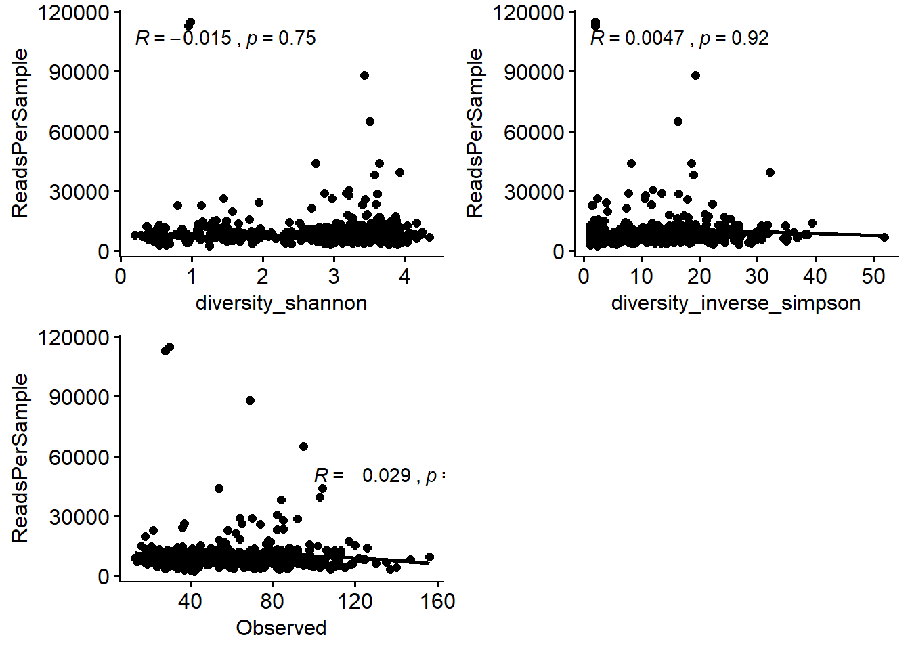

# Alpha diversities  

Alpha diversity measures are used to identify within individual taxa richness and evenness. The commonly used metrics/indices are Shannon, Inverse Simpson, Simpson, Gini, Observed and Chao1. These indices do not take into account the phylogeny of the taxa identified in sequencing. Phylogenetic diversity (Faith's PD) uses phylogenetic distance to calculate the diversity of a given sample.   

*It is important to note that, alpha diversity indices are sensitive to noise that is inherent to application of polymerase chain reaction and the  sequencing errors.*  

One has to consider the sequencing depth (how much of the taxa have been sampled) for each sample. If there is a large difference, then it is important to normalize the samples to equal sampling depth. First, we look at the sampling depth (no. of reads per sample).     

**Load packages**  
 


```r
library(microbiome) # data analysis and visualisation
library(phyloseq) # also the basis of data object. Data analysis and visualisation
library(microbiomeutilities) # some utility tools 
library(RColorBrewer) # nice color options
library(ggpubr) # publication quality figures, based on ggplot2
library(DT) # interactive tables in html and markdown
library(data.table) # alternative to data.frame
library(dplyr) # data handling  
```

The data for tutorial is stored as *.rds file in the R project `phyobjects` folder.  

We will use the filtered phyloseq object from **Set-up and Pre-processing** section.  


```r
ps1 <- readRDS("./phyobjects/ps.ng.tax.rds")

# use print option to see the data saved as phyloseq object.

print(ps1)
```

```
## phyloseq-class experiment-level object
## otu_table()   OTU Table:         [ 4710 taxa and 474 samples ]
## sample_data() Sample Data:       [ 474 samples by 30 sample variables ]
## tax_table()   Taxonomy Table:    [ 4710 taxa by 6 taxonomic ranks ]
## phy_tree()    Phylogenetic Tree: [ 4710 tips and 4709 internal nodes ]
```


```r
summary(sample_sums(ps1))
```

```
##    Min. 1st Qu.  Median    Mean 3rd Qu.    Max. 
##    2458    6436    8188    9836   10306  115023
```

As is evident there is a large difference in the number of reads. Minimum is 2458 and maximum is 115023!! There is a ~47X difference!  

We can plot the rarefaction curve for the observed ASVs in the entire data set. This is a way to check how has the richness captured in the sequencing effort.   


```r
otu_tab <- t(abundances(ps1))
p <- vegan::rarecurve(otu_tab, 
                      step = 50, label = FALSE, 
                      sample = min(rowSums(otu_tab), 
                                   col = "blue", cex = 0.6))
```


Almost all samples are reaching a plateau and few samples have high number of reads and high number of ASVs.  
Since we are comparing different body sites, some are expected to have low bacterial load.  
We will normalize to the lowest depth of at least 2458 reads to keep maximum samples for our anlaysis. This can be varied to remove samples with lower sequencing depth. This decision will depend on the research question being addressed.  

Note: At the end of this section, we look at relationship between reads per samples and diversity metrics. 

## Equal sample sums  


```r
set.seed(9242)  # This will help in reproducing the filtering and nomalisation. 

ps0.rar <- rarefy_even_depth(ps1, sample.size = 2458)
```

```
## You set `rngseed` to FALSE. Make sure you've set & recorded
##  the random seed of your session for reproducibility.
## See `?set.seed`
```

```
## ...
```

```
## 63OTUs were removed because they are no longer 
## present in any sample after random subsampling
```

```
## ...
```

```r
saveRDS(ps0.rar, "./phyobjects/ps0.rar.rds")
```

Check how much data you have now  


```r
ps0.rar <- readRDS("./phyobjects/ps0.rar.rds")


print(ps0.rar)
```

```
## phyloseq-class experiment-level object
## otu_table()   OTU Table:         [ 4647 taxa and 474 samples ]
## sample_data() Sample Data:       [ 474 samples by 30 sample variables ]
## tax_table()   Taxonomy Table:    [ 4647 taxa by 6 taxonomic ranks ]
## phy_tree()    Phylogenetic Tree: [ 4647 tips and 4646 internal nodes ]
```

The plot below is only for a quick and dirty check for reads per samples.   


```r
 # quick check for sampling depth

barplot(sample_sums(ps0.rar), las =2)
```


Quick check taxa prevalence.  


```r
# quick check taxa prevalence

p.rar <- plot_taxa_prevalence(ps0.rar, "Phylum")

p.rar
```


Compare this to taxa prevalence plot from previous section of the tutorial.  

Do you see any difference?  

## Diversities  

### Non-phylogenetic diversities  

For more diversity indices please refer to [Microbiome Package](http://microbiome.github.io/microbiome/Diversity.html)  

Let us calculate diversity.  


```r
hmp.div <- diversities(ps0.rar, index = "all")

datatable(hmp.div)
```

<!--html_preserve--><div id="htmlwidget-3c176d098b2f291e2bad" style="width:100%;height:auto;" class="datatables html-widget"></div>
<script type="application/json" data-for="htmlwidget-3c176d098b2f291e2bad">{"x":{"filter":"none","data":[["1927.SRS014341.SRX020546.SRR043648","1927.SRS014837.SRX020546.SRR043659","1927.SRS015389.SRX020546.SRR043661","1927.SRS014627.SRX020546.SRR043662","1927.SRS014923.SRX020546.SRR043675","1927.SRS015127.SRX020546.SRR043678","1927.SRS014548.SRX020546.SRR043685","1927.SRS014817.SRX020546.SRR043698","1927.SRS014823.SRX020546.SRR043699","1927.SRS015405.SRX020546.SRR043702","1927.SRS014780.SRX020554.SRR043708","1927.SRS055144.SRX020554.SRR043713","1927.SRS057320.SRX020554.SRR043718","1927.SRS015307.SRX020554.SRR043719","1927.SRS015854.SRX020554.SRR043727","1927.SRS015190.SRX020554.SRR043731","1927.SRS015281.SRX020554.SRR043805","1927.SRS015880.SRX020554.SRR043820","1927.SRS014885.SRX020554.SRR043822","1927.SRS014369.SRX020554.SRR043823","1927.SRS046341.SRX020554.SRR043828","1927.SRS014353.SRX020554.SRR043830","1927.SRS015204.SRX020554.SRR043834","1927.SRS014289.SRX020574.SRR043848","1927.SRS014615.SRX020574.SRR043854","1927.SRS015283.SRX020574.SRR043859","1927.SRS015192.SRX020574.SRR043863","1927.SRS019552.SRX020574.SRR043864","1927.SRS049760.SRX020574.SRR043866","1927.SRS016279.SRX020577.SRR043973","1927.SRS019787.SRX020577.SRR043974","1927.SRS015578.SRX020577.SRR044021","1927.SRS015031.SRX020577.SRR044026","1927.SRS015241.SRX020577.SRR044027","1927.SRS015261.SRX020577.SRR044036","1927.SRS014999.SRX020577.SRR044050","1927.SRS019767.SRX020577.SRR044052","1927.SRS016267.SRX020577.SRR044054","1927.SRS048870.SRX020577.SRR044064","1927.SRS015332.SRX020577.SRR044071","1927.SRS015013.SRX020577.SRR044075","1927.SRS015247.SRX020577.SRR044079","1927.SRS057065.SRX020577.SRR044083","1927.SRS015960.SRX020577.SRR044087","1927.SRS015346.SRX020577.SRR044088","1927.SRS015572.SRX020577.SRR044090","1927.SRS015613.SRX020539.SRR044127","1927.SRS015724.SRX020539.SRR044132","1927.SRS015782.SRX020539.SRR044139","1927.SRS015518.SRX020539.SRR044146","1927.SRS015599.SRX020539.SRR044148","1927.SRS016018.SRX020539.SRR044156","1927.SRS015679.SRX020539.SRR044158","1927.SRS015663.SRX020539.SRR044161","1927.SRS015631.SRX020539.SRR044164","1927.SRS015506.SRX020539.SRR044176","1927.SRS015526.SRX020539.SRR044187","1927.SRS016164.SRX020539.SRR044188","1927.SRS015784.SRX020539.SRR044190","1927.SRS016012.SRX020539.SRR044196","1927.SRS015738.SRX020539.SRR044197","1927.SRS048610.SRX020539.SRR044199","1927.SRS015718.SRX020539.SRR044201","1927.SRS018545.SRX020516.SRR044294","1927.SRS016217.SRX020516.SRR044297","1927.SRS018601.SRX020516.SRR044305","1927.SRS018749.SRX020516.SRR044310","1927.SRS019243.SRX020516.SRR044314","1927.SRS018767.SRX020516.SRR044315","1927.SRS016095.SRX020516.SRR044317","1927.SRS019257.SRX020516.SRR044326","1927.SRS016109.SRX020516.SRR044328","1927.SRS016070.SRX020516.SRR044337","1927.SRS016203.SRX020516.SRR044343","1927.SRS019910.SRX020516.SRR044347","1927.SRS016329.SRX020516.SRR044348","1927.SRS016235.SRX020516.SRR044349","1927.SRS018559.SRX020516.SRR044352","1927.SRS019267.SRX020516.SRR044360","1927.SRS016127.SRX020516.SRR044367","1927.SRS019904.SRX020516.SRR044374","1927.SRS019880.SRX020525.SRR044521","1927.SRS019231.SRX020525.SRR044523","1927.SRS019773.SRX020525.SRR044539","1927.SRS016205.SRX020525.SRR044542","1927.SRS016097.SRX020525.SRR044543","1927.SRS015653.SRX020525.SRR044551","1927.SRS015249.SRX020525.SRR044553","1927.SRS018755.SRX020525.SRR044563","1927.SRS018551.SRX020525.SRR044564","1927.SRS016046.SRX020525.SRR044567","1927.SRS015911.SRX020510.SRR044585","1927.SRS018995.SRX020510.SRR044593","1927.SRS019013.SRX020510.SRR044597","1927.SRS015901.SRX020510.SRR044599","1927.SRS015911.SRX020520.SRR044615","1927.SRS018995.SRX020520.SRR044623","1927.SRS019013.SRX020520.SRR044627","1927.SRS015901.SRX020520.SRR044629","1927.SRS015831.SRX020562.SRR044701","1927.SRS015815.SRX020562.SRR044705","1927.SRS015805.SRX020562.SRR044710","1927.SRS019105.SRX020564.SRR044720","1927.SRS019089.SRX020564.SRR044731","1927.SRS015468.SRX020545.SRR044737","1927.SRS015452.SRX020545.SRR044740","1927.SRS019105.SRX020545.SRR044745","1927.SRS019089.SRX020545.SRR044757","1927.SRS011529.SRX020661.SRR044768","1927.SRS011653.SRX020661.SRR044770","1927.SRS011621.SRX020661.SRR044776","1927.SRS011415.SRX020661.SRR044786","1927.SRS011684.SRX020661.SRR044791","1927.SRS011413.SRX020661.SRR044792","1927.SRS011649.SRX020661.SRR044793","1927.SRS011452.SRX020661.SRR044798","1927.SRS011410.SRX020661.SRR044800","1927.SRS011405.SRX020661.SRR044803","1927.SRS011567.SRX020661.SRR044807","1927.SRS011157.SRX020661.SRR044808","1927.SRS011586.SRX020661.SRR044826","1927.SRS011271.SRX020661.SRR044827","1927.SRS011582.SRX020661.SRR044836","1927.SRS011529.SRX020659.SRR044994","1927.SRS011653.SRX020659.SRR044997","1927.SRS011621.SRX020659.SRR045004","1927.SRS011617.SRX020659.SRR045007","1927.SRS011415.SRX020659.SRR045013","1927.SRS011413.SRX020659.SRR045020","1927.SRS011649.SRX020659.SRR045021","1927.SRS011410.SRX020659.SRR045027","1927.SRS011567.SRX020659.SRR045035","1927.SRS011157.SRX020659.SRR045036","1927.SRS011586.SRX020659.SRR045050","1927.SRS011271.SRX020659.SRR045051","1927.SRS011582.SRX020659.SRR045059","1927.SRS011600.SRX020663.SRR045140","1927.SRS011525.SRX020663.SRR045143","1927.SRS011472.SRX020663.SRR045150","1927.SRS011492.SRX020663.SRR045157","1927.SRS011429.SRX020663.SRR045163","1927.SRS011466.SRX020663.SRR045171","1927.SRS011516.SRX020663.SRR045172","1927.SRS011667.SRX020663.SRR045174","1927.SRS011600.SRX020667.SRR045217","1927.SRS011525.SRX020667.SRR045222","1927.SRS011472.SRX020667.SRR045231","1927.SRS011429.SRX020667.SRR045242","1927.SRS011466.SRX020667.SRR045250","1927.SRS011516.SRX020667.SRR045251","1927.SRS011667.SRX020667.SRR045253","1927.SRS011171.SRX020537.SRR045382","1927.SRS011434.SRX020662.SRR045405","1927.SRS011369.SRX020662.SRR045409","1927.SRS011497.SRX020662.SRR045415","1927.SRS011441.SRX020571.SRR045475","1927.SRS011285.SRX020571.SRR045492","1927.SRS014442.SRX020543.SRR045553","1927.SRS014663.SRX020543.SRR045554","1927.SRS014659.SRX020543.SRR045556","1927.SRS014287.SRX020543.SRR045558","1927.SRS019582.SRX020543.SRR045562","1927.SRS014446.SRX020543.SRR045567","1927.SRS048819.SRX020543.SRR045568","1927.SRS057762.SRX020543.SRR045571","1927.SRS049760.SRX020543.SRR045572","1927.SRS050422.SRX020543.SRR045575","1927.SRS043395.SRX020543.SRR045584","1927.SRS014281.SRX020543.SRR045593","1927.SRS019576.SRX020543.SRR045603","1927.SRS014436.SRX020543.SRR045604","1927.SRS048819.SRX020511.SRR045612","1927.SRS019552.SRX020511.SRR045619","1927.SRS019582.SRX020511.SRR045623","1927.SRS050422.SRX020511.SRR045628","1927.SRS014663.SRX020511.SRR045630","1927.SRS014436.SRX020511.SRR045631","1927.SRS043395.SRX020511.SRR045632","1927.SRS014446.SRX020511.SRR045634","1927.SRS014281.SRX020511.SRR045648","1927.SRS014659.SRX020511.SRR045649","1927.SRS014442.SRX020511.SRR045656","1927.SRS019576.SRX020511.SRR045660","1927.SRS014287.SRX020511.SRR045664","1927.SRS014601.SRX020547.SRR045774","1927.SRS018920.SRX020572.SRR045810","1927.SRS018968.SRX020572.SRR045817","1927.SRS019830.SRX020575.SRR045834","1927.SRS019498.SRX020575.SRR045838","1927.SRS019180.SRX020575.SRR045841","1927.SRS018904.SRX020572.SRR045947","1927.SRS019510.SRX020572.SRR045959","1927.SRS018868.SRX020572.SRR045963","1927.SRS018852.SRX020572.SRR045969","1927.SRS018952.SRX020572.SRR045970","1927.SRS018639.SRX020572.SRR045994","1927.SRS052368.SRX020572.SRR045996","1927.SRS018712.SRX020572.SRR046003","1927.SRS046309.SRX020575.SRR046010","1927.SRS044041.SRX020531.SRR046039","1927.SRS046108.SRX020531.SRR046041","1927.SRS043804.SRX020531.SRR046050","1927.SRS046349.SRX020531.SRR046051","1927.SRS053335.SRX020531.SRR046056","1927.SRS014601.SRX020557.SRR046087","1927.SRS015135.SRX020536.SRR046115","1927.SRS064859.SRX020670.SRR046230","1927.SRS052326.SRX020670.SRR046232","1927.SRS011405.SRX020659.SRR046237","1927.SRS054928.SRX020670.SRR046262","1927.SRS058246.SRX020670.SRR046264","1927.SRS050634.SRX020670.SRR046333","1927.SRS043353.SRX020670.SRR046339","1927.SRS043411.SRX020670.SRR046345","1927.SRS064276.SRX020670.SRR046347","1927.SRS050522.SRX020670.SRR046350","1927.SRS065263.SRX020670.SRR046351","1927.SRS053092.SRX020670.SRR046352","1927.SRS045526.SRX020670.SRR046355","1927.SRS053285.SRX020670.SRR046366","1927.SRS045877.SRX020523.SRR046406","1927.SRS043299.SRX020523.SRR046410","1927.SRS057447.SRX020523.SRR046411","1927.SRS055563.SRX020523.SRR046412","1927.SRS049823.SRX020523.SRR046414","1927.SRS042387.SRX020523.SRR046416","1927.SRS048838.SRX020523.SRR046418","1927.SRS045607.SRX020523.SRR046421","1927.SRS054590.SRX020550.SRR046427","1927.SRS057278.SRX020550.SRR046428","1927.SRS046313.SRX020550.SRR046437","1927.SRS052697.SRX020550.SRR046441","1927.SRS054461.SRX020550.SRR046442","1927.SRS044078.SRX020550.SRR046444","1927.SRS062608.SRX020549.SRR046471","1927.SRS055470.SRX020549.SRR046473","1927.SRS046500.SRX020549.SRR046479","1927.SRS058381.SRX020549.SRR046484","1927.SRS051242.SRX020549.SRR046495","1927.SRS064321.SRX020519.SRR046501","1927.SRS063720.SRX020519.SRR046502","1927.SRS063324.SRX020519.SRR046503","1927.SRS064557.SRX020569.SRR046542","1927.SRS063298.SRX020569.SRR046551","1927.SRS065101.SRX020569.SRR046552","1927.SRS048971.SRX020567.SRR046578","1927.SRS050616.SRX020567.SRR046579","1927.SRS063921.SRX020569.SRR046605","1927.SRS063285.SRX020569.SRR046656","1927.SRS063755.SRX020569.SRR046658","1927.SRS064034.SRX020569.SRR046664","1927.SRS056240.SRX020567.SRR046718","1927.SRS045536.SRX020567.SRR046727","1927.SRS049139.SRX020568.SRR046809","1927.SRS051724.SRX020568.SRR046855","1927.SRS049453.SRX020568.SRR046859","1927.SRS042288.SRX020568.SRR046871","1927.SRS063275.SRX020532.SRR046899","1927.SRS064413.SRX020532.SRR046901","1927.SRS063961.SRX020532.SRR046907","1927.SRS064975.SRX020532.SRR046909","1927.SRS062739.SRX020532.SRR046911","1927.SRS064085.SRX020532.SRR046916","1927.SRS064128.SRX020532.SRR046925","1927.SRS057634.SRX020568.SRR046930","1927.SRS047424.SRX020568.SRR046941","1927.SRS048570.SRX020568.SRR046946","1927.SRS062464.SRX020532.SRR046982","1927.SRS063827.SRX020532.SRR046984","1927.SRS063214.SRX020532.SRR046986","1927.SRS064192.SRX020532.SRR046999","1927.SRS045153.SRX020568.SRR047010","1927.SRS065240.SRX020532.SRR047029","1927.SRS063612.SRX020532.SRR047031","1927.SRS062847.SRX020532.SRR047036","1927.SRS065582.SRX020532.SRR047041","1927.SRS065466.SRX020532.SRR047056","1927.SRS057704.SRX020540.SRR047110","1927.SRS048544.SRX020540.SRR047113","1927.SRS058077.SRX020540.SRR047123","1927.SRS056259.SRX020578.SRR047235","1927.SRS058032.SRX020578.SRR047241","1927.SRS051031.SRX020578.SRR047244","1927.SRS048194.SRX020540.SRR047261","1927.SRS046382.SRX020540.SRR047262","1927.SRS042703.SRX020540.SRR047267","1927.SRS052037.SRX020540.SRR047270","1927.SRS049164.SRX020540.SRR047273","1927.SRS042669.SRX020540.SRR047279","1927.SRS043565.SRX020540.SRR047280","1927.SRS055113.SRX020540.SRR047292","1927.SRS052584.SRX020540.SRR047294","1927.SRS046522.SRX020578.SRR047301","1927.SRS042628.SRX020578.SRR047303","1927.SRS048401.SRX020578.SRR047305","1927.SRS054330.SRX020578.SRR047307","1927.SRS062829.SRX020578.SRR047321","1927.SRS064711.SRX020548.SRR047339","1927.SRS014345.SRX020546.SRR047368","1927.SRS014570.SRX020546.SRR047369","1927.SRS015147.SRX020546.SRR047380","1927.SRS014613.SRX020546.SRR047386","1927.SRS014917.SRX020546.SRR047389","1927.SRS018733.SRX020516.SRR047425","1927.SRS016257.SRX020525.SRR047445","1927.SRS015468.SRX020564.SRR047455","1927.SRS015452.SRX020564.SRR047456","1927.SRS011684.SRX020659.SRR047483","1927.SRS011452.SRX020659.SRR047485","1927.SRS011634.SRX020659.SRR047489","1927.SRS011492.SRX020667.SRR047500","1927.SRS011543.SRX020667.SRR047502","1927.SRS011171.SRX020570.SRR047528","1927.SRS011640.SRX020570.SRR047529","1927.SRS018708.SRX020572.SRR047591","1927.SRS019705.SRX020575.SRR047605","1927.SRS018958.SRX020575.SRR047607","1927.SRS046639.SRX020670.SRR047659","1927.SRS049428.SRX020670.SRR047663","1927.SRS057292.SRX020670.SRR047664","1927.SRS045414.SRX020563.SRR047697","1927.SRS058416.SRX020523.SRR047701","1927.SRS055665.SRX020523.SRR047702","1927.SRS049748.SRX020523.SRR047703","1927.SRS050733.SRX020550.SRR047710","1927.SRS055482.SRX020550.SRR047716","1927.SRS012191.SRX020675.SRR047747","1927.SRS021601.SRX020675.SRR047748","1927.SRS021623.SRX020675.SRR047756","1927.SRS021641.SRX020675.SRR047763","1927.SRS022987.SRX020675.SRR047766","1927.SRS023009.SRX020675.SRR047774","1927.SRS023219.SRX020675.SRR047780","1927.SRS021910.SRX020675.SRR047783","1927.SRS021932.SRX020675.SRR047791","1927.SRS021541.SRX020675.SRR047797","1927.SRS021563.SRX020675.SRR047805","1927.SRS022924.SRX020675.SRR047811","1927.SRS022946.SRX020675.SRR047818","1927.SRS022952.SRX020675.SRR047821","1927.SRS022964.SRX020675.SRR047823","1927.SRS023047.SRX020675.SRR047826","1927.SRS023075.SRX020676.SRR047838","1927.SRS023087.SRX020676.SRR047841","1927.SRS020119.SRX020676.SRR047844","1927.SRS020141.SRX020676.SRR047852","1927.SRS020176.SRX020676.SRR047859","1927.SRS020198.SRX020676.SRR047867","1927.SRS023422.SRX020676.SRR047874","1927.SRS024511.SRX020676.SRR047887","1927.SRS022502.SRX020676.SRR047897","1927.SRS022508.SRX020676.SRR047901","1927.SRS022520.SRX020676.SRR047904","1927.SRS022436.SRX020676.SRR047915","1927.SRS022454.SRX020676.SRR047922","1927.SRS023851.SRX020676.SRR047925","1927.SRS023873.SRX020677.SRR047934","1927.SRS023879.SRX020677.SRR047937","1927.SRS024533.SRX020677.SRR047938","1927.SRS023891.SRX020677.SRR047940","1927.SRS048083.SRX020677.SRR047956","1927.SRS058399.SRX020677.SRR047964","1927.SRS057122.SRX020677.SRR047969","1927.SRS054426.SRX020677.SRR047974","1927.SRS013543.SRX020677.SRR047980","1927.SRS013565.SRX020677.SRR047987","1927.SRS013583.SRX020677.SRR047989","1927.SRS047084.SRX020677.SRR047999","1927.SRS052195.SRX020677.SRR048002","1927.SRS045722.SRX020677.SRR048004","1927.SRS013762.SRX020677.SRR048007","1927.SRS023069.SRX020678.SRR048019","1927.SRS023488.SRX020678.SRR048028","1927.SRS050599.SRX020678.SRR048036","1927.SRS023422.SRX020683.SRR048341","1927.SRS023450.SRX020683.SRR048347","1927.SRS023510.SRX020683.SRR048354","1927.SRS013784.SRX020683.SRR048360","1927.SRS015423.SRX020546.SRR049218","1927.SRS011634.SRX020661.SRR049230","1927.SRS011543.SRX020663.SRR049239","1927.SRS019377.SRX020572.SRR049336","1927.SRS019359.SRX020572.SRR049337","1927.SRS019528.SRX020572.SRR049347","1927.SRS016056.SRX020536.SRR049357","1927.SRS065266.SRX020670.SRR049368","1927.SRS054770.SRX020563.SRR049379","1927.SRS054288.SRX020549.SRR049392","1927.SRS055821.SRX020549.SRR049399","1927.SRS050199.SRX020549.SRR049401","1927.SRS043928.SRX020549.SRR049402","1927.SRS065665.SRX020519.SRR049404","1927.SRS064626.SRX020569.SRR049420","1927.SRS065457.SRX020569.SRR049444","1927.SRS043378.SRX020567.SRR049451","1927.SRS065559.SRX020569.SRR049456","1927.SRS055924.SRX020567.SRR049497","1927.SRS057843.SRX020567.SRR049503","1927.SRS049597.SRX020568.SRR049524","1927.SRS065725.SRX020519.SRR049530","1927.SRS050106.SRX020568.SRR049547","1927.SRS053253.SRX020568.SRR049548","1927.SRS044548.SRX020568.SRR049550","1927.SRS062461.SRX020512.SRR049554","1927.SRS064628.SRX020532.SRR049557","1927.SRS064820.SRX020512.SRR049579","1927.SRS047957.SRX020540.SRR049627","1927.SRS048669.SRX020540.SRR049629","1927.SRS014760.SRX020554.SRR049816","1927.SRS014825.SRX020574.SRR049832","1927.SRS015976.SRX020577.SRR049839","1927.SRS015364.SRX020577.SRR049845","1927.SRS014925.SRX020574.SRR049866","1927.SRS014665.SRX020574.SRR049870","1927.SRS065676.SRX020548.SRR049896","1927.SRS018872.SRX020572.SRR051576","1927.SRS019381.SRX020572.SRR051585","1927.SRS019534.SRX020572.SRR051591","1927.SRS021087.SRX022097.SRR057663","1927.SRS020606.SRX022097.SRR057663","1927.SRS021105.SRX022097.SRR057663","1927.SRS020612.SRX022097.SRR057663","1927.SRS020492.SRX022097.SRR057663","1927.SRS020663.SRX022097.SRR057663","1927.SRS021109.SRX022097.SRR057663","1927.SRS020584.SRX022097.SRR057663","1927.SRS021149.SRX022097.SRR057663","1927.SRS020811.SRX022097.SRR057663","1927.SRS021131.SRX022097.SRR057663","1927.SRS020470.SRX022097.SRR057663","1927.SRS020641.SRX022097.SRR057663","1927.SRS056678.SRX022224.SRR058087","1927.SRS053602.SRX022224.SRR058087","1927.SRS063611.SRX022225.SRR058088","1927.SRS042248.SRX022225.SRR058088","1927.SRS047486.SRX022225.SRR058088","1927.SRS063239.SRX022228.SRR058091","1927.SRS024704.SRX022228.SRR058091","1927.SRS064586.SRX022228.SRR058091","1927.SRS064620.SRX022228.SRR058091","1927.SRS063807.SRX022232.SRR058094","1927.SRS063142.SRX022232.SRR058094","1927.SRS063292.SRX022232.SRR058094","1927.SRS064006.SRX022232.SRR058094","1927.SRS065219.SRX022232.SRR058094","1927.SRS021853.SRX022232.SRR058094","1927.SRS063307.SRX022232.SRR058094","1927.SRS064987.SRX022232.SRR058094","1927.SRS063918.SRX022232.SRR058094","1927.SRS065421.SRX022232.SRR058094","1927.SRS064647.SRX022232.SRR058094","1927.SRS062712.SRX022232.SRR058094","1927.SRS052116.SRX022241.SRR058097","1927.SRS042572.SRX022241.SRR058097","1927.SRS056286.SRX022241.SRR058097","1927.SRS049949.SRX022241.SRR058097","1927.SRS049766.SRX022241.SRR058097","1927.SRS056832.SRX022241.SRR058097","1927.SRS051345.SRX022241.SRR058097","1927.SRS057466.SRX022156.SRR058115","1927.SRS050791.SRX022156.SRR058115","1927.SRS057676.SRX022156.SRR058115","1927.SRS064462.SRX022156.SRR058115","1927.SRS048471.SRX022156.SRR058115","1927.SRS063968.SRX022156.SRR058115","1927.SRS046640.SRX022156.SRR058115","1927.SRS051892.SRX022156.SRR058115","1927.SRS053146.SRX022156.SRR058115","1927.SRS050327.SRX022156.SRR058115","1927.SRS050434.SRX022156.SRR058115","1927.SRS042803.SRX022156.SRR058115","1927.SRS050258.SRX022156.SRR058115","1927.SRS058191.SRX022156.SRR058115","1927.SRS063608.SRX022156.SRR058115"],[1.18629017531941,1.1056263978705,10.1029801778542,1.828223769774,12.9463782152928,20.6082572687706,2.11635577463328,16.9937782678158,13.3544436978356,11.8085309316634,1.18233111104327,20.1613908632829,33.9280082661336,16.6405856657321,17.0968804473321,8.30656577044276,11.2836524454471,20.0145891581751,11.3377745417424,22.5882291362899,15.0497793011369,12.2427821096828,1.43196230582904,2.67134457623357,12.1440051456252,2.68186955182354,3.26578660315738,2.79204075559031,2.39371634819196,27.5595230492734,11.9549406582795,11.283526006163,23.1822730412094,21.7238993801148,1.60079125947609,13.7039362363284,31.1322010841561,8.03612005969466,17.4173465328267,21.7760461344386,1.2230553934963,12.3412125173625,1.92450743490279,17.2436582414321,4.63066938089778,18.5488361240567,1.33076802102528,13.5599944339457,23.5827693076341,5.22843855522613,26.3409193959053,14.3272294390773,18.831785255651,22.195394698172,15.5926952518104,1.13586677991938,30.3231382311314,12.1221734890832,33.1048305790558,19.5110864243779,1.13879390191816,4.07624673793068,24.9297055522546,2.34089614647562,1.82015601774556,19.2639862258075,48.524327363264,3.69369613913588,1.73020170438112,15.884915313951,29.8376397613686,3.791743441697,1.47353844007596,21.0936297682473,16.5202806533996,26.5513689299055,28.0206847294753,15.0126825098647,5.91191470541037,14.4313326454177,17.2331327191306,2.72289147938733,3.02400882512518,3.55279595146557,1.73767502539601,4.02156366526397,3.68788371176006,3.79094880325073,3.51554359223222,2.11717303957607,2.40208745657427,6.02995734352138,19.1765504983178,7.65468205602503,2.01528366509093,6.84878356227739,20.068571960034,8.19528935574534,2.04346576131036,2.4158243072927,11.981826258716,7.58712474162332,36.8773514655078,25.4817082943206,9.09624753840687,21.0646537898333,38.1718495305728,22.8943152278532,19.6182825376827,17.4992730074321,17.0805434776463,14.1307980166526,1.40062759469326,16.1981929810451,3.16888143871368,6.1837427331532,14.0268661429022,18.8447075556443,13.3145954999229,30.3435453413154,27.0035040672209,20.8837900616652,1.1824643974676,18.1240595639497,15.7165704177722,16.1895120448029,2.33394755404949,14.1177223826749,15.585857126642,3.11271647413645,13.5853015775935,11.8471071301115,28.6651990321203,25.6085076803092,18.8148955517632,1.21991712639134,4.20941435158413,1.17841539263323,5.59910959373824,19.8432838271905,22.6373166875239,8.35026024750464,4.51580218788026,3.88977134307295,4.27931216683878,1.22207771034939,5.52421165816942,21.3581968198305,7.28780348940441,4.35981653706494,4.38561531671738,15.7340062605145,23.1995422884044,26.2930030550164,2.66715579676556,2.76693289856931,4.68744782469719,8.06506231244861,29.9325426315112,37.2814918115736,15.0113396938978,34.0032417464909,1.17527812306082,21.6532054590286,26.6643305411632,2.51741844945633,15.8509917095183,1.11079071826585,34.7076219582251,31.4691598520756,10.5451949593326,16.9654331942424,2.4272164179764,31.3070720888778,13.2371162028456,30.0636127504155,13.8386572175929,1.04973892761905,1.11941525777016,23.0615762794674,28.7442980160807,7.2356281781361,27.3237095125679,13.0831882476245,6.43683093549707,6.6718096748332,10.2161401705124,3.10432629069385,4.12273708028938,6.08766499405518,26.2489095111482,1.15858908176023,1.7599797253602,20.4475625769944,17.9290407202759,16.8460375969619,24.1883417407318,15.8818253509279,1.99354991130633,20.7475309405091,2.58425858993717,18.2900856719039,39.1874481112495,18.3709483209477,6.88160937083551,7.66147681304607,11.5708025953929,3.86575911835239,17.859190067987,16.9770651740203,14.6777284344117,1.71594516713368,27.5286323540133,16.9416468978358,17.3665808172557,2.86526379288104,11.5692516266904,19.9194355609772,14.6580717162405,1.38669637553627,9.03773799408829,19.5869907734602,19.5000032275347,13.1659250284379,19.1767939667869,10.531408949084,2.53653560021092,27.3353300998987,3.88224801349908,2.00155174355814,10.347010004898,31.9781722717986,22.2365662632865,7.26839244596614,3.54755149493858,3.86279817657552,3.52238510116321,2.4149301433586,3.53180325415596,11.7993523968737,2.10409000647063,8.67013179344707,9.05925783756875,1.48739236786752,18.673585827054,2.73168160062358,3.11441408376359,2.32823096090099,1.49684070535118,1.19847639571817,1.51737997864233,2.90081439152057,3.49148937891594,18.963715803086,8.4340950652614,20.3806561734684,16.7776444844324,8.25366320132239,19.922719778408,19.4561719887161,1.47617311725602,3.35272090421565,23.7632705075359,20.9851965572096,21.3089316197114,1.24739063846515,1.62058399094455,17.1190674532338,10.0217694206322,24.7828605181551,19.7392952123315,28.4149821752749,14.3491428652857,1.22938562095759,8.7896824126744,16.8002246791093,13.5222402764536,15.396402778698,6.40545279902292,1.12227435683106,21.0784699545061,2.07958205720761,24.262163681632,2.35958108574651,7.25812396235527,10.2572807127747,1.13271039952005,18.766622559343,8.12803568834048,11.9260092695676,1.12904759377516,2.43493056831774,20.5342931332164,17.3904748746467,25.3921777942153,6.92810406551798,30.5986467597188,24.9161346728032,3.62721441624902,4.32364946871851,1.13178865559536,11.7373694987431,22.3971440857664,7.2231369389058,4.17041526312883,10.8880230672193,20.6700194323562,1.37127384559516,6.13115625824522,25.3159972177294,19.9082773164624,14.0272569396075,16.2246402887358,1.66399165382774,1.30669407327721,3.92043325010252,1.84919277531767,16.3022152667224,23.6879900884512,1.14366006717609,8.20234323029094,11.7107513626249,17.751829021055,9.03960404927839,17.8803314590115,18.9864807959424,21.9599892412931,18.119819814416,17.4931929653886,11.0926850046451,17.6435867933675,33.3633221050306,1.31437101779191,35.0105116764212,23.2427387648014,9.83651407155114,5.62498626749614,9.37329576835482,10.5385364083851,2.92143913334023,1.7100316150269,30.9396136750036,3.4007643857052,6.35243624710071,30.6769502609826,8.42877670542214,14.6825794912173,5.96632577687716,3.39600085886991,12.5380056280039,14.3538473234565,3.13858522303423,3.38709847412037,21.3330084883409,1.81048118368502,5.36570645011172,18.1250382494645,3.40928861472067,16.8069544898186,2.91190960678527,9.79962694434983,14.9910030618372,11.9148612245059,13.7251678797627,8.12268120793639,9.57405364975533,6.96063779536631,34.2336729258978,2.51093600645006,1.82768288433056,6.65511247601444,10.5293166307659,13.8112615784132,19.7423912688299,4.70529908086546,9.23678714810319,18.2903071511174,13.2674633604315,1.15874062490051,22.3792245121716,13.9983966784367,1.17100431982187,21.5128825967441,26.3982348057849,16.8855860438338,2.68743572498657,24.447517925643,3.39354022642459,2.79283836868201,19.1359778036791,2.91714257572217,2.84652923766385,12.2544034010239,1.14138802134301,2.19789224014057,2.45208626226091,3.91663122847778,3.00875071710862,1.17316534782352,11.3597313568659,5.03833016444845,8.4528569030164,21.4572613754208,1.85082763593944,24.8052453524272,3.17841706332673,17.1903761999875,14.2992208726605,8.40979371398346,2.71505055979321,24.1386689253438,18.2691800621696,3.23151194882437,5.00370530486361,14.5307365221072,23.5285843354726,6.77010548868355,13.17017260096,8.52104817781789,14.7302613614199,1.28132475746769,7.492155374672,9.01449059126148,20.5831226791129,5.25636800537315,17.4273945575484,2.41229977568968,4.87116467469475,14.5405283120584,8.27477942646773,6.22214395320337,1.09012050975319,1.24408081034378,7.68107422277257,1.55978237578437,2.88788617785141,3.04694557242654,15.3898141025314,2.84343194274887,1.52339903216762,12.5263598742754,11.2993106440597,2.59727434599178,1.3037525457831,10.4600090719279,13.1629992418235,11.5558862345313,2.20858772807794,2.0857518459038,23.5135669473979,10.8811206443201,6.13284907445379,8.10859662920443,2.62447590965404,1.25164935378644,14.839816079306,4.638832583966,13.1978487671041,4.77442980397363,1.3276285413051,1.38347722027915,15.1047120942419,25.2107823909869,7.96608283362076,11.5711571609147,1.21081220174418,21.8614590796263,6.41993679696184,3.79496346843814,8.24818702081649,6.94391780066201,29.0067790751267,5.49330176516263,9.9409705082894],[0.157035925269507,0.0955353436512912,0.901019304957956,0.453021005123669,0.922758320252165,0.951475761052567,0.527489653683924,0.941154934221198,0.925118558089988,0.915315460848851,0.154213239709462,0.950400247344981,0.970525826563235,0.939905961239135,0.941509797469746,0.879613304988411,0.911376213966649,0.950036446309389,0.911799269220049,0.955729154597896,0.933553842884297,0.918319219353818,0.301657595364533,0.625656679075846,0.91765484385024,0.627125786442503,0.693795057205147,0.641839039062102,0.582239557850985,0.963714901806823,0.916352575175065,0.9113752208792,0.95686359149414,0.953967748491997,0.375308932954018,0.927028265254982,0.967878917481716,0.875561839224438,0.942585973235631,0.954077981198868,0.182375544625709,0.918970684720555,0.480386522876431,0.942007665310992,0.78404849974279,0.946088261640143,0.248554230188402,0.926253657044532,0.957596159002569,0.808738308878003,0.962036252988366,0.930202834801227,0.946898289969618,0.954945608600402,0.935867405612003,0.119615066063487,0.967021883012974,0.917506542791145,0.969792928025656,0.948747087771055,0.12187798133128,0.754676283284153,0.959887211748092,0.572813171782281,0.450596547630791,0.948089663879622,0.979391780281388,0.729268471923101,0.42203270435588,0.937047193501765,0.966485284761206,0.736269076382328,0.321361443445987,0.952592322374724,0.939468340703146,0.962337158485502,0.964312078392999,0.933389652426013,0.830850062994847,0.930706330138019,0.941972245191967,0.632743351114012,0.669313134375987,0.718531541450477,0.424518402241465,0.751340502541973,0.728841775349054,0.736213794514317,0.715548968811096,0.527672050745444,0.583695424051651,0.834161347579945,0.94785297803754,0.869361001191043,0.503791938910557,0.853988669534262,0.950170844144194,0.877978683046872,0.510635304523646,0.58606261350162,0.916540268702981,0.868197764758769,0.972883085138711,0.960756163266225,0.890064557304787,0.95252710963222,0.973802684116758,0.956321034717675,0.949027138431756,0.94285476890524,0.941453853543435,0.929232588363266,0.28603434361223,0.938264718714601,0.684431235645748,0.838285639756866,0.928708238190039,0.946934703176092,0.924894451355597,0.967044061966009,0.962967769015804,0.952115971428212,0.154308576104595,0.944824723375491,0.936372887123694,0.938231615799624,0.571541357788884,0.929167044591613,0.935839268134273,0.678737203240643,0.926391034141684,0.915591208130606,0.965114493052029,0.960950477377137,0.946850621772052,0.180272185408103,0.762437261700391,0.151402802227959,0.821400173856509,0.949605115327245,0.955825153051327,0.880243253460413,0.778555402031592,0.742915479651307,0.766317585393935,0.181721431025773,0.818978695625979,0.953179568086407,0.862784445072664,0.77063255036112,0.771981825175561,0.936443396332594,0.956895701321667,0.961967067896065,0.625068771305864,0.63858899486971,0.786664292084232,0.876008397547471,0.96659154511828,0.973177039023702,0.933383693901318,0.970591039305739,0.149137569756118,0.953817461258003,0.962496714535689,0.602767668515354,0.936912464637811,0.0997404069407544,0.971187884862765,0.968222856768321,0.905170079466858,0.941056618563717,0.58800542358159,0.968058335280888,0.92445484464471,0.966737197944177,0.927738653810377,0.0473821883807446,0.106676460715778,0.956637829614,0.965210491505461,0.861794998944017,0.963401748231146,0.923566031377591,0.844644047665549,0.850115628482013,0.902115673501977,0.67786891378081,0.757442693888738,0.835733405012179,0.96190317927016,0.136881215486073,0.431811636469084,0.951094415472038,0.944224567526967,0.940638859776714,0.958657769485865,0.937034945423224,0.498382260545099,0.951801493735935,0.613041820236606,0.945325570479085,0.974481624902926,0.945566228670964,0.854685154865367,0.869476861393461,0.913575571637687,0.741318595032841,0.944006419317272,0.941097004119989,0.931869566570293,0.417230795509391,0.963674185221402,0.940973861276276,0.9424181414567,0.6509919950531,0.913563985617446,0.949797774292409,0.931778202524958,0.278861603995125,0.889352844632793,0.948945705260914,0.948717957205876,0.9240463546739,0.94785364009584,0.905045943535696,0.605761496145828,0.963417306601185,0.742417280780911,0.500387635134375,0.903353722522098,0.968728669309162,0.955029027946143,0.862417995803874,0.718115437809223,0.741120308572132,0.716101456462053,0.585909347005279,0.716858520127565,0.915249586048048,0.524735160128731,0.884661499522325,0.889615681777706,0.327682445060747,0.946448421355088,0.633925125178673,0.678912317660869,0.570489347150931,0.331926238760733,0.165607263044369,0.34096929307401,0.655269222697212,0.713589276244488,0.947267718500756,0.881433634282968,0.950933866334402,0.940396877468236,0.878841676040309,0.949806050021153,0.948602428032608,0.322572679104977,0.701734791362258,0.957918250365291,0.952347360803898,0.953071321554433,0.198326515236279,0.382938492797799,0.941585603145042,0.900217221328076,0.959649532818561,0.949339629949134,0.964807298001047,0.930309426187451,0.186585573352418,0.886230246663061,0.940476986522479,0.926047756913378,0.935049763612084,0.84388301165024,0.108952286120411,0.952558226372298,0.519134146914709,0.958783560562776,0.576195958663728,0.862223350663813,0.902508274073598,0.11716180903458,0.946713906733199,0.876969044140089,0.916149654306259,0.114297744830814,0.589310671519113,0.951300977661491,0.942497257423494,0.960617793081623,0.855660366740574,0.967318816160313,0.959865363824208,0.724306344968125,0.768713905409082,0.116442813721291,0.914802034637566,0.955351450338014,0.861555995897887,0.760215725076319,0.908155962397737,0.951620751820164,0.270751058796736,0.836898627619351,0.960499284646007,0.949769636814679,0.928710224364937,0.938365351576129,0.399035447263415,0.234709929086935,0.744926150706979,0.459223498302814,0.938658643402821,0.957784514588786,0.125614307344676,0.878083619287347,0.914608382584954,0.943667776497063,0.889375685644126,0.944072625147225,0.947330945068361,0.954462637070895,0.94481181323865,0.942834907156254,0.909850500615383,0.943322182064708,0.97002696563454,0.23917981569621,0.971437149812538,0.95697581037591,0.898337968844861,0.822221788206226,0.893313939438879,0.90511016319075,0.657702949006284,0.415215490045622,0.967678975875258,0.705948461409615,0.842580080916765,0.967402235506054,0.881358821695121,0.931892076552477,0.832392658832751,0.705535999089008,0.920242498713952,0.930332267198785,0.681385105409612,0.704762052936857,0.953124286218396,0.447660650101527,0.813631250740678,0.944827702637839,0.706683677151243,0.940500820621262,0.656582746363479,0.897955299147732,0.933293322943432,0.916071200397765,0.927141146195052,0.876887941998396,0.89555103443299,0.856335004147795,0.970788994737299,0.601742140209383,0.452859131869434,0.84973957936788,0.905027074874159,0.927595318188529,0.949347574648728,0.787473658355407,0.891737247598549,0.945326232537385,0.924627641860887,0.136994096426143,0.955315699189839,0.928563247422442,0.146032185302173,0.953516224731717,0.962118679246657,0.940777892019615,0.627898077448904,0.959096052080154,0.705322485287409,0.641941327069379,0.947742414301519,0.657198791611192,0.648694983782882,0.918396680174863,0.123873756075212,0.545018640251423,0.592184004539072,0.744678540902955,0.667636140703278,0.147605235821856,0.911969749232178,0.801521542383979,0.881696802457031,0.953395730121203,0.459701173365924,0.959685946025035,0.685377979014076,0.94182791648267,0.930066119762374,0.881091019112961,0.631682733718166,0.958572694994376,0.94526300596978,0.690547330216804,0.800148102441605,0.931180363880483,0.957498505403389,0.852291814112567,0.924070850830983,0.882643545825358,0.932112541966221,0.219557731814748,0.866527060639906,0.889067497505695,0.951416506834759,0.809754568367781,0.942619076150608,0.585457823244999,0.794710286598417,0.93122670796145,0.879150857266189,0.839283692643407,0.0826702267748293,0.196193694424344,0.869809876718124,0.358884921688434,0.653725964801008,0.671802473582219,0.935021957163504,0.648312314085754,0.34357316836606,0.920168348184404,0.911499025781212,0.614980988995929,0.232983281041762,0.904397788460456,0.924029472187262,0.913464014814216,0.547221970272258,0.520556579171249,0.957471361013108,0.908097701267378,0.836943647583719,0.876674097167648,0.618971545396344,0.201054195430341,0.932613720098964,0.78442852120672,0.924230075852019,0.790550905331622,0.246777265712464,0.277183617234966,0.933795494163625,0.960334432129424,0.874467787884466,0.913578219870885,0.174108091610331,0.954257398998041,0.84423522666559,0.736492852087569,0.878761235956916,0.855989078686291,0.965525300226887,0.817960118932153,0.899406199911152],[0.513135996970448,0.296717253435263,2.71975217195822,1.14176017334281,3.33246154697035,3.79971599888606,0.874826438636092,3.44613550226678,3.17367462162584,3.06841864442605,0.53207476418939,3.5186051409359,3.93689290164103,3.32767885642295,3.3029133714468,2.76667872339057,3.04550680673674,3.42651982415746,3.00515579194401,3.50859972249091,3.30202910480936,2.85549052081678,0.827847813348459,1.92794254867008,3.11626022917728,1.31414894113312,1.81668563117477,1.5702452135413,1.3525102236759,3.86388217211722,2.84186589312713,3.08129345442161,3.61010164809552,3.58188748133653,0.875823434045446,3.17059167819355,3.90796779962721,2.59559886425961,3.39116855275697,3.61298000055467,0.577982873569813,3.18990360252349,1.08706237566359,3.32887747182469,2.15112193910456,3.40489627868324,0.773681591462091,3.24208619753723,3.70396541495287,2.08320980803876,3.73465304864668,3.02282564447658,3.42017402201765,3.59469423379364,3.34739082633608,0.418245237663313,3.93000001010187,3.20553780791213,3.98380701368403,3.48079855700988,0.41849734235679,1.92124679005946,3.58743910287724,1.57992444291585,1.23048079156063,3.49569614902274,4.28145234364625,2.20184910797954,1.20577541595373,3.41823561085865,3.85347314205256,2.21740300047944,1.08949276883104,3.63807463806055,3.45957776143382,3.8968068692476,3.91326281903409,3.40365807340273,2.7471493931127,3.33826950266087,3.50137798315523,1.410082669902,1.61616851010353,1.47330216793092,1.08780154432597,1.94734018850707,1.55530046251266,1.89863222097141,1.93775963397958,1.22762783514168,1.18973494954863,2.68894017743299,3.71457233524785,2.81831439478557,0.939632451980886,2.83213133152694,3.78067693157752,2.92774840924818,0.97722965789754,1.44000817395272,3.2056860013375,2.71346129710426,4.17521714813268,3.84464254485682,3.33500687085696,3.82049536285513,4.23937281213273,3.72681115951292,3.51883646368414,3.23118580747459,3.19697903867035,3.2275152587851,0.901133063099855,3.25926085264914,1.63396427920035,2.47518300082032,3.00471988569066,3.35346412406319,3.17831036741198,3.85021818218766,3.6415132787561,3.74095162517965,0.545700584321673,3.45933453275856,3.16352344260983,3.16728093988808,1.18707747252165,3.19196057485577,3.23750388785942,1.61023454758564,2.97410835855403,3.17348112763091,3.79643292820584,3.59844451961303,3.66191807623093,0.641719145039887,2.69240127697862,0.550885289045003,2.5828362064759,3.49727541295786,3.507909102891,3.26547485413926,2.82167941460171,2.54547725831482,2.69013498477152,0.639900614512918,2.53569415885459,3.46330263238209,3.13046311124397,2.82779849897691,2.69794560583183,3.66829336321366,3.8684840987164,3.75308528910287,1.49372075409139,1.35303693580623,2.4831113355824,3.10102582492268,3.73083538829024,4.10456483905429,3.34364347885765,4.00684092669546,0.540474185818013,3.72435936732643,3.7757564375496,1.40841268642847,3.3295153316205,0.359859148979108,4.15840632487061,3.84512275151427,3.26702781864955,3.52671533608052,1.36754896068849,3.90299749779291,3.15772196027075,3.75222758971658,3.48591033006473,0.174302699779504,0.385763054313978,3.90616706145888,3.87011111878512,2.97775035150609,3.73350199768071,3.19366938091338,3.0809547265734,2.7586831324702,2.97784557306129,1.68762911096657,2.45784997569004,2.40546852715527,3.7364006247407,0.460077637318915,0.893279030473845,3.44581494793483,3.30864540578138,3.43758670872743,3.48028210144473,3.35258022421227,1.09601123109223,3.62638009185923,1.54176813538821,3.608654559792,4.14756380410441,3.49287637194494,3.14069477703978,2.51508185491691,3.13006430121808,2.0040806923517,3.29502500739873,3.2819829444696,3.60602005331649,1.17543656422625,3.71635831617212,3.24090794403866,3.37415916023504,1.56134218293744,2.9544141317011,3.72094365950904,3.20478612123026,0.804617550830442,2.76993221546352,3.32643436112888,3.50298222820769,3.04018807295485,3.42258789479463,3.25139673181814,1.36952865913829,3.7618491229972,1.92429328846426,1.46945494317662,2.94528566737339,3.91541506900776,3.58175870370627,2.81598640779111,1.632277043421,2.07131515568093,1.67258814764503,1.6678811168444,1.78244373905438,2.96449004783016,1.04578445195312,2.74016432706914,2.79575689974809,0.799353502599177,3.42480526239953,1.48042178051096,1.64333573044532,1.31635530875072,0.840743385727342,0.5094733705936,0.96029876451543,1.51612592629126,1.74760782510113,3.41985031849823,2.6718586184158,3.44503894364444,3.27753868635306,2.78522565366757,3.54845425340705,3.47079415246649,0.995899992555831,1.58534858814551,3.69490473493065,3.78226612580497,3.60119073114644,0.682402331021503,0.870704174480855,3.4421145644814,2.86795317547092,3.77514295037528,3.69677258188887,3.81125296139456,3.05301267388675,0.460376056647637,2.64820757262936,3.25659152468069,3.13254743662495,3.25559670486489,2.6709234962352,0.384228100752953,3.45886640057217,1.20185831421513,3.62370138166022,1.2736399701377,2.36305109000425,2.80130797577541,0.386922877986538,3.65009764657598,2.58491480596196,2.88094437123651,0.402973540906476,1.08244665953709,3.50851027962607,3.20817605446991,3.60882835335262,2.33264725003653,3.99756084217391,3.72145837101231,1.70213109996225,2.69578871020695,0.383140411949284,3.12302088825525,3.78726411119241,2.70875368730385,1.57660798015484,3.4884570557862,3.85681543345251,0.884946766597833,2.44598848686754,3.7716841658226,3.49663364613054,3.28591349487339,3.59624317365672,1.13995273697134,0.626619581876902,1.8969426425089,0.873002126898759,3.40844640849511,3.53369212888405,0.425463795990186,2.75777665087962,3.12547102019617,3.34526208012446,3.00902306817339,3.41488047601583,3.42235962388347,3.60103677487563,3.61174696444931,3.65691544050809,2.76945831926063,3.31403071125952,3.89920717032699,0.640216716127457,3.99411812897497,3.50685839237144,2.89407098745504,2.8523971390852,2.74036678715249,3.18338963447699,1.50586062568031,0.912160972927128,3.87948917214546,1.71944623667244,2.87194134979139,3.79097272995329,2.80520562445271,3.11730583426211,3.02980772333932,1.82048442069178,3.31721809195669,3.26677362255599,1.53851402524623,2.01363545377164,3.47814170709331,1.34664138929094,2.17495202997591,3.36841659691029,1.4310731080442,3.44884120280626,1.72798052454075,2.78230710316156,3.36606937756157,3.07854640251621,3.1506507231646,2.63212941275513,3.08844659573385,2.37814345848431,4.05561327620694,1.10026832239718,1.26241729118033,2.82870786783368,3.20366664482243,3.17255084974764,3.59408869824318,2.27055093693557,3.12675440319069,3.47850354271923,3.3214184798412,0.461449452450548,3.72807889994623,3.28077395758383,0.504054782934925,3.75723821809592,3.76588304457061,3.52163464378558,1.64785374115476,3.56863648344413,1.95374608403886,1.48970770173787,3.85482542307675,1.51044026526634,1.89591275085302,3.13061459755098,0.390862287871383,1.27971891579649,1.36907019035112,1.8344040167859,1.31683370438373,0.523552089645273,3.37641042270948,2.00076900431005,2.49182099646815,3.5627326988214,1.14956252736337,3.74601637777878,1.53946889384311,3.41998978921031,3.30453804358192,3.19764626573646,1.86294460611475,3.52307215211111,3.642231785719,1.92233900868695,2.11900866192524,3.19034021158502,3.66141065835535,2.66891700314686,3.18300624576414,3.01941250305646,3.4111455763527,0.650107346314338,2.99083681796531,3.00324073922949,3.66755277076756,2.38674445206116,3.4944778679014,1.27751102025794,2.33282625558149,3.31570726357755,2.85092779027615,2.25352319947418,0.286757679091112,0.600975546162009,2.64281182702763,0.903807105129968,1.40382142037406,1.50073295582524,3.38097359905565,1.49701073535414,0.801070799038448,3.27288207786483,3.20551774246524,1.33190126121239,0.649551141448472,3.12108027586471,3.3057119447673,2.95256672173723,1.0871501304326,1.48301786249935,3.90821096460239,3.17492426410099,2.9998771929514,2.96139490914952,1.56389467260544,0.653821054326104,3.35002317723381,1.99147056219149,3.08167368213636,2.34451557604785,0.626052732896811,0.852152224441799,3.29302566249571,3.84740145159103,3.23694113606718,3.30463998236663,0.521612066634301,4.01618096812827,2.91529126461253,1.86646116537792,3.03380193683595,2.69256114451643,3.80372613101335,2.20673847382446,3.17487845935914],[3.69072978808789,1.96252424181539,6.58175038025883,5.00029168741286,16.3328902205763,22.0135607520922,2.46109369585272,16.0850386638995,12.2487924034824,11.3291989105534,5.5832972427612,15.1029642466282,21.7461259242239,11.7869533014739,10.4261621450106,10.4261621450106,11.7869533014739,12.2487924034824,10.4261621450106,12.2487924034824,12.4812278186822,7.40335720374179,5.19324149515791,7.40335720374179,14.1360268941131,2.97740361048219,9.1036999885936,5.5832972427612,6.99008760983502,22.0135607520922,7.19611290668981,9.3213735574811,14.8597996594199,15.3470747595089,3.33066648314215,13.184525499541,21.4795511564722,8.2442653150719,13.6583267737115,17.8392948628187,4.61866202160415,13.6583267737115,5.19324149515791,10.8755828552308,6.58175038025883,13.6583267737115,5.5832972427612,12.4812278186822,17.5859487879329,5.78036126546524,16.5816668906192,8.88714241693009,14.6175854833585,16.0850386638995,14.3763263205784,4.43003176700122,20.6850148335196,10.4261621450106,23.0918532386852,13.8966920523493,3.87321063909672,5.19324149515791,14.3763263205784,8.2442653150719,6.37946822609572,15.3470747595089,30.1338676989877,8.67171062228943,6.99008760983502,17.081980206893,18.6047392732794,9.3213735574811,10.203043863307,18.3486934203666,16.8313648100409,24.1837227620044,24.1837227620044,19.6378259368714,12.7146656937634,16.5816668906192,18.8616785474014,4.61866202160415,6.78529524870592,2.29284036860512,5.78036126546524,8.67171062228943,3.5098690474086,7.82144993009234,8.67171062228943,4.61866202160415,3.33066648314215,10.8755828552308,23.6360995504743,11.3291989105534,3.87321063909672,12.2487924034824,25.5674481837231,12.2487924034824,4.61866202160415,5.78036126546524,16.3328902205763,11.3291989105534,33.9962606753237,22.2818532313809,21.7461259242239,25.289034616895,36.4397215619199,21.2138415592266,19.1195081119978,10.8755828552308,10.8755828552308,12.017365490872,6.58175038025883,13.184525499541,5.5832972427612,9.3213735574811,8.45741474674359,12.7146656937634,11.101870110742,20.1596690634834,15.1029642466282,19.8983082769821,5.97875655972191,16.0850386638995,12.017365490872,10.8755828552308,6.58175038025883,12.2487924034824,14.1360268941131,5.00029168741286,8.67171062228943,12.4812278186822,18.0935441913082,14.1360268941131,18.6047392732794,6.37946822609572,19.1195081119978,6.78529524870592,9.98099749456534,15.1029642466282,12.7146656937634,19.8983082769821,18.3486934203666,15.3470747595089,18.0935441913082,5.78036126546524,10.8755828552308,12.7146656937634,18.6047392732794,19.6378259368714,16.3328902205763,23.0918532386852,23.0918532386852,14.6175854833585,7.61180714743582,4.61866202160415,11.3291989105534,16.3328902205763,16.0850386638995,27.5394986314885,15.592126825211,24.1837227620044,6.78529524870592,18.8616785474014,18.6047392732794,8.67171062228943,13.184525499541,4.43003176700122,28.6844308047059,20.1596690634834,16.0850386638995,16.0850386638995,4.24289353626838,22.821001759977,11.101870110742,16.3328902205763,18.8616785474014,2.12662426075825,4.80875717177961,24.4587955281746,24.4587955281746,13.4209361715919,15.8381161796618,12.7146656937634,18.3486934203666,10.4261621450106,12.9491001567386,7.82144993009234,14.1360268941131,8.2442653150719,17.3335093983523,4.05727621680682,4.61866202160415,13.184525499541,10.6503443781859,15.3470747595089,10.6503443781859,13.6583267737115,4.61866202160415,20.4219054956837,6.99008760983502,21.2138415592266,27.5394986314885,17.3335093983523,19.6378259368714,8.67171062228943,12.2487924034824,4.43003176700122,12.4812278186822,11.101870110742,19.3782249061713,5.5832972427612,16.5816668906192,9.76003126664279,13.4209361715919,7.19611290668981,8.45741474674359,20.9489943959191,10.6503443781859,4.61866202160415,11.5575622414454,11.101870110742,16.3328902205763,10.8755828552308,14.6175854833585,15.3470747595089,4.43003176700122,17.5859487879329,5.97875655972191,8.2442653150719,12.2487924034824,21.7461259242239,16.5816668906192,13.184525499541,5.00029168741286,9.76003126664279,4.61866202160415,9.3213735574811,5.97875655972191,8.67171062228943,2.80343614169032,7.82144993009234,8.67171062228943,2.80343614169032,14.6175854833585,4.61866202160415,6.37946822609572,4.05727621680682,3.33066648314215,3.33066648314215,4.61866202160415,4.05727621680682,5.3875838536235,9.54015368710136,8.03227325681188,12.9491001567386,10.8755828552308,9.3213735574811,15.8381161796618,15.1029642466282,5.00029168741286,5.5832972427612,18.6047392732794,19.6378259368714,17.5859487879329,6.58175038025883,3.87321063909672,15.3470747595089,9.1036999885936,19.8983082769821,19.8983082769821,16.0850386638995,8.45741474674359,2.29284036860512,7.61180714743582,10.6503443781859,11.3291989105534,12.017365490872,10.4261621450106,3.87321063909672,12.017365490872,3.5098690474086,15.3470747595089,4.24289353626838,5.5832972427612,6.58175038025883,3.33066648314215,17.8392948628187,7.61180714743582,8.2442653150719,4.24289353626838,2.6313135467309,16.0850386638995,10.203043863307,15.1029642466282,6.37946822609572,27.2553082106075,18.3486934203666,3.69072978808789,17.081980206893,2.80343614169032,11.7869533014739,20.6850148335196,12.017365490872,2.6313135467309,23.6360995504743,25.289034616895,7.40335720374179,9.98099749456534,23.6360995504743,14.6175854833585,11.7869533014739,18.6047392732794,10.4261621450106,2.80343614169032,7.61180714743582,2.80343614169032,14.6175854833585,13.4209361715919,3.87321063909672,9.54015368710136,12.2487924034824,11.7869533014739,12.9491001567386,14.3763263205784,13.184525499541,18.0935441913082,17.3335093983523,20.6850148335196,7.40335720374179,12.7146656937634,20.4219054956837,4.43003176700122,23.3635532252179,14.1360268941131,9.54015368710136,19.1195081119978,10.203043863307,15.3470747595089,3.87321063909672,2.80343614169032,19.1195081119978,4.61866202160415,14.3763263205784,16.8313648100409,10.6503443781859,9.1036999885936,16.0850386638995,6.17846471991307,16.0850386638995,14.8597996594199,5.5832972427612,8.45741474674359,11.7869533014739,7.82144993009234,5.3875838536235,12.2487924034824,2.46109369585272,16.0850386638995,6.99008760983502,9.54015368710136,15.1029642466282,12.9491001567386,11.7869533014739,10.4261621450106,13.6583267737115,6.58175038025883,26.6893896027719,1.80061220550164,6.58175038025883,12.7146656937634,16.8313648100409,11.5575622414454,16.8313648100409,9.1036999885936,16.5816668906192,15.1029642466282,16.8313648100409,3.5098690474086,20.9489943959191,11.5575622414454,4.80875717177961,20.4219054956837,16.3328902205763,19.6378259368714,6.17846471991307,11.7869533014739,8.45741474674359,6.58175038025883,26.126765017821,3.69072978808789,7.19611290668981,10.6503443781859,3.1531631756797,5.00029168741286,6.99008760983502,7.40335720374179,2.80343614169032,5.5832972427612,16.3328902205763,3.87321063909672,4.80875717177961,15.3470747595089,5.97875655972191,17.3335093983523,5.19324149515791,13.8966920523493,14.3763263205784,17.8392948628187,10.203043863307,12.9491001567386,16.0850386638995,10.203043863307,6.17846471991307,9.54015368710136,17.081980206893,9.54015368710136,12.4812278186822,14.3763263205784,17.081980206893,4.43003176700122,19.6378259368714,13.6583267737115,20.1596690634834,11.3291989105534,17.8392948628187,5.78036126546524,7.19611290668981,14.1360268941131,13.6583267737115,6.78529524870592,2.80343614169032,3.87321063909672,9.1036999885936,4.43003176700122,2.97740361048219,3.5098690474086,16.5816668906192,4.80875717177961,3.33066648314215,17.5859487879329,16.8313648100409,4.43003176700122,3.33066648314215,13.8966920523493,16.3328902205763,10.6503443781859,1.96252424181539,6.99008760983502,30.7192908945162,14.6175854833585,22.5510010037552,14.8597996594199,5.19324149515791,4.05727621680682,15.8381161796618,4.61866202160415,12.2487924034824,8.67171062228943,2.29284036860512,4.80875717177961,14.1360268941131,22.2818532313809,21.4795511564722,16.0850386638995,3.1531631756797,31.307925960755,16.5816668906192,6.37946822609572,16.3328902205763,9.3213735574811,19.8983082769821,5.5832972427612,14.3763263205784],[1,1,4,1,6,10,2,6,6,5,1,7,12,6,7,3,4,8,4,8,6,5,1,1,4,1,2,1,1,11,4,5,10,8,1,5,11,3,7,7,1,5,1,8,2,7,1,5,10,2,11,5,6,8,6,1,12,6,11,8,1,2,9,1,1,8,17,1,1,6,11,2,1,8,6,10,10,5,3,6,7,1,2,2,1,2,2,2,2,1,1,3,8,4,1,4,9,4,1,1,4,3,13,10,5,8,15,8,7,6,6,5,1,6,2,2,5,7,5,12,10,9,1,7,6,6,1,5,5,2,5,5,11,9,9,1,2,1,3,8,8,5,2,2,2,1,3,8,4,2,2,9,10,12,2,2,2,4,11,13,6,13,1,9,9,1,6,1,16,11,6,8,1,11,5,11,8,1,1,13,10,4,10,5,3,3,4,1,2,2,10,1,1,8,6,7,9,6,1,7,1,7,16,6,4,3,4,2,6,6,8,1,10,6,6,2,5,9,6,1,3,7,7,5,7,5,1,10,2,1,4,11,8,3,2,2,2,1,2,5,1,3,3,1,8,1,1,1,1,1,1,1,2,8,3,7,6,4,7,7,1,2,9,10,8,1,1,7,4,10,9,11,5,1,3,7,5,6,3,1,8,1,9,1,3,4,1,9,3,5,1,2,7,7,9,3,12,10,2,2,1,5,10,3,2,7,10,1,2,9,8,7,8,1,1,2,1,6,8,1,4,5,7,4,7,7,8,9,9,4,7,13,1,13,9,4,2,3,4,2,1,12,2,3,11,4,6,4,2,5,5,2,1,8,1,2,7,2,7,1,4,6,4,6,3,4,3,13,2,1,4,4,5,8,2,4,8,6,1,9,7,1,10,11,6,1,9,1,2,11,1,1,6,1,1,1,2,2,1,7,2,3,8,1,9,2,6,6,5,1,9,10,1,2,6,9,3,5,4,6,1,3,3,8,2,7,1,2,6,3,3,1,1,3,1,1,2,6,1,1,5,4,2,1,4,5,4,1,1,10,5,2,3,1,1,6,2,5,2,1,1,6,10,4,6,1,12,3,2,3,3,10,2,5]],"container":"<table class=\"display\">\n  <thead>\n    <tr>\n      <th> <\/th>\n      <th>inverse_simpson<\/th>\n      <th>gini_simpson<\/th>\n      <th>shannon<\/th>\n      <th>fisher<\/th>\n      <th>coverage<\/th>\n    <\/tr>\n  <\/thead>\n<\/table>","options":{"columnDefs":[{"className":"dt-right","targets":[1,2,3,4,5]},{"orderable":false,"targets":0}],"order":[],"autoWidth":false,"orderClasses":false}},"evals":[],"jsHooks":[]}</script><!--/html_preserve-->

This is one way to plot the data. 


```r
# get the metadata out as seprate object
hmp.meta <- meta(ps0.rar)

# Add the rownames as a new colum for easy integration later.
hmp.meta$sam_name <- rownames(hmp.meta)

# Add the rownames to diversity table
hmp.div$sam_name <- rownames(hmp.div)

# merge these two data frames into one
div.df <- merge(hmp.div,hmp.meta, by = "sam_name")

# check the tables
colnames(div.df)
```

```
##  [1] "sam_name"                    "inverse_simpson"            
##  [3] "gini_simpson"                "shannon"                    
##  [5] "fisher"                      "coverage"                   
##  [7] "BarcodeSequence"             "LinkerPrimerSequence"       
##  [9] "run_prefix"                  "body_habitat"               
## [11] "body_product"                "body_site"                  
## [13] "bodysite"                    "dna_extracted"              
## [15] "elevation"                   "env"                        
## [17] "env_biome"                   "env_feature"                
## [19] "env_material"                "env_package"                
## [21] "geo_loc_name"                "host_common_name"           
## [23] "host_scientific_name"        "host_subject_id"            
## [25] "host_taxid"                  "latitude"                   
## [27] "longitude"                   "physical_specimen_location" 
## [29] "physical_specimen_remaining" "psn"                        
## [31] "public"                      "sample_type"                
## [33] "scientific_name"             "sequencecenter"             
## [35] "title"                       "Description"
```

```r
# Now use this data frame to plot 
p <- ggboxplot(div.df, x = "scientific_name", y = "shannon",
              fill = "scientific_name", palette = "jco")
p + rotate_x_text()
```


```r
colnames(hmp.div)
```

```
## [1] "inverse_simpson" "gini_simpson"    "shannon"         "fisher"         
## [5] "coverage"        "sam_name"
```


Alternative way  


```r
# convert phyloseq object into a long data format.  

div.df2 <- div.df[,c("scientific_name", "inverse_simpson", "gini_simpson", "shannon", "fisher", "coverage")]

# the names are not pretty. we can replace them 

colnames(div.df2) <- c("Location", "Inverse Simpson", "Gini-Simpson", "Shannon", "Fisher", "Coverage")

# check
colnames(div.df2)
```

```
## [1] "Location"        "Inverse Simpson" "Gini-Simpson"    "Shannon"        
## [5] "Fisher"          "Coverage"
```

```r
div_df_melt <- reshape2::melt(div.df2)
```

```
## Using Location as id variables
```

```r
head(div_df_melt)
```

```
##                Location        variable    value
## 1  human gut metagenome Inverse Simpson 28.66520
## 2  human gut metagenome Inverse Simpson 30.34355
## 3 human oral metagenome Inverse Simpson 15.73401
## 4 human oral metagenome Inverse Simpson 16.22464
## 5  human gut metagenome Inverse Simpson 18.81490
## 6  human gut metagenome Inverse Simpson 20.88379
```

The diversity indices are stored under column named *variable*.  


```r
# Now use this data frame to plot 
p <- ggboxplot(div_df_melt, x = "Location", y = "value",
              fill = "Location", 
              palette = "jco", 
              legend= "right",
              facet.by = "variable", 
              scales = "free")

p <- p + rotate_x_text() 
# we will remove the x axis lables

p <- p + rremove("x.text")
p
```


```r
ggsave("./figures/Diversities.pdf", height = 4, width = 10)
```


```r
lev <- levels(div_df_melt$Location) # get the variables

# make a pairwise list that we want to compare.
L.pairs <- combn(seq_along(lev), 2, simplify = FALSE, FUN = function(i)lev[i])

pval <- list(cutpoints = c(0, 0.0001, 0.001, 0.01, 0.05, 0.1, 1), symbols = c("****", "***", "**", "*", "n.s")) 

p2 <- p + stat_compare_means(comparisons = L.pairs, 
                             label = "p.signif", 
                             symnum.args = list(cutpoints = c(0, 0.0001, 0.001, 0.01, 0.05, 0.1, 1), 
                                                symbols = c("****", "***", "**", "*", "n.s")))

print(p2)
```


### Phylogenetic diversity   

Phylogenetic diversity is calculated using the `picante` package.  


```r
library(picante)

ps0.rar.asvtab <- as.data.frame(ps0.rar@otu_table)

ps0.rar.tree <- ps0.rar@phy_tree

# hmp.meta from previous code chunks

# We first need to check if the tree is rooted or not 

ps0.rar@phy_tree
```

```
## 
## Phylogenetic tree with 4647 tips and 4646 internal nodes.
## 
## Tip labels:
## 	9410494158, 9410494576, 9410491420, 9410491569, 9410491595, 9410491783, ...
## 
## Rooted; includes branch lengths.
```

```r
# it is a rooted tree
df.pd <- pd(t(ps0.rar.asvtab), ps0.rar.tree,include.root=T) # t(ou_table) transposes the table for use in picante and the tre file comes from the first code chunck we used to read tree file (see making a phyloseq object section).


datatable(df.pd)
```

<!--html_preserve--><div id="htmlwidget-9024c37ebb1173a8aaa5" style="width:100%;height:auto;" class="datatables html-widget"></div>
<script type="application/json" data-for="htmlwidget-9024c37ebb1173a8aaa5">{"x":{"filter":"none","data":[["1927.SRS014341.SRX020546.SRR043648","1927.SRS014837.SRX020546.SRR043659","1927.SRS015389.SRX020546.SRR043661","1927.SRS014627.SRX020546.SRR043662","1927.SRS014923.SRX020546.SRR043675","1927.SRS015127.SRX020546.SRR043678","1927.SRS014548.SRX020546.SRR043685","1927.SRS014817.SRX020546.SRR043698","1927.SRS014823.SRX020546.SRR043699","1927.SRS015405.SRX020546.SRR043702","1927.SRS014780.SRX020554.SRR043708","1927.SRS055144.SRX020554.SRR043713","1927.SRS057320.SRX020554.SRR043718","1927.SRS015307.SRX020554.SRR043719","1927.SRS015854.SRX020554.SRR043727","1927.SRS015190.SRX020554.SRR043731","1927.SRS015281.SRX020554.SRR043805","1927.SRS015880.SRX020554.SRR043820","1927.SRS014885.SRX020554.SRR043822","1927.SRS014369.SRX020554.SRR043823","1927.SRS046341.SRX020554.SRR043828","1927.SRS014353.SRX020554.SRR043830","1927.SRS015204.SRX020554.SRR043834","1927.SRS014289.SRX020574.SRR043848","1927.SRS014615.SRX020574.SRR043854","1927.SRS015283.SRX020574.SRR043859","1927.SRS015192.SRX020574.SRR043863","1927.SRS019552.SRX020574.SRR043864","1927.SRS049760.SRX020574.SRR043866","1927.SRS016279.SRX020577.SRR043973","1927.SRS019787.SRX020577.SRR043974","1927.SRS015578.SRX020577.SRR044021","1927.SRS015031.SRX020577.SRR044026","1927.SRS015241.SRX020577.SRR044027","1927.SRS015261.SRX020577.SRR044036","1927.SRS014999.SRX020577.SRR044050","1927.SRS019767.SRX020577.SRR044052","1927.SRS016267.SRX020577.SRR044054","1927.SRS048870.SRX020577.SRR044064","1927.SRS015332.SRX020577.SRR044071","1927.SRS015013.SRX020577.SRR044075","1927.SRS015247.SRX020577.SRR044079","1927.SRS057065.SRX020577.SRR044083","1927.SRS015960.SRX020577.SRR044087","1927.SRS015346.SRX020577.SRR044088","1927.SRS015572.SRX020577.SRR044090","1927.SRS015613.SRX020539.SRR044127","1927.SRS015724.SRX020539.SRR044132","1927.SRS015782.SRX020539.SRR044139","1927.SRS015518.SRX020539.SRR044146","1927.SRS015599.SRX020539.SRR044148","1927.SRS016018.SRX020539.SRR044156","1927.SRS015679.SRX020539.SRR044158","1927.SRS015663.SRX020539.SRR044161","1927.SRS015631.SRX020539.SRR044164","1927.SRS015506.SRX020539.SRR044176","1927.SRS015526.SRX020539.SRR044187","1927.SRS016164.SRX020539.SRR044188","1927.SRS015784.SRX020539.SRR044190","1927.SRS016012.SRX020539.SRR044196","1927.SRS015738.SRX020539.SRR044197","1927.SRS048610.SRX020539.SRR044199","1927.SRS015718.SRX020539.SRR044201","1927.SRS018545.SRX020516.SRR044294","1927.SRS016217.SRX020516.SRR044297","1927.SRS018601.SRX020516.SRR044305","1927.SRS018749.SRX020516.SRR044310","1927.SRS019243.SRX020516.SRR044314","1927.SRS018767.SRX020516.SRR044315","1927.SRS016095.SRX020516.SRR044317","1927.SRS019257.SRX020516.SRR044326","1927.SRS016109.SRX020516.SRR044328","1927.SRS016070.SRX020516.SRR044337","1927.SRS016203.SRX020516.SRR044343","1927.SRS019910.SRX020516.SRR044347","1927.SRS016329.SRX020516.SRR044348","1927.SRS016235.SRX020516.SRR044349","1927.SRS018559.SRX020516.SRR044352","1927.SRS019267.SRX020516.SRR044360","1927.SRS016127.SRX020516.SRR044367","1927.SRS019904.SRX020516.SRR044374","1927.SRS019880.SRX020525.SRR044521","1927.SRS019231.SRX020525.SRR044523","1927.SRS019773.SRX020525.SRR044539","1927.SRS016205.SRX020525.SRR044542","1927.SRS016097.SRX020525.SRR044543","1927.SRS015653.SRX020525.SRR044551","1927.SRS015249.SRX020525.SRR044553","1927.SRS018755.SRX020525.SRR044563","1927.SRS018551.SRX020525.SRR044564","1927.SRS016046.SRX020525.SRR044567","1927.SRS015911.SRX020510.SRR044585","1927.SRS018995.SRX020510.SRR044593","1927.SRS019013.SRX020510.SRR044597","1927.SRS015901.SRX020510.SRR044599","1927.SRS015911.SRX020520.SRR044615","1927.SRS018995.SRX020520.SRR044623","1927.SRS019013.SRX020520.SRR044627","1927.SRS015901.SRX020520.SRR044629","1927.SRS015831.SRX020562.SRR044701","1927.SRS015815.SRX020562.SRR044705","1927.SRS015805.SRX020562.SRR044710","1927.SRS019105.SRX020564.SRR044720","1927.SRS019089.SRX020564.SRR044731","1927.SRS015468.SRX020545.SRR044737","1927.SRS015452.SRX020545.SRR044740","1927.SRS019105.SRX020545.SRR044745","1927.SRS019089.SRX020545.SRR044757","1927.SRS011529.SRX020661.SRR044768","1927.SRS011653.SRX020661.SRR044770","1927.SRS011621.SRX020661.SRR044776","1927.SRS011415.SRX020661.SRR044786","1927.SRS011684.SRX020661.SRR044791","1927.SRS011413.SRX020661.SRR044792","1927.SRS011649.SRX020661.SRR044793","1927.SRS011452.SRX020661.SRR044798","1927.SRS011410.SRX020661.SRR044800","1927.SRS011405.SRX020661.SRR044803","1927.SRS011567.SRX020661.SRR044807","1927.SRS011157.SRX020661.SRR044808","1927.SRS011586.SRX020661.SRR044826","1927.SRS011271.SRX020661.SRR044827","1927.SRS011582.SRX020661.SRR044836","1927.SRS011529.SRX020659.SRR044994","1927.SRS011653.SRX020659.SRR044997","1927.SRS011621.SRX020659.SRR045004","1927.SRS011617.SRX020659.SRR045007","1927.SRS011415.SRX020659.SRR045013","1927.SRS011413.SRX020659.SRR045020","1927.SRS011649.SRX020659.SRR045021","1927.SRS011410.SRX020659.SRR045027","1927.SRS011567.SRX020659.SRR045035","1927.SRS011157.SRX020659.SRR045036","1927.SRS011586.SRX020659.SRR045050","1927.SRS011271.SRX020659.SRR045051","1927.SRS011582.SRX020659.SRR045059","1927.SRS011600.SRX020663.SRR045140","1927.SRS011525.SRX020663.SRR045143","1927.SRS011472.SRX020663.SRR045150","1927.SRS011492.SRX020663.SRR045157","1927.SRS011429.SRX020663.SRR045163","1927.SRS011466.SRX020663.SRR045171","1927.SRS011516.SRX020663.SRR045172","1927.SRS011667.SRX020663.SRR045174","1927.SRS011600.SRX020667.SRR045217","1927.SRS011525.SRX020667.SRR045222","1927.SRS011472.SRX020667.SRR045231","1927.SRS011429.SRX020667.SRR045242","1927.SRS011466.SRX020667.SRR045250","1927.SRS011516.SRX020667.SRR045251","1927.SRS011667.SRX020667.SRR045253","1927.SRS011171.SRX020537.SRR045382","1927.SRS011434.SRX020662.SRR045405","1927.SRS011369.SRX020662.SRR045409","1927.SRS011497.SRX020662.SRR045415","1927.SRS011441.SRX020571.SRR045475","1927.SRS011285.SRX020571.SRR045492","1927.SRS014442.SRX020543.SRR045553","1927.SRS014663.SRX020543.SRR045554","1927.SRS014659.SRX020543.SRR045556","1927.SRS014287.SRX020543.SRR045558","1927.SRS019582.SRX020543.SRR045562","1927.SRS014446.SRX020543.SRR045567","1927.SRS048819.SRX020543.SRR045568","1927.SRS057762.SRX020543.SRR045571","1927.SRS049760.SRX020543.SRR045572","1927.SRS050422.SRX020543.SRR045575","1927.SRS043395.SRX020543.SRR045584","1927.SRS014281.SRX020543.SRR045593","1927.SRS019576.SRX020543.SRR045603","1927.SRS014436.SRX020543.SRR045604","1927.SRS048819.SRX020511.SRR045612","1927.SRS019552.SRX020511.SRR045619","1927.SRS019582.SRX020511.SRR045623","1927.SRS050422.SRX020511.SRR045628","1927.SRS014663.SRX020511.SRR045630","1927.SRS014436.SRX020511.SRR045631","1927.SRS043395.SRX020511.SRR045632","1927.SRS014446.SRX020511.SRR045634","1927.SRS014281.SRX020511.SRR045648","1927.SRS014659.SRX020511.SRR045649","1927.SRS014442.SRX020511.SRR045656","1927.SRS019576.SRX020511.SRR045660","1927.SRS014287.SRX020511.SRR045664","1927.SRS014601.SRX020547.SRR045774","1927.SRS018920.SRX020572.SRR045810","1927.SRS018968.SRX020572.SRR045817","1927.SRS019830.SRX020575.SRR045834","1927.SRS019498.SRX020575.SRR045838","1927.SRS019180.SRX020575.SRR045841","1927.SRS018904.SRX020572.SRR045947","1927.SRS019510.SRX020572.SRR045959","1927.SRS018868.SRX020572.SRR045963","1927.SRS018852.SRX020572.SRR045969","1927.SRS018952.SRX020572.SRR045970","1927.SRS018639.SRX020572.SRR045994","1927.SRS052368.SRX020572.SRR045996","1927.SRS018712.SRX020572.SRR046003","1927.SRS046309.SRX020575.SRR046010","1927.SRS044041.SRX020531.SRR046039","1927.SRS046108.SRX020531.SRR046041","1927.SRS043804.SRX020531.SRR046050","1927.SRS046349.SRX020531.SRR046051","1927.SRS053335.SRX020531.SRR046056","1927.SRS014601.SRX020557.SRR046087","1927.SRS015135.SRX020536.SRR046115","1927.SRS064859.SRX020670.SRR046230","1927.SRS052326.SRX020670.SRR046232","1927.SRS011405.SRX020659.SRR046237","1927.SRS054928.SRX020670.SRR046262","1927.SRS058246.SRX020670.SRR046264","1927.SRS050634.SRX020670.SRR046333","1927.SRS043353.SRX020670.SRR046339","1927.SRS043411.SRX020670.SRR046345","1927.SRS064276.SRX020670.SRR046347","1927.SRS050522.SRX020670.SRR046350","1927.SRS065263.SRX020670.SRR046351","1927.SRS053092.SRX020670.SRR046352","1927.SRS045526.SRX020670.SRR046355","1927.SRS053285.SRX020670.SRR046366","1927.SRS045877.SRX020523.SRR046406","1927.SRS043299.SRX020523.SRR046410","1927.SRS057447.SRX020523.SRR046411","1927.SRS055563.SRX020523.SRR046412","1927.SRS049823.SRX020523.SRR046414","1927.SRS042387.SRX020523.SRR046416","1927.SRS048838.SRX020523.SRR046418","1927.SRS045607.SRX020523.SRR046421","1927.SRS054590.SRX020550.SRR046427","1927.SRS057278.SRX020550.SRR046428","1927.SRS046313.SRX020550.SRR046437","1927.SRS052697.SRX020550.SRR046441","1927.SRS054461.SRX020550.SRR046442","1927.SRS044078.SRX020550.SRR046444","1927.SRS062608.SRX020549.SRR046471","1927.SRS055470.SRX020549.SRR046473","1927.SRS046500.SRX020549.SRR046479","1927.SRS058381.SRX020549.SRR046484","1927.SRS051242.SRX020549.SRR046495","1927.SRS064321.SRX020519.SRR046501","1927.SRS063720.SRX020519.SRR046502","1927.SRS063324.SRX020519.SRR046503","1927.SRS064557.SRX020569.SRR046542","1927.SRS063298.SRX020569.SRR046551","1927.SRS065101.SRX020569.SRR046552","1927.SRS048971.SRX020567.SRR046578","1927.SRS050616.SRX020567.SRR046579","1927.SRS063921.SRX020569.SRR046605","1927.SRS063285.SRX020569.SRR046656","1927.SRS063755.SRX020569.SRR046658","1927.SRS064034.SRX020569.SRR046664","1927.SRS056240.SRX020567.SRR046718","1927.SRS045536.SRX020567.SRR046727","1927.SRS049139.SRX020568.SRR046809","1927.SRS051724.SRX020568.SRR046855","1927.SRS049453.SRX020568.SRR046859","1927.SRS042288.SRX020568.SRR046871","1927.SRS063275.SRX020532.SRR046899","1927.SRS064413.SRX020532.SRR046901","1927.SRS063961.SRX020532.SRR046907","1927.SRS064975.SRX020532.SRR046909","1927.SRS062739.SRX020532.SRR046911","1927.SRS064085.SRX020532.SRR046916","1927.SRS064128.SRX020532.SRR046925","1927.SRS057634.SRX020568.SRR046930","1927.SRS047424.SRX020568.SRR046941","1927.SRS048570.SRX020568.SRR046946","1927.SRS062464.SRX020532.SRR046982","1927.SRS063827.SRX020532.SRR046984","1927.SRS063214.SRX020532.SRR046986","1927.SRS064192.SRX020532.SRR046999","1927.SRS045153.SRX020568.SRR047010","1927.SRS065240.SRX020532.SRR047029","1927.SRS063612.SRX020532.SRR047031","1927.SRS062847.SRX020532.SRR047036","1927.SRS065582.SRX020532.SRR047041","1927.SRS065466.SRX020532.SRR047056","1927.SRS057704.SRX020540.SRR047110","1927.SRS048544.SRX020540.SRR047113","1927.SRS058077.SRX020540.SRR047123","1927.SRS056259.SRX020578.SRR047235","1927.SRS058032.SRX020578.SRR047241","1927.SRS051031.SRX020578.SRR047244","1927.SRS048194.SRX020540.SRR047261","1927.SRS046382.SRX020540.SRR047262","1927.SRS042703.SRX020540.SRR047267","1927.SRS052037.SRX020540.SRR047270","1927.SRS049164.SRX020540.SRR047273","1927.SRS042669.SRX020540.SRR047279","1927.SRS043565.SRX020540.SRR047280","1927.SRS055113.SRX020540.SRR047292","1927.SRS052584.SRX020540.SRR047294","1927.SRS046522.SRX020578.SRR047301","1927.SRS042628.SRX020578.SRR047303","1927.SRS048401.SRX020578.SRR047305","1927.SRS054330.SRX020578.SRR047307","1927.SRS062829.SRX020578.SRR047321","1927.SRS064711.SRX020548.SRR047339","1927.SRS014345.SRX020546.SRR047368","1927.SRS014570.SRX020546.SRR047369","1927.SRS015147.SRX020546.SRR047380","1927.SRS014613.SRX020546.SRR047386","1927.SRS014917.SRX020546.SRR047389","1927.SRS018733.SRX020516.SRR047425","1927.SRS016257.SRX020525.SRR047445","1927.SRS015468.SRX020564.SRR047455","1927.SRS015452.SRX020564.SRR047456","1927.SRS011684.SRX020659.SRR047483","1927.SRS011452.SRX020659.SRR047485","1927.SRS011634.SRX020659.SRR047489","1927.SRS011492.SRX020667.SRR047500","1927.SRS011543.SRX020667.SRR047502","1927.SRS011171.SRX020570.SRR047528","1927.SRS011640.SRX020570.SRR047529","1927.SRS018708.SRX020572.SRR047591","1927.SRS019705.SRX020575.SRR047605","1927.SRS018958.SRX020575.SRR047607","1927.SRS046639.SRX020670.SRR047659","1927.SRS049428.SRX020670.SRR047663","1927.SRS057292.SRX020670.SRR047664","1927.SRS045414.SRX020563.SRR047697","1927.SRS058416.SRX020523.SRR047701","1927.SRS055665.SRX020523.SRR047702","1927.SRS049748.SRX020523.SRR047703","1927.SRS050733.SRX020550.SRR047710","1927.SRS055482.SRX020550.SRR047716","1927.SRS012191.SRX020675.SRR047747","1927.SRS021601.SRX020675.SRR047748","1927.SRS021623.SRX020675.SRR047756","1927.SRS021641.SRX020675.SRR047763","1927.SRS022987.SRX020675.SRR047766","1927.SRS023009.SRX020675.SRR047774","1927.SRS023219.SRX020675.SRR047780","1927.SRS021910.SRX020675.SRR047783","1927.SRS021932.SRX020675.SRR047791","1927.SRS021541.SRX020675.SRR047797","1927.SRS021563.SRX020675.SRR047805","1927.SRS022924.SRX020675.SRR047811","1927.SRS022946.SRX020675.SRR047818","1927.SRS022952.SRX020675.SRR047821","1927.SRS022964.SRX020675.SRR047823","1927.SRS023047.SRX020675.SRR047826","1927.SRS023075.SRX020676.SRR047838","1927.SRS023087.SRX020676.SRR047841","1927.SRS020119.SRX020676.SRR047844","1927.SRS020141.SRX020676.SRR047852","1927.SRS020176.SRX020676.SRR047859","1927.SRS020198.SRX020676.SRR047867","1927.SRS023422.SRX020676.SRR047874","1927.SRS024511.SRX020676.SRR047887","1927.SRS022502.SRX020676.SRR047897","1927.SRS022508.SRX020676.SRR047901","1927.SRS022520.SRX020676.SRR047904","1927.SRS022436.SRX020676.SRR047915","1927.SRS022454.SRX020676.SRR047922","1927.SRS023851.SRX020676.SRR047925","1927.SRS023873.SRX020677.SRR047934","1927.SRS023879.SRX020677.SRR047937","1927.SRS024533.SRX020677.SRR047938","1927.SRS023891.SRX020677.SRR047940","1927.SRS048083.SRX020677.SRR047956","1927.SRS058399.SRX020677.SRR047964","1927.SRS057122.SRX020677.SRR047969","1927.SRS054426.SRX020677.SRR047974","1927.SRS013543.SRX020677.SRR047980","1927.SRS013565.SRX020677.SRR047987","1927.SRS013583.SRX020677.SRR047989","1927.SRS047084.SRX020677.SRR047999","1927.SRS052195.SRX020677.SRR048002","1927.SRS045722.SRX020677.SRR048004","1927.SRS013762.SRX020677.SRR048007","1927.SRS023069.SRX020678.SRR048019","1927.SRS023488.SRX020678.SRR048028","1927.SRS050599.SRX020678.SRR048036","1927.SRS023422.SRX020683.SRR048341","1927.SRS023450.SRX020683.SRR048347","1927.SRS023510.SRX020683.SRR048354","1927.SRS013784.SRX020683.SRR048360","1927.SRS015423.SRX020546.SRR049218","1927.SRS011634.SRX020661.SRR049230","1927.SRS011543.SRX020663.SRR049239","1927.SRS019377.SRX020572.SRR049336","1927.SRS019359.SRX020572.SRR049337","1927.SRS019528.SRX020572.SRR049347","1927.SRS016056.SRX020536.SRR049357","1927.SRS065266.SRX020670.SRR049368","1927.SRS054770.SRX020563.SRR049379","1927.SRS054288.SRX020549.SRR049392","1927.SRS055821.SRX020549.SRR049399","1927.SRS050199.SRX020549.SRR049401","1927.SRS043928.SRX020549.SRR049402","1927.SRS065665.SRX020519.SRR049404","1927.SRS064626.SRX020569.SRR049420","1927.SRS065457.SRX020569.SRR049444","1927.SRS043378.SRX020567.SRR049451","1927.SRS065559.SRX020569.SRR049456","1927.SRS055924.SRX020567.SRR049497","1927.SRS057843.SRX020567.SRR049503","1927.SRS049597.SRX020568.SRR049524","1927.SRS065725.SRX020519.SRR049530","1927.SRS050106.SRX020568.SRR049547","1927.SRS053253.SRX020568.SRR049548","1927.SRS044548.SRX020568.SRR049550","1927.SRS062461.SRX020512.SRR049554","1927.SRS064628.SRX020532.SRR049557","1927.SRS064820.SRX020512.SRR049579","1927.SRS047957.SRX020540.SRR049627","1927.SRS048669.SRX020540.SRR049629","1927.SRS014760.SRX020554.SRR049816","1927.SRS014825.SRX020574.SRR049832","1927.SRS015976.SRX020577.SRR049839","1927.SRS015364.SRX020577.SRR049845","1927.SRS014925.SRX020574.SRR049866","1927.SRS014665.SRX020574.SRR049870","1927.SRS065676.SRX020548.SRR049896","1927.SRS018872.SRX020572.SRR051576","1927.SRS019381.SRX020572.SRR051585","1927.SRS019534.SRX020572.SRR051591","1927.SRS021087.SRX022097.SRR057663","1927.SRS020606.SRX022097.SRR057663","1927.SRS021105.SRX022097.SRR057663","1927.SRS020612.SRX022097.SRR057663","1927.SRS020492.SRX022097.SRR057663","1927.SRS020663.SRX022097.SRR057663","1927.SRS021109.SRX022097.SRR057663","1927.SRS020584.SRX022097.SRR057663","1927.SRS021149.SRX022097.SRR057663","1927.SRS020811.SRX022097.SRR057663","1927.SRS021131.SRX022097.SRR057663","1927.SRS020470.SRX022097.SRR057663","1927.SRS020641.SRX022097.SRR057663","1927.SRS056678.SRX022224.SRR058087","1927.SRS053602.SRX022224.SRR058087","1927.SRS063611.SRX022225.SRR058088","1927.SRS042248.SRX022225.SRR058088","1927.SRS047486.SRX022225.SRR058088","1927.SRS063239.SRX022228.SRR058091","1927.SRS024704.SRX022228.SRR058091","1927.SRS064586.SRX022228.SRR058091","1927.SRS064620.SRX022228.SRR058091","1927.SRS063807.SRX022232.SRR058094","1927.SRS063142.SRX022232.SRR058094","1927.SRS063292.SRX022232.SRR058094","1927.SRS064006.SRX022232.SRR058094","1927.SRS065219.SRX022232.SRR058094","1927.SRS021853.SRX022232.SRR058094","1927.SRS063307.SRX022232.SRR058094","1927.SRS064987.SRX022232.SRR058094","1927.SRS063918.SRX022232.SRR058094","1927.SRS065421.SRX022232.SRR058094","1927.SRS064647.SRX022232.SRR058094","1927.SRS062712.SRX022232.SRR058094","1927.SRS052116.SRX022241.SRR058097","1927.SRS042572.SRX022241.SRR058097","1927.SRS056286.SRX022241.SRR058097","1927.SRS049949.SRX022241.SRR058097","1927.SRS049766.SRX022241.SRR058097","1927.SRS056832.SRX022241.SRR058097","1927.SRS051345.SRX022241.SRR058097","1927.SRS057466.SRX022156.SRR058115","1927.SRS050791.SRX022156.SRR058115","1927.SRS057676.SRX022156.SRR058115","1927.SRS064462.SRX022156.SRR058115","1927.SRS048471.SRX022156.SRR058115","1927.SRS063968.SRX022156.SRR058115","1927.SRS046640.SRX022156.SRR058115","1927.SRS051892.SRX022156.SRR058115","1927.SRS053146.SRX022156.SRR058115","1927.SRS050327.SRX022156.SRR058115","1927.SRS050434.SRX022156.SRR058115","1927.SRS042803.SRX022156.SRR058115","1927.SRS050258.SRX022156.SRR058115","1927.SRS058191.SRX022156.SRR058115","1927.SRS063608.SRX022156.SRR058115"],[4.47607905770472,3.62888457551709,13.55880866797,13.5627325975171,18.62932110017,28.58708622188,4.13809002411289,21.04657900938,15.89119557797,18.98357902428,8.69702191161859,20.81279852758,26.47559375128,16.95552212258,15.06542782497,15.57029842897,17.56398435187,19.21954098928,14.89033457897,17.32459742197,15.84950000897,13.82570435978,8.46213900600534,15.3322274211089,23.3500016552189,5.31270920980088,15.1152010124289,9.68557783762888,15.619616651266,27.34504276228,14.87634153297,14.48179318017,21.69144481308,19.39029712128,8.05422432600534,17.58116922597,27.24563534828,14.53658508097,18.75645805797,22.64168729597,9.46291561789245,19.46839301797,8.76820694311289,15.79365207897,11.8703665390609,22.91638189928,10.1518697881129,17.51075059297,19.56285676597,12.7077752774871,18.05819696197,15.28696199447,23.23848602528,19.61013022697,22.24667529548,6.55724471551709,28.24735463828,17.69705012928,28.45945677128,22.13796345228,7.26460813551709,11.0416794173095,19.68051394728,5.83822294929518,9.35263409840954,19.44778446638,29.11054233238,15.3937613894758,10.8441053377929,21.52044245097,20.65735573928,12.4522743074882,16.8168317255815,19.87860635297,19.40376246497,25.36293508808,26.85784845928,21.82046184297,17.51357793076,22.81108917528,23.72683430328,6.48683041162888,13.8602200447247,6.58318225962888,12.0585006063809,12.7299358403447,5.77332043374888,13.9915441264289,17.8937653275289,6.45720313374888,6.39176876662888,15.13837022197,26.7102684419794,14.98168316597,4.01297689780088,15.65898869897,27.9032520528809,15.02646170897,4.17814187280088,5.29736084388,16.66687405397,11.6909611644289,33.09085963038,24.02553253197,28.31081332938,25.55912615697,34.36389386638,24.18756079597,22.28164970197,16.10744214597,15.71889746987,18.51105782061,8.22110916259183,16.00442372997,7.24009637000534,13.72062445521,12.78110556471,18.23342382647,18.63430429408,20.09717545197,20.08556865497,20.08777677797,5.19400458561859,20.79048389897,15.39611095397,15.12832732397,6.19218766151104,16.62152367197,16.28119658497,6.12904318000534,12.56982096021,20.08776596128,20.53678678297,19.24311618797,19.12202993597,7.75915198756659,23.33122760328,7.28612120951709,16.5483841660109,20.4046175274815,18.9789320191815,25.4062120698289,24.60087637528,21.0616874494815,23.10971634908,6.22564757951709,16.7271064690109,19.14731323408,23.3640696191815,25.48633661828,20.8586210264815,28.3210763988815,31.3506254439913,22.4376971763389,12.8745651288933,5.83724061374888,20.4303328844415,19.02490731297,23.41862669328,24.84147002497,18.84983684197,22.47419416097,10.6927967584651,20.50750266897,23.48754016098,15.699457349478,17.16818377697,3.20917171551709,31.12937865198,25.37994576358,27.69937296594,18.39647005197,7.98572968162888,21.52235946097,15.78268563997,25.65639524928,28.2278613944415,2.38381068851709,7.92983375546509,29.89508992508,23.24653340287,17.57331025197,22.59524129738,16.50961016997,25.6526774839815,16.35414508597,18.59318085397,14.964898786346,23.093768360446,12.1691850766289,23.14652991528,7.02377427846509,9.28673629070472,19.28512744638,18.19363834878,21.51058874438,18.1474486950794,16.35883559997,8.86183154962888,23.55791855728,10.0352375611129,19.58498009571,26.88827692226,20.49394054626,26.9275223869815,11.2808808289589,20.31935260428,9.81377100676,19.03855382847,14.46703075597,25.59323026608,13.7144164639939,22.75195474408,15.42170367497,18.06008231297,12.5878209470053,15.21859329197,27.70878519028,15.94258329671,7.81660358111289,18.00639313897,17.93741965697,18.49691405997,17.83604596464,19.81074507367,19.11691721797,8.74254484497,19.68507630297,10.3078166805,13.3698318900965,16.9534964438326,22.48888197287,18.46965014897,19.35840977618,6.62265503262888,17.4170155103289,8.32608739762888,18.3321292334289,11.5458226616289,14.07019358897,6.58670156411289,13.66334538847,14.60514747697,7.00660783011289,19.95456310428,11.066613477198,10.9076581466289,9.16608218197,4.38202918199289,4.40386429711289,12.0958009653451,7.43638695774888,9.78141083564888,20.7492868713515,16.42769284708,20.22889724858,17.5327604059794,16.97087846197,21.99223202908,19.00040141397,11.2278317444095,11.6262992660053,23.29132913828,23.86822417628,22.92565964328,10.2532605798924,4.58988992340954,20.87225848097,12.84461459576,23.24008687397,27.2929018258815,25.8015380768809,15.13084003928,4.97938960668,13.3408012405,18.13159572038,17.10035237297,20.41473374438,16.67785181618,5.6401610634758,16.41814927497,8.90665186600534,19.16275495797,7.35362711111289,10.0097968915,12.70365015517,4.40837392551709,18.85766757397,14.46015112297,18.25385084698,6.67376680011289,2.65796456411289,24.2337471169986,17.97245451785,21.50470701208,12.82919767528,31.80712988795,26.33745605838,9.7902880998558,20.72441153238,6.95228991851709,17.11815274097,28.54895418008,15.90416353776,5.98406840174888,29.17475586038,26.60605319997,8.95515814549183,13.83637829911,29.51633848898,18.4521709904815,18.78435343628,27.2321020448815,17.4659249598909,7.09806775551709,15.6968267189289,5.46049447774888,19.62036356697,17.95864914697,3.15415459551709,15.45674428707,18.37806493817,17.90947681597,16.45909456997,17.24119164397,18.84059078497,21.76355461697,19.18098999197,23.99485594828,17.3806142035958,15.83558221097,24.73078934928,7.33626398951709,25.06020183697,19.64986795288,14.81193404897,24.7130757259815,16.24383117647,21.02454368128,8.55037195674888,3.89030817551709,23.25420250797,11.3791157806289,18.0145973312371,21.72109739997,16.76663315298,15.83631042697,23.58331914869,10.2607127706226,19.91227105297,21.0767341928815,7.11918857474177,12.5313264277047,19.40423904528,13.7868710544095,9.25080626657265,20.16459478418,5.90051626462888,21.45299708998,12.053860344994,14.25053716521,20.57612646098,18.54686861107,20.05527708728,14.96195489487,20.24183308798,14.6148536485958,30.20751961198,4.75066394268088,9.5872555995958,16.59363164397,26.3483737625515,12.02297576471,19.51606960097,12.1457857006226,27.1307866463289,19.61278915808,23.19764300898,7.87116119851709,28.59855079698,19.10992065828,10.3862572488404,27.10108369998,26.1760846365971,17.57924426897,15.2303714655171,20.8483889532815,17.8558166073289,12.7690897471289,29.3255099252409,6.78927010062888,13.22452968597,20.00379827028,5.49826983551709,9.21132246482888,14.3936663301409,13.9779276842247,4.51130508980088,5.04003377551709,19.76226263197,12.1649765265958,14.9642654844095,21.63975680908,6.13742402774888,22.22480911728,8.47723294162888,21.16083001208,20.47054295528,25.02928411498,17.8595584628889,17.79957388538,22.90166509408,16.9176714390989,13.1525145018889,17.01148392898,20.02764854297,16.14596237447,14.84915624297,21.59016282098,25.05224161728,5.10915235011289,27.7948388760889,21.64188597408,25.67633702738,14.60021750697,18.64562478397,4.29949112411289,12.03362351237,21.21810767309,17.44326995247,10.88056525847,4.20105215851709,4.49613439111289,17.4478321905989,9.93330514198088,6.91426559174888,6.83461755980088,26.7136352070989,9.85255956280088,8.51124236368088,18.75065614997,20.93916310898,4.19530182411289,10.8075499087171,18.39061001698,19.84563774797,14.73325832347,5.60266799640954,10.12485175447,25.28417188997,13.17685011576,27.2679423395415,21.40637200599,13.52858499321,9.24182703440954,19.14389308597,8.50880383821,16.60187257947,15.04391991728,2.90340811451709,10.9362364894883,18.14638996147,25.13250849278,22.58287368728,18.58974803297,6.67852822489245,26.15768337897,23.99007800308,9.64298872011289,21.23113263308,14.03794880321,23.72562905878,14.6404577505958,14.99855815597],[24,14,39,31,82,104,17,81,65,61,34,77,103,63,57,57,63,65,57,65,66,43,32,43,73,20,51,34,41,104,42,52,76,78,22,69,102,47,71,88,29,71,32,59,39,71,34,66,87,35,83,50,75,81,74,28,99,57,108,72,25,32,74,47,38,78,133,49,41,85,91,52,56,90,84,112,112,95,67,83,92,29,40,16,35,49,23,45,49,29,22,59,110,61,25,65,117,65,29,35,82,61,146,105,103,116,154,101,93,59,59,64,39,69,34,52,48,67,60,97,77,96,36,81,64,59,39,65,73,31,49,66,89,73,91,38,93,40,55,77,67,96,90,78,89,35,59,67,91,95,82,108,108,75,44,29,61,82,81,124,79,112,40,92,91,49,69,28,128,97,81,81,27,107,60,82,92,15,30,113,113,70,80,67,90,57,68,45,73,47,86,26,29,69,58,78,58,71,29,98,41,101,124,86,95,49,65,28,66,60,94,34,83,54,70,42,48,100,58,29,62,60,82,59,75,78,28,87,36,47,65,103,83,69,31,54,29,52,36,49,19,45,49,19,75,29,38,26,22,22,29,26,33,53,46,68,59,52,80,77,31,34,91,95,87,39,25,78,51,96,96,81,48,16,44,58,61,64,57,25,64,23,78,27,34,39,22,88,44,47,27,18,81,56,77,38,123,90,24,85,19,63,99,64,18,110,116,43,55,110,75,63,91,57,19,44,19,75,70,25,53,65,63,68,74,69,89,86,99,43,67,98,28,109,73,53,93,56,78,25,19,93,29,74,84,58,51,81,37,81,76,34,48,63,45,33,65,17,81,41,53,77,68,63,57,71,39,121,13,39,67,84,62,84,51,83,77,84,23,100,62,30,98,82,95,37,63,48,39,119,24,42,58,21,31,41,43,19,34,82,25,30,78,36,86,32,72,74,88,56,68,81,56,37,53,85,53,66,74,85,28,95,71,97,61,88,35,42,73,71,40,19,25,51,28,20,23,83,30,22,87,84,28,22,72,82,58,14,41,135,75,106,76,32,26,80,29,65,49,16,30,73,105,102,81,21,137,83,38,82,52,96,34,74]],"container":"<table class=\"display\">\n  <thead>\n    <tr>\n      <th> <\/th>\n      <th>PD<\/th>\n      <th>SR<\/th>\n    <\/tr>\n  <\/thead>\n<\/table>","options":{"columnDefs":[{"className":"dt-right","targets":[1,2]},{"orderable":false,"targets":0}],"order":[],"autoWidth":false,"orderClasses":false}},"evals":[],"jsHooks":[]}</script><!--/html_preserve-->

now we need to plot PD. Check above how to get the metadata file from a phyloseq object.  


```r
# now we need to plot PD

# We will add the results of PD to this file and then plot.

hmp.meta$Phylogenetic_Diversity <- df.pd$PD
```

**Plot**   


```r
pd.plot <- ggboxplot(hmp.meta, x = "scientific_name", 
                     y = "Phylogenetic_Diversity",
                     fill = "scientific_name", 
                     palette = "jco",
                     ylab = "Phylogenetic Diversity", 
                     xlab = "Body site",
                     legend = "right")
pd.plot <- pd.plot + rotate_x_text()

pd.plot + stat_compare_means(comparisons = L.pairs, 
                             label = "p.signif", 
                             symnum.args = list(cutpoints = c(0, 0.0001, 0.001, 0.01, 0.05, 0.1, 1), 
                                                symbols = c("****", "***", "**", "*", "n.s")))
```


**NOTE:**  

There are arguments both for and against the use of rarefying to equal library size.  
The application of normalization method will depend on the type of research question. It is always good to check if there is a correlation between increasing library sizes and richness. Observed ASVs and Phylogenetic diversity can be affected by library sizes. It is always good to check for this before making a choice.    


```r
lib.div <- diversities(ps1, index = "all")

lib.div2 <- richness(ps1)


# let us add nmber of total reads/samples
lib.div$ReadsPerSample <- sample_sums(ps1)

lib.div$Richness <- lib.div2$`0`

colnames(lib.div)
```

```
## [1] "inverse_simpson" "gini_simpson"    "shannon"         "fisher"         
## [5] "coverage"        "ReadsPerSample"  "Richness"
```

We will use `ggscatter` function from `ggpubr` package to visualze. 


```r
p1 <- ggscatter(lib.div, "shannon", "ReadsPerSample") + 
  stat_cor(method = "pearson")

p2 <- ggscatter(lib.div, "inverse_simpson", "ReadsPerSample",
          add = "loess") + 
  stat_cor(method = "pearson")

p3 <- ggscatter(lib.div, "Richness", "ReadsPerSample",
          add = "loess") + 
  stat_cor(method = "pearson", 
           label.x = 100, 
           label.y = 50000)

ggarrange(p1,p2,p3, ncol=2, nrow = 2)
```




```r
sessionInfo()
```

```
## R version 3.4.4 (2018-03-15)
## Platform: x86_64-w64-mingw32/x64 (64-bit)
## Running under: Windows 10 x64 (build 16299)
## 
## Matrix products: default
## 
## locale:
## [1] LC_COLLATE=English_United States.1252 
## [2] LC_CTYPE=English_United States.1252   
## [3] LC_MONETARY=English_United States.1252
## [4] LC_NUMERIC=C                          
## [5] LC_TIME=English_United States.1252    
## 
## attached base packages:
## [1] methods   stats     graphics  grDevices utils     datasets  base     
## 
## other attached packages:
##  [1] picante_1.7                nlme_3.1-131.1            
##  [3] vegan_2.5-2                lattice_0.20-35           
##  [5] permute_0.9-4              ape_5.1                   
##  [7] dplyr_0.7.5                data.table_1.11.2         
##  [9] DT_0.4                     ggpubr_0.1.6              
## [11] magrittr_1.5               RColorBrewer_1.1-2        
## [13] microbiomeutilities_0.99.0 microbiome_1.1.10013      
## [15] ggplot2_2.2.1.9000         phyloseq_1.22.3           
## 
## loaded via a namespace (and not attached):
##  [1] Biobase_2.38.0      viridis_0.5.1       tidyr_0.8.1        
##  [4] jsonlite_1.5        viridisLite_0.3.0   splines_3.4.4      
##  [7] foreach_1.4.4       shiny_1.1.0         assertthat_0.2.0   
## [10] stats4_3.4.4        yaml_2.1.19         ggrepel_0.8.0      
## [13] pillar_1.2.2        backports_1.1.2     glue_1.2.0         
## [16] digest_0.6.15       ggsignif_0.4.0      promises_1.0.1     
## [19] XVector_0.18.0      colorspace_1.3-2    cowplot_0.9.2      
## [22] httpuv_1.4.3        htmltools_0.3.6     Matrix_1.2-12      
## [25] plyr_1.8.4          pkgconfig_2.0.1     pheatmap_1.0.10    
## [28] bookdown_0.7        zlibbioc_1.24.0     xtable_1.8-2       
## [31] purrr_0.2.4         scales_0.5.0        later_0.7.2        
## [34] Rtsne_0.13          tibble_1.4.2        mgcv_1.8-23        
## [37] IRanges_2.12.0      withr_2.1.2         BiocGenerics_0.24.0
## [40] lazyeval_0.2.1      mime_0.5            survival_2.41-3    
## [43] evaluate_0.10.1     MASS_7.3-49         tools_3.4.4        
## [46] stringr_1.3.1       S4Vectors_0.16.0    munsell_0.4.3      
## [49] ggsci_2.9           cluster_2.0.6       bindrcpp_0.2.2     
## [52] Biostrings_2.46.0   ade4_1.7-11         compiler_3.4.4     
## [55] rlang_0.2.0         rhdf5_2.22.0        grid_3.4.4         
## [58] iterators_1.0.9     biomformat_1.6.0    htmlwidgets_1.2    
## [61] crosstalk_1.0.0     igraph_1.2.1        labeling_0.3       
## [64] rmarkdown_1.9       gtable_0.2.0        codetools_0.2-15   
## [67] multtest_2.34.0     reshape2_1.4.3      R6_2.2.2           
## [70] gridExtra_2.3       knitr_1.20          bindr_0.1.1        
## [73] rprojroot_1.3-2     stringi_1.2.2       parallel_3.4.4     
## [76] Rcpp_0.12.17        tidyselect_0.2.4    xfun_0.1
```


