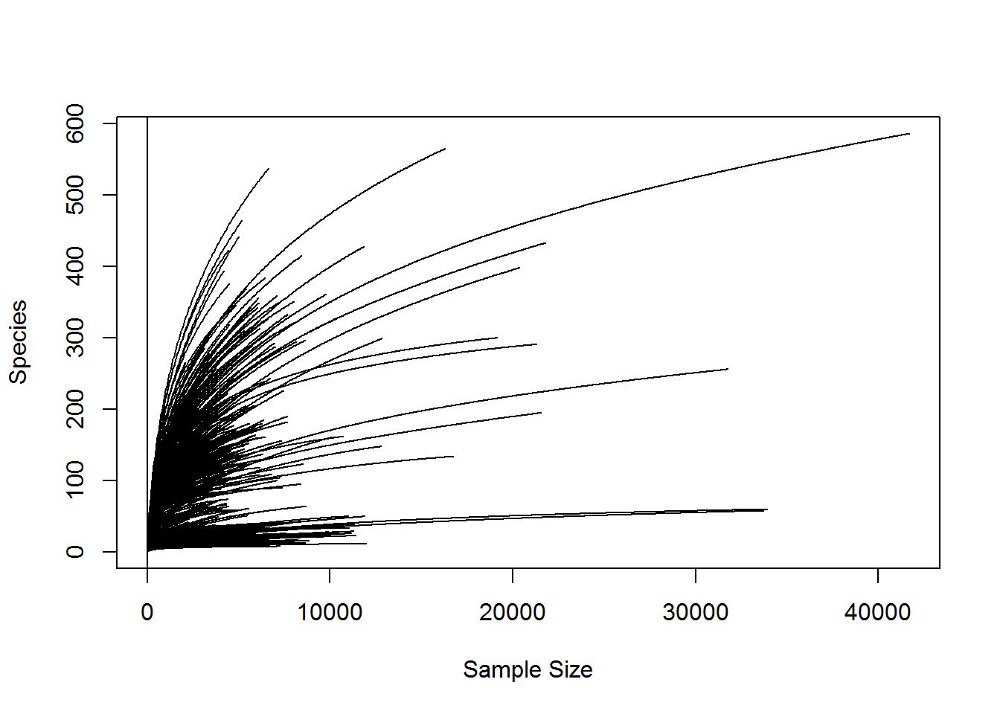
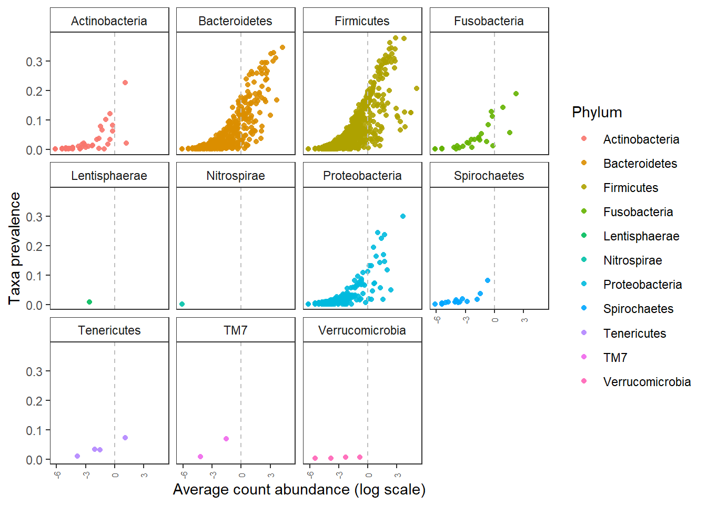
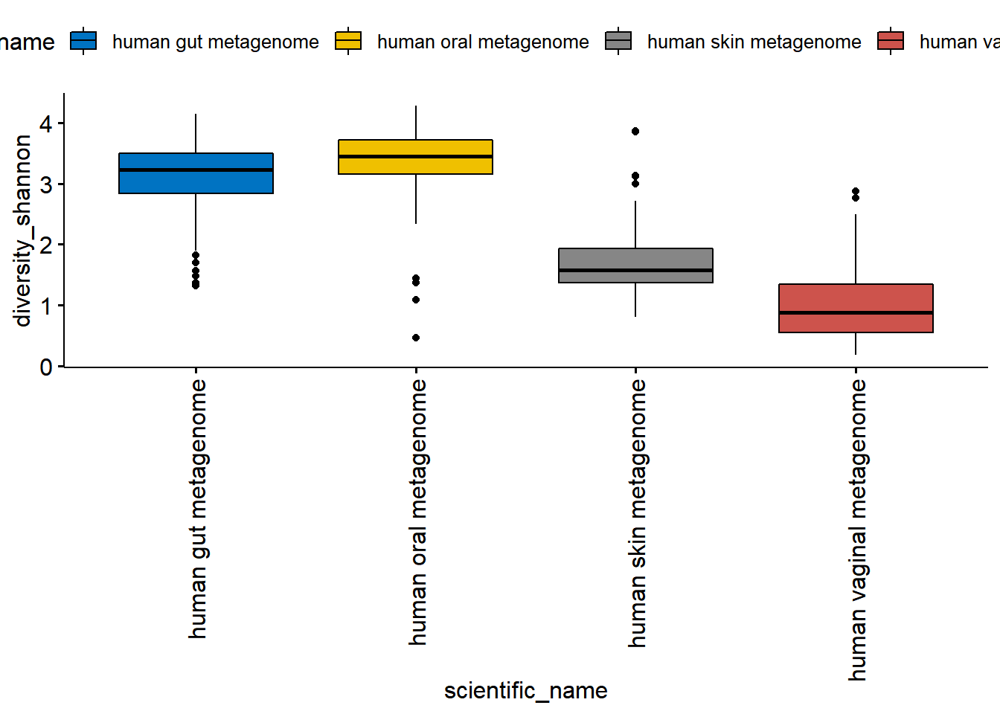
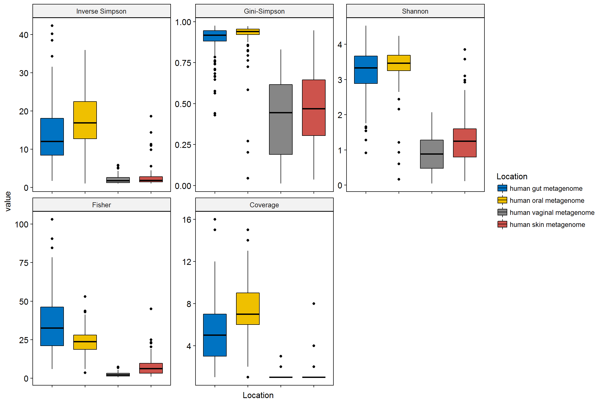
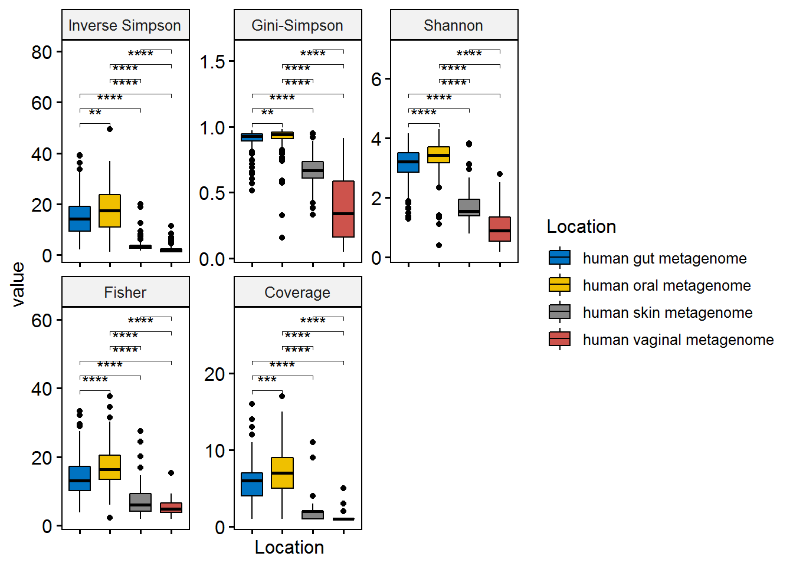
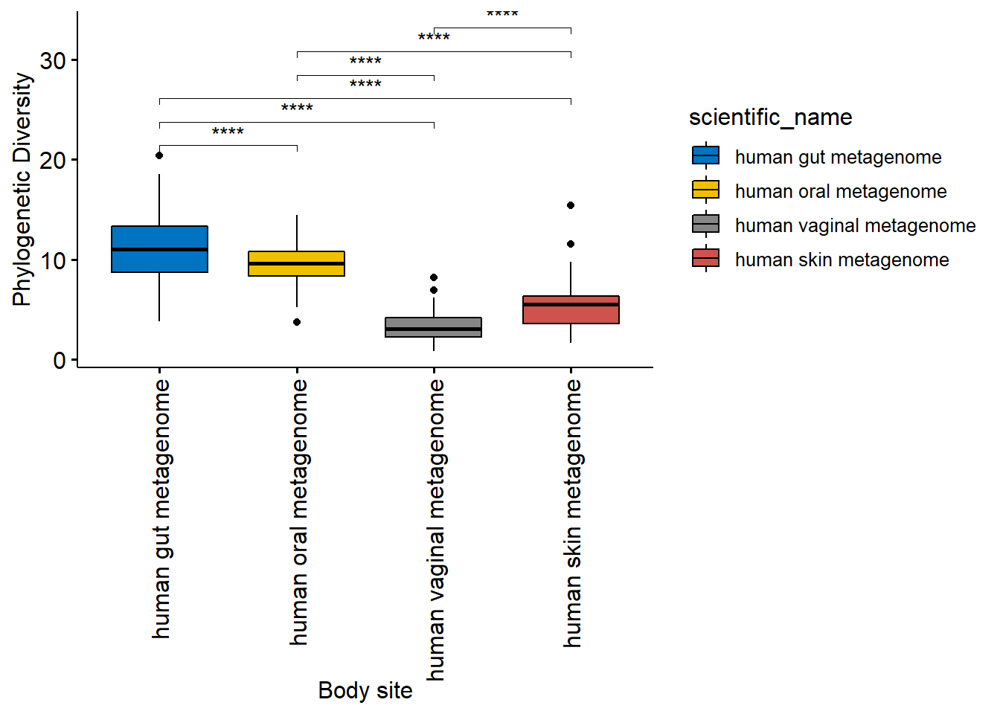
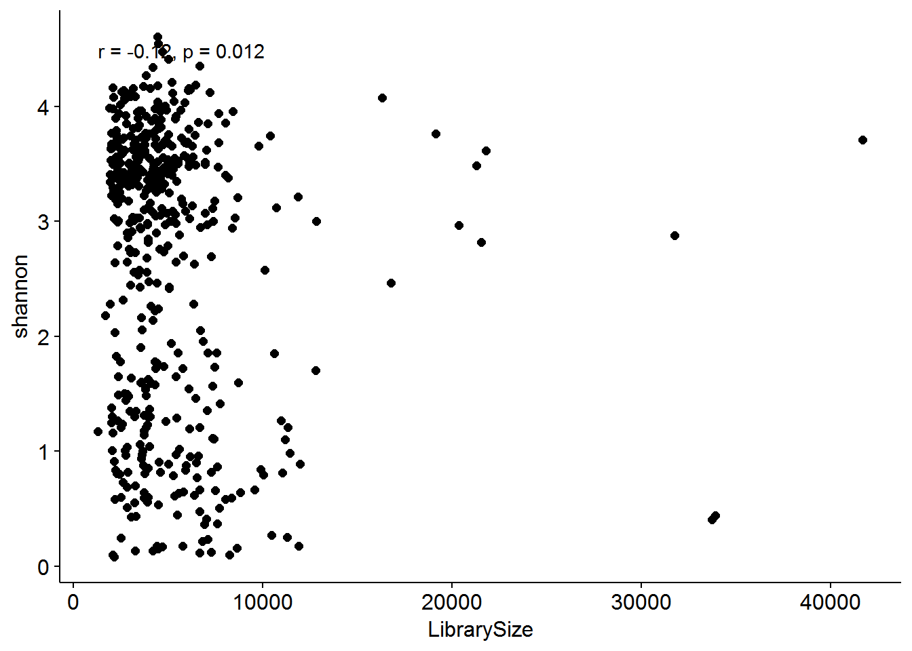
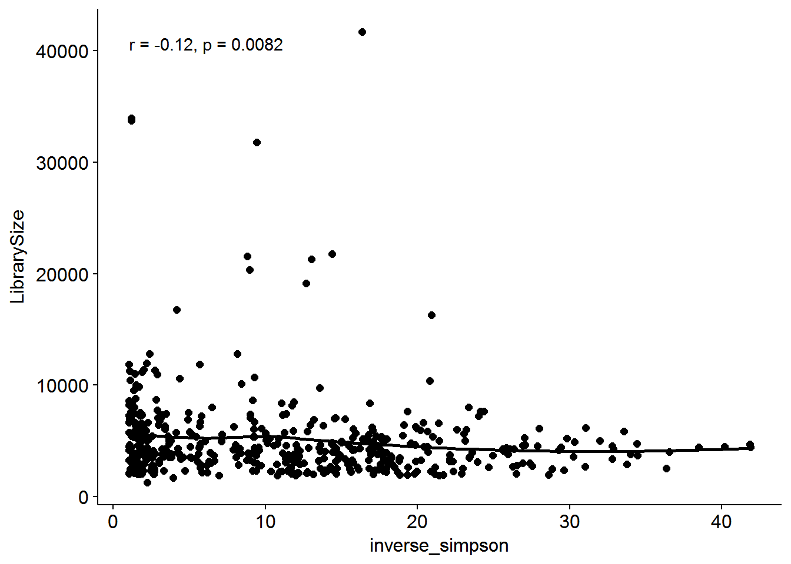
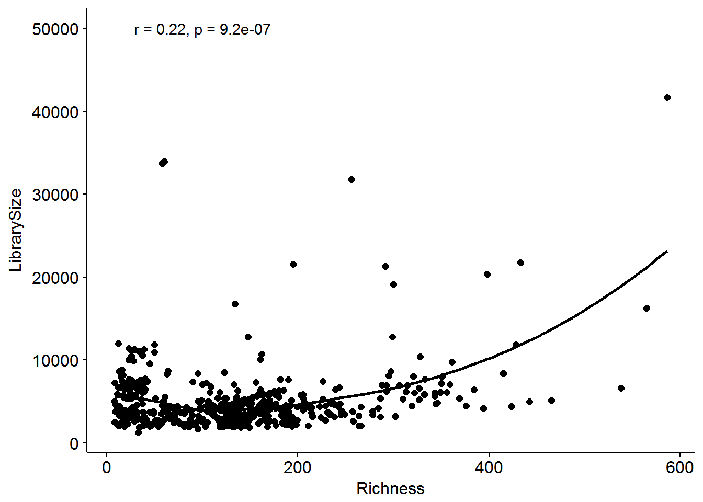

# Alpha diversities  

Alpha diversity measures are used to identify within individual taxa richness and evenness. The commonly used metrics/indices are Shannon, Inverse Simpson, Simpson, Gini, Observed and Chao1. These indices do not take into account the phylogeny of the taxa identified in sequencing. Phylogenetic diversity (Faith's PD) uses phylogenetic distance to calculate the diversity of a given sample.   

*It is important to note that, alpha diversity indices are sensitive to noise that is inherent to application of polymerase chain reaction and the  sequencing errors.*  

One has to consider the sequencing depth (how much of the taxa have been sampled) for each sample. If there is a large difference, then it is important to normalize the samples to equal sampling depth. First we look at the sampling depth (no. of reads per sample)   

**Load packages**  
 


```r
library(microbiome) # data analysis and visualisation
library(phyloseq) # also the basis of data object. Data analysis and visualisation
library(microbiomeutilities) # some utility tools 
library(RColorBrewer) # nice color options
library(ggpubr) # publication quality figures, based on ggplot2
library(DT) # interactive tables in html and markdown
library(data.table) # alternative to data.frame
library(dplyr) # data handling  
```

The data for tutorial is stored as *.rds file in the R project folder.  

We will use the filtered phyloseq object from **Set-up and Pre-processing** section.  


```r
ps1 <- readRDS("./phyobjects/ps1.rds")


# use print option to see the data saved as phyloseq object.

print(ps1)
```

```
## phyloseq-class experiment-level object
## otu_table()   OTU Table:         [ 3690 taxa and 474 samples ]
## sample_data() Sample Data:       [ 474 samples by 31 sample variables ]
## tax_table()   Taxonomy Table:    [ 3690 taxa by 7 taxonomic ranks ]
## phy_tree()    Phylogenetic Tree: [ 3690 tips and 3689 internal nodes ]
```


```r
summary(sample_sums(ps1))
```

```
##    Min. 1st Qu.  Median    Mean 3rd Qu.    Max. 
##    1286    3063    4192    5060    5790   41694
```

As is evident there is a large difference in the number of reads. Minimum is 1286 and maximum is 41694!! There is a ~30X difference!  

We can plot the rarefaction curve for the observed OTUs in the entire data set.  


```r
out_tab <- t(abundances(ps1))
p <- vegan::rarecurve(out_tab, 
                      step = 50, label = FALSE, 
                      sample = min(rowSums(out_tab), 
                                   col = "blue", cex = 0.6))
```



Not all samples are reaching a plateau and that few samples have high number of reads and high number of OTUs.  
Since we are comparing different body sites, some are expected to have low bacterial load.  
We will normalize to the lowest depth of at least 2000 reads to keep maximum samples for our anlaysis. This can be varied to remove samples with lower sequencing depth. This decision will depend on the research question being addressed.  

## Equal sample sums  


```r
set.seed(9242)  # This will help in reprodcuing the filtering and nomalisation. 

ps0.rar <- rarefy_even_depth(ps1, sample.size = 2000)
```

```
## You set `rngseed` to FALSE. Make sure you've set & recorded
##  the random seed of your session for reproducibility.
## See `?set.seed`
```

```
## ...
```

```
## 12 samples removedbecause they contained fewer reads than `sample.size`.
```

```
## Up to first five removed samples are:
```

```
## 1927.SRS020470.SRX022097.SRR0576631927.SRS049823.SRX020523.SRR0464141927.SRS020119.SRX020676.SRR0478441927.SRS020606.SRX022097.SRR0576631927.SRS011634.SRX020659.SRR047489	
```

```
## ...
```

```
## 688OTUs were removed because they are no longer 
## present in any sample after random subsampling
```

```
## ...
```

```r
saveRDS(ps0.rar, "./phyobjects/ps0.rar.rds")
```

Check how much data you have now  


```r
ps0.rar <- readRDS("./phyobjects/ps0.rar.rds")


print(ps0.rar)
```

```
## phyloseq-class experiment-level object
## otu_table()   OTU Table:         [ 3002 taxa and 462 samples ]
## sample_data() Sample Data:       [ 462 samples by 31 sample variables ]
## tax_table()   Taxonomy Table:    [ 3002 taxa by 7 taxonomic ranks ]
## phy_tree()    Phylogenetic Tree: [ 3002 tips and 3001 internal nodes ]
```


```r
 # quick check for sampling depth

barplot(sample_sums(ps0.rar), las =2)
```


```r
# quick check taxa prevalence

p.rar <- plot_taxa_prevalence(ps0.rar, "Phylum")

p.rar
```




Compare this to taxa prevalence plot from previous section of the tutorial.  

Do you see any difference?  

## Diversities  

### Non-phylogenetic diversities  

For more diversity indices please refer to [Microbiome Package](http://microbiome.github.io/microbiome/Diversity.html)  

Let use calculate diversity  


```r
hmp.div <- diversities(ps0.rar, index = "all")

datatable(hmp.div)
```

<!--html_preserve--><div id="htmlwidget-87ee5313e88a65878725" style="width:100%;height:auto;" class="datatables html-widget"></div>
<script type="application/json" data-for="htmlwidget-87ee5313e88a65878725">{"x":{"filter":"none","data":[["1927.SRS014659.SRX020511.SRR045649","1927.SRS015854.SRX020554.SRR043727","1927.SRS015599.SRX020539.SRR044148","1927.SRS015452.SRX020545.SRR044740","1927.SRS014442.SRX020511.SRR045656","1927.SRS014287.SRX020511.SRR045664","1927.SRS049428.SRX020670.SRR047663","1927.SRS019910.SRX020516.SRR044347","1927.SRS050422.SRX020511.SRR045628","1927.SRS064276.SRX020670.SRR046347","1927.SRS052697.SRX020550.SRR046441","1927.SRS063827.SRX020532.SRR046984","1927.SRS062847.SRX020532.SRR047036","1927.SRS014659.SRX020543.SRR045556","1927.SRS055482.SRX020550.SRR047716","1927.SRS021910.SRX020675.SRR047783","1927.SRS011271.SRX020661.SRR044827","1927.SRS011529.SRX020659.SRR044994","1927.SRS011271.SRX020659.SRR045051","1927.SRS018733.SRX020516.SRR047425","1927.SRS015281.SRX020554.SRR043805","1927.SRS011415.SRX020661.SRR044786","1927.SRS014287.SRX020543.SRR045558","1927.SRS046382.SRX020540.SRR047262","1927.SRS064321.SRX020519.SRR046501","1927.SRS056259.SRX020578.SRR047235","1927.SRS015247.SRX020577.SRR044079","1927.SRS015724.SRX020539.SRR044132","1927.SRS015782.SRX020539.SRR044139","1927.SRS018872.SRX020572.SRR051576","1927.SRS016203.SRX020516.SRR044343","1927.SRS019089.SRX020564.SRR044731","1927.SRS011621.SRX020661.SRR044776","1927.SRS011413.SRX020661.SRR044792","1927.SRS011653.SRX020659.SRR044997","1927.SRS011413.SRX020659.SRR045020","1927.SRS019582.SRX020543.SRR045562","1927.SRS050422.SRX020543.SRR045575","1927.SRS048819.SRX020511.SRR045612","1927.SRS054461.SRX020550.SRR046442","1927.SRS042703.SRX020540.SRR047267","1927.SRS046639.SRX020670.SRR047659","1927.SRS023047.SRX020675.SRR047826","1927.SRS016056.SRX020536.SRR049357","1927.SRS065725.SRX020519.SRR049530","1927.SRS011410.SRX020661.SRR044800","1927.SRS014442.SRX020543.SRR045553","1927.SRS048819.SRX020543.SRR045568","1927.SRS045877.SRX020523.SRR046406","1927.SRS057447.SRX020523.SRR046411","1927.SRS046313.SRX020550.SRR046437","1927.SRS014613.SRX020546.SRR047386","1927.SRS021601.SRX020675.SRR047748","1927.SRS022987.SRX020675.SRR047766","1927.SRS022924.SRX020675.SRR047811","1927.SRS020176.SRX020676.SRR047859","1927.SRS024511.SRX020676.SRR047887","1927.SRS063807.SRX022232.SRR058094","1927.SRS063968.SRX022156.SRR058115","1927.SRS014823.SRX020546.SRR043699","1927.SRS018712.SRX020572.SRR046003","1927.SRS014885.SRX020554.SRR043822","1927.SRS014369.SRX020554.SRR043823","1927.SRS065466.SRX020532.SRR047056","1927.SRS050733.SRX020550.SRR047710","1927.SRS048870.SRX020577.SRR044064","1927.SRS015578.SRX020577.SRR044021","1927.SRS016018.SRX020539.SRR044156","1927.SRS015911.SRX020520.SRR044615","1927.SRS019089.SRX020545.SRR044757","1927.SRS011452.SRX020661.SRR044798","1927.SRS011586.SRX020661.SRR044826","1927.SRS053335.SRX020531.SRR046056","1927.SRS043411.SRX020670.SRR046345","1927.SRS045526.SRX020670.SRR046355","1927.SRS043299.SRX020523.SRR046410","1927.SRS045607.SRX020523.SRR046421","1927.SRS063275.SRX020532.SRR046899","1927.SRS049164.SRX020540.SRR047273","1927.SRS042628.SRX020578.SRR047303","1927.SRS045414.SRX020563.SRR047697","1927.SRS015389.SRX020546.SRR043661","1927.SRS015190.SRX020554.SRR043731","1927.SRS019787.SRX020577.SRR043974","1927.SRS015332.SRX020577.SRR044071","1927.SRS015911.SRX020510.SRR044585","1927.SRS019013.SRX020510.SRR044597","1927.SRS019013.SRX020520.SRR044627","1927.SRS011410.SRX020659.SRR045027","1927.SRS048083.SRX020677.SRR047956","1927.SRS023488.SRX020678.SRR048028","1927.SRS050599.SRX020678.SRR048036","1927.SRS065665.SRX020519.SRR049404","1927.SRS016267.SRX020577.SRR044054","1927.SRS011452.SRX020659.SRR047485","1927.SRS012191.SRX020675.SRR047747","1927.SRS016095.SRX020516.SRR044317","1927.SRS014999.SRX020577.SRR044050","1927.SRS011653.SRX020661.SRR044770","1927.SRS019582.SRX020511.SRR045623","1927.SRS018559.SRX020516.SRR044352","1927.SRS019267.SRX020516.SRR044360","1927.SRS015960.SRX020577.SRR044087","1927.SRS063324.SRX020519.SRR046503","1927.SRS054590.SRX020550.SRR046427","1927.SRS011157.SRX020659.SRR045036","1927.SRS015663.SRX020539.SRR044161","1927.SRS015815.SRX020562.SRR044705","1927.SRS046349.SRX020531.SRR046051","1927.SRS015452.SRX020564.SRR047456","1927.SRS011529.SRX020661.SRR044768","1927.SRS011157.SRX020661.SRR044808","1927.SRS011415.SRX020659.SRR045013","1927.SRS011586.SRX020659.SRR045050","1927.SRS018920.SRX020572.SRR045810","1927.SRS043804.SRX020531.SRR046050","1927.SRS052326.SRX020670.SRR046232","1927.SRS054928.SRX020670.SRR046262","1927.SRS065263.SRX020670.SRR046351","1927.SRS055563.SRX020523.SRR046412","1927.SRS042387.SRX020523.SRR046416","1927.SRS013543.SRX020677.SRR047980","1927.SRS064557.SRX020569.SRR046542","1927.SRS063961.SRX020532.SRR046907","1927.SRS062464.SRX020532.SRR046982","1927.SRS063214.SRX020532.SRR046986","1927.SRS051031.SRX020578.SRR047244","1927.SRS042669.SRX020540.SRR047279","1927.SRS058416.SRX020523.SRR047701","1927.SRS055665.SRX020523.SRR047702","1927.SRS049748.SRX020523.SRR047703","1927.SRS021541.SRX020675.SRR047797","1927.SRS013762.SRX020677.SRR048007","1927.SRS019381.SRX020572.SRR051585","1927.SRS021109.SRX022097.SRR057663","1927.SRS020584.SRX022097.SRR057663","1927.SRS020641.SRX022097.SRR057663","1927.SRS042803.SRX022156.SRR058115","1927.SRS063918.SRX022232.SRR058094","1927.SRS064647.SRX022232.SRR058094","1927.SRS049766.SRX022241.SRR058097","1927.SRS056832.SRX022241.SRR058097","1927.SRS063608.SRX022156.SRR058115","1927.SRS011621.SRX020659.SRR045004","1927.SRS011405.SRX020659.SRR046237","1927.SRS015518.SRX020539.SRR044146","1927.SRS011405.SRX020661.SRR044803","1927.SRS018968.SRX020572.SRR045817","1927.SRS063921.SRX020569.SRR046605","1927.SRS023422.SRX020683.SRR048341","1927.SRS019534.SRX020572.SRR051591","1927.SRS021853.SRX022232.SRR058094","1927.SRS065421.SRX022232.SRR058094","1927.SRS063307.SRX022232.SRR058094","1927.SRS042572.SRX022241.SRR058097","1927.SRS049949.SRX022241.SRR058097","1927.SRS057676.SRX022156.SRR058115","1927.SRS014923.SRX020546.SRR043675","1927.SRS051892.SRX022156.SRR058115","1927.SRS048838.SRX020523.SRR046418","1927.SRS057122.SRX020677.SRR047969","1927.SRS014345.SRX020546.SRR047368","1927.SRS023851.SRX020676.SRR047925","1927.SRS046341.SRX020554.SRR043828","1927.SRS023422.SRX020676.SRR047874","1927.SRS020811.SRX022097.SRR057663","1927.SRS058246.SRX020670.SRR046264","1927.SRS064192.SRX020532.SRR046999","1927.SRS045153.SRX020568.SRR047010","1927.SRS015127.SRX020546.SRR043678","1927.SRS018749.SRX020516.SRR044310","1927.SRS011171.SRX020570.SRR047528","1927.SRS014353.SRX020554.SRR043830","1927.SRS015572.SRX020577.SRR044090","1927.SRS011466.SRX020667.SRR045250","1927.SRS019257.SRX020516.SRR044326","1927.SRS011429.SRX020663.SRR045163","1927.SRS011466.SRX020663.SRR045171","1927.SRS011171.SRX020537.SRR045382","1927.SRS018852.SRX020572.SRR045969","1927.SRS053092.SRX020670.SRR046352","1927.SRS065582.SRX020532.SRR047041","1927.SRS023009.SRX020675.SRR047774","1927.SRS058399.SRX020677.SRR047964","1927.SRS055144.SRX020554.SRR043713","1927.SRS015679.SRX020539.SRR044158","1927.SRS018601.SRX020516.SRR044305","1927.SRS016329.SRX020516.SRR044348","1927.SRS011567.SRX020659.SRR045035","1927.SRS011516.SRX020663.SRR045172","1927.SRS011369.SRX020662.SRR045409","1927.SRS019576.SRX020543.SRR045603","1927.SRS064859.SRX020670.SRR046230","1927.SRS054330.SRX020578.SRR047307","1927.SRS021932.SRX020675.SRR047791","1927.SRS065559.SRX020569.SRR049456","1927.SRS020492.SRX022097.SRR057663","1927.SRS050434.SRX022156.SRR058115","1927.SRS050258.SRX022156.SRR058115","1927.SRS062829.SRX020578.SRR047321","1927.SRS015241.SRX020577.SRR044027","1927.SRS015468.SRX020545.SRR044737","1927.SRS015468.SRX020564.SRR047455","1927.SRS019105.SRX020564.SRR044720","1927.SRS019105.SRX020545.SRR044745","1927.SRS057634.SRX020568.SRR046930","1927.SRS014917.SRX020546.SRR047389","1927.SRS014760.SRX020554.SRR049816","1927.SRS052116.SRX022241.SRR058097","1927.SRS014436.SRX020511.SRR045631","1927.SRS023069.SRX020678.SRR048019","1927.SRS014570.SRX020546.SRR047369","1927.SRS064413.SRX020532.SRR046901","1927.SRS015405.SRX020546.SRR043702","1927.SRS047957.SRX020540.SRR049627","1927.SRS021563.SRX020675.SRR047805","1927.SRS015784.SRX020539.SRR044190","1927.SRS016012.SRX020539.SRR044196","1927.SRS016235.SRX020516.SRR044349","1927.SRS014817.SRX020546.SRR043698","1927.SRS021623.SRX020675.SRR047756","1927.SRS057320.SRX020554.SRR043718","1927.SRS011600.SRX020663.SRR045140","1927.SRS015880.SRX020554.SRR043820","1927.SRS057704.SRX020540.SRR047110","1927.SRS016070.SRX020516.SRR044337","1927.SRS022946.SRX020675.SRR047818","1927.SRS018995.SRX020510.SRR044593","1927.SRS015631.SRX020539.SRR044164","1927.SRS011543.SRX020663.SRR049239","1927.SRS019904.SRX020516.SRR044374","1927.SRS018995.SRX020520.SRR044623","1927.SRS011567.SRX020661.SRR044807","1927.SRS011667.SRX020663.SRR045174","1927.SRS011492.SRX020663.SRR045157","1927.SRS011600.SRX020667.SRR045217","1927.SRS024533.SRX020677.SRR047938","1927.SRS011429.SRX020667.SRR045242","1927.SRS011516.SRX020667.SRR045251","1927.SRS011667.SRX020667.SRR045253","1927.SRS063612.SRX020532.SRR047031","1927.SRS014601.SRX020557.SRR046087","1927.SRS011285.SRX020571.SRR045492","1927.SRS057762.SRX020543.SRR045571","1927.SRS014281.SRX020543.SRR045593","1927.SRS014601.SRX020547.SRR045774","1927.SRS018952.SRX020572.SRR045970","1927.SRS043353.SRX020670.SRR046339","1927.SRS065101.SRX020569.SRR046552","1927.SRS051724.SRX020568.SRR046855","1927.SRS064085.SRX020532.SRR046916","1927.SRS048544.SRX020540.SRR047113","1927.SRS043565.SRX020540.SRR047280","1927.SRS048401.SRX020578.SRR047305","1927.SRS011543.SRX020667.SRR047502","1927.SRS020141.SRX020676.SRR047852","1927.SRS020198.SRX020676.SRR047867","1927.SRS022502.SRX020676.SRR047897","1927.SRS022436.SRX020676.SRR047915","1927.SRS013565.SRX020677.SRR047987","1927.SRS054426.SRX020677.SRR047974","1927.SRS047084.SRX020677.SRR047999","1927.SRS023510.SRX020683.SRR048354","1927.SRS019359.SRX020572.SRR049337","1927.SRS064626.SRX020569.SRR049420","1927.SRS064628.SRX020532.SRR049557","1927.SRS048669.SRX020540.SRR049629","1927.SRS015364.SRX020577.SRR049845","1927.SRS065676.SRX020548.SRR049896","1927.SRS064462.SRX022156.SRR058115","1927.SRS021131.SRX022097.SRR057663","1927.SRS024704.SRX022228.SRR058091","1927.SRS062712.SRX022232.SRR058094","1927.SRS021087.SRX022097.SRR057663","1927.SRS020663.SRX022097.SRR057663","1927.SRS051345.SRX022241.SRR058097","1927.SRS053146.SRX022156.SRR058115","1927.SRS048471.SRX022156.SRR058115","1927.SRS015831.SRX020562.SRR044701","1927.SRS049139.SRX020568.SRR046809","1927.SRS016164.SRX020539.SRR044188","1927.SRS015718.SRX020539.SRR044201","1927.SRS018904.SRX020572.SRR045947","1927.SRS044548.SRX020568.SRR049550","1927.SRS013784.SRX020683.SRR048360","1927.SRS065219.SRX022232.SRR058094","1927.SRS019767.SRX020577.SRR044052","1927.SRS014281.SRX020511.SRR045648","1927.SRS014663.SRX020543.SRR045554","1927.SRS019576.SRX020511.SRR045660","1927.SRS011492.SRX020667.SRR047500","1927.SRS015307.SRX020554.SRR043719","1927.SRS015976.SRX020577.SRR049839","1927.SRS046522.SRX020578.SRR047301","1927.SRS049453.SRX020568.SRR046859","1927.SRS015526.SRX020539.SRR044187","1927.SRS016127.SRX020516.SRR044367","1927.SRS018639.SRX020572.SRR045994","1927.SRS064128.SRX020532.SRR046925","1927.SRS065240.SRX020532.SRR047029","1927.SRS015031.SRX020577.SRR044026","1927.SRS014663.SRX020511.SRR045630","1927.SRS052368.SRX020572.SRR045996","1927.SRS044078.SRX020550.SRR046444","1927.SRS054770.SRX020563.SRR049379","1927.SRS016279.SRX020577.SRR043973","1927.SRS044041.SRX020531.SRR046039","1927.SRS042288.SRX020568.SRR046871","1927.SRS064711.SRX020548.SRR047339","1927.SRS014436.SRX020543.SRR045604","1927.SRS023873.SRX020677.SRR047934","1927.SRS063142.SRX022232.SRR058094","1927.SRS014837.SRX020546.SRR043659","1927.SRS015506.SRX020539.SRR044176","1927.SRS015204.SRX020554.SRR043834","1927.SRS015738.SRX020539.SRR044197","1927.SRS064975.SRX020532.SRR046909","1927.SRS048194.SRX020540.SRR047261","1927.SRS018708.SRX020572.SRR047591","1927.SRS022964.SRX020675.SRR047823","1927.SRS048610.SRX020539.SRR044199","1927.SRS018767.SRX020516.SRR044315","1927.SRS011649.SRX020661.SRR044793","1927.SRS011649.SRX020659.SRR045021","1927.SRS019510.SRX020572.SRR045959","1927.SRS018868.SRX020572.SRR045963","1927.SRS050522.SRX020670.SRR046350","1927.SRS063298.SRX020569.SRR046551","1927.SRS063755.SRX020569.SRR046658","1927.SRS062739.SRX020532.SRR046911","1927.SRS052037.SRX020540.SRR047270","1927.SRS065457.SRX020569.SRR049444","1927.SRS049597.SRX020568.SRR049524","1927.SRS022520.SRX020676.SRR047904","1927.SRS050106.SRX020568.SRR049547","1927.SRS063720.SRX020519.SRR046502","1927.SRS057278.SRX020550.SRR046428","1927.SRS057292.SRX020670.SRR047664","1927.SRS023219.SRX020675.SRR047780","1927.SRS023087.SRX020676.SRR047841","1927.SRS014341.SRX020546.SRR043648","1927.SRS019243.SRX020516.SRR044314","1927.SRS011684.SRX020661.SRR044791","1927.SRS019377.SRX020572.SRR049336","1927.SRS015261.SRX020577.SRR044036","1927.SRS011617.SRX020659.SRR045007","1927.SRS048570.SRX020568.SRR046946","1927.SRS058032.SRX020578.SRR047241","1927.SRS011684.SRX020659.SRR047483","1927.SRS053253.SRX020568.SRR049548","1927.SRS015013.SRX020577.SRR044075","1927.SRS047424.SRX020568.SRR046941","1927.SRS016109.SRX020516.SRR044328","1927.SRS016217.SRX020516.SRR044297","1927.SRS023891.SRX020677.SRR047940","1927.SRS050634.SRX020670.SRR046333","1927.SRS011582.SRX020661.SRR044836","1927.SRS022454.SRX020676.SRR047922","1927.SRS050791.SRX022156.SRR058115","1927.SRS064006.SRX022232.SRR058094","1927.SRS064987.SRX022232.SRR058094","1927.SRS056286.SRX022241.SRR058097","1927.SRS046640.SRX022156.SRR058115","1927.SRS050327.SRX022156.SRR058115","1927.SRS045722.SRX020677.SRR048004","1927.SRS014627.SRX020546.SRR043662","1927.SRS046108.SRX020531.SRR046041","1927.SRS014446.SRX020543.SRR045567","1927.SRS057065.SRX020577.SRR044083","1927.SRS011525.SRX020667.SRR045222","1927.SRS053285.SRX020670.SRR046366","1927.SRS063285.SRX020569.SRR046656","1927.SRS014780.SRX020554.SRR043708","1927.SRS065266.SRX020670.SRR049368","1927.SRS055113.SRX020540.SRR047292","1927.SRS021641.SRX020675.SRR047763","1927.SRS015346.SRX020577.SRR044088","1927.SRS015613.SRX020539.SRR044127","1927.SRS013583.SRX020677.SRR047989","1927.SRS018545.SRX020516.SRR044294","1927.SRS056678.SRX022224.SRR058087","1927.SRS058191.SRX022156.SRR058115","1927.SRS011525.SRX020663.SRR045143","1927.SRS014446.SRX020511.SRR045634","1927.SRS058077.SRX020540.SRR047123","1927.SRS064034.SRX020569.SRR046664","1927.SRS052584.SRX020540.SRR047294","1927.SRS015423.SRX020546.SRR049218","1927.SRS015147.SRX020546.SRR047380","1927.SRS057466.SRX022156.SRR058115","1927.SRS043395.SRX020543.SRR045584","1927.SRS011582.SRX020659.SRR045059","1927.SRS014548.SRX020546.SRR043685","1927.SRS021149.SRX022097.SRR057663","1927.SRS063292.SRX022232.SRR058094","1927.SRS021105.SRX022097.SRR057663","1927.SRS043395.SRX020511.SRR045632","1927.SRS053602.SRX022224.SRR058087","1927.SRS064820.SRX020512.SRR049579","1927.SRS015192.SRX020574.SRR043863","1927.SRS015653.SRX020525.SRR044551","1927.SRS015249.SRX020525.SRR044553","1927.SRS018755.SRX020525.SRR044563","1927.SRS019498.SRX020575.SRR045838","1927.SRS019705.SRX020575.SRR047605","1927.SRS054288.SRX020549.SRR049392","1927.SRS043378.SRX020567.SRR049451","1927.SRS011472.SRX020663.SRR045150","1927.SRS011472.SRX020667.SRR045231","1927.SRS063611.SRX022225.SRR058088","1927.SRS019231.SRX020525.SRR044523","1927.SRS023450.SRX020683.SRR048347","1927.SRS016205.SRX020525.SRR044542","1927.SRS048971.SRX020567.SRR046578","1927.SRS020612.SRX022097.SRR057663","1927.SRS019180.SRX020575.SRR045841","1927.SRS018551.SRX020525.SRR044564","1927.SRS023075.SRX020676.SRR047838","1927.SRS014825.SRX020574.SRR049832","1927.SRS011640.SRX020570.SRR047529","1927.SRS062461.SRX020512.SRR049554","1927.SRS022508.SRX020676.SRR047901","1927.SRS011434.SRX020662.SRR045405","1927.SRS011497.SRX020662.SRR045415","1927.SRS022952.SRX020675.SRR047821","1927.SRS063239.SRX022228.SRR058091","1927.SRS014615.SRX020574.SRR043854","1927.SRS046500.SRX020549.SRR046479","1927.SRS055470.SRX020549.SRR046473","1927.SRS042248.SRX022225.SRR058088","1927.SRS046309.SRX020575.SRR046010","1927.SRS019552.SRX020574.SRR043864","1927.SRS058381.SRX020549.SRR046484","1927.SRS015901.SRX020510.SRR044599","1927.SRS015901.SRX020520.SRR044629","1927.SRS049760.SRX020574.SRR043866","1927.SRS045536.SRX020567.SRR046727","1927.SRS015805.SRX020562.SRR044710","1927.SRS062608.SRX020549.SRR046471","1927.SRS019773.SRX020525.SRR044539","1927.SRS019880.SRX020525.SRR044521","1927.SRS016046.SRX020525.SRR044567","1927.SRS019830.SRX020575.SRR045834","1927.SRS023879.SRX020677.SRR047937","1927.SRS049760.SRX020543.SRR045572","1927.SRS016257.SRX020525.SRR047445","1927.SRS011441.SRX020571.SRR045475","1927.SRS051242.SRX020549.SRR046495","1927.SRS050616.SRX020567.SRR046579","1927.SRS056240.SRX020567.SRR046718","1927.SRS018958.SRX020575.SRR047607","1927.SRS052195.SRX020677.SRR048002","1927.SRS055821.SRX020549.SRR049399","1927.SRS055924.SRX020567.SRR049497","1927.SRS057843.SRX020567.SRR049503","1927.SRS047486.SRX022225.SRR058088","1927.SRS064586.SRX022228.SRR058091","1927.SRS016097.SRX020525.SRR044543","1927.SRS014925.SRX020574.SRR049866","1927.SRS014665.SRX020574.SRR049870","1927.SRS015283.SRX020574.SRR043859","1927.SRS015135.SRX020536.SRR046115"],[42.3935392246222,16.612813463024,24.1202151523192,17.4498752333921,4.63714351959193,13.262951271917,21.1774671749259,15.6476156945585,18.2405194899951,12.1328302253067,21.2145319543888,7.44668175860836,9.16867613485289,40.2665646580362,16.6971389452417,21.602237991856,11.3166977875856,18.933656467737,10.8960354774915,4.81759385275024,14.9492473053982,19.5087691917517,18.1412477550206,8.47899540862399,20.8781343299163,24.6980661414211,38.4978152489846,9.70285021224985,27.4487737260338,22.6190610827745,14.5839561897956,29.3728888236158,17.0545147564189,13.8854175345053,11.1746826390131,14.415972897971,30.0079521073084,22.244714099812,9.01733582812958,19.9507217173581,8.88715095714616,16.3672818036745,18.0918523343012,9.5044385728135,5.71170728642498,15.3718449288284,6.62166144107218,13.8627037817456,9.68466723483381,14.3902491671643,8.44141866482081,10.0629943445972,11.7505361182104,19.6093811279316,6.30682051104167,11.8452536068797,7.73437077026598,12.0494267485224,23.22394853573,9.1516008437776,13.3349335253564,22.3971689978387,23.8731856378915,18.0598322241586,13.1015237072071,14.8058216490724,9.90584494380909,9.93680193966374,4.08144107521484,34.3200343200343,5.82094200304435,14.407561088059,12.237954792995,15.212364609955,7.31569032682847,18.3774545387718,14.1538809941686,9.20115566515154,26.8154027673496,14.8785169094345,8.68368379233839,9.85114913654678,5.53942966032217,16.9713015291143,26.2850083454901,4.21302752370881,5.83571868334515,5.49950641929887,15.5023137203228,10.9883468581569,9.03289328088233,14.6105912175736,2.98262175434829,8.75568572341664,6.08409435213521,25.8184446968915,13.6914093252189,19.403723574554,12.0014161671077,31.6055625790139,8.37766514472417,3.39815310378809,26.0888848306179,5.41431707865108,2.35857122472349,18.1077410593029,15.4925867972175,11.2366494558652,11.9227169487383,17.0340339999319,19.7980597901406,17.923556033517,17.0909494876988,14.4681158896083,4.88590197414869,10.3485923327279,3.0083647582102,10.0134681146142,18.7157268252513,12.0734306049392,10.7881265878774,11.9820030314468,9.59517938187854,24.8123565535637,23.476933912431,15.581177937052,13.2126577261016,5.85289908724039,5.99894418582329,16.768816708449,9.55799071919101,10.3289779476321,5.09502216334641,5.34259382930413,6.13041852367261,23.1034920928298,5.51179800362676,9.33903014171978,3.4605009767264,8.39612938435381,6.18561164874386,18.1862820874215,9.18585745386403,15.8600509107634,17.6544321451901,5.29417058876471,16.9424042965937,8.17561214895965,1.78678476122749,2.28810960960274,8.72962178913598,10.8710422611768,19.7655802186073,6.01813263362511,3.87479003481499,19.8666944800389,12.3182291313801,22.7174629137418,9.56077786488709,3.8658174754279,15.2054252957455,3.16605983853095,6.17323962355585,11.3513820307622,1.75289139435499,2.83209499979467,26.0311592976793,20.1759341457509,21.0968238731659,34.5811359903173,31.5357931251971,12.3430884876014,12.9495098610518,12.7369875750686,17.2584890192864,19.3212446745819,14.0278031057556,17.4298014745612,14.3876611418048,15.6804942491787,31.4569276018811,15.7216636664492,25.8451359454151,14.7549207660755,15.0719307896938,17.5581834303423,8.43390768244651,16.2888999291433,17.5243369229017,17.0257685006257,26.3932327751165,22.1006685452235,9.97859591176926,11.4332100452183,21.4064005137536,2.40573430829726,13.9056915995717,10.0037514067775,17.0766485369581,23.0576787834769,19.0550595946989,4.82771106149297,5.7513077035891,27.1609968085829,28.0752979490995,29.5945546019532,28.9733300496893,24.2104371194422,17.4384640200891,25.8544909250737,12.7687828796159,6.76487002993455,17.4886323889472,11.0234137307641,22.8825097536698,17.356139300374,26.4057775841354,12.9009785392222,15.211786091864,16.8503353216729,29.2329279700655,27.8079030060343,16.022046335758,17.4547485643469,26.6652445202923,1.37099549353781,19.2526135422884,11.8899702156246,9.00029250950656,26.9371153043221,13.026600317849,12.9415494917206,16.0779458816342,7.98027276572313,19.0161066423261,15.5147001784191,19.936800342913,13.0746299879713,15.9913007324016,7.01636215654907,1.25412292912951,9.163635030744,11.1203162617945,33.74843913469,35.9802828050229,8.72238818988639,16.8736501079914,34.6632465596728,21.8081104362712,9.8492086160877,23.2945479110614,5.71177253437059,12.2936964071672,23.1832987515794,26.6705783514916,14.804396905881,14.0510615577007,15.2927413003418,27.0014850816795,32.68561342725,23.5388272956241,33.7052141966362,22.8076177443266,31.0241057301523,5.55628095890297,12.1168060099358,18.1243146743514,10.111325695912,9.07255778085237,17.8943695366253,14.8602762525355,12.5703152006537,16.3942488974868,13.0266003178491,16.6996484723997,16.8870425722343,3.62810475064036,21.2253388094707,1.04649471363195,18.9352697802562,17.0751906018151,18.7601422018779,19.8347763133101,13.8679905975024,11.7535745558618,11.8852361596425,28.724901617212,25.1366807013134,21.982853374368,19.0615975524909,19.8373338623289,9.14674581650713,21.7997907220091,17.995645053897,12.9892059698391,35.5941554396768,9.29942762022997,11.156854213386,17.399474535869,16.7762716413904,16.4586025000617,22.642876551037,14.9568494892236,4.21353344808189,17.7981863648094,34.3288705801579,11.4895646029494,16.3269304554397,25.1448974716806,20.2199935296021,13.5961930659415,18.8203410245794,1.73344323363435,1.37852506089634,1.9261940235978,1.51644968799048,3.48249437141847,4.311227514254,1.77320370032148,2.24458577852897,3.96473762357592,2.62931289480776,2.4471567097978,2.52546616948656,1.43710784919565,3.37731155867994,3.36353790370864,3.53393728321503,3.74726215658684,5.86656497954035,2.04187893699783,2.48265862947313,1.81046921930757,1.92593990682303,2.35117917513581,5.04444152987823,3.43913251321487,1.39102759381438,1.03796351558243,1.75239530533298,1.0747112385241,1.79085018821835,1.18231609812041,1.05059563519537,1.49033073419653,2.63326978375588,1.49877287970474,1.86894054432893,1.17723717738551,5.1803540253941,1.05942023227789,1.04214757434941,1.19530579508156,1.67946136315161,1.97988241478339,1.34394693022362,1.03062767802161,1.4050765415446,1.15988558888551,1.27276499285342,1.19772169379406,1.83148002816816,1.06769564054531,3.70801598896494,1.0701453524925,1.35329167901545,2.00548299049602,1.14459758524247,1.77656181990993,2.97350900824554,1.22356263508896,1.28346968059574,1.5768841400147,1.92308986695103,1.78212775361015,5.69750249977922,2.98552914025717,2.87617905365081,4.30249092712226,1.05464094748943,2.1351074652965,4.22204583452958,2.79638539224199,1.09679789853523,1.02438024994878,2.98811626162751,2.24364655387108,1.71519819972797,1.9314620684993,1.32312410771818,1.05713944409265,1.01209145663239,2.16464741140639,2.0230158513407,2.17189223939465,2.52481259578508,1.03794304598918,1.12693261900831,1.24319351550262,2.06886207413767,2.23831571219289,3.39839561742901,3.42354371009432,2.39865962899932,1.91108121330724,1.45753047696227,1.85321602475897,4.04420314032374,3.62320153333889,10.9738766865477,2.78754191766159,14.3797992580024,4.47902249813001,3.05612263608914,18.6368973293326,2.72356372866769,2.66673422393367,1.24098347940743,5.57679384545031,4.37600374585921,1.11579372544556,1.38609263950156,11.3259261776132,1.62046189645897,1.67666799123438,1.37177410172802,9.90599213464225,1.83654897754727,2.69125758430028,1.59130764114103,1.59324845036673,1.77938792614117,1.52103746923702,1.18311132249367,1.21290335100938,1.34866859436364,1.36669060653046,1.96869770646717,1.48249616774741,2.38289557555864,2.10505043700847,2.19262663515131,1.18231120559091,1.52860672846824,1.46165494419401,2.93458229155662,1.33829304736688,1.6911531550576,1.5390286113114,3.4166016088777,1.29931974114952,1.25223916014824,1.33622135308447,2.11069542137396,1.32687411016505,1.49112853080597,2.66844919072607,2.50451752348298,1.49220323808103,2.09235662126253,1.03786333000525,3.12952803587691],[0.9764115,0.9398055,0.958541,0.942693,0.78435,0.924602,0.95278,0.9360925,0.945177,0.917579,0.9528625,0.865712,0.890933,0.9751655,0.9401095,0.9537085,0.911635,0.947184,0.9082235,0.7924275,0.933107,0.948741,0.944877,0.8820615,0.952103,0.959511,0.9740245,0.8969375,0.9635685,0.9557895,0.9314315,0.965955,0.9413645,0.927982,0.910512,0.9306325,0.9666755,0.9550455,0.8891025,0.9498765,0.887478,0.9389025,0.9447265,0.894786,0.824921,0.934946,0.8489805,0.927864,0.896744,0.9305085,0.8815365,0.900626,0.9148975,0.949004,0.8414415,0.915578,0.870707,0.9170085,0.956941,0.8907295,0.925009,0.9553515,0.958112,0.9446285,0.923673,0.932459,0.8990495,0.899364,0.7549885,0.9708625,0.8282065,0.930592,0.918287,0.934264,0.8633075,0.9455855,0.929348,0.891318,0.962708,0.932789,0.8848415,0.898489,0.819476,0.941077,0.9619555,0.762641,0.8286415,0.8181655,0.9354935,0.9089945,0.8892935,0.9315565,0.6647245,0.8857885,0.835637,0.961268,0.9269615,0.9484635,0.9166765,0.96836,0.880635,0.7057225,0.9616695,0.8153045,0.5760145,0.944775,0.935453,0.9110055,0.9161265,0.941294,0.94949,0.9442075,0.9414895,0.9308825,0.7953295,0.9033685,0.6675935,0.9001345,0.946569,0.9171735,0.9073055,0.9165415,0.895781,0.9596975,0.957405,0.93582,0.924315,0.8291445,0.833304,0.9403655,0.8953755,0.903185,0.80373,0.812825,0.836879,0.9567165,0.818571,0.8929225,0.7110245,0.8808975,0.8383345,0.9450135,0.891137,0.9369485,0.943357,0.811113,0.9409765,0.877685,0.4403355,0.562958,0.8854475,0.9080125,0.949407,0.8338355,0.7419215,0.9496645,0.9188195,0.955981,0.895406,0.7413225,0.934234,0.68415,0.8380105,0.911905,0.429514,0.6469045,0.9615845,0.950436,0.9525995,0.9710825,0.96829,0.918983,0.922777,0.9214885,0.9420575,0.9482435,0.928713,0.942627,0.930496,0.9362265,0.9682105,0.9363935,0.961308,0.932226,0.9336515,0.9430465,0.881431,0.9386085,0.9429365,0.9412655,0.9621115,0.9547525,0.8997855,0.9125355,0.953285,0.5843265,0.928087,0.9000375,0.9414405,0.9566305,0.9475205,0.7928625,0.8261265,0.9631825,0.9643815,0.96621,0.9654855,0.9586955,0.9426555,0.961322,0.921684,0.8521775,0.94282,0.909284,0.9562985,0.9423835,0.9621295,0.9224865,0.9342615,0.940654,0.965792,0.964039,0.937586,0.942709,0.962498,0.270603,0.948059,0.9158955,0.8888925,0.9628765,0.923234,0.9227295,0.937803,0.874691,0.947413,0.935545,0.9498415,0.923516,0.937466,0.857476,0.20263,0.890873,0.9100745,0.970369,0.972207,0.8853525,0.940736,0.971151,0.9541455,0.898469,0.9570715,0.824923,0.9186575,0.9568655,0.9625055,0.9324525,0.928831,0.9346095,0.962965,0.9694055,0.957517,0.970331,0.956155,0.967767,0.8200235,0.91747,0.9448255,0.901101,0.8897775,0.9441165,0.9327065,0.9204475,0.939003,0.923234,0.9401185,0.940783,0.724374,0.9528865,0.0444289999999999,0.9471885,0.9414355,0.9466955,0.9495835,0.9278915,0.9149195,0.915862,0.965187,0.9602175,0.95451,0.9475385,0.94959,0.8906715,0.954128,0.944431,0.923013,0.9719055,0.8924665,0.910369,0.942527,0.940392,0.9392415,0.955836,0.933141,0.7626695,0.9438145,0.97087,0.9129645,0.9387515,0.9602305,0.950544,0.92645,0.946866,0.4231135,0.274587,0.4808415,0.340565,0.7128495,0.7680475,0.436049,0.5544835,0.7477765,0.6196725,0.5913625,0.6040335,0.304158,0.7039065,0.702694,0.7170295,0.7331385,0.8295425,0.510255,0.597206,0.447657,0.480773,0.5746815,0.801762,0.709229,0.281107,0.0365749999999999,0.4293525,0.0695175,0.441606,0.1542025,0.048159,0.329008,0.620244,0.3327875,0.4649375,0.1505535,0.806963,0.0560875,0.0404429999999999,0.163394,0.404571,0.4949195,0.255923,0.0297175,0.288295,0.137846,0.214309,0.1650815,0.4539935,0.0634034999999999,0.730314,0.0655475,0.261061,0.501367,0.1263305,0.437115,0.663697,0.1827145,0.220862,0.365838,0.4800035,0.438873,0.8244845,0.665051,0.6523165,0.7675765,0.0518099999999999,0.5316395,0.763148,0.6423955,0.088255,0.0238,0.665341,0.554297,0.416977,0.4822575,0.244213,0.054051,0.0119469999999999,0.538031,0.5056885,0.539572,0.603931,0.0365559999999999,0.1126355,0.19562,0.5166425,0.5532355,0.7057435,0.707905,0.5831005,0.476736,0.313908,0.4603975,0.7527325,0.724001,0.9088745,0.641261,0.930458,0.776737,0.672788,0.946343,0.632834,0.6250095,0.1941875,0.8206855,0.771481,0.103777,0.2785475,0.911707,0.382892,0.403579,0.271017,0.899051,0.4555005,0.6284265,0.371586,0.3723515,0.438009,0.342554,0.154771,0.175532,0.258528,0.2683055,0.49205,0.325462,0.5803425,0.524952,0.543926,0.154199,0.3458095,0.315844,0.659236,0.2527795,0.4086875,0.3502395,0.7073115,0.2303665,0.2014305,0.251621,0.5262225,0.246349,0.329367,0.6252505,0.6007215,0.32985,0.52207,0.0364819999999999,0.680463],[4.53337713156386,3.8248882805082,4.07283468101113,3.80958837436435,2.9491608525964,3.84892894903475,3.77869318917941,3.64640160487574,4.14021570511124,3.42673018981005,3.98786177100806,3.20426086510587,2.89459993311286,4.36680876599911,3.62830999851186,3.70707277011811,3.57141747935228,3.56754407915315,3.57141900865346,2.12963739463555,3.59005134123163,3.6798729941326,4.04786530693839,2.55735648593622,3.82451609703991,3.85115725120965,4.43146188535069,3.32922266168166,3.95377200465192,3.78695225602305,3.74217242653401,4.25709580129633,3.39886216566515,3.32050850697263,3.00582017414157,3.34771424933008,4.0578717591027,4.29035011545343,3.41614527226075,3.6847315796578,3.0845827573233,3.64655294636318,3.97350681741087,2.83631161616649,3.12370794692064,3.27029519537212,3.30027366273795,3.73570413503148,2.89592040240642,3.60087015172765,2.94253976688972,3.25598898542084,3.54435014121485,3.53610437547066,2.43352102350592,3.37485211870558,3.02711510988001,3.34424018714376,3.93838898948583,3.41393737409162,3.20569009873547,4.08749021718759,4.01696109787023,3.49366305211668,3.54418497937493,3.51604130716298,3.48304359721775,2.91851383104042,2.48073922817652,4.3416545922342,2.74430753276916,3.34289528309074,3.21967135860798,3.44407069852597,2.86216412220534,3.42926366797353,3.47966428014552,2.83264482518859,4.08475598385784,3.35828423497615,2.84898948934913,2.95407123173459,2.63609943233039,3.28643054604662,4.12387877142726,2.50417836340674,2.72944210284948,2.68280516563461,3.2846249755762,3.0858599384597,2.83173038189835,3.55484069736463,2.12985358234869,3.06203891314194,2.76117877888152,3.76500838576822,3.44692318775106,3.63768994236389,3.03276173548614,4.07213158134768,2.95683210477358,2.19311976369184,3.84698642663994,2.57687867934864,1.61905978228424,3.877352938697,3.72389202044889,3.0656571562858,3.49496375090028,3.72056208286116,3.61252535033565,3.86262253146636,3.60503999507392,3.31159006114264,2.32454751241922,3.02132384621522,1.92351275975091,3.11167176560127,3.40152306770866,3.23876472369835,3.20547071448114,3.06257914738418,2.89958045541929,3.69290243155215,3.78361200419535,3.55386885360328,3.46819430703067,2.64223274845549,2.57909310453176,3.47792527565443,2.98655221352676,3.060339649671,2.71784285672836,2.52144338042067,2.55636387253087,3.66280680856382,2.26693330838768,2.87109806091314,1.75590042026415,2.77213424297459,2.52660431534181,3.43169785295033,2.91346002015879,3.33173582987533,3.39078939521064,2.23057040008053,3.35377695629052,2.88498928825992,0.919044963459816,1.77964491755495,2.97023693784524,3.27888288167719,4.01476488456859,2.59086716078497,1.89461934540603,3.66696170561186,3.11536980994524,4.0359892997546,3.30419956341775,1.65647735871498,3.31290924997831,1.54147770277969,2.41371910085709,3.33445177551857,1.2806361942287,1.79214925936593,3.8635067597051,3.81903778778696,3.62621374696426,4.23886907439347,4.05075895366807,3.69362378339152,3.00183390738735,3.29379980942448,3.47507276024616,3.44975407375217,3.2617342769588,3.48046772148502,3.72287086052054,3.41758450571361,3.90115000335371,3.31580253617206,3.87205450847535,3.43420550778676,3.33794568604757,3.59718679274539,2.85437067104833,3.5720280704892,3.45360150384294,3.61653077397147,3.61352945147849,3.64561193181358,3.11216816845279,2.9432068602221,3.57982163530964,1.21713188078856,3.53242021804518,3.29063409553662,3.28597317958076,3.91682578833372,3.40087803582144,2.85976981140947,3.02190539498188,4.02795302606837,4.05653279213247,3.93444908051255,3.89609432895953,3.82342772291373,3.5991817700432,3.78997175907495,3.38264551629972,3.09446632572362,3.40198564581098,3.05999000293352,3.56819501361028,3.52827931364665,3.85583593832475,3.43218301901237,3.51052551108084,3.7075517289209,3.96511431175681,3.8576099299698,3.52603653874953,3.42366435065952,3.67410744290398,0.9279413972997,3.5864840200807,3.49155589866897,2.95132731035088,3.81230131626496,3.32433347590745,3.5482185640064,3.42811277590605,3.04552304610089,3.44508333755023,3.47800163923526,3.66271601753003,3.22714266717719,3.57929679966675,3.00003536989715,0.604721938937193,3.03161816247645,3.08495936287588,3.9704448709323,4.12928331691609,2.91396975136494,3.35810252368417,3.96730153496438,3.63499667466598,2.9884625130506,3.68880152014959,2.65069539019917,3.01625541294207,3.60704574537837,3.80313258861052,3.21121980414756,3.38961486540894,3.38039579712199,3.74238676715677,3.97702050405569,3.66118555561151,4.12225727353252,3.61079408263358,3.88179735771897,2.64766071505062,3.33310820387632,3.53041819606845,3.22498666620772,3.08585409663636,3.399684805289,3.44439180024718,3.41246751223056,3.69333260887394,3.28043044380627,3.54135488852418,3.37655074045033,2.15681731159557,3.70393127251432,0.166382367742941,3.38173727089149,3.25335585683844,3.40516357350951,3.53579365331094,3.27243688412462,3.39189713244041,3.23276661204137,3.98640216561625,3.88588078803751,3.67807945017547,3.48117359645804,3.52009163884306,2.96946767113809,3.47204841562001,3.40886581370509,3.17889282810344,4.11825361771472,3.03692690458921,3.41636023880303,3.60335971474169,3.29935089711535,3.43179157254622,3.72065352968467,3.15166192369319,2.4380944868811,3.22476363822312,4.05267049343441,2.99580064812928,3.25601093728791,3.73169898692045,3.51843574942989,3.15910013832511,3.49156869066864,0.808261274664718,0.635170150380056,1.1369023598439,0.689680673664546,1.60413946997157,1.82898192782486,0.928034530645822,1.20111649882961,1.66881873472523,1.34047073288117,1.51233834272721,1.56360042832165,0.678490325232362,1.58119098102338,1.68283394436124,1.55380469565491,1.47920104830147,2.06969526066956,1.00828473341468,1.04495619850493,0.890737085277708,1.11137670626612,1.16687654562455,1.85295509575825,1.56891365268108,0.5849603059826,0.125019258278774,1.12198096896674,0.222715329430838,1.25161244230338,0.415251242137898,0.146403322617725,0.784443675854034,1.21660073685266,0.621411129746942,1.07604075375719,0.411391927512215,1.8350278655316,0.19330133803422,0.132536685452898,0.426597589782494,0.862068609740579,1.12942076919522,0.639310937651632,0.103387285002045,0.780071997840406,0.410524528336237,0.601967953938661,0.341174107396934,1.01822967742729,0.175954139435678,1.72904142106795,0.207238075232367,0.635260635126595,0.959458327364744,0.360388263170682,0.848386369158599,1.29531070059679,0.509185098575048,0.569648443445296,0.709946243022054,1.16476236414694,0.849484966011168,2.00440462797795,1.48012886418826,1.3740193468677,1.64171375551123,0.142238033324364,0.924999151830789,1.69389286824617,1.22613634290006,0.257434521458419,0.0784371903086017,1.28714081299188,0.909009898137744,0.772465414818053,0.940544880554348,0.465102479918978,0.169988821282041,0.0432696124821428,0.884713106280831,0.829284930577445,0.876042455606517,1.22550897601407,0.115747251021023,0.252989323033598,0.614082502204631,1.58291635202474,1.33733633190986,2.05384225274403,2.28596930098687,1.95202476744632,1.5272867864727,0.9885280080481,1.22770767216343,2.47823647185145,2.36376229124394,3.10274853716637,1.77164164371972,3.57722597381051,2.69750750733437,1.55304598970675,3.85623944591519,1.27618430750145,1.52225110655966,0.568186872054133,2.4328057553607,2.46833324161703,0.28835817640461,0.808753986705721,2.98217729871389,0.861619595819545,1.00043689714282,0.654088478685652,2.92241948251809,1.08079155967179,1.79664619136045,0.970332271867477,0.957228046285066,1.40541166113991,0.874782248213752,0.397269426415534,0.456038426279464,0.87252689053232,0.613539767125647,1.27807598584127,0.80921490403713,1.44912960201207,1.4029801905788,1.35728127080505,0.548274942590998,0.802088426377909,1.00831408155618,1.63990071769009,0.608522210755276,1.01017111405293,0.793072840919333,1.35333034873735,0.50483405125002,0.51031756726067,0.61038856808284,1.17723221505251,0.580284906893769,0.707701604266629,1.45284353544441,1.46639522433353,0.947782331731134,1.27139759328529,0.112430367282097,1.35045281834065],[90.430070708578,58.7700848346727,60.7161154011085,61.5010439616925,43.688180485867,61.8949057339773,54.9477374542116,46.8652046544422,84.5589921421017,48.6627206262402,67.9148781289262,45.0908982010051,32.0526606046425,67.1000548645626,44.0374649699573,36.8984049657173,45.0908982010051,34.934537541963,47.5814269943055,17.7454577891901,44.7388240989978,33.9653775692055,68.3236963200473,14.8709494625363,50.8503247377435,45.7978342425023,72.0453414626655,35.9122611619783,47.5814269943055,44.0374649699573,51.5869855360079,75.4175714458635,32.6864312774273,31.109145428073,22.723140427936,32.6864312774273,52.3273261644431,103.150982393727,38.5607729840728,46.5084859332956,32.0526606046425,50.8503247377435,56.8473250531442,19.6415936282212,50.4834302027641,16.422700033746,49.3882510989231,53.8191378685014,15.9010998687291,44.3876796008496,26.2232873584472,33.9653775692055,41.9557212094632,32.6864312774273,16.422700033746,25.630049609347,38.2264229374785,41.9557212094632,46.15269573408,45.7978342425023,26.8204421681289,63.4796767505257,51.2182121696058,30.1742380419769,46.15269573408,37.89301048944,57.2300027610945,19.9166272715909,19.6415936282212,78.4179989098371,22.1537300816458,33.0047435941912,31.4226955954973,37.89301048944,27.4215004998309,25.926177978771,34.934537541963,22.1537300816458,62.2896995757622,33.0047435941912,34.2874847573474,18.281981701875,19.3675928611402,22.723140427936,61.8949057339773,20.4697811823981,21.0270313205624,18.281981701875,18.8227024234017,20.4697811823981,18.8227024234017,46.8652046544422,15.1268444137287,28.6352768221431,23.5847762552977,36.8984049657173,34.2874847573474,42.9924031583157,20.1926907713207,51.9566921252325,24.1641874916679,17.7454577891901,36.2400344065565,29.8645206238716,15.1268444137287,47.9409303156642,50.8503247377435,19.3675928611402,44.7388240989978,54.5706096739322,35.2594814320481,44.3876796008496,34.2874847573474,28.9411412261427,18.0131933961671,20.747895632619,12.8639392771379,29.5557644769729,25.0407431443948,28.0264494700296,20.1926907713207,23.2965646528001,18.551819187402,33.0047435941912,46.5084859332956,46.15269573408,45.4439016594142,25.3349040497611,18.281981701875,32.0526606046425,20.1926907713207,27.7234894355314,30.4849154655587,19.0946280673877,21.0270313205624,31.4226955954973,11.8877896099299,24.4553829041612,8.39874426431705,16.6851160234826,10.4589385927566,25.926177978771,18.8227024234017,27.4215004998309,26.5213759925696,13.6081230469914,24.4553829041612,24.1641874916679,6.02642399131591,23.0093519624192,32.6864312774273,30.4849154655587,59.5457056893071,21.5883527041176,8.17624736952994,35.9122611619783,22.4379323488158,55.325793305191,37.229000859301,6.44509604827959,28.0264494700296,6.86954488270299,8.62255328950423,33.3240060574151,14.109903232589,12.6181647130499,22.723140427936,37.229000859301,15.9010998687291,53.0713892996933,36.2400344065565,42.9924031583157,13.1108612430805,24.4553829041612,23.5847762552977,19.9166272715909,19.0946280673877,23.5847762552977,43.688180485867,26.2232873584472,25.3349040497611,17.7454577891901,36.2400344065565,27.7234894355314,18.8227024234017,26.2232873584472,13.8584511654149,24.7475687834751,21.3071826062479,30.1742380419769,13.6081230469914,27.7234894355314,23.8739845804282,13.8584511654149,24.7475687834751,7.29963412378544,25.3349040497611,25.0407431443948,14.3624738050876,32.0526606046425,21.0270313205624,33.6442176968829,30.4849154655587,39.907537635211,39.907537635211,26.8204421681289,33.6442176968829,32.6864312774273,28.3303790906257,29.5557644769729,33.9653775692055,29.2479709001614,21.0270313205624,19.3675928611402,16.422700033746,30.7965516613825,29.8645206238716,23.0093519624192,25.3349040497611,35.2594814320481,36.5687492484056,26.5213759925696,31.7372010241643,22.723140427936,17.4787784922476,10.2250212128886,26.5213759925696,25.3349040497611,21.870536041626,28.9411412261427,24.1641874916679,27.4215004998309,23.5847762552977,23.2965646528001,24.4553829041612,30.1742380419769,24.4553829041612,18.551819187402,30.1742380419769,22.723140427936,6.02642399131591,17.4787784922476,21.870536041626,27.4215004998309,35.2594814320481,14.3624738050876,15.6419242748531,28.3303790906257,26.2232873584472,15.9010998687291,27.120484213962,13.6081230469914,15.3838375920103,25.630049609347,28.0264494700296,15.9010998687291,27.4215004998309,26.2232873584472,23.2965646528001,35.2594814320481,24.1641874916679,41.2692601823579,29.5557644769729,26.5213759925696,16.948603753487,23.0093519624192,21.870536041626,14.8709494625363,19.9166272715909,16.422700033746,21.870536041626,25.3349040497611,40.9274289473946,20.4697811823981,27.7234894355314,16.161359904621,17.4787784922476,26.5213759925696,3.64544428255676,13.3589244820505,16.422700033746,20.4697811823981,21.0270313205624,20.747895632619,25.3349040497611,20.1926907713207,36.2400344065565,34.2874847573474,26.5213759925696,21.0270313205624,26.2232873584472,18.0131933961671,19.0946280673877,18.8227024234017,20.747895632619,33.6442176968829,20.747895632619,22.723140427936,23.2965646528001,18.0131933961671,21.3071826062479,27.4215004998309,15.6419242748531,15.3838375920103,9.30173763689291,34.2874847573474,14.3624738050876,12.1300832607644,27.120484213962,17.2131592119873,17.7454577891901,19.9166272715909,1.53327180136959,1.86248511126278,3.8346359373824,1.37272794979059,2.72777781805073,3.27257825428309,1.37272794979059,2.20175470337547,3.27257825428309,5.40958063949238,3.27257825428309,3.08899393330578,1.06064902712939,3.8346359373824,5.40958063949238,2.20175470337547,2.20175470337547,4.80665622717047,2.03091970408124,1.37272794979059,2.3748966951621,3.27257825428309,2.3748966951621,2.55026256442166,5.20702789869817,1.53327180136959,1.53327180136959,5.40958063949238,1.86248511126278,7.29963412378544,2.20175470337547,1.37272794979059,2.03091970408124,2.3748966951621,1.37272794979059,2.20175470337547,2.90737526054825,2.20175470337547,1.86248511126278,1.53327180136959,1.53327180136959,4.21833596674389,2.03091970408124,3.27257825428309,1.37272794979059,3.64544428255676,3.27257825428309,6.86954488270299,1.21512251822888,3.27257825428309,0.909543360416859,4.21833596674389,2.72777781805073,4.02561223449743,4.60888932901002,2.90737526054825,2.3748966951621,3.64544428255676,2.55026256442166,3.08899393330578,2.03091970408124,2.90737526054825,2.03091970408124,2.55026256442166,3.64544428255676,2.90737526054825,2.03091970408124,1.06064902712939,1.21512251822888,3.08899393330578,3.27257825428309,1.86248511126278,0.762102445475815,2.3748966951621,0.762102445475815,1.37272794979059,1.37272794979059,1.06064902712939,1.21512251822888,0.762102445475815,1.06064902712939,1.21512251822888,1.06064902712939,2.72777781805073,0.618726271170933,0.618726271170933,6.44509604827959,10.6940765890853,4.21833596674389,11.8877896099299,20.4697811823981,15.1268444137287,9.53068184782102,8.62255328950423,9.07406108219633,15.6419242748531,15.6419242748531,22.723140427936,10.4589385927566,23.2965646528001,25.0407431443948,2.90737526054825,45.0908982010051,5.61367906583839,5.00604467940264,4.80665622717047,11.4067311523657,15.6419242748531,2.55026256442166,6.65660719551523,9.07406108219633,2.72777781805073,6.86954488270299,2.90737526054825,12.6181647130499,6.02642399131591,7.29963412378544,8.17624736952994,6.44509604827959,19.0946280673877,5.61367906583839,2.03091970408124,2.55026256442166,9.99233319930054,2.03091970408124,7.9550748630887,6.65660719551523,5.40958063949238,9.53068184782102,8.62255328950423,7.9550748630887,5.61367906583839,7.29963412378544,4.41277246270914,2.55026256442166,5.20702789869817,4.41277246270914,2.20175470337547,2.3748966951621,3.4580773123394,2.03091970408124,3.27257825428309,3.08899393330578,3.08899393330578,6.23502887773151,4.80665622717047,4.80665622717047,3.27257825428309,1.06064902712939,2.3748966951621],[16,8,10,7,2,9,7,6,9,4,8,3,3,15,7,7,6,7,5,2,6,8,10,3,8,9,15,5,9,8,7,11,6,5,4,5,10,10,6,7,3,7,11,4,3,6,5,8,4,6,3,5,6,7,3,6,3,4,9,5,5,11,11,7,6,5,4,4,2,12,3,5,4,5,3,7,5,3,10,5,4,4,3,6,10,2,3,3,6,5,3,6,1,4,3,9,6,7,5,11,3,1,10,2,1,9,6,4,5,6,7,9,8,5,2,4,1,3,7,5,5,4,3,9,8,6,5,2,2,6,4,4,2,2,3,8,2,3,2,3,3,7,4,6,6,2,6,3,1,1,3,4,9,2,2,8,5,10,4,2,6,2,3,4,1,1,11,9,11,14,12,7,5,5,6,7,5,6,7,7,11,7,10,6,6,7,4,8,7,7,10,8,4,4,8,1,8,6,6,11,7,2,3,11,11,14,11,9,9,9,5,3,6,5,9,6,10,7,7,8,11,11,6,7,10,1,8,7,3,10,6,7,6,4,7,6,9,5,7,4,1,4,4,12,14,4,6,13,8,4,8,3,4,9,10,6,6,6,10,12,9,13,8,11,2,6,8,6,3,7,8,6,6,5,6,7,2,9,1,8,6,7,7,6,6,5,11,9,9,7,8,4,8,7,5,15,4,6,9,6,8,10,6,2,7,13,4,6,9,8,5,6,1,1,1,1,2,2,1,1,2,1,1,1,1,2,2,2,2,3,1,1,1,1,1,2,2,1,1,1,1,1,1,1,1,1,1,1,1,3,1,1,1,1,1,1,1,1,1,1,1,1,1,2,1,1,1,1,1,2,1,1,1,1,1,2,1,2,2,1,1,2,2,1,1,2,1,1,1,1,1,1,2,1,1,1,1,1,1,1,1,1,1,1,1,1,1,2,1,4,1,8,2,2,8,2,1,1,2,2,1,1,4,1,1,1,4,1,1,1,1,1,1,1,1,1,1,1,1,1,1,1,1,1,1,1,1,1,1,2,1,1,1,1,1,1,1,1,1,1,1,2]],"container":"<table class=\"display\">\n  <thead>\n    <tr>\n      <th> <\/th>\n      <th>inverse_simpson<\/th>\n      <th>gini_simpson<\/th>\n      <th>shannon<\/th>\n      <th>fisher<\/th>\n      <th>coverage<\/th>\n    <\/tr>\n  <\/thead>\n<\/table>","options":{"columnDefs":[{"className":"dt-right","targets":[1,2,3,4,5]},{"orderable":false,"targets":0}],"order":[],"autoWidth":false,"orderClasses":false}},"evals":[],"jsHooks":[]}</script><!--/html_preserve-->

This is one way to plot your data. 


```r
# get the metadata out as seprate object
hmp.meta <- meta(ps0.rar)


# Add the rownames as a new colum for easy integration later.
hmp.meta$sam_name <- rownames(hmp.meta)

# Add the rownames to diversity table
hmp.div$sam_name <- rownames(hmp.div)

# merge these two data frames into one
div.df <- merge(hmp.div,hmp.meta, by = "sam_name")

# check the tables
colnames(div.df)
```

```
##  [1] "sam_name"                    "inverse_simpson"            
##  [3] "gini_simpson"                "shannon"                    
##  [5] "fisher"                      "coverage"                   
##  [7] "X.SampleID"                  "BarcodeSequence"            
##  [9] "LinkerPrimerSequence"        "run_prefix"                 
## [11] "body_habitat"                "body_product"               
## [13] "body_site"                   "bodysite"                   
## [15] "dna_extracted"               "elevation"                  
## [17] "env"                         "env_biome"                  
## [19] "env_feature"                 "env_material"               
## [21] "env_package"                 "geo_loc_name"               
## [23] "host_common_name"            "host_scientific_name"       
## [25] "host_subject_id"             "host_taxid"                 
## [27] "latitude"                    "longitude"                  
## [29] "physical_specimen_location"  "physical_specimen_remaining"
## [31] "psn"                         "public"                     
## [33] "sample_type"                 "scientific_name"            
## [35] "sequencecenter"              "title"                      
## [37] "Description"
```

```r
# Now use this data frame to plot 
p <- ggboxplot(div.df, x = "scientific_name", y = "shannon",
              fill = "scientific_name", palette = "jco")
p + rotate_x_text()
```



```r
colnames(hmp.div)
```

```
## [1] "inverse_simpson" "gini_simpson"    "shannon"         "fisher"         
## [5] "coverage"        "sam_name"
```


Alternative way  


```r
# convert phyloseq object into a long data format.  

div.df2 <- div.df[,c("scientific_name", "inverse_simpson", "gini_simpson", "shannon", "fisher", "coverage")]

# the names are not pretty. we can replace them 

colnames(div.df2) <- c("Location", "Inverse Simpson", "Gini-Simpson", "Shannon", "Fisher", "Coverage")

# check
colnames(div.df2)
```

```
## [1] "Location"        "Inverse Simpson" "Gini-Simpson"    "Shannon"        
## [5] "Fisher"          "Coverage"
```

```r
div_df_melt <- reshape2::melt(div.df2)
```

```
## Using Location as id variables
```

```r
head(div_df_melt)
```

```
##                Location        variable    value
## 1  human gut metagenome Inverse Simpson 18.10774
## 2  human gut metagenome Inverse Simpson 17.92356
## 3 human oral metagenome Inverse Simpson 14.38766
## 4 human oral metagenome Inverse Simpson 12.34309
## 5  human gut metagenome Inverse Simpson 10.89604
## 6  human gut metagenome Inverse Simpson 11.31670
```

The diversity indices are stored under column named *variable*.  


```r
# Now use this data frame to plot 
p <- ggboxplot(div_df_melt, x = "Location", y = "value",
              fill = "Location", 
              palette = "jco", 
              legend= "right",
              facet.by = "variable", 
              scales = "free")

p <- p + rotate_x_text() 
# we will remove the x axis lables

p <- p + rremove("x.text")
p
```



```r
ggsave("./figures/Diversities.pdf", height = 4, width = 10)
```


```r
lev <- levels(div_df_melt$Location) # get the variables

# make a pairwise list that we want to compare.
L.pairs <- combn(seq_along(lev), 2, simplify = FALSE, FUN = function(i)lev[i])

pval <- list(cutpoints = c(0, 0.0001, 0.001, 0.01, 0.05, 0.1, 1), symbols = c("****", "***", "**", "*", "n.s")) 

p2 <- p + stat_compare_means(comparisons = L.pairs, 
                             label = "p.signif", 
                             symnum.args = list(cutpoints = c(0, 0.0001, 0.001, 0.01, 0.05, 0.1, 1), 
                                                symbols = c("****", "***", "**", "*", "n.s")))

p2
```



### Phylogenetic diversity   

Phylogenetic diversity is calculated using the `picante` package.  


```r
library(picante)

ps0.rar.otutab <- as.data.frame(ps0.rar@otu_table)

ps0.rar.tree <- ps0.rar@phy_tree

# hmp.meta from previous code chunks

# We first need to check if the tree is rooted or not 

ps0.rar@phy_tree
```

```
## 
## Phylogenetic tree with 3002 tips and 3001 internal nodes.
## 
## Tip labels:
## 	4440970, 627481, 86812, 4442127, 4394095, 32546, ...
## Node labels:
## 	, , , , , , ...
## 
## Rooted; includes branch lengths.
```

```r
df.pd <- pd(t(ps0.rar.otutab), ps0.rar.tree,include.root=T) # t(ou_table) transposes the table for use in picante and the tre file comes from the first code chunck we used to read tree file (see making a phyloseq object section).


datatable(df.pd)
```

<!--html_preserve--><div id="htmlwidget-191e425b91f42c9453f3" style="width:100%;height:auto;" class="datatables html-widget"></div>
<script type="application/json" data-for="htmlwidget-191e425b91f42c9453f3">{"x":{"filter":"none","data":[["1927.SRS014659.SRX020511.SRR045649","1927.SRS015854.SRX020554.SRR043727","1927.SRS015599.SRX020539.SRR044148","1927.SRS015452.SRX020545.SRR044740","1927.SRS014442.SRX020511.SRR045656","1927.SRS014287.SRX020511.SRR045664","1927.SRS049428.SRX020670.SRR047663","1927.SRS019910.SRX020516.SRR044347","1927.SRS050422.SRX020511.SRR045628","1927.SRS064276.SRX020670.SRR046347","1927.SRS052697.SRX020550.SRR046441","1927.SRS063827.SRX020532.SRR046984","1927.SRS062847.SRX020532.SRR047036","1927.SRS014659.SRX020543.SRR045556","1927.SRS055482.SRX020550.SRR047716","1927.SRS021910.SRX020675.SRR047783","1927.SRS011271.SRX020661.SRR044827","1927.SRS011529.SRX020659.SRR044994","1927.SRS011271.SRX020659.SRR045051","1927.SRS018733.SRX020516.SRR047425","1927.SRS015281.SRX020554.SRR043805","1927.SRS011415.SRX020661.SRR044786","1927.SRS014287.SRX020543.SRR045558","1927.SRS046382.SRX020540.SRR047262","1927.SRS064321.SRX020519.SRR046501","1927.SRS056259.SRX020578.SRR047235","1927.SRS015247.SRX020577.SRR044079","1927.SRS015724.SRX020539.SRR044132","1927.SRS015782.SRX020539.SRR044139","1927.SRS018872.SRX020572.SRR051576","1927.SRS016203.SRX020516.SRR044343","1927.SRS019089.SRX020564.SRR044731","1927.SRS011621.SRX020661.SRR044776","1927.SRS011413.SRX020661.SRR044792","1927.SRS011653.SRX020659.SRR044997","1927.SRS011413.SRX020659.SRR045020","1927.SRS019582.SRX020543.SRR045562","1927.SRS050422.SRX020543.SRR045575","1927.SRS048819.SRX020511.SRR045612","1927.SRS054461.SRX020550.SRR046442","1927.SRS042703.SRX020540.SRR047267","1927.SRS046639.SRX020670.SRR047659","1927.SRS023047.SRX020675.SRR047826","1927.SRS016056.SRX020536.SRR049357","1927.SRS065725.SRX020519.SRR049530","1927.SRS011410.SRX020661.SRR044800","1927.SRS014442.SRX020543.SRR045553","1927.SRS048819.SRX020543.SRR045568","1927.SRS045877.SRX020523.SRR046406","1927.SRS057447.SRX020523.SRR046411","1927.SRS046313.SRX020550.SRR046437","1927.SRS014613.SRX020546.SRR047386","1927.SRS021601.SRX020675.SRR047748","1927.SRS022987.SRX020675.SRR047766","1927.SRS022924.SRX020675.SRR047811","1927.SRS020176.SRX020676.SRR047859","1927.SRS024511.SRX020676.SRR047887","1927.SRS063807.SRX022232.SRR058094","1927.SRS063968.SRX022156.SRR058115","1927.SRS014823.SRX020546.SRR043699","1927.SRS018712.SRX020572.SRR046003","1927.SRS014885.SRX020554.SRR043822","1927.SRS014369.SRX020554.SRR043823","1927.SRS065466.SRX020532.SRR047056","1927.SRS050733.SRX020550.SRR047710","1927.SRS048870.SRX020577.SRR044064","1927.SRS015578.SRX020577.SRR044021","1927.SRS016018.SRX020539.SRR044156","1927.SRS015911.SRX020520.SRR044615","1927.SRS019089.SRX020545.SRR044757","1927.SRS011452.SRX020661.SRR044798","1927.SRS011586.SRX020661.SRR044826","1927.SRS053335.SRX020531.SRR046056","1927.SRS043411.SRX020670.SRR046345","1927.SRS045526.SRX020670.SRR046355","1927.SRS043299.SRX020523.SRR046410","1927.SRS045607.SRX020523.SRR046421","1927.SRS063275.SRX020532.SRR046899","1927.SRS049164.SRX020540.SRR047273","1927.SRS042628.SRX020578.SRR047303","1927.SRS045414.SRX020563.SRR047697","1927.SRS015389.SRX020546.SRR043661","1927.SRS015190.SRX020554.SRR043731","1927.SRS019787.SRX020577.SRR043974","1927.SRS015332.SRX020577.SRR044071","1927.SRS015911.SRX020510.SRR044585","1927.SRS019013.SRX020510.SRR044597","1927.SRS019013.SRX020520.SRR044627","1927.SRS011410.SRX020659.SRR045027","1927.SRS048083.SRX020677.SRR047956","1927.SRS023488.SRX020678.SRR048028","1927.SRS050599.SRX020678.SRR048036","1927.SRS065665.SRX020519.SRR049404","1927.SRS016267.SRX020577.SRR044054","1927.SRS011452.SRX020659.SRR047485","1927.SRS012191.SRX020675.SRR047747","1927.SRS016095.SRX020516.SRR044317","1927.SRS014999.SRX020577.SRR044050","1927.SRS011653.SRX020661.SRR044770","1927.SRS019582.SRX020511.SRR045623","1927.SRS018559.SRX020516.SRR044352","1927.SRS019267.SRX020516.SRR044360","1927.SRS015960.SRX020577.SRR044087","1927.SRS063324.SRX020519.SRR046503","1927.SRS054590.SRX020550.SRR046427","1927.SRS011157.SRX020659.SRR045036","1927.SRS015663.SRX020539.SRR044161","1927.SRS015815.SRX020562.SRR044705","1927.SRS046349.SRX020531.SRR046051","1927.SRS015452.SRX020564.SRR047456","1927.SRS011529.SRX020661.SRR044768","1927.SRS011157.SRX020661.SRR044808","1927.SRS011415.SRX020659.SRR045013","1927.SRS011586.SRX020659.SRR045050","1927.SRS018920.SRX020572.SRR045810","1927.SRS043804.SRX020531.SRR046050","1927.SRS052326.SRX020670.SRR046232","1927.SRS054928.SRX020670.SRR046262","1927.SRS065263.SRX020670.SRR046351","1927.SRS055563.SRX020523.SRR046412","1927.SRS042387.SRX020523.SRR046416","1927.SRS013543.SRX020677.SRR047980","1927.SRS064557.SRX020569.SRR046542","1927.SRS063961.SRX020532.SRR046907","1927.SRS062464.SRX020532.SRR046982","1927.SRS063214.SRX020532.SRR046986","1927.SRS051031.SRX020578.SRR047244","1927.SRS042669.SRX020540.SRR047279","1927.SRS058416.SRX020523.SRR047701","1927.SRS055665.SRX020523.SRR047702","1927.SRS049748.SRX020523.SRR047703","1927.SRS021541.SRX020675.SRR047797","1927.SRS013762.SRX020677.SRR048007","1927.SRS019381.SRX020572.SRR051585","1927.SRS021109.SRX022097.SRR057663","1927.SRS020584.SRX022097.SRR057663","1927.SRS020641.SRX022097.SRR057663","1927.SRS042803.SRX022156.SRR058115","1927.SRS063918.SRX022232.SRR058094","1927.SRS064647.SRX022232.SRR058094","1927.SRS049766.SRX022241.SRR058097","1927.SRS056832.SRX022241.SRR058097","1927.SRS063608.SRX022156.SRR058115","1927.SRS011621.SRX020659.SRR045004","1927.SRS011405.SRX020659.SRR046237","1927.SRS015518.SRX020539.SRR044146","1927.SRS011405.SRX020661.SRR044803","1927.SRS018968.SRX020572.SRR045817","1927.SRS063921.SRX020569.SRR046605","1927.SRS023422.SRX020683.SRR048341","1927.SRS019534.SRX020572.SRR051591","1927.SRS021853.SRX022232.SRR058094","1927.SRS065421.SRX022232.SRR058094","1927.SRS063307.SRX022232.SRR058094","1927.SRS042572.SRX022241.SRR058097","1927.SRS049949.SRX022241.SRR058097","1927.SRS057676.SRX022156.SRR058115","1927.SRS014923.SRX020546.SRR043675","1927.SRS051892.SRX022156.SRR058115","1927.SRS048838.SRX020523.SRR046418","1927.SRS057122.SRX020677.SRR047969","1927.SRS014345.SRX020546.SRR047368","1927.SRS023851.SRX020676.SRR047925","1927.SRS046341.SRX020554.SRR043828","1927.SRS023422.SRX020676.SRR047874","1927.SRS020811.SRX022097.SRR057663","1927.SRS058246.SRX020670.SRR046264","1927.SRS064192.SRX020532.SRR046999","1927.SRS045153.SRX020568.SRR047010","1927.SRS015127.SRX020546.SRR043678","1927.SRS018749.SRX020516.SRR044310","1927.SRS011171.SRX020570.SRR047528","1927.SRS014353.SRX020554.SRR043830","1927.SRS015572.SRX020577.SRR044090","1927.SRS011466.SRX020667.SRR045250","1927.SRS019257.SRX020516.SRR044326","1927.SRS011429.SRX020663.SRR045163","1927.SRS011466.SRX020663.SRR045171","1927.SRS011171.SRX020537.SRR045382","1927.SRS018852.SRX020572.SRR045969","1927.SRS053092.SRX020670.SRR046352","1927.SRS065582.SRX020532.SRR047041","1927.SRS023009.SRX020675.SRR047774","1927.SRS058399.SRX020677.SRR047964","1927.SRS055144.SRX020554.SRR043713","1927.SRS015679.SRX020539.SRR044158","1927.SRS018601.SRX020516.SRR044305","1927.SRS016329.SRX020516.SRR044348","1927.SRS011567.SRX020659.SRR045035","1927.SRS011516.SRX020663.SRR045172","1927.SRS011369.SRX020662.SRR045409","1927.SRS019576.SRX020543.SRR045603","1927.SRS064859.SRX020670.SRR046230","1927.SRS054330.SRX020578.SRR047307","1927.SRS021932.SRX020675.SRR047791","1927.SRS065559.SRX020569.SRR049456","1927.SRS020492.SRX022097.SRR057663","1927.SRS050434.SRX022156.SRR058115","1927.SRS050258.SRX022156.SRR058115","1927.SRS062829.SRX020578.SRR047321","1927.SRS015241.SRX020577.SRR044027","1927.SRS015468.SRX020545.SRR044737","1927.SRS015468.SRX020564.SRR047455","1927.SRS019105.SRX020564.SRR044720","1927.SRS019105.SRX020545.SRR044745","1927.SRS057634.SRX020568.SRR046930","1927.SRS014917.SRX020546.SRR047389","1927.SRS014760.SRX020554.SRR049816","1927.SRS052116.SRX022241.SRR058097","1927.SRS014436.SRX020511.SRR045631","1927.SRS023069.SRX020678.SRR048019","1927.SRS014570.SRX020546.SRR047369","1927.SRS064413.SRX020532.SRR046901","1927.SRS015405.SRX020546.SRR043702","1927.SRS047957.SRX020540.SRR049627","1927.SRS021563.SRX020675.SRR047805","1927.SRS015784.SRX020539.SRR044190","1927.SRS016012.SRX020539.SRR044196","1927.SRS016235.SRX020516.SRR044349","1927.SRS014817.SRX020546.SRR043698","1927.SRS021623.SRX020675.SRR047756","1927.SRS057320.SRX020554.SRR043718","1927.SRS011600.SRX020663.SRR045140","1927.SRS015880.SRX020554.SRR043820","1927.SRS057704.SRX020540.SRR047110","1927.SRS016070.SRX020516.SRR044337","1927.SRS022946.SRX020675.SRR047818","1927.SRS018995.SRX020510.SRR044593","1927.SRS015631.SRX020539.SRR044164","1927.SRS011543.SRX020663.SRR049239","1927.SRS019904.SRX020516.SRR044374","1927.SRS018995.SRX020520.SRR044623","1927.SRS011567.SRX020661.SRR044807","1927.SRS011667.SRX020663.SRR045174","1927.SRS011492.SRX020663.SRR045157","1927.SRS011600.SRX020667.SRR045217","1927.SRS024533.SRX020677.SRR047938","1927.SRS011429.SRX020667.SRR045242","1927.SRS011516.SRX020667.SRR045251","1927.SRS011667.SRX020667.SRR045253","1927.SRS063612.SRX020532.SRR047031","1927.SRS014601.SRX020557.SRR046087","1927.SRS011285.SRX020571.SRR045492","1927.SRS057762.SRX020543.SRR045571","1927.SRS014281.SRX020543.SRR045593","1927.SRS014601.SRX020547.SRR045774","1927.SRS018952.SRX020572.SRR045970","1927.SRS043353.SRX020670.SRR046339","1927.SRS065101.SRX020569.SRR046552","1927.SRS051724.SRX020568.SRR046855","1927.SRS064085.SRX020532.SRR046916","1927.SRS048544.SRX020540.SRR047113","1927.SRS043565.SRX020540.SRR047280","1927.SRS048401.SRX020578.SRR047305","1927.SRS011543.SRX020667.SRR047502","1927.SRS020141.SRX020676.SRR047852","1927.SRS020198.SRX020676.SRR047867","1927.SRS022502.SRX020676.SRR047897","1927.SRS022436.SRX020676.SRR047915","1927.SRS013565.SRX020677.SRR047987","1927.SRS054426.SRX020677.SRR047974","1927.SRS047084.SRX020677.SRR047999","1927.SRS023510.SRX020683.SRR048354","1927.SRS019359.SRX020572.SRR049337","1927.SRS064626.SRX020569.SRR049420","1927.SRS064628.SRX020532.SRR049557","1927.SRS048669.SRX020540.SRR049629","1927.SRS015364.SRX020577.SRR049845","1927.SRS065676.SRX020548.SRR049896","1927.SRS064462.SRX022156.SRR058115","1927.SRS021131.SRX022097.SRR057663","1927.SRS024704.SRX022228.SRR058091","1927.SRS062712.SRX022232.SRR058094","1927.SRS021087.SRX022097.SRR057663","1927.SRS020663.SRX022097.SRR057663","1927.SRS051345.SRX022241.SRR058097","1927.SRS053146.SRX022156.SRR058115","1927.SRS048471.SRX022156.SRR058115","1927.SRS015831.SRX020562.SRR044701","1927.SRS049139.SRX020568.SRR046809","1927.SRS016164.SRX020539.SRR044188","1927.SRS015718.SRX020539.SRR044201","1927.SRS018904.SRX020572.SRR045947","1927.SRS044548.SRX020568.SRR049550","1927.SRS013784.SRX020683.SRR048360","1927.SRS065219.SRX022232.SRR058094","1927.SRS019767.SRX020577.SRR044052","1927.SRS014281.SRX020511.SRR045648","1927.SRS014663.SRX020543.SRR045554","1927.SRS019576.SRX020511.SRR045660","1927.SRS011492.SRX020667.SRR047500","1927.SRS015307.SRX020554.SRR043719","1927.SRS015976.SRX020577.SRR049839","1927.SRS046522.SRX020578.SRR047301","1927.SRS049453.SRX020568.SRR046859","1927.SRS015526.SRX020539.SRR044187","1927.SRS016127.SRX020516.SRR044367","1927.SRS018639.SRX020572.SRR045994","1927.SRS064128.SRX020532.SRR046925","1927.SRS065240.SRX020532.SRR047029","1927.SRS015031.SRX020577.SRR044026","1927.SRS014663.SRX020511.SRR045630","1927.SRS052368.SRX020572.SRR045996","1927.SRS044078.SRX020550.SRR046444","1927.SRS054770.SRX020563.SRR049379","1927.SRS016279.SRX020577.SRR043973","1927.SRS044041.SRX020531.SRR046039","1927.SRS042288.SRX020568.SRR046871","1927.SRS064711.SRX020548.SRR047339","1927.SRS014436.SRX020543.SRR045604","1927.SRS023873.SRX020677.SRR047934","1927.SRS063142.SRX022232.SRR058094","1927.SRS014837.SRX020546.SRR043659","1927.SRS015506.SRX020539.SRR044176","1927.SRS015204.SRX020554.SRR043834","1927.SRS015738.SRX020539.SRR044197","1927.SRS064975.SRX020532.SRR046909","1927.SRS048194.SRX020540.SRR047261","1927.SRS018708.SRX020572.SRR047591","1927.SRS022964.SRX020675.SRR047823","1927.SRS048610.SRX020539.SRR044199","1927.SRS018767.SRX020516.SRR044315","1927.SRS011649.SRX020661.SRR044793","1927.SRS011649.SRX020659.SRR045021","1927.SRS019510.SRX020572.SRR045959","1927.SRS018868.SRX020572.SRR045963","1927.SRS050522.SRX020670.SRR046350","1927.SRS063298.SRX020569.SRR046551","1927.SRS063755.SRX020569.SRR046658","1927.SRS062739.SRX020532.SRR046911","1927.SRS052037.SRX020540.SRR047270","1927.SRS065457.SRX020569.SRR049444","1927.SRS049597.SRX020568.SRR049524","1927.SRS022520.SRX020676.SRR047904","1927.SRS050106.SRX020568.SRR049547","1927.SRS063720.SRX020519.SRR046502","1927.SRS057278.SRX020550.SRR046428","1927.SRS057292.SRX020670.SRR047664","1927.SRS023219.SRX020675.SRR047780","1927.SRS023087.SRX020676.SRR047841","1927.SRS014341.SRX020546.SRR043648","1927.SRS019243.SRX020516.SRR044314","1927.SRS011684.SRX020661.SRR044791","1927.SRS019377.SRX020572.SRR049336","1927.SRS015261.SRX020577.SRR044036","1927.SRS011617.SRX020659.SRR045007","1927.SRS048570.SRX020568.SRR046946","1927.SRS058032.SRX020578.SRR047241","1927.SRS011684.SRX020659.SRR047483","1927.SRS053253.SRX020568.SRR049548","1927.SRS015013.SRX020577.SRR044075","1927.SRS047424.SRX020568.SRR046941","1927.SRS016109.SRX020516.SRR044328","1927.SRS016217.SRX020516.SRR044297","1927.SRS023891.SRX020677.SRR047940","1927.SRS050634.SRX020670.SRR046333","1927.SRS011582.SRX020661.SRR044836","1927.SRS022454.SRX020676.SRR047922","1927.SRS050791.SRX022156.SRR058115","1927.SRS064006.SRX022232.SRR058094","1927.SRS064987.SRX022232.SRR058094","1927.SRS056286.SRX022241.SRR058097","1927.SRS046640.SRX022156.SRR058115","1927.SRS050327.SRX022156.SRR058115","1927.SRS045722.SRX020677.SRR048004","1927.SRS014627.SRX020546.SRR043662","1927.SRS046108.SRX020531.SRR046041","1927.SRS014446.SRX020543.SRR045567","1927.SRS057065.SRX020577.SRR044083","1927.SRS011525.SRX020667.SRR045222","1927.SRS053285.SRX020670.SRR046366","1927.SRS063285.SRX020569.SRR046656","1927.SRS014780.SRX020554.SRR043708","1927.SRS065266.SRX020670.SRR049368","1927.SRS055113.SRX020540.SRR047292","1927.SRS021641.SRX020675.SRR047763","1927.SRS015346.SRX020577.SRR044088","1927.SRS015613.SRX020539.SRR044127","1927.SRS013583.SRX020677.SRR047989","1927.SRS018545.SRX020516.SRR044294","1927.SRS056678.SRX022224.SRR058087","1927.SRS058191.SRX022156.SRR058115","1927.SRS011525.SRX020663.SRR045143","1927.SRS014446.SRX020511.SRR045634","1927.SRS058077.SRX020540.SRR047123","1927.SRS064034.SRX020569.SRR046664","1927.SRS052584.SRX020540.SRR047294","1927.SRS015423.SRX020546.SRR049218","1927.SRS015147.SRX020546.SRR047380","1927.SRS057466.SRX022156.SRR058115","1927.SRS043395.SRX020543.SRR045584","1927.SRS011582.SRX020659.SRR045059","1927.SRS014548.SRX020546.SRR043685","1927.SRS021149.SRX022097.SRR057663","1927.SRS063292.SRX022232.SRR058094","1927.SRS021105.SRX022097.SRR057663","1927.SRS043395.SRX020511.SRR045632","1927.SRS053602.SRX022224.SRR058087","1927.SRS064820.SRX020512.SRR049579","1927.SRS015192.SRX020574.SRR043863","1927.SRS015653.SRX020525.SRR044551","1927.SRS015249.SRX020525.SRR044553","1927.SRS018755.SRX020525.SRR044563","1927.SRS019498.SRX020575.SRR045838","1927.SRS019705.SRX020575.SRR047605","1927.SRS054288.SRX020549.SRR049392","1927.SRS043378.SRX020567.SRR049451","1927.SRS011472.SRX020663.SRR045150","1927.SRS011472.SRX020667.SRR045231","1927.SRS063611.SRX022225.SRR058088","1927.SRS019231.SRX020525.SRR044523","1927.SRS023450.SRX020683.SRR048347","1927.SRS016205.SRX020525.SRR044542","1927.SRS048971.SRX020567.SRR046578","1927.SRS020612.SRX022097.SRR057663","1927.SRS019180.SRX020575.SRR045841","1927.SRS018551.SRX020525.SRR044564","1927.SRS023075.SRX020676.SRR047838","1927.SRS014825.SRX020574.SRR049832","1927.SRS011640.SRX020570.SRR047529","1927.SRS062461.SRX020512.SRR049554","1927.SRS022508.SRX020676.SRR047901","1927.SRS011434.SRX020662.SRR045405","1927.SRS011497.SRX020662.SRR045415","1927.SRS022952.SRX020675.SRR047821","1927.SRS063239.SRX022228.SRR058091","1927.SRS014615.SRX020574.SRR043854","1927.SRS046500.SRX020549.SRR046479","1927.SRS055470.SRX020549.SRR046473","1927.SRS042248.SRX022225.SRR058088","1927.SRS046309.SRX020575.SRR046010","1927.SRS019552.SRX020574.SRR043864","1927.SRS058381.SRX020549.SRR046484","1927.SRS015901.SRX020510.SRR044599","1927.SRS015901.SRX020520.SRR044629","1927.SRS049760.SRX020574.SRR043866","1927.SRS045536.SRX020567.SRR046727","1927.SRS015805.SRX020562.SRR044710","1927.SRS062608.SRX020549.SRR046471","1927.SRS019773.SRX020525.SRR044539","1927.SRS019880.SRX020525.SRR044521","1927.SRS016046.SRX020525.SRR044567","1927.SRS019830.SRX020575.SRR045834","1927.SRS023879.SRX020677.SRR047937","1927.SRS049760.SRX020543.SRR045572","1927.SRS016257.SRX020525.SRR047445","1927.SRS011441.SRX020571.SRR045475","1927.SRS051242.SRX020549.SRR046495","1927.SRS050616.SRX020567.SRR046579","1927.SRS056240.SRX020567.SRR046718","1927.SRS018958.SRX020575.SRR047607","1927.SRS052195.SRX020677.SRR048002","1927.SRS055821.SRX020549.SRR049399","1927.SRS055924.SRX020567.SRR049497","1927.SRS057843.SRX020567.SRR049503","1927.SRS047486.SRX022225.SRR058088","1927.SRS064586.SRX022228.SRR058091","1927.SRS016097.SRX020525.SRR044543","1927.SRS014925.SRX020574.SRR049866","1927.SRS014665.SRX020574.SRR049870","1927.SRS015283.SRX020574.SRR043859","1927.SRS015135.SRX020536.SRR046115"],[20.42922,15.56815,14.92501,16.42249,12.58935,14.20885,13.87004,13.31512,17.35539,13.48564,16.56156,12.05117,10.00672,17.5296,13.46653,13.73777,12.89154,12.82112,13.1028,8.50691,12.44231,12.0616,15.35249,7.20258,12.31523,11.61981,15.38089,11.26797,14.36242,13.3966,13.74747,17.5627,11.04367,11.55062,9.22144,10.80604,15.06153,18.56512,12.80106,13.90961,9.82131,13.75418,15.16658,8.8865,13.74745,6.45709,13.50524,15.71591,6.81509,11.26229,9.46037,11.15104,12.77163,10.31258,7.69106,9.33964,12.00652,11.56321,13.29819,13.0882,9.52164,14.89808,12.51479,9.99973,12.18412,11.36761,14.38559,8.54126,8.94366,18.53822,7.87496,12.01955,11.2767,11.91763,9.61065,9.31135,11.31543,9.75013,15.41585,12.94683,10.93775,7.6807,8.46087,7.6024,17.13024,8.74256,8.60837,7.53933,7.26581,7.62191,7.7422,14.19377,7.74379,9.2845,9.14352,13.49631,12.3368,12.8359,9.42923,14.7208,10.54218,7.5278,11.7169,11.31091,7.49293,13.40786,14.71426,9.22485,13.13205,16.21754,11.79465,12.63559,12.3258,10.26951,8.66736,8.39825,5.35847,10.21453,8.79723,10.09128,8.5028,9.62181,7.41182,12.23559,12.47887,14.9379,13.34543,9.87975,7.11429,9.53157,8.62348,9.37485,10.39709,8.30627,7.93558,10.70762,6.28282,9.0791,4.46113,6.92135,4.42911,9.8337,8.27756,10.56325,9.93067,7.40151,9.50846,9.22963,3.77728,8.53923,11.07263,12.22138,14.94124,7.45087,5.33002,10.75175,8.96638,15.20054,12.75852,4.4009,10.7458,5.56575,4.71071,10.76551,7.04818,5.95281,8.76206,12.5877,8.35425,14.4696,11.75674,12.6874,6.5127,9.95594,8.63505,9.60941,8.82279,8.98425,12.98796,9.76169,10.09842,7.81374,11.64114,10.17538,8.47296,10.85748,6.77275,10.65907,8.6553,10.99579,6.84712,11.03015,8.6172,5.87039,8.55885,5.22789,9.43596,8.86364,7.15982,12.64406,9.83044,13.07366,12.8209,14.1306,13.41557,10.51801,12.84615,10.33959,10.83994,11.83417,12.83612,10.16291,9.12046,8.6561,8.27814,10.62821,11.32198,10.0486,10.00043,10.81194,12.00649,11.17232,10.51319,9.70618,7.55684,7.45604,9.4603,10.56147,10.03141,10.20558,10.24802,10.81664,9.41892,9.2483,10.66863,9.7134,8.89321,8.98683,10.83824,9.10283,3.73014,7.89846,9.10119,10.3466,12.85941,7.42675,7.18003,10.03249,9.73881,6.69211,9.98144,6.31814,6.96406,10.84517,9.09195,7.229,11.75692,10.56378,8.53384,9.7982,8.29764,13.11348,10.77422,9.60717,7.18925,9.27197,8.69018,7.37651,7.50691,7.67412,9.48972,10.95044,14.44107,8.96061,10.92273,6.45059,8.57065,8.80723,3.7147,7.46264,7.65068,10.16593,9.81501,7.87672,10.85118,7.98477,13.21744,12.45113,10.93193,9.54342,10.36422,6.96036,9.14098,8.98952,8.99331,13.19434,9.30346,10.24078,10.31796,7.49076,10.02617,10.72537,8.95887,7.28697,7.05462,11.88949,7.41884,7.50778,11.12193,8.3154,8.30341,8.38289,1.52954,1.69675,3.92631,1.57894,2.36727,2.75893,1.54202,2.94193,3.04638,4.54201,2.70105,2.00511,2.56181,4.31487,4.89695,2.66354,2.22575,4.14431,2.27952,1.3376,2.93396,4.13833,4.42261,3.46034,5.90621,2.61029,3.08045,6.96135,2.26329,5.1467,2.59597,2.78255,3.20995,3.1414,3.5827,3.32177,4.71945,4.40866,3.07455,3.43348,2.38325,4.65635,3.37226,4.48294,2.99864,6.19163,4.03989,8.15838,2.48398,4.29039,2.83262,4.59631,4.18554,5.02232,4.6104,3.8743,3.36028,3.90258,2.12382,2.49189,3.96378,4.03505,2.96808,4.49956,4.06345,3.65833,4.54726,2.38403,2.38604,5.39285,3.53149,3.28193,1.19293,2.97834,0.95983,1.62051,1.92235,1.62144,1.82364,1.92079,0.80511,1.2838,1.31216,1.95241,0.78908,1.11628,6.03913,6.28345,3.59474,5.8737,8.819,7.40136,5.43544,6.01341,6.15932,7.55662,7.32767,11.57673,5.74891,9.26562,9.76923,4.57477,15.44006,5.83425,3.23375,5.60277,7.99241,9.01088,1.86922,5.29456,7.02029,3.00713,6.09086,4.25415,7.89415,5.60568,5.98611,6.53393,4.82705,8.91737,4.73415,1.84467,2.90538,7.72265,2.57783,5.86918,6.41083,3.46704,5.87541,6.23801,5.62111,4.44987,6.0987,3.90111,3.44982,3.48706,4.47502,2.97239,2.72348,4.44318,1.66266,4.35878,3.38907,2.78065,5.23387,3.969,3.95788,4.44637,2.38596,2.74663],[284,209,214,216,168,217,199,177,271,182,232,172,133,230,169,148,172,142,179,84,171,139,233,73,188,174,242,145,179,169,190,250,135,130,102,135,192,311,153,176,133,188,204,91,187,79,184,196,77,170,114,139,163,135,79,112,152,163,175,174,116,221,189,127,175,151,205,92,91,257,100,136,131,151,118,113,142,100,218,136,140,86,90,102,217,94,96,86,88,94,88,177,74,122,105,148,140,166,93,191,107,84,146,126,74,180,188,90,171,198,143,170,140,123,85,95,65,125,110,120,93,104,87,136,176,175,173,111,86,133,93,119,128,89,96,131,61,108,46,80,55,113,88,118,115,68,108,107,35,103,135,128,211,98,45,145,101,200,149,37,120,39,47,137,70,64,102,149,77,194,146,166,66,108,105,92,89,105,168,114,111,84,146,119,88,114,69,109,97,127,68,119,106,69,109,41,111,110,71,133,96,138,128,157,157,116,138,135,121,125,139,124,96,90,79,129,126,103,111,143,147,115,132,102,83,54,115,111,99,123,107,118,105,104,108,127,108,87,127,102,35,83,99,118,143,71,76,121,114,77,117,68,75,112,120,77,118,114,104,143,107,161,125,115,81,103,99,73,92,79,99,111,160,94,119,78,83,115,23,67,79,94,96,95,111,93,146,140,115,96,114,85,89,88,95,138,95,102,104,85,97,118,76,75,50,140,71,62,117,82,84,92,11,13,24,10,18,21,10,15,21,32,21,20,8,24,32,15,15,29,14,10,16,21,16,17,31,11,11,32,13,41,15,10,14,16,10,15,19,15,13,11,11,26,14,21,10,23,21,39,9,21,7,26,18,25,28,19,16,23,17,20,14,19,14,17,23,19,14,8,9,20,21,13,6,16,6,10,10,8,9,6,8,9,8,18,5,5,37,56,26,61,94,74,51,47,49,76,76,102,55,104,110,19,172,33,30,29,59,76,17,38,49,18,39,19,64,35,41,45,37,89,33,14,17,53,14,44,38,32,51,47,44,33,41,27,17,31,27,15,16,22,14,21,20,20,36,29,29,21,8,16]],"container":"<table class=\"display\">\n  <thead>\n    <tr>\n      <th> <\/th>\n      <th>PD<\/th>\n      <th>SR<\/th>\n    <\/tr>\n  <\/thead>\n<\/table>","options":{"columnDefs":[{"className":"dt-right","targets":[1,2]},{"orderable":false,"targets":0}],"order":[],"autoWidth":false,"orderClasses":false}},"evals":[],"jsHooks":[]}</script><!--/html_preserve-->

now we need to plot PD. Check above how to get the metadata file from phyloseq object.  


```r
# now we need to plot PD

# We will add the results of PD to this file and then plot.

hmp.meta$Phylogenetic_Diversity <- df.pd$PD
```

**Plot**   


```r
pd.plot <- ggboxplot(hmp.meta, x = "scientific_name", 
                     y = "Phylogenetic_Diversity",
                     fill = "scientific_name", 
                     palette = "jco",
                     ylab = "Phylogenetic Diversity", 
                     xlab = "Body site",
                     legend = "right")
pd.plot <- pd.plot + rotate_x_text()

pd.plot + stat_compare_means(comparisons = L.pairs, 
                             label = "p.signif", 
                             symnum.args = list(cutpoints = c(0, 0.0001, 0.001, 0.01, 0.05, 0.1, 1), 
                                                symbols = c("****", "***", "**", "*", "n.s")))
```



**NOTE:**  

There are arguments both for and against the use of rarefying to equal library size.  
The application of normalization method will depend on the type of research question. It is always good to check if there is a correlation between increasing library sizes and richness. Observed OTUs and Phylogenetic diversity can be affected by library sizes. It is always good to check for this before making a choice.    


```r
lib.div <- diversities(ps1, index = "all")

lib.div2 <- richness(ps1)


# let us add library size
lib.div$LibrarySize <- sample_sums(ps1)

lib.div$Richness <- lib.div2$`0`

colnames(lib.div)
```

```
## [1] "inverse_simpson" "gini_simpson"    "shannon"         "fisher"         
## [5] "coverage"        "LibrarySize"     "Richness"
```

```r
ggscatter(lib.div, "LibrarySize", 
          "shannon") + 
  stat_cor(method = "pearson")
```



```r
ggscatter(lib.div, "inverse_simpson", "LibrarySize",
          add = "loess") + 
  stat_cor(method = "pearson")
```



```r
ggscatter(lib.div, "Richness", "LibrarySize",
          add = "loess") + 
  stat_cor(method = "pearson", 
           label.x = 100, 
           label.y = 50000)
```




```r
sessionInfo()
```

```
## R version 3.4.4 (2018-03-15)
## Platform: x86_64-w64-mingw32/x64 (64-bit)
## Running under: Windows 7 x64 (build 7601) Service Pack 1
## 
## Matrix products: default
## 
## locale:
## [1] LC_COLLATE=Dutch_Netherlands.1252  LC_CTYPE=Dutch_Netherlands.1252   
## [3] LC_MONETARY=Dutch_Netherlands.1252 LC_NUMERIC=C                      
## [5] LC_TIME=Dutch_Netherlands.1252    
## 
## attached base packages:
## [1] methods   stats     graphics  grDevices utils     datasets  base     
## 
## other attached packages:
##  [1] picante_1.6-2              nlme_3.1-137              
##  [3] vegan_2.5-1                lattice_0.20-35           
##  [5] permute_0.9-4              ape_5.1                   
##  [7] dplyr_0.7.4                data.table_1.10.4-3       
##  [9] DT_0.4                     ggpubr_0.1.6              
## [11] magrittr_1.5               RColorBrewer_1.1-2        
## [13] microbiomeutilities_0.99.0 microbiome_1.0.2          
## [15] ggplot2_2.2.1              phyloseq_1.23.1           
## 
## loaded via a namespace (and not attached):
##  [1] Biobase_2.38.0      viridis_0.5.1       tidyr_0.8.0        
##  [4] jsonlite_1.5        viridisLite_0.3.0   splines_3.4.4      
##  [7] foreach_1.4.4       shiny_1.0.5         assertthat_0.2.0   
## [10] stats4_3.4.4        yaml_2.1.18         ggrepel_0.7.0      
## [13] pillar_1.2.2        backports_1.1.2     glue_1.2.0         
## [16] digest_0.6.15       ggsignif_0.4.0      promises_1.0.1     
## [19] XVector_0.18.0      colorspace_1.3-2    htmltools_0.3.6    
## [22] httpuv_1.4.1        Matrix_1.2-14       plyr_1.8.4         
## [25] pkgconfig_2.0.1     pheatmap_1.0.8      bookdown_0.7       
## [28] zlibbioc_1.24.0     xtable_1.8-2        purrr_0.2.4        
## [31] scales_0.5.0        later_0.7.1         tibble_1.4.2       
## [34] mgcv_1.8-23         IRanges_2.12.0      BiocGenerics_0.24.0
## [37] lazyeval_0.2.1      mime_0.5            survival_2.42-3    
## [40] evaluate_0.10.1     MASS_7.3-49         tools_3.4.4        
## [43] stringr_1.3.0       S4Vectors_0.16.0    munsell_0.4.3      
## [46] ggsci_2.8           cluster_2.0.7-1     bindrcpp_0.2.2     
## [49] Biostrings_2.46.0   ade4_1.7-11         compiler_3.4.4     
## [52] rlang_0.2.0         rhdf5_2.22.0        grid_3.4.4         
## [55] iterators_1.0.9     biomformat_1.7.0    htmlwidgets_1.2    
## [58] crosstalk_1.0.0     igraph_1.2.1        labeling_0.3       
## [61] rmarkdown_1.9       gtable_0.2.0        codetools_0.2-15   
## [64] multtest_2.34.0     reshape2_1.4.3      R6_2.2.2           
## [67] gridExtra_2.3       knitr_1.20          bindr_0.1.1        
## [70] rprojroot_1.3-2     stringi_1.1.7       parallel_3.4.4     
## [73] Rcpp_0.12.16        xfun_0.1
```


