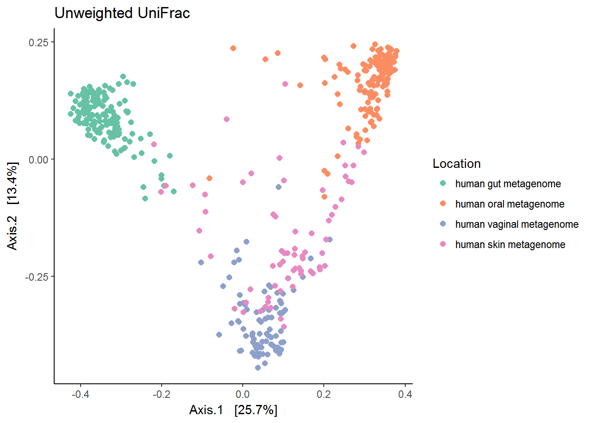
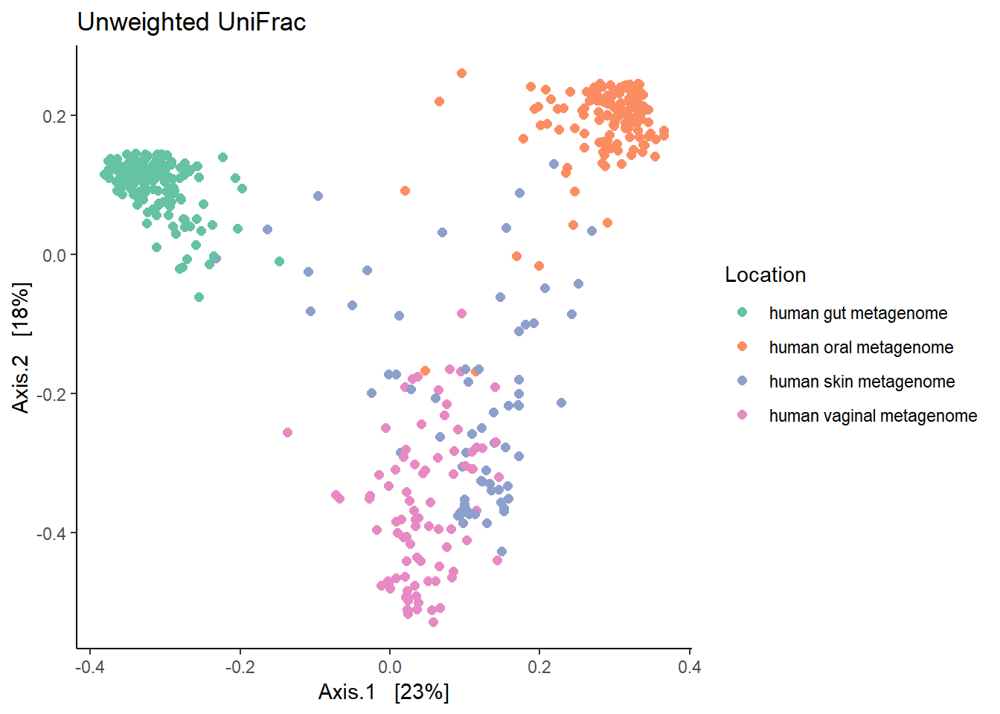
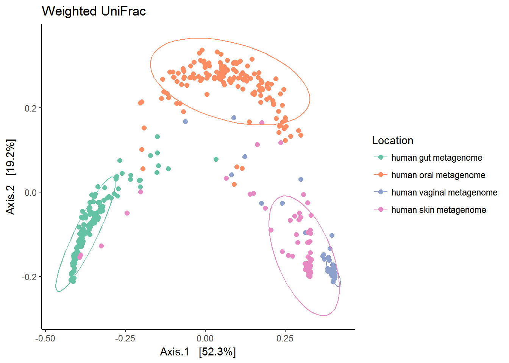
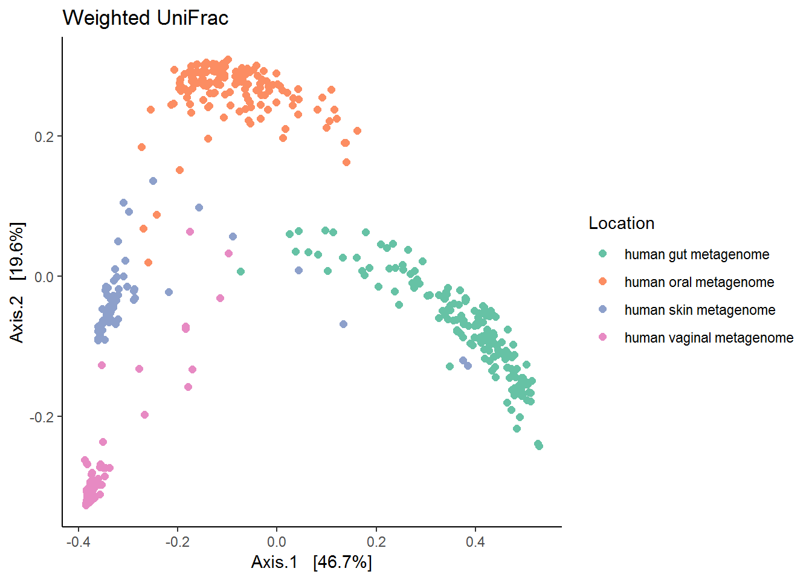

# Beta diversity metrics  

Beta-diversity: Measures for differences between samples from different groups to identify if there are differences in the overall community composition and structure.   

**Load packages and data**  


```r
library(microbiome) # data analysis and visualisation
library(phyloseq) # also the basis of data object. Data analysis and visualisation
library(RColorBrewer) # nice color options
library(ggpubr) # publication quality figures, based on ggplot2
library(dplyr) # data handling  
```


For more information:

[Waste Not, Want Not: Why Rarefying Microbiome Data Is Inadmissible](http://journals.plos.org/ploscompbiol/article?id=10.1371/journal.pcbi.1003531).  

[Normalisation and data transformation](https://microbiomejournal.biomedcentral.com/articles/10.1186/s40168-017-0237-y).  

[What is Constrained and Unconstrained Ordination](http://www.davidzeleny.net/anadat-r/doku.php/en:ordination).  


```r
# read non rarefied data
ps1 <- readRDS("./phyobjects/ps1.rds")

# read non rarefied data
ps0.rar.rds <- readRDS("./phyobjects/ps0.rar.rds")
# use print option to see the data saved as phyloseq object.
```

## Phylogenetic beta-diversity metrics  

### Unweighted Unifrac  

Unweighted Unifrac is based on presence/absence of different taxa and abundance is not important.  


```r
ps1.rel <- transform(ps1, "compositional")

ordu.unwt.uni <- ordinate(ps1.rel , "PCoA", "unifrac", weighted=F)

# check for Eigen values 
# barplot(ordu.unwt.uni$values$Eigenvalues[1:10])

unwt.unifrac <- plot_ordination(ps1.rel, 
                                     ordu.unwt.uni, color="scientific_name") 
unwt.unifrac <- unwt.unifrac + ggtitle("Unweighted UniFrac") + geom_point(size = 2)
unwt.unifrac <- unwt.unifrac + theme_classic() + scale_color_brewer("Location", palette = "Set2")
print(unwt.unifrac)
```




### Weighted Unifrac  

Weighted Unifrac will consider the abundances of different taxa.  


```r
ordu.wt.uni <- ordinate(ps1.rel , "PCoA", "unifrac", weighted=T)

# check for Eigen values 
# barplot(ordu.unwt.uni$values$Eigenvalues[1:10])

wt.unifrac <- plot_ordination(ps1.rel, 
                                     ordu.wt.uni, color="scientific_name") 
wt.unifrac <- wt.unifrac + ggtitle("Weighted UniFrac") + geom_point(size = 2)
wt.unifrac <- wt.unifrac + theme_classic() + scale_color_brewer("Location", palette = "Set2")
print(wt.unifrac)
```



```r
print(wt.unifrac + stat_ellipse())
```



The figure brings forward an important characteristics of microbiome data call the 'Horse-shoe effect'. An investigation and explaination for this can be found in the article by Morton JT., et al. 2017 [Uncovering the Horseshoe Effect in Microbial Analyses](http://msystems.asm.org/content/2/1/e00166-16).   


## Population-level Density landscapes    


```r
p <- microbiome::plot_landscape(ps1.rel, "NMDS", "bray", col = "scientific_name") +
       labs(title = paste("NMDS / Bray-Curtis"))   

p + scale_color_brewer(palette = "Dark2")+ scale_fill_gradient(low = "#e0ecf4", high = "#6e016b") 
```

```
## Scale for 'fill' is already present. Adding another scale for 'fill',
## which will replace the existing scale.
```



## PERMANOVA  


```r
library(vegan)
```

```
## Loading required package: permute
```

```
## Loading required package: lattice
```

```
## This is vegan 2.5-1
```

```r
metadf <- data.frame(sample_data(ps1.rel))

unifrac.dist <- UniFrac(ps1.rel, 
                        weighted = TRUE, 
                        normalized = TRUE,  
                        parallel = FALSE, 
                        fast = TRUE)

permanova <- adonis(unifrac.dist ~ scientific_name, data = metadf)

permanova
```

```
## 
## Call:
## adonis(formula = unifrac.dist ~ scientific_name, data = metadf) 
## 
## Permutation: free
## Number of permutations: 999
## 
## Terms added sequentially (first to last)
## 
##                  Df SumsOfSqs MeanSqs F.Model      R2 Pr(>F)    
## scientific_name   3    61.496 20.4985  410.98 0.72401  0.001 ***
## Residuals       470    23.442  0.0499         0.27599           
## Total           473    84.938                 1.00000           
## ---
## Signif. codes:  0 '***' 0.001 '**' 0.01 '*' 0.05 '.' 0.1 ' ' 1
```

## Checking the homogeneity condition  


```r
ps.disper <- betadisper(unifrac.dist, metadf$scientific_name)
permutest(ps.disper, pairwise = TRUE)
```

```
## 
## Permutation test for homogeneity of multivariate dispersions
## Permutation: free
## Number of permutations: 999
## 
## Response: Distances
##            Df Sum Sq  Mean Sq      F N.Perm Pr(>F)    
## Groups      3 0.9125 0.304150 22.998    999  0.001 ***
## Residuals 470 6.2158 0.013225                         
## ---
## Signif. codes:  0 '***' 0.001 '**' 0.01 '*' 0.05 '.' 0.1 ' ' 1
## 
## Pairwise comparisons:
## (Observed p-value below diagonal, permuted p-value above diagonal)
##                          human gut metagenome human oral metagenome
## human gut metagenome                                     1.0000e-03
## human oral metagenome              6.4361e-08                      
## human vaginal metagenome           2.0164e-07            3.0628e-16
## human skin metagenome              1.7519e-01            7.3652e-02
##                          human vaginal metagenome human skin metagenome
## human gut metagenome                   1.0000e-03                 0.193
## human oral metagenome                  1.0000e-03                 0.089
## human vaginal metagenome                                          0.001
## human skin metagenome                  1.8573e-04
```


```r
sessionInfo()
```

```
## R version 3.4.4 (2018-03-15)
## Platform: x86_64-w64-mingw32/x64 (64-bit)
## Running under: Windows 7 x64 (build 7601) Service Pack 1
## 
## Matrix products: default
## 
## locale:
## [1] LC_COLLATE=Dutch_Netherlands.1252  LC_CTYPE=Dutch_Netherlands.1252   
## [3] LC_MONETARY=Dutch_Netherlands.1252 LC_NUMERIC=C                      
## [5] LC_TIME=Dutch_Netherlands.1252    
## 
## attached base packages:
## [1] methods   stats     graphics  grDevices utils     datasets  base     
## 
## other attached packages:
##  [1] vegan_2.5-1        lattice_0.20-35    permute_0.9-4     
##  [4] dplyr_0.7.4        ggpubr_0.1.6       magrittr_1.5      
##  [7] RColorBrewer_1.1-2 microbiome_1.0.2   ggplot2_2.2.1     
## [10] phyloseq_1.23.1   
## 
## loaded via a namespace (and not attached):
##  [1] xfun_0.1            purrr_0.2.4         reshape2_1.4.3     
##  [4] splines_3.4.4       rhdf5_2.22.0        colorspace_1.3-2   
##  [7] htmltools_0.3.6     stats4_3.4.4        yaml_2.1.18        
## [10] mgcv_1.8-23         survival_2.42-3     rlang_0.2.0        
## [13] pillar_1.2.2        glue_1.2.0          BiocGenerics_0.24.0
## [16] bindrcpp_0.2.2      bindr_0.1.1         foreach_1.4.4      
## [19] plyr_1.8.4          stringr_1.3.0       zlibbioc_1.24.0    
## [22] Biostrings_2.46.0   munsell_0.4.3       gtable_0.2.0       
## [25] codetools_0.2-15    evaluate_0.10.1     labeling_0.3       
## [28] Biobase_2.38.0      knitr_1.20          IRanges_2.12.0     
## [31] biomformat_1.7.0    parallel_3.4.4      Rcpp_0.12.16       
## [34] backports_1.1.2     scales_0.5.0        S4Vectors_0.16.0   
## [37] jsonlite_1.5        XVector_0.18.0      digest_0.6.15      
## [40] stringi_1.1.7       bookdown_0.7        grid_3.4.4         
## [43] ade4_1.7-11         rprojroot_1.3-2     tools_3.4.4        
## [46] lazyeval_0.2.1      tibble_1.4.2        cluster_2.0.7-1    
## [49] tidyr_0.8.0         ape_5.1             pkgconfig_2.0.1    
## [52] MASS_7.3-49         Matrix_1.2-14       data.table_1.10.4-3
## [55] assertthat_0.2.0    rmarkdown_1.9       iterators_1.0.9    
## [58] R6_2.2.2            multtest_2.34.0     igraph_1.2.1       
## [61] nlme_3.1-137        compiler_3.4.4
```


