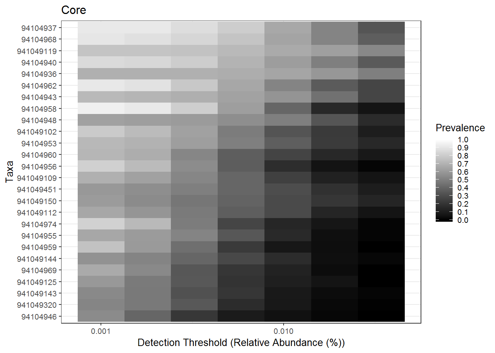
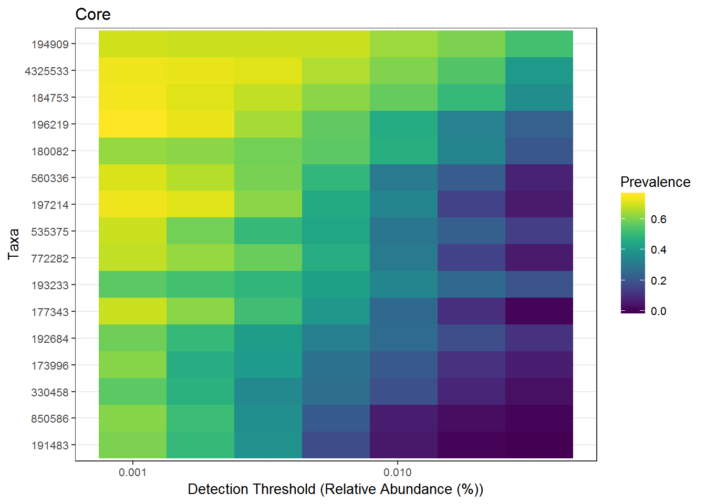
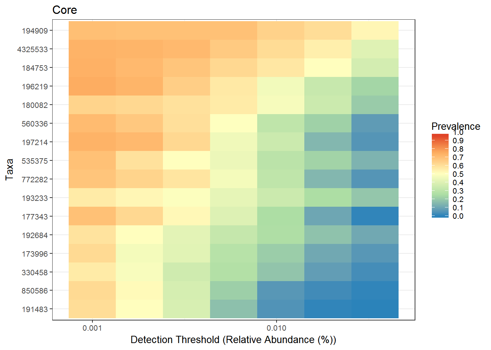
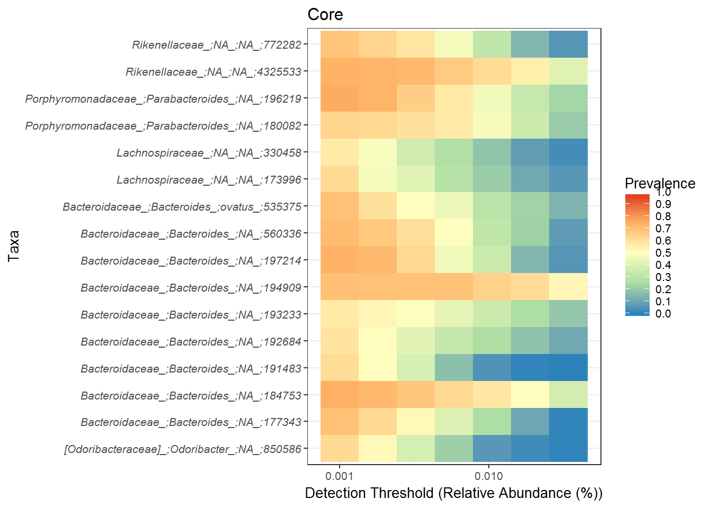
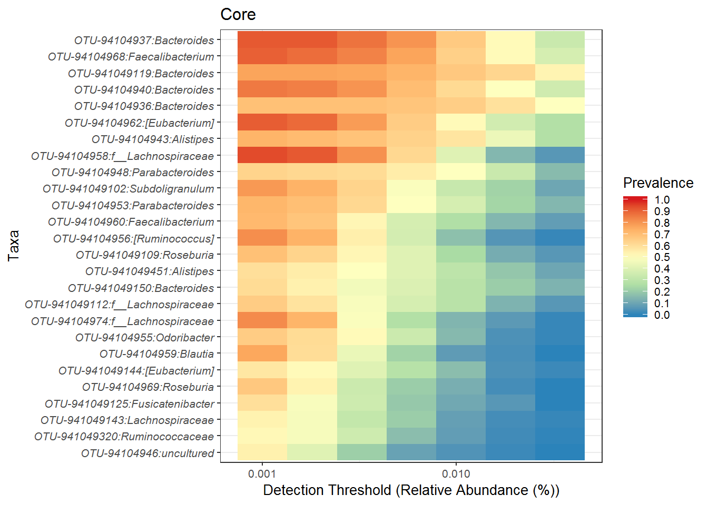

# Core microbiota  

For more information:

[The adult intestinal core microbiota is determined by analysis depth and health status](https://www.sciencedirect.com/science/article/pii/S1198743X14609629?via%3Dihub).  

[Intestinal microbiome landscaping: insight in community assemblage and implications for microbial modulation strategies](https://academic.oup.com/femsre/article/41/2/182/2979411).  

[Intestinal Microbiota in Healthy Adults: Temporal Analysis Reveals Individual and Common Core and Relation to Intestinal Symptoms](http://journals.plos.org/plosone/article?id=10.1371/journal.pone.0023035).  


```r
library(microbiome) # data analysis and visualisation
library(phyloseq) # also the basis of data object. Data analysis and visualisation
library(RColorBrewer) # nice color options
library(ggpubr) # publication quality figures, based on ggplot2
library(dplyr) # data handling  
```

## Core microbiota anlaysis   

We will use the filtered phyloseq object from previous tutorial. We will use the filtered phyloseq object from the first section for pre-processioning.


```r
# read non rarefied data
ps1 <- readRDS("./phyobjects/ps.ng.tax.rds")

# use print option to see the data saved as phyloseq object.
```

Subset the data to keep only stool samples.  


```r
ps1.stool <- subset_samples(ps1, bodysite == "Stool")

# convert to relative abundance  
ps1.stool.rel <- microbiome::transform(ps1.stool, "compositional")
print(ps1.stool.rel)
```

```
## phyloseq-class experiment-level object
## otu_table()   OTU Table:         [ 4710 taxa and 169 samples ]
## sample_data() Sample Data:       [ 169 samples by 30 sample variables ]
## tax_table()   Taxonomy Table:    [ 4710 taxa by 6 taxonomic ranks ]
## phy_tree()    Phylogenetic Tree: [ 4710 tips and 4709 internal nodes ]
```

```r
ps1.stool.rel2 <- prune_taxa(taxa_sums(ps1.stool.rel) > 0, ps1.stool.rel)

print(ps1.stool.rel2)
```

```
## phyloseq-class experiment-level object
## otu_table()   OTU Table:         [ 1996 taxa and 169 samples ]
## sample_data() Sample Data:       [ 169 samples by 30 sample variables ]
## tax_table()   Taxonomy Table:    [ 1996 taxa by 6 taxonomic ranks ]
## phy_tree()    Phylogenetic Tree: [ 1996 tips and 1995 internal nodes ]
```

Check of the core OTUs  


```r
core.taxa.standard <- core_members(ps1.stool.rel2, detection = 0.001, prevalence = 50/100)

print(core.taxa.standard)
```

```
##  [1] "94104936"  "941049119" "94104948"  "94104953"  "94104940" 
##  [6] "94104937"  "941049150" "94104955"  "941049451" "94104943" 
## [11] "941049144" "94104962"  "94104956"  "94104959"  "94104974" 
## [16] "941049143" "941049112" "94104958"  "941049125" "941049109"
## [21] "94104969"  "94104960"  "94104968"  "941049102" "941049320"
## [26] "94104946"
```

There are 16 OTUs that are core based on the cut-offs for prevalence and detection we choose. However, we only see IDs, not very informative. We can get the classification of these as below.    


```r
# Extract the taxonomy table

taxonomy <- as.data.frame(tax_table(ps1.stool.rel2))

# Subset this taxonomy table to include only core OTUs  
core_taxa_id <- subset(taxonomy, rownames(taxonomy) %in% core.taxa.standard)

DT::datatable(core_taxa_id)
```

<!--html_preserve--><div id="htmlwidget-ea48c0fa9429685a9c56" style="width:100%;height:auto;" class="datatables html-widget"></div>
<script type="application/json" data-for="htmlwidget-ea48c0fa9429685a9c56">{"x":{"filter":"none","data":[["94104936","941049119","94104948","94104953","94104940","94104937","941049150","94104955","941049451","94104943","941049144","94104962","94104956","94104959","94104974","941049143","941049112","94104958","941049125","941049109","94104969","94104960","94104968","941049102","941049320","94104946"],["Bacteria","Bacteria","Bacteria","Bacteria","Bacteria","Bacteria","Bacteria","Bacteria","Bacteria","Bacteria","Bacteria","Bacteria","Bacteria","Bacteria","Bacteria","Bacteria","Bacteria","Bacteria","Bacteria","Bacteria","Bacteria","Bacteria","Bacteria","Bacteria","Bacteria","Bacteria"],["Bacteroidetes","Bacteroidetes","Bacteroidetes","Bacteroidetes","Bacteroidetes","Bacteroidetes","Bacteroidetes","Bacteroidetes","Bacteroidetes","Bacteroidetes","Firmicutes","Firmicutes","Firmicutes","Firmicutes","Firmicutes","Firmicutes","Firmicutes","Firmicutes","Firmicutes","Firmicutes","Firmicutes","Firmicutes","Firmicutes","Firmicutes","Firmicutes","Firmicutes"],["Bacteroidia","Bacteroidia","Bacteroidia","Bacteroidia","Bacteroidia","Bacteroidia","Bacteroidia","Bacteroidia","Bacteroidia","Bacteroidia","Clostridia","Clostridia","Clostridia","Clostridia","Clostridia","Clostridia","Clostridia","Clostridia","Clostridia","Clostridia","Clostridia","Clostridia","Clostridia","Clostridia","Clostridia","Clostridia"],["Bacteroidales","Bacteroidales","Bacteroidales","Bacteroidales","Bacteroidales","Bacteroidales","Bacteroidales","Bacteroidales","Bacteroidales","Bacteroidales","Clostridiales","Clostridiales","Clostridiales","Clostridiales","Clostridiales","Clostridiales","Clostridiales","Clostridiales","Clostridiales","Clostridiales","Clostridiales","Clostridiales","Clostridiales","Clostridiales","Clostridiales","Clostridiales"],["Bacteroidaceae","Bacteroidaceae","Porphyromonadaceae","Porphyromonadaceae","Bacteroidaceae","Bacteroidaceae","Bacteroidaceae","Porphyromonadaceae","Rikenellaceae","Rikenellaceae","Lachnospiraceae","Lachnospiraceae","Lachnospiraceae","Lachnospiraceae","Lachnospiraceae","Lachnospiraceae","Lachnospiraceae","Lachnospiraceae","Lachnospiraceae","Lachnospiraceae","Lachnospiraceae","Ruminococcaceae","Ruminococcaceae","Ruminococcaceae","Ruminococcaceae","Ruminococcaceae"],["Bacteroides","Bacteroides","Parabacteroides","Parabacteroides","Bacteroides","Bacteroides","Bacteroides","Odoribacter","Alistipes","Alistipes","[Eubacterium]","[Eubacterium]","[Ruminococcus]","Blautia","","Lachnospiraceae","","","Fusicatenibacter","Roseburia","Roseburia","Faecalibacterium","Faecalibacterium","Subdoligranulum","Ruminococcaceae","uncultured"]],"container":"<table class=\"display\">\n  <thead>\n    <tr>\n      <th> <\/th>\n      <th>Domain<\/th>\n      <th>Phylum<\/th>\n      <th>Class<\/th>\n      <th>Order<\/th>\n      <th>Family<\/th>\n      <th>Genus<\/th>\n    <\/tr>\n  <\/thead>\n<\/table>","options":{"order":[],"autoWidth":false,"orderClasses":false,"columnDefs":[{"orderable":false,"targets":0}]}},"evals":[],"jsHooks":[]}</script><!--/html_preserve-->


## Core abundance and diversity  
Total core abundance in each sample (sum of abundances of the core members):


```r
core.abundance <- sample_sums(core(ps1.stool.rel2, detection = 0.001, prevalence = 50/100))

DT::datatable(as.data.frame(core.abundance))
```

<!--html_preserve--><div id="htmlwidget-b46cc8738d2a51cdfaf6" style="width:100%;height:auto;" class="datatables html-widget"></div>
<script type="application/json" data-for="htmlwidget-b46cc8738d2a51cdfaf6">{"x":{"filter":"none","data":[["1927.SRS015389.SRX020546.SRR043661","1927.SRS014923.SRX020546.SRR043675","1927.SRS014823.SRX020546.SRR043699","1927.SRS015854.SRX020554.SRR043727","1927.SRS015190.SRX020554.SRR043731","1927.SRS015281.SRX020554.SRR043805","1927.SRS014885.SRX020554.SRR043822","1927.SRS014369.SRX020554.SRR043823","1927.SRS046341.SRX020554.SRR043828","1927.SRS019787.SRX020577.SRR043974","1927.SRS015578.SRX020577.SRR044021","1927.SRS014999.SRX020577.SRR044050","1927.SRS016267.SRX020577.SRR044054","1927.SRS048870.SRX020577.SRR044064","1927.SRS015332.SRX020577.SRR044071","1927.SRS015247.SRX020577.SRR044079","1927.SRS015960.SRX020577.SRR044087","1927.SRS015724.SRX020539.SRR044132","1927.SRS015782.SRX020539.SRR044139","1927.SRS015518.SRX020539.SRR044146","1927.SRS015599.SRX020539.SRR044148","1927.SRS016018.SRX020539.SRR044156","1927.SRS015663.SRX020539.SRR044161","1927.SRS016095.SRX020516.SRR044317","1927.SRS016203.SRX020516.SRR044343","1927.SRS019910.SRX020516.SRR044347","1927.SRS018559.SRX020516.SRR044352","1927.SRS019267.SRX020516.SRR044360","1927.SRS015911.SRX020510.SRR044585","1927.SRS019013.SRX020510.SRR044597","1927.SRS015911.SRX020520.SRR044615","1927.SRS019013.SRX020520.SRR044627","1927.SRS015815.SRX020562.SRR044705","1927.SRS019089.SRX020564.SRR044731","1927.SRS015452.SRX020545.SRR044740","1927.SRS019089.SRX020545.SRR044757","1927.SRS011529.SRX020661.SRR044768","1927.SRS011653.SRX020661.SRR044770","1927.SRS011621.SRX020661.SRR044776","1927.SRS011415.SRX020661.SRR044786","1927.SRS011413.SRX020661.SRR044792","1927.SRS011452.SRX020661.SRR044798","1927.SRS011410.SRX020661.SRR044800","1927.SRS011405.SRX020661.SRR044803","1927.SRS011157.SRX020661.SRR044808","1927.SRS011586.SRX020661.SRR044826","1927.SRS011271.SRX020661.SRR044827","1927.SRS011529.SRX020659.SRR044994","1927.SRS011653.SRX020659.SRR044997","1927.SRS011621.SRX020659.SRR045004","1927.SRS011415.SRX020659.SRR045013","1927.SRS011413.SRX020659.SRR045020","1927.SRS011410.SRX020659.SRR045027","1927.SRS011157.SRX020659.SRR045036","1927.SRS011586.SRX020659.SRR045050","1927.SRS011271.SRX020659.SRR045051","1927.SRS014442.SRX020543.SRR045553","1927.SRS014659.SRX020543.SRR045556","1927.SRS014287.SRX020543.SRR045558","1927.SRS019582.SRX020543.SRR045562","1927.SRS048819.SRX020543.SRR045568","1927.SRS050422.SRX020543.SRR045575","1927.SRS048819.SRX020511.SRR045612","1927.SRS019582.SRX020511.SRR045623","1927.SRS050422.SRX020511.SRR045628","1927.SRS014659.SRX020511.SRR045649","1927.SRS014442.SRX020511.SRR045656","1927.SRS014287.SRX020511.SRR045664","1927.SRS018920.SRX020572.SRR045810","1927.SRS018968.SRX020572.SRR045817","1927.SRS018712.SRX020572.SRR046003","1927.SRS043804.SRX020531.SRR046050","1927.SRS046349.SRX020531.SRR046051","1927.SRS053335.SRX020531.SRR046056","1927.SRS052326.SRX020670.SRR046232","1927.SRS011405.SRX020659.SRR046237","1927.SRS054928.SRX020670.SRR046262","1927.SRS043411.SRX020670.SRR046345","1927.SRS064276.SRX020670.SRR046347","1927.SRS065263.SRX020670.SRR046351","1927.SRS045526.SRX020670.SRR046355","1927.SRS045877.SRX020523.SRR046406","1927.SRS043299.SRX020523.SRR046410","1927.SRS057447.SRX020523.SRR046411","1927.SRS055563.SRX020523.SRR046412","1927.SRS049823.SRX020523.SRR046414","1927.SRS042387.SRX020523.SRR046416","1927.SRS048838.SRX020523.SRR046418","1927.SRS045607.SRX020523.SRR046421","1927.SRS054590.SRX020550.SRR046427","1927.SRS046313.SRX020550.SRR046437","1927.SRS052697.SRX020550.SRR046441","1927.SRS054461.SRX020550.SRR046442","1927.SRS064321.SRX020519.SRR046501","1927.SRS063324.SRX020519.SRR046503","1927.SRS064557.SRX020569.SRR046542","1927.SRS063921.SRX020569.SRR046605","1927.SRS063275.SRX020532.SRR046899","1927.SRS063961.SRX020532.SRR046907","1927.SRS062464.SRX020532.SRR046982","1927.SRS063827.SRX020532.SRR046984","1927.SRS063214.SRX020532.SRR046986","1927.SRS062847.SRX020532.SRR047036","1927.SRS065466.SRX020532.SRR047056","1927.SRS056259.SRX020578.SRR047235","1927.SRS051031.SRX020578.SRR047244","1927.SRS046382.SRX020540.SRR047262","1927.SRS042703.SRX020540.SRR047267","1927.SRS049164.SRX020540.SRR047273","1927.SRS042669.SRX020540.SRR047279","1927.SRS042628.SRX020578.SRR047303","1927.SRS014345.SRX020546.SRR047368","1927.SRS014613.SRX020546.SRR047386","1927.SRS018733.SRX020516.SRR047425","1927.SRS015452.SRX020564.SRR047456","1927.SRS011452.SRX020659.SRR047485","1927.SRS046639.SRX020670.SRR047659","1927.SRS049428.SRX020670.SRR047663","1927.SRS045414.SRX020563.SRR047697","1927.SRS058416.SRX020523.SRR047701","1927.SRS055665.SRX020523.SRR047702","1927.SRS049748.SRX020523.SRR047703","1927.SRS050733.SRX020550.SRR047710","1927.SRS055482.SRX020550.SRR047716","1927.SRS012191.SRX020675.SRR047747","1927.SRS021601.SRX020675.SRR047748","1927.SRS022987.SRX020675.SRR047766","1927.SRS021910.SRX020675.SRR047783","1927.SRS021541.SRX020675.SRR047797","1927.SRS022924.SRX020675.SRR047811","1927.SRS023047.SRX020675.SRR047826","1927.SRS020119.SRX020676.SRR047844","1927.SRS020176.SRX020676.SRR047859","1927.SRS023422.SRX020676.SRR047874","1927.SRS024511.SRX020676.SRR047887","1927.SRS023851.SRX020676.SRR047925","1927.SRS048083.SRX020677.SRR047956","1927.SRS057122.SRX020677.SRR047969","1927.SRS013543.SRX020677.SRR047980","1927.SRS013762.SRX020677.SRR048007","1927.SRS023488.SRX020678.SRR048028","1927.SRS050599.SRX020678.SRR048036","1927.SRS023422.SRX020683.SRR048341","1927.SRS016056.SRX020536.SRR049357","1927.SRS065665.SRX020519.SRR049404","1927.SRS065725.SRX020519.SRR049530","1927.SRS018872.SRX020572.SRR051576","1927.SRS019381.SRX020572.SRR051585","1927.SRS019534.SRX020572.SRR051591","1927.SRS021109.SRX022097.SRR057663","1927.SRS020584.SRX022097.SRR057663","1927.SRS020811.SRX022097.SRR057663","1927.SRS020470.SRX022097.SRR057663","1927.SRS020641.SRX022097.SRR057663","1927.SRS063807.SRX022232.SRR058094","1927.SRS021853.SRX022232.SRR058094","1927.SRS063307.SRX022232.SRR058094","1927.SRS063918.SRX022232.SRR058094","1927.SRS065421.SRX022232.SRR058094","1927.SRS064647.SRX022232.SRR058094","1927.SRS042572.SRX022241.SRR058097","1927.SRS049949.SRX022241.SRR058097","1927.SRS049766.SRX022241.SRR058097","1927.SRS056832.SRX022241.SRR058097","1927.SRS057676.SRX022156.SRR058115","1927.SRS063968.SRX022156.SRR058115","1927.SRS051892.SRX022156.SRR058115","1927.SRS042803.SRX022156.SRR058115","1927.SRS063608.SRX022156.SRR058115"],[0.526949826130154,0.414548108502615,0.643651014170603,0.656386311973951,0.735081267054218,0.540961522269934,0.712558474271321,0.60062488513141,0.486176836861768,0.608977978543196,0.612723515140624,0.378732009040086,0.479402497374256,0.622824974411464,0.56270985581671,0.480575176589304,0.512215282880235,0.605486336509266,0.346825172186055,0.6135800860159,0.560200153964588,0.568763023299867,0.358738501971091,0.288553431798436,0.537527593818985,0.420257778935035,0.549789083471814,0.637278106508876,0.704630428530342,0.647196809758386,0.681742372216227,0.634650455927052,0.323540894007418,0.497500192292901,0.372772506364268,0.518009478672986,0.186523640908144,0.285854737618287,0.517813130181492,0.164796718542647,0.404062465873103,0.808173076923077,0.469072894550602,0.467334035827187,0.242564284867875,0.383274100399822,0.28333099677555,0.191780821917808,0.278895705521472,0.516944284893739,0.176887075483019,0.400043015377998,0.47298631682889,0.251582089552239,0.384649316277018,0.282201086956522,0.699894115867494,0.41240253411306,0.67073732718894,0.396097715736041,0.407373897308301,0.680694455556444,0.436917562724014,0.403284962525913,0.725872179703807,0.407273711758867,0.730653611612127,0.698825428135928,0.243455087004233,0.247287449392713,0.601553306660391,0.483657304138025,0.224004063565779,0.492137574495584,0.788212799460128,0.475863525932186,0.583642063265888,0.692279465727286,0.669820245979186,0.588530016999195,0.562505275597198,0.535652173913044,0.531892021022456,0.496123091834262,0.709915917657292,0.489773820981713,0.154774637127578,0.941359696641387,0.579493613138686,0.810770256752251,0.639719142078809,0.384094368340944,0.36540824541333,0.587568651381745,0.633474819318573,0.63148223764802,0.933384897998646,0.29592549476135,0.476757791724285,0.333919056796282,0.718654086620439,0.22491382612026,0.649083215796897,0.579841240539044,0.494631944062104,0.351998591301285,0.631604973156259,0.562947543713572,0.590926478463775,0.661865569272977,0.434061930783242,0.538324022346369,0.75,0.247405966277562,0.355100693298118,0.830479659987857,0.550978464837816,0.581738614448895,0.590740022362686,0.515222984562607,0.538443199427822,0.208929452392699,0.414466574031187,0.332072943634464,0.321056172216616,0.546559823155568,0.462182528607312,0.192224287484511,0.446036036036036,0.33275645059786,0.424191750278707,0.368755364806867,0.374364504698814,0.355296790684465,0.70170522776399,0.617200129324281,0.696687240206575,0.1950638666378,0.388383045525903,0.729663744312507,0.349028840494408,0.497075409836066,0.374162096282754,0.144327351838422,0.2528076171875,0.533286980705719,0.456405327474942,0.578031212484994,0.660912258473234,0.623556581986143,0.546695402298851,0.287531806615776,0.435498089920658,0.704185386616221,0.24312,0.440685510794569,0.274738633600778,0.828752642706131,0.491824302661109,0.351255151742226,0.250573602221954,0.464883491959304,0.762379851563451,0.223989493652415,0.122714856062198,0.219352351580571,0.243864634461379,0.0978127734033246,0.170414421111318]],"container":"<table class=\"display\">\n  <thead>\n    <tr>\n      <th> <\/th>\n      <th>core.abundance<\/th>\n    <\/tr>\n  <\/thead>\n<\/table>","options":{"columnDefs":[{"className":"dt-right","targets":1},{"orderable":false,"targets":0}],"order":[],"autoWidth":false,"orderClasses":false}},"evals":[],"jsHooks":[]}</script><!--/html_preserve-->


## Core visualization  

### Core heatmaps  

This visualization method has been used for instance in [Intestinal microbiome landscaping: insight in community assemblage and implications for microbial modulation strategies](https://academic.oup.com/femsre/article/41/2/182/2979411).  

Note that you can order the taxa on the heatmap with the order.taxa argument.


```r
# Core with compositionals:
prevalences <- seq(.05, 1, .05)
detections <- 10^seq(log10(1e-3), log10(.2), length = 10)

# Also define gray color palette
gray <- gray(seq(0,1,length=5))
p.core <- plot_core(ps1.stool.rel2, plot.type = "heatmap", colours = gray,
    prevalences = prevalences, detections = detections, min.prevalence = .5) +
    xlab("Detection Threshold (Relative Abundance (%))")
print(p.core)    
```



```r
# Same with the viridis color palette
# color-blind friendly and uniform
# options: viridis, magma, plasma, inferno
# https://cran.r-project.org/web/packages/viridis/vignettes/intro-to-viridis.html
# Also discrete=TRUE versions available
library(viridis)
```

```
## Loading required package: viridisLite
```

```r
print(p.core + scale_fill_viridis())
```

```
## Scale for 'fill' is already present. Adding another scale for 'fill',
## which will replace the existing scale.
```



Color change 


```r
# Core with compositionals:
prevalences <- seq(.05, 1, .05)
detections <- 10^seq(log10(1e-3), log10(.2), length = 10)

# Also define gray color palette

p.core <- plot_core(ps1.stool.rel2, 
                    plot.type = "heatmap", 
                    colours = rev(brewer.pal(5, "Spectral")),
                    prevalences = prevalences, 
                    detections = detections, 
                    min.prevalence = .5) + 
  xlab("Detection Threshold (Relative Abundance (%))")

print(p.core) 
```



We have a custom script to format this figure which can be found in `scripts` folder in the `RProject`.  


```r
ps1.stool.rel2.f <- microbiomeutilities::format_to_besthit(ps1.stool.rel2)

p.core <- plot_core(ps1.stool.rel2.f, 
                    plot.type = "heatmap", 
                    colours = rev(brewer.pal(5, "Spectral")),
                    prevalences = prevalences, 
                    detections = detections, 
                    min.prevalence = .5) + 
  xlab("Detection Threshold (Relative Abundance (%))")

print(p.core) 
```



```r
plot(p.core + theme(axis.text.y = element_text(face="italic")))
```




```r
sessionInfo()
```

```
## R version 3.4.4 (2018-03-15)
## Platform: x86_64-w64-mingw32/x64 (64-bit)
## Running under: Windows 7 x64 (build 7601) Service Pack 1
## 
## Matrix products: default
## 
## locale:
## [1] LC_COLLATE=Dutch_Netherlands.1252  LC_CTYPE=Dutch_Netherlands.1252   
## [3] LC_MONETARY=Dutch_Netherlands.1252 LC_NUMERIC=C                      
## [5] LC_TIME=Dutch_Netherlands.1252    
## 
## attached base packages:
## [1] methods   stats     graphics  grDevices utils     datasets  base     
## 
## other attached packages:
##  [1] bindrcpp_0.2.2       viridis_0.5.1        viridisLite_0.3.0   
##  [4] dplyr_0.7.4          ggpubr_0.1.6         magrittr_1.5        
##  [7] RColorBrewer_1.1-2   microbiome_1.1.10013 ggplot2_2.2.1.9000  
## [10] phyloseq_1.22.3     
## 
## loaded via a namespace (and not attached):
##  [1] Biobase_2.38.0             tidyr_0.8.0               
##  [3] jsonlite_1.5               splines_3.4.4             
##  [5] foreach_1.4.4              shiny_1.0.5               
##  [7] assertthat_0.2.0           stats4_3.4.4              
##  [9] ggrepel_0.8.0              yaml_2.1.19               
## [11] pillar_1.2.2               backports_1.1.2           
## [13] lattice_0.20-35            glue_1.2.0                
## [15] digest_0.6.15              promises_1.0.1            
## [17] XVector_0.18.0             colorspace_1.3-2          
## [19] htmltools_0.3.6            httpuv_1.4.3              
## [21] Matrix_1.2-14              plyr_1.8.4                
## [23] microbiomeutilities_0.99.0 pkgconfig_2.0.1           
## [25] pheatmap_1.0.8             bookdown_0.7              
## [27] zlibbioc_1.24.0            xtable_1.8-2              
## [29] purrr_0.2.4                scales_0.5.0              
## [31] later_0.7.2                Rtsne_0.13                
## [33] tibble_1.4.2               mgcv_1.8-23               
## [35] IRanges_2.12.0             DT_0.4                    
## [37] withr_2.1.2                BiocGenerics_0.24.0       
## [39] lazyeval_0.2.1             mime_0.5                  
## [41] survival_2.42-3            evaluate_0.10.1           
## [43] nlme_3.1-137               MASS_7.3-50               
## [45] vegan_2.5-1                tools_3.4.4               
## [47] data.table_1.11.2          stringr_1.3.1             
## [49] S4Vectors_0.16.0           munsell_0.4.3             
## [51] cluster_2.0.7-1            Biostrings_2.46.0         
## [53] ade4_1.7-11                compiler_3.4.4            
## [55] rlang_0.2.0                rhdf5_2.22.0              
## [57] grid_3.4.4                 iterators_1.0.9           
## [59] biomformat_1.7.0           htmlwidgets_1.2           
## [61] crosstalk_1.0.0            igraph_1.2.1              
## [63] labeling_0.3               rmarkdown_1.9             
## [65] gtable_0.2.0               codetools_0.2-15          
## [67] multtest_2.34.0            reshape2_1.4.3            
## [69] R6_2.2.2                   gridExtra_2.3             
## [71] knitr_1.20                 bindr_0.1.1               
## [73] rprojroot_1.3-2            permute_0.9-4             
## [75] ape_5.1                    stringi_1.1.7             
## [77] parallel_3.4.4             Rcpp_0.12.16              
## [79] tidyselect_0.2.4           xfun_0.1
```


