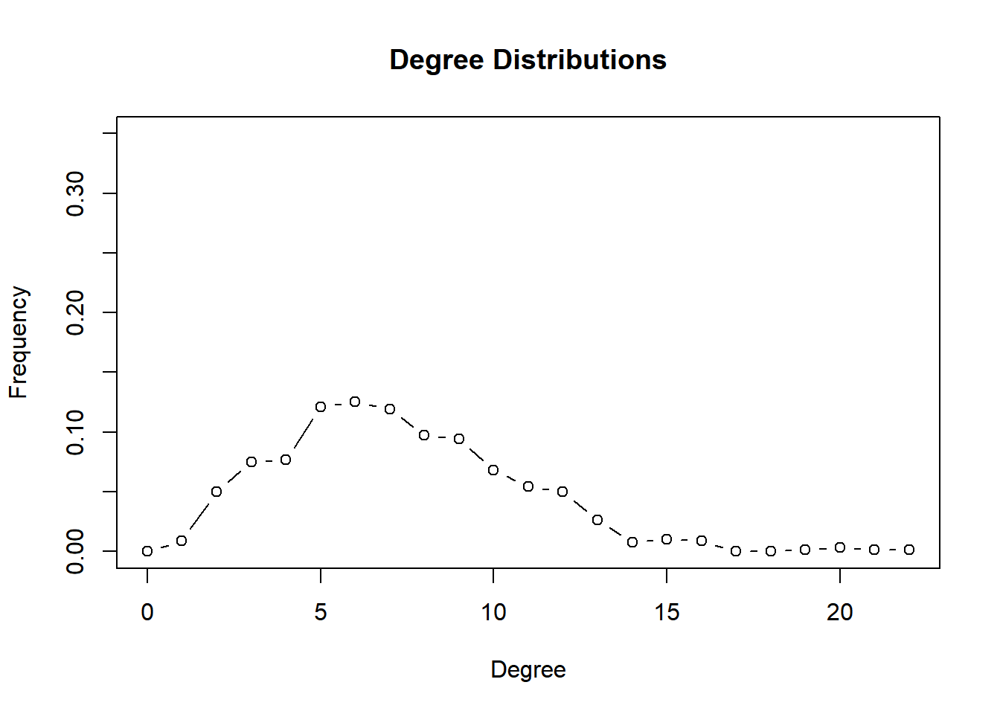
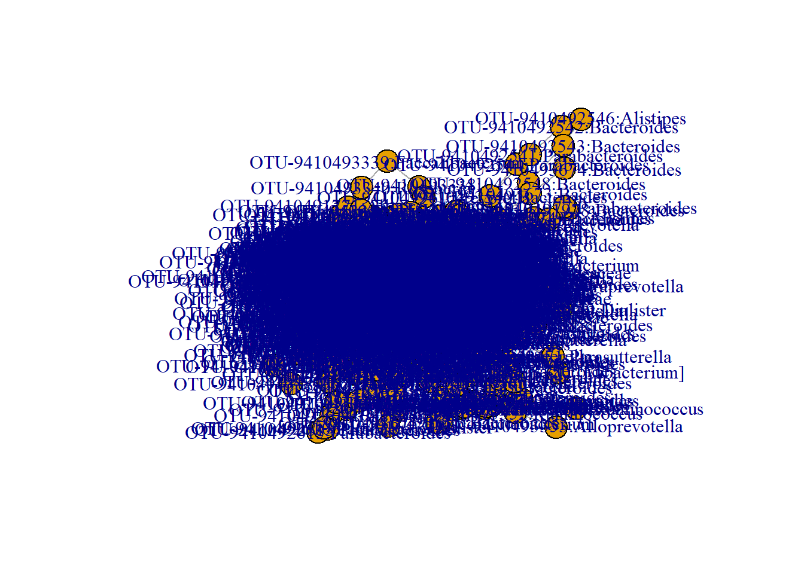
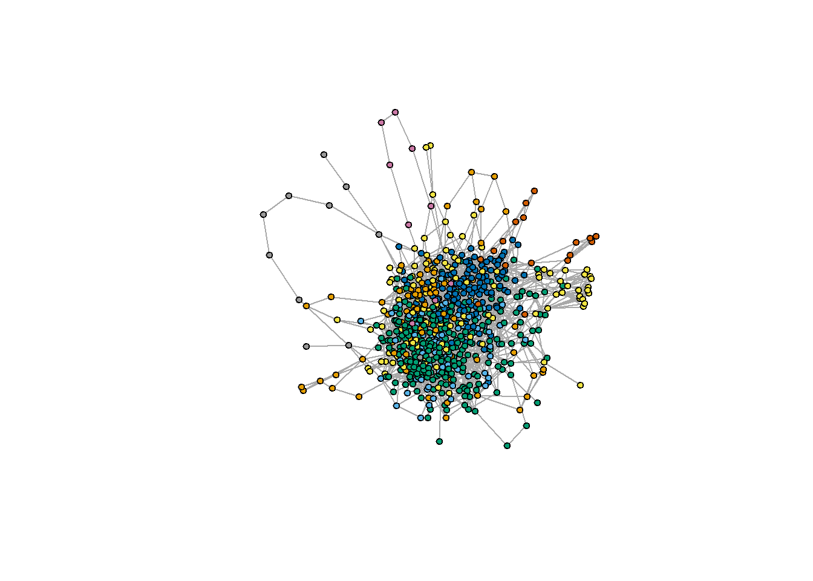
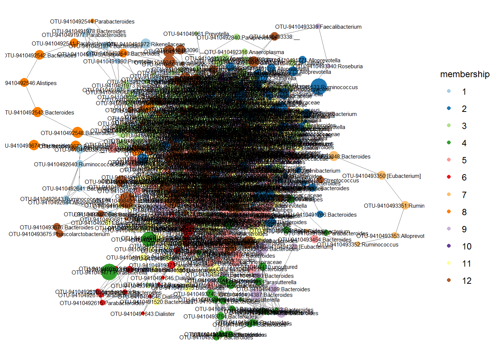

# Inference of Microbial Ecological Networks     

More information on [SPIEC-EASI](http://journals.plos.org/ploscompbiol/article?id=10.1371/journal.pcbi.1004226).  

The input for SPIEC-EASI is a counts table. The normalization and tranformation is done by the function.    
This step is heavy on computational memory and slow. Noise filtered OTU-OTU level covariance would be ideal.     

**Load packages and data**  


```r
library(devtools)
install_github("zdk123/SpiecEasi")

# Other packages you need to install are
install.packages("igraph")

install.packages("intergraph")
install.packages("GGally")
devtools::install_github("briatte/ggnet")

install.packages("network")
install.packages("ggnetwork")
```


```r
library(microbiome) # data analysis and visualisation
library(phyloseq) # also the basis of data object. Data analysis and visualisation
library(RColorBrewer) # nice color options
library(ggpubr) # publication quality figures, based on ggplot2
library(dplyr) # data handling
library(SpiecEasi) # Network analysis for sparse compositional data  
library(network)
library(intergraph)
#devtools::install_github("briatte/ggnet")
library(ggnet)
library(igraph)
```


**Read data**


```r
ps1 <- readRDS("./phyobjects/ps.ng.tax.rds")
```

**Select only stool samples**  

We will subset our data to include only stool samples.  


```r
ps1.stool <- subset_samples(ps1, bodysite == "Stool")
```


**For testing reduce the number of OTUs**  


```r
ps1.stool.otu <- prune_taxa(taxa_sums(ps1.stool) > 100, ps1.stool)

# Add taxonomic classification to OTU ID
ps1.stool.otu.f <- microbiomeutilities::format_to_besthit(ps1.stool.otu)

head(tax_table(ps1.stool.otu))
```

```
## Taxonomy Table:     [6 taxa by 6 taxonomic ranks]:
##            Domain     Phylum          Class         Order          
## 9410491526 "Bacteria" "Bacteroidetes" "Bacteroidia" "Bacteroidales"
## 9410491516 "Bacteria" "Bacteroidetes" "Bacteroidia" "Bacteroidales"
## 9410492612 "Bacteria" "Bacteroidetes" "Bacteroidia" "Bacteroidales"
## 9410491521 "Bacteria" "Bacteroidetes" "Bacteroidia" "Bacteroidales"
## 9410491824 "Bacteria" "Bacteroidetes" "Bacteroidia" "Bacteroidales"
## 9410491817 "Bacteria" "Bacteroidetes" "Bacteroidia" "Bacteroidales"
##            Family           Genus        
## 9410491526 "Bacteroidaceae" "Bacteroides"
## 9410491516 "Bacteroidaceae" "Bacteroides"
## 9410492612 "Bacteroidaceae" "Bacteroides"
## 9410491521 "Bacteroidaceae" "Bacteroides"
## 9410491824 "Bacteroidaceae" "Bacteroides"
## 9410491817 "Bacteroidaceae" "Bacteroides"
```

Check the difference in two phyloseq objects.  


```r
head(tax_table(ps1.stool.otu.f))
```

## Prepare data for SpiecEasi  

The calcualtion of SpiecEasi are time consuming. For this tutorial we will have the necessary input files for SpiecEasi.  

* OTU table  
* Taxonomy table  

We save it as *.rds* object.  


```r
otu.c <- t(otu_table(ps1.stool.otu.f)@.Data) #extract the otu table from phyloseq object

tax.c <- as.data.frame(tax_table(ps1.stool.otu.f)@.Data)#extract the taxonomy information

head(tax.c)
```

```
##                              Domain        Phylum       Class
## OTU-9410491526:Bacteroides Bacteria Bacteroidetes Bacteroidia
## OTU-9410491516:Bacteroides Bacteria Bacteroidetes Bacteroidia
## OTU-9410492612:Bacteroides Bacteria Bacteroidetes Bacteroidia
## OTU-9410491521:Bacteroides Bacteria Bacteroidetes Bacteroidia
## OTU-9410491824:Bacteroides Bacteria Bacteroidetes Bacteroidia
## OTU-9410491817:Bacteroides Bacteria Bacteroidetes Bacteroidia
##                                    Order         Family       Genus
## OTU-9410491526:Bacteroides Bacteroidales Bacteroidaceae Bacteroides
## OTU-9410491516:Bacteroides Bacteroidales Bacteroidaceae Bacteroides
## OTU-9410492612:Bacteroides Bacteroidales Bacteroidaceae Bacteroides
## OTU-9410491521:Bacteroides Bacteroidales Bacteroidaceae Bacteroides
## OTU-9410491824:Bacteroides Bacteroidales Bacteroidaceae Bacteroides
## OTU-9410491817:Bacteroides Bacteroidales Bacteroidaceae Bacteroides
##                                              best_hit
## OTU-9410491526:Bacteroides OTU-9410491526:Bacteroides
## OTU-9410491516:Bacteroides OTU-9410491516:Bacteroides
## OTU-9410492612:Bacteroides OTU-9410492612:Bacteroides
## OTU-9410491521:Bacteroides OTU-9410491521:Bacteroides
## OTU-9410491824:Bacteroides OTU-9410491824:Bacteroides
## OTU-9410491817:Bacteroides OTU-9410491817:Bacteroides
```

```r
# use this only for first attempt to run it on server to save time
#saveRDS(otu.c, "input_data/stool.otu.c.rds")
#saveRDS(tax.c, "input_data/stool.tax.c.rds")
```


## SPIEC-EASI network reconstruction  

More information on [SPIEC-EASI](http://journals.plos.org/ploscompbiol/article?id=10.1371/journal.pcbi.1004226).  

This input for SPIEC-EASI is a counts table. The normalization and tranformation is done by the function. This is very handy tool.  
This step is heavy on computational memory and very slow. For this workshop we have already have the output and will skip this chuck.  

```r
# In practice, use more repetitions
set.seed(1244)
net.c <- spiec.easi(otu.c, method='mb', icov.select.params=list(rep.num=50)) # reps have to increases for real data

# saveRDS(net.c, "input_data/net.c.rds")

#please use more numebr of rep.num (99 or 999) the paraemters 

## Create graph object and get edge values  
```


**We have save the output of net.c to save time**  

The output of `spiec.easi` is stored in *./input_data/* as *stool.net.c.rds*. Read this file in R and follow the steps below.  


```r
# the PC has low processing power, you can read the otuput created by us present in the input_data folder.

net.c <- readRDS("input_data/stool.net.rds")
class(net.c)
```

```
## [1] "select"
```

```r
n.c <- symBeta(getOptBeta(net.c))
```

**Add names to IDs**  
We also add abundance values to vertex (nodes).  


```r
colnames(n.c) <- rownames(n.c) <- colnames(otu.c)

vsize <- log2(apply(otu.c, 2, mean)) # add log abundance as properties of vertex/nodes.
```

### Prepare data for plotting  


```r
stool.ig <- graph.adjacency(n.c, mode='undirected', add.rownames = TRUE, weighted = TRUE)
stool.ig # we can see all the attributes and weights
```

```
## IGRAPH 8d8ab3c UNW- 679 2454 -- 
## + attr: name (v/c), TRUE (v/c), weight (e/n)
## + edges from 8d8ab3c (vertex names):
## [1] OTU-9410491526:Bacteroides--OTU-9410491516:Bacteroides   
## [2] OTU-9410491526:Bacteroides--OTU-9410491518:Bacteroides   
## [3] OTU-9410491526:Bacteroides--OTU-941049327:Bacteroides    
## [4] OTU-9410491526:Bacteroides--OTU-941049949:Bacteroides    
## [5] OTU-9410491526:Bacteroides--OTU-9410491514:Bacteroides   
## [6] OTU-9410491526:Bacteroides--OTU-9410491513:Bacteroides   
## [7] OTU-9410491526:Bacteroides--OTU-9410491574:Parasutterella
## [8] OTU-9410491516:Bacteroides--OTU-9410491522:Bacteroides   
## + ... omitted several edges
```

```r
#plot(stool.ig)
```


set the layout option


```r
# check what is it?
?layout_with_fr
```


```r
coords.fdr = layout_with_fr(stool.ig)
```

### igraph network  


```r
E(stool.ig)[weight > 0]$color<-"steelblue" #now color the edges based on their values positive is steelblue
E(stool.ig)[weight < 0]$color<-"orange"  #now color the edges based on their values

plot(stool.ig, layout=coords.fdr, vertex.size = 2, vertex.label.cex = 0.5)
```


The visualisation can be enhanced using [ggnet](https://briatte.github.io/ggnet/) R package.  


```r
stool.net <- asNetwork(stool.ig)
network::set.edge.attribute(stool.net, "color", ifelse(stool.net %e% "weight" > 0, "steelblue", "orange"))
```

Start adding taxonomic information.  


```r
colnames(tax_table(ps1.stool.otu.f))
```

```
## [1] "Domain"   "Phylum"   "Class"    "Order"    "Family"   "Genus"   
## [7] "best_hit"
```

```r
phyla <- map_levels(colnames(otu.c), from = "best_hit", to = "Phylum", tax_table(ps1.stool.otu.f))
stool.net %v% "Phylum" <- phyla
stool.net %v% "nodesize" <- vsize
```

### Network plot    


```r
mycolors <- scale_color_manual(values = c("#a6cee3", "#1f78b4", "#b2df8a", "#33a02c","#fb9a99","#e31a1c","#fdbf6f","#ff7f00","#cab2d6","#6a3d9a","#ffff99","#b15928"))

p <- ggnet2(stool.net, node.color = "Phylum", 
            label = TRUE, node.size = "nodesize", 
            label.size = 2, edge.color = "color") + guides(color=guide_legend(title="Phylum"), size = FALSE) + mycolors

p 
```


This is difficult to interpret. One way is to remove nodes that are connected to few other nodes. We can use degree as a network statisitic. 


```r
stl.mb <- degree.distribution(stool.ig)
plot(0:(length(stl.mb)-1), stl.mb, ylim=c(0,.35), type='b', 
      ylab="Frequency", xlab="Degree", main="Degree Distributions")
```



```r
# we will look at only taxa connect more than 10 others
p <- ggnet2(stool.net, node.color = "Phylum", 
            label = TRUE, 
            label.size = 3, edge.color = "color",
            size = "degree", size.min = 10) + guides(color=guide_legend(title="Phylum"), size = FALSE) + mycolors
```

```
## size.min removed 521 nodes out of 679
```

```
## Scale for 'colour' is already present. Adding another scale for
## 'colour', which will replace the existing scale.
```

```r
p 
```


## Network properties  

Check for the number of positive and negative edges.  


```r
betaMat=as.matrix(symBeta(getOptBeta(net.c)))

# We divide by two since an edge is represented by two entries in the matrix.
positive=length(betaMat[betaMat>0])/2 

negative=length(betaMat[betaMat<0])/2 

total=length(betaMat[betaMat!=0])/2 
```

### Modularity in networks  


```r
net.c
```

```
## Model: Meinshausen & Buhlmann Graph Estimation (mb)
## selection criterion: stars 
## Graph dimension: 679 
## sparsity level 0.01066118
```

```r
mod.net <- net.c$refit

colnames(mod.net) <- rownames(mod.net) <- colnames(otu.c)#you can remove this 

vsize <- log2(apply(otu.c, 2, mean))# value we may or may not use as vertex.attribute

stool.ig.mod <- graph.adjacency(mod.net, mode='undirected', add.rownames = TRUE)
plot(stool.ig.mod) # we can see all the attributes and weights
```



```r
stool.net.mod <- asNetwork(stool.ig.mod)
```

Set vertex attributes. We can color by phyla and set the size of nodes based on log2 abundance.  


```r
phyla <- map_levels(colnames(otu.c), from = "best_hit", to = "Phylum", tax_table(ps1.stool.otu.f))
stool.net.mod %v% "Phylum" <- phyla
stool.net.mod %v% "nodesize" <- vsize
```

### Network plot    


```r
mycolors <- scale_color_manual(values = c("#a6cee3", "#1f78b4", "#b2df8a", "#33a02c","#fb9a99","#e31a1c","#fdbf6f","#ff7f00","#cab2d6","#6a3d9a","#ffff99","#b15928"))

# check the colorpicker in the addins option in RStudio to interactively select color options.  

p <- ggnet2(stool.net.mod, node.color = "Phylum", 
            label = TRUE, node.size = 2, 
            label.size = 2) + guides(color=guide_legend(title="Phylum"), size = FALSE) + mycolors

p 
```


Identify modularity in networks.  


```r
modules =cluster_fast_greedy(stool.ig.mod)

print(modules)
```

```
## IGRAPH clustering fast greedy, groups: 12, mod: 0.47
## + groups:
##   $`1`
##    [1] "OTU-9410492646:Bacteroides"          
##    [2] "OTU-9410492641:Bacteroides"          
##    [3] "OTU-9410492645:Bacteroides"          
##    [4] "OTU-9410491981:Parabacteroides"      
##    [5] "OTU-9410491974:Bacteroides"          
##    [6] "OTU-9410491978:Bacteroides"          
##    [7] "OTU-9410491977:Parabacteroides"      
##    [8] "OTU-9410491976:Bacteroides"          
##    [9] "OTU-9410492922:Bacteroides"          
##   + ... omitted several groups/vertices
```

```r
modularity(modules)
```

```
## [1] 0.4725467
```

```r
V(stool.ig.mod)$color=modules$membership

plot(stool.ig.mod, col = modules, vertex.size = 4, vertex.label = NA)
```



```r
stool.net.mod %v% "membership" <- modules$membership

p <- ggnet2(stool.net.mod, node.color = "membership", 
            label = TRUE, node.size = "nodesize", 
            label.size = 2) + guides(color=guide_legend(title="membership"), size = FALSE) + mycolors
```

```
## Scale for 'colour' is already present. Adding another scale for
## 'colour', which will replace the existing scale.
```

```r
p 
```



Check which OTUs are part of different modules.  


```r
modulesOneIndices=which(modules$membership==1)
modulesOneOtus=modules$names[modulesOneIndices]
modulesTwoIndices=which(modules$membership==2)
modulesTwoOtus=modules$names[modulesTwoIndices]

modulesThreeIndices=which(modules$membership==3)
modulesThreeOtus=modules$names[modulesThreeIndices]
modulesFourIndices=which(modules$membership==4)
modulesFourOtus=modules$names[modulesFourIndices]

modulesFiveIndices=which(modules$membership==5)
modulesFiveOtus=modules$names[modulesFiveIndices]
modulesSixIndices=which(modules$membership==6)
modulesSixOtus=modules$names[modulesSixIndices]

print(modulesOneOtus)
```

```
##  [1] "OTU-9410492646:Bacteroides"          
##  [2] "OTU-9410492641:Bacteroides"          
##  [3] "OTU-9410492645:Bacteroides"          
##  [4] "OTU-9410491981:Parabacteroides"      
##  [5] "OTU-9410491974:Bacteroides"          
##  [6] "OTU-9410491978:Bacteroides"          
##  [7] "OTU-9410491977:Parabacteroides"      
##  [8] "OTU-9410491976:Bacteroides"          
##  [9] "OTU-9410492922:Bacteroides"          
## [10] "OTU-9410492638:__"                   
## [11] "OTU-9410492639:__"                   
## [12] "OTU-941049940:Butyricimonas"         
## [13] "OTU-9410491975:Alistipes"            
## [14] "OTU-9410491971:Rikenellaceae"        
## [15] "OTU-9410491972:Rikenellaceae"        
## [16] "OTU-9410492644:Alloprevotella"       
## [17] "OTU-9410491758:Alloprevotella"       
## [18] "OTU-9410491980:Prevotella"           
## [19] "OTU-9410492643:Ruminococcaceae"      
## [20] "OTU-9410492640:Ruminococcaceae"      
## [21] "OTU-9410492921:Phascolarctobacterium"
## [22] "OTU-9410492647:Phascolarctobacterium"
## [23] "OTU-941049538:Sutterella"            
## [24] "OTU-941049552:uncultured"            
## [25] "OTU-9410492642:uncultured"
```

### Good reads for ecological networks  

[Using network analysis to explore co-occurrence patterns in soil microbial communities](https://www.ncbi.nlm.nih.gov/pmc/articles/PMC3260507/)  

[Microbial Co-occurrence Relationships in the Human Microbiome](http://journals.plos.org/ploscompbiol/article?id=10.1371/journal.pcbi.1002606)  

[Correlation detection strategies in microbial data sets vary widely in sensitivity and precision](http://www.nature.com/ismej/journal/v10/n7/full/ismej2015235a.html)  


```r
sessionInfo()
```

```
## R version 3.4.4 (2018-03-15)
## Platform: x86_64-w64-mingw32/x64 (64-bit)
## Running under: Windows 10 x64 (build 16299)
## 
## Matrix products: default
## 
## locale:
## [1] LC_COLLATE=English_United States.1252 
## [2] LC_CTYPE=English_United States.1252   
## [3] LC_MONETARY=English_United States.1252
## [4] LC_NUMERIC=C                          
## [5] LC_TIME=English_United States.1252    
## 
## attached base packages:
## [1] methods   stats     graphics  grDevices utils     datasets  base     
## 
## other attached packages:
##  [1] scales_0.5.0         sna_2.4              statnet.common_4.0.0
##  [4] bindrcpp_0.2.2       igraph_1.2.1         ggnet_0.1.0         
##  [7] intergraph_2.0-2     network_1.13.0.1     SpiecEasi_0.1.2     
## [10] dplyr_0.7.5          ggpubr_0.1.6         magrittr_1.5        
## [13] RColorBrewer_1.1-2   microbiome_1.1.10013 ggplot2_2.2.1.9000  
## [16] phyloseq_1.22.3     
## 
## loaded via a namespace (and not attached):
##  [1] viridis_0.5.1              Biobase_2.38.0            
##  [3] tidyr_0.8.1                viridisLite_0.3.0         
##  [5] VGAM_1.0-5                 jsonlite_1.5              
##  [7] splines_3.4.4              foreach_1.4.4             
##  [9] assertthat_0.2.0           stats4_3.4.4              
## [11] ggrepel_0.8.0              yaml_2.1.19               
## [13] pillar_1.2.2               backports_1.1.2           
## [15] lattice_0.20-35            glue_1.2.0                
## [17] digest_0.6.15              XVector_0.18.0            
## [19] colorspace_1.3-2           htmltools_0.3.6           
## [21] Matrix_1.2-12              plyr_1.8.4                
## [23] microbiomeutilities_0.99.0 pkgconfig_2.0.1           
## [25] pheatmap_1.0.10            bookdown_0.7              
## [27] zlibbioc_1.24.0            purrr_0.2.4               
## [29] Rtsne_0.13                 huge_1.2.7                
## [31] tibble_1.4.2               mgcv_1.8-23               
## [33] IRanges_2.12.0             withr_2.1.2               
## [35] BiocGenerics_0.24.0        lazyeval_0.2.1            
## [37] survival_2.41-3            evaluate_0.10.1           
## [39] nlme_3.1-131.1             MASS_7.3-49               
## [41] vegan_2.5-2                tools_3.4.4               
## [43] data.table_1.11.2          formatR_1.5               
## [45] stringr_1.3.1              S4Vectors_0.16.0          
## [47] munsell_0.4.3              cluster_2.0.6             
## [49] Biostrings_2.46.0          ade4_1.7-11               
## [51] compiler_3.4.4             rlang_0.2.0               
## [53] rhdf5_2.22.0               grid_3.4.4                
## [55] iterators_1.0.9            biomformat_1.6.0          
## [57] rmarkdown_1.9              boot_1.3-20               
## [59] gtable_0.2.0               codetools_0.2-15          
## [61] multtest_2.34.0            reshape2_1.4.3            
## [63] R6_2.2.2                   gridExtra_2.3             
## [65] knitr_1.20                 bindr_0.1.1               
## [67] rprojroot_1.3-2            permute_0.9-4             
## [69] ape_5.1                    stringi_1.2.2             
## [71] parallel_3.4.4             Rcpp_0.12.17              
## [73] tidyselect_0.2.4           xfun_0.1
```


