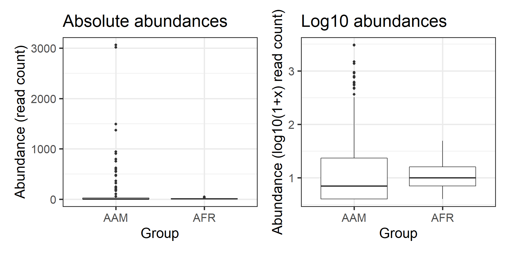
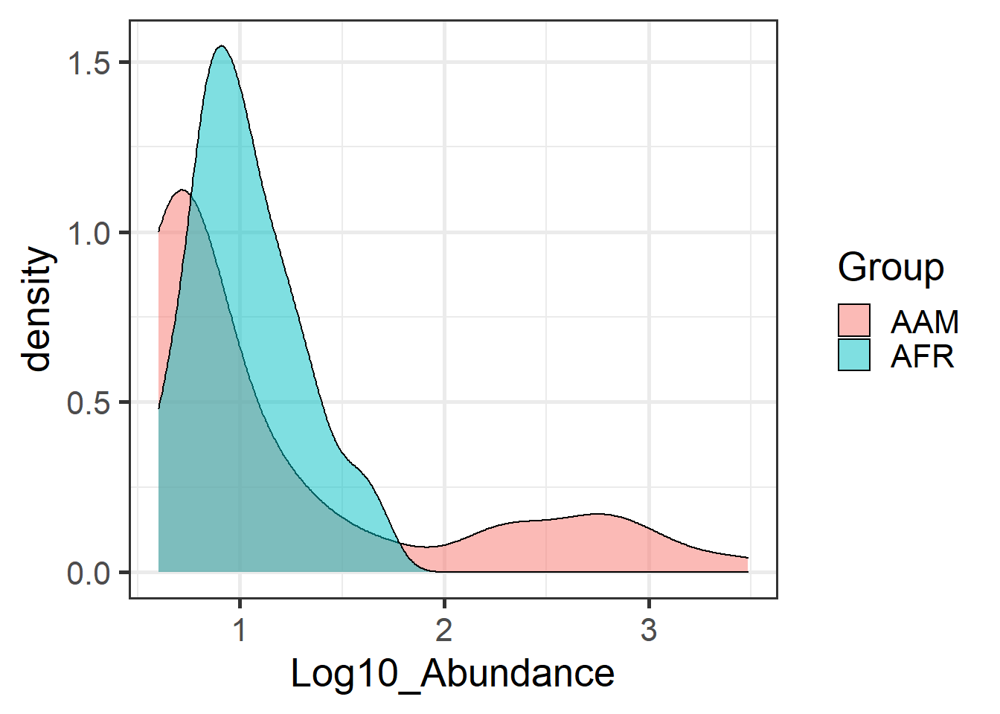
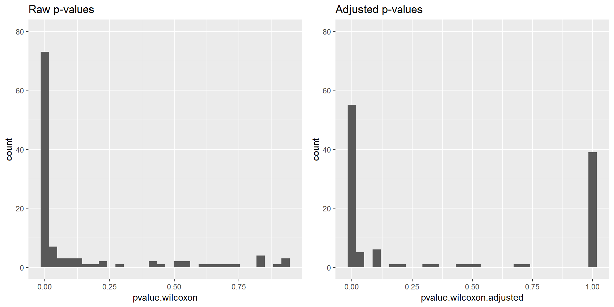
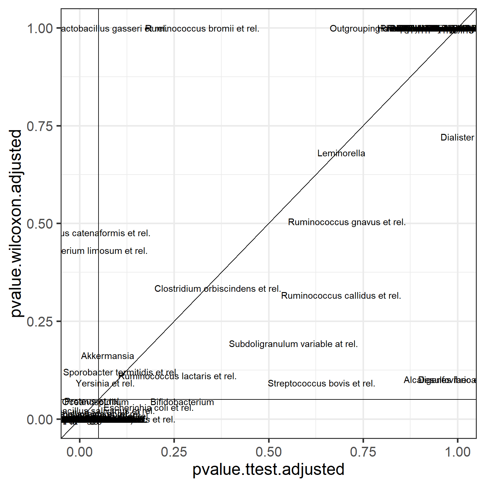
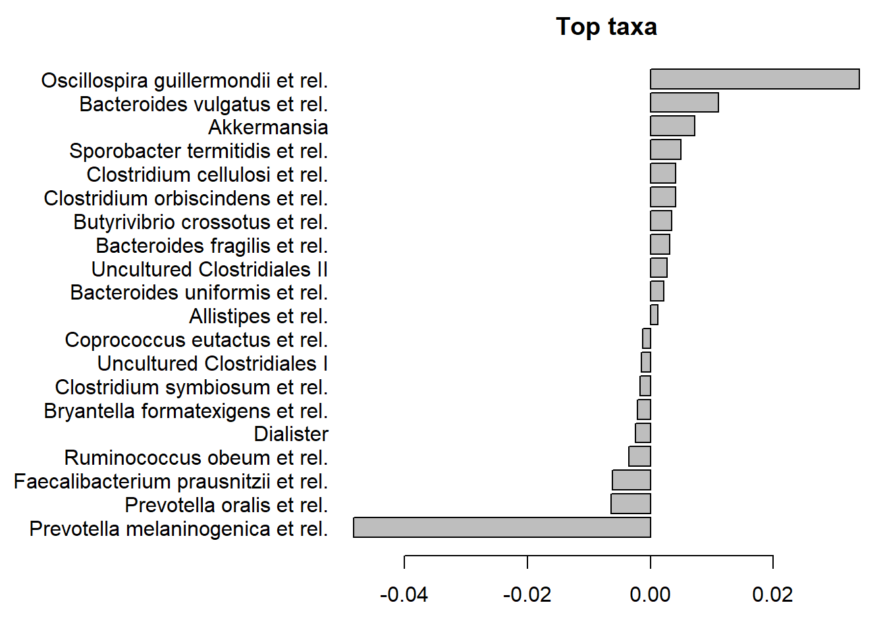

# Differential abundance testing for univariate data

This section covers basic univariate tests for two-group comparison,
covering t-test, Wilcoxon test, and multiple testing. You can try out the suggested exercises in the hands-on session. These are followed by example solutions which we will cover in more detail in the class.


## Load example data

The following example compares the abundance of a selected bug between
two conditions. We assume that the data is already properly
normalized. 


```r
library(microbiome)
theme_set(theme_bw(20))

data(dietswap)
d <- dietswap

# Pick microbial abundances for a given taxonomic group
taxa <- "Dialister"

# Construct a data.frame with the selected
# taxonomic group and grouping
df <- data.frame(Abundance = abundances(d)[taxa,],
                 Group = meta(d)$nationality)

library(knitr)
kable(head(df))
```

            Abundance  Group 
---------  ----------  ------
Sample-1          310  AAM   
Sample-2         1441  AFR   
Sample-3          356  AFR   
Sample-4         1528  AFR   
Sample-5          361  AFR   
Sample-6         2375  AFR   


## Visual comparison of two groups

**Task: Compare the groups visually** Tips: boxplot, density plot, histogram


Visualization of the absolute abundances is shown on the left. Let us try the log10 transformation.  Now, the data contains many zeros and taking log10 will yield infinite values. Hence we choose the commonly used, although somewhat problematic, log10(1+x) transformation (right).


```r
library(ggplot2)
p1 <- ggplot(df, aes(x = Group, y = Abundance)) +
       geom_boxplot() +
       labs(title = "Absolute abundances", y = "Abundance (read count)")

# Let us add the log10(1+x) version:
df$Log10_Abundance <- log10(1 + df$Abundance)
p2 <- ggplot(df, aes(x = Group, y = Log10_Abundance)) +
       geom_boxplot() +
       labs(title = "Log10 abundances", y = "Abundance (log10(1+x) read count)")       

library(patchwork)
p1 + p2
```



## Statistical comparison of two groups

**Task: Test whether abundance differences are statistically significant between the two groups** Tips: t-test (t.test); Wilcoxon test (wilcox.test). Find information on how to use by typing help(t.test) or help(wilcox.test); or by looking for examples from the web.

The groups seem to differ. 
First, let us perform the t-test. This is based on Gaussian assumptions. Each group is expected to follow Gaussian distribution.

Significance p-value with t-test:


```r
print(t.test(Log10_Abundance ~ Group, data = df)$p.value)
```

```
## [1] 0.06032956
```

According to this, the abundances is not significantly different between the two groups (at  $p<0.05$ level).


## Investigate assumptions of the t-test

**Task: Assess whether the abundance data is Gaussian or log-normal within each group** You can use for instance histogram (hist) or density plots (plot(density())).

Now let us investigate the Gaussian assumption of the t-test in more
detail. Let us try another visualization; the density plot.


```r
p <- ggplot(df, aes(fill = Group, x = Log10_Abundance)) +
       geom_density(alpha = 0.5)
print(p)
```




Apparently, the data is not even approximately Gaussian distributed.  In such cases, a common procedure is to use non-parametric tests. These do not make assumptions of the data distribution but instead compare the ordering of the samples.


So, let us look at the significance p-value with Wilcoxon test (log10 data):


```r
print(wilcox.test(Log10_Abundance ~ Group, data = df)$p.value)
```

```
## [1] 0.01803111
```


But since the test is non-parametric, we can as well use the original absolute abundances; thelog transformation does not change sample ordering on which the Wilcoxon test is based. 

Let us verify that the absolute abundances yield the same p-value for Wilcoxon test:


```r
print(wilcox.test(Abundance ~ Group, data = df)$p.value)
```

```
## [1] 0.01803111
```


## Compare results between parametric and non-parametric tests

Let us compare how much the results would differ in the whole data
between t-test (parametric) and Wilcoxon test (non-parametric).To remove non-varying taxa that would demand extra scripting, let us for demonstration purposes now focus on core taxa that are observed in more than 20% of the samples with more than 3 reads.


```r
# Core taxa to be tested
test.taxa <- core_members(d, prevalence = 20/100, detection = 3)

# Calculate p-values with the two different methods for each taxonomic unit
pvalue.ttest <- c()
pvalue.wilcoxon <- c()
for (taxa in test.taxa) {
  # Create a new data frame for each taxonomic group
  df <- data.frame(Abundance = abundances(d)[taxa,],
                   Log10_Abundance = log10(1 + abundances(d)[taxa,]),  
                   Group = meta(d)$nationality)

  pvalue.ttest[[taxa]] <- t.test(Log10_Abundance ~ Group, data = df)$p.value
  pvalue.wilcoxon[[taxa]] <- wilcox.test(Abundance ~ Group, data = df)$p.value  
}
# Arrange the results in a data.frame
pvalues <- data.frame(taxon = test.taxa,
	              pvalue.ttest = pvalue.ttest,
                      pvalue.wilcoxon = pvalue.wilcoxon)

# Note that multiple testing occurs.
# We must correct the p-values.
# let us apply the standard Benjamini-Hochberg False Discovery Rate (FDR)
# correction
pvalues$pvalue.ttest.adjusted <- p.adjust(pvalues$pvalue.ttest)
pvalues$pvalue.wilcoxon.adjusted <- p.adjust(pvalues$pvalue.wilcoxon)
```


Compare the distribution of raw and adjusteed p-values.


```r
p1 <- ggplot(pvalues, aes(x = pvalue.wilcoxon)) +
        geom_histogram() +
        labs(title = "Raw p-values") +
	ylim(c(0, 80))

p2 <- ggplot(pvalues, aes(x = pvalue.wilcoxon.adjusted)) +
        geom_histogram() +
        labs(title = "Adjusted p-values") +
	ylim(c(0, 80))	

print(p1 + p2)
```




Now compare these adjusted p-values between t-test and Wilcoxon test. Let us also highlight the p = 0.05 intervals.


```r
p <- ggplot(data = pvalues,
         aes(x = pvalue.ttest.adjusted,
	     y = pvalue.wilcoxon.adjusted)) +
       geom_text(aes(label = taxon)) + 
       geom_abline(aes(intercept = 0, slope = 1)) +
       geom_hline(aes(yintercept = 0.05), shape = 2) +
       geom_vline(aes(xintercept = 0.05), shape = 2)
print(p)
```




# Linear models: the role of covariates

This section provides hands-on introduction to linear (and generalized linear) models.

**Task Fit linear model to compare abundance between the two groups.** You can use functions lm or glm, for instance.

## Fitting a linear model

Let us compare two groups with a linear model. We use Log10 abundances
since this is closer to the Gaussian assumptions than the absolute
count data. Fit a linear model with Gaussian variation as follows:


```r
res <- glm(Log10_Abundance ~ Group, data = df, family = "gaussian")
```


## Interpreting linear model output

Investigate the model coefficients:


```r
knitr::kable(summary(res)$coefficients, digits = 5)
```

               Estimate   Std. Error     t value   Pr(>|t|)
------------  ---------  -----------  ----------  ---------
(Intercept)     2.06864      0.01500   137.89729    0.00000
GroupAFR        0.08065      0.02246     3.59001    0.00041


The intercept equals to the mean in the first group:


```r
print(mean(subset(df, Group == "AAM")$Log10_Abundance))
```

```
## [1] 2.068637
```

The group term equals to the difference between group means:


```r
print(mean(subset(df, Group == "AFR")$Log10_Abundance) -
      mean(subset(df, Group == "AAM")$Log10_Abundance))
```

```
## [1] 0.080646
```


Note that the linear model (default) significance equals to t-test assuming equal variances.


```r
print(t.test(Log10_Abundance ~ Group, data = df, var.equal=TRUE)$p.value)
```

```
## [1] 0.0004077211
```


## Covariate testing

**Task: Investigate how sex and bmi affect the results. **

An important advantage of linear and generalized linear models, compared to plain t-test is that they allow incorporating additional variables, such as potential confounders (age, BMI, gender..):


```r
# Add a covariate:
df$sex <- meta(d)$sex
df$bmi_group <- meta(d)$bmi_group

# Fit the model:
res <- glm(Log10_Abundance ~ Group + sex + bmi_group, data = df, family = "gaussian")
```

We can even include interaction terms:


```r
res <- glm(Log10_Abundance ~ Group * sex * bmi_group, data = df, family = "gaussian")
kable(coefficients(res))
```

                                                 x
-------------------------------------  -----------
(Intercept)                              2.0812548
GroupAFR                                 0.0233341
sexMale                                  0.0090777
bmi_groupoverweight                     -0.0075846
bmi_groupobese                          -0.0203030
GroupAFR:sexMale                         0.0375102
GroupAFR:bmi_groupoverweight            -0.0467722
GroupAFR:bmi_groupobese                  0.1209742
sexMale:bmi_groupoverweight             -0.0295655
sexMale:bmi_groupobese                          NA
GroupAFR:sexMale:bmi_groupoverweight            NA
GroupAFR:sexMale:bmi_groupobese                 NA


For more examples on using and analysing linear models, see statmethods [regression](https://www.statmethods.net/stats/regression.html) and [ANOVA](See also [statmethods](https://www.statmethods.net/stats/anova.html) tutorials. **Try to adapt those examples on our microbiome example data data sets**.


# Advanced models for differential abundance

GLMs are the basis for advanced testing of differential abundance in
sequencing data. This is necessary, as the sequencing data sets
deviate from symmetric, continuous, Gaussian assumptions in many ways.

## Particular properties of taxonomic profiling data


### Discrete count data

Sequencing data consists of discrete counts:


```r
print(abundances(d)[1:5,1:3])
```

```
##                              Sample-1 Sample-2 Sample-3
## Actinomycetaceae                   11       67       21
## Aerococcus                          1        1        1
## Aeromonas                           1        1        1
## Akkermansia                      1167     6127     4235
## Alcaligenes faecalis et rel.       90      126      188
```

### Sparsity 

The data is sparse:


```r
hist(log10(1 + abundances(d)), 100)
```


### Rarity
 
Long tails of rare taxa:


```r
library(reshape2)
medians <- apply(abundances(d),1,median)/1e3
A <- melt(abundances(d))
A$Var1 <- factor(A$Var1, levels = rev(names(sort(medians))))
p <- ggplot(A, aes(x = Var1, y = value)) +
        geom_boxplot() +
	labs(y = "Abundance (reads)", x = "Taxonomic Group") +
	scale_y_log10()
	
print(p)
```


### Overdispersion

Variance exceeds the mean:


```r
means <- apply(abundances(d),1,mean)
variances <- apply(abundances(d),1,var)

# Calculate mean and variance over samples for each taxon
library(reshape2)
library(dplyr)
df <- melt(abundances(d))
names(df) <- c("Taxon", "Sample", "Reads")
df <- df %>% group_by(Taxon) %>%
             summarise(mean = mean(Reads),
	               variance = var(Reads))

# Illustrate overdispersion
library(scales)
p <- ggplot(df, aes(x = mean, y = variance)) +
       geom_point() +
       geom_abline(aes(intercept = 0, slope = 1)) +
       scale_x_log10(labels = scales::scientific) +
       scale_y_log10(labels = scales::scientific) +
       labs(title = "Overdispersion (variance > mean)")
print(p)
```


## Generalized linear models: a brief overview

Let us briefly discuss the ideas underlying generalized linear models.

The Generalized linear model (GLM) allows a richer family of
probability distributions to describe the data. Intuitively speaking,
GLMs allow the modeling of nonlinear, nonsymmetric, and nongaussian
associations. GLMs consist of three elements:

  - A probability distribution for the data (from exponential family)

  - A linear predictor targeting the mean, or expectation: $Xb$ 

  - A link function g such that $E(Y) = \mu = g^{-1}(Xb)$.

Let us fit Poisson with (natural) log-link just to demonstrate how
generalized linear models could be fitted in R. We fit the abundance
(read counts) assuming that the data is Poisson distributed, and the
logarithm of its mean, or expectation, is obtained with a linear
model. For further examples in R, you can also check the [statmethods website](https://www.statmethods.net/advstats/glm.html).


```r
# Load again the example data
d <- dietswap
df <- data.frame(Abundance = abundances(d)[taxa,],
                 Group = meta(d)$nationality)

res <- glm(Abundance ~ 1, data = df, family = "poisson")
```


Investigate the model output:


```r
knitr::kable(summary(res)$coefficients, digits = 5)
```

               Estimate   Std. Error    z value   Pr(>|z|)
------------  ---------  -----------  ---------  ---------
(Intercept)     5.02355      0.00544   922.6545          0


Note the link between mean and estimated coefficient ($\mu = e^{Xb}$):


```r
mean(df$Abundance)
```

```
## [1] 151.9505
```

```r
exp(coef(res))
```

```
## (Intercept) 
##    151.9505
```


## DESeq2: differential abundance testing for sequencing data

### Fitting DESeq2

[DESeq2 analysis]((https://genomebiology.biomedcentral.com/articles/10.1186/s13059-014-0550-8) accommodates those particular assumptions about
sequencing data. 


```r
# Start by converting phyloseq object to deseq2 format
library(DESeq2)
d <- dietswap # Phyloseq data
ds2 <- phyloseq_to_deseq2(d, ~ group + nationality)

# Run DESeq2 analysis (all taxa at once!)
dds <- DESeq(ds2)

# Investigate results
deseq.results <- as.data.frame(results(dds))
deseq.results$taxon <- rownames(results(dds))

# Sort (arrange) by pvalue and effect size
library(knitr)
deseq.results <- deseq.results %>%
                   arrange(pvalue, log2FoldChange)

# Print the result table
# Let us only show significant hits
knitr::kable(deseq.results %>%
               filter(pvalue < 0.05 & log2FoldChange > 1.5),
	     digits = 5)
```


   baseMean   log2FoldChange     lfcSE       stat   pvalue   padj  taxon                          
-----------  ---------------  --------  ---------  -------  -----  -------------------------------
 1870.08336          1.89495   0.12667   14.95965        0      0  Clostridium difficile et rel.  
 1015.44245          2.12453   0.18359   11.57241        0      0  Klebisiella pneumoniae et rel. 
 3335.72902          3.02549   0.28380   10.66044        0      0  Mitsuokella multiacida et rel. 
 1519.25023          1.60976   0.18026    8.93027        0      0  Enterobacter aerogenes et rel. 
 2848.86627          1.77112   0.22906    7.73226        0      0  Megasphaera elsdenii et rel.   
  321.24275          2.86529   0.37602    7.61997        0      0  Serratia                       
   19.97851          2.24305   0.31335    7.15820        0      0  Aquabacterium                  
  173.00079          1.80120   0.26252    6.86114        0      0  Haemophilus                    


### Comparison between DESeq2 and standard models

For comparison purposes, assess significances and effect sizes based on Wilcoxon test.


```r
test.taxa <- taxa(d)
pvalue.wilcoxon <- c()
foldchange <- c()
for (taxa in test.taxa) {
  # Create a new data frame for each taxonomic group
  df <- data.frame(Abundance = abundances(d)[taxa,],
                   Log10_Abundance = log10(1 + abundances(d)[taxa,]),
                   Group = meta(d)$nationality)
  # Calculate pvalue and effect size (difference beween log means)		 
  pvalue.wilcoxon[[taxa]] <- wilcox.test(Abundance ~ Group, data = df)$p.value
  foldchange[[taxa]] <- coef(lm(Log10_Abundance ~ Group, data = df))[[2]]
}
# Correct p-values for multiple testing
pvalue.wilcoxon.adjusted <- p.adjust(pvalue.wilcoxon)
```


```r
par(mfrow = c(1,2))
plot(deseq.results$padj, pvalue.wilcoxon.adjusted,
  xlab = "DESeq2 adjusted p-value",
  ylab = "Wilcoxon adjusted p-value",
  main = "P-value comparison")
abline(v = 0.05, h = 0.05, lty = 2)

plot(deseq.results$log2FoldChange, foldchange, 
  xlab = "DESeq2",
  ylab = "Linear model",
  main = "Effect size comparison")
abline(0,1)
```


For systematic comparisons between various methods for differential abundance testing, see [this paper](https://microbiomejournal.biomedcentral.com/articles/10.1186/s40168-017-0237-y).


# Multivariate comparisons of microbial community composition

The above examples focus on comparison per individual taxonomic group. Often, the groups are correlated and we are interested in comparing the overall community composition.

## PERMANOVA  

Permutational multivariate analysis of variance [further reading](https://onlinelibrary.wiley.com/doi/10.1002/9781118445112.stat07841). See also [statmethods](https://www.statmethods.net/stats/anova.html).


```r
library(vegan)
```

```
## Loading required package: permute
```

```
## Loading required package: lattice
```

```
## This is vegan 2.5-2
```

```r
pseq <- dietswap

# Pick relative abundances (compositional) and sample metadata 
pseq.rel <- microbiome::transform(pseq, "compositional")
otu <- abundances(pseq.rel)
meta <- meta(pseq.rel)

# samples x species as input
library(vegan)
permanova <- adonis(t(otu) ~ group,
               data = meta, permutations=99, method = "bray")

# P-value
print(as.data.frame(permanova$aov.tab)["group", "Pr(>F)"])
```

```
## [1] 0.02
```

## Checking the homogeneity condition  

Type `?betadisper` in R console for more information.  


```r
# Note the assumption of similar multivariate spread among the groups
# ie. analogous to variance homogeneity
# Here the groups have signif. different spreads and
# permanova result may be potentially explained by that.
dist <- vegdist(t(otu))
anova(betadisper(dist, meta$group))
```

```
## Analysis of Variance Table
## 
## Response: Distances
##            Df  Sum Sq   Mean Sq F value Pr(>F)
## Groups      2 0.01254 0.0062718  0.6663 0.5146
## Residuals 219 2.06137 0.0094126
```

```r
permutest(betadisper(dist, meta$group), pairwise = TRUE)
```

```
## 
## Permutation test for homogeneity of multivariate dispersions
## Permutation: free
## Number of permutations: 999
## 
## Response: Distances
##            Df  Sum Sq   Mean Sq      F N.Perm Pr(>F)
## Groups      2 0.01254 0.0062718 0.6663    999   0.54
## Residuals 219 2.06137 0.0094126                     
## 
## Pairwise comparisons:
## (Observed p-value below diagonal, permuted p-value above diagonal)
##         DI      ED    HE
## DI         0.49500 0.704
## ED 0.44195         0.285
## HE 0.69375 0.30498
```

We can also check which taxa contribute most to the community differences. Are these same or different compared to DESeq2?


```r
coef <- coefficients(permanova)["group1",]
top.coef <- coef[rev(order(abs(coef)))[1:20]]
par(mar = c(3, 14, 2, 1))
barplot(sort(top.coef), horiz = T, las = 1, main = "Top taxa")
```




# Further exercises

When done with the differential abundance testing examples, you can investigate the use of the following standard methods for microbiome studies. We are available to discuss and explain the technical aspects in more detail during the class.


## Compositionality

**Compositionality effect** compare the effect of CLR transformation (microbiome::clr) on microbiome analysis results. 1) Compare t-test and/or Wilcoxon test results between data that is transformed with compositional or clr transformation (see the function microbiome::transform); and/or 2) Prepare PCoA with Bray-Curtis distances for compositional data; and PCoA with euclidean distances for CLR-transformed data (microbiome::transform). For examples, see [microbiome tutorial](http://microbiome.github.io/microbiome/Landscaping.html).


## Redundancy analysis (RDA)

A very good overview of various multivariate methods used in microbial ecology is provided [here](http://www.wright.edu/~oleg.paliy/Papers/Paliy_ME2016.pdf). Read the Redundancy analysis (and possibly other) section. Next, try to perform simple redundancy analysis in R based on the following examples.

Standard RDA for microbiota profiles versus the given (here 'time')
variable from sample metadata (see also the RDA method in
phyloseq::ordinate)


```r
x <- transform(dietswap, "compositional")
otu <- abundances(x)
metadata <- meta(x)

library(vegan)
rda.result <- vegan::rda(t(otu) ~ factor(metadata$nationality),
                         na.action = na.fail, scale = TRUE)
```

Visualize the standard RDA output:


```r
plot(rda.result, choices = c(1,2), type = "points", pch = 15, scaling = 3, cex = 0.7, col = metadata$time)
points(rda.result, choices = c(1,2), pch = 15, scaling = 3, cex = 0.7, col = metadata$time)
pl <- ordihull(rda.result, metadata$nationality, scaling = 3, label = TRUE)
```


Test RDA significance:


```r
permutest(rda.result) 
```

Include confounding variables:


```r
rda.result2 <- vegan::rda(t(otu) ~ metadata$nationality + Condition(metadata$bmi_group + metadata$sex))
```


